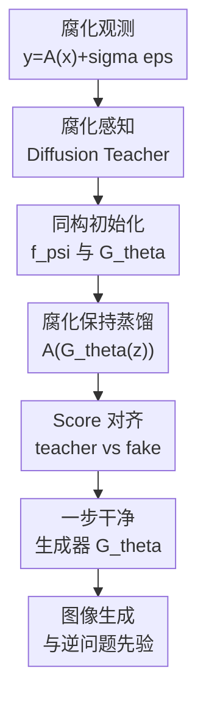

# Score Distillation Beyond Acceleration: Generative Modeling from Corrupted Data

**会议**: ICLR2026  
**OpenReview**: [https://openreview.net/forum?id=ROGCckKICU](https://openreview.net/forum?id=ROGCckKICU)  
**代码**: 有，TianyuCodings/RSD  
**领域**: 图像生成 / 扩散模型  
**关键词**: 腐化数据生成建模、Score Distillation、扩散模型、图像恢复、MRI  

## 一句话总结
这篇论文提出 Restoration Score Distillation，把只在腐化观测上训练的扩散 teacher 蒸馏成一步生成器，并发现蒸馏在腐化数据场景下不只是加速采样，还能显著把生成分布拉近干净图像分布。

## 研究背景与动机
**领域现状**：扩散模型已经是高质量图像生成和 inverse problem 中最常用的生成先验之一，但经典训练默认可以拿到干净样本 $x \sim p_X$。在真实科学成像和工程场景里，这个假设经常不成立：MRI 只有欠采样 k-space，天文观测只有受仪器和噪声影响的测量，图像修复任务里也可能只有模糊、遮挡、下采样或带噪版本。

**现有痛点**：Ambient Diffusion、Ambient Tweedie、Fourier-space Ambient Diffusion 等方法已经能让扩散模型从腐化数据 $y=A(x)+\sigma\epsilon$ 中学习，但它们通常仍然是多步 reverse process。更关键的是，teacher diffusion 即使经过 corruption-aware objective，也往往学到的是一个偏“扩散”的观测分布或近似干净分布：它需要覆盖由噪声和不可逆算子带来的大量可能区域，生成质量不一定接近真实干净分布。

**核心矛盾**：从腐化数据训练生成模型同时面临两个问题。第一，训练数据本身不是目标分布 $p_X$，而是 $p_Y$ 或某个由 $A$ 和噪声诱导出的观测分布。第二，扩散 teacher 的似然/score matching 训练倾向于覆盖所有 plausible modes，在噪声和缺失严重时容易把概率质量铺得太开。传统 score distillation 通常被看成压缩 teacher 的工具，但在这里，作者关心的是蒸馏能不能改变这个分布偏差。

**本文目标**：作者希望在完全没有干净图像的情况下，直接从腐化观测训练一个干净图像生成器。这个生成器要覆盖多种腐化：加性噪声、Gaussian blur、随机 inpainting、超分辨率下采样、Fourier 欠采样 MRI，并且最好一步采样即可输出高质量样本。

**切入角度**：论文的关键观察是，score distillation 的优化期望是在 student generator 自己产生的样本分布上计算，而不是在 teacher 覆盖的所有区域上计算。这种“只在自己会采样的位置对齐 teacher score”的机制，在腐化数据场景下可能天然具有去除 diffuse low-density 区域的效果，因此 student 可能不仅复制 teacher，还能比 teacher 更接近干净分布。

**核心 idea**：先训练一个理解腐化观测的 diffusion teacher，再把它通过保留同一腐化管线的 score distillation 蒸馏成一步生成器，让蒸馏过程同时承担“压缩采样步数”和“从腐化分布中提纯干净生成先验”的角色。

## 方法详解

### 整体框架
RSD 的输入是一批腐化观测 $\{y^{(i)}\}_{i=1}^N$，每个样本满足 $y=A(x)+\sigma\epsilon$，其中 $A$ 可以是 identity、blur、mask、downsampling 或 Fourier acquisition。方法分两阶段：第一阶段用适配 $A$ 的 corruption-aware diffusion objective 训练 teacher $f_\phi$；第二阶段把 teacher 蒸馏进一步生成器 $G_\theta$，并用同一个腐化管线处理 generator 输出，使 fake diffusion $f_\psi$ 和 teacher 在同一观测语义下对齐。

一个容易误解的点是：RSD 并不是先显式恢复每张训练图像，再拿恢复图像训练生成模型。它更像是在“测量空间可见的信息”和“teacher score field”之间搭桥。teacher 负责从腐化观测中学习可用的 score，student generator 则在蒸馏时被推向 teacher score 支持的高密度区域，最终输出 clean-looking samples。

### 关键设计
**1. 统一腐化观测建模：把 denoising、restoration 和科学成像放进同一个公式**

论文把训练数据写成 $y=A(x)+\sigma\epsilon$。当 $A=I$ 时，它退化成 noisy image generation / denoising；当 $A$ 是 blur、mask、downsampling 或 Fourier mask 时，它覆盖图像恢复和 MRI 等任务。这个形式的重要性在于，RSD 不把某一种腐化当特例写死，而是把“如何训练 teacher”抽象成可替换的 objective。

在第一阶段，作者根据场景选择不同 teacher 训练目标。无噪声腐化可以直接用 standard diffusion 学 $p_Y$；有加性噪声时用 noisy corruption objective；随机 inpainting 用带 mask 的 Ambient Diffusion 类目标；MRI 则用 Fourier-space masked objective。这让 RSD 更像一个框架，而不是一套只适用于单一噪声模型的算法。

**2. 腐化保持蒸馏：student 输出也必须经过同一条测量管线**

普通 score distillation 通常让 generator 产生 $x_\theta=G_\theta(z)$，再对加噪后的 $x_t$ 对齐 teacher 和 fake score。RSD 的关键改动是：在腐化数据场景下，generator 的输出不能直接拿去训练 fake diffusion，而要先施加和真实数据相同的腐化，形成 $\tilde y=A(\mathrm{stopgrad}(G_\theta(z)))+\sigma\epsilon$。fake diffusion $f_\psi$ 在这些 synthetic corrupted samples 上训练，teacher $f_\phi$ 则来自真实 corrupted samples。

这个设计解决的是语义对齐问题。如果真实 teacher 看过的是 $A(x)+\sigma\epsilon$，而 fake model 看的是未腐化的 $G_\theta(z)$，两边 score field 对齐的空间就不一致。RSD 强制 fake side 经过同一 corruption pipeline，相当于让 student 先学会“我的生成样本经过测量系统后应该像真实观测”，再通过 score distillation 更新 generator。

**3. 同一 objective 贯穿 teacher 和 fake diffusion：避免蒸馏目标漂移**

Algorithm 1 里一个很实用的约束是，Phase I 中用于 teacher 的 objective 和 Phase II 中用于 fake diffusion 的 objective 必须一致。比如 teacher 用 noisy corruption objective，fake diffusion 也要用 denoising-aware objective；teacher 用 random inpainting objective，fake diffusion 也要在 mask 语义下训练。作者明确指出混用 objective 会导致训练不稳定甚至发散。

这个约束看似工程细节，其实关系到 RSD 是否真正在对齐同一个分布族。如果 teacher 的 score 描述的是某种腐化观测的 time-dependent denoising field，而 fake diffusion 用另一种目标拟合 generator-induced distribution，那么蒸馏 loss 的两个端点会带有不同偏差，student 更新方向就不再可信。

**4. 蒸馏不只是加速：反向分布匹配带来质量提升**

论文采用 SiD 风格的 Fisher divergence distillation，形式上可以理解为让 teacher $f_\phi$ 和 fake diffusion $f_\psi$ 在 generator 诱导的样本附近对齐：

$$
L_{distill}(\theta)=\mathbb{E}_{\sigma_t,z,x_\theta=G_\theta(z)}\left[\|f_\phi(x_t,t)-f_\psi(x_t,t)\|_2^2\right].
$$

作者强调，这个目标的期望在 student generator 分布上取，而不是在真实 corrupted dataset 或 teacher 的全部支持上取。因此 teacher 为了覆盖噪声观测而保留的低密度区域，不一定会被 student 继续采样。直观上，teacher 给出“哪里像数据”的 score field，student 只需要把自己的概率质量放在高质量区域；这解释了为什么 RSD 在腐化数据上经常超过 teacher，而不是只复现 teacher。

### 一个完整示例
以随机 inpainting 为例，训练集里每张图只保留一部分像素，观测为 $y=Mx$，missing rate 可以高到 $p=0.9$。Phase I 先用 random-inpainting diffusion objective 训练 teacher：它看到的是 mask、被遮挡的图像，以及进一步随机遮挡后的输入，目标是在可观测位置上拟合原观测。这个 teacher 已经能从局部像素统计中学到一些 clean image prior，但采样仍是多步扩散，而且在严重缺失时生成质量有限。

Phase II 中，generator 从噪声 $z$ 一步产生候选干净图像 $G_\theta(z)$。RSD 不直接把这张图交给 fake diffusion，而是重新抽 mask，把它变成 $\tilde y=M G_\theta(z)$，模拟真实训练数据的腐化方式。fake diffusion 在这些 synthetic masked observations 上拟合 generator 当前诱导的观测分布；随后 distillation loss 比较 teacher 和 fake 的 score 差异，并更新 $G_\theta$。当这个过程收敛时，generator 输出的图像经过 mask 后像真实观测，未被 mask 的完整图像又集中在 teacher score 支持的高质量 clean-image manifold 上。

这个例子也解释了为什么 RSD 的收益在 corrupted-data regime 下比 clean-data distillation 更明显。clean-data teacher 本身已经接近目标分布，student 很难大幅超越；而 random inpainting teacher 面对的是不完整观测，分布更 diffuse，student 的 mode-seeking 蒸馏更容易去掉模糊和不确定区域。

### 损失函数 / 训练策略
RSD 的训练分为 teacher pretraining 和 distillation 两段。teacher pretraining 的损失由腐化类型决定：standard diffusion loss $L_{SD}$ 适合无噪声或直接建模观测分布；noisy corruption loss $L_N$ 用已知噪声水平 $\sigma$ 修正 denoising target；random inpainting loss $L_{RI}$ 只在可观测 mask 区域计算误差；Fourier-space objective 则把 measurement consistency 放到频域。

蒸馏阶段使用 SiD 作为默认 loss。实现上，$f_\psi$ 和 $G_\theta$ 都从 teacher 初始化，并共享相近网络结构，这有助于稳定训练。Algorithm 1 还特别提醒：更新 $\theta$ 时不要再额外注入随机腐化噪声；生成器更新使用 $y_\theta=A(G_\theta(z))$ 进入 distillation loss，而 fake diffusion 的训练样本才是 stop-gradient 后的 $\tilde y$。这个分工避免了 generator 更新时噪声路径过多导致梯度目标混乱。

论文还提出 Proximal FID 作为无干净验证集时的模型选择指标。具体做法是从当前 generator 生成 50k 张 clean samples，再施加同样的 $A$ 和 $\sigma$ 变成 corrupted samples，最后和 corrupted training set 计算 FID。虽然它不是 true clean FID，但实验显示它能较好跟踪 true FID，并选到接近最优的 checkpoint。

## 实验关键数据

### 主实验
论文的实验覆盖三类场景：纯 denoising、一般图像腐化、科学 MRI。评价指标以 FID 为主，另补充 IS、Precision、Recall、KID、PSNR、SSIM、LPIPS 等。最重要的结论是，在没有干净图像的 zero-shot corrupted-data 设置下，RSD 通常同时优于 teacher diffusion 和部分 few-shot baseline。

| 任务 / 数据集 | 指标 | RSD | 主要 teacher / baseline | 提升 |
|--------|------|------|----------|------|
| CIFAR-10 denoising, $\sigma=0.2$ | FID↓ | 4.77 | Teacher-Truncated 12.21 / Teacher-Consistency 11.93 | 明显优于 teacher，并接近 clean-data DDPM 4.04 |
| CelebA-HQ denoising, $\sigma=0.2$ | FID↓ | 6.48 | Teacher-Truncated 13.90 / Teacher-Consistency 12.97 | 约减半 FID |
| FFHQ denoising, $\sigma=0.2$ | FID↓ | 6.29 | Teacher-Truncated 14.67 | 生成质量显著提升 |
| AFHQ-v2 denoising, $\sigma=0.2$ | FID↓ | 5.42 | Teacher-Truncated 9.82 | 兼顾质量与覆盖 |
| CelebA-HQ super-resolution ×2, $\sigma=0.0$ | FID↓ | 12.99 | Teacher Diffusion 23.28 | 在恢复型腐化上也有效 |
| Multi-coil MRI, R=4 | FID↓ | 10.71 | Teacher Diffusion 32.31 / L1-EDM 27.64 | 科学成像场景提升更大 |

### 消融实验
| 配置 | 关键指标 | 说明 |
|------|---------|------|
| CIFAR-10 $\sigma=0.1$ RSD | FID 3.98, IS 9.346, Recall 0.578 | 低噪声时接近 clean-data generative baseline，且 recall 不低 |
| CIFAR-10 $\sigma=0.4$ RSD | FID 21.63 | 噪声很大时性能下降，但仍优于对应 teacher 的 124.28 |
| CelebA-HQ 数据量 10% | RSD FID 10.53 vs Teacher-Truncated 14.36 | 少量腐化数据下仍有 distillation gain |
| CelebA-HQ 数据量 100% | RSD FID 6.48 vs Teacher-Truncated 13.90 | 数据越多，RSD 收益更明显 |
| Distillation loss: SDS | FID > 200 | 默认超参下在 corrupted regime 明显不稳 |
| Distillation loss: DMD | CIFAR-10 $\sigma=0.2$ FID 7.48 | 可用但弱于 SiD |
| Distillation loss: SiD | CIFAR-10 $\sigma=0.2$ FID 4.77 | 本文默认选择，鲁棒性最好 |

### 关键发现
- 在 denoising 特例中，RSD 不是只比 full teacher 快，而是比 Teacher-Full、Teacher-Truncated、Teacher-Consistency 都更好；CIFAR-10 $\sigma=0.2$ 从 12.21/11.93 降到 4.77，是论文最有说服力的数字之一。
- 在一般腐化中，RSD 对无噪声和有噪声都有效，但严重 noisy + restoration 的难度明显更高。例如 CelebA-HQ Gaussian deblurring 在 $\sigma=0.2$ 时 RSD FID 为 76.98，仍优于 teacher 99.19，但不如 few-shot EM-Diffusion 51.33。
- MRI 实验说明 RSD 可以和 Fourier-space corruption-aware teacher 结合，并处理 complex-valued scientific data；R=2、4、6、8 下 RSD 都优于 teacher。
- Proximal FID 能在没有 clean validation set 时做 checkpoint selection。比如 FFHQ 上由 Proximal FID 选出的 true FID 为 6.12，而 oracle best true FID 是 6.08，差距很小。
- 效率收益非常直接：CIFAR-10 $\sigma=0.2$ 生成 50k 图像从 teacher 的约 10 分钟降到 RSD 的约 20 秒，约 30× speedup；distillation 约 4 小时即可超过 teacher，而 Phase I teacher pretraining 约 48 小时。

## 亮点与洞察
- 这篇论文最有价值的地方，是把 score distillation 从“压缩 diffusion sampler”重新解释成“腐化数据场景下的生成质量修正机制”。这比单纯报告一步采样更有意思，因为它解释了为什么 student 会超过 teacher。
- RSD 的框架化程度较高：不同腐化只需要替换 Phase I / fake diffusion 的 objective，蒸馏主干保持一致。这使它能自然覆盖 denoising、inpainting、super-resolution、MRI，而不是为每个任务写一套新算法。
- 腐化保持蒸馏是一个可迁移 trick。以后如果有别的 measurement process，例如 CT 投影、天文 interferometry、声学阵列测量，只要能 forward apply $A$，理论上都可以把 generator 输出重新投到 measurement domain 后蒸馏。
- Proximal FID 虽然简单，但很实用。没有 clean validation set 是 corrupted-data generation 的核心尴尬之一，作者用“生成后再腐化、和训练观测比 FID”的方式提供了一个可操作选择标准。
- 理论部分没有直接证明深度网络实验，但给出了一个线性高斯低秩例子，说明蒸馏全局最优可以比 noisy distribution 更接近 clean distribution。这至少支持了“distillation beyond acceleration”不是纯经验偶然。

## 局限与展望
- RSD 默认需要知道或能近似应用腐化算子 $A$。论文讨论了 unknown noise level $\sigma$ 的估计，但更复杂的 unknown operator 仍然是开放问题；如果 $A$ 估计偏差很大，corruption-respecting distillation 可能会把 generator 推向错误测量分布。
- Phase I teacher 仍然是计算瓶颈。RSD 让采样快了，也让 Phase II 相对高效，但如果每个新腐化/新数据集都要先训练一个强 teacher，总成本仍不低。
- 实验主要在图像和 MRI 上。论文声称适用于科学发现更广泛场景，但 EHT、地震、动态 CT 等更复杂 forward model 还没有实证验证。
- 蒸馏 loss 的选择依赖经验。SiD 默认超参表现最好，但 SDS、DMD 的弱表现可能部分来自未调参；未来可以研究专门面向 corrupted-data regime 的 distillation objective。
- 当前 conditional inverse problem 部分比较初步，只用了 latent optimization 这类直接方法。一步 generator 作为 prior 很有潜力，但如何做更稳定的条件采样、如何表达不确定性，还需要更系统的算法。

## 相关工作与启发
- **vs Ambient Diffusion**: Ambient Diffusion 直接从 masked / corrupted observations 学 clean distribution，重点在 corruption-aware diffusion training；RSD 把这类 teacher 当第一阶段，再通过蒸馏把质量和速度进一步提升。
- **vs Ambient Tweedie / noisy corruption diffusion**: 这些方法针对加性噪声构造更合适的 denoising objective；RSD 可以把它们作为 teacher objective，并在蒸馏阶段继续使用同一 denoising-aware objective。
- **vs EM-Diffusion**: EM-Diffusion 通过 E-step reconstruction 和 M-step model update 学 clean diffusion，且实验中依赖少量 clean images 初始化；RSD 不需要 clean images，训练逻辑也不是显式重建每个样本，而是 teacher + score distillation。
- **vs SiD / DMD / SDS**: 这些方法主要关注从 clean-data pretrained diffusion 蒸馏一步生成器；RSD 的区别是把 distillation 放进 corrupted-data-only training，并证明这种场景下 student 超过 teacher 的幅度更大。
- **启发**: 对很多 inverse problem 来说，与其只训练一个“会采样腐化观测”的 diffusion，不如进一步蒸馏一个 clean generator prior。这个 prior 后续可以用于不同条件任务，甚至作为可优化 latent prior 接入传统 data consistency 目标。

## 评分
- 新颖性: ⭐⭐⭐⭐☆ 把 score distillation 用作腐化数据生成建模的质量提升机制，视角明确且有统一框架。
- 实验充分度: ⭐⭐⭐⭐⭐ 覆盖 denoising、deblurring、inpainting、super-resolution、MRI、效率、loss、数据量和 model selection，实验面很完整。
- 写作质量: ⭐⭐⭐⭐☆ 主线清楚，图表和动机有说服力；但算法细节分散在正文和附录，第一次读需要来回对照。
- 价值: ⭐⭐⭐⭐⭐ 对科学成像、低质量数据生成建模和一步 diffusion prior 都有实际价值，尤其适合没有 clean ground truth 的场景。

<!-- RELATED:START -->

## 相关论文

- [\[ICML 2026\] Compositional Generative Modeling from Decentralized Data](../../ICML2026/image_generation/compositional_generative_modeling_from_decentralized_data.md)
- [\[ICLR 2026\] Gauge Flow Matching: Efficient Constrained Generative Modeling over General Convex Set and Beyond](gauge_flow_matching_efficient_constrained_generative_modeling_over_general_conve.md)
- [\[ICLR 2026\] Large Scale Diffusion Distillation via Score-Regularized Continuous-Time Consistency](large_scale_diffusion_distillation_via_score-regularized_continuous-time_consist.md)
- [\[ICLR 2026\] Partition Generative Modeling: Masked Modeling Without Masks](partition_generative_modeling_masked_modeling_without_masks.md)
- [\[ICLR 2026\] Continuously Augmented Discrete Diffusion model for Categorical Generative Modeling](continuously_augmented_discrete_diffusion_model_for_categorical_generative_model.md)

<!-- RELATED:END -->
