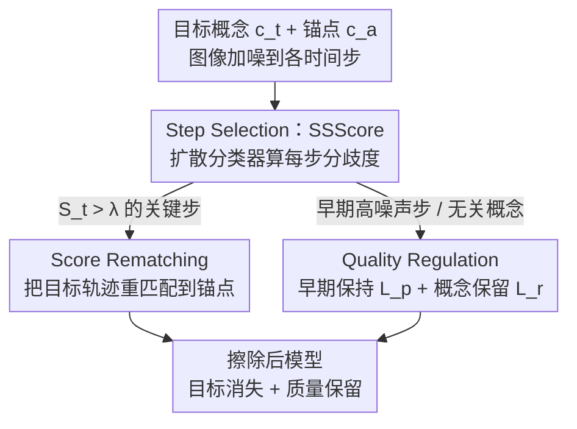

# SDErasure: Concept-Specific Trajectory Shifting for Concept Erasure via Adaptive Diffusion Classifier

**会议**: ICLR 2026  
**OpenReview**: [https://openreview.net/forum?id=EWM9JQ6gX7](https://openreview.net/forum?id=EWM9JQ6gX7)  
**领域**: 扩散模型 / 概念擦除  
**关键词**: 概念擦除, 文生图扩散, 去噪轨迹, 扩散分类器, 时间步选择

## 一句话总结
SDErasure 发现「每个概念的生成只依赖一小段关键去噪时间步」，于是用扩散分类器自适应地为每个待擦除概念挑出这些关键步，只在这些步上做轨迹偏移微调，再配上两路质量保护损失，在彻底擦除目标概念的同时把 MSCOCO FID 从 9.51 压到 6.74。

## 研究背景与动机

**领域现状**：文生图扩散模型容易记住并复现训练集里的 NSFW、版权画作、公众人物人脸等不良内容，概念擦除（concept erasure）就是把这些「不该生成的概念」从模型里抹掉，让相关提示词不再生成对应画面。主流的训练型方法（ESD、FMN、UCE、MACE 等）通过微调权重来实现较彻底的擦除。

**现有痛点**：训练型方法对原模型的参数分布扰动太大，带来两个维度的「过度侵入」——(1) 在被擦除概念下生成的图像知觉上变得畸形（related-concept quality 差）；(2) 在无关概念下生成的图像质量明显退化（unrelated-concept fidelity 差）。换句话说，为了擦掉一只猫，连带把模型整体的生成能力都伤了。

**核心矛盾**：作者把根因归结为「用一套统一策略去擦除所有概念，忽略了每个概念各自的生成机制」。现有方法在**全部时间步**上一律施加擦除，等于无差别地破坏整条去噪轨迹。

**切入角度**：作者观察去噪轨迹后发现一个关键事实——不同概念在去噪过程中诞生于不同的关键时间步：结构性概念（飞机、教堂）在高噪声阶段（早期步）就被决定，而细粒度语义（人脸身份、画家风格）在低噪声阶段（晚期步）才浮现。图 1 用「cat」做实验证明：只有在中段步擦除才能既去掉猫又保住整体结构，早段/全段擦除会扭曲结构，晚段擦除则擦不干净。而且最佳擦除时机因概念而异——「Airplane」要早期干预，「Elon Musk」要晚期干预。

**核心 idea**：与其在所有步上一刀切，不如**自适应地为每个概念定位它真正诞生的那几个关键时间步，只在那里做轨迹偏移**，从而精准、最小侵入地擦除。但手工为每个概念指定时间步又不实用，所以需要一个自动选步算法——这正是 SDErasure 用扩散分类器做的事。

## 方法详解

### 整体框架

SDErasure 要解决的是「在哪几步擦、怎么擦、擦完怎么保质量」三件事。整条流程是：给定一个待擦除的目标概念 $c_t$ 和一个锚点概念 $c_a$（替代概念，把模型从目标引开；置空则退化为 anchor-free 擦除），先把目标概念图像加噪到各个时间步，让冻结的原模型在「目标」与「锚点」两种文本条件下分别预测噪声，用扩散分类器算出每一步的 **Step Separability Score（SSScore）**；SSScore 高的步说明目标与锚点的去噪轨迹在此处分歧最大，是擦除的关键步。只在这些 $S_t>\lambda$ 的关键步上施加 **Score Rematching** 损失，把目标概念的去噪轨迹「重匹配」到锚点轨迹上，实现轨迹偏移。同时用 **Quality Regulation**（早期保持 $L_p$ + 概念保留 $L_r$）双路兜底：早期高噪声步保持原预测以护住整体结构，无关概念保持原预测以护住其它内容。整个训练是自对比（self-contrastive）的——冻结的原模型给被微调模型当监督。

### 关键设计

**1. Step Selection 与 SSScore：用扩散分类器自动定位每个概念的关键去噪步**

这一步直接回应「最佳擦除时机因概念而异、手工指定不实用」的痛点。核心洞察是：扩散模型本身就能当分类器（Li et al. 2023）——把噪声预测误差当作对数似然的近似，$\log p(x_t\mid c)\approx -L_t^{(c)}+C$，其中 $L_t^{(c)}=\lVert \epsilon_\theta(x_t,t,c_t)-\epsilon\rVert_2^2$ 是目标条件下的噪声预测误差，$L_t^{(a)}$ 是锚点条件下的误差。作者从两个角度刻画「目标与锚点在第 $t$ 步分歧多大」：几何上，噪声预测与 score function 成正比（$\nabla_{x_t}\log p_\theta(x_t\mid c)\approx -\frac{1}{\sqrt{1-\bar\alpha_t}}\epsilon_\theta(x_t,t,c)$），$L_t^{(a)}$ 与 $L_t^{(c)}$ 差得越大说明两个概念的生成向量场指向越不同，轨迹在此处发生关键分叉；概率上，把这两个误差通过贝叶斯归一化成一个瞬时后验概率，即 SSScore：

$$S_t = \frac{p(c_t\mid x_t)}{p(c_t\mid x_t)+p(c_a\mid x_t)} \approx \frac{\exp(-L_t^{(c)})}{\exp(-L_t^{(c)})+\exp(-L_t^{(a)})}.$$

$S_t$ 高意味着模型在该步能高置信地把目标和锚点区分开，也就是目标概念的轨迹已从锚点轨迹中解耦——正是做精准擦除、最小附带损伤的最佳干预点。所有满足 $S_t>\lambda$ 的步被选为擦除步。关键是 SSScore 只需在训练前算一次（one-time pre-processing），不增加训练/推理的重复开销，却把「该擦哪几步」从手工经验变成了概念自适应的自动决策。

**2. Score Rematching：把目标概念的去噪轨迹重匹配到锚点轨迹上**

选好关键步后，要在这些步上真正「擦」。作者采用自对比微调，主目标是让目标概念条件下的噪声预测对齐到锚点条件下的预测：$L_a=\lVert \epsilon_\theta(x_t,c_t,t)-\epsilon_{\theta^*}(x_t,c_a,t)\rVert_2^2$。为进一步增强擦除力度，再引入一个负向引导项 $\sigma(x_t,c_t,c_a,t)=\epsilon_{\theta^*}(x_t,c_t,t)-\epsilon_{\theta^*}(x_t,c_a,t)$，它刻画原模型下从目标到锚点的概念轨迹偏移方向，用来把噪声预测进一步推离目标、推向锚点。最终的 Score Rematching 损失为：

$$L_e = \lVert \epsilon_\theta(x_t,c_t,t) - [\epsilon_{\theta^*}(x_t,c_a,t) - \eta\,\sigma(x_t,c_t,c_a,t)]\rVert_2^2.$$

这个设计的好处是统一了两种擦除模式：当锚点 $c_a$ 置空时退化为 anchor-free 的「擦除」（让概念消失为语义无关内容），当指定具体锚点时则是 anchor-based 的「替换/改写」（把目标概念变成锚点概念）；擦除强度由超参 $\eta$ 灵活控制。相比 ESD 在全步上做负向引导，这里只在 SSScore 选出的关键步上偏移轨迹，从源头上避免了对其它数据流形的无差别破坏。

**3. Quality Regulation：早期保持 + 概念保留，两路兜住生成质量**

只擦关键步还不够，作者用两项损失分别护住前述两个质量维度。第一是 early-preserve 损失 $L_p$：实验观察到在很早的去噪步（如 $45<t<50$，即最高噪声阶段）不同概念会趋同，因为此时扩散主要把样本导向「自然图像流形」，在这里干预会破坏整条通用轨迹、产生质量崩塌和 OOD 伪影。于是 $L_p=\lVert \epsilon_\theta(x_{t^*},c_t,t^*)-\epsilon_{\theta^*}(x_{t^*},c_t,t^*)\rVert_2^2$（$t^*$ 为早期高噪声步）强制这些步上目标概念的预测与原模型一致，把擦除推迟到概念细节真正显现的更晚步去做，守住 related-concept quality。第二是 concept-retain 损失 $L_r=\lVert \epsilon_\theta(x_t,c_r,t)-\epsilon_{\theta^*}(x_t,c_r,t)\rVert_2^2$，对需要保护的无关概念 $c_r$ 强制擦除前后噪声预测一致，守住 unrelated-concept fidelity。两路都用原模型 $\theta^*$ 当监督，与擦除损失形成「擦一边、护两边」的自对比结构。

### 损失函数 / 训练策略

总目标把擦除损失与两项质量正则组合：

$$L_o = L_e + \beta_1 L_r + \beta_2 L_p,$$

其中 $\beta_1,\beta_2$ 平衡质量保护与主擦除目标。训练采样三组带噪 latent 各司其职：$S_t>\lambda$ 的关键步 latent 喂给 $L_e$ 压制目标概念；早期高噪声步 latent 喂给 $L_p$ 保结构质量；无关概念 latent 喂给 $L_r$ 保无关保真度。整体是自对比微调，冻结原模型为被微调模型提供监督信号。

## 实验关键数据

在 SD v1.4 上覆盖四类擦除任务：物体擦除（CIFAR-10 类别）、名人擦除、艺术风格擦除、露骨内容擦除，对比 ESD / FMN / UCE / MACE / RECE / SPEED / ANT 等 SOTA。评测三性质：efficacy（擦得干不干净，CLIP Score 越低越好）、specificity（无关概念保持，FID / LPIPS）、generality（对同义改写的鲁棒性）。

### 主实验

| 任务 | 指标 | SDErasure | 之前 SOTA | 说明 |
|--------|------|------|----------|------|
| 名人擦除（擦 Elon Musk）| MSCOCO FID↓ | **7.60** | 12.56 (ANT) | 通用生成质量保护远好于对手 |
| 名人擦除（擦 Taylor Swift）| MSCOCO FID↓ | **6.49** | 11.85 (UCE) | FID 大幅领先 |
| 名人擦除 邻近概念 | LPIPS↓ | **0.239~0.357** | 0.42+（多数对手） | 对语义相邻概念扰动最小 |
| CIFAR-10 物体擦除 | 调和均值 $H_0$↑（平均）| **95.33** | 92.78 (MACE) | 多数类别取得最高 $H_0$ |
| 艺术风格擦除（Van Gogh）| MSCOCO FID↓ | **7.02** | 7.49 (SPEED) | 擦除与质量的更优权衡 |
| 露骨内容擦除 | i2p 检出数↓ / FID↓ | 49 / **16.92** | ANT 23 但 FID 41.25 | 第二低检出却保住质量 |

名人擦除里 SDErasure 一致拿到最低 FID 和最低邻近概念 LPIPS，说明它在彻底擦除的同时几乎不动其它身份的生成；露骨内容擦除上 ANT 检出数最低（23）却以 FID 飙到 41.25 为代价，SDErasure 用 49 的检出换来 16.92 的 FID，把「内容安全」与「生成质量」真正调和到一起。

### 消融实验

| 配置 | CLIP↓ | MSCOCO FID↓ | 说明 |
|------|------|------|------|
| Baseline（无正则）| 10.27 | 8.05 | 只有擦除损失 |
| + $L_p$ | 10.83 | 7.39 | 加早期保持，FID 降 0.66 |
| + $L_r$ | 10.47 | 7.06 | 加概念保留，FID 降 0.99 |
| Ours（+ $L_p$ + $L_r$）| 10.91 | **6.65** | 两路齐上，FID 从 8.05 降到 6.65 |

阈值 $\lambda$ 消融（0→1，步长 0.1，共 11 组）：$\lambda=0$ 等价于全步均匀采样训练，擦除和质量都更差；$\lambda=1$ 只选 SSScore 最高的单步，也不如选一组步好；$\lambda\in[0.5,0.8]$ 取得最佳权衡，$\lambda=0.8$ 整体最优。作为对照，随机选 5 个步微调会带来显著更高的 FID，反证了 SSScore 引导选步的价值。

锚点选择消融（CIFAR-10）：随机锚点平均 $H_0=90.21$、置空锚点 $H_0=88.17$，而 SDErasure 的启发式锚点 $H_0$ 进一步更高，说明锚点选择策略本身也有贡献。

### 关键发现
- **质量保护两路都有效且互补**：单独加 $L_p$ 或 $L_r$ 都能降 FID，合起来从 8.05 降到 6.65，是 SDErasure 把擦除做得「不伤模型」的关键。
- **选步是核心增益来源**：$\lambda=0$（全步均匀）和随机选 5 步都明显更差，证明「擦哪几步」比「擦多少」更重要；SSScore 把人工经验自动化。
- **擦除强度与质量需平衡**：SDErasure 的目标概念 CLIP 并非全场最低（擦得不是最狠），但因为保住了颜色、姿态等低频属性，整体权衡最优——擦除不是越狠越好。

## 亮点与洞察
- **「每个概念只活在几步里」这个观察很硬**：把概念擦除从「全轨迹无差别破坏」重构为「定点轨迹偏移」，是方法有效的根。结构概念在高噪声步、细粒度概念在低噪声步诞生，这条规律本身就值得迁移到其它需要定点干预扩散轨迹的任务（如可控编辑、风格注入）。
- **复用扩散分类器做选步，零额外训练**：SSScore 把噪声预测误差直接当对数似然代理算瞬时后验，一次预处理就定位关键步，几乎没有额外成本——这种「拿模型自身当探针」的思路很巧。
- **一个损失统一擦除与替换**：Score Rematching 靠锚点置空与否在 anchor-free 擦除和 anchor-based 改写之间无缝切换，工程上很省事。
- **早期步不能碰**：$45<t<50$ 这种最高噪声阶段对应「自然图像流形收敛区」，在这里乱动会出 OOD 伪影——这个边界经验对所有做扩散微调的人都有警示意义。

## 局限与展望
- 方法依赖一个合理的锚点概念，锚点选择虽有启发式规则但仍是人工设计的一环，自动锚点发现还没解决。
- SSScore 选步基于「目标 vs 锚点」的瞬时后验，对于难以找到清晰锚点、或多个概念高度纠缠的情形，关键步是否依然可分离有待验证。
- 实验主要在 SD v1.4（UNet 架构）上，没在 flow-based transformer（如 SD3、FLUX）上验证，跨架构泛化性未知。
- 阈值 $\lambda$、强度 $\eta$、$\beta_1/\beta_2$ 等超参不少，虽给出推荐区间，但跨任务/概念是否稳定需更多数据支撑。

## 相关工作与启发
- **vs ESD**：ESD 用负向引导损失在**所有时间步**上一律擦除，导致参数扰动大、质量退化；SDErasure 只在 SSScore 选出的关键步上做轨迹偏移，并保留了 ESD 的负向引导思路（$\sigma$ 项），把它从「全步」收窄到「关键步」。
- **vs UCE**：UCE 是闭式编辑，直接改 cross-attention 矩阵把目标对齐到无关概念，擦除强但保真度仍有明显下降；SDErasure 走训练型路线，靠双路质量正则把 FID 压得更低。
- **vs ANT**：ANT 也注意到去噪轨迹，提出在「中到晚期」阶段擦除以避免轨迹失控，但对所有概念用同一套阶段，忽略了概念间的差异；SDErasure 进一步做到**每个概念自适应选步**，这也是它在露骨内容擦除上能兼顾检出与 FID（ANT 的 FID 高达 41.25）的根本区别。

## 评分
- 新颖性: ⭐⭐⭐⭐⭐ 「概念诞生于特定关键步 + 扩散分类器自动选步」这一框架在概念擦除里属于角度新且自洽。
- 实验充分度: ⭐⭐⭐⭐ 四类任务 + 多基线 + 阈值/锚点/正则三组消融较完整，但限于 SD v1.4 单架构。
- 写作质量: ⭐⭐⭐⭐ 几何与概率双视角推导 SSScore 讲得清楚，图 1/图 2/图 3 配合到位。
- 价值: ⭐⭐⭐⭐⭐ 把 FID 从 9.51 降到 6.74、擦除与质量真正调和，对负责任的文生图落地很实用。

<!-- RELATED:START -->

## 相关论文

- [\[ICLR 2026\] SPEED: Scalable, Precise, and Efficient Concept Erasure for Diffusion Models](speed_scalable_precise_and_efficient_concept_erasure_for_diffusion_models.md)
- [\[AAAI 2026\] Mass Concept Erasure in Diffusion Models with Concept Hierarchy](../../AAAI2026/image_generation/mass_concept_erasure_in_diffusion_models_with_concept_hierarchy.md)
- [\[ICLR 2026\] Localized Concept Erasure in Text-to-Image Diffusion Models via High-Level Representation Misdirection](localized_concept_erasure_in_text-to-image_diffusion_models_via_high-level_repre.md)
- [\[ICLR 2026\] AEGIS: Adversarial Target-Guided Retention-Data-Free Robust Concept Erasure from Diffusion Models](aegis_adversarial_target-guided_retention-data-free_robust_concept_erasure_from_.md)
- [\[ICML 2026\] Orthogonal Concept Erasure for Diffusion Models](../../ICML2026/image_generation/orthogonal_concept_erasure_for_diffusion_models.md)

<!-- RELATED:END -->
