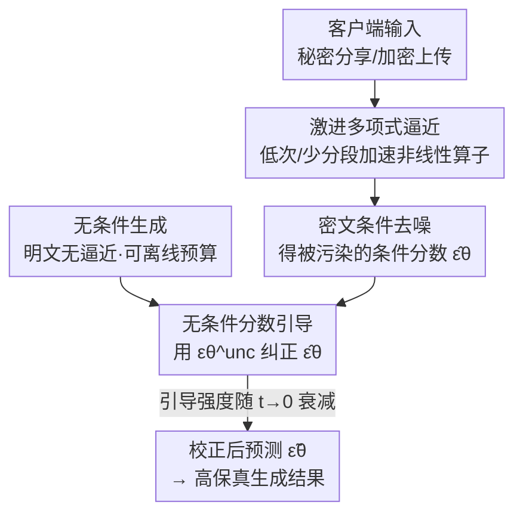

# Secure Inference for Diffusion Models via Unconditional Scores

**会议**: ICLR 2026  
**OpenReview**: [https://openreview.net/forum?id=6t9YPOZH0w](https://openreview.net/forum?id=6t9YPOZH0w)  
**代码**: 无  
**领域**: 扩散模型 / 隐私保护推理  
**关键词**: 安全推理, 扩散模型, 多项式逼近, 分数引导, 无条件生成

## 一句话总结
针对扩散模型在安全多方计算（MPC）下推理太慢的问题，本文用更激进的低次多项式逼近来加速非线性算子，再用「在明文里无误差跑出的无条件分数」去纠正被逼近误差污染的条件分数，从而在几乎不增加开销的前提下把激进逼近导致的画质损失大幅找回。

## 研究背景与动机
**领域现状**：扩散模型（Stable Diffusion、DALL·E 等）被越来越多地用在医疗、内容创作这类隐私敏感场景。但生成开销大，必须把输入送到远端服务器算，于是用户的输入（病人影像、提示词）和输出（CT、增强图）都暴露给了模型提供方。要同时保护「用户数据」和「模型权重」，业界用全同态加密（FHE）和安全多方计算（MPC）做隐私保护推理。

**现有痛点**：FHE/MPC 的瓶颈在非线性算子（SiLU、GeLU、softmax 里的 exp），这些算子在密文域里极慢。CipherDM 第一个把 MPC 引入扩散模型，办法是用多项式去逼近这些非线性函数；这确实降了延迟，但画质显著下降，而且延迟仍远高于明文执行——说明还得继续加速。

**核心矛盾**：加速和画质之间存在直接 trade-off。想更快就得用更激进的逼近（更低多项式次数、更少分段），但逼近误差会沿着 50 步去噪过程不断累积，把分数（score）一步步推离真实分布，最终生成模糊、结构错乱的图（羊长出多余的腿、该画女婴却画成玩具熊）。

**本文目标**：在采用「更激进逼近」换取额外加速的同时，不让画质垮掉。子问题拆成两个：(1) 探明把多项式次数/分段降到什么程度能省多少延迟；(2) 如何在推理时把逼近造成的分数污染纠正回来。

**切入角度**：作者的关键观察是——**无条件生成可以完全在明文里跑、不需要任何逼近**，因此它给出的是一个无误差、高保真的分数方向。既然条件分支因为提示词 $y$ 被加密、只能在密文里用逼近算出（被污染），那就借明文里干净的无条件分数当「校正罗盘」，把被污染的条件分数拉回正轨。

**核心 idea**：不去降低逼近误差本身，而是用「明文无条件分数」作为引导信号，在推理时纠正被激进逼近污染的条件分数（score-correction guidance）。

## 方法详解

### 整体框架
方法解决的是「激进逼近加速了密文推理、但条件分数被污染导致画质垮掉」这件事，整体思路是：把昂贵的密文条件去噪继续用激进逼近跑（容忍它有误差），同时在明文里廉价地跑一条无条件去噪（完全无逼近、可离线预算好），再每一步用无条件分数去把被污染的条件分数纠偏。

客户端把输入经秘密分享/同态加密安全送到服务器；服务器在密文域执行去噪，其中非线性函数用激进的低次多项式逼近，得到一个被污染的条件 $\epsilon$ 预测 $\hat{\epsilon}_\theta$；与此并行，无条件生成在明文里跑出干净的 $\epsilon^{unc}_\theta$；最后用一个「分数引导」项把两者结合，得到校正后的预测 $\tilde{\epsilon}_\theta$ 再做这一步去噪，引导强度随时间步衰减。

### 关键设计

**1. 更激进的多项式逼近：把加速空间榨到底**

以往工作（如 BumbleBee）为了保画质，给 SiLU/GeLU/exp 用较高次、较多分段的「精确逼近」，密文延迟仍很高。本文反其道而行，先系统测量「把次数/分段降下去」能换来多少加速：在 2PC 设置下，他们把 SiLU 与 GeLU 的分段从 4 段降到 3 段、把 GeLU 多项式从 6 次降到 4 次、对 softmax 里的 exp 在第二段用 4 次多项式。以 SiLU 为例，精确逼近把输入域切成四段（$[-8,-4)$ 用 2 次、$[-4,4)$ 用 6 次、两端裁成常数/线性），而宽松逼近 `Loose-SiLU` 简化成三段、中间段用单个 8 次多项式覆盖 $[-5.4,4)$：

$$\text{Loose-SiLU}(x)=\begin{cases}0, & x<-5.4\\ c_8x^8+\cdots+c_1x+c_0, & -5.4\le x<4\\ x, & x\ge 4\end{cases}$$

这样在 2PC 下算子级延迟降 14.05–35.60%、通信量降 13.51–33.33%。代价是逼近误差涨了 2.55–26.25×，单独使用会让画质明显劣化——这正是后两个设计要补救的。

**2. 无条件分数引导：用明文里干净的分数把条件分数拉回真实分布**

这是全文核心，针对的就是「条件分数被逼近误差污染」这一痛点。作者想让条件分数向「无逼近生成所对应的潜在分布」对齐。形式上引入一个隐式判别器，判断样本是来自「无逼近生成」（标签 $o$）还是「有逼近生成」（标签 $\hat{o}$）：$D_{im}(z_t)=p(o|z_t)/p(\hat{o}|z_t)$。最大化「被判为无逼近生成」的似然，对其目标求梯度并用贝叶斯法则展开，再借 Tweedie 公式把分数换成 $\epsilon$ 预测，得到修正后的 $\epsilon$：

$$\tilde{\epsilon}_\theta(z_t,t)=\epsilon_\theta(z_t,t)+\gamma_t\big(\epsilon_\theta(z_t,t)-\hat{\epsilon}_\theta(z_t,t)\big)$$

其中 $\epsilon_\theta$ 是无逼近预测、$\hat{\epsilon}_\theta$ 是有逼近预测，二者之差正是「逼近误差方向」，把它按 $\gamma_t$ 加回去就抵消了污染。但条件分支里提示词 $y$ 被加密，无法在密文里无逼近地算 $\epsilon_\theta(z_t,y,t)$。**关键替换**：用无条件分数 $\epsilon^{unc}_\theta(z^{unc}_t,t)$ 顶替那个拿不到的干净条件分数，并叠加 classifier-free guidance：

$$\tilde{\epsilon}_\theta(z_t,z^{unc}_t,y,t)=\hat{\epsilon}^{cfg}_\theta(z_t,y,t)+\gamma_t\big(\epsilon^{unc}_\theta(z^{unc}_t,t)-\hat{\epsilon}_\theta(z_t,y,t)\big)$$

之所以可行，是因为无条件生成不依赖加密的 $y$，可以整段在明文里跑、甚至离线预算好缓存复用，因此引导信号的额外开销只是每步一次减法、一次加法、一次标量乘——几乎可忽略。

**3. 引导强度随时间步衰减：别让无条件分数破坏提示词对齐**

无条件分数有一个隐患：它不带提示词信息，一直强引导会削弱与文本的对齐（prompt alignment）。而去噪越接近 $t=0$、信噪比越高，此时若还被无条件方向拉扯，反而有害。为此作者让引导强度随着 $t\to0$ 逐渐减小，取 $\gamma_t=\eta w_t$，其中 $w_t=\sigma_t/\bar{\alpha}_t$，所有实验固定 $\eta=0.1$。这样早期（高噪声、语义未定）多借无条件分数纠偏，后期（细节成形）让条件分支主导，从而在纠正分数漂移的同时保住 CLIP-Score 不掉。

### 损失函数 / 训练策略
本方法是**纯推理期（test-time）**的引导策略，不需要任何微调或重训——直接用预训练 Stable Diffusion v1.5 / CipherDM，配 DDIM 采样器 50 步、CFG scale 7.5。这点很关键：对大扩散模型而言，「逼近后再微调」要在上亿张图上重训，代价过高，而本文在推理时纠偏绕开了这一成本。

## 实验关键数据

### 主实验
在 MSCOCO（Stable Diffusion，2PC）上，宽松逼近相比精确逼近省了 16.04% 延迟、16.86% 通信，但 FID/对齐变差；加上本方法后画质损失大幅找回，且延迟/通信几乎不变（无条件分数在明文预算、引导只需一次加减乘）。

| 方法 | FID (↓) | CLIP-Score (↑) | 延迟(s,↓) | 通信(GB,↓) |
|------|---------|----------------|-----------|------------|
| Vanilla | 13.25 | 0.3254 | 0.15 | - |
| Precise-Approx | 13.28 | 0.3264 | 3696.45 | 1122.51 |
| Loose-Approx | 15.52 | 0.3240 | 3103.32 | 933.22 |
| Precise-Approx + Ours | 12.45 | 0.3274 | 3698.13 | 1122.51 |
| **Loose-Approx + Ours** | **14.20** | **0.3259** | 3105.38 | 933.22 |

精确逼近与宽松逼近之间的 FID 差距从 2.24 缩到 0.98（**画质退化减少 56.25%**，Flickr8k 上最高减少 74.17%）。即便对精确逼近模型，加引导也能略优于 vanilla（作者推测 vanilla 的分数会因随机噪声轻微偏移）。

在 binary MNIST（CipherDM，SPU 全程 MPC）上效果更夸张：CipherDM 几乎只生成噪声（FID 316.56、F1 仅 0.0820），加本方法后 FID 改善 70+、F1 从 0.0820 拉到 0.6000，说明即便底层逼近误差极大也能救回来。

| 方法 | FID (↓) | F1-Score (↑) | 延迟(s,↓) |
|------|---------|--------------|-----------|
| Vanilla | 117.13 | 0.8575 | 14.12 |
| CipherDM | 316.56 | 0.0820 | 430.59 |
| **CipherDM + Ours** | **242.65** | **0.6000** | 442.23 |

### 消融实验
学习率 $\eta$ 的敏感性（MSCOCO，Loose-Approx）：$\eta$ 越大画质越好且 CLIP-Score 不降，印证「强度随时间衰减」的设计能在加大引导的同时不伤对齐。

| 配置 | FID (↓) | CLIP-Score (↑) | 说明 |
|------|---------|----------------|------|
| Loose-Approx | 23.25 | 0.3347 | 不加引导基线 |
| + Ours ($\eta$=0.05) | 21.85 | 0.3367 | 弱引导已有效 |
| + Ours ($\eta$=0.10) | 21.47 | 0.3372 | 默认配置 |
| + Ours ($\eta$=0.20) | 21.25 | 0.3376 | 更强引导，FID 更优且对齐未掉 |

### 关键发现
- **贡献最大的是「无条件分数引导」**：它把激进逼近的画质损失大幅找回（FID 退化 -56%~-74%），而代价仅每步一次加减乘，延迟/通信几乎不变——这是「免费午餐」式的纠错。
- **强度衰减解决了对齐隐患**：担心无条件分数会拉低文本对齐，但因引导强度随信噪比升高而衰减，CLIP-Score 在各 $\eta$ 下都稳住甚至微升。
- **优于其它推理期方法**：对比 PAG（FID 36.72，反而更差）和 FKS（24.42），本方法 21.47 明显更好；原因是 PAG/FKS 都依赖被逼近污染的条件模型（退化样本/验证器都不可靠），而本方法靠无误差的无条件生成绕开了这一点。
- **少步采样也成立**：配 Phased Consistency Model，本方法在 4 步约 +17 FID、8 步约 +9 FID 的改善，说明对「高效少步 + 安全推理」同样适用。

## 亮点与洞察
- **「纠正分数」而非「降低误差」的视角转换**：别人都在卷怎么把多项式逼得更准，本文反而放任逼近变粗、转去推理时纠偏，从而打开了「更激进逼近」的加速空间——这是最让人「啊哈」的设计哲学。
- **拿明文里无误差的无条件分支当校准信号**：无条件生成不依赖加密提示词，可全程明文执行、离线预存复用，引导开销近乎为零；这把「密文里拿不到干净条件分数」的死局，巧妙转化成「用干净的无条件分数顶替」。
- **可迁移性**：「用一条无逼近/无污染的廉价分支去纠正被污染的昂贵分支」这一思路，可推广到其它需要在受限算力/受限精度下做扩散推理的场景（如量化扩散、边端少步采样）。

## 局限与展望
- 作者承认即便加速，单次前向的**绝对延迟仍然很高**（MSCOCO 单去噪步仍 3000+ 秒级），离实用的实时安全推理还有距离。
- 方法依赖「无条件生成能在明文里无逼近执行」这一前提——当任务本身高度依赖条件、或无条件分支与条件分支分布差距很大时，无条件分数的纠偏方向未必准。
- CipherDM/MNIST 上虽然把 F1 从 0.08 救到 0.60，但仍远低于 vanilla 的 0.86，说明逼近误差极大时只能「部分」恢复，并非万能解。
- 改进方向：把无条件引导与更细粒度的逐层/逐通道逼近调度结合，或对引导强度做自适应（按当前步的污染程度动态调 $\gamma_t$）。

## 相关工作与启发
- **vs CipherDM**：CipherDM 首次把 MPC 引入扩散并用多项式逼近非线性，但只靠降低逼近误差、画质仍严重退化；本文在它之上用更激进逼近换加速，再用无条件分数纠偏，把退化补回来。
- **vs HE-Diffusion**：HE-Diffusion 用 FHE 但把文本提示留作未加密/未分享，存在隐私泄露；本文在提示词加密的前提下解决条件分数不可得的问题。
- **vs PAG / FKS（推理期引导/缩放）**：它们靠生成退化样本或多粒子+验证器来精修，但在安全推理里这些条件/验证模型本身也被逼近污染而失效；本文用无误差的无条件分数规避了这一缺陷。

## 评分
- 新颖性: ⭐⭐⭐⭐⭐ 「纠正污染分数而非降低误差 + 借明文无条件分数校准」的视角很新颖，在安全推理交叉点上独树一帜
- 实验充分度: ⭐⭐⭐⭐ 覆盖 SD/CipherDM/PCM 多设置与多基线对比，但数据集规模偏小（MNIST/Flickr8k/MSCOCO），缺更高分辨率/复杂场景
- 写作质量: ⭐⭐⭐⭐ 动机推导清晰，公式推导（贝叶斯+Tweedie）完整易跟
- 价值: ⭐⭐⭐⭐ 为隐私保护扩散推理提供了几乎零开销的画质补救手段，实用价值明确，但绝对延迟仍是落地瓶颈

<!-- RELATED:START -->

## 相关论文

- [\[ICLR 2026\] Inference-Time Scaling of Diffusion Models Through Classical Search](inference-time_scaling_of_diffusion_models_through_classical_search.md)
- [\[ICLR 2026\] SONA: Learning Conditional, Unconditional, and Matching-Aware Discriminator](sona_learning_conditional_unconditional_and_matching-aware_discriminator.md)
- [\[ICLR 2026\] Diffusion Blend: Inference-Time Multi-Preference Alignment for Diffusion Models](diffusion_blend_inference-time_multi-preference_alignment_for_diffusion_models.md)
- [\[ICLR 2026\] When Scores Learn Geometry: Rate Separations under the Manifold Hypothesis](when_scores_learn_geometry_rate_separations_under_the_manifold_hypothesis.md)
- [\[ICLR 2026\] GLASS Flows: Efficient Inference for Reward Alignment of Flow and Diffusion Models](glass_flows_reward_alignment_diffusion.md)

<!-- RELATED:END -->
