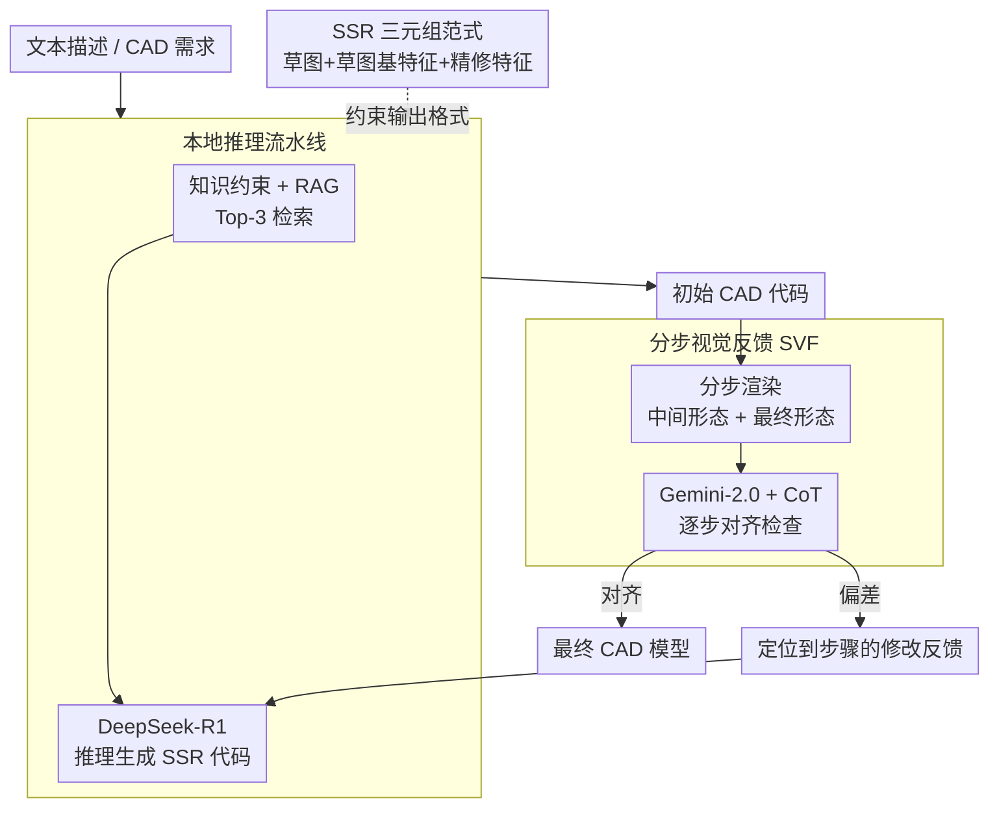

# Seek-CAD: A Self-Refined Generative Modeling for 3D Parametric CAD Using Local Inference via DeepSeek

**会议**: ICLR 2026  
**arXiv**: [2505.17702](https://arxiv.org/abs/2505.17702)  
**代码**: [https://github.com/Sunny-Hack/Seek-CAD](https://github.com/Sunny-Hack/Seek-CAD)  
**领域**: CAD 生成 / LLM 推理  
**关键词**: CAD 参数化建模, DeepSeek-R1, 无训练, Chain-of-Thought, 自我精炼, SSR 设计范式

## 一句话总结

提出 Seek-CAD，首个基于本地部署的推理 LLM（DeepSeek-R1）的无训练 CAD 参数化模型生成框架，通过分步视觉反馈与思维链 (CoT) 协同实现自我精炼，并设计新的 SSR 三元组设计范式支持复杂 CAD 模型生成。

## 研究背景与动机

CAD 参数化模型的自动生成对工业制造自动化至关重要。现有方法分为两类：

**微调方法**（如 CAD-Llama）：需要大量计算资源

**无训练方法**（如 3D-PreMise、CADCodeVerify）：使用 GPT-4 但缺乏利用思维链 (CoT) 的机制

此外，现有数据集主要基于简单的 SE（Sketch-Extrude）范式，仅支持草图和拉伸等基本操作，无法生成满足工业需求的复杂 CAD 模型（如带倒角、圆角、薄壁等特征）。

## 方法详解

### 整体框架

Seek-CAD 要解决的是：不微调、只靠本地一张消费级显卡，让推理型 LLM 生成出**可编译、且支持工业级特征**的 3D 参数化 CAD 代码。它把流程拆成"先生成、再精炼"的闭环。先确定生成的"语言"——所有代码都按 SSR 三元组范式组织（草图 + 草图基特征 + 可选精修特征），这样才能表达倒角、圆角、薄壳等复杂特征。再把带 SSR 约束的系统提示连同 RAG 检索到的参考样例喂给本地部署的 DeepSeek-R1，推理出初始 CAD 代码。最后把代码渲染成**分步图像**交给 Gemini-2.0，结合模型自己的思维链 (CoT) 做逐步对齐检查：对齐就输出最终模型，发现偏差就生成定位到具体步骤的反馈、打回 DeepSeek-R1 重写。整个流程无需训练，在单张 RTX 3090 上跑 DeepSeek-R1:32B-Q4 即可完成。

### 关键设计

**1. SSR 三元组设计范式：把建模语言从草图-拉伸扩展到工业级特征**

传统 SE（Sketch-Extrude）范式只支持草图和拉伸，做不出倒角、圆角、薄壳这类工业常见特征，从源头限制了能生成的模型复杂度。SSR 把单个建模单元定义为三元组 $S = (s, f, \langle r_1, r_2, \dots, r_k \rangle \text{ or } \varnothing)$，其中 $s$ 是 2D 草图、$f \in \mathcal{F}$ 是草图基特征（拉伸、旋转等）、$\langle r_1, \dots, r_k \rangle$ 是可选的精修特征序列（倒角、圆角、薄壳等）；完整模型再通过布尔运算把多个三元组串起来 $\mathcal{M} = \langle \mathcal{S}_1, \text{op}_1, \mathcal{S}_2, \text{op}_2, \dots, \mathcal{S}_n \rangle$。为了让精修特征能稳定指向正确的几何面，SSR 配套设计 CapType 引用机制，用 START/END/SWEPT 三种类型追踪拓扑原语，保证倒角、圆角等操作落在期望的边或面上。正因为先把"语言"扩到这一层，后续生成的代码才可能表达工业级特征，这也是 SSR 作为整条流水线输出格式约束的原因。

**2. 本地推理流水线：让无训练的推理 LLM 稳定产出可编译的 SSR 代码**

直接让 LLM 生成 CAD 代码常常因为缺少领域约束和参考样例而胡乱拼装，根本编译不过。Seek-CAD 在系统提示里注入知识约束 $Cons = (\Phi, \mathcal{D}, \mathcal{E})$，强制 DeepSeek-R1 按上面的 SSR 范式组织输出；同时在 10,000 个 CAD 模型的本地语料库上做检索增强 (RAG)，用混合检索把向量相似度和全文匹配按 $g_i^{\text{final}} = \lambda \cdot g_i^{\text{vec}} + (1-\lambda) \cdot g_i^{\text{full}}$（$\lambda = 0.3$）加权融合，取 Top-3 候选拼到输入里触发初始代码生成。消融显示去掉语料库后模型完全无法生成可编译代码、去掉知识约束 Pass@1 从 0.68 跌到 0.44——说明"约束格式 + 检索样例"这两项才是无训练路线能落地的前提。

**3. 分步视觉反馈 SVF：用中间构建形态而非只看成品来定位错误**

只把最终成品图反馈给评估器，无法判断是哪一步建模出了问题，反馈也就无从精确打回。SVF 保留整条构建链路的中间形态：中间形态图 $M_I = [R(S_1), R(\bar{S_1} \oplus S_2), \cdots, R(\bar{S_1} \oplus \cdots \oplus S_n)]$ 逐步累积渲染，最终形态图 $M_U = R(S_1 \oplus S_2 \oplus \cdots \oplus S_n)$ 给出整体外观。Gemini-2.0 据此判断分步图像与 DeepSeek-R1 给出的 CoT 描述是否一致，按 $F_{\text{call}} \sim P(F_{\text{call}} | G, M, CoT)$ 采样反馈；一旦不对齐就生成定位到具体步骤的修改意见送回 DeepSeek-R1 重写。因为 CoT 把每步的设计意图讲清楚了，VLM 能逐步比对"打算做什么"与"实际渲染成什么"，反馈精度明显高于只看成品图——消融中去掉 CoT 或去掉中间图像，反馈质量都会下降。

## 实验

### 生成质量（500 个 CAD 模型）

| 策略 | 方法 | CD↓ | HD↓ | IoGT↑ | G-Score↑ | Novel↑ |
|------|------|-----|-----|-------|---------|--------|
| 微调 | CAD-Llama | 0.2147 | 0.5864 | 0.7023 | 3.3385 | 77.64% |
| 无训练 | 3D-PreMise | 0.2203 | 0.6137 | 0.6315 | 3.2022 | 49.57% |
| 无训练 | CADCodeVerify | 0.2164 | 0.5917 | 0.6562 | 3.3927 | 55.38% |
| 无训练 | **Seek-CAD** | **0.1979** | **0.5566** | **0.7226** | **3.5185** | 64.04% |

### 精炼轮次消融

| 轮次 | Pass@2↑ | CD↓ | IoGT↑ | G-Score↑ |
|------|---------|-----|-------|---------|
| 0 | 0.77 | 0.2275 | 0.6183 | 3.1401 |
| 1 | 0.72 | 0.1979 | 0.7226 | 3.5185 |
| 2 | 0.55 | 0.1966 | 0.7347 | 3.5314 |

1 轮精炼效果显著，2 轮边际收益递减且编译失败率增加。

### 消融实验

- 移除本地 CAD 语料库 → 完全无法生成可编译代码
- 移除知识约束 → Pass@1 从 0.68 降至 0.44
- 移除 SVF 中的 CoT → 反馈质量下降
- 移除中间图像 → 反馈信息不完整

### 关键发现

- CoT 有效表达了设计逻辑，帮助 VLM 更清楚地理解构建过程
- SSR 范式支持更多样和复杂的 CAD 模型（包含倒角、圆角、薄壳等特征）
- 无训练框架在几何精度上可与微调方法（CAD-Llama）竞争
- RAG 中混合搜索比单一搜索效果好

## 亮点

- 首个探索本地部署推理 LLM（DeepSeek-R1）用于 CAD 生成的工作
- 分步视觉反馈 + CoT 对齐的精炼策略设计新颖
- SSR 三元组范式显著扩展了可生成的 CAD 操作范围
- 完全无训练，在单张 RTX 3090 上即可运行

## 局限性

- 受 DeepSeek-R1:32B-Q4 推理能力限制，复杂模型精度有限
- 每轮精炼都有编译失败风险，限制了迭代次数
- CapType 机制仅覆盖 START/END/SWEPT 三种引用类型
- 依赖 Gemini-2.0 API 进行视觉评估，增加外部依赖
- 数据集仅 40K 样本，覆盖的 CAD 操作仍有限

## 相关工作

- **CAD 生成**：DeepCAD、SkexGen、Mamba-CAD 等基于序列的方法
- **LLM for CAD**：Text2CAD、CAD-MLLM、CAD-assistant 等
- **无训练方法**：3D-PreMise、CADCodeVerify 使用 GPT-4

## 评分

- 新颖性：⭐⭐⭐⭐ — 首次利用推理 LLM + CoT 反馈做 CAD 生成
- 实用性：⭐⭐⭐⭐ — 无训练 + 本地部署，门槛低
- 数据贡献：⭐⭐⭐⭐ — SSR 范式和 40K 数据集有一定贡献
- 实验：⭐⭐⭐ — 500 个测试模型规模适中，消融比较全面

<!-- RELATED:START -->

## 相关论文

- [\[ICCV 2025\] MamTiff-CAD: Multi-Scale Latent Diffusion with Mamba+ for Complex Parametric Sequence](../../ICCV2025/image_generation/mamtiff-cad_multi-scale_latent_diffusion_with_mamba_for_complex_parametric_seque.md)
- [\[NeurIPS 2025\] CADMorph: Geometry-Driven Parametric CAD Editing via a Plan-Generate-Verify Loop](../../NeurIPS2025/image_generation/cadmorph_geometry-driven_parametric_cad_editing_via_a_plan-generate-verify_loop.md)
- [\[ICLR 2026\] Partition Generative Modeling: Masked Modeling Without Masks](partition_generative_modeling_masked_modeling_without_masks.md)
- [\[AAAI 2026\] CAD-VAE: Leveraging Correlation-Aware Latents for Comprehensive Fair Disentanglement](../../AAAI2026/image_generation/cad-vae_leveraging_correlation-aware_latents_for_comprehensive_fair_disentanglem.md)
- [\[ICLR 2026\] GenCP: Towards Generative Modeling Paradigm of Coupled Physics](gencp_towards_generative_modeling_paradigm_of_coupled_physics.md)

<!-- RELATED:END -->
