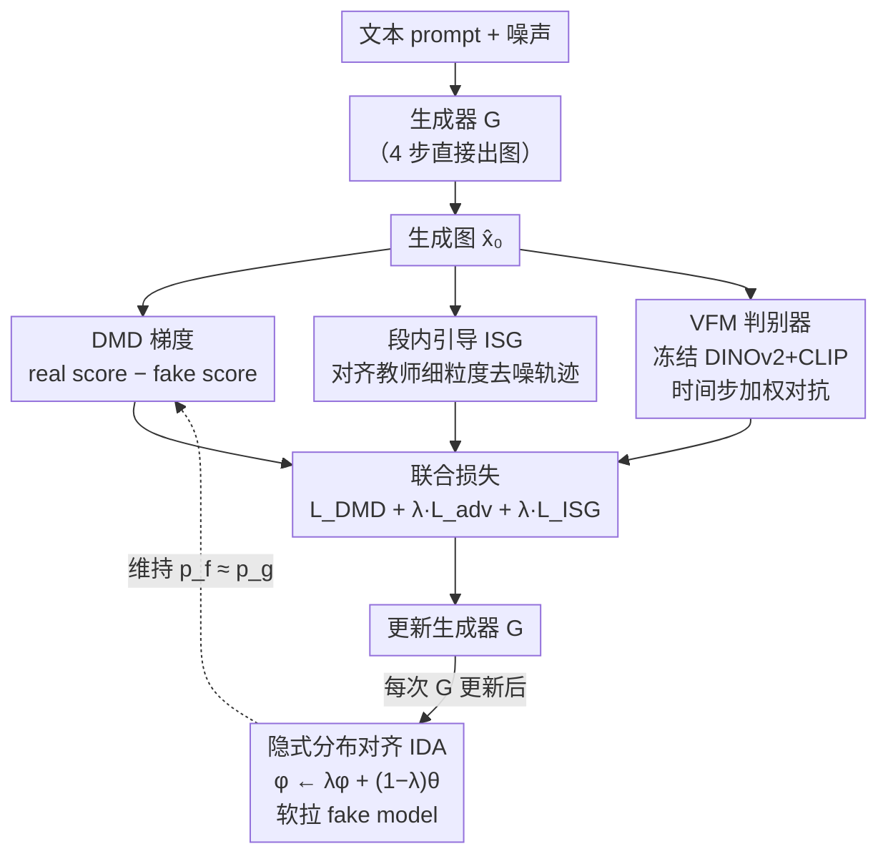

# SenseFlow: Scaling Distribution Matching for Flow-based Text-to-Image Distillation

**会议**: ICLR 2026  
**arXiv**: [2506.00523](https://arxiv.org/abs/2506.00523)  
**代码**: [GitHub](https://github.com/XingtongGe/SenseFlow)  
**领域**: 图像生成 / 扩散模型蒸馏  
**关键词**: distribution matching distillation, flow matching, text-to-image, few-step generation, FLUX

## 一句话总结

提出 SenseFlow，通过隐式分布对齐（IDA）和段内引导（ISG）将分布匹配蒸馏（DMD）扩展到大规模 flow-based 文生图模型（SD 3.5 Large 8B / FLUX.1 dev 12B），实现 4 步高质量图像生成。

## 研究背景与动机

**领域现状**：DMD2 在小模型（SD 1.5、SDXL）上已展现出优秀的蒸馏效果，能将多步扩散模型蒸馏为少步生成器。然而大规模 flow-based 文生图模型（如 SD 3.5 Large 8B、FLUX.1 dev 12B）正成为主流，这些模型的蒸馏仍是open problem。

**现有痛点**：原版 DMD2 在大模型上面临三个关键问题：(1) **收敛困难**——即使使用 TTUR（两时间尺度更新规则）也无法稳定训练；(2) **时间步采样不优**——均匀或手工选择的粗时间步未考虑教师模型各时间步的去噪重要性差异；(3) **判别器不够通用**——朴素判别器难以适应不同规模和架构的模型。

**核心矛盾**：DMD 的 min-max 博弈框架要求 fake distribution 精确追踪 generator distribution（内部最优响应），但在大模型上这一条件极难满足，导致训练振荡不收敛。

**本文目标**：如何将 DMD 框架可靠地扩展到 8B-12B 参数量的 flow-based 文生图模型？

**切入角度**：从 DMD 的 min-max 优化分析入手，发现内部最优响应需要 $p_f = p_g$，设计近端更新（IDA）来近似维持这一条件；用 ISG 重新配置时间步的去噪重要性；引入基于 VFM 的更强判别器。

**核心 idea**：通过隐式分布对齐维持 fake model 与 generator 的一致性，配合段内引导重分配时间步重要性，实现 DMD 在大 flow 模型上的稳定收敛。

## 方法详解

### 整体框架

SenseFlow 要解决的是：怎么把分布匹配蒸馏（DMD）从 SD 1.5/SDXL 这种小模型，可靠地搬到 SD 3.5 Large（8B）、FLUX.1 dev（12B）这种大 flow 模型上，让它们也能 4 步出图。它沿用 DMD2 的 min-max 蒸馏骨架：生成器 $G$ 吃文本 prompt 和噪声直接生成图像 $\hat{x}_0$，再由三路监督联合优化——DMD 梯度（教师给的 real score 减 fake model 给的 fake score）、VFM 判别器的对抗损失、以及段内引导损失。三路信号加权汇成总损失去更新 $G$；而每次更新完 $G$ 之后，都用一次廉价的参数插值把 fake model 软拉回与新生成器对齐，保证 DMD 梯度方向始终可靠。正是「IDA 维稳 + ISG 补细粒度 + VFM 判别器稳对抗」这三件事配合，让原本在大模型上发散的训练稳定下来（完整流程见 Algorithm 1）。

### 关键设计

**1. 隐式分布对齐（IDA）：让 fake model 始终追上生成器**

DMD 的 min-max 框架有个隐含前提——内层的 fake model 必须给出最优响应，即对所有时间步满足 $p_f(X_t) = p_g(X_t)$，否则 real/fake score 之差就不再指向正确的梯度方向。小模型上靠 TTUR（两时间尺度更新，多更新几次 fake model）勉强能维持，但在 SD 3.5 Large 这种 8B 模型上，把 TTUR 比例堆到 20:1 仍会剧烈振荡，既贵又不收敛。IDA 的做法极简：每次生成器从 $\theta$ 更新后，对 fake model 参数 $\phi$ 做一次 EMA 式近端插值 $\phi \leftarrow \lambda\phi + (1-\lambda)\theta$，$\lambda$ 取接近 1 的值。这相当于把 fake model 持续往生成器方向"软拉拢"，从而以一次参数插值的代价维持住 $\mathbb{E}_t D_{KL}(p_g(X_t) \,\|\, p_f(X_t)) \leq \varepsilon$ 的 ε-best response 条件。正是这一步让 DMD 在 SD 3.5 Large 上首次稳定收敛，且只需 5:1 的小 TTUR 比例即可。

**2. 段内引导（ISG）：用教师的细粒度去噪能力补强粗步生成器**

4 步生成意味着只有几个粗时间步锚点，而教师模型各时间步的归一化重建误差 $\xi(t)$ 并非单调、还存在局部振荡，均匀挑几个时间步会浪费掉每个区段 $(\tau_{i-1}, \tau_i]$ 内大量去噪信息。ISG 在每个粗时间步的"段"内再插一个中间点：对锚点 $\tau_i$，采样 $t_{mid} \in (\tau_{i-1}, \tau_i)$，让教师从 $\tau_i$ 去噪到 $t_{mid}$ 得到 $x_{t_{mid}}$、再由生成器接力到 $\tau_{i-1}$ 得到目标 $x_{tar}$；同时让生成器直接从 $\tau_i$ 一步跨到 $\tau_{i-1}$，用 L2 损失把这条"直达"轨迹对齐到经过中间点的"引导"轨迹。这样段内的细粒度转换信息被重新定位、聚合到了粗锚点上，生成器得以逼近教师那条更曲折的去噪路径——消融显示，这正是 FLUX.1 dev（12B）能收敛的额外必要条件。

**3. 基于 VFM 的判别器：用视觉基础模型的语义先验稳住对抗信号**

朴素判别器很难同时适配 2.6B 到 12B、架构各异的多种教师。SenseFlow 改用冻结的视觉基础模型（VFM，骨干为 DINOv2 + CLIP）提取多层语义特征 $z = f_{VFM}(\hat{x}_0)$，并以真实图像的 VFM 特征作参考，只训练轻量的 head blocks $h$ 预测 real/fake logits $D(x,c,r) = h(f_{VFM}(x), c, r)$，判别器本身用标准 hinge loss 优化。生成器侧的对抗损失再按时间步信号功率 $\omega(t) = (1-\sigma_t)^2 = \alpha_t^2$ 加权（前向过程为 $x_t = \alpha_t x_0 + \sigma_t \epsilon$）：高噪声步 $\hat{x}_0$ 预测不可靠、权重小，更依赖 DMD 梯度；低噪声步信号干净、权重大，更依赖 GAN 反馈。预训练 VFM 带来的丰富语义先验让判别器更擅长抓图像质量和细粒度结构，时间步加权则把两类监督信号在各噪声水平上做了合理分工，避免对抗信号在高噪声处盖过 DMD。

### 损失函数 / 训练策略

生成器总损失把三路信号加权相加：$\mathcal{L}_G = \mathcal{L}_{DMD} + \lambda_G \cdot \mathcal{L}_{adv} + \lambda_{ISG} \cdot \mathcal{L}_{ISG}$，其中 $\mathcal{L}_{DMD}$ 是 fake score 与 real score 之差，$\mathcal{L}_{adv}$ 是 VFM 判别器的对抗损失（按 $\omega(t) = (1-\sigma_t)^2$ 加权），$\mathcal{L}_{ISG}$ 是段内引导的 L2 损失。训练时数据取 LAION 中高 aesthetic score 子集，TTUR 比例固定 5:1 配合 IDA 即可稳定，构造输入时按粗时间步 $\tau_i$ 以一定概率在 backward simulation（从噪声）与 forward diffusion（从真实数据）之间切换；每 $f$ 次迭代更新一次生成器，更新后立即执行 IDA 把 fake model 软锚定到新生成器，最后再各自更新 fake model 与判别器。

## 实验关键数据

### 主实验

**COCO-5K 4步生成结果**

| 模型 | Patch FID-T↓ | CLIP↑ | HPSv2↑ | PickScore↑ | ImageReward↑ | GenEval↑ |
|------|-------------|-------|--------|------------|-------------|---------|
| SDXL Teacher (80步) | — | 0.3293 | 0.2930 | 22.67 | 0.8719 | 0.5461 |
| DMD2-SDXL (4步) | 21.35 | 0.3231 | 0.2896 | 22.49 | 0.7076 | — |
| **SenseFlow-SDXL (4步)** | **17.xx** | **最优** | **最优** | **最优** | **最优** | **最优** |
| SD 3.5 Teacher (80步) | — | — | — | — | — | 0.7140 |
| SD 3.5 Turbo (4步) | baseline | — | — | — | — | — |
| **SenseFlow-SD3.5 (4步)** | **最优** | **最优** | **超越教师** | **超越教师** | **超越教师** | 0.7098 |
| FLUX.1 schnell (4步) | baseline | — | — | — | — | — |
| **SenseFlow-FLUX (4步)** | **最优** | **最优** | **超越教师** | **超越教师** | **超越教师** | — |

SenseFlow 在所有三个教师模型（SDXL、SD 3.5 Large、FLUX.1 dev）上均实现 SOTA 4步蒸馏。

### 消融实验

| 组件 | SD 3.5 FID 收敛情况 | FLUX 收敛情况 |
|------|-------------------|--------------|
| 原版 DMD2 | 不收敛 | 不收敛 |
| + IDA | 收敛 ✓ | 不收敛 |
| + IDA + ISG | 收敛 ✓ | 收敛 ✓ |
| + IDA + ISG + VFM Disc | 最优 ✓ | 最优 ✓ |

IDA 是 SD 3.5 收敛的关键；ISG 是 FLUX 收敛的额外必要条件。

### 关键发现

1. **IDA 是大模型 DMD 收敛的关键**：仅 IDA 就能让 SD 3.5 Large 稳定收敛，配合小 TTUR 比例即可
2. **ISG 进一步改善 FLUX 蒸馏**：教师时间步重建误差非单调，ISG 通过重分配时间步重要性显著帮助
3. **4步超越教师**：在 HPSv2、PickScore、ImageReward 等人类偏好指标上，SenseFlow 4步甚至超越 80步教师模型
4. **通用性强**：同一框架在 SDXL（2.6B）、SD 3.5（8B）、FLUX（12B）三种不同架构、不同参数量的模型上均有效

## 亮点与洞察

- **首次将 DMD 扩展到 12B 参数的 FLUX 模型**：解决了大规模 flow 模型蒸馏的收敛难题
- **IDA 的简洁优雅**：仅用一行参数插值代码就解决了 fake-generator 分布追踪问题，有理论保证（ε-best response）
- **ISG 的精妙设计**：对教师模型时间步重要性的重新分配思路新颖，利用教师细粒度能力增强粗步 generator
- **4步超越教师**：在人类偏好指标上 4 步蒸馏模型可以超过 80 步教师，说明蒸馏可以"去其糟粕取其精华"
- **VFM 判别器的时间步加权**：低噪声时强调 GAN 信号、高噪声时强调 DMD 信号的设计很有道理

## 局限与展望

1. **计算成本**：需要同时维护 generator、fake model、teacher model 和判别器，显存开销大
2. **IDA 的 λ 选择**：虽然 λ 接近 1 通常足够，但最优值可能因模型而异
3. **ISG 中间点采样策略**：当前均匀采样，可考虑自适应选择更有信息量的中间点
4. **仅评估 4 步**：1步或2步蒸馏效果未知
5. **训练数据依赖**：需要高质量 LAION 子集，数据质量对蒸馏效果的影响未深入分析

## 相关工作与启发

- 对 **DMD/DMD2** 的直接扩展和突破：证明 DMD 框架的核心瓶颈在于 fake-generator 分布追踪
- 与 **RayFlow** 的联系：都关注时间步重要性问题，但 ISG 的解决方案更优雅
- 对蒸馏领域的启发：IDA 思想（近端对齐内部分布）可能适用于其他 min-max 蒸馏框架
- 与 **Consistency Models** 的比较：两种正交的蒸馏路线，DMD 系列在大模型上更有优势

## 评分

- **新颖性**: ⭐⭐⭐⭐ — IDA 和 ISG 都有清晰的理论动机和实践价值，但整体是对 DMD2 的增量改进
- **实验充分度**: ⭐⭐⭐⭐⭐ — 三个不同规模和架构的模型、多个基准（COCO-5K/GenEval/T2I-CompBench）、充分的消融
- **写作质量**: ⭐⭐⭐⭐ — 问题分析清晰，但方法描述的数学符号较多
- **价值**: ⭐⭐⭐⭐⭐ — 解决了大规模 flow 模型蒸馏的实际瓶颈，对产业应用有直接推动

<!-- RELATED:START -->

## 相关论文

- [\[ICLR 2026\] Delay Flow Matching](delay_flow_matching.md)
- [\[ICLR 2026\] Flow Matching with Semidiscrete Couplings](flow_matching_with_semidiscrete_couplings.md)
- [\[ICLR 2026\] Carré du champ Flow Matching: 用几何感知噪声改善生成模型的质量-泛化权衡](carré_du_champ_flow_matching_better_quality-generalisation_tradeoff_in_generativ.md)
- [\[ICLR 2026\] Edit-Based Flow Matching for Temporal Point Processes](edit-based_flow_matching_for_temporal_point_processes.md)
- [\[ICLR 2026\] DenseGRPO: From Sparse to Dense Reward for Flow Matching Model Alignment](densegrpo_from_sparse_to_dense_reward_for_flow_matching_model_alignment.md)

<!-- RELATED:END -->
