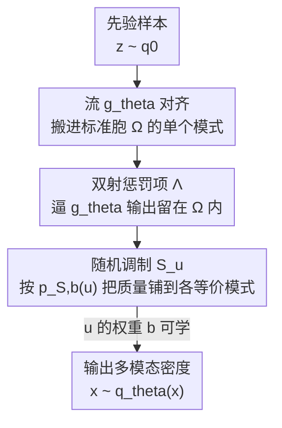

# SESaMo: Symmetry-Enforcing Stochastic Modulation for Normalizing Flows

**会议**: ICLR 2026  
**OpenReview**: [https://openreview.net/forum?id=5rHZCmYdNp](https://openreview.net/forum?id=5rHZCmYdNp)  
**代码**: https://github.com/fifi-research/sesamo  
**领域**: 生成模型 / 归一化流 / 科学计算  
**关键词**: 归一化流, 对称性, 玻尔兹曼采样, 模式坍缩, 格点场论

## 一句话总结
SESaMo 提出"随机调制"机制，让归一化流先把先验分布搬进目标分布的某一个模式，再用一个由随机变量控制的对称变换把概率质量按学习到的权重铺到所有等价模式上，从而在无数据的变分推断里精确施加对称性、还能首次学到"破缺对称性"，在 8-高斯混合、复 $\phi^4$ 场论和 Hubbard 模型上把有效样本量做到接近 1。

## 研究背景与动机

**领域现状**：物理、化学、经济里有大量"从未归一化的玻尔兹曼分布 $p(x)=\exp(-f[x])/Z$ 采样"的任务，其中作用量 $f[\cdot]$ 已知、配分函数 $Z$ 是难解的高维积分。传统做法是 MCMC，但受高能垒、自关联拖累收敛极慢。近年用深度生成模型（尤其是能给出闭式似然的归一化流 NF 和自回归网络）做变分推断的"玻尔兹曼生成器"成为主流：学一个变分密度 $q_\theta\approx p$，只用反向 KL 训练，不需要目标分布的样本。

**现有痛点**：物理/化学系统通常富含对称性，把对称性作为归纳偏置塞进网络能大幅加快、稳定收敛。但现有"等变归一化流"要么直接构造满足对称性的等变网络（很多群构造不出来），要么用**正则化/规范化（canonicalization）**：用一个固定映射 $C_{T,z}$ 把先验样本搬进一个"标准胞 $\Omega$"，流在标准胞里变换，再用逆映射 $C_{T,z}^{-1}$ 搬回去。

**核心矛盾**：规范化有两条硬约束——先验 $q_0$ 必须在对称变换下不变 $q_0(z)=q_0(T_i z)$；而且它默认各个模式概率质量**完全相等**（精确对称）。可现实里大量分布是**破缺对称**的：多个模式形状对称、但质量不等（比如外场打破了 $Z_N$ 对称）。这类分布用朴素规范化抓不住，标准流又会因为反向 KL 的特性发生**模式坍缩**，只蹲在几个最高的峰上。

**本文目标**：造一个通用框架，把任意连续/离散对称性（精确的或破缺的）嵌进 NF 的训练，并且能在无数据、模式坍缩最严重的设定下缓解坍缩。

**切入角度**：作者意识到规范化的瓶颈在于"用确定性映射一次性把样本搬进标准胞"——这既要求先验不变、又锁死了模式间的质量比。如果改成"流只负责对齐到单个模式，模式间的分配交给一个**带随机性、带可学权重**的算子"，约束就松开了。

**核心 idea**：用一个随机变量 $u$ 控制的随机对称变换 $S_u$ 代替固定的规范化逆映射，让流把质量塞进一个模式后，再由 $S_u$ 按可学概率 $p_{S,b}(u)$ 把质量"随机地"复制铺到其余等价模式上——精确对称时权重均等，破缺对称时让 $b$ 可学。

## 方法详解

### 整体框架

SESaMo 要解决的是"在只知道未归一化 $f[x]$、没有样本的情况下，训出一个能精确尊重对称性、还能学破缺对称的归一化流"。它把这件事拆成"对齐 + 调制"两步：先验 $z\sim q_0$ 先经过流 $g_\theta$，被惩罚项 $\Lambda$ 逼着搬进标准胞 $\Omega$、对齐到目标分布的**某一个**模式，得到 $\tilde x\sim\tilde q_\theta$；然后随机调制算子 $S_u$ 以随机变量 $u\sim p_{S,b}$ 为条件，把这个模式上的样本随机搬到各个对称等价的区域，从而恢复出完整的多模态 $x\sim q_\theta(x)$。

和规范化的关键不同在于：规范化是 $z \xrightarrow{C_{T,z}} \text{标准胞} \xrightarrow{g_\theta} \xrightarrow{C_{T,z}^{-1}} x$，搬运是**确定**的、且要求先验不变；SESaMo 是 $z \xrightarrow{g_\theta} \text{单个模式} \xrightarrow{S_u} x$，搬运是**随机**的、权重可学，因此不要求 $q_0$ 对称不变，适用面更广。整条路径仍是双射，似然可由变量替换公式精确计算。

### 关键设计

**1. 随机调制：用随机变量把"对齐单模"扩成"覆盖全模"**

这一步直击规范化的根本约束——确定性映射既要先验不变、又锁死模式质量比。SESaMo 让流 $g_\theta$ 只干"把样本对齐到一个模式"这件容易的事，把"复制到其余对称模式"交给一个以随机变量 $u$ 为条件的算子 $S_u$。对一组 $M$ 个对称变换 $\{T_i\}$，调制定义为

$$S_{T,u}: x \mapsto \begin{cases} x, & u=0 \\ T_1 x, & u=1 \\ \;\vdots & \\ T_M x, & u=M \end{cases}, \quad u\sim p_{S,b}$$

要求 $T_i x\notin\Omega$ 且 $T_i\neq T_j$，保证各分支映射到互不重叠的区域，从而整体保持双射。复合映射写成 $\tilde g_{\theta,u}(z)=S_u(g_\theta(z))$，其雅可比行列式按链式法则分解为 $\det\frac{\partial \tilde g_{\theta,u}}{\partial z}=\det\frac{\partial S_u}{\partial g_\theta}\det\frac{\partial g_\theta}{\partial z}$。采样而非边缘化 $u$ 时，对数似然有闭式

$$\ln q_\theta(\tilde g_{\theta,u}(z)) = \ln p_{S,b}(u) + \ln q_0(z) - \ln\left|\det\tfrac{\partial S_u}{\partial g_\theta}\right| - \ln\left|\det\tfrac{\partial g_\theta}{\partial z}\right|$$

因为对齐和铺开被解耦，先验 $q_0$ 不需要在对称变换下不变，这正是它比规范化适用面更广、还能缓解反向 KL 模式坍缩的来源——每个模式都由 $S_u$ 显式保证被覆盖到。

**2. 可学破缺对称权重 + REINFORCE 估计：让模型自己学出"模式质量不均"**

精确对称时各模式质量相等，但破缺对称时质量是不等的，固定权重抓不住。SESaMo 把模式分配概率 $p_{S,b}(u)$ 写成依赖可学参数 $b$ 的形式。以 $Z_2$ 对称为例，精确对称时 $u\in\{0,1\}$ 服从 $\mathcal{B}(e^b)$ 且 $b=\ln 0.5$（即均分）；破缺对称时

$$p_{S,b} = \begin{cases} 1-e^b, & u=0 \\ e^b, & u=1 \end{cases}, \quad b\in\mathbb{R}^-$$

让 $b$ 随训练优化，模型就能学出两个模式真实的质量比。难点是 $u$ 是离散随机变量、$b$ 只出现在采样概率里，普通反传过不去，于是用 **REINFORCE 估计器**：

$$\frac{\partial}{\partial b}\mathbb{E}_{u\sim p_{S,b}}\big[\,\cdot\,\big] = \mathbb{E}_{u\sim p_{S,b}}\Big[(\ln q_\theta + f[\tilde g_{\theta,u}(z)])\cdot \tfrac{\partial}{\partial b}\ln p_{S,b}(u)\Big]$$

实验里 $b$ 学到的值与解析预测完全吻合，这也是 SESaMo "首次能在训练中学到破缺对称"的具体兑现。该公式还能推广到连续对称（$u$ 取连续变量）。

**3. 双射惩罚项：用软约束逼流的输出留在标准胞内**

随机调制要成立，必须保证流 $g_\theta$ 把样本搬进标准胞 $\Omega$、不溢出（否则各分支区域会重叠、破坏双射）。作者不去硬构造满足约束的网络，而是往反向 KL 损失里加一个正则项

$$\Lambda(\tilde z_c) = A\cdot\sigma\big(B\cdot\lambda(\tilde z_c)\big)\cdot\Theta\big(\lambda(\tilde z_c)\big)$$

其中惩罚函数 $\lambda$ 在标准胞边界 $\partial\Omega$ 为零、胞内为负、胞外为正；Heaviside 阶跃 $\Theta(\cdot)$ 让胞内样本惩罚为零，sigmoid $\sigma(\cdot)$ 让胞外样本获得指向标准胞的梯度。超参 $A$ 要至少匹配损失的量级、$B$ 要足够小以免胞外梯度消失。它把"双射性"从一个难以解析满足的硬约束，变成训练时自动满足的软目标。

### 损失函数 / 训练策略

训练用反向 KL 散度加上述惩罚项：

$$\widetilde{\mathrm{KL}}(q_\theta\|p) = \mathbb{E}_{z\sim q_0}\mathbb{E}_{u\sim p_{S,b}}\big[\ln q_\theta(\tilde g_{\theta,u}(z)) + f[\tilde g_{\theta,u}(z)] + \Lambda(g_\theta(z))\big]$$

流参数 $\theta$ 走常规反传，调制参数 $b$ 走 REINFORCE。骨干用仿射耦合流 RealNVP，全程无目标分布样本，只靠闭式未归一化 $f[x]$ 训练。

## 实验关键数据

对比四种方法：FAB（流退火重要性采样自举）、RealNVP+VMoNF（归一化流变分混合）、RealNVP+规范化、RealNVP+SESaMo（本文）。指标为有效样本量 ESS（越接近 1 越好）和 KL 散度（越小越好，需已知 $Z$），结果为 10 个模型的平均。

### 主实验

| 任务 | 体积 | 对称性 | FAB | VMoNF | 规范化 | SESaMo |
|------|------|--------|-----|-------|--------|--------|
| GMM (ESS) | 2×1 | 精确 $Z_8$ | 0.78(3) | 0.61(1) | 0.91(8) | **0.9986(2)** |
| GMM (ESS) | 2×1 | 破缺 $Z_8$ | 0.81(1) | 0.83(11) | 0.747(2) | **0.9947(3)** |
| $\phi^4$ (ESS) | 8×8 | 精确 $U(1)$ | 0.26(3) | 0.22(2) | – | **0.9472(8)** |
| $\phi^4$ (ESS) | 8×8 | 破缺 $U(1)$ | 0.28(5) | 0.23(1) | – | **0.941(2)** |
| Hubbard (ESS) | 2×1 | 破缺 $Z_4$ | 0.946(9) | 0.37(12) | 0.839(5) | **0.996(1)** |
| Hubbard (ESS) | 18×100 | 破缺 $(Z_2)^{18}$ | 0.06(5) | – | 0.024(1) | **0.74(1)** |

复 $\phi^4$ 场论里复值场无法套用规范化（表中 "–"），SESaMo 把 ESS 从基线的 0.2~0.3 拉到 0.94 以上。Hubbard 大体积 18×100 时 FAB 不可行、规范化几乎崩到 0.024，SESaMo 仍有 0.74，确立新 SOTA。

### KL 散度对比

| 任务 | 体积 | 对称性 | FAB | VMoNF | 规范化 | SESaMo |
|------|------|--------|-----|-------|--------|--------|
| GMM | 2×1 | 精确 $Z_8$ | 1.19(37) | 0.79(11) | 0.013(2) | **0.0008(1)** |
| GMM | 2×1 | 破缺 $Z_8$ | 0.84(26) | 1.02(14) | 0.189(3) | **0.0024(2)** |
| Hubbard | 2×1 | 破缺 $Z_4$ | 0.28(8) | 0.74(9) | 0.112(7) | **0.0013(8)** |

### 关键发现
- **VMoNF 仍坍缩**：尽管 VMoNF 让不同流学不同区域，在破缺 $Z_8$ 高斯混合上它仍坍缩到左下三个最高的模式——作者强调这不是架构问题，而是反向 KL 固有的模式坍缩；SESaMo 靠对称强制架构保证覆盖所有模式，这也使 ESS 成为合法度量。
- **破缺对称学得准**：物理实验里在线优化的破缺参数 $b$ 与解析预测完全吻合，是"能学破缺对称"最直接的证据。
- **可扩展性**：相比 Schuh 等人此前用规范化只能做到 $V=2\times2$ 的小体积，SESaMo 扩到 $V=18\times100$ 的 $(Z_2)^{18}$ 破缺对称，收敛更快更稳。

## 亮点与洞察
- **"解耦对齐与铺开"是巧思**：把"难学的多模态"拆成"流学单模 + 算子铺多模"，让流只干容易的事，对称性这部分用结构显式保证，从根上规避了反向 KL 的模式坍缩。
- **随机性换来了通用性**：用随机变量 $u$ 代替规范化里的确定性逆映射，直接卸掉了"先验必须对称不变"这条约束，这是它能处理复值场（规范化做不了）的关键。
- **REINFORCE 用在对称权重上很自然**：离散模式分配天然是随机变量，用 REINFORCE 学质量比，把"破缺对称"这个物理概念变成一个可优化的标量参数。
- **软惩罚换硬构造**：不去硬造满足双射的等变网络，而用边界惩罚项把约束变成训练目标，工程上比群构造灵活得多。

## 局限与展望
- 作者承认：对称扇区（哪些 $T_i$、有几个模式）必须**先验已知**才能套用随机调制——好在物理/化学系统对称性通常明确，影响有限，但对未知对称的一般分布不适用。
- 双射惩罚项只能近似维持双射：若目标在标准胞边界 $\partial\Omega$ 有非零概率（如高斯混合把半径 $R$ 调小、模式靠拢），严格接受双射样本会使 ESS 下降；高维物理里模式间距通常随维度增大，缓解了这一点。
- 自己看：方法目前在仿射 RealNVP + 中小体积上验证，更复杂的连续对称（$U(1)$ 之外）和真实大规模化学体系还需进一步检验；REINFORCE 估计的方差在更多模式时可能成为训练瓶颈。

## 相关工作与启发
- **vs 规范化（canonicalization）**：规范化用固定 $C_{T,z}$ 把先验确定性搬进标准胞，要求 $q_0$ 对称不变、且默认模式质量均等；SESaMo 用流对齐单模 + 随机调制铺多模，不要求先验不变、能学破缺对称，复值场也适用。
- **vs 等变归一化流（Köhler et al. / Satorras et al. / Bose et al.）**：它们靠构造等变微分同胚把对称性焊进网络，对很多群构造困难；SESaMo 把对称性放进"调制算子 + 软惩罚"，绕开了等变网络的构造难题。
- **vs VMoNF**：VMoNF 用混合流分管不同区域，但仍受反向 KL 模式坍缩之害；SESaMo 用对称强制结构保证全模式覆盖。

## 评分
- 新颖性: ⭐⭐⭐⭐⭐ 随机调制 + 可学破缺对称是对等变流/规范化范式的实质突破，首次在训练中学破缺对称
- 实验充分度: ⭐⭐⭐⭐ 覆盖玩具到真实格点场论（含大体积 SOTA），但骨干与对称类型仍偏窄
- 写作质量: ⭐⭐⭐⭐ 与规范化的对照清晰、公式完整，物理背景较重需一定门槛
- 价值: ⭐⭐⭐⭐⭐ 给科学采样里的对称玻尔兹曼分布提供了通用、可扩展、能处理破缺对称的新工具

<!-- RELATED:START -->

## 相关论文

- [\[ICML 2026\] The Coupling Within: Flow Matching via Distilled Normalizing Flows](../../ICML2026/image_generation/the_coupling_within_flow_matching_via_distilled_normalizing_flows.md)
- [\[ICLR 2026\] Latent Stochastic Interpolants](latent_stochastic_interpolants.md)
- [\[ICML 2025\] Normalizing Flows are Capable Generative Models](../../ICML2025/image_generation/normalizing_flows_are_capable_generative_models.md)
- [\[AAAI 2026\] Flowing Backwards: Improving Normalizing Flows via Reverse Representation Alignment](../../AAAI2026/image_generation/flowing_backwards_improving_normalizing_flows_via_reverse_representation_alignme.md)
- [\[ICLR 2026\] TAVAE: A VAE with Adaptable Priors Explains Contextual Modulation in the Visual Cortex](tavae_a_vae_with_adaptable_priors_explains_contextual_modulation_in_the_visual_c.md)

<!-- RELATED:END -->
