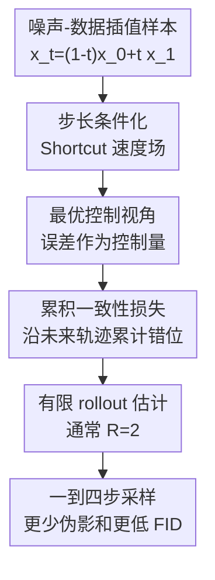

# Shortcut Diffusion Training with Cumulative Consistency Loss: An Optimal Control View

**会议**: ICLR2026  
**OpenReview**: [https://openreview.net/forum?id=cZqAk87Lu4](https://openreview.net/forum?id=cZqAk87Lu4)  
**代码**: https://github.com/paribeshregmi/Shortcut-CSL  
**领域**: 扩散模型 / 图像生成  
**关键词**: 少步生成、Shortcut Model、Flow Matching、累积一致性损失、最优控制  

## 一句话总结
这篇论文把 shortcut diffusion 的少步生成训练解释为一个受控 flow-matching 过程，指出原始 self-consistency loss 只惩罚当前一步误差，进而提出沿轨迹累计未来错位的 Cumulative Self-Consistency Loss，在几乎相同训练预算下显著提升一到四步图像生成质量。

## 研究背景与动机
**领域现状**：扩散模型和 flow matching 模型通常把随机噪声逐步推向数据分布，生成质量强，但采样时要走几十到几百个网络前向。为了让这类模型真正能在低延迟场景使用，近几年大量工作都在做 one-step 或 few-step generation：要么先训练一个强 base model，再把它蒸馏成少步 student；要么像 consistency model、shortcut model 那样，在单阶段训练里同时学习普通小步流场和大步跳跃流场。

**现有痛点**：两阶段蒸馏通常成本高，而且某些方法需要为不同步数分别训练模型。Shortcut model 的优点是简单：同一个网络额外条件化步长 $d$，当 $d=0$ 时像 base flow-matching model，当 $d$ 很大时就能直接做一到几步生成。但它原始的 self-consistency loss 只要求“一步走 $2d$”和“两步走 $d$”在当前状态上对齐，这种局部约束不能保证大步走完后落到一个对后续生成也友好的状态。

**核心矛盾**：少步生成的误差不是一次性的局部误差，而是会沿 ODE 轨迹传播的累计误差。当前一步方向如果略微偏离 base trajectory，表面上可能和局部 bootstrap target 对齐得不错，但它把样本推到的下一个状态可能让后面几步更难对齐，最终在 one-step 或 two-step 生成里表现为伪影、形状扭曲和 FID 恶化。

**本文目标**：作者想回答两个问题：第一，shortcut model 的 self-consistency loss 有没有一个更原则化的理论解释；第二，在不改模型结构、不引入昂贵两阶段蒸馏的前提下，能不能让少步模型训练时显式考虑后续轨迹误差，从而缩小和 base flow-matching model 的质量差距。

**切入角度**：论文把 few-step shortcut model 看成对 base generative process 施加了一个隐式控制误差 $u_\theta$ 的受控动力系统。这里的“控制”不是为了把生成结果导向外部奖励，而是表示 shortcut 速度场相对 base velocity 的偏离。这个视角很自然地把“当前误差”和“未来误差”区分开：如果目标函数像最优控制的 value function 一样从当前时间累计到终点，就不应该只看当下那一个错位。

**核心 idea**：用轨迹级的 Cumulative Self-Consistency Loss 取代只看当前位置的 self-consistency loss，让 shortcut model 的大步方向不仅在当前状态对齐 base model，还要把样本推向一个能让后续大步继续对齐的状态。

## 方法详解

### 整体框架
这篇论文并没有发明新的生成网络骨架，而是在 Shortcut model 的训练目标上动刀。整体流程可以理解为：先用 flow matching 训练同一个网络在 $d=0$ 时预测 base velocity，再用步长条件化的 shortcut 分支预测大步方向；不同之处在于，原始 shortcut 只在一个时间点做 bootstrap consistency，而 Shortcut-CSL 会 rollout 若干个未来 shortcut step，把每个未来状态上的 misalignment 一起纳入损失。

更具体地说，训练 batch 里有两类 supervision。第一类是普通 flow-matching target：对一对噪声和真实样本 $(x_0,x_1)$，在插值点 $x_t=(1-t)x_0+t x_1$ 上监督网络预测速度 $x_1-x_0$。第二类是 bootstrap target：给定步长 $d$，用两个小步 shortcut 方向构造一步大步 $2d$ 的目标。Shortcut-CSL 保留这个结构，但不再只对第一个状态计算一次误差，而是让模型沿自己的 $2d$ 大步继续往前走，并在后续状态上继续计算和对应 target 的错位。

### 关键设计
**1. 最优控制视角：把 shortcut 偏差看成会传播的控制误差**

作者先把 base flow-matching 过程写成一个连续动力系统，再把 shortcut model 的输出看作相对 base drift 多出来的误差项 $u_\theta(X_t^u,t)$。如果 shortcut 完全复现 base trajectory，那么所有时间点上都应有 $u_\theta=0$；反过来，只要某个时刻的 shortcut 方向偏了，后续状态 $X_t^u$ 就会被推到另一条轨迹上，后面的误差也会随之改变。

在这个设定下，最自然的目标不是“某一个时间点误差最小”，而是从当前时间 $s$ 到终点 $1$ 的累计成本：$J(u_\theta;x_s,s)=\int_s^1 f(u_\theta(X_t^u,t),t)dt$。论文特意把中间状态成本 $g$ 和终点成本 $h$ 设为零，因为它不是要加入外部偏好，只关心 shortcut trajectory 是否贴住 base trajectory。这个形式的价值在于，它把少步生成的核心失败模式讲清楚了：当前动作不仅有即时误差，还通过改变后续状态影响未来误差。

**2. SL 是退化特例：只惩罚当前位置会忽略下游代价**

原始 Shortcut model 的 self-consistency loss 可以写成 $\|S_\theta(x_t,t,2d)-S_{target}\|^2$，其中 $S_{target}=\frac{1}{2}S_\theta(x_t,t,d)+\frac{1}{2}S_\theta(x_{t+d},t+d,d)$。它监督“一步 $2d$”的方向要等于“两步 $d$”的平均方向，看起来是在做路径一致性，但这个一致性只发生在当前 $x_t$。

论文用 Dirac delta 把这个目标嵌进最优控制形式：如果 $f(u,t)=\|u\|^2\delta(s-t)$，那么累计目标会退化成 $J_{SL}=\|u_\theta(x_s,s)\|^2$。这说明 SL 并不是错的，而是太短视：它只看 immediate cost，没有看这个大步把样本带到哪里，也没有看未来状态上的 misalignment 是否变大。作者还提出 Uniform Self-Consistency Loss 作为中间对照，即 $J_{USL}=(1-s)\|u_\theta(x_s,s)\|^2$；它形式上覆盖未来区间，但假设误差沿时间不变，本质上只是带权 SL。

**3. CSL：沿生成轨迹累计真实错位，让当前大步为未来负责**

Cumulative Self-Consistency Loss 去掉了 delta 和 uniform 假设，直接把未来轨迹上的误差都加起来：$J_{CSL}(u_\theta;x_s,s)=\int_s^1\|u_\theta(X_t^u,t)\|^2dt$。离散到步长 $d$ 后，它变成 $J_{CSL}(u_\theta;x_{nd},nd)=\sum_{k=n}^{R'}\|u_\theta(x_{dk},dk,d)\|^2$，其中 $R'=1/d$ 表示剩余可走步数。这个目标强调的不是“当前方向像不像 target”，而是“沿这个方向走下去以后，整条少步轨迹是不是仍然容易贴住 base model”。

这个差别会反映到梯度里。CSL 的梯度包含 immediate gradient $2u_\theta$，也包含由 future cost 对状态的梯度 $\nabla_x J_{CSL}$ 带来的 cumulative gradient。直观地说，模型在第一个大步上收到的不只是当前错位的惩罚，还会收到第二步、第三步错位反传回来的信号；因此它会偏向选择那些把样本送到“后续更容易对齐”的状态的方向。这正是 one-step/two-step 生成最缺的约束。

**4. 有限 rollout 估计：用很少额外计算换取轨迹级训练信号**

完整累计到终点会增加训练开销，所以论文用有限项数 $R$ 来估计 CSL。训练时先为 $K/R$ 个 bootstrap 样本生成 $R$ 个 target：每一轮用两个小步 $d$ 的方向构造一个大步 $2d$ 的 stop-gradient target，然后让当前状态沿模型预测的大步继续前进。随后再从初始状态出发，对 $r=1\ldots R$ 的每个状态计算 $\|S_\theta(x'_1,s,2d)-S_{target}[r]\|^2$，并沿模型自己的大步更新状态。

最关键的是，后一个状态依赖前一个 shortcut step，因此第二个 loss 的梯度会通过“状态更新”反传到第一个 shortcut step。作者发现 $R=2$ 就已经非常有效：对 two-step 模型来说它覆盖完整轨迹，对 four-step 模型也覆盖了大约一半轨迹；实际训练只多 6% 到 10% 时间，却明显降低 few-step FID。$R=4$ 还能继续提升，但时间开销会上升到约 30%，因此默认实验主要使用 $R=2$。

### 损失函数 / 训练策略
训练目标由 flow-matching 项和 CSL bootstrap 项组成。Flow-matching 项监督 $d=0$ 的 base velocity：$L_{FM}=\mathbb{E}\|S_\theta(x_t,t,0)-(x_1-x_0)\|^2$。Shortcut 项则在 $d>0$ 时监督大步方向与 bootstrap target 对齐，只是从原来的单点 $R=1$ 扩展为 $R$ 个沿轨迹展开的 consistency losses。

为了和原始 Shortcut model 公平比较，作者保持每个 batch 的 flow-matching target 数 $B$ 和 bootstrap target 数 $K$ 一致。由于 CSL 在 $R=2$ 时每个样本会产生两个 bootstrap target，它只使用 $K/2$ 个样本来生成 bootstrap 部分，从而控制监督目标数量相同。主要实验使用 DiT-B-2 作为 backbone，CelebA-256 与 CIFAR-10 上设 $B=64,K=16,R=2$，ImageNet-256 上设 $B=128,K=32,R=2$，base flow-matching 采样步数为 128，优化器为 AdamW，学习率 $10^{-4}$，EMA 为 0.9999。

论文还指出 CSL 和强化学习有一个自然对应：中间 noisy sample 是状态，模型选择的方向是 action，负的 misalignment 可以看成 reward，$J_{CSL}$ 类似 value function。本文没有训练额外 value network，而是直接用少量 rollout 估计未来 cost；但这个解释提示了以后可以用 actor-critic 或 temporal-difference learning 来改进 few-step diffusion training。

## 实验关键数据

### 主实验
作者首先在 CelebA-256 和 CIFAR-10 的无条件生成上比较两阶段蒸馏方法、单阶段 flow matching、consistency training、原始 Shortcut model 和本文 ST-CSL。指标是 FID-50K，越低越好；128-step 对应 base flow-matching 级别，少步结果重点看 four/two/one-step。

| 数据集 | 方法 | Four-Step FID ↓ | Two-Step FID ↓ | One-Step FID ↓ | 说明 |
|--------|------|-----------------|----------------|----------------|------|
| CelebA-256 | ST | 9.36 | 12.56 | 20.46 | 原始 shortcut baseline |
| CelebA-256 | ST-USL | 9.18 | 12.00 | 19.41 | 只做 uniform 加权，收益有限 |
| CelebA-256 | ST-CSL | 8.98 | 10.96 | 18.37 | 三个少步预算都优于 ST |
| CIFAR-10 | ST | 9.15 | 11.79 | 19.80 | 原始 shortcut baseline |
| CIFAR-10 | ST-USL | 9.35 | 11.65 | 19.57 | four-step 反而略差 |
| CIFAR-10 | ST-CSL | 8.10 | 9.24 | 17.76 | 明显优于 ST 与 ST-USL |

在 class-conditional ImageNet-256 上，差距更大。这里作者还比较了 Reflow、FM、Meanflow 和不同 $B:K$ 比例下的 ST/ST-CSL。Base 128-step FID 为 15.21；ST-CSL 在 four-step 时已经接近这个 base 质量，在 one-step 时也把 ST 的伪影问题压低很多。

| 方法 | Four-Step FID ↓ | Two-Step FID ↓ | One-Step FID ↓ | Four-Step F1 ↑ | Two-Step F1 ↑ | One-Step F1 ↑ |
|------|-----------------|----------------|----------------|----------------|---------------|---------------|
| Meanflow (5%) | 34.09 | 36.61 | 45.12 | 0.58 | 0.57 | 0.56 |
| ST (4:1) | 24.70 | 35.73 | 64.12 | 0.61 | 0.56 | 0.46 |
| ST (2:1) | 23.47 | 32.54 | 55.55 | 0.63 | 0.58 | 0.50 |
| ST (1:1) | 24.17 | 32.22 | 51.78 | 0.63 | 0.59 | 0.51 |
| ST-CSL (4:1) | 16.98 | 21.77 | 45.84 | 0.63 | 0.60 | 0.50 |
| ST-CSL (2:1) | 16.21 | 18.71 | 37.60 | 0.64 | 0.62 | 0.53 |
| ST-CSL (1:1) | 15.71 | 17.35 | 31.66 | 0.64 | 0.63 | 0.56 |

### 消融实验
论文做了几组很有用的分析：一是直接测未来错位，二是改变 backbone 大小，三是改变 bootstrap target 比例 $B:K$，四是改变 CSL 展开项数 $R$。

| 实验设置 | 关键指标 | 说明 |
|----------|----------|------|
| CIFAR-10 两步轨迹，ST 在 $t=0.5$ | $u_\theta^2=0.5\times10^{-3}$ | immediate error 与 ST-CSL 基本相同 |
| CIFAR-10 两步轨迹，ST-CSL 在 $t=0.5$ | $u_\theta^2=0.5\times10^{-3}$ | 当前步并没有因为 CSL 明显牺牲 |
| CIFAR-10 两步轨迹，ST 在 $t=1.0$ | $u_\theta^2=2.5\times10^{-3}$ | 未来错位较大 |
| CIFAR-10 两步轨迹，ST-CSL 在 $t=1.0$ | $u_\theta^2=1.4\times10^{-3}$ | 证明 CSL 确实压低后续误差 |
| CelebA 100 epochs DiT-B-2，ST | 7.4 小时 | 原始 shortcut 训练时间 |
| CelebA 100 epochs DiT-B-2，ST-CSL | 7.8 小时 | 只多约 5% 到 6% |

| CIFAR-10，$R$ | Four-Step FID ↓ | Two-Step FID ↓ | One-Step FID ↓ | 说明 |
|----------------|-----------------|----------------|----------------|------|
| 1 | 8.17 | 10.54 | 16.43 | 等价于原始 SL |
| 2 | 6.95 | 7.94 | 13.96 | 默认 CSL，收益最大且开销小 |
| 4 | 6.66 | 7.11 | 13.10 | 继续提升，但训练约多 30% 时间 |

### 关键发现
- CSL 的收益不是来自简单 reweighting。ST-USL 在部分设置中有小幅提升，但整体明显不如 ST-CSL，说明“未来状态上的真实误差”比“把当前误差乘一个时间权重”更重要。
- CSL 对模型规模比较稳定。作者在 DiT-S-2、DiT-B-2、DiT-L-2 上都观察到 ST-CSL 优于 ST，说明它不是只在某个小模型或特定容量下有效。
- 增加 bootstrap target 比例通常会改善少步生成，而 ST-CSL 在 $4:1$、$2:1$、$1:1$ 三种 $B:K$ 比例下都优于 ST。尤其在 $1:1$ 时，CelebA two-step FID 从 ST 的 11.14 降到 9.91，CIFAR-10 two-step FID 从 10.54 降到 7.94。
- ImageNet-256 是最能体现方法价值的实验。ST 在 one-step 下 FID 达 51.78 到 64.12，而 ST-CSL 最好能降到 31.66；作者图例中也显示 ST 的一到两步样本容易在物体周围产生明显伪影，CSL 结果更平滑清晰。

## 亮点与洞察
- **理论解释抓住了 shortcut 的真问题**：论文不是泛泛地说“多加一个 loss”，而是把 SL 放进最优控制目标里，说明它等价于只在当前时刻放一个 Dirac delta 惩罚。这个解释非常干净，也解释了为什么原始 shortcut 在 few-step 时会局部对齐但全局仍崩。
- **CSL 的实现很朴素但有效**：用 $R=2$ 的 rollout 就能把未来 loss 反传到当前 step，相当于用少量额外前向换来轨迹级 credit assignment。它没有引入新网络、没有额外 teacher，也没有改变 sampling interface，所以工程迁移成本低。
- **RL 类比有启发性**：把 denoising state 当状态、方向当 action、负 misalignment 当 reward 后，few-step diffusion training 就像一个短 horizon control problem。虽然本文只做 rollout 估计，但这个视角可能启发后续用 value approximation、TD learning 或 actor-critic 改善少步生成。
- **结果的说服力主要来自困难设置**：CelebA/CIFAR-10 上的提升已经稳定，但 ImageNet-256 的 one-step/two-step 提升更说明问题，因为复杂类别条件生成更容易暴露未来误差累积的问题。

## 局限与展望
- CSL 仍然依赖 base flow-matching / shortcut 框架本身，目标是贴近 base trajectory，而不是直接优化最终感知质量、人类偏好或任务奖励。如果 base trajectory 本身不是最优，CSL 只会更好地模仿它。
- 论文默认把中间状态成本 $g(X_t^u,t)$ 和终端成本 $h(X_1^u)$ 设为零，这让理论非常简洁，但也限制了方法表达能力。未来可以把不希望出现的中间状态、最终图像质量或安全约束写成额外 cost。
- $R$ 越大估计越接近完整 CSL，但训练时间也会上升。实验显示 $R=4$ 继续提升 FID，不过开销约 30%，如何用更聪明的 value approximation 代替长 rollout 是后续值得做的方向。
- ImageNet-256 实验由于计算限制只用了 30 个类别、约 4 万张样本，不是完整 ImageNet 类条件生成。它能说明趋势，但还不能完全替代更大规模的全量评测。
- 论文主要评估图像生成，虽然动机覆盖图像、视频、音频和分子等 diffusion/flow 任务，但 CSL 在视频、音频或文本到图像大模型上的稳定性和收益还需要进一步验证。

## 相关工作与启发
- **vs Shortcut Models**: Shortcut model 通过步长条件化让同一个网络支持多种采样预算，并用 self-consistency loss 对齐“一步大步”和“两步小步”。本文保留这个简洁接口，但指出 SL 只看当前误差，进一步用 CSL 把后续错位也纳入训练，因此在 one-step/two-step 生成上明显更稳。
- **vs Consistency Models / Consistency Training**: Consistency model 也是单阶段少步生成路线，但训练设计更复杂、稳定性工程要求更高。Shortcut-CSL 的优势是目标解释清楚、改动集中在 loss 和 rollout 上；劣势是仍要处理 flow-matching/shortcut target 的 batch 分配和未来 rollout 开销。
- **vs Progressive Distillation / Reflow**: 两阶段蒸馏可以在某些 one-step 指标上很强，但通常需要先训练 teacher，再逐步蒸馏或为不同步数维护不同模型。Shortcut-CSL 是单阶段训练，一个模型覆盖 128、4、2、1 步，灵活性更好。
- **vs Meanflow**: Meanflow 也是近期单步生成的重要 baseline，在 ImageNet one-step 上比原始 ST 更强，但本文 ST-CSL 在不同 $B:K$ 比例下整体优于 Meanflow，尤其 two-step/four-step 的效率-质量折中更好。
- **对后续工作的启发**: 这篇论文提示我们，少步生成训练不该只看局部 teacher matching，而应考虑“当前大步给未来状态留下了什么条件”。这个思路可以迁移到 latent diffusion 加速、视频 diffusion 少步采样，甚至 reward-guided flow matching：只要误差会沿轨迹传播，就可以考虑把未来 cost 纳入训练信号。

## 评分
- 新颖性: ⭐⭐⭐⭐☆ 从最优控制解释 SL 并推出 CSL 很自然但有洞察，创新主要在目标函数视角和训练信号设计。
- 实验充分度: ⭐⭐⭐⭐☆ CelebA、CIFAR-10、ImageNet-256、模型规模、$B:K$、$R$ 都有覆盖，但 ImageNet 不是全量类别，跨模态实验还缺。
- 写作质量: ⭐⭐⭐⭐☆ 理论推导和实验叙事清晰，SL/USL/CSL 的层次很好懂，算法细节主要放在附录，需要读者来回对照。
- 价值: ⭐⭐⭐⭐⭐ 对少步 diffusion/flow matching 训练很实用，几乎不改采样接口就能显著改善一到几步生成质量。

<!-- RELATED:START -->

## 相关论文

- [\[ICLR 2026\] Diagnosing and Improving Diffusion Models by Estimating the Optimal Loss Value](diagnosing_and_improving_diffusion_models_by_estimating_the_optimal_loss_value.md)
- [\[ICLR 2026\] Training-Free Reward-Guided Image Editing via Trajectory Optimal Control](training-free_reward-guided_image_editing_via_trajectory_optimal_control.md)
- [\[NeurIPS 2025\] Improved Training Technique for Shortcut Models (iSM)](../../NeurIPS2025/image_generation/improved_training_technique_for_shortcut_models.md)
- [\[ICLR 2026\] FACM: Flow-Anchored Consistency Models](facm_flow-anchored_consistency_models.md)
- [\[ICLR 2026\] RNE: plug-and-play diffusion inference-time control and energy-based training](rne_plug-and-play_diffusion_inference-time_control_and_energy-based_training.md)

<!-- RELATED:END -->
