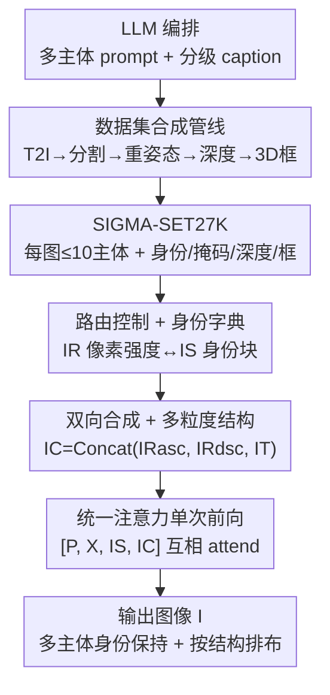

# SIGMA-GEN: Structure and Identity Guided Multi-Subject Assembly for Image Generation

**会议**: ICLR 2026  
**OpenReview**: [https://openreview.net/forum?id=x2DWTywZ1i](https://openreview.net/forum?id=x2DWTywZ1i)  
**代码**: https://oindrilasaha.github.io/SIGMA-Gen/ (有)  
**领域**: 扩散模型 / 可控图像生成  
**关键词**: 多主体生成, 身份保持, 结构控制, 合成数据集, 扩散 Transformer

## 一句话总结
SIGMA-GEN 把"每个主体长什么样（身份）"和"每个主体放在哪、什么朝向、谁挡谁（结构）"统一编码进两张控制图，让一个扩散 Transformer 在**单次前向**里就同时塞进多达 10 个保持身份的主体，配套自造了带身份/掩码/深度/2D/3D 框标注的合成数据集 SIGMA-SET27K，在多主体场景下身份保真、画质和速度全面超过需要逐个插入的迭代式 baseline。

## 研究背景与动机

**领域现状**：文生图扩散模型已经能从一句话生成高质量图像，围绕"可控"也长出两条线——结构控制（ControlNet、T2I-Adapter、布局框、3D 先验）让用户指定边缘/深度/位置，主体个性化（DreamBooth、Textual Inversion、各种 in-context 方法）让用户指定"画的是这个特定物体/人"。

**现有痛点**：这两条线几乎从不交汇。结构控制方法压根没有控制主体身份的机制；个性化方法要么得逐主体优化权重，要么训练数据里每张图只有一两个身份，多主体一上来就崩。主体插入类方法（AnyDoor、Insert Anything）一次只能插一个主体；MS-Diffusion 之类支持空间控制的又在"多身份+多主体"上力不从心。想生成"多个指定主体、按指定布局摆放"的图，现有做法只能**迭代地一个一个插**，运行时间随主体数线性飙升，且后插的会破坏前面已生成内容，画质逐步退化。

**核心矛盾**：缺一个能在**同一次扩散过程**里联合处理"结构（位置/朝向/遮挡）+ 身份（多主体各自长相）"的统一框架；而这背后更深的瓶颈是数据——几乎没有"每图多主体 + 对齐的身份图/掩码/深度/框"的训练集。

**本文目标**：(1) 造出带完整结构与身份监督信号的多主体数据集；(2) 设计一种轻量表示，把任意粒度的空间控制（2D 框 / 2D 掩码 / 3D 框 / 逐像素深度）和多主体身份一起喂进单个模型；(3) 单次前向生成多主体、身份保持、按结构排布的图像。

**切入角度**：作者主张用**单视角 RGB 图**当身份描述符（贴合"给个参考图就照着画"的创作习惯），用**带渲染深度的 3D 物体表示**当布局代理（深度天然编码了位置、朝向、遮挡关系），并让一个模型同时吃从粗（2D 框）到细（逐像素深度）的多档结构输入。

**核心 idea**：把"谁放在哪"（路由控制）和"每个主体长啥样"（身份字典图）解耦成两张与生成图同尺寸的控制图像，靠像素强度把路由区域和身份块一一对应，再借统一注意力让噪声潜变量、文本、身份、结构四路 token 在单次前向里互相 attend——从而一次生成全部主体。

## 方法详解

### 整体框架
SIGMA-GEN 要解决的是"给定文本 $P$、一张多主体身份控制图 $I_S$、一张空间控制图 $I_C$，单次前向生成一张包含 $n$ 个身份保持、按 $C$ 排布的主体的图 $I$"。整条链路分两半：**离线**用一条全自动合成管线造出 SIGMA-SET27K（每图最多 10 个主体，配齐身份图/掩码/深度/2D&3D 框/分级 caption），为训练提供监督；**在线**把 $I_S$、$I_C$ 经扩散 Transformer 自带的 VAE 编码，与噪声潜变量 $X$、文本 $P$ 沿 token 维拼成 $[P, X, I_S, I_C]$ 做统一注意力，在 Flux.1 Kontext[dev] 上用 LoRA 三阶段微调，让每个像素都能明确地对应到某个主体身份并按结构落位。

### 关键设计

**1. SIGMA-SET27K：用全自动合成管线补齐"多主体 + 多模态对齐"的数据空白**

多主体可控生成训练不起来的根因是没数据：现有个性化数据集要么单主体，要么每图顶多 2 个身份（虚拟试穿数据集还局限在人+衣服）。作者干脆造一条全自动管线生成监督信号。流程是：先让 LLM 写"多主体 + 多样背景"的生成 prompt，并附上每个主体的 caption 和背景 caption；用现成 T2I 模型生成目标图；用 grounded 分割工具按 subject caption 切出每个主体掩码；用深度估计模型预测目标图深度；**关键一步**是用 Flux-Kontext 对切出的主体做**重姿态/重打光（repose）**，得到与目标图里姿态/光照不同的身份图——这样训练时身份图和目标里的主体不是像素级一致，强迫模型学"语义身份"而非"复制粘贴"；最后给分割出的主体拟合 2D 和 3D 包围框，以支持比逐像素深度更粗的控制。最终得到 27k 图、超过 10 万个不同身份、每图最多 10 个主体，且身份图/掩码/深度/2D&3D 框/分级 caption 全部对齐。

**2. 路由控制 + 身份字典：用像素强度把"放哪"和"长啥样"一一对应**

把空间控制 $C$ 拆成两类——路由控制 $R$（每个主体放在图里哪片区域）和结构控制 $T$（场景整体属性如深度）。路由控制图的核心是一个映射 $f: S \to M$，给每个主体 $s_i$ 分配一个**唯一像素强度** $m_i$（实现里就是 10、20、30……以 10 为步长，背景为 0），于是路由图按 $I_R(x)=f(s_i)\mathbf{1}[x\in R_i]$ 构造，一张 $H\times W$ 的图就编码了"哪块区域归哪个主体"。光有区域还不够——模型怎么知道强度 10 那块该长成谁？作者再构造一张身份条件图 $I_S$：把每个主体的固定分辨率身份图 $I_{s_i}\in\mathbb{R}^{H'\times W'\times 3}$ 沿**高度方向**依次拼接，得到 $I_S\in\mathbb{R}^{(N\cdot H')\times W'\times 3}$，于是 $I_S$ 的第 $i$ 个 $H'\times W'$ 块**正好对应**路由区域 $R_i$。这样 $I_S$ 就成了一本"身份-区域视觉字典"，路由图里每个像素都能无歧义地查到自己属于哪个主体长什么样——这正是单次前向同时摆好多个身份的关键。

**3. 双向合成 + 多粒度结构控制：用一套表示统吃从精确掩码到粗框的所有粒度**

理想情况下用精确掩码做路由，掩码天然处理遮挡、区域互不重叠。但粗控制（2D/3D 框）会让区域**重叠**，拥挤场景里一个主体可能被另一个完全盖住，落位就丢了。作者用**双向合成（bidirectional compositing）**化解：构造两张路由图 $I_{R_{asc}}$ 和 $I_{R_{dsc}}$，分别按主体在 $I_S$ 中出现的**升序**和**降序**把掩码贴上去（每个主体的强度 $m_i$ 在两张图里保持不变，变的只是贴的先后顺序）。同一个主体只要在升序图里被盖住，大概率会在降序图里露出来，两张合起来就显著提高每个区域至少在一张图里可见的概率。结构控制 $I_T$ 在本文指深度，可以是精确深度也可以是 3D 框拼出的粗深度。最终把三者沿**通道维**拼成单张空间控制图 $I_C=\text{Concat}(I_{R_{asc}}, I_{R_{dsc}}, I_T)\in\mathbb{R}^{H\times W\times 3}$；当用精确掩码时两张路由图相同（$I_{R_{asc}}=I_{R_{dsc}}$）。于是无论何种粒度，模型对外永远只看到 $I_S$ 和 $I_C$ 两张控制图，一个模型搞定从粗到细全档位。

**4. 统一注意力单次前向：让四路 token 互相 attend，一次摆好全部主体**

身份图 $I_S$ 和空间图 $I_C$ 都用扩散 Transformer 现成的 VAE 编码（不引入额外编码器分支）。借鉴 OminiControl，把噪声图潜变量 $X$ 与三种条件 $P, I_S, I_C$ 沿 token 维拼成 $[P, X, I_S, I_C]$，做**统一注意力**——每一路模态都能 attend 到所有模态，文本约束语义、身份字典提供长相、空间图给出落位，全在一次注意力里完成交互。空间控制用与噪声图相同的 RoPE 嵌入；身份控制也用相同 RoPE 但把第一维设为 1（而非 0）以和噪声图区分。正因为所有主体的身份与位置在同一次前向里被联合求解，SIGMA-GEN 不必像迭代插入那样一个一个塞，从根上避免了运行时间随主体数飙升和后插破坏前生成内容的画质退化。

### 损失函数 / 训练策略
基座为 Flux.1 Kontext[dev]，LoRA rank/alpha 均为 128，Prodigy 优化器，8×A100 单节点，总 batch=8，分三阶段课程式训练：第一阶段 30k 步在 ≤4 主体子集上，第二阶段 20k 步在 ≥3 主体上，第三阶段 20k 步在 >4 主体上，逐步加难。为练成"粗到细统一条件"，每个样本随机采三种结构输入之一：(i) 精确掩码+深度、(ii) 3D 框掩码+深度、(iii) 2D 框；并以 0.1 概率随机丢掉一个空间条件通道，再加掩码/框随机膨胀、框长宽比 1% 扰动等增广提升鲁棒性。训练时只保留主体区域深度、其余置零（推理时无需提供背景深度），并以等概率在"Place these subjects in \<bg prompt\>"和"Place these subjects to compose: \<full prompt\>"两种 prompt 间切换。

## 实验关键数据

### 主实验
评测集 710 例（200 单主体 + 510 多主体），指标含身份保持（DINO-I、SigLIP-I，对每个主体裁剪后与身份图算相似度再平均）、图文一致（SigLIP-T）、深度对齐（主体区域 MSE）、画质（CLIP-IQA、MUSIQ）。

| 设置 | 方法 | 控制 | DINO-I↑ | SigLIP-I↑ | SigLIP-T↑ | MSE↓ | CLIP-IQA↑ | MUSIQ↑ |
|------|------|------|---------|-----------|-----------|------|-----------|--------|
| 单主体 | Insert Anything* | Mask,Depth | 74.69 | 81.44 | 16.01 | 216.2 | 65.97 | 67.35 |
| 单主体 | Flux Kontext* | Depth | 79.96 | 83.22 | 15.99 | 112.4 | 66.30 | 64.93 |
| 单主体 | **SIGMA-GEN** | Mask,Depth | **81.04** | **83.99** | 15.91 | **70.2** | 70.65 | 70.87 |
| 单主体 | MSDiffusion | Bbox | 74.83 | 82.65 | 2.41 | - | 61.98 | 67.40 |
| 单主体 | **SIGMA-GEN** | Bbox | **79.16** | **83.70** | **16.13** | - | **70.82** | **70.75** |
| 多主体 | Insert Anything* | Mask,Depth | 72.72 | 75.58 | 17.66 | 203.4 | 44.41 | 48.86 |
| 多主体 | **SIGMA-GEN** | Mask,Depth | **74.54** | **77.82** | **17.73** | **26.35** | **72.64** | **73.21** |
| 多主体 | MSDiffusion | Bbox | 63.28 | 69.06 | 11.20 | - | 61.99 | 69.05 |
| 多主体 | **SIGMA-GEN** | Bbox | **71.90** | **73.15** | **17.21** | - | **68.83** | **70.96** |

多主体场景优势尤为悬殊：相比迭代式 Insert Anything*，CLIP-IQA 从 44.41 飙到 72.64、深度 MSE 从 203.4 降到 26.35；相比框控制的 MSDiffusion，DINO-I 从 63.28 提到 71.90。摘要进一步报告：≥5 主体时，精确掩码+深度下整体保真 +31 点、身份 +2 点、速度 4× 更快；框控制下保真 +6 点、身份 +11 点。

### 消融实验

| 配置 | DINO-I | SigLIP-T | MSE↓ | CLIP-IQA | 说明 |
|------|--------|----------|------|----------|------|
| Mask (仅背景 prompt) | 74.17 | 17.62 | 40.10 | 71.26 | 去掉深度 |
| Mask + depth (BG) | 74.54 | 17.73 | 26.35 | 72.64 | 加深度，MSE 大降 |
| Mask + depth (FULL) | 74.82 | 18.26 | 25.17 | 73.36 | 用全场景 prompt 全面更好 |

| 深度提供方式 | DINO-I | SigLIP-T | MSE↓ | 说明 |
|------|--------|----------|------|------|
| 仅主体深度 (token) | 74.54 | 17.73 | 26.35 | 默认，省去背景深度 |
| 全深度 (token) | 74.32 | 18.08 | 24.43 | 画质/文本/深度更好 |
| 全深度 (ControlNet) | 74.10 | 17.56 | 24.42 | 身份与文本对齐反而掉 |

### 关键发现
- **多主体扩展性是最大卖点**：随主体数 2→7，迭代 baseline 运行时间陡增、CLIP-IQA/MUSIQ 大幅下滑，SIGMA-GEN 画质几乎不随主体数退化，深度 MSE 稳定；身份分数虽随主体增多略降（作者归因数据分布），仍远超 baseline。
- **深度信息确实有用**：去掉深度（仅掩码）各项变差，尤其深度 MSE 从 26.35 恶化到 40.10；而把深度改用外挂 ControlNet 注入反而损害身份一致性和文本对齐——说明把深度统一进自家结构控制 token 比外接更好。
- **只喂主体深度≈喂全深度**：仅主体深度就能逼近全深度效果，省去推理时提供背景深度的麻烦。
- **涌现能力**：训练只做生成，却能零样本扩展到单/多主体一次性插入（配 blended diffusion 保背景，且多主体插入非迭代）和重姿态（用不同姿态深度控制可变形主体）。

## 亮点与洞察
- **用像素强度当"主键"做对齐**：路由图里 10/20/30 的强度 + 身份图按高度拼接的字典块，构成一套极轻量的"区域↔身份"索引，无需额外位置编码或文本占位，把多主体歧义问题转成一次查表——这套表示可迁移到任何"多实体各自带条件"的生成任务。
- **双向合成是个聪明的小 trick**：粗框必然重叠导致遮挡丢主体，作者不改架构，只把掩码按升序和降序各贴一遍存进两个通道，就大幅提升每个区域可见概率——纯数据侧的低成本鲁棒化。
- **数据即方法**：repose 步骤让身份图与目标主体姿态/光照不同，逼模型学语义身份而非复制粘贴，这是合成数据能撑起"真身份保持"的关键设计，而非单纯堆数量。
- **单次前向 vs 迭代插入**：把"多主体"从串行循环改成统一注意力的并行求解，同时解决了速度（4×）和后插破坏前生成的画质退化两个老问题。

## 局限与展望
- 身份保持随主体数增多仍会缓慢下降，作者归因于数据集分布（高主体数样本偏少），属合成数据长尾问题。
- 整套依赖一条多组件合成管线（LLM + T2I + 分割 + 深度 + Flux-Kontext repose），数据质量受这些现成模型上限制约，真实复杂场景的泛化未充分检验（评测主要在自造合成评测集 + DreamBooth）。
- 身份图沿高度拼接成字典，主体数很多时 $I_S$ 会变得很高（$(N\cdot H')\times W'$），token 数与显存随主体数增长，超大场景的可扩展性未讨论。
- 改进方向：补充真实参考图的大规模评测、对身份字典做更紧凑的编码以支持更多主体、把结构控制从深度扩展到更丰富的 3D 语义。

## 相关工作与启发
- **vs ControlNet / T2I-Adapter**：它们提供边缘/深度/分割等结构控制，但完全没有主体身份控制机制；本文在结构控制之上联合塞进多主体身份，且统一进单张控制图而非多条外挂分支。
- **vs DreamBooth / Textual Inversion / Mix-of-Show**：这些个性化方法需逐主体优化权重或学专属 token；本文用 in-context 的身份图字典，免优化、一次前向，且原生支持多主体。
- **vs AnyDoor / Insert Anything**：掩码引导但一次只插一个主体；本文单次前向插入多主体并保身份，多主体场景画质与速度全面占优。
- **vs MS-Diffusion / OminiControl**：支持某种空间控制但限于单主体或多身份易崩；本文沿用 OminiControl 的统一注意力思路，但通过路由图+身份字典+双向合成把它扩到"多主体+多粒度结构"，并以 SIGMA-SET27K 提供训练信号。

## 评分
- 新颖性: ⭐⭐⭐⭐⭐ 首个在单次扩散过程内联合做"多主体身份保持 + 多粒度结构控制"的统一框架，表示设计巧妙。
- 实验充分度: ⭐⭐⭐⭐ 单/多主体、多粒度、随主体数扩展、深度消融都覆盖，但评测偏自造合成集，真实参考的规模化评测略少。
- 写作质量: ⭐⭐⭐⭐ 方法表示讲得清晰，图示充分；部分符号（路由/字典构造）需对照公式细读。
- 价值: ⭐⭐⭐⭐⭐ 多主体可控生成是创作工作流刚需，单次前向 + 4× 提速 + 开源数据集，实用与可复现性都强。

<!-- RELATED:START -->

## 相关论文

- [\[CVPR 2026\] MultiCrafter: High-Fidelity Multi-Subject Generation via Disentangled Attention and Identity-Aware Preference Alignment](../../CVPR2026/image_generation/multicrafter_high-fidelity_multi-subject_generation_via_disentangled_attention_a.md)
- [\[ICLR 2026\] MOSAIC: Multi-Subject Personalized Generation via Correspondence-Aware Alignment and Disentanglement](mosaic_multi-subject_personalized_generation_via_correspondence-aware_alignment_.md)
- [\[CVPR 2026\] SIGMA: Selective-Interleaved Generation with Multi-Attribute Tokens](../../CVPR2026/image_generation/sigma_selective-interleaved_generation_with_multi-attribute_tokens.md)
- [\[CVPR 2026\] Identity-Preserving Image-to-Video Generation via Reward-Guided Optimization](../../CVPR2026/image_generation/identity-preserving_image-to-video_generation_via_reward-guided_optimization.md)
- [\[ICLR 2026\] ContextGen: Contextual Layout Anchoring for Identity-Consistent Multi-Instance Generation](contextgen_contextual_layout_anchoring_for_identity-consistent_multi-instance_ge.md)

<!-- RELATED:END -->
