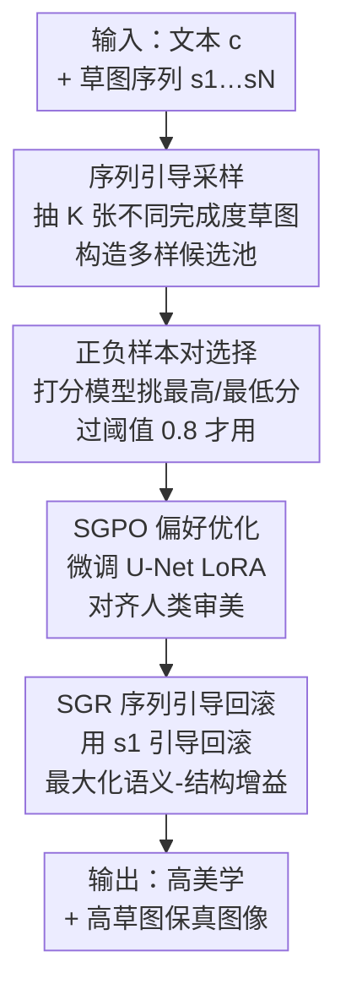

# SketchEvo：用绘画动态过程提升草图引导图像生成

**会议**: ICLR 2026  
**OpenReview**: [https://openreview.net/forum?id=Tsfxd4jDwJ](https://openreview.net/forum?id=Tsfxd4jDwJ)  
**代码**: GitHub page (论文称将公开)  
**领域**: 扩散模型 / 图像生成  
**关键词**: 草图引导生成、人类偏好对齐、绘画序列、扩散模型、回滚机制

## 一句话总结
SketchEvo 把"草图从第一笔到完成"的绘画动态序列当成偏好优化的多样性来源——训练时用不同完成度的草图作条件构造差异显著的正负样本对来对齐人类审美，推理时用初始草图笔画引导回滚机制强化语义增益，从而在保持草图保真度的同时显著提升生成图像的美学质量。

## 研究背景与动机

**领域现状**：草图引导的可控生成（ControlNet、T2I-Adapter、VersaGen 等）已经能把草图作为空间结构先验，叠加文本提示生成图像，让用户用最直观的"画画"方式表达创作意图。

**现有痛点**：这些方法都把**完成的草图当成一个静态的空间约束**，只关心最终那张图长什么样，忽略了绘画过程中逐笔累积所隐含的人类偏好信息。面对业余用户画得粗糙、比例失调的草图时，模型会"技术上正确但审美上灾难"——严格贴合了（本就糟糕的）结构约束，却完全没抓住人想要的美感。

**核心矛盾**：作者发现真正的瓶颈在偏好对齐这一步。DPO / D3PO / SPO 这类偏好优化方法靠"比较生成变体、向更受偏好的方向调整"来工作，但它们制造变体只靠**给隐变量加随机高斯噪声**。在草图+文本的**双重约束**下，噪声扰动只能产生差异极小的候选样本——正负样本几乎一样，梯度信号 $\Delta r \to 1$ 退化成无方向的噪声，根本学不到有意义的审美改进。于是模型被逼进一个伪两难：要么忠实复刻有缺陷的业余草图，要么生成好看但不贴草图的图。

**切入角度**：作者的关键观察是——**绘画序列 $\{s_1, s_2, \dots, s_N\}$ 本身就是天然的多样性来源**。不同绘制阶段的中间草图代表了不同的抽象程度和细节层次（第一笔 $s_1$ 和完成稿 $s_N$ 差异巨大），它们彼此结构语义差异显著，却又都连着用户的同一个创作意图。

**核心 idea**：用"不同完成度草图作条件"代替"单纯加噪声"来制造候选样本，从而在双重约束下也能得到差异足够大、梯度信息足够丰富的正负样本对；并把训练学到的偏好通过一个序列引导的回滚机制在推理阶段充分释放。

## 方法详解

### 整体框架

SketchEvo 基于 ControlNetXL 微调，由两个互补模块跨越"训练—推理"全生命周期协同：训练阶段用 **SGPO（序列引导偏好优化）** 制造差异显著的正负样本对，微调 U-Net 里的 LoRA 来对齐人类审美；推理阶段用 **SGR（序列引导回滚）** 机制，借助草图序列与文本条件共同引导去噪回滚，把训练学到的审美偏好充分释放到最终图像，同时守住对用户草图意图的结构保真。

整体的数据流是：给定文本 $c$ 和一整条草图序列，训练时在每个去噪步从序列里随机抽 $K$ 张不同完成度的草图作条件、构造候选池，打分模型挑出最高分/最低分组成正负对（过阈值才用）来更新 LoRA；推理时再用初始抽象草图 $s_1$ 引导回滚，最大化语义—结构信息增益生成最终图。

### 关键设计

**1. 序列引导采样：用不同完成度草图代替噪声制造差异样本**

这一设计直击"双重约束下噪声扰动产生不了差异样本"的痛点。传统 SPO 构造候选池靠在生成样本上加随机高斯噪声 $x_t^k = \mu_\theta(x_{t+1}, c, t+1) + z,\ z \sim \mathcal{N}(0, I)$，候选间的差异完全由噪声 $z$ 主导——在文本+草图双约束下这点差异微乎其微。SGPO 的做法是在每个采样步从绘画序列里随机选 $K$ 张草图作条件，把候选池构造改成 $x_t^k = \mu_\theta(x_{t+1}, c, c_{s_n}^k, t+1) + z$，其中 $c_{s_n}^k$ 是第 $k$ 个样本采用的草图条件。因为各中间阶段草图在结构和细节上发生了实质演化（$s_1$、$s_n$、$s_N$ 彼此差异巨大），候选样本的差异不再被噪声单独支配，而是由"草图完成度"这个语义维度撑开，从而产出真正多样化的样本。

**2. 正负样本对选择：靠样本差异性救活退化的偏好梯度**

有了多样候选池，还要把它转化成有效的训练信号。在每个扩散时间步 $t$，用一个预训练打分模型评估候选池里所有样本，取最高分和最低分分别作为正样本 $x_t^w$ 和负样本 $x_t^l$ 组成正负对，且**只有差异超过预设阈值的样本对才用于训练**（实验里阈值取 0.8，远高于 SPO 的 0.4）。为什么这一步关键？把 SGPO 的梯度展开：

$$\nabla_\theta L_{\text{Ours}} = -\beta \mathbb{E}\big[\sigma(-\beta\Delta r)\,(\nabla_\theta \log p_\theta(x_t^w | c_{s_w}, \cdots) - \nabla_\theta \log p_\theta(x_t^l | c_{s_l}, \cdots))\big]$$

梯度的有效性直接取决于正负样本 $x_t^w$ 与 $x_t^l$ 的差异：当样本多样性不足时差异缩小，$\Delta r \to 1$，梯度退化成没有方向的无用信号。SGPO 因为候选池多样性显著高于 SPO，正负对差异更明显，于是能持续提供"指向更美"的丰富梯度，把原本退化的偏好优化救活。

**3. 序列引导回滚（SGR）：把训练学到的偏好在推理阶段充分释放**

光在训练阶段对齐好偏好还不够，直接套用已有的文本回滚机制到草图任务上会遇到明显瓶颈——因为那些机制的优化目标只为单模态文本条件设计，没建模草图条件里固有的结构先验。SGR 的做法是把草图绘画序列和文本条件**联合**起来引导回滚：

$$\epsilon_\theta^t(x_t) = (1+\gamma_1)u_\theta(x_t, c, c_{s_N}, t) - \gamma_1 u_\theta(x_t, \varnothing, c_{s_N}, t)$$
$$\epsilon_\theta^t(\tilde{x}_t) = (1+\gamma_2)u_\theta(\tilde{x}_t, c, c_{s_n}, t) - \gamma_2 u_\theta(\tilde{x}_t, \varnothing, c_{s_n}, t)$$

这里的信息增益不仅包含文本 $c$ 的语义，还包含草图序列 $s_n$ 引入的结构细节，以及模型参数 $\theta$ 学到的人类偏好。当草图序列确定时，回滚被简化为类文本生成的方式，于是把 $\gamma_1, \gamma_2$ 配置成最大化语义增益。论文进一步推导出累积信息增益 $\delta_{Z\text{-Sampling}} \propto \sum_t (u_\theta(x_t, c, c_{s_n}, t))^2$（附录 D 证明，⚠️ 以原文为准）——**只要拉大文本条件 $c$ 和草图条件 $c_{s_n}$ 之间的分歧，累积信息增益就越大**。这正解释了为什么用最抽象的初始草图 $s_1$（和文本差异最大）来引导回滚效果最好：它把条件的语义—结构信息和模型的偏好信息都放大到最强，同时还更好地保住了草图的结构特征。

### 损失函数 / 训练策略

训练沿用 SPO 的偏好优化框架 $L_{\text{SPO}} = -\mathbb{E}[\log\sigma(\beta\Delta r)]$，其中 $\beta$ 为正则超参，$\Delta r$ 为正负样本相对参考模型 $p_{\text{ref}}$ 的偏好比值（见关键设计 2 的梯度式）。模型基于 ControlNetXL 微调，只训练 U-Net 中的 LoRA，全程仅在 Sketchy 数据集上训练，A100 GPU。

## 实验关键数据

### 主实验（Sketchy 数据集）

| 方法 | Image Reward ↑ | HPS v2 ↑ | Pick Score ↑ | LPIPS-sketch ↓ | CLIP-Score ↑ |
|------|------|------|------|------|------|
| ControlNet | 0.004 | 24.08 | 20.03 | **0.11** | 23.70 |
| VersaGen | 0.08 | 24.68 | 20.79 | 0.14 | 23.77 |
| AnimateDiff | 0.23 | 23.68 | 20.42 | 0.14 | 23.56 |
| ControlNet-DPO | 0.47 | 25.02 | 20.86 | 0.16 | 23.35 |
| ControlNet-SPO | 0.61 | 27.69 | 22.04 | 0.17 | 23.65 |
| SGPO（无回滚） | 1.03 | 28.87 | 21.94 | 0.20 | 23.86 |
| **Ours（SGPO+SGR）** | **1.18** | **30.08** | **22.41** | 0.15 | **24.15** |

在人类偏好三项指标（Image Reward / HPS v2 / Pick Score）上全面领先，Image Reward 从 SPO 的 0.61 提升到 1.18 接近翻倍。语义保真（CLIP-Score）最高；草图相似度（LPIPS-sketch）不是最低，因为 ControlNet/T2I-Adapter 严格贴合草图——但作者强调那是"忠实复刻有缺陷草图"，并非优势。SGR 在 SGPO 基础上把各项指标进一步推高，验证了回滚机制的增益。

### 泛化实验（仅在 Sketchy 训练，跨数据集测试）

| 数据集 | 方法 | Image Reward ↑ | HPS v2 ↑ | PickScore ↑ | CLIP-Score ↑ |
|------|------|------|------|------|------|
| QuickDraw（抽象） | ControlNet-SPO | 0.40 | 27.05 | 21.38 | 24.01 |
| QuickDraw | **Ours** | **0.86** | **30.22** | **21.67** | **24.28** |
| AnimeDiffusion（专业） | ControlNet-SPO | 0.27 | 23.28 | 19.67 | 23.99 |
| AnimeDiffusion | **Ours** | **1.32** | **31.57** | **23.68** | **24.96** |
| FSCOCO（复杂场景） | ControlNet-SPO | 0.52 | 27.51 | 19.09 | 24.39 |
| FSCOCO | **Ours** | **0.96** | **30.31** | **21.78** | **24.77** |

模型能根据草图抽象程度**自动平衡美学与草图相似度，无需手动调权重**：在抽象的 QuickDraw 和专业的 AnimeDiffusion 上都拿到最高美学分；越专业的草图（QuickDraw→Sketchy→FSCOCO→AnimeDiffusion）图像—草图相似度越高，且不牺牲美学质量。

### 消融实验

| 配置 | 关键发现 |
|------|---------|
| SGPO 候选池多样性 | 跨所有去噪阶段，正负样本最大美学分差显著高于 ControlNet-SPO，支撑了 0.8 vs 0.4 的更高过滤阈值 |
| SGR 用 $s_1$ 引导 | 综合评测最优，生成结果稳定且更好保留草图结构特征 |
| SGR 用 $s_{N-1}$ 引导 | 表现最差——与文本差异最小、信息增益最弱 |
| SGR 用 $s_{0.2N}$~$s_{0.8N}$ | 随笔画增多，与文本分歧减小，一致性逐步下降 |

### 关键发现
- 候选池多样性是整个方法的命脉：序列引导采样把正负样本差异拉大，直接决定了偏好梯度有没有方向，这也是 SGPO 单独就能把 Image Reward 从 0.61 抬到 1.03 的原因。
- 回滚用越抽象的草图越好这一反直觉结论，与 Eq.8 的理论推导一致：草图条件与文本条件分歧越大、累积信息增益越大，所以初始笔画 $s_1$ 反而最优。
- 复杂场景（FSCOCO）整体相似度普遍偏低（连 ControlNet 也只有 0.41），印证多元素草图严格对齐本就困难，但本文在该难度下仍两项指标双赢。

## 亮点与洞察
- **把"绘画过程"重新定义为偏好优化的多样性燃料**：以往草图引导生成只盯最终稿，本文洞察到中间草图的抽象层级差异正好是双约束下最稀缺的"样本差异性"来源，一举绕开了噪声扰动失效的难题。这个"用任务内在结构而非外加噪声来制造多样性"的思路可迁移到任何受强条件约束、偏好对齐困难的多模态生成任务。
- **理论和实验闭环**：从梯度退化 $\Delta r \to 1$ 推出"需要更大样本差异"，再用累积增益 $\propto \sum(u_\theta)^2$ 推出"条件分歧越大越好"，最后用 $s_1$ vs $s_{N-1}$ 的消融完美对应，论证链条很扎实。
- **自适应平衡免调参**：模型能按草图专业度自动权衡美学与保真，业余/专业草图通吃，对交互式实时绘画创作很实用。

## 局限与展望
- 训练只用了 Sketchy 单一数据集，虽展示了跨域泛化，但偏好打分模型本身的偏置会直接传导到对齐结果，"人类偏好"实际由预训练 scoring model 代理，可能与真实多元审美有偏差。
- 草图相似度（LPIPS-sketch）并非最优，对需要严格逐笔保真的场景（如工程制图）可能不适用——本文的价值定位在"美学优先"。
- SGR 需要拿到完整或部分绘画序列，对只有最终静态草图、无过程数据的输入，序列引导采样的多样性来源会受限；论文未充分讨论无序列时的退化行为。
- $\gamma_1, \gamma_2$ 的具体配置、阈值 0.8 的敏感性等超参细节留在附录，正文未展开。

## 相关工作与启发
- **vs ControlNet / T2I-Adapter / VersaGen**: 它们把草图当静态空间约束严格贴合，本文把草图序列当动态偏好信号；前者草图相似度高但面对业余草图会"忠实复刻缺陷"，本文牺牲少量相似度换取大幅美学提升。
- **vs DPO / SPO 偏好对齐**: 它们靠随机高斯噪声制造候选变体，在文本+草图双约束下样本差异不足、梯度退化；本文用不同完成度草图作条件制造差异样本，从根上解决了双约束下偏好优化信号弱的问题。
- **vs 文本回滚机制（Z-Sampling 类）**: 已有回滚只为单模态文本设计、忽略草图结构先验；SGR 把草图序列与文本联合引导回滚，并从理论上指出用最抽象草图引导能最大化信息增益。

## 评分
- 新颖性: ⭐⭐⭐⭐⭐ 把绘画动态序列变成偏好优化多样性来源是个有洞察力的全新视角
- 实验充分度: ⭐⭐⭐⭐ 主实验+三数据集泛化+消融较完整，但缺无序列输入下的鲁棒性分析
- 写作质量: ⭐⭐⭐⭐ 动机—理论—实验闭环清晰，部分公式细节需查附录
- 价值: ⭐⭐⭐⭐ 对交互式草图创作和强约束下的偏好对齐都有实用与方法论价值

<!-- RELATED:START -->

## 相关论文

- [\[ICLR 2026\] Improving Classifier-Free Guidance in Masked Diffusion: Low-Dim Theoretical Insights with High-Dim Impact](improving_classifier-free_guidance_in_masked_diffusion_low-dim_theoretical_insig.md)
- [\[ICLR 2026\] Generalization of Diffusion Models Arises with a Balanced Representation Space](generalization_of_diffusion_models_arises_with_a_balanced_representation_space.md)
- [\[ICLR 2026\] CMT: Mid-Training for Efficient Learning of Consistency, Mean Flow, and Flow Map Models](cmt_mid-training_for_efficient_learning_of_consistency_mean_flow_and_flow_map_mo.md)
- [\[ICLR 2026\] PCPO: Proportionate Credit Policy Optimization for Aligning Image Generation Models](pcpo_proportionate_credit_policy_optimization_for_aligning_image_generation_mode.md)
- [\[ICLR 2026\] PI-Light: Physics-Inspired Diffusion for Full-Image Relighting](pi-light_physics-inspired_diffusion_for_full-image_relighting.md)

<!-- RELATED:END -->
