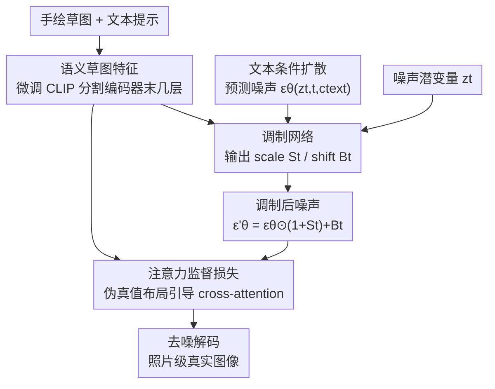

# SketchingReality: 从手绘场景草图到照片级真实图像

**会议**: ICLR 2026  
**OpenReview**: [https://openreview.net/forum?id=g5QqkCLbog](https://openreview.net/forum?id=g5QqkCLbog)  
**代码**: 项目主页提供（论文未给出仓库地址）  
**领域**: 扩散模型 / 图像生成  
**关键词**: 手绘草图, 草图到图像, 噪声调制, 注意力监督, 潜空间扩散

## 一句话总结
这篇论文提出 SketchingReality，用一个"语义调制 + 注意力监督"的方案，把抽象、变形的**手绘**场景草图（而非整齐的边缘图）转成既忠于草图语义、又照片级真实的图像，并设计了一种无需像素对齐真值图的训练损失。

## 研究背景与动机
**领域现状**：随着扩散模型变强，研究者在文本之外探索越来越多的条件信号——深度图、边缘图、相机参数、参考图等，以获得更精细的可控生成。草图是人类最古老的表达方式之一，几笔就能传达难以言说的视觉概念，是天然的人本可控条件。

**现有痛点**：现有所谓"草图条件"的方法（ControlNet、T2I-Adapter 等）实际处理的是**像素对齐的边缘图**，而被误称为"草图"。真正的手绘草图带有强烈的抽象与变形：草地可能只是一排竖线、森林只是几棵示意的树、物体相对大小严重失真。把这些方法直接用到手绘草图上，要么忽略草图细节、要么牺牲真实感。

**核心矛盾**：手绘草图天生没有"唯一正确的像素对齐"——同一张草图可以对应无数张合理的真实图像。因此标准去噪目标所依赖的"像素对齐真值图"在手绘场景下根本不存在，用 FS-COCO 里那种风格化、不对齐的参考图去监督会引入歧义。问题的根子在于：**应该强调对草图语义的理解，而不是对每条线位置的死板对齐**。

**本文目标**：在生成图像时，同时做到（i）从高度抽象的草图中抽取有意义的语义表征；（ii）生成既真实、又尊重草图布局的图像。

**切入角度**：作者观察到 ControlNet 用的 VAE 编码器缺乏对草图的语义理解，而 Adapter 用的卷积编码器表达力又不够；与其硬抠像素，不如复用一个本来就为草图语义分割训练过的 CLIP 式编码器，把"物体在哪、是什么"的语义信号注入生成过程。

**核心 idea**：用语义草图特征去**调制**（scale/shift）扩散噪声预测，并用草图编码器导出的"伪真值注意力图"在训练时监督 cross-attention，从而摆脱对像素对齐真值图的依赖。

## 方法详解

### 整体框架
SketchingReality 建立在潜空间扩散模型（LDM）之上，输入是一张手绘场景草图加一句文本提示，输出是一张照片级真实图像。整体可以看成三步串联：先用一个**语义草图编码器**把抽象草图编码成"物体在哪、是什么"的语义特征；再用一个**调制网络**拿这些语义特征去修正文本条件扩散预测出的噪声（生成逐像素的缩放图 $S_t$ 和偏移图 $B_t$）；训练时再用一个**注意力监督损失**，借草图编码器导出的伪真值注意力图去约束 cross-attention，让生成图按草图布局落子，而这一切都不需要像素对齐的真值图。

### 关键设计

**1. 语义草图特征：用为分割训练过的 CLIP 编码器读懂抽象草图**

针对"VAE / 卷积编码器读不懂手绘草图语义"这个痛点，作者首次复用一个预训练的 CLIP 式草图编码器（Bourouis et al., 2024）。这个编码器原本是在 FS-COCO 手绘草图上训练做开放词表语义分割的，天然带有"每个像素属于哪个物体"的空间语义。但直接拿分割特征做生成会缺乏细粒度细节，于是作者**微调它最后三层**，在保持语义可分的潜空间的同时，补回足够的视觉细节，实测能显著提升生成图与输入草图的对齐度。这一步是后续调制网络和注意力监督的共同"语义来源"。

**2. 调制网络：用 scale/shift 调制噪声，而非硬性对齐线条**

针对"强行像素对齐会破坏真实感"的矛盾，作者沿用并扩展 Ham et al. (2023) 的噪声调制思路，设计了一个专门吃语义草图特征的调制网络。它接收语义草图特征、噪声潜变量 $z_t$ 和文本条件下的噪声预测 $\epsilon_\theta(\cdot)$，输出逐像素的缩放图 $S_t \in \mathbb{R}^{H\times W\times 4}$ 与偏移图 $B_t$，然后按

$$\epsilon'_\theta(z_t, t, c_\text{text}, c_\text{sketch}) = \epsilon_\theta \odot (1 + S_t) + B_t$$

去调制噪声预测。网络是一个编码器-解码器 CNN：每个模态（语义特征、$z_t$、$\epsilon_\theta$）先各自经过独立的下采样分支投到等维嵌入空间，拼接后过一个时间步条件卷积层、激活、再卷积，融合特征经三层上采样得到 $S_t$、$B_t$。和 Ham et al. 把所有输入直接拼进单分支 U-Net 不同，**每个模态独立下采样**被消融证明更能利用草图信息。因为调制是"软"地缩放偏移噪声、而不是把线条当硬约束塞进去，它能在尊重草图语义的同时保留扩散模型本身的真实感。

**3. 注意力监督损失：免像素对齐真值图的训练信号**

这是为解决"手绘草图没有像素对齐真值图"而提出的核心损失。作者利用上面那个语义编码器本就为分割训练、能给出"物体在哪"的强空间信号，用原始（未微调）草图编码器特征算出伪真值注意力图 $M_\text{grth}$（手绘草图按特征-文本相似度过 0.5 阈值得二值掩码；合成草图直接用 MS-COCO 分割图）。训练时从调制后噪声 $\epsilon'_\theta$ 算出去噪潜变量 $\hat z_0$，再过去噪网络抽多层 cross-attention 图 $M$，用 $M_\text{grth}$ 监督：

$$L_\text{attn} = \sum_{\gamma\in\Gamma}\sum_{i\in I}\sum_{b_i\in B}\left[\left(1-\frac{\sum_{p\sim b_i} M^{(\gamma)}_{pi}}{\sum_p M^{(\gamma)}_{pi}}\right)^2 - \lambda_\text{reg}\sum_{p\sim b_i} M^{(\gamma)}_{pi}\right]$$

直观上，前一项鼓励第 $i$ 个文本 token 的注意力质量集中到草图给定区域 $b_i$ 内，后一项（权重 $\lambda_\text{reg}$）防止注意力泄漏到目标区域之外。这样训练只需草图的语义布局、不需要像素对齐的真值图，绕开了手绘草图的根本难题。

### 损失函数 / 训练策略
总目标是四项加权和：

$$L_\text{total} = \lambda_0 L_\text{noise} + \lambda_1 L_\text{attn} + \lambda_2\left(L^\text{scale}_1 + L^\text{shift}_1 + L_\text{var}\right)$$

其中 $L_\text{noise}$ 是标准去噪损失；$L^\text{scale}_1=\|S_t\|_1$、$L^\text{shift}_1=\|B_t\|_1$ 是对调制图的 L1 正则；$L_\text{var}=-(\sigma(S_t)+\sigma(B_t))$ 通过惩罚低方差鼓励调制更具表现力和多样性。权重取 $\lambda_0,\lambda_1=1.0$，$\lambda_2=0.1$。

训练数据是 FS-COCO（9,525 训练 / 475 测试），每张图额外用 Su et al. (2023) 生成一张合成草图，batch 按 50% 手绘 + 50% 合成混合；对手绘草图设 $\lambda_0=0.0$（即不用去噪损失，只靠注意力监督），用 FS-COCO 自带 caption。训练只在**噪声最大的前 10% 时间步**进行（高噪声阶段控制整体语义结构），推理时也只调制这 10% 步。骨干用 SD2.1，单张 A100 训练，并在附录给出 SDXL 结果。

## 实验关键数据

### 主实验
在 FS-COCO 的 475 张手绘测试草图上，用 FID、CLIP 草图-图像相似度、LPIPS 三个指标评估。本文方法在三项上全面领先所有基线（含 ControlNet、T2I-Adapter、ControlNext、SG、FreeControl）。

| 方法 | 设置 | FID↓ | CLIP↑ | LPIPS↓ |
|------|------|------|-------|--------|
| ControlNet SD2.1 | Zero-shot | 135.595 | 1.136 | 0.773 |
| ControlNet SD2.1 | $L_\text{noise}+L_\text{attn}$ | 135.891 | 1.196 | 0.768 |
| T2I-Adapter ($s{=}0.8,\tau{=}0.4$) | $L_\text{noise}+L_\text{attn}$ | 139.568 | 0.454 | 0.778 |
| ControlNext SDXL | Zero-shot | 134.094 | 0.909 | 0.774 |
| SG | Zero-shot | 137.381 | 1.043 | 0.782 |
| FreeControl | 推理时 | 141.632 | 1.089 | 0.793 |
| **Ours** | **Full** | **121.973** | **1.291** | **0.739** |

关键观察：对 ControlNet/T2I 直接在手绘草图上朴素微调会让所有指标都退化（因为缺乏像素对齐）；而**加上本文的注意力损失、混合合成+手绘草图训练后**，CLIP 相似度和 LPIPS 都明显改善，FID 几乎不掉，验证了注意力损失对手绘草图的重要性。

### 消融实验
消融了调制网络里草图表示的选择（对应图 4）：

| 草图表示方式 | 表现 |
|--------------|------|
| VAE 编码器（共享图像分支，仿 ControlNet） | FID 显著升高、CLIP 明显下降，甚至不如 ControlNet 本身 |
| 草图原图直接喂单分支 U-Net（仿 Ham et al.） | 表现最差，未能充分利用草图信息 |
| **语义草图特征 + 各模态独立下采样分支（本文）** | **最佳**，说明语义特征 + 分支独立设计缺一不可 |

此外还消融了"只在高噪声前 10% 时间步调制"的选择（附录 D.3），印证高噪声阶段主导整体语义结构这一设定。

## 总结
SketchingReality 的核心贡献在于把研究对象从"被误称为草图的整齐边缘图"切换到真正的**抽象手绘场景草图**，并给出三件配套利器：复用分割 CLIP 编码器获取语义草图特征、用 scale/shift 软调制噪声而非硬对齐线条、以及一个绕开像素对齐真值图的注意力监督损失。三者合力在 FS-COCO 上同时刷新了真实感（FID）与草图对齐（CLIP、LPIPS），且推理时不增加额外开销。局限在于仍依赖文本消解草图歧义、训练数据局限于 FS-COCO 单一手绘数据集，对更多样草图风格的泛化仍有待验证。

<!-- RELATED:START -->

## 相关论文

- [\[ICLR 2026\] Generalization of Diffusion Models Arises with a Balanced Representation Space](generalization_of_diffusion_models_arises_with_a_balanced_representation_space.md)
- [\[ICLR 2026\] Latent Wavelet Diffusion for Ultra-High-Resolution Image Synthesis](latent_wavelet_diffusion_for_ultra_high-resolution_image_synthesis.md)
- [\[ICLR 2026\] Purrception: Variational Flow Matching for Vector-Quantized Image Generation](purrception_variational_flow_matching_for_vector-quantized_image_generation.md)
- [\[ICLR 2026\] Improving Classifier-Free Guidance in Masked Diffusion: Low-Dim Theoretical Insights with High-Dim Impact](improving_classifier-free_guidance_in_masked_diffusion_low-dim_theoretical_insig.md)
- [\[ICLR 2026\] ViPO: Visual Preference Optimization at Scale](vipo_visual_preference_optimization_at_scale.md)

<!-- RELATED:END -->
