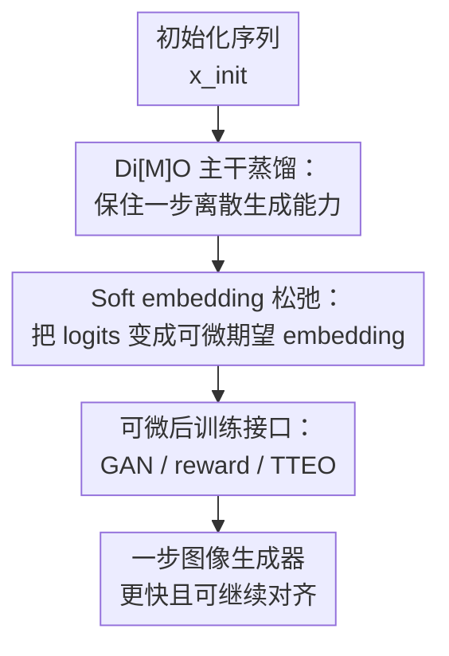

# Soft-Di[M]O: Improving One-Step Discrete Image Generation with Soft Embeddings

**会议**: ICLR2026  
**OpenReview**: [https://openreview.net/forum?id=83pHDDmkXt](https://openreview.net/forum?id=83pHDDmkXt)  
**代码**: 待发布  
**领域**: 图像生成 / 离散图像生成  
**关键词**: 一步生成, 离散扩散, masked diffusion model, soft embedding, reward fine-tuning  

## 一句话总结
Soft-Di[M]O 把一步离散图像生成器输出的 token 分布松弛成可微的期望 embedding，让 Di[M]O 蒸馏后的 Masked Diffusion Model 可以继续接入 GAN、可微软奖励微调和测试时 embedding 优化，在 ImageNet-256 上把一步 FID 推到 1.56，并在文本到图像任务上超过对应教师模型的 GenEval 与 HPS 指标。

## 研究背景与动机

**领域现状**：Masked Diffusion Models (MDMs) 通过反复把 mask token 填回离散视觉 token 来生成图像，MaskGit、MaskBit、Meissonic、MaskGen 这类模型已经能在 class-to-image 和 text-to-image 上得到不错效果。它们的问题也很直观：采样需要多轮迭代，速度比一步 GAN 或一步扩散蒸馏模型慢得多。Di[M]O 这类方法试图把多步 MDM 蒸馏成 one-step generator，让学生模型一次前向就输出整张图对应的离散 token。

**现有痛点**：一步离散学生虽然快，但它仍然被两个问题卡住。第一，数据无关蒸馏本质上是在追随教师模型，教师的建模误差、偏好对齐不足、某些 prompt 下的弱点都会传给学生。第二，学生最终输出的是离散 token，采样或 argmax 之后梯度就断了，后续很难像连续扩散蒸馏那样接 GAN post-training、reward fine-tuning 或 test-time optimization。

**核心矛盾**：论文要处理的是“离散表示好用但不可微”的矛盾。离散视觉 token 对 MDM 和 tokenizer decoder 很自然，能复用现成 teacher/tokenizer；但一旦把 logits 采样成 token，下游 discriminator、CLIP reward、ImageReward 或 HPS 的梯度就无法回到 generator logits。REINFORCE 虽然可以给离散采样估梯度，但高维图像 token 序列会带来很高方差；Gumbel-Softmax ST 又有 forward/backward mismatch 和噪声，尤其不适合 GAN 或 reward 这类本来就容易不稳定的训练。

**本文目标**：作者不是重新训练一个新的 MDM，也不是把离散 tokenizer 换成连续 VAE；目标是用最小改动让现有一步离散生成器变得可微，同时保持它与 teacher backbone 和 tokenizer decoder 的兼容性。具体来说，class-to-image 中希望用 GAN 弥补教师/学生分布差异，text-to-image 中希望用 differentiable reward 改善 prompt following 和审美质量，推理时还希望像 ReNO 一样通过额外计算优化输入 embedding。

**切入角度**：一个关键观察是，Di[M]O 或 ReDi 这类一步离散生成器的输出 logits 往往已经很尖锐，概率质量集中在少数候选 token 上。既然分布本来接近 one-hot，那么直接用“token embedding 的概率加权平均”作为连续代理，通常会非常接近采样 token 的 embedding，同时又保留从下游目标回传到 logits 的梯度。

**核心 idea**：Soft-Di[M]O 用 soft embedding 替代硬离散 token 作为后训练接口，把 $z_\theta \rightarrow p_\theta \rightarrow \tilde e_\theta$ 变成可微路径，从而在不破坏 Di[M]O 蒸馏主干的情况下解锁 GAN、reward fine-tuning 和 TTEO。

## 方法详解

### 整体框架

Soft-Di[M]O 以 Di[M]O 的一步 MDM 蒸馏为主干：学生模型从初始化序列 $x_{init}$ 一次前向输出所有位置的 logits $z_\theta$，一条离散路径仍然采样 token $x_\theta$ 并用 Di[M]O loss 对齐 teacher/auxiliary distribution；另一条连续路径把 logits 转成 soft embeddings，让额外监督可以直接对学生更新。这样，离散路径保证学生还在追随 MDM teacher，连续路径则负责把教师之外的外部反馈注入到一步生成器里。

从实现上看，学生输出 logits 后会同时服务两类目标。Di[M]O loss 仍然需要从 $p_\theta(x_0|x_{init})=\mathrm{softmax}(z_\theta)$ 中采样 token，经过 forward masking 得到 $\tilde x_t$，再比较 teacher $\phi$ 与 auxiliary model $\psi$ 在该中间状态上的分布差异。soft embedding 路径则不采样 token，而是把每个位置的概率分布乘上 embedding matrix，得到连续向量序列；这条路径可以送入冻结 teacher backbone 做判别，也可以送入 tokenizer decoder 得到可微图像，再用 reward model 打分。

### 关键设计

**1. Di[M]O 主干蒸馏：保住一步离散生成能力**

Soft-Di[M]O 没有抛弃原来的 Di[M]O。原因是如果只用 GAN 或 reward 去训练一步模型，学生很容易偏离 teacher distribution，文本到图像场景甚至会出现 reward hacking 或模式崩塌。论文保留 Di[M]O 的 on-policy distillation：学生先从 $x_{init}$ 生成 token $x_\theta$，再把这些 token 重新 mask 成 $\tilde x_t$，让 teacher $\phi$ 和 auxiliary model $\psi$ 在这个状态上的输出分布尽量一致。

这个主干目标可以理解成“让学生在自己会犯错的状态上继续学 teacher”。原论文给出的近似梯度形式是 $\nabla_\theta L_{\mathrm{Di[M]O}} \approx \mathbb{E}_{x_{init},t}[w(t)\,\mathbb{E}_{q_{t|0}}[\nabla_{z_\psi}D_{div}(p_\phi\|p_\psi)(\tilde x_t)\, dz_\theta(x_{init})/d\theta]]$。在 Soft-Di[M]O 里，这个 loss 起到 regularizer 的作用：GAN 和 reward 可以拉高真实度或偏好分数，但 Di[M]O 负责把生成器留在 teacher 的合理图像流形附近。

**2. Soft embedding 松弛：把 logits 变成可微期望 embedding**

论文的核心改动非常小：对每个 token 位置 $i$，学生输出 logits $z^i_\theta$，先经 softmax 得到词表分布 $p_\theta(x^i_0|x_{init})$，再用 teacher 或 tokenizer 的 embedding matrix $E\in\mathbb{R}^{|V|\times d}$ 做期望，得到 $\tilde e^i_\theta=E^\top p_\theta(x^i_0|x_{init})=\sum_j p_\theta(x^i_0=j|x_{init})E_j$。它不是额外学一个 projection，也不是另建一个连续 tokenizer，而是直接落在现有模型已经使用的 embedding space 里。

这一步之所以有效，靠的是一步离散生成器的 logits 通常已经很 concentrated。若最大概率 token $j^*$ 占据 $1-\epsilon$ 的概率，soft embedding 和硬 token embedding 的差距主要来自剩余 $\epsilon$ 概率质量。论文用二阶 Taylor 分析说明，对下游可微目标 $f$，soft surrogate $f(\tilde e)$ 与离散期望 $\mathbb{E}_{j\sim p_\theta}[f(e_j)]$ 的偏差受 embedding covariance 控制，形式上有 $|f(\tilde e)-\mathbb{E}[f(e_j)]|\le \frac{L}{2}\|\Sigma\|$，而 concentrated logits 下 $\|\Sigma\|=O(\epsilon)$。相比之下，Gumbel-Softmax ST 的 hard forward 和 soft backward 不一致，会产生一阶偏差和随机噪声，这解释了为什么本文的 soft embedding 在 GAN/reward 训练里更稳。

**3. 可微后训练接口：GAN / reward / TTEO**

soft embedding 的真正价值是把原本接不上梯度的后训练方法重新接回 generator。class-to-image 里，作者把 $\mathrm{Emb}_\phi(z_\theta)$ 送入冻结 teacher backbone，在若干 transformer layer 上接轻量 discriminator heads，判别真实 token embedding 和生成 soft embedding。为了让 discriminator 输入接近 teacher 预训练时看到的 masked sequence，论文还随机把真实或生成 embedding 替换成 mask embedding，用 mask ratio $r$ 做数据增强；对应的 generator loss 是 $L_{GAN}(\theta)=\mathbb{E}_{x_{init},r}[-\log D_\eta(\mathrm{Emb}_\phi(z_\theta)_r,r)]$。

text-to-image 里，作者改用 tokenizer decoder 的 embedding 层 $\mathrm{Emb}_{Dec}$，把 logits 转成 decoder 可接受的连续 embedding，解码出可微图像，再用 CLIP score、ImageReward 等可微 reward 构造 $L_{reward}(\theta)=-\sum_i\lambda_i R_i(\mathrm{Dec}(\mathrm{Emb}_{Dec}(z_\theta),c))$。最终训练目标写成 $L_{gen}=L_{\mathrm{Di[M]O}}+w_{GAN}L_{GAN}+w_{reward}L_{reward}$。训练后，TTEO 进一步不改模型参数，而是在测试时优化输入 embedding $e_{in}$，求 $e^*=\arg\max_{e_{in}} R(\mathrm{Dec}(\mathrm{Emb}_{Dec}(z_\theta(e_{in}))),c)$，用额外推理计算换更好的 reward 分数。

### 一个完整示例

以一个文本 prompt “a red cube on the left of a blue sphere”为例，MaskGen-L teacher 原本需要多步从 mask token 逐渐恢复 1D visual tokens。Di[M]O 学生把这个过程压缩成一步：给定 $x_{init}$ 和 prompt 条件 $c$，一次输出所有 token 位置的 logits $z_\theta$。如果走传统离散路径，模型会从每个位置采样 token，然后交给 tokenizer decoder 得到图像；但这条路径的 CLIP reward 或 ImageReward 无法回到采样前的 logits。

Soft-Di[M]O 则在同一批 logits 上并行走连续路径。每个位置不采样，而是得到 $\tilde e^i_\theta=\sum_jp^i_jE_j$，整段 embedding 被 decoder 解成图像，reward model 发现“red cube”和“blue sphere”的颜色或位置关系不够好，就把梯度从 reward loss 传回 decoder 输入、embedding expectation、softmax 概率和 logits。与此同时，Di[M]O loss 仍在约束学生不要为了 reward 把图像推成过饱和或离开 teacher distribution。测试时如果还想进一步花计算，可以固定参数、只优化输入 embedding，使同一个一步生成器对这个 prompt 得到更高的综合 reward。

### 损失函数 / 训练策略

训练目标由基础蒸馏项和任务相关后训练项组成：class-to-image 主要使用 $L_{\mathrm{Di[M]O}}+w_{GAN}L_{GAN}$，因为 ImageNet-256 的核心指标 FID 衡量分布匹配，直接 reward 优化可能偏离 class-conditional target；text-to-image 主要使用 $L_{\mathrm{Di[M]O}}+w_{reward}L_{reward}$，因为 GenEval、HPS、CLIP score 更贴近 prompt adherence 和人类偏好。

实现细节上，论文在 MaskGit、MaskBit、Meissonic、MaskGen 四类 teacher 上实验。默认训练使用 Adam、bf16、EMA 0.9999、100 step linear warmup，并冻结 generator embedding layer 来稳定蒸馏。MaskBit 的长训练版本在前一阶段 checkpoint 上继续训练，降低学习率到 $5\times10^{-7}$，GAN loss weight 提到 200，并加入 AdamW weight decay 0.01。TTEO 使用 SGD，学习率 0.2，不做 gradient clipping，选择时综合 CLIP score、ImageReward、HPS 和 PickScore。

## 实验关键数据

### 主实验

class-to-image 在 ImageNet-256 上验证。最强结果来自 MaskBit teacher：Di[M]O-MaskBit 一步 FID 是 2.89，Soft-Di[M]O-MaskBit 加 GAN 后降到 1.96，长训练进一步到 1.56，已经接近 64-step MaskBit teacher 的 1.66，并且明显好于同表中的多种一步或少步方法。

| 设置 | 方法 | Steps | FID↓ | IS↑ | Precision↑ | Recall↑ |
|------|------|-------|------|-----|------------|---------|
| MaskBit teacher | MaskBit | 64 | 1.66 | 320.0 | 0.81 | 0.60 |
| MaskBit teacher | Di[M]O-MaskBit | 1 | 2.89 | 310.1 | 0.87 | 0.49 |
| MaskBit teacher | Soft-Di[M]O-MaskBit | 1 | 1.96 | 281.4 | 0.84 | 0.55 |
| MaskBit teacher | Soft-Di[M]O-MaskBit + longer training | 1 | 1.56 | 273.2 | 0.81 | 0.60 |
| MaskGit teacher | Di[M]O | 1 | 6.91 | 214.0 | 0.83 | 0.38 |
| MaskGit teacher | Soft-Di[M]O | 1 | 6.40 | 214.8 | 0.83 | 0.39 |

text-to-image 则分别用 Meissonic 和 MaskGen-L teacher。Meissonic 上，Soft-Di[M]O 把 Di[M]O-Meissonic 的 GenEval overall 从 0.43 提到 0.53，HPS 平均从 28.59 提到 32.35；MaskGen-L 上，reward fine-tuning 后整体 GenEval 从 0.42 到 0.51，TTS/TTEO 后进一步到 0.63，尤其 counting 和 color attribute 的提升很明显。

| 方法 | Steps | FID↓ | CLIP↑ | GenEval Overall↑ | HPS Avg↑ | 备注 |
|------|-------|------|-------|------------------|----------|------|
| Meissonic teacher | 32 | 50.13 | 0.318 | 0.46 | 29.63 | 多步教师 |
| Di[M]O-Meissonic | 1 | 38.45 | 0.322 | 0.43 | 28.59 | 一步蒸馏 baseline |
| Soft-Di[M]O-Meissonic | 1 | 28.33 | 0.319 | 0.53 | 32.35 | reward fine-tuning |
| MaskGen-L teacher | 16 | 22.64 | 0.312 | 0.48 | 27.60 | 多步教师 |
| Di[M]O-MaskGen-L | 1 | 24.15 | 0.299 | 0.42 | 27.14 | 一步蒸馏 baseline |
| Soft-Di[M]O-MaskGen-L | 1 | 23.43 | 0.321 | 0.51 | 29.38 | Di[M]O + reward |
| Soft-Di[M]O-MaskGen-L + TTS | 1 | - | - | 0.63 | 31.95 | 测试时 embedding 优化 |

### 消融实验

论文的消融集中回答三个问题：为什么用 soft embedding 而不是 Gumbel-ST，为什么不能只靠 GAN，为什么 discriminator 要看到 masked embedding。图 4 没有给出完整表格数值，但趋势很明确：soft embedding 的 FID 曲线始终优于 Gumbel hard straight-through；GAN-only 在 MaskBit 上不如 Di[M]O + GAN 的组合，在 MaskGen 大初始 mask ratio 下还会发生明显 mode collapse；更大的 GAN mask range 带来更好的训练收益。

| 配置 | 观察指标 | 结论 |
|------|----------|------|
| Gumbel hard straight-through | ImageNet-256 5k FID 曲线 | 比 soft embedding 更不稳定，FID 全程更差 |
| Soft embedding | ImageNet-256 5k FID 曲线 | 低方差、无 forward/backward mismatch，训练更稳 |
| 仅继续 Di[M]O loss | ImageNet-256 5k FID 曲线 | 继续训练本身不能明显改善结果 |
| GAN only | ImageNet-256 5k FID / qualitative | 缺少 Di[M]O 正则时质量不够，MaskGen 设置下会 mode collapse |
| Di[M]O + GAN | ImageNet-256 5k FID 曲线 | GAN 提供分布层面的 refinement，Di[M]O 保持 teacher 流形 |
| $r_{GAN}\in[0,0]$ | GAN mask schedule | 不 mask 的 discriminator 更容易过拟合，收益较小 |
| $r_{GAN}\in[0,0.95]$ | GAN mask schedule | 大 mask range 作为输入增强，带来最大增益 |

### 关键发现

- soft embedding 的收益不是来自额外参数，而是来自一个合适的可微软接口。它让相同的一步离散生成器可以接 GAN、reward、TTEO，而这些方法在硬 token 输出下原本很难直接使用。
- Di[M]O loss 对后训练很重要。GAN 或 reward 能把模型往更好指标推，但没有 Di[M]O 约束时会出现分布漂移、reward hacking 或模式崩塌。
- teacher 质量仍然决定上限。MaskBit teacher 强，Soft-Di[M]O 在 ImageNet-256 上能到 FID 1.56；text-to-image 中 MaskGen-L teacher 和 Meissonic teacher 的差异也影响学生最终表现。
- TTEO 证明了 soft embedding 不只服务训练，也能用于推理时 scaling：在不增加采样步数的前提下，通过优化输入 embedding 换取更高 GenEval/HPS。

## 亮点与洞察

- soft embedding 是一个“最小侵入”的桥接设计。它既不改变 MDM teacher，也不替换离散 tokenizer，只是在 logits 和既有 embedding layer 之间加一个期望算子，因此很容易嵌入现有 Di[M]O pipeline。
- 论文把离散生成里常见的不可微问题讲得比较实用。REINFORCE、Gumbel-ST、soft-argmax 都不是新概念，但作者抓住 one-step MDM logits 高度集中的性质，说明这里用期望 embedding 比通用松弛更合适。
- GAN discriminator 复用 frozen teacher backbone 很巧妙。它避免重新训练一个从像素或 token 开始的大判别器，又利用 teacher 原本理解 masked sequence 的能力，让 real/fake embedding 比较发生在更语义化的多尺度特征空间中。
- 这篇论文给离散视觉生成打开了后训练路线。过去 reward alignment、adversarial post-training、test-time scaling 更常见于连续扩散模型；Soft-Di[M]O 表明离散 tokenizer + MDM 也可以吃到类似红利。

## 局限与展望

- 方法仍然受 teacher 和 tokenizer 上限限制。作者明确提到，GAN 在 latent/embedding 空间工作，学生性能会被 tokenizer reconstruction FID 约束；离散 tokenizer 的 rFID 往往高于连续 tokenizer。
- text-to-image 的提升依赖 reward 设计。CLIP、ImageReward、HPS、PickScore 能改善可量化偏好，但也可能诱发过饱和、过度迎合 reward 的图像，因此 Di[M]O 正则不可少。
- 当前实验主要覆盖 class-to-image 和 text-to-image，没有真正验证多模态离散模型、语言 MDM 或更复杂统一生成任务。论文认为可扩展到 Show-o、Fudoki 等多模态离散 diffusion，但这仍是 future work。
- 分辨率和可变尺寸能力继承 teacher 的限制。像许多 MDM 图像生成器一样，本文模型不能自然生成任意分辨率图像。
- TTEO 虽然提升明显，但本质上用额外测试时计算换指标；在实时生成场景中，需要进一步评估质量收益和延迟成本是否划算。

## 相关工作与启发

- **vs Di[M]O**: Di[M]O 解决的是多步 MDM 到一步生成器的蒸馏问题，Soft-Di[M]O 保留这条主干，但补上可微后训练接口。区别在于 Di[M]O 的学生只能继承 teacher，Soft-Di[M]O 可以继续用 GAN、reward 和 TTEO 修正 teacher/student 的不足。
- **vs Gumbel-Softmax ST**: Gumbel-ST 也能把离散选择松弛成可微近似，但 forward 用 hard sample、backward 用 soft sample，会有一阶偏差和 Gumbel 噪声。Soft embedding 直接用确定性的期望 embedding，偏差来自 embedding variance，在 logits 集中时更小。
- **vs 连续扩散一步蒸馏 / DMD / LCM / Turbo 类方法**: 连续扩散模型本来就在连续 latent 或 pixel 空间里，接 adversarial training 和 reward fine-tuning 更自然；本文的价值在于把类似后训练范式移植到离散视觉 token 生成器上。
- **vs ReNO / test-time scaling**: ReNO 优化连续扩散模型的初始噪声，Soft-Di[M]O 的 TTEO 优化的是一步离散学生的输入 embedding。启发是：只要生成路径变成可微，测试时不一定要多采样很多次，也可以用梯度搜索更好的初始化。

## 评分

- 新颖性: ⭐⭐⭐⭐ 软嵌入本身不是全新数学工具，但把它系统用于一步 MDM 离散图像生成，并串起 GAN、reward、TTEO，问题切得很准。
- 实验充分度: ⭐⭐⭐⭐⭐ 覆盖 MaskGit、MaskBit、Meissonic、MaskGen，包含 class-to-image、text-to-image、消融和测试时优化，主结论支撑比较完整。
- 写作质量: ⭐⭐⭐⭐ 方法脉络清楚，公式和 pipeline 充分；部分实验表格较密，附录细节需要来回对照才能完全复现。
- 价值: ⭐⭐⭐⭐⭐ 对离散视觉生成很有启发，尤其是让 one-step discrete generator 获得类似连续扩散蒸馏的 post-training 能力。

<!-- RELATED:START -->

## 相关论文

- [\[ICLR 2026\] Diffusion Fine-Tuning via Reparameterized Policy Gradient of the Soft Q-Function](diffusion_fine-tuning_via_reparameterized_policy_gradient_of_the_soft_q-function.md)
- [\[ECCV 2024\] Soft Prompt Generation for Domain Generalization](../../ECCV2024/image_generation/soft_prompt_generation_for_domain_generalization.md)
- [\[ICLR 2026\] Beyond Text-to-Image: Liberating Generation with a Unified Discrete Diffusion Model](beyond_text-to-image_liberating_generation_with_a_unified_discrete_diffusion_mod.md)
- [\[ICLR 2026\] AlignFlow: Improving Flow-based Generative Models with Semi-Discrete Optimal Transport](alignflow_improving_flow-based_generative_models_with_semi-discrete_optimal_tran.md)
- [\[ICLR 2026\] Improving Discrete Diffusion Unmasking Policies Beyond Explicit Reference Policies (UPO)](improving_discrete_diffusion_unmasking_policies_beyond_explicit_reference_polici.md)

<!-- RELATED:END -->
