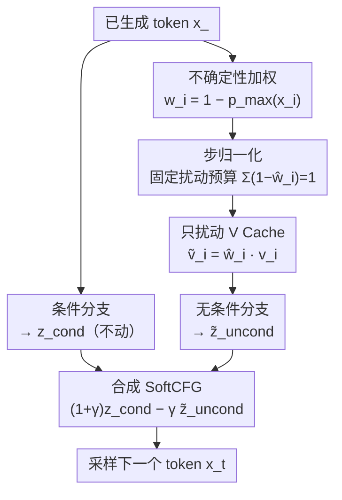

# SoftCFG: Uncertainty-guided Stable Guidance for Visual Autoregressive Model

**会议**: ICLR 2026  
**OpenReview**: [https://openreview.net/forum?id=G7tqQ5Upcs](https://openreview.net/forum?id=G7tqQ5Upcs)  
**代码**: 有（论文称已开源核心代码）  
**领域**: 扩散模型 / 图像生成 / 视觉自回归  
**关键词**: 视觉自回归、Classifier-Free Guidance、不确定性、推理引导、免训练

## 一句话总结
针对视觉自回归（AR）模型用 CFG 时的「引导衰减」与「过度引导」两大顽疾，SoftCFG 让每个已生成 token 按自身置信度对无条件分支的 value cache 施加加权扰动、并用「步归一化」约束累积扰动，免训练、免改结构地把 ImageNet 256×256 上 AR 模型的 FID 从 1.37 推到 1.27，刷新 AR 模型 SOTA。

## 研究背景与动机
**领域现状**：视觉自回归模型把图像建成离散视觉 token 序列，用 decoder-only Transformer 做「next-token prediction」，和大语言模型同构，可扩展性强。为了提升条件生成质量，社区把扩散模型里成熟的 Classifier-Free Guidance（CFG）搬了过来——每步并行算一条条件分支 $z_t^{\text{cond}}$ 和一条无条件分支 $z_t^{\text{uncond}}$（把序列开头的类别 token 换成空 token），再外推 $z_t^{\text{CFG}}=z_t^{\text{uncond}}+\gamma(z_t^{\text{cond}}-z_t^{\text{uncond}})$。

**现有痛点**：CFG 原本是为扩散设计的，搬到 AR 上水土不服，暴露两个问题。其一是**引导衰减（guidance diminishing）**：扩散在每个去噪步都重新注入引导，而 AR 的条件信息只压在序列最开头的几个 token 上；随着解码推进，这些条件 token 离当前局部上下文越来越远，条件—无条件分支的差距（即真正的引导信号）迅速缩小、甚至在 16×16 这样的短序列里就归零（论文 Fig.3 用归一化熵直接画出绿线快速贴近 0）。其二是**过度引导（over-guidance）**：引导只依赖外部条件（类别/文本），一旦调大引导强度 $\gamma$，模型会过度强调某些词，与已生成的视觉上下文打架，长出多余的肢体、重复的车把、把「banana」错画成大象的獠牙这类结构性瑕疵。

**核心矛盾**：这两个问题本质是「引导该从哪来、强度怎么分配」没解决好。CFG 把引导全部寄托在固定的外部条件 token 上——既无法随解码持续供给信号（导致衰减），又只盯外部语义不顾视觉连贯（导致过度引导）。作者把它类比成神经网络训练里的**梯度消失与梯度爆炸**：一个让信号传不下去，一个让信号炸开，而后者通常靠归一化与正则化来治。

**本文目标**：找一种引导信号，既能随解码持续存在、又能自然调和「文本语义 vs 视觉上下文」的冲突，同时不重训、不改结构、不显著增加推理开销。

**切入角度**：作者观察到，**已经生成的视觉内容本身就是一种引导信号**——高置信度 token 往往对应图像里语义清晰的关键结构（Fig.5 的置信度热力图显示高置信区集中在物体部件、低置信区落在模糊背景）。既然类别 token 能引导后续 token，那可靠的已生成 token 同样可以。

**核心 idea**：让每个已生成 token 贡献「按置信度加权」的引导——用预测置信度去**扰动无条件分支的 value cache**，把可靠 token 的上下文贡献压低，从而把引导信号分散注入整条序列，并用步归一化把累积扰动钉在一个固定预算内。

## 方法详解

### 整体框架
SoftCFG 是一个**只在推理期生效**的即插即用模块：它不碰条件分支，只在每个解码步把无条件分支的 value cache 按 token 置信度做一次软扰动，再像 CFG 一样外推两条分支得到引导 logits。直观地说，它把「引导」从「只靠开头的类别 token」改成「靠整条已生成序列里可靠的 token」，让无条件分支变成一个**上下文感知的正则项**：可靠 token 贡献被压低、不确定 token 被保留，引导信号因此能沿序列持续传播。

下图是单个解码步的数据流——条件分支照常算，无条件分支额外走「算置信度 → 步归一化 → 扰动 V Cache」三步，最后两分支合成 SoftCFG logits 采样下一 token：

### 关键设计

**1. 不确定性加权的上下文扰动：把已生成内容变成引导信号**

这一步直接治「引导衰减」与「过度引导」的根源——引导只来自固定的外部条件 token。SoftCFG 转而让每个已生成 token $i<t$ 按其预测置信度参与引导：取条件分布的最大概率作为置信度，定义权重 $w_i = 1 - p_{\max}(x_i)$，其中 $p_{\max}(x_i)=\max_v p_\theta^{\text{cond}}(\cdot\mid x_{<i}, c)$。置信度越高的 token，$w_i$ 越小。然后把无条件分支里这些 token 的 value 向量按权重缩放：

$$\tilde v_i^{\text{uncond,pert}} = w_i\, v_i^{\text{uncond}}$$

用扰动后的 value cache 重算无条件 logits $\tilde z_t^{\text{uncond,pert}}$，最终引导写成 $z_t^{\text{SoftCFG}} = z_t^{\text{cond}} + \gamma(z_t^{\text{cond}} - \tilde z_t^{\text{uncond,pert}})$。这等价于在标准 CFG 上加一个上下文修正项 $z_t^{\text{SoftCFG}} = z_t^{\text{CFG}} + \gamma\,\Delta_t^{\text{context}}$，其中 $\Delta_t^{\text{context}} = z_t^{\text{uncond}} - \tilde z_t^{\text{uncond,pert}}$。

为什么有效：选 value cache 作为注入口，是因为 value 存的是过去 token 的表示、会被后续每一步反复 attend，是把 token 级引导「散布」到整条序列最自然的把手。高置信 token 的无条件上下文被压得更狠（$w_i$ 小），相当于强迫后续 token 更去对齐「目前为止语义最可靠的内容」，引导信号因此既不随步数消失、又能用视觉上下文去缓和外部文本的过度施压。几何上看，当 $\Delta_t^{\text{context}}$ 与原始引导偏移 $\Delta_t=z_t^{\text{cond}}-z_t^{\text{uncond}}$ 同向时放大条件信号、反向时收缩，扮演了类似 $\ell_2$ 正则把更新拉回原点的角色——只不过正则的对象是上下文表示而非参数。

**2. 步归一化：给累积扰动一个固定预算**

只做设计 1 会引出新麻烦：随序列变长，累积偏差 $\sum_{i<t}(1-w_i)$ 会显著增长，尤其当大量 token 都高置信（$w_i\to 0$）时，$\Delta_t^{\text{context}}$ 可能爆炸，无条件分支逐渐丢光全部上下文（$\mathbb{E}[\tilde z_t^{\text{uncond,pert}}]\to 0$），长序列生成因此失稳——论文 Fig.7 显示未约束的 SoftCFG 归一化熵快速攀升，正是「引导爆炸」。这与梯度爆炸同源，治法也对应：归一化。

步归一化在**每一步**重新缩放扰动权重，让它们之和恒为常数：

$$\hat w_i = 1 - \frac{1-w_i}{\sum_{j<t}(1-w_j)}\quad\text{s.t.}\quad \sum_{i<t}(1-\hat w_i)=1$$

这相当于在整条上下文上分配一份「单位扰动预算」。作者给出命题：在 $f_\theta$ 对 value cache 是 $L_t$-Lipschitz 的前提下，步归一化后偏差被钉在 $\|\Delta_t^{\text{context}}\|\le L_t\cdot\max_{i<t}\|v_i^{\text{uncond}}\|$，即每步扰动幅度至多由单个 token 贡献决定，不再随序列长度线性膨胀。这是 SoftCFG 能稳定跑完长序列、并在消融里同时稳住 IS 和 sFID 的关键。

**3. 只扰动 V、不扰动 K：避免破坏注意力路由**

设计 1 明确把扰动施加在 value cache 而非 key cache，这不是随手选的。注意力里 query 来自当前要预测的 token、不依赖已生成 token 的 query，所以可改的只有 K 和 V。消融（Table 3）显示：只扰 V 时 FID/sFID 最优、recall 最高；一旦扰 K（无论是否同时扰 V），IS/precision 略升但 FID、sFID、recall 一致变差。原因是修改 K 会改变 attention 的「路由」——即每个 token 该关注谁——从而扰乱已建立的上下文结构；而扰 V 只改「被关注到的内容强度」，不动路由，因此更鲁棒。这条设计把 SoftCFG 的扰动锁在「内容缩放」而非「结构重连」上，是它能稳定见效的实现前提。

### 一个完整示例
设当前要预测第 $t$ 个 token，前面已生成 $x_1,\dots,x_{t-1}$，其条件分支最大概率分别为 $p_{\max}=\{0.9, 0.5, 0.99, \dots\}$。则原始权重 $w_i=\{0.1, 0.5, 0.01,\dots\}$——第 3 个 token 极高置信，$w_3$ 极小。若直接用 $w_i$ 缩放 V，高置信 token 的上下文几乎被清零，随 $t$ 增大这种清零会累积。步归一化先把 $\{1-w_i\}=\{0.9,0.5,0.99,\dots\}$ 归一到和为 1，得到 $\hat w_i$，使「第 3 个 token 单独占的扰动预算」被压回到与整条序列共享的份额内。随后只对无条件分支的 $v_i$ 乘上 $\hat w_i$，重算 $\tilde z_t^{\text{uncond,pert}}$，再合成 $z_t^{\text{SoftCFG}}=(1+\gamma)z_t^{\text{cond}}-\gamma\tilde z_t^{\text{uncond,pert}}$ 采样 $x_t$。条件分支全程不动，扰动只是对存好的无条件 V-cache 做一次原地标量缩放，开销几乎为零（Fig.8 显示 SoftCFG 推理时间与 CFG 持平）。

## 实验关键数据

### 主实验
ImageNet-1K 256×256 类条件生成（ADM 评测，50k 样本），SoftCFG 叠加在最强已发布 AR 模型 AliTok 上：

| 模型 | 参数量 | FID↓ | IS↑ | sFID↓ | Recall↑ |
|------|--------|------|-----|-------|---------|
| AliTok-B（baseline） | 177M | 1.50 | 305.9 | - | 0.64 |
| AliTok-B + SoftCFG | 177M | **1.40** | 271.0 | 5.95 | 0.66 |
| AliTok-L（baseline） | 318M | 1.42 | 326.6 | - | 0.65 |
| AliTok-L + SoftCFG | 318M | **1.39** | 272.3 | 6.00 | 0.66 |
| AliTok-XL*（baseline） | 662M | 1.35 | 317.1 | 6.96 | 0.64 |
| AliTok-XL* + SoftCFG | 662M | **1.27** | 302.4 | 6.76 | 0.65 |

AliTok-XL + SoftCFG 的 FID 1.27 刷新 AR 模型在该 benchmark 的 SOTA，逼近顶尖扩散模型（如 REPA-E 的 1.26），且 recall 普遍提升，显示生成多样性更好。

### 消融实验
AliTok-XL（$\gamma=13, k=1.4$）上逐项拆解：

| 配置 | FID↓ | IS↑ | sFID↓ | 说明 |
|------|------|-----|-------|------|
| Baseline | 1.76 | 221.2 | 5.55 | 无引导 |
| + CFG + Opt. | 1.35 | 317.1 | 6.96 | 标准 CFG，调优 $(\gamma,k)$ |
| + SoftCFG | 1.32 | 288.1 | 7.62 | FID 更优但 IS/sFID 失稳 |
| + SoftCFG + StepNorm | 1.32 | 302.0 | 7.16 | 步归一化稳住 IS、改善 sFID |
| + SoftCFG + StepNorm + Opt. | **1.27** | 302.4 | 6.70 | 完整方法 |

扰动位置消融（Table 3）：只扰 V 得 FID 1.27 最优；只扰 K 为 1.39；同时扰 K、V 为 1.31——印证「只扰 V 不动注意力路由」最稳。

### 关键发现
- **步归一化是稳定性的关键**：单加 SoftCFG 虽降 FID，但 IS 从 317 掉到 288、sFID 升到 7.62（无条件分支被过度扰动）；加上步归一化后 IS 回到 302、sFID 降到 7.16，验证它专治「引导爆炸」。
- **扰 V 而非 K**：扰 K 会破坏注意力路由，FID/sFID/recall 全面变差，是只扰 V 的设计依据。
- **超参更宽更小**：SoftCFG 在大范围 $\gamma$ 上都改善 FID，而标准 CFG 在大 $\gamma$ 下迅速崩坏；cosine 调度 $k=1.5{\sim}1.6$ 最佳，且 SoftCFG 的最优 $\gamma/k$ 普遍比 CFG 更小（因其引导幅度本就更强）。置信度定义上，用条件分支的 max 概率最稳。
- **文生图喜忧参半**：在 SimpleAR 上叠加 SoftCFG，DPG-Bench 总分微降（0.617→0.613），但双物体（89.4%→91.4%）、颜色一致性（81.4%→82.2%）、颜色属性（36.0%→40.5%）都涨；位置类略退步——作者指出这类评测偏向严格的规则化文图对齐、基本忽略图像质量与连贯性，而 SoftCFG 主要提升的是后者。

## 亮点与洞察
- **把「已生成内容」纳入引导源**：最核心的「啊哈」在于跳出「引导只能来自类别/文本 token」的惯性，论证可靠的已生成视觉 token 同样是引导信号，并用置信度热力图佐证高置信区对应语义关键结构。
- **梯度消失/爆炸的类比贯穿全文**：把引导衰减类比梯度消失、引导爆炸类比梯度爆炸，从而顺理成章地引入「正则化（软扰动）+ 归一化（步归一化）」这套成熟工具，方法动机非常自洽。
- **借 value cache 当注入口**：选 V-cache 既是免训练、免改结构的工程巧思（只需一次原地标量缩放），又有「不动注意力路由」的原理支撑，是可迁移到其他 AR 推理干预任务的思路。
- **置信度加权可泛化**：框架对「评分函数」是通用的，token 置信度只是一种实例，未来可换成学习型判别器或感知评估器。

## 局限与展望
- **文生图的空间对齐退步**：位置类 prompt 在 SoftCFG 下出现小幅回退，说明它强化的是视觉连贯而非严格的文图空间对齐，作者承认文图对齐仍是开放问题。
- **置信度=最大概率的假设**：把 $p_{\max}$ 当作 token 可靠性的代理，在背景模糊或多义区域可能不准；论文虽试了几种置信度变体，但仍是启发式。
- **仍需调参**：虽然 $\gamma/k$ 的有效区间更宽，但作者明确「tuning is still required」，并非完全免调。
- **评测局限**：主要在类条件 ImageNet 上验证 SOTA，文生图只给了 SimpleAR 等有限模型，跨更多 AR 架构与更高分辨率的普适性有待进一步验证。

## 相关工作与启发
- **vs 标准 CFG（Ho & Salimans）**：CFG 在每步施加固定硬偏移 $\gamma\Delta_t$、引导只来自外部条件，导致 AR 上的衰减与过度引导；SoftCFG 把引导改成上下文感知的软正则，信号随序列持续、且能调和语义—视觉冲突。
- **vs 在预测头注入条件嵌入的方法（如 VAR/RAR/AdaLN 类）**：这类方法靠在每步把条件嵌入注进 prediction head 来缓解引导衰减，但引导仍系于外部信号，无法根本解决语义—视觉冲突；SoftCFG 直接引入已生成内容作为内部引导源，从另一维度补上这块。
- **vs 免引导 AR 生成（如 Condition Contrastive Alignment）**：那条路线试图训练出无需 CFG 的 AR 模型；SoftCFG 反向选择「保留并改良 CFG」，以免训练、即插即用为卖点，落地成本更低。

## 评分
- 新颖性: ⭐⭐⭐⭐ 「已生成内容即引导」+「软扰动 V-cache」的组合在 AR guidance 里是新视角，类比梯度消失/爆炸的动机干净。
- 实验充分度: ⭐⭐⭐⭐ 在最强 AR baseline 上刷 SOTA，消融覆盖步归一化、扰动位置、超参与置信度变体；文生图模型偏少。
- 写作质量: ⭐⭐⭐⭐ 问题定义清晰、公式与命题完整，图示（衰减/爆炸熵曲线、置信度热力图）直观。
- 价值: ⭐⭐⭐⭐ 免训练、零结构改动、近零开销即可提升 AR 生成质量，工程上极易接入现有 AR pipeline。

<!-- RELATED:START -->

## 相关论文

- [\[ICLR 2026\] Visual Autoregressive Modeling for Instruction-Guided Image Editing](visual_autoregressive_modeling_for_instruction-guided_image_editing.md)
- [\[ICLR 2026\] From Broad Exploration to Stable Synthesis: Entropy-Guided Optimization for Autoregressive Image Generation](from_broad_exploration_to_stable_synthesis_entropy-guided_optimization_for_autor.md)
- [\[ICLR 2026\] SSG: Scaled Spatial Guidance for Multi-Scale Visual Autoregressive Generation](ssg_scaled_spatial_guidance_for_multi-scale_visual_autoregressive_generation.md)
- [\[ICLR 2026\] MVAR: Visual Autoregressive Modeling with Scale and Spatial Markovian Conditioning](mvar_visual_autoregressive_modeling_with_scale_and_spatial_markovian_conditionin.md)
- [\[ICLR 2026\] Deconstructing Guidance: A Semantic Hierarchy for Precise Diffusion Model Editing](deconstructing_guidance_a_semantic_hierarchy_for_precise_diffusion_model_editing.md)

<!-- RELATED:END -->
