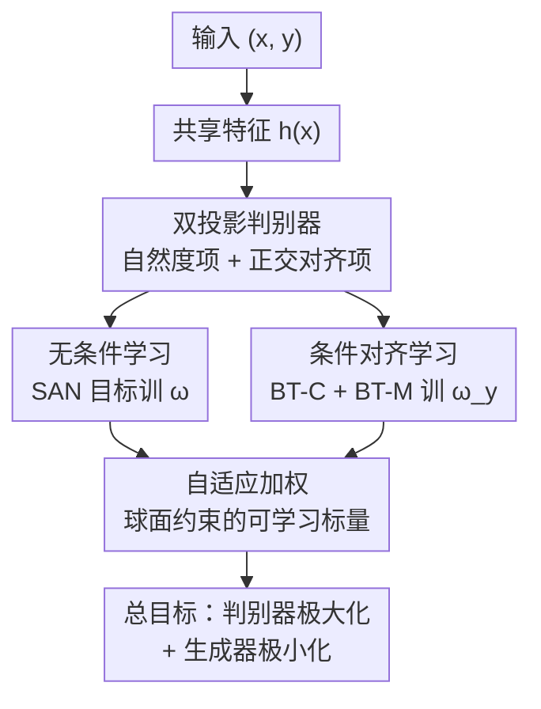

# SONA: Learning Conditional, Unconditional, and Matching-Aware Discriminator

**会议**: ICLR 2026  
**OpenReview**: [https://openreview.net/forum?id=lymykMnKBS](https://openreview.net/forum?id=lymykMnKBS)  
**代码**: 无  
**领域**: 图像生成 / 条件 GAN / 判别器设计  
**关键词**: 条件 GAN, 判别器, matching-aware, 自适应加权, 正交投影

## 一句话总结
SONA 把条件 GAN 判别器拆成"自然度"和"对齐度"两个相互正交的投影项，分别用 SAN 损失和两类 Bradley–Terry 损失训练，再用一个带约束的自适应加权机制平衡三类目标，在类别条件与文生图任务上同时拿到更高的样本质量和更好的条件对齐。

## 研究背景与动机

**领域现状**：条件 GAN 的研究重心一直在判别器设计上。基于似然分解 $p(x,y)=p(y|x)p(x)$，条件判别器的任务被自然拆成两个子问题——区分真假样本（无条件判别）和评估条件对齐。主流有两条路线：分类器路线（AC-GAN 起家，用一个辅助分类头同时判真假和判类别）和投影路线（Miyato & Koyama 提出的 projection discriminator，把判别器写成 $f(x,y)=\langle w_y,h(x)\rangle+\langle w,h(x)\rangle+b$，无需额外分类器，成为现代条件 GAN 事实上的标准件）。

**现有痛点**：两条路线都没把"无条件判别 + 条件对齐"这对目标平衡好。分类器路线需要小心调权重系数；投影路线虽然形式简洁，但作者指出它其实**没有真正利用上无条件判别**——因为 $\langle w_y,h\rangle+\langle w,h\rangle$ 可以合并写成 $\langle \tilde w_y,h\rangle$（$\tilde w_y=w_y+w$），生成器优化时看到的是一个**依赖 $y$ 的投影方向**，于是无条件判别这一项形同虚设。此外，投影路线完全没有 matching-aware 机制（不会主动用"真实但配错标签"的负样本来强化对齐敏感度）。

**核心矛盾**：判别器既要判真假、又要判对齐，这两个目标在共享特征里相互纠缠；投影路线为了简洁牺牲了无条件判别和 matching-awareness，分类器路线为了能力又引入了难调的超参。

**本文目标**：设计一个判别器，同时满足三条 desiderata——(i) 独立于条件 $y$ 的无条件判别、(ii) matching-aware 的对齐判别（用错配负样本增强对齐敏感度）、(iii) 自适应加权动态平衡三类目标，且不引入需要手调的额外超参。

**切入角度**：作者假设"判自然度"和"判对齐"是两个**正交的任务**——优化生成器去对齐时不应干扰它去提升自然度。把这个 inductive bias 写进判别器结构，就能让两项各管各的。

**核心 idea**：判别器 = 自然度投影项 + **正交于自然度方向**的对齐投影项（SONA = Sum of Naturalness and Alignment），自然度用 SAN 目标学、对齐用 Bradley–Terry 成对比较学，三类损失再用一个归一化约束的自适应权重平衡。

## 方法详解

### 整体框架

SONA 输入一个样本 $x$ 和条件 $y$，输出一个标量判别分。它先用共享特征提取器 $h:\mathcal{X}\to\mathbb{R}^D$ 抽特征 $h(x)$，然后把判别分拆成两个相加的标量：自然度项 $f^N_{\Phi_N}(x)=\langle\omega,h(x)\rangle$（只关心真假），和条件对齐项 $f^A_{\Phi_A}(x,y)=\langle\omega_y,\Pi^\perp_\omega h(x)\rangle$（只关心对齐）。关键在于对齐项用的是**正交投影** $\Pi^\perp_\omega h(x)=h(x)-\langle\omega,h(x)\rangle\omega$，即先把特征里属于自然度方向 $\omega$ 的分量减掉，再投到对齐方向 $\omega_y$ 上，从结构上保证两个任务互不干扰。

训练时这两项由不同的目标各自驱动：自然度方向 $\omega$ 用 SAN（slicing adversarial network）的极大极小目标学，让它在 sliced Wasserstein 意义下最优地区分真假；对齐方向 $\omega_y$ 用两类 Bradley–Terry 损失学——BT-C 拿真实样本对生成样本（学条件相似度），BT-M 拿对齐样本对边缘分布的负样本（学 matching-awareness）。最后三类极大化目标 $V_{\text{SAN}},V_{\text{BT-C}},V_{\text{BT-M}}$ 由一组带球面约束的可学习标量自适应加权。

### 关键设计

**1. 双投影判别器：用正交投影把"判自然度"和"判对齐"在结构上解耦**

投影路线的问题是自然度和对齐共享同一个有效投影方向 $\tilde w_y$，结果无条件判别被吞掉。SONA 把判别器显式写成两项之和：
$$f(x,y)=\underbrace{\langle\omega,h(x)\rangle}_{f^N:\text{自然度}}+\underbrace{\langle\omega_y,\Pi^\perp_\omega h(x)\rangle}_{f^A:\text{条件对齐}},$$
其中 $\omega,\omega_y\in S^{D-1}$ 是单位方向，$\Pi^\perp_\omega h(x)=h(x)-\langle\omega,h(x)\rangle\omega$ 是把特征投到与 $\omega$ 正交的子空间。这个正交投影编码了"自然度与对齐是正交任务"的归纳偏置：对齐项 $f^A$ 拿到的特征里已经不含自然度方向 $\omega$ 的分量，所以优化对齐时不会动到自然度的判别能力。$\omega$ 专管真假、$\omega_y$ 专管对齐，两者各司其职——这正是投影路线想做却没做到的解耦。

**2. 无条件学习：用 SAN 目标让自然度方向真正学会判真假**

为了让自然度项独立于 $y$ 地区分真假，SONA 只对 $\Phi_N=\{\omega,h\}$ 套用 SAN 的极大极小目标（对齐参数 $\omega_y$ 完全不参与这一步）：
$$\max_{\Phi_N}V_{\text{SAN}}(\omega,h),\quad\min_g J_{\text{SAN}}(g).$$
SAN 把 GAN 判别器看成"单方向的 augmented sliced Wasserstein"，通过对归一化投影 $\omega$ 施加最优性约束，鼓励 $\omega$ 在特征空间里以 sliced Wasserstein 距离最优地分开真实和生成分布（Proposition 2 保证此时生成器最小化的是 $p_\text{data}(x)$ 与 $p_g(x)$ 之间的某种距离）。这一步专门修复了投影路线"无条件判别形同虚设"的毛病——$\omega$ 被强制只对真假负责，而不是被 $y$ 牵着走。

**3. 条件对齐学习：用 Bradley–Terry 成对比较实现 matching-aware**

对齐方向 $\omega_y$ 借 Bradley–Terry（BT）成对偏好模型来训。BT 把"$x_w$ 比 $x_\ell$ 更符合条件 $y$"的概率写成 $\sigma(f(x_w,y)-f(x_\ell,y))$，真实联合分布样本永远当胜者 $x_w$，败者 $x_\ell$ 取两种分布，得到两类损失：

- **BT-C（条件判别）**：败者取生成分布 $p_g(x_\ell|y)$，比较给定 $y$ 下的真实样本和生成样本，衡量条件不相似度。Proposition 3 表明它在最优下对应 $p_\text{data}(x|y)$ 与 $p_g(x|y)$ 之间的某种散度。
- **BT-M（matching-aware）**：败者取**边缘数据分布** $p_\text{data}(x_\ell)$（无视条件 $y$），即"真实但可能配错条件"的负样本。Proposition 4 表明最大化它会让判别器学到对数概率之差 $\log p_\text{data}(x|y)-\log p_\text{data}(x)$，正好刻画条件相对无条件的"额外对齐信号"。这就是投影路线缺失的 matching-awareness——MoG 实验里去掉 BT-M 会让不同类别的生成样本相互重叠、分不开。

关键技巧是这两个 BT 损失对自然度项 $f^N$ 施加 **stop-gradient**，只让对齐参数 $\Phi_A$ 通过 $f^A$ 更新；生成器侧的 $J_{\text{BT-C}}$ 同样只在自然度项 stop-gradient，使对齐优化沿 $\omega_y$ 进行、真假优化沿 $\omega$ 进行，两条最小化路径正交不打架。

**4. 自适应加权：用球面约束的可学习标量动态平衡三类目标**

三类极大化目标 $V_{\text{SAN}}+V_{\text{BT-C}}+V_{\text{BT-M}}$ 需要平衡，但手调权重正是作者想避免的。SONA 的做法是：先用 Goodfellow 原版 $V_\text{GAN}$（含 $\log\sigma(\cdot)$ 形式）构造各项，再把每项里的 $\log\sigma(t)$ 替换成 $\log\sigma(s\cdot t)/s$，其中 $s\in\mathbb{R}_{>0}$ 可学习，并施加球面约束 $s_\text{SAN}^2+s_\text{BT-C}^2+s_\text{BT-M}^2=1$ 防止系数发散。相比通用多任务学习（如 Kendall 的不确定性加权）系数无界、对 GAN 学习率敏感性不友好，这个有界约束更适配 GAN 训练——消融里换成 Kendall 方案 FID 从 5.65 暴涨到 16.62，印证了"有界系数"对 GAN 稳定性的重要性。

### 损失函数 / 训练策略
总目标为
$$\max_{\Phi_N\cup\Phi_A}V_{\text{SAN}}(\Phi_N)+V_{\text{BT-C}}(f^A_{\Phi_A})+V_{\text{BT-M}}(f^A_{\Phi_A}),\quad\min_g J_{\text{SAN}}(g)+J_{\text{BT-C}}(g).$$
其中 $J_{\text{BT-C}}$ 通过交换 BT-C 里数据与生成分布得到（类似 relativistic pairing GAN），只在自然度项 stop-gradient。三类极大化项各自带可学习缩放标量 $s$ 并满足球面约束。

## 实验关键数据

### 主实验

类别条件生成（StudioGAN 基准，对比 ContraGAN、ReACGAN、PD-GAN）：

| 数据集 | 指标 | SONA | 最优 baseline | 说明 |
|--------|------|------|----------|------|
| CIFAR10 (BigGAN) | FID ↓ / IS ↑ | **4.24** / **10.05** | 4.49 / 9.87 | 全指标最佳 |
| TinyImageNet (+DiffAug) | FID ↓ / IS ↑ | **7.76** / **23.00** | 9.93 / 20.25 | Cover 0.79、iFID 82.23 均最佳 |
| ImageNet 128² (bs=2048) | FID ↓ / IS ↑ | **6.14** / **140.14** | 8.44 / 103.07 | Top-1/5 acc 0.80/0.93 远超 baseline |

文生图（GALIP 上加 SONA）：

| 数据集 | 指标 | GALIP 原版 | GALIP+SONA |
|--------|------|------|----------|
| CUB | FID ↓ / CLIP ↑ | 11.76 / 0.3310 | **10.20** / **0.3342** |
| COCO | FID ↓ / CLIP ↑ | 5.30 / 0.3639 | **4.70** / **0.3677** |
| COCO zero-shot (CC12M 训练) | zFID30K ↓ / CLIP ↑ | 13.78 / 0.3306 | **12.43** / **0.3411** |

### 消融实验（CIFAR10，BigGAN-PyTorch 官方码）

| 自适应加权 $s$ | 正交投影 | BT-M | FID ↓ | IS ↑ |
|:---:|:---:|:---:|------|------|
| ✓ | | | 7.51 | 9.08 |
| ✓ | ✓ | | 6.29 | 9.14 |
| ✓ | | ✓ | 6.02 | 9.54 |
| ✓ | ✓ | ✓ | **5.65** | 9.51 |
| | ✓ | ✓ | 7.09 | 9.52 |

### 关键发现
- **正交投影主要提升 FID，BT-M 主要提升 IS**，两者叠加在 FID/IS 上都拿到最好折中（5.65/9.51）。
- **自适应加权不可或缺**：去掉可学习 $s$（最后一行）FID 从 5.65 退到 7.09；换成无界的 Kendall 加权 FID 更是飙到 16.62，说明球面约束的有界系数对 GAN 稳定性至关重要。
- **类别越多优势越明显**：MoG 实验里 $N\ge30$ 时 SONA 失败案例数（NF）为零，而 PD-GAN 和去掉 BT-M 的变体随 $N$ 增大频繁失败；去掉 BT-M 会让不同类样本相互重叠。
- **效率接近 PD-GAN**：SONA 训练速度（如 ImageNet 90.16 iter/min）略低于最简单的 PD-GAN（101.91），但远快于分类器路线，且 ImageNet 上训练约三天后 FID 明显反超 PD-GAN。

## 亮点与洞察
- **正交投影 inductive bias 很巧**：把"自然度与对齐正交"这个假设直接写进 $\Pi^\perp_\omega$，从结构上消除两个任务在共享特征里的梯度干扰，比单纯加损失项更干净——这个解耦思路可迁移到任何"一个网络要同时判两件相互纠缠的事"的场景。
- **用 Bradley–Terry 统一条件判别与 matching-aware**：把 RLHF 里常见的成对偏好模型搬到 GAN 判别器，胜者固定为真实联合样本、败者换两种分布就分别得到 BT-C 和 BT-M，形式统一且各有理论刻画（Prop 3/4）。
- **球面约束的自适应加权**：一句"把 $\log\sigma(t)$ 换成 $\log\sigma(st)/s$ 并约束 $\sum s^2=1$"就实现了免调参的多目标平衡，且专门针对 GAN 对学习率敏感的特性设计了有界系数，是个可复用的小 trick。
- **即插即用**：在文生图上直接复用 GALIP 冻结的 CLIP 文本嵌入当 $\omega_y$，不改架构就能涨 FID，说明 SONA 是一个判别器侧的通用增强。

## 局限与展望
- 文生图里 $\omega_y$ 直接用冻结 CLIP 文本嵌入，作者承认改成**可学习 $\omega_y$** 有望进一步提升 CLIP score，但留作未来工作。
- 方法仍局限在单阶段 GAN 生成管线（ImageNet 上只能用 BigGAN backbone），未验证在扩散/流模型判别器或大规模文生图上的可扩展性。
- 正交任务假设是个 inductive bias，对于自然度与对齐确实强相关的数据（如细粒度属性生成）是否仍成立、是否会限制对齐项容量，论文未深入讨论。
- 训练有额外开销（比 PD-GAN 慢），收益需要足够长的训练时间（ImageNet 上约三天后才反超）才能体现。

## 相关工作与启发
- **vs PD-GAN（投影路线）**：PD-GAN 把判别器写成无条件项+条件项之和但二者共享有效投影 $\tilde w_y$，无条件判别被吞、且无 matching-aware；SONA 用正交投影真正解耦两项，并补上 SAN 无条件学习和 BT-M matching 损失，效率相当但质量与对齐全面更优。
- **vs AC-GAN / ReACGAN（分类器路线）**：分类器路线用辅助分类头隐式利用错配负样本（交叉熵等价 InfoNCE），但需手调权重系数；SONA 用 BT 损失显式建模 matching-awareness，并以自适应加权免去调参，且不依赖 $p_\text{data}(y)$ 均匀假设（Prop 4 比 Prop 1 适用更广）。
- **vs SAN（Takida et al. 2024）**：SONA 借用 SAN 的 sliced Wasserstein 视角和无条件目标，但把它扩展到条件场景，新增正交对齐项与两类 BT 损失。

## 评分
- 新颖性: ⭐⭐⭐⭐⭐ 正交投影解耦 + BT 成对损失 + 球面约束自适应加权，三件套都有理论支撑且组合新颖
- 实验充分度: ⭐⭐⭐⭐⭐ MoG 可视化 + CIFAR/TinyImageNet/ImageNet 类别条件 + CUB/COCO 文生图 + 完整消融 + 效率分析
- 写作质量: ⭐⭐⭐⭐ 三条 desiderata 串起全文逻辑清晰，但记号密集、命题与正文交织需反复对照
- 价值: ⭐⭐⭐⭐ 判别器侧即插即用增强，对仍在用条件 GAN 的场景实用，但 GAN 整体热度下降限制影响面

<!-- RELATED:START -->

## 相关论文

- [\[ICLR 2026\] FlowCast: Advancing Precipitation Nowcasting with Conditional Flow Matching](flowcast_advancing_precipitation_nowcasting_with_conditional_flow_matching.md)
- [\[ICLR 2026\] Secure Inference for Diffusion Models via Unconditional Scores](secure_inference_for_diffusion_models_via_unconditional_scores.md)
- [\[ICCV 2025\] Guiding Noisy Label Conditional Diffusion Models with Score-based Discriminator Correction](../../ICCV2025/image_generation/guiding_noisy_label_conditional_diffusion_models_with_score-based_discriminator_.md)
- [\[ICLR 2026\] Flow Matching with Injected Noise for Offline-to-Online Reinforcement Learning](flow_matching_with_injected_noise_for_offline-to-online_reinforcement_learning.md)
- [\[ICLR 2026\] Structured Flow Autoencoders: Learning Structured Probabilistic Representations with Flow Matching](structured_flow_autoencoders_learning_structured_probabilistic_representations_w.md)

<!-- RELATED:END -->
