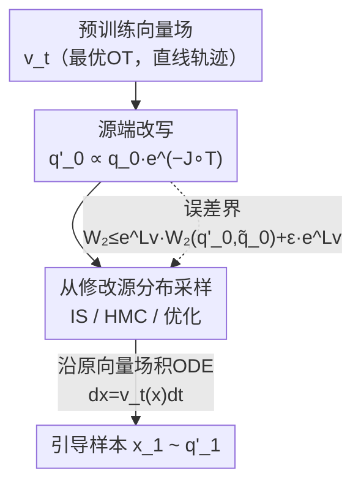

# Source-Guided Flow Matching

**会议**: ICLR 2026  
**OpenReview**: [https://openreview.net/forum?id=p56ZAQUCUr](https://openreview.net/forum?id=p56ZAQUCUr)  
**领域**: 扩散模型 / 生成模型 / 流匹配引导  
**关键词**: Flow Matching, 引导生成, 最优传输, 源分布采样, 逆问题  

## 一句话总结
本文提出 SGFM 框架，把流匹配的「引导生成」问题等价转化为「从一个修改过的源分布采样」——只改源分布、完全不动预训练向量场，从而精确恢复目标分布，并保留最优传输向量场的直线轨迹（快推理），还能让用户按需挑选采样器（重要性采样 / HMC / 优化）。

## 研究背景与动机

**领域现状**：流匹配（Flow Matching）通过学一个向量场 $u_t(x)$，把样本沿常微分方程 $dx = u_t(x)dt$ 从源分布 $q_0$ 推到目标分布 $q_1$。其中「最优流匹配」用最优传输（OT）耦合训练，得到的向量场让每个样本沿**直线、匀速**运动（对应 Wasserstein 测地线），训练稳定、推理时只需很少积分步。引导生成（guidance）则是在采样时额外满足某种约束——约束写成能量函数 $J$，新目标分布变为 $q_1'(x_1) \propto q_1(x_1)\,e^{-J(x_1)}$。

**现有痛点**：现有的「精确引导」方法（如把引导写成随机最优控制 SOC、或 Feng et al. 2025 的 g-MC 类方法）几乎都通过**修改向量场**来实现——往原向量场上加一个引导项 $g_t$。这带来两个具体问题：其一，向量场被改后，最优流匹配那条宝贵的**直线轨迹被破坏**，变成弯曲轨迹（见原文 Figure 2），必须用更细的时间离散才能保精度，推理变慢；其二，引导项 $g_t$ 通常要在 $t\in[0,1]$ 的**许多中间时刻**反复用蒙特卡洛估计，每次估计又要大量采样，整体开销极大。此外，每换一个约束场景，SOC 类方法就得重解一遍，灵活性差。

**核心矛盾**：引导的精确性、向量场直线性（推理速度）、采样灵活性三者，在「改向量场」这条路上被绑死——只要动了向量场，直线性就丢，且引导被固定在某种特定估计/控制方案里。

**本文目标**：在**不碰预训练向量场**的前提下，做到精确引导，同时保住直线轨迹，并把「怎么采样」的自由度交还给用户。

**切入角度**：作者注意到一个被忽视的对称性——既然向量场只是一张固定的传输地图 $T=\phi_1$，那么「让流终点落在 $q_1'$」完全可以靠**调整起点的分布**来实现，而不必改地图本身。

**核心 idea**：用一个**修改后的源分布** $q_0'(x_0) \propto q_0(x_0)\,e^{-J\circ T(x_0)}$ 代替原源分布 $q_0$，沿**原封不动的向量场**积分，就能精确得到引导目标 $q_1'$。引导问题于是被归约成一个定义清晰的子问题：从 $q_0'$ 采样。

## 方法详解

### 整体框架
SGFM 的核心是一次「问题搬家」：把发生在 $\mathbb{R}^d\times[0,1]$（空间 × 时间）上、需要反复改向量场的引导，搬成只发生在**单个时刻**（$t=0$）、$\mathbb{R}^d$ 上的一次源分布采样。整条流程是：先用标准流匹配损失训出（最好是最优 OT 的）向量场 $v_t^\theta$；引导时不重训、不加引导项，而是把约束 $J$ 通过传输地图 $T=\phi_1$ 拉回到源端，得到加权源分布 $q_0'(x_0)\propto q_0(x_0)\,e^{-J\circ T(x_0)}$；从 $q_0'$ 采一批起点（用户自选采样器），再沿原向量场积 ODE，终点即服从引导目标 $q_1'$。

直观图景（原文 Figure 1）：最优向量场把每个源点 $x_0$ 直线映到一个目标点 $x_1$；想满足约束 $J$，等价于在源端**挑出那些会流向 $q_1'$ 高密度区的源样本子集**——这个子集恰好服从 $q_0'$。因为只动源分布、向量场不变，直线性被完整保留。

### 关键设计

**1. 源端改写：把引导从「改向量场」搬成「改源分布」的精确等价**

这一步直击「改向量场就丢直线性、还要在多时刻反复采样」的痛点。作者证明（Theorem 1）：给定一个把 $q_0$ 推到 $q_1$ 的流映射 $\phi_1$（记 $T=\phi_1$），只要把源分布替换为 $q_0'(x_0)=\frac{1}{Z_0}q_0(x_0)\,e^{-J\circ T(x_0)}$，那么**同一个流 $\phi_t$** 就会把 $q_0'$ 精确推到 $q_1'(x_1)=\frac{1}{Z_1}q_1(x_1)\,e^{-J(x_1)}$，即 $(\phi_1)_\# q_0' = q_1'$。其本质是一次经典的变量代换：约束的似然 $e^{-J}$ 沿传输地图被「拉回」到源端，写成 $e^{-J\circ T}$ 作为对源样本的重加权权重。

这之所以有效，是因为引导的全部信息现在都凝聚在源端的一个标量权重里，向量场完全不需要知道 $J$ 的存在。于是推理时仍走原来的直线 ODE，且不存在「每个中间时刻都要估计引导项」的负担——引导只在 $t=0$ 一次性体现为采样问题。这也是和 g-MC / SOC 类「改向量场」方法的根本区别：它们把 $J$ 注入 $\mathbb{R}^d\times[0,1]$ 的动力学，本文只把 $J$ 注入 $\mathbb{R}^d$ 的一个分布。

**2. 误差界：用最优向量场的小 Lipschitz 常数控住两类近似误差**

现实里向量场是学出来的（有偏差 $\epsilon$），源分布也只能近似采（得到 $\tilde q_0$ 而非 $q_0'$）。作者给出 Theorem 2：若 $\|v_t-v_t^\theta\|_\infty\le\epsilon$ 且学到的流 $v_t^\theta$ 关于 $x$ 是 $L_v$-Lipschitz，则生成分布与真目标的 2-Wasserstein 误差满足

$$W_2\big(q_1',\,[\phi_1^\theta]_\#\tilde q_0\big)\le e^{L_v}\,W_2(q_0',\tilde q_0) + \epsilon\,e^{L_v}.$$

第一项是源分布采样不准带来的偏差、被流映射的 Lipschitz 因子 $e^{L_v}$ 放大；第二项是向量场学习误差沿轨迹的累积。两项都被 $L_v$ 主导，所以 $L_v$ 越小、引导越稳。这条界的妙处在于它把误差**干净地分解成两个相互独立的来源**，并直接给出一个工程指引：应当选用让 $L_v$ 尽量小的向量场。

**3. 偏好最优（直线）向量场，并按问题挑采样器**

承接误差界的指引，作者主张用最优流匹配（mini-batch OT 训练，Tong et al. 2023）学最优向量场 $v_t^*$：它的轨迹是常速直线，对应的流映射就是最优 Monge 地图 $T^*$，既让 $L_v$ 更小（实验里 $L_v$ 从 ~16–20 降到 ~11），又因直线轨迹大幅减少积分步数（NFE 低），还顺带降低了「评估 $T^*$ 以算 $q_0'$ 权重」的成本。

而「从 $q_0'$ 采样」这一子问题，作者给出一套可按场景挑选的采样器谱系：
- **重要性采样（IS）**：低维、且 $J$ 不可微时最省事——以 $q_0$ 为提议分布，权重直接是 $w(x_0)=e^{-J\circ T^*(x_0)}$，样本数 $N\to\infty$ 时 $W_2(\tilde q_N,q_0')\to 0$，渐近精确。
- **哈密顿蒙特卡洛（HMC）**：高维时绕开 IS 的维数灾难，用梯度信息在 $-\ln q_0'(x_0)=-\ln q_0(x_0)+J\circ T^*(x_0)$ 上做 MCMC，遍历性保证渐近收敛。
- **优化式采样**：当目标接近 Dirac（如成像逆问题只想要一个高概率解）时，直接 $\min_{x_0}-\ln q_0'(x_0)$ 找众数。作者特别指出，朴素正则 $-\ln q_0(x_0)=\|x_0\|^2/2$ 会把高斯源样本全吸到 $x_0=0$ 造成**模式坍缩**；改用范数的卡方密度正则 $-\ln p_{\chi^2_d}(\|x_0\|^2)$ 把众数从原点换成一层超球壳 $\|x_0\|^2\approx d$，或干脆加约束 $|\,\|x_0\|^2-d\,|\le\sqrt{2d}$（式 6）来保多样性。这套优化式采样恰好涵盖了 D-Flow（Ben-Hamu et al. 2024）的启发式正则——本文因此把 D-Flow 解释成 SGFM 的一个特例，并第一次给出它的理论依据。

> 这三个设计严格对应框架图三段：**源端改写**（把 $J$ 拉回源端）→ **从修改源分布采样**（挑采样器）→ 沿原向量场积分出引导样本，而**误差界**则是横贯全程、解释「为何要用直线最优向量场」的理论支撑。

### 损失函数 / 训练策略
训练阶段就是标准的条件流匹配损失 $L_{FM}(\theta)=\mathbb{E}_{t,(x_0,x_1)\sim\pi}\|v_t^\theta((1-t)x_0+tx_1)-(x_1-x_0)\|^2$，关键在于把耦合 $\pi$ 选成最优 OT 耦合 $\pi^*$（实践用 mini-batch OT 近似），以获得直线轨迹和小 $L_v$。引导阶段**不训练**，只做源分布采样 + ODE 积分（见 Algorithm 1）。

## 实验关键数据

### 主实验

**2D 合成（uniform 源 → 8-Gaussian 目标，源非高斯故扩散类引导不可用）**：用 SGFM-IS，在「引导精度（与真引导分布的经验 Wasserstein 距离）vs. NFE」上一致优于基线；且降低 NFE 对精度影响很小，印证最优向量场直线轨迹「少步即可」。

**最优 vs. 独立向量场（Table 1，引导误差 ↓）**：

| 任务 | 向量场 | $L_v$ | 引导误差 |
|------|--------|------|----------|
| 8gaussian→moon | 独立 | 20.1 | 0.125 ± 0.186 |
| 8gaussian→moon | 最优 | 11.9 | **0.066 ± 0.047** |
| uniform→8gaussian | 独立 | 16.8 | 0.124 ± 0.023 |
| uniform→8gaussian | 最优 | 11.1 | **0.067 ± 0.019** |

最优向量场 $L_v$ 更小、引导误差更低，直接验证 Theorem 2。

**CelebA 成像逆问题（Table 4，PSNR ↑）**：

| 方法 | 去噪 | 去模糊 | 超分 | 随机补全 | 框补全 |
|------|------|--------|------|----------|--------|
| g-covA | 26.73 | 29.72 | 18.45 | 19.61 | 24.88 |
| g-covG | 30.35 | 29.50 | 24.18 | 25.49 | 26.12 |
| PnP | 32.14 | **38.74** | 31.33 | 33.87 | 29.92 |
| SGFM-OPT-2 (D-Flow) | 28.95 | 35.23 | 33.32 | 34.01 | 28.43 |
| SGFM-OPT-4 | 31.60 | 35.27 | **33.31** | 34.03 | **30.12** |

SGFM 各变体在所有任务上稳超 g-covA/g-covG；与专为成像设计的 PnP 互有胜负（去模糊弱一档，超分/补全反超）。

### 消融实验

**Darcy flow PDE 逆问题（Table 2，多模态后验，median[IQR]，均 ↓）**：

| 方法 | 解的有效性 | 引导代价 | 物理一致性 |
|------|-----------|---------|-----------|
| SGFM-HMC | 0.591 | 0.281 | 0.188 |
| SGFM-OPT-1 | 0.907 | 0.206 | 0.421 |
| **SGFM-OPT-2** | **0.474** | 0.187 | 0.194 |
| g-covA | 0.992 | **0.030** | 0.289 |
| 无条件采样 | 1.006 | 1.051 | 0.214 |

**NFE 敏感性（Table 5，SGFM-OPT-2，PSNR ↑）**：NFE=1→3 跳变明显（去噪 21.33→28.64），NFE 超过 3 几乎不再提升，证实直线向量场「3 步够用」。

### 关键发现
- **采样器选择是性能关键**：SGFM-OPT-2（卡方范数正则，即 D-Flow 偏好正则）综合最好；SGFM-OPT-1（朴素 $\|x_0\|^2$ 正则）因模式坍缩，物理一致性差（0.421）、有效性垫底。
- **「引导代价低」≠「解好」**：g-covA 引导代价最低（0.030）却牺牲物理一致性，有效性反而最差——说明只压 $J$ 不够，得兼顾贴合真实先验。
- **直线向量场让推理几乎免费提速**：NFE 从 9 降到 3 性能基本不变，对应理论上最优向量场的小离散误差。

## 亮点与洞察
- **一次「问题搬家」省掉大量中间采样**：把 $\mathbb{R}^d\times[0,1]$ 上的多时刻引导，压成 $t=0$ 单时刻的源采样问题——这是整篇最「啊哈」的地方，既保直线性又解耦了「引导」与「向量场」。
- **给 D-Flow 一个理论家**：D-Flow 原是启发式优化正则，本文证明它就是 SGFM 优化式采样的特例，并解释了各种正则项（朴素 / 卡方 / 约束）在「找众数 vs. 保多样性」上的角色，把工程 trick 提升为有保证的方法族。
- **误差界直接当设计指南**：$W_2\le e^{L_v}W_2(q_0',\tilde q_0)+\epsilon e^{L_v}$ 把「该选哪种向量场」量化成「选 $L_v$ 小的最优 OT 向量场」，理论与实现闭环。
- **可迁移思路**：凡是「预训练生成器 + 推理时加约束」的场景（分子生成、决策规划、科学逆问题），都能套用「改源不改场」这一招，把约束拉回源端做加权采样。

## 局限与展望
- **采样难度被转移而非消除**：作者自承，高维复杂源分布下「从 $q_0'$ 采样」本身可能很难（HMC 收敛慢、IS 维数灾难），SGFM 把引导难度搬到了采样器上。
- **优化式采样会模式坍缩**：当真实条件分布多模态时，优化式采样（含 D-Flow）会过度集中到某条线/某个众数（原文 'S' 形例子），丢失多样性；只有 HMC 这类才较好覆盖多模态。
- **运行时间偏长**：复杂源分布下 SGFM（尤其 HMC）比 g-covA 慢，限制了可评估样本数，对「是否覆盖整族解」的评估不充分。
- **直线性是工程偏好非理论必需**：Theorem 1–2 对任意向量场都成立，最优向量场只是为了小 $L_v$ 和低 NFE；非最优场下界会松。

## 相关工作与启发
- **vs g-MC / g-covA / g-covG (Feng et al. 2025)**：它们改向量场、加引导项，轨迹弯曲、需多时刻 MC 估计；本文只改源分布、保直线轨迹、引导只在 $t=0$ 一次性体现，精度更稳、推理更快。
- **vs SOC 类精确引导 (Uehara 2024; Tang 2024)**：把引导写成随机最优控制、同时改源分布与向量场，每个新约束都要重解 SOC；本文只改源、向量场零改动，无需重解控制问题。
- **vs D-Flow (Ben-Hamu et al. 2024)**：D-Flow 是启发式优化正则；本文证明它是 SGFM 优化式采样的特例，并补上理论依据与正则项含义。
- **vs PnP-flow (Martin et al. 2024)**：PnP 专为成像逆问题设计、个别任务（去模糊）更强，但处理多模态后验时会在模式间跳跃；SGFM 更通用，在超分/补全/PDE 多模态问题上更稳。

## 评分
- 新颖性: ⭐⭐⭐⭐⭐ 「改源不改场」是引导生成里一个干净且少见的视角，且统一并解释了 D-Flow。
- 实验充分度: ⭐⭐⭐⭐ 覆盖 2D / PDE 逆问题 / CelebA 成像三档，验证了理论；但高维多模态覆盖度评估受运行时间所限略欠。
- 写作质量: ⭐⭐⭐⭐⭐ 理论—算法—实验闭环清晰，定理与设计动机一一对应。
- 价值: ⭐⭐⭐⭐⭐ 训练无关、即插即用、保直线轨迹，对生成模型推理时约束满足有很强的通用价值。

<!-- RELATED:START -->

## 相关论文

- [\[ICLR 2026\] Delay Flow Matching](delay_flow_matching.md)
- [\[ICLR 2026\] Flow Matching with Semidiscrete Couplings](flow_matching_with_semidiscrete_couplings.md)
- [\[ICLR 2026\] Value Matching: Scalable and Gradient-Free Reward-Guided Flow Adaptation](value_matching_scalable_and_gradient-free_reward-guided_flow_adaptation.md)
- [\[ICLR 2026\] Carré du champ Flow Matching: 用几何感知噪声改善生成模型的质量-泛化权衡](carré_du_champ_flow_matching_better_quality-generalisation_tradeoff_in_generativ.md)
- [\[ICLR 2026\] Structured Flow Autoencoders: Learning Structured Probabilistic Representations with Flow Matching](structured_flow_autoencoders_learning_structured_probabilistic_representations_w.md)

<!-- RELATED:END -->
