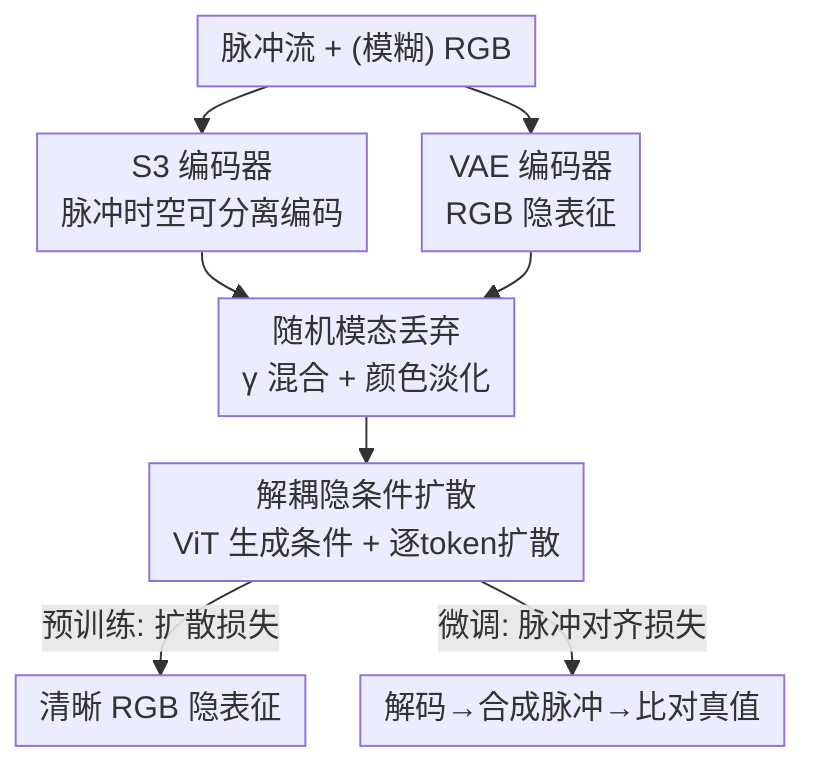

# SpikeGen：用隐空间生成框架解耦「视杆-视锥」视觉表征

**会议**: ICLR 2026  
**OpenReview**: [https://openreview.net/forum?id=WEuc8D8sAM](https://openreview.net/forum?id=WEuc8D8sAM)  
**代码**: 无  
**领域**: 扩散模型 / 图像生成 / 神经形态视觉  
**关键词**: 脉冲相机, 隐空间生成, 多模态融合, 图像去模糊, 帧重建

## 一句话总结
SpikeGen 把脉冲相机（视杆，高时间分辨率）和 RGB 相机（视锥，高色彩/空间分辨率）的视觉信息分别编码进同一个 VAE 隐空间，再用一个改造过的 MAR + 逐 token 扩散框架在隐空间里做生成式融合，从而用一套预训练模型同时打通条件去模糊、脉冲流稠密帧重建、高速场景新视角合成三类任务，并在三者上都达到或超过 SOTA。

## 研究背景与动机

**领域现状**：人眼把视锥（cone）和视杆（rod）的功能解耦——视锥负责色彩，视杆负责检测运动和光强变化——再由视觉皮层在「表征层面」整合两路信息。硬件世界里 RGB 相机对应视锥（高空间/色彩分辨率但缺时间敏感度），脉冲相机这类动态视觉系统（DVS）对应视杆（靠连续积分机制获得极高时间分辨率，但色彩和空间分辨率差）。把两种互补模态融合是个自然方向。

**现有痛点**：现有跨模态脉冲处理方法（如 S-SDM、STIR、SpikeGS）几乎都在**像素空间**做确定性建模和自监督。这带来两个具体问题。其一是「锐度陷阱」（sharpness trap）：只优化像素级损失往往只是提升了整体对比度，并没有真正恢复几何结构，输出看着锐但细节是假的。其二是脉冲单帧**空间稀疏**——某个像素在采样窗口内没攒够光强就不发脉冲，导致空间不确定性；而 RGB 帧即便模糊也保留了全局空间关系，本可作为粗约束，但确定性方法没把它当生成先验用好。

**核心矛盾**：人类视觉是在**隐表征**里整合信息并「脑补」缺失内容，而现有方法停留在像素级自监督。像素级建模既算得贵（要在高维像素空间算 loss），又容易掉进锐度陷阱、泛化差；而无论 RGB 的时间不足（模糊）还是脉冲的空间不足（稀疏），本质都是**信息缺失**问题，天然适合用概率生成模型去补全，而非确定性回归。

**本文目标**：造一个既能解耦双模态、又在隐空间做概率式生成的统一框架，覆盖脉冲-RGB 处理的全部主流任务（去模糊、帧重建、新视角合成）。

**切入角度**：作者认定「功能解耦 + 隐空间皮层处理」是人眼的两大要害，于是直接借用隐扩散范式：把脉冲编码器预训练到与 RGB VAE 对齐的隐空间，做到 512 倍时空下采样，再在该隐空间跑扩散。隐空间操作既省算力，又能像 DINO/JEPA 那样抓住表征级相似而非像素级误差，从而绕开锐度陷阱。

**核心 idea**：把脉冲流和模糊 RGB 都看成「退化输入」，编进同一隐空间后用一个非自回归的 MAR + 逐 token 扩散做生成式补全，并用一个可配置的模态混合比 $\gamma$ 让同一个预训练模型在推理时自由调配两种模态的权重。

## 方法详解

### 整体框架
SpikeGen 采用「自监督预训练 + 任务相关微调」的两段式流程。输入是一段脉冲流和（可能模糊的）RGB 图像，输出是清晰的 RGB 隐表征（再解码成图像）。两路模态各走一个编码器：RGB 走标准 VAE，脉冲走作者自研的 S3（Spatial-Temporal Separable Spike）编码器。两路隐表征按随机比例 $\gamma$ 线性相加得到混合隐 $z_{mixed}$；一个 ViT 吃下两路完整 token 生成条件，再交给一个轻量 MLP 做**逐 token 扩散**解码出预测隐表征。预训练阶段只用「预测隐 vs 清晰 RGB 隐」的扩散损失；微调阶段因为下游常无清晰 RGB 真值，改用「脉冲对齐」损失——把预测图反过来合成脉冲流再和真值脉冲比。

### 关键设计

**1. S3 时空可分离脉冲编码器：把稀疏脉冲流压进 RGB 的隐空间**

脉冲流是 $[B,1,T,H,W]$ 的二值（0/1）体数据，时间维很长但空间稀疏，没法直接喂进为 RGB 设计的隐扩散管线。S3 编码器先用一串 3D 卷积块把输入逐级降到 $[B,C_{out},T/8,H/8,W/8]$（$C_{out}=512$），像 UNet 编码器那样以空间换通道；随后进入**时间融合**阶段：用两个连续的 $1\times1\times1$ 3D 卷积为特征生成时间注意力权重，逐元素乘回特征后沿时间维求和，把时间维「塌缩」掉，得到 $[B,C_{out},H/8,W/8]$ 的空间特征图；最后再过一个 2D 卷积 + LayerNorm + LeakyReLU 精修。这样脉冲隐表征就和 RGB VAE 隐对齐在同一空间、同一尺度，整体实现 512 倍时空下采样——这是后面所有隐空间生成操作的前提，也让大规模预训练的像素损失开销被显著省下。

**2. 解耦隐条件的非自回归扩散：把双退化模态当成 MAR 的条件 token**

作者基于 Masked Auto-Regressive Model（MAR）改造。原版 MAR 做的是掩码图像建模（MIM），要从「空」里预测新 token；但 SpikeGen 认为模糊 RGB（时间不足）和稀疏脉冲（空间不足）都只是**退化**而非缺失，所以 ViT 直接接收两个编码器的**完整 token**并生成逐 token 扩散所需的条件。既然不需要从无到有补 token，作者就把 MAR 的自回归过程进一步精简成**所有 token 同时生成**（非自回归），训练和推理都更快，而附录实验显示这并不损失性能。每个 token 上跑的是标准扩散去噪 $\mathcal{L}_{LDM}=\mathbb{E}_{\mathcal{E}(x),\epsilon,t}[\lVert\epsilon-\epsilon_\theta(z_t,t)\rVert_2^2]$，只是条件来自解耦后的双模态隐。用概率扩散而非确定性回归，正是为了对付「信息缺失」场景——超分、去噪类任务里扩散模型恢复纹理和人造结构的能力更强。

**3. 随机模态丢弃：用 $\gamma$ 混合 + 颜色淡化让一个模型可配置模态权重**

为了让预训练完的模型在推理时能自由调配两路模态（甚至单模态工作），作者在预训练时随机采样混合比 $\gamma\sim\mathcal{N}_{[0,1]}(\mu=0.5,\sigma^2=1)$（高斯采样后截断到 $[0,1]$），混合隐为 $z_{mixed}=(1-\gamma)z_{RGB}+\gamma z_{spike}$。但这带来一个微妙问题：既然脉冲占比可以很高，就不能再拿清晰 RGB 隐当唯一学习目标了。作者的解法是按 $\gamma$ 对监督目标做**颜色淡化**：$I_{faded}=(1-\gamma)\cdot I_{clear}+\gamma\cdot I_{gray}$。当 $\gamma\to1$（脉冲主导）时目标趋向灰度图 $I_{gray}$，逼模型把注意力放在纹理重建而非精确配色；当 $\gamma\to0$（RGB 主导）时目标仍接近清晰彩色图 $I_{clear}$。这个设计直接呼应了视杆/视锥分工——脉冲（视杆）本就不擅长色彩，监督信号也随之褪色，模态行为与生物机制自洽。

**4. 脉冲对齐微调：在没有清晰 RGB 真值时也能引入像素级约束**

预训练只在隐空间对齐，微调数据少时（如 3D 重建的户外数据集每个场景仅 34 张图）容易抓不住细粒度细节，常规做法是补 RGB 像素空间的 MSE/感知损失（如 SDXL）。但 SpikeGen 的下游任务往往**没有清晰 RGB 真值**，于是作者反其道而行：把预测隐解码回像素得到 $I_{pred}$，对其做 min-max 归一化得 $I_{norm}$，再用高斯核 $K_G$（参数 $\sigma_s$）卷积平滑得 $I_{smooth}$，经 gamma 校正 $P_{pred}=(I_{smooth})^{\gamma_c}$ 并加少量均匀噪声，得到一张概率图；按 $P_{pred}$ 采样就能合成「预测脉冲流」，再与真值脉冲流比对算脉冲对齐损失。这样即便缺 RGB 真值，也能借脉冲模态把像素级的几何/纹理约束补回微调阶段。

### 损失函数 / 训练策略
预训练在 ImageNet 完整训练集（>100 万张）上用 8 张 A800 完成，损失只有「预测隐 vs（颜色淡化后的）清晰 RGB 隐」的扩散损失。为加大学习难度，作者用了更激进的退化配置：$40\times40$ 的模糊核，并从每张图生成的 64 帧脉冲里随机采样 8 帧（更稀疏）。微调阶段切换为上文的脉冲对齐损失，按具体任务（去模糊/重建/NVS）适配。

## 实验关键数据

作者在 3 大任务、20+ SOTA baseline 上做了对比，数据使用与评测沿用 S-SDM、STIR、SpikeGS。

### 主实验

条件视频去模糊（GOPRO，按脉冲阈值 $V_{th}$ 控制稀疏度）：

| 方法 | 双模态 | $V_{th}{=}1$ PSNR | $V_{th}{=}2$ PSNR | $V_{th}{=}4$ PSNR |
|------|--------|------|------|------|
| REFID (CVPR23) | ✓ | 28.12 | 15.29 | 13.62 |
| SpkDeblurNet (NIPS23) | ✓ | 28.31 | 14.41 | 11.62 |
| S-SDM (NIPS24) | ✓ | 26.89 | 26.37 | 25.43 |
| **SpikeGen** | ✓ | **29.30** | **28.78** | **28.07** |

脉冲流稠密帧重建（SREDS）与新视角合成（Blender，平均）：

| 任务 / 数据集 | 指标 | 之前最好 | SpikeGen |
|------|------|----------|----------|
| 帧重建 SREDS | PSNR ↑ | 38.79 (STIR) | **39.25** |
| 帧重建 SREDS | LPIPS ↓ | 0.02 (STIR) | **0.01** |
| NVS Blender 平均 | PSNR ↑ | 29.12 (SpikeGS) | **30.04** |
| NVS Blender 平均 | LPIPS ↓ | 0.13 (SpikeGS) | **0.10** |

### 消融实验

| 配置 | 关键现象 | 说明 |
|------|---------|------|
| 完整模型 | 三任务全 SOTA | RGB+脉冲互补 |
| 脉冲越稀疏（$V_{th}$ 越大） | PSNR 相对提升从 ~1 增到 ~3 | 随机模态丢弃 + 少帧训练带来鲁棒性 |
| 非自回归 vs 自回归 (附录表 7) | 性能不变、耗时显著下降 | 同时生成所有 token 有效 |
| 去掉 TFP 先验 (附录 C.4) | 重建变差 | TFP 作为伪稠密灰度图缓解空间歧义 |
| 纯 RGB 输入 (附录 C.3) | 仍可工作 | 验证单模态泛化 |

### 关键发现
- **脉冲越稀疏，SpikeGen 的相对优势越大**：当 $V_{th}$ 从 1 升到 4（脉冲引导变稀疏），多数 baseline（REFID、SpkDeblurNet）PSNR 断崖式下跌到十几，而 SpikeGen 仍维持在 28+。作者归因于隐空间预训练带来的数据多样性，以及随机模态丢弃 + 训练时只用少量脉冲帧（8 帧）锻炼出的稀疏鲁棒性。
- **TFP 伪稠密模态是重建任务的关键先验**：把固定时间窗内的脉冲帧聚合成一张类似「快门曝光」的灰度图（TFP），用空间丰富度换时间分辨率，给稀疏脉冲补上空间约束；SpikeGen 再用原始脉冲流二次精修，去掉 TFP 模糊。
- **生成式框架在 NVS 上取得「质量平衡」**：DeblurGS 只靠 RGB 整体锐但细节糊，SpikeGS 靠二值脉冲修纹理但配色偏；SpikeGen 在二者之间取得更好的色彩-纹理平衡，定量上即便是两阶段方法也胜过对手。

## 亮点与洞察
- **「退化而非缺失」的视角换来非自回归 MAR**：把模糊 RGB 和稀疏脉冲都重定义为退化输入，于是不必从空 token 生成，自然把 MAR 简化成同时出所有 token，省时还不掉点——这个 reframing 是效率提升的源头，很值得迁移到其他「带条件补全」的生成任务。
- **$\gamma$ 混合 + 颜色淡化的耦合很巧**：模态混合比和监督目标的颜色饱和度被同一个 $\gamma$ 绑定，使得「脉冲主导→学纹理不学色」这件事在损失层面自动成立，而不是靠额外的损失加权 hack。这把生物学的视杆/视锥分工映射成了一个干净的训练机制。
- **隐空间对齐绕开锐度陷阱**：把脉冲编码器预训练到 RGB VAE 隐空间、在隐空间做扩散，本质上是用表征级相似替代像素级误差，思路与 DINO/JEPA 一脉相承，可复用到其他低质输入的恢复任务。

## 局限与展望
- **未开源**：无代码链接，S3 编码器、颜色淡化、脉冲对齐等细节复现门槛较高。
- **强依赖合成数据与模拟器**：预训练靠 ImageNet 合成脉冲，去模糊靠 SpikingSim 把模糊 RGB 转成平均 98 帧脉冲（只用 8 帧），真实脉冲相机的噪声/阈值分布与模拟可能有 gap，论文只在 momVidarReal2021 这一真实集上验证。
- **微调数据极少时的稳定性存疑**：户外 3D 场景每场景仅 34 张图，脉冲对齐损失虽缓解但仍是低数据 regime，跨场景泛化边界没充分刻画。
- **NVS 是两阶段方法**：新视角合成需先重建再渲染，端到端程度不如纯 3DGS 路线，推理链路更长。
- **改进方向**：把脉冲对齐损失从「重采样合成脉冲」推广到可微的脉冲生成、或引入真实脉冲相机数据做域适应，可能进一步缩小 sim-to-real 差距。

## 相关工作与启发
- **vs S-SDM**: 都用脉冲纹理线索引导结构恢复，但 S-SDM 是像素级自监督的确定性模型，易陷锐度陷阱；SpikeGen 改在隐空间做概率扩散，稀疏脉冲下优势明显（$V_{th}{=}4$ 时 PSNR 28.07 vs 25.43）。
- **vs STIR**: STIR 靠时空交互学习提升脉冲重建效率，属确定性脉冲专用模型；SpikeGen 是统一生成框架，在 SREDS 上 PSNR/LPIPS 略胜（39.25/0.01 vs 38.79/0.02）且能跨任务。
- **vs SpikeGS / SpikeNeRF**: 它们把多视角脉冲流用于 3DGS/NeRF 做高速 NVS；SpikeGen 不专做 3D，而是用同一隐生成模型顺带覆盖 NVS，在 Blender 平均上反超 SpikeGS（30.04 vs 29.12）。
- **vs MAR / LDM**: 继承 MAR 的逐 token 扩散与 LDM 的隐空间范式，但把掩码生成改造成解耦双模态条件、非自回归一次性生成，针对脉冲-RGB 退化场景定制。

## 评分
- 新颖性: ⭐⭐⭐⭐⭐ 首个面向脉冲-RGB 解耦表征的隐空间生成框架，生物动机到方法映射自洽。
- 实验充分度: ⭐⭐⭐⭐ 覆盖三大任务、20+ baseline，但多数依赖合成数据、真实脉冲验证偏少。
- 写作质量: ⭐⭐⭐⭐ 动机与方法叙事清晰，部分细节（颜色淡化、脉冲对齐）需对照附录。
- 价值: ⭐⭐⭐⭐ 为神经形态视觉的隐生成建模提供了可统一多任务的基座，但未开源限制即时影响力。

<!-- RELATED:START -->

## 相关论文

- [\[ICLR 2026\] Generalization of Diffusion Models Arises with a Balanced Representation Space](generalization_of_diffusion_models_arises_with_a_balanced_representation_space.md)
- [\[ICLR 2026\] Improving Classifier-Free Guidance in Masked Diffusion: Low-Dim Theoretical Insights with High-Dim Impact](improving_classifier-free_guidance_in_masked_diffusion_low-dim_theoretical_insig.md)
- [\[ICLR 2026\] Purrception: Variational Flow Matching for Vector-Quantized Image Generation](purrception_variational_flow_matching_for_vector-quantized_image_generation.md)
- [\[ICLR 2026\] Entering the Era of Discrete Diffusion Models: A Benchmark for Schrödinger Bridges and Entropic Optimal Transport](entering_the_era_of_discrete_diffusion_models_a_benchmark_for_schrödinger_bridge.md)
- [\[ICLR 2026\] FlowCast: Trajectory Forecasting for Scalable Zero-Cost Speculative Flow Matching](flowcast_trajectory_forecasting_for_scalable_zero-cost_speculative_flow_matching.md)

<!-- RELATED:END -->
