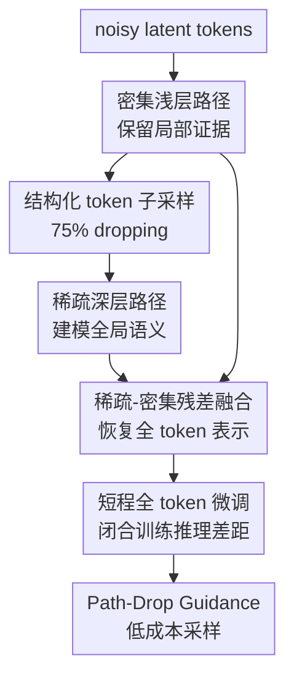

# SPRINT: Sparse-Dense Residual Fusion for Efficient Diffusion Transformers

**会议**: ICLR2026  
**OpenReview**: [https://openreview.net/forum?id=aTVollXaaI](https://openreview.net/forum?id=aTVollXaaI)  
**代码**: 待确认  
**领域**: 扩散模型 / 图像生成 / 高效训练  
**关键词**: 稀疏训练, Diffusion Transformer, token dropping, 残差融合, 高效采样

## 一句话总结
SPRINT 把扩散 Transformer 的浅层密集局部特征和深层稀疏全局特征用残差方式融合起来，使 DiT 能在 75% token dropping 下高效预训练，并进一步用 Path-Drop Guidance 降低采样成本。

## 研究背景与动机
**领域现状**：Diffusion Transformer（DiT）已经成为高质量图像生成的重要骨干，从 DiT、SiT 到更大的 rectified-flow transformer，都依赖长序列 patch token 上的自注意力来建模图像结构。问题是自注意力对 token 数量近似二次增长，图像分辨率越高、patch 越多，预训练成本和显存压力就越难承受。

**现有痛点**：一个直接想法是在训练时丢掉部分 token，让中间层只处理更短的序列。可 naive token dropping 会破坏空间覆盖，尤其在扩散模型的噪声输入上，模型既要恢复局部高频细节，又要理解全局语义结构；如果深层看到的 token 太少、浅层信息又没有被可靠保留，最终推理时面对完整 token 序列就容易出现表示退化和 train-inference gap。

**核心矛盾**：DiT 的所有层都以同样方式处理全量 token，但不同深度的层承担的职责并不一样。浅层更接近 noisy patch，本来就适合保留局部纹理、噪声和边缘等细粒度信息；深层则更适合建模对象形状、类别和跨区域关系。让深层继续对每个局部 token 做昂贵计算，既浪费 FLOPs，也没有显式鼓励深层专注于全局语义。

**本文目标**：作者想解决三个子问题：第一，在高 drop ratio（典型为 75%）下稳定训练 DiT；第二，让稀疏训练学到的表示能迁移到完整 token 推理；第三，在训练之外，把这种双路径结构也转化成更便宜的 guidance 采样。

**切入角度**：论文的观察是“浅层密集信息”和“深层稀疏语义”不是互相替代，而是互补。浅层如果保留全量 token，就能为最终 velocity prediction 提供局部证据；深层如果只看结构化采样后的少量 token，反而被迫学习更全局、更 noise-invariant 的上下文。

**核心 idea**：用“浅层全 token 编码 + 中间层稀疏 token 处理 + 残差融合恢复全 token 解码”替代传统 DiT 的全层密集计算，从架构上把局部细节和全局语义分工开。

## 方法详解

### 整体框架
SPRINT 从一个标准 DiT/SiT 出发，把 transformer block 切成三段：前两层作为密集编码器 $f_\theta$，中间若干层作为稀疏深层路径 $g_\theta$，最后两层作为密集解码器 $h_\theta$。训练时，输入 noisy latent patch tokens 先经过 $f_\theta$ 得到全量浅层特征；随后按结构化采样保留约 25% token 给 $g_\theta$，再把深层输出 pad 回原长度，与浅层特征融合后交给 $h_\theta$ 预测所有 token 的 velocity。

这套流程不是简单“少算一点 token”，而是把被丢掉 token 的局部信息通过 dense shallow path 保留下来，让 expensive middle blocks 只负责更稀疏、更语义化的上下文建模。预训练结束后，模型再用很短的 full-token fine-tuning 让中间层适应完整输入；推理时还可以利用浅层路径作为天然的弱 unconditional model，构成 Path-Drop Guidance（PDG）。

### 关键设计

**1. 密集浅层路径：把局部噪声证据从昂贵深层计算里解耦出来**

SPRINT 首先保留一个处理全量 token 的浅层编码器 $f_\theta$。给定 noisy tokens $x_t \in \mathbb{R}^{B \times N \times C}$，模型先计算 $f_t=f_\theta(x_t)$，这里的 $f_t$ 仍然覆盖所有空间位置。这样做的关键不是“多接一条 skip connection”这么简单，而是承认扩散 velocity prediction 对局部噪声、纹理和边缘信息非常敏感；这些信息如果在 token dropping 时直接丢掉，最终 decoder 很难凭少量语义 token 补回来。

论文的可视化也支持这个分工：只用 dense shallow path 时，样本的局部纹理相对完整，但全局结构不稳定。这说明浅层路径确实像一条局部证据高速通道，负责把每个位置的低层信息绕过高成本的中间 transformer blocks，送到最终融合处。它解决的是高比例 dropping 下“被丢 token 没有局部依据可恢复”的问题。

**2. 稀疏深层路径：让中间 blocks 用少量 token 学全局语义**

在 $f_t$ 之后，SPRINT 对 token 做 dropping 得到 $f_t^{drop}$，再送入中间 blocks：$g_t^{drop}=g_\theta(f_t^{drop})$。默认设置使用 75% drop ratio，也就是只保留约四分之一 token 给计算最贵的深层 transformer。由于 DiT 的注意力成本随序列长度快速增长，这一步直接减少了中间层 FLOPs 和显存压力。

更重要的是，深层路径不再被迫在所有局部 patch 上重复建模细节，而是从稀疏覆盖的 token 中学习对象轮廓、类别语义和长程关系。论文中只用 sparse deep path 的可视化会得到更清晰的全局形状但局部纹理破损，正好说明这条路径学到的是偏全局的结构信息。SPRINT 的关键判断是：深层少看一些 token 不一定更弱，只要浅层局部信息还在，深层稀疏化反而能促成更好的语义表示。

**3. 稀疏-密集残差融合：用 mask token 对齐序列并恢复完整预测**

因为 $g_\theta$ 只处理保留 token，输出 $g_t^{drop}$ 的序列长度小于原始 $N$。SPRINT 将被丢位置用固定 `[MASK]` token pad 回来，得到 $g_t^{pad}\in\mathbb{R}^{B\times N\times C}$，再把它与密集浅层特征 $f_t$ 在 channel 维拼接并投影回原维度，最后由解码器 $h_\theta$ 预测完整 token 的 velocity。

这个融合机制的作用是把“每个位置都有的局部证据”和“少数位置带来的全局语义”重新放到同一个全长序列里。相比只对保留 token 预测或额外训练复杂 decoder，SPRINT 的改动很小：标准 DiT block 基本不变，只增加一个融合投影层，参数量约增加 0.3%。消融结果也很直接：只保留 dense path 或 sparse path 都会让 FID 大幅恶化，二者同时存在时才出现 27.5 的 FID，说明融合不是装饰，而是高比例稀疏训练能工作的核心。

**4. 结构化分组采样：避免随机 dropping 留下空间空洞**

单纯 uniform random dropping 会出现局部区域完全没 token 被保留的情况，这对图像生成很危险，因为某些区域的语义上下文会在深层路径里彻底缺席。SPRINT 因此按图像 token 的原始二维拓扑做 group-wise subsampling：把 patch grid 划成 $n\times n$ 小组，每组随机保留 $k$ 个 token，drop ratio 为 $r=1-k/n^2$。主设置取 $n=2,k=1$，正好得到 75% dropping。

这个策略在局部覆盖和全局随机性之间做了非常具体的约束：每个 $2\times2$ 局部区域至少有一个 token 进入深层，避免大块空洞；每次迭代又随机选择组内 token，防止模型记住固定采样模式。论文的消融显示，同样 75% drop ratio 下，结构化采样 FID 为 27.5，而随机采样是 30.1，说明 token dropping 的位置选择和 drop 数量一样重要。

**5. Path-Drop Guidance：用浅层路径替代 CFG 的完整 unconditional pass**

标准 classifier-free guidance（CFG）每个采样步需要 conditional 和 unconditional 两次完整前向，几乎把推理 FLOPs 翻倍。SPRINT 的双路径结构提供了一个天然的弱模型：unconditional 分支可以绕过 $g_\theta$，只用 $f_\theta$ 的 dense shallow features 与 `[MASK]` 填充后的深层占位进行融合。因此 PDG 中 conditional velocity 仍走完整路径，而 unconditional velocity 写作：$v(x_t,\emptyset)=h_\theta(\mathrm{Fusion}(M,f_\theta(x_t,\emptyset)),\emptyset)$。

这其实把“坏一点但便宜的 unconditional model”内生到同一个网络里，思想上接近 Auto Guidance，但无需另训弱网络。为让模型适应这种采样方式，训练和微调阶段还会以 10% 概率随机 drop sparse-deep path，用 mask token 替代。最终 PDG 在 ImageNet 256 上把 inference TFLOPs 从约 0.477 降到 0.274，同时 FDD/FID 还从 SPRINT+CFG 的 75.4/1.96 进一步变为 58.4/1.62。

### 一个完整示例
假设一张 256×256 图像被 VAE 编成 latent，再按 patch size 2 切成一串 noisy latent tokens。传统 SiT 会让所有 1024 个位置在 28 层 transformer 中一路密集计算；SPRINT 则先让前 2 层看完全部 1024 个 token，得到每个位置的浅层局部证据。

进入中间 24 层前，结构化分组采样把每个 $2\times2$ 小组保留 1 个 token，于是深层只处理约 256 个 token。中间层输出后，模型把另外 768 个缺失位置填成 `[MASK]`，恢复成 1024 长度的序列，并与浅层 1024 个 dense features 拼接融合。最后 2 层 decoder 看到的是“每个位置的局部证据 + 稀疏位置传来的全局语义”，所以仍然可以对全部 token 预测 velocity。

到推理采样时，如果要做 guidance，conditional pass 走完整 SPRINT；unconditional pass 不再跑中间 24 层，而是把 deep path 全部替换成 `[MASK]`。这就是为什么 PDG 能接近砍掉一半 guidance 成本：昂贵的中间 blocks 在每个采样步只为 conditional 分支执行一次。

### 损失函数 / 训练策略
SPRINT 沿用标准 flow matching / diffusion velocity loss。给定真实样本 $x_0$ 和高斯噪声 $x_1$，论文采用线性 schedule：$x_t=(1-t)x_0+t x_1$，目标是让网络预测 velocity $v$，优化 $\mathbb{E}\|v(x_t,t)-v_\theta(x_t,t)\|^2$。也就是说，SPRINT 的主要训练信号没有换成额外重建任务，方法收益主要来自稀疏-密集结构和采样策略。

训练分两阶段。第一阶段是长程 sparse pre-training，默认 75% token dropping，batch size 256、learning rate $10^{-4}$、EMA 0.9999。第二阶段是短程 full-token fine-tuning，中间 blocks 改为处理完整 token 序列，常用 100K 到 200K iterations；论文指出 20K steps 已经恢复了 200K fine-tuning 效果的 94% 以上。两阶段都加入 10% path-drop learning，使模型在训练中见过“deep path 被 mask 掉”的情况，从而支撑 PDG 推理。

## 实验关键数据

### 主实验
论文主要在 ImageNet-1K class-conditional generation 上评估，使用 SD VAE / Flux VAE latent、SiT-B/2 和 SiT-XL/2 等配置。指标包括 FDD、FID、IS、Precision/Recall，其中作者强调 FDD 对扩散模型语义质量更可靠。

| 设置 | 方法 | 训练成本 | FDD ↓ | FID ↓ | 备注 |
|------|------|----------|-------|-------|------|
| ImageNet 256, SiT-XL/2, 400K, SD VAE, w/o CFG | Improved SiT-XL/2 | 24.4×10^6 TFLOPs | 351.1 | 12.8 | dense baseline |
| ImageNet 256, SiT-XL/2, 400K, SD VAE, w/o CFG | SPRINT | 18.7×10^6 TFLOPs | 262.6 | 9.30 | 75% token dropping |
| ImageNet 256, SiT-XL/2, 1M, SD VAE, w/ CFG | Improved SiT-XL/2 | 61.2×10^6 TFLOPs | 146.0 | 2.36 | full-token baseline |
| ImageNet 256, SiT-XL/2, 1M, SD VAE, w/ CFG | SPRINT | 31.5×10^6 TFLOPs | 126.1 | 2.29 | 约 1.94× 训练节省 |
| ImageNet 256, SDE 250 steps | SiT-XL† | 122.2×10^6 TFLOPs | 79.5 | 2.04 | 400 epochs |
| ImageNet 256, SDE 250 steps | SPRINT + PDG | 65.1×10^6 TFLOPs | 58.4 | 1.62 | inference 0.274 TFLOPs |
| ImageNet 512, SDE 250 steps | SiT-XL | 366.6×10^6 TFLOPs | - | 2.62 | baseline |
| ImageNet 512, SDE 250 steps | SPRINT + PDG | 184.8×10^6 TFLOPs | 46.9 | 1.96 | 约半训练/推理成本 |

| 兼容性实验 | 方法 | w/o CFG FDD ↓ | w/o CFG FID ↓ | w/ CFG FDD ↓ | w/ CFG FID ↓ | 结论 |
|------------|------|----------------|----------------|---------------|---------------|------|
| REPA, 400K | Improved SiT-XL/2REPA | 279.6 | 10.0 | 146.6 | 2.42 | alignment baseline |
| REPA, 400K | REPA + SPRINT | 234.5 | 8.68 | 125.1 | 2.38 | FDD/FID 均改善 |
| U-ViT, 400K | Improved U-ViT-XL/2 | 335.1 | 12.1 | 193.7 | 3.36 | U 型 transformer baseline |
| U-ViT, 400K | U-ViT + SPRINT | 271.7 | 9.20 | 146.4 | 2.97 | 说明方法不依赖 SiT |

### 消融实验
| 配置 | 关键指标 | 说明 |
|------|---------|------|
| 随机 token sampling | FID 30.1 | 同样 75% dropping，但局部覆盖不稳定 |
| 结构化 group-wise sampling | FID 27.5 | 每个局部 group 保留 token，效果更好 |
| 只保留 sparse path | FID 85.1 | 全局结构尚可但局部信息严重不足 |
| 只保留 dense path | FID 81.4 | 局部纹理存在但缺少深层全局语义 |
| dense + sparse 双路径 | FID 27.5 | 两条路径互补，是核心收益来源 |
| drop ratio 0% | FID 54.1 | 没有稀疏压力，收益有限 |
| drop ratio 50% | FID 32.3 | 已明显优于 dense 训练 |
| drop ratio 75% | FID 27.5 | 主设置，性能最好 |
| drop ratio 87.5% | FID 50.2 | 过度稀疏导致容量不足 |
| f/g/h = 2/8/2 | FID 27.5, 7.47G FLOPs/iter | 默认切分，成本最低且效果最好 |
| f/g/h = 3/6/3 | FID 29.1, 9.33G FLOPs/iter | 把层挪出 middle block 后成本上升 |
| f/g/h = 5/2/5 | FID 49.2, 13.1G FLOPs/iter | 中间语义建模层太少，效果变差 |

### 关键发现
- dense shallow path 和 sparse deep path 不是可互换组件。前者保留局部纹理和噪声证据，后者负责对象形状和全局语义；任何一条单独使用都会让 FID 从 27.5 恶化到 80 以上。
- 75% dropping 在 SPRINT 里不是勉强可用，而是主设置下效果最强；但 87.5% 已经过稀疏，说明 token 数量仍需保留最低语义容量。
- 短程 fine-tuning 很关键但不昂贵。论文显示 20K steps 已恢复 200K fine-tuning 收益的 94% 以上，说明 sparse pre-training 学到的表示可以较快迁移到 full-token regime。
- PDG 不只是省 FLOPs，也改善质量。ImageNet 256 上，SPRINT+PDG 把 inference TFLOPs 从约 0.477 降到 0.274，同时把 FDD 从 75.4 降到 58.4。

## 亮点与洞察
- 最巧妙的点是把 token dropping 从“删输入省算力”改写成“层级职责分工”。浅层全量、深层稀疏、末层融合，刚好对应局部细节、全局语义和 dense prediction 三种需求。
- 残差融合非常轻量，没有引入复杂 auxiliary decoder 或额外重建任务，却能支持 75% drop ratio。这让它比一些专门 token-dropping 架构更容易接到现有 SiT、REPA、U-ViT 代码里。
- 结构化 group-wise sampling 是一个容易被低估的细节。它没有学习额外策略，却用空间拓扑约束避免大块区域缺席，说明高效训练里“保留哪些 token”比“保留多少 token”同样重要。
- PDG 把训练时的双路径架构复用到推理 guidance，是很干净的系统设计。它让同一个模型内部天然包含一个弱 unconditional path，不需要额外训练小模型，也不需要做复杂蒸馏。
- 对其他任务的启发是：当 transformer 的浅层和深层职责天然不同，可以考虑让高成本深层只处理语义代表 token，再用低成本 dense residual 保持逐位置预测能力。视频生成、3D token 生成和 VLM diffusion decoder 都可能受益。

## 局限与展望
- 主要实验集中在 ImageNet class-conditional image generation，虽然论文声称方法可扩展到视频等模态，但跨模态长序列生成还需要更直接的大规模验证。
- SPRINT 仍需要一次短程 full-token fine-tuning 来闭合 train-inference gap。如果训练预算极端受限，fine-tuning 的额外复杂度和超参选择仍是工程成本。
- PDG 的最佳 guidance scale、path-drop probability 目前依赖经验设置。不同 backbone、分辨率、采样器和 VAE latent 空间下，是否稳定保持“更便宜且更好”还值得系统研究。
- 结构化采样目前是固定 $2\times2$ group 中保留 1 个 token。未来可以探索自适应采样，例如根据 timestep、噪声强度、局部纹理复杂度或类别语义动态调整保留比例。
- 方法对超高分辨率、复杂文本条件生成和真实大模型训练的收益可能更大，但论文没有开源训练代码，复现成本和细节可信度仍需要社区验证。

## 相关工作与启发
- **vs MaskDiT**: MaskDiT 也通过 masked token 训练加速扩散模型，但需要额外 decoder / reconstruction 目标，且主要适用于中等 masking ratio。SPRINT 不额外引入重建任务，而是通过 dense residual path 保留局部信息，因此能更稳地支持 75% dropping。
- **vs MicroDiT**: MicroDiT 用 patch-mixer 等额外模块缓解高 masking ratio 下的信息损失，但会增加参数和计算。SPRINT 的参数增量很小，核心依赖浅层密集路径与深层稀疏路径的分工。
- **vs TREAD**: TREAD 让部分 token 绕过中间层，但中间层仍需要承担更多局部 velocity prediction 负担。SPRINT 则给 decoder 一条完整 dense shallow path，使中间层更专注于全局上下文。
- **vs REPA**: REPA 用 DINOv2 对齐中间表示来加速收敛，SPRINT 用结构化稀疏训练改变计算路径。二者不是竞争关系，论文实验显示 SPRINT 可以叠加到 REPA 上继续改善 FDD/FID。
- **vs Progressive Training**: Progressive training 先低分辨率再高分辨率，省的是早期分辨率成本；SPRINT 直接在目标 token grid 上减少中间层序列长度，因此更贴近 DiT 的 attention 瓶颈。

## 评分
- 新颖性: ⭐⭐⭐⭐☆ 把浅层密集、深层稀疏和 residual fusion 组合得很简洁，单个组件不复杂，但整体分工清晰且有效。
- 实验充分度: ⭐⭐⭐⭐☆ 覆盖 ImageNet 256/512、SiT/REPA/U-ViT、多组消融和 PDG 分析，但缺少真实文本到图像大模型或视频生成上的主实验。
- 写作质量: ⭐⭐⭐⭐☆ 论文动机、消融和系统收益讲得清楚，figures 能支撑“局部/全局分工”的叙事；部分 compute 表述需要读者仔细对齐不同 sampler/epoch 设置。
- 价值: ⭐⭐⭐⭐⭐ 对 DiT 训练成本问题非常实用，改动小、可叠加、同时影响训练和推理，值得高效扩散模型方向重点关注。

<!-- RELATED:START -->

## 相关论文

- [\[CVPR 2026\] ResCa: Residual Caching for Diffusion Transformers Acceleration](../../CVPR2026/image_generation/resca_residual_caching_for_diffusion_transformers_acceleration.md)
- [\[ICLR 2026\] DenseGRPO: From Sparse to Dense Reward for Flow Matching Model Alignment](densegrpo_from_sparse_to_dense_reward_for_flow_matching_model_alignment.md)
- [\[ICLR 2026\] Diffusion Transformers with Representation Autoencoders](diffusion_transformers_with_representation_autoencoders.md)
- [\[CVPR 2026\] NOVA: Sparse Control, Dense Synthesis for Pair-Free Video Editing](../../CVPR2026/image_generation/nova_sparse_control_dense_synthesis_for_pair-free_video_editing.md)
- [\[ICLR 2026\] DiffSparse: Accelerating Diffusion Transformers with Learned Token Sparsity](diffsparse_accelerating_diffusion_transformers_with_learned_token_sparsity.md)

<!-- RELATED:END -->
