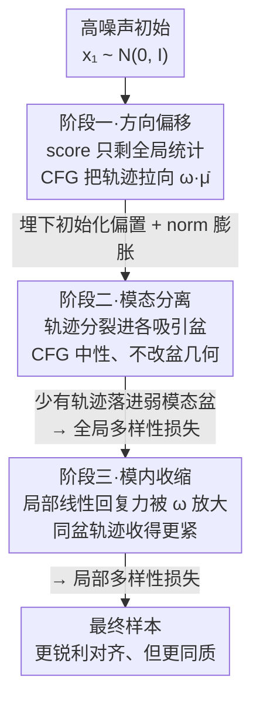

# Stage-wise Dynamics of Classifier-Free Guidance in Diffusion Models

**会议**: ICLR 2026  
**OpenReview**: [https://openreview.net/forum?id=fP0s1TEow3](https://openreview.net/forum?id=fP0s1TEow3)  
**代码**: https://github.com/sqt24/tvcfg  
**领域**: 扩散模型  
**关键词**: Classifier-Free Guidance, 扩散模型采样, 多样性塌缩, 高斯混合, 时变引导

## 一句话总结
本文在**多模态（高斯混合）条件分布**假设下，第一次把 Classifier-Free Guidance（CFG）的采样过程拆成"方向偏移 → 模态分离 → 模内收缩"三个阶段，用三条定理分别刻画 CFG 在每个阶段对轨迹的作用，统一解释了"引导越强、对齐越好但多样性越差"这一长期经验现象，并顺手给出一个低-高-低的时变引导日程同时提升质量与多样性。

## 研究背景与动机

**领域现状**：扩散模型做条件生成时，几乎都依赖 Classifier-Free Guidance（CFG）来增强对 prompt / 类别标签的语义对齐。它的做法极简——在无条件 score 和条件 score 之间做外插：把引导强度 $\omega>1$ 调大，对齐就更强。正因为简单有效，CFG 成了所有大规模扩散管线的事实标准。

**现有痛点**：CFG 是一个**启发式公式**，外插后的 score 不再对应任何合法的概率模型，因此它到底如何重塑采样动力学一直没讲清。已有理论分析分两类：一类假设条件分布是**单峰高斯**，推导干净但完全忽略了真实任务的多模态本质；另一类放松了分布假设，却只给出很弱的定性结论，无法做出精确预测。

**核心矛盾**：最著名的、却始终无法被理论解释的经验现象，就是**引导强度增大时多样性塌缩**——画面更清晰、更贴合 prompt，但样本之间越来越像。单峰假设下根本无从谈"多样性"，因为单峰里没有"弱模态被抹掉"这回事；而过弱的假设又给不出"为什么塌缩"的机制。

**本文目标**：在能真正容纳"多个模态"的分布假设下，刻画 CFG 在采样全过程中如何一步步侵蚀多样性，并把"全局多样性损失"（弱模态消失）和"局部多样性损失"（同一语义内细节趋同）这两类现象分开解释。

**切入角度**：把条件分布 $p(x\mid y)$ 建模为**高斯混合**而非单峰高斯。一旦允许多峰，采样轨迹在不同噪声尺度下会呈现出截然不同的行为——高噪声看全局统计、中噪声分裂进各自的吸引盆、低噪声在盆内收缩——这天然地把采样过程切成三段。

**核心 idea**：用"高斯混合 + 三阶段分解"这把尺子去量 CFG：证明 CFG 在第一阶段制造初始化偏置、在第二阶段保持中性但放大已有偏置、在第三阶段加剧模内收缩，三者复合就解释了多样性为何塌缩。

## 方法详解

本文不是提出一个新模块，而是提出一套**理论分析框架**：先用一个能容纳多模态的简化分布与噪声日程做"实验台"，再沿采样的时间轴把 CFG 的作用拆成三个连续阶段，每个阶段用一条定理把"CFG 相对纯条件采样多做了什么"写成可证的不等式。读懂方法的关键是：**第二阶段 CFG 其实是中性的，多样性塌缩并非任何单一阶段造成，而是第一阶段的偏置被后两个阶段"接力放大"的复合结果。**

### 整体框架

分析建立在三条假设上（Assumption 3.1）：无条件分布取标准高斯先验 $p_0(x)=\mathcal{N}(0,I_d)$；条件分布建模为高斯混合 $p(x\mid y)=\sum_{k=1}^{K}\pi_k\,\mathcal{N}(x;\mu_k,\sigma_y^2 I_d)$（$\sigma_y<1$，这一步是能谈多样性的前提）；噪声日程取 flow-matching 形式 $\alpha(t)=\frac{1}{1-t}$、$\beta(t)=\frac{t}{1-t}$，使得 $p(x_t\mid x_0)=\mathcal{N}((1-t)x_0,\,t^2 I_d)$。CFG 把引导 score 写成

$$\hat{s}_t(x_t;y,\omega)=(1-\omega)\,\nabla_{x_t}\log p_t(x_t)+\omega\,\nabla_{x_t}\log p_t(x_t\mid y),\qquad \omega>1,$$

再代入概率流 ODE $\frac{dx_t}{dt}=-\alpha(t)x_t-\beta(t)\hat{s}_t(x_t;y,\omega)$ 求解。随着噪声从高到低衰减，同一条引导轨迹会先后经过三个动力学性质不同的区制：

三个阶段不是孤立的：第一阶段制造的偏置会被"携带"进后两个阶段，因此理解 CFG 必须把三段当成一条因果链来看，这也是本文与以往"在单点上分析 CFG"的根本区别。

### 关键设计

**1. 方向偏移阶段：CFG 加速奔向放大后的全局均值并埋下初始化偏置**

第一阶段对应早期高噪声区制。此时细粒度的多模态信息被强噪声压住，score 只反映条件分布的**全局统计**而非具体模态结构。定理 3.2 证明：设类加权均值 $\bar{\mu}=\sum_k\pi_k\mu_k$，从同一初始 $x_1\sim\mathcal{N}(0,I)$ 出发，存在时间点 $t_{e1}<1$ 使得对所有 $t\in[t_{e1},1)$，

$$\mathbb{E}\big[\|x_t^{(\mathrm{CFG})}-\omega\bar{\mu}\|_2^2\big]<\mathbb{E}\big[\|x_t^{(y)}-\omega\bar{\mu}\|_2^2\big],$$

即引导轨迹比纯条件轨迹更快、更近地逼近**被放大了 $\omega$ 倍的均值** $\omega\bar{\mu}$。这带来两个后果：一是**加速效应**，因为 CFG 放大了指向均值的吸引；二是 **norm 膨胀**，因为 $\omega>1$ 把目标点推得离原点更远，轨迹被拉过去后范数也更大。两者合起来在采样最开头就植入一个结构性偏置——轨迹被迅速甩向放大的全局均值，于是天然倾向于在后面塌进主导模态。这一阶段不只决定早期的速度和尺度，更**提前种下了模态选择机制**。

**2. 模态分离阶段：CFG 对盆几何中性，弱模态在理论上存活、却几乎无轨迹进入**

第二阶段对应中等噪声区制，多模态结构开始主导，轨迹不再奔向全局均值，而是分裂进各自模态的吸引盆。这一阶段的核心反直觉结论是：**CFG 在这里是中性的**。放大条件 score 只会让轨迹在它已经所属的那个盆里收敛得更快，并不会改变盆的几何、也不会把轨迹从一个盆推到另一个盆。定理 3.3 在两分量混合下证明：存在一个**与 $\omega$ 无关**的区域 $U_{s2}$，只要轨迹在 $t_{s2}$ 时落进 $U_{s2}$，无论引导多强，它都会一路对齐到弱模态 $\mu_1$——弱模态的吸引盆是真实存在且 $\omega$ 不变的。

那弱模态为什么实际中会消失？罪魁是第一阶段遗留的初始化偏置。命题 3.4 说明：一旦轨迹在 $t_{s1}$ 被拉到足够接近 $k\bar{\mu}$（半径 $r(k)$ 随 $k$ 单调增大），则在更早的所有时刻强模态 $\mu_2$ 的后验似然都压过 $\mu_1$；而由定理 3.2，$\omega$ 越大、轨迹越贴近 $\omega\bar{\mu}$，对应更大的有效 $k$，被强模态支配的区域也随之扩张。于是结论是：**弱模态盆 $U_{s2}$ 数学上一直存在，但强引导让轨迹几乎无法到达它**。全局多样性损失不是第二阶段"抹掉"了弱模态，而是第一、二阶段复合——早期位移 + 盆占据率下降——的结果。

**3. 模内收缩阶段：CFG 放大局部回复力，挤压同一模态内的细粒度多样性**

第三阶段对应噪声衰减到很低后的晚期，动力学由每个模态 $\mu_k$ 周围的**局部几何**主导，轨迹几乎只受最近模态影响，CFG 的作用变成完全"模内"的。定理 3.5 证明：存在 $t_{s3}$ 与半径 $r$，对从同一对初始点 $x_{t_{s3}},z_{t_{s3}}\in B((1-t_{s3})\mu_k,r)$ 出发的两条轨迹，在 $t\in[0,t_{s3})$ 上始终有

$$\big\|x_t^{(\mathrm{CFG})}-z_t^{(\mathrm{CFG})}\big\|<\big\|x_t^{(y)}-z_t^{(y)}\big\|,$$

即 CFG 让同盆内邻近轨迹收缩得比纯条件采样（$\omega=1$）更紧。直觉很清楚：噪声可忽略时条件 score 近似一个指向局部均值的**线性回复力**，乘以 $\omega>1$ 就放大了这个力，邻近轨迹靠拢更快、间距收缩更猛。这一收缩有两面性：一面解释了为什么大引导权重下样本更锐利、更干净、更贴 prompt（轨迹被紧紧拉进每个模态最具语义代表性的区域）；另一面也解释了**类内多样性为何受损**——姿态、纹理、细粒度风格这些本应在宽松采样下涌现的变化被压平，造成局部多样性塌缩。

### 损失函数 / 训练策略

本文不训练新模型，三阶段分析直接导出一个**时变引导日程（TV-CFG）**作为副产物：既然早期强引导制造全局偏置、晚期强引导挤压局部细节，那么理想日程应当**在早期和晚期都减弱引导、在中段加强引导**（低-高-低）。这一日程无需重训、即插即用，把"什么时候该强引导"从经验调参变成了由理论机制指导的设计。

## 实验关键数据

实验不在玩具设定上做，而是直接在 SOTA 扩散模型上验证三阶段预测，并评估 TV-CFG。

### 主实验

验证两条核心预测：(1) 早期强引导侵蚀全局多样性——对比"早强-晚弱"与"早弱-晚强"等日程，发现早弱日程（如 prompt "A view of a bathroom that is clean"）产出空间结构与配色明显更丰富，而恒定高权重和早高日程都塌缩到大窗、冷色调的雷同布局；(2) 晚期强引导抑制细粒度多样性——从同一噪声出发、在中段注入小扰动后继续采样，晚高日程让局部细节（如飞行汽车形状/位置）几乎一模一样（MSE=0.0025），恒定日程则保留更大变化（MSE=0.0103）。两者都与理论吻合。

下表为固定 NFE=10、扫描引导强度 $\omega$ 的结果（CLIP/IR 越高越好，FID 越低越好，Diversity 越高越好；这里取 CFG 列）：

| 指标 | 方法 | $\omega=3$ | $\omega=5$ | $\omega=7$ | $\omega=9$ |
|------|------|------|------|------|------|
| IR ↑ | vanilla | 0.894 | 0.806 | 0.553 | 0.223 |
| IR ↑ | **TV(Ours)** | 0.859 | **0.935** | **0.950** | **0.932** |
| FID ↓ | vanilla | 28.305 | 29.275 | 32.859 | 38.988 |
| FID ↓ | **TV(Ours)** | **27.898** | **27.722** | 28.547 | 30.259 |
| Diversity ↑ | vanilla | 1.066 | 1.101 | 1.105 | 1.081 |
| Diversity ↑ | **TV(Ours)** | 1.092 | **1.158** | **1.196** | **1.223** |

关键发现：vanilla CFG 随 $\omega$ 增大，IR 从 0.894 崩到 0.223、FID 从 28.3 涨到 39.0、Diversity 在高 $\omega$ 反而回落——正是"强引导毁多样性甚至毁质量"的塌缩；而 TV-CFG 在大 $\omega$ 下 IR、FID、Diversity 三项同时显著更优，且 Diversity 随 $\omega$ 单调上升到 1.223，印证低-高-低日程能同时改善质量与多样性。

### 消融实验

固定 $\omega=9$、扫描 NFE 预算（5/10/15/20）做第二组对照（Table 2），用于检验结论在不同采样步数下的稳健性；另在 NFE=50 的高预算下对比 vanilla-CFG、interval-CFG、TV-CFG、β-CFG（Fig. 4），发现遵循"低-高-低"调度原则的方法（TV、β、interval）多样性显著高于恒定日程，恒定日程虽语义一致但结果过度同质。这说明改善并非来自更多算力，而是来自时变调度本身——与三阶段理论一致。

## 相关工作与局限

**相关工作**：CFG 的理论分析此前多落在单峰高斯假设（推导干净但谈不了多样性）或过弱假设（只有定性结论）两端；扩散采样理论近年快速发展，但 CFG 因其启发式形式仍属空白。本文与早期实证工作（扩散模型"早定整体、晚定细节"）相呼应——这恰好对应本文区分的全局多样性与局部多样性。

**局限**：(1) 分析依赖高斯混合条件分布、标准高斯先验和特定 flow-matching 噪声日程等简化假设，作者强调这些是为技术便利、不同扩散形式可经重参数化互相转换，但真实数据分布远比高斯混合复杂；(2) 部分定理（3.3、3.5、命题 3.4）建立在"some mild assumptions"之上，原文未在正文完整展开这些温和条件，具体边界以原文附录为准 ⚠️；(3) TV-CFG 只是分析的副产物而非核心贡献，论文主旨在"解释机制"，时变日程的最优形状仍是经验设定，未给出闭式最优解。

<!-- RELATED:START -->

## 相关论文

- [\[ICLR 2026\] Overshoot and Shrinkage in Classifier-Free Guidance: From Theory to Practice](overshoot_and_shrinkage_in_classifier-free_guidance_from_theory_to_practice.md)
- [\[ICLR 2026\] Improving Classifier-Free Guidance in Masked Diffusion: Low-Dim Theoretical Insights with High-Dim Impact](improving_classifier-free_guidance_in_masked_diffusion_low-dim_theoretical_insig.md)
- [\[CVPR 2026\] CFG-Ctrl: Control-Based Classifier-Free Diffusion Guidance](../../CVPR2026/image_generation/cfg-ctrl_control-based_classifier-free_diffusion_guidance.md)
- [\[AAAI 2026\] Studying Classifier(-Free) Guidance From A Classifier-Centric Perspective](../../AAAI2026/image_generation/studying_classifier-free_guidance_from_a_classifier-centric_perspective.md)
- [\[AAAI 2026\] DICE: Distilling Classifier-Free Guidance into Text Embeddings](../../AAAI2026/image_generation/dice_distilling_classifier-free_guidance_into_text_embedding.md)

<!-- RELATED:END -->
