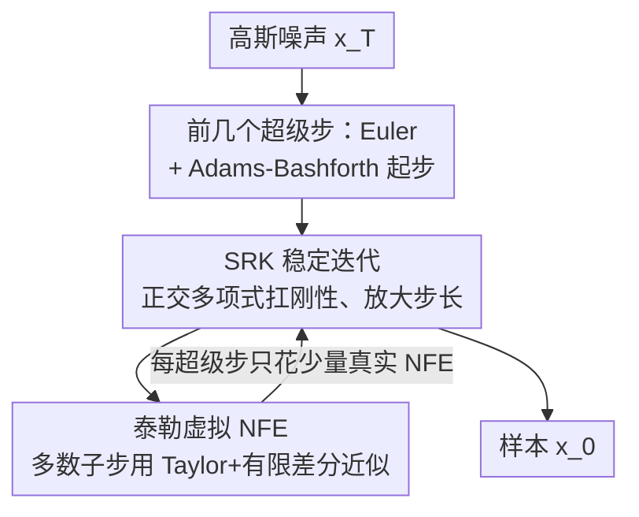

# STORK: 通过同时解决刚性与结构依赖来加速扩散与流匹配采样

**会议**: ICLR 2026  
**OpenReview**: [https://openreview.net/forum?id=CeOIVXMl4r](https://openreview.net/forum?id=CeOIVXMl4r)  
**代码**: https://github.com/ZT220501/STORK  
**领域**: 扩散模型 / 快速采样 / 数值求解器  
**关键词**: 扩散模型, 流匹配, 训练无关采样, 稳定龙格-库塔, 刚性ODE

## 一句话总结
STORK 把数值分析里专治"刚性 ODE"的稳定龙格-库塔（SRK）方法搬进扩散与流匹配采样，再用泰勒展开把 SRK 高昂的函数评估次数（NFE）压成"虚拟 NFE"，得到一个既能扛刚性、又不依赖半线性结构的训练无关求解器，在 7–20 NFE 的极低预算下 FID 全面优于 DPM-Solver++ 与 UniPC。

## 研究背景与动机

**领域现状**：扩散模型（DM）和流匹配模型的采样本质是反向求解一条 ODE/SDE，但需要几十上百次神经网络前向（NFE），推理昂贵。训练无关的快速采样器（不改模型、只换数值求解器）因此成为热点，代表作是利用噪声扩散 ODE 半线性结构的 DPM-Solver、DEIS，以及预测-校正型的 UniPC。

**现有痛点**：作者指出，已有训练无关方法没法**同时**解决两个关键难题。其一是 ODE 的**刚性**（stiffness）——速度场不够"直"，斜率局部变化太快，显式方法用大步长就会数值爆炸或失准；这正对应快速采样研究里常说的"轨迹不够直"。其二是**结构依赖**（structure-dependence）——DPM-Solver 这类指数积分器方法专为 $\frac{dx}{dt}=Lx+N(x)$ 这种半线性结构设计（$L$ 是线性算子，$N$ 是非线性项），而流匹配 ODE $\frac{dx}{dt}=v(x(t),t)$ 根本没有半线性结构，于是只能借"数据预测"（data prediction）步硬套，每步都引入额外误差。

**核心矛盾**：解决刚性的主流武器（指数积分器）恰恰是结构依赖的，二者绑在一起；想要一个既扛刚性、又对 ODE 形式无要求的求解器，现有工具箱里没有现成答案。

**本文目标**：找到一个既是**刚性求解器**（stiff solver）、又是**结构无关求解器**（structure-independent solver）的训练无关采样方法，让它能直接、无差别地用在噪声扩散和流匹配两类模型上。

**切入角度**：作者从经典数值分析里翻出**稳定龙格-库塔（SRK）方法**——它用切比雪夫/Gegenbauer 等正交多项式构造稳定多项式，专门为刚性 ODE 设计，允许把步长放大到 $h\sim O(s^2)$（$s$ 为子步数）而保持稳定，且推导中从不假设 ODE 有任何特殊结构。换句话说，SRK 天生同时落在"刚性"和"结构无关"两个象限里（论文 Figure 4）。

**核心 idea**：把 SRK 引入采样解决前两个问题，再用**时间方向的泰勒展开 + 有限差分**把 SRK 每个超级步所需的 $s$ 次真实 NFE 大部分替换成不花 NFE 的"虚拟 NFE"，从而既享受 SRK 的稳定性、又把推理成本压到与 SOTA 相当——这就是 STORK。

## 方法详解

### 整体框架
STORK 把一次从 $x(t_0)$ 到 $x(t_0-h)$ 的采样推进称为一个**超级步（super-step）**，每个超级步内部又拆成 $s$ 个**子步（sub-step）**。直接套用 $s$ 阶 SRK 需要 $s$ 次 NFE（$s$ 通常取 10–50），代价高到不可接受（Table 1 里裸 SRK4 在低 NFE 下 FID 高达 443）。STORK 的解法是：超级步内只有少数几个点做真实 NFE，其余子步用**泰勒展开把速度 $v(Y_j,t_j)$ 近似成只随时间 $t$ 变化的函数**，导数再用前向有限差分从历史速度估出，这些近似点叫**虚拟 NFE**，不消耗真实前向。整条流水线对噪声预测 $\epsilon_\theta$ 和流匹配速度 $v$ 完全同构——把 $v$ 换成 $\epsilon_\theta$ 即可，因此结构无关。

### 关键设计

**1. SRK 稳定迭代：用正交多项式同时扛住刚性与结构依赖**

这一步针对的是"刚性 + 结构依赖被绑死"这个核心矛盾。STORK 以四阶 SRK（Abdulle 的正交切比雪夫龙格-库塔，主用 STORK-4，因实测稳定优于 STORK-1/2；SRK 只有 1、2、4 阶存在，三阶以上因稳定多项式根的原因不存在）为骨架，一个 $s$ 阶超级步形如

$$Y_0=x(t_0),\quad Y_1=Y_0-h\mu_1 v(Y_0,t_0),$$
$$Y_j=-h\mu_j v(Y_{j-1},t_{j-1})-\nu_j Y_{j-1}-\kappa_j Y_{j-2},\quad j=2,\dots,s-4,$$

其中 $\mu_j,\nu_j,\kappa_j$ 都是**与 ODE 无关的预计算常数**（由切比雪夫多项式递推给出），中间时刻 $t_j$ 只依赖端点 $t_0$ 与 $t_0-h$。关键在于这套递推从不假设速度场的任何结构，所以它对噪声扩散（半线性）和流匹配（无半线性）一视同仁——把 $v$ 换 $\epsilon_\theta$ 公式照旧；同时正交多项式构造的稳定域让步长可放大到 $h\sim O(s^2)$ 仍保持数值稳定，这正是它能扛刚性的来源。和经典 RK 的本质区别是：RK 靠增加子步提升**收敛阶**但不解决刚性，SRK 靠增加子步扩大**稳定域**专治刚性，且 $s$ 可按通用公式任意调大。

**2. 泰勒虚拟 NFE：把 SRK 的 s 次真实评估压成少数几次**

裸 SRK 致命在于一个超级步要 $s$ 次 NFE，这一步就是把这个成本拆掉。核心观察是：把速度近似当成**纯时间函数**，在 $(Y_0,t_0)$ 处做时间方向泰勒展开

$$v(Y_j,t_j)=v(Y_0,t_0)+(t_j-t_0)v'(Y_0,t_0)+\frac{(t_j-t_0)^2}{2}v''(Y_0,t_0)+\frac{(t_j-t_0)^3}{6}v'''(Y_0,t_0)+O((t_j-t_0)^4),$$

而其中的高阶导数又不能真去算（同样要花 NFE），于是再用**前向有限差分**从前几个超级步**存下来的历史真实速度**估出 $v',v'',v'''$。这样除了每个超级步开头的真实 NFE，其余子步全是"虚拟 NFE"——不花一次前向。最初几个超级步因为还没有足够历史点，先用一步 Euler、再用两步 Adams-Bashforth 起步攒够点。泰勒阶数 $n$ 经验取值：噪声预测（无条件/有条件）用 $n=2$，潜空间条件流匹配用 $n=1$。论文 Theorem 1 给出收敛性保证：不用泰勒近似时 STORK-$k$（$k=2,4$）以 $k$ 阶收敛，泰勒版与非泰勒版之间的误差为 $O(h^2)$。

**3. 子步数 s 的调参：在稳定域大小与泰勒误差累积间取平衡**

$s$ 虽然不影响 NFE（虚拟 NFE 不计费），但它直接决定生成质量，必须单独调。机制上存在一个张力：$s$ 太小，SRK 的绝对稳定域不够大，扛不住刚性；$s$ 太大，泰勒展开的近似误差会沿子步不断累积反而变差。论文据此给出经验值——CIFAR-10 用 $s=14$，LSUN-Bedroom 与 MJHQ-30K 用 $s=24$。这个设计点把"为什么 STORK 在不同数据集/分辨率上要换 $s$"讲清楚了：它不是随意超参，而是稳定性与泰勒精度之间的显式折中。

### 损失函数 / 训练策略
STORK 是**训练无关**采样器，不改任何模型权重、无需训练或蒸馏，只替换推理阶段的数值求解器。全部实验默认用 STORK-4：噪声生成配二阶泰勒，流匹配生成配一阶泰勒；为避开 $t=0$ 的奇异性，去噪只到一个小量 $\epsilon>0$。

## 实验关键数据

### 主实验
对比对象是两个 SOTA 训练无关采样器 DPM-Solver++ 与 UniPC（流匹配下为其 Flow- 变体），覆盖无条件/有条件、像素/潜空间、噪声/流匹配、图像/视频多种设置，指标为 FID↓（图像）与 EvalCrafter↑（视频）。

| 任务设置 | 模型 / 数据 | NFE | STORK 表现 |
|--------|------|------|------|
| 无条件像素 | DDIM / CIFAR-10 32px | 9–20 | FID 曲线全程压在最低，直到各方法收敛 |
| 无条件潜空间 | DDIM / LSUN-Bedroom 256px | 9–20 | 同上，跨数据集稳健 |
| 条件噪声 | Pixart-α / MJHQ-30K 512px, CFG=4.5 | 9–20 | 持续低于 DPM-Solver++、UniPC |
| 条件流匹配 | SANA-1.6B / MJHQ-30K 1024px | 7–15 | 大幅领先 Flow- 基线 |
| 条件流匹配 | SD-3.5-L / MS-COCO 512px | 7–15 | 跨数据分布仍领先 |
| 文本→视频 | Hunyuan Video 512×320 | 4–8 | EvalCrafter 最终分领先（首个在视频上做训练无关快采样的工作） |

视频生成上（EvalCrafter，700 prompt，4 个子指标聚合）STORK 在最终分上全面胜出，尤其在 NFE=7 时取 219 分（Flow-DPM-Solver++ 215、Flow-UniPC 216）；在"视觉质量"子指标上、特别是极低 NFE（NFE=4 时 50.00 vs 45.02/45.51）优势最明显。

### 消融实验
在 CIFAR-10 上对比裸 RK4、裸 SRK4 与 STORK-4，说明"虚拟 NFE"机制的不可或缺（FID↓）：

| 方法 \ NFE | 10(12) | 20 | 30(32) | 40 | 50(52) |
|------|------|------|------|------|------|
| RK4 | 121.41 | 33.66 | 4.50 | 5.06 | 5.09 |
| SRK4 | 443.81 | 40.83 | 6.23 | 6.32 | 6.17 |
| STORK-4 (本文) | **5.50** | **4.17** | **3.89** | **3.81** | **3.79** |

### 关键发现
- **虚拟 NFE 是关键**：裸 SRK4 在低 NFE 下 FID 高达 443，几乎不可用；加上泰勒虚拟 NFE 后 STORK-4 在 10 NFE 就降到 5.50，证明 SRK 的稳定性必须配合 NFE 压缩才实用。
- **越极端越占优**：在 7–10 这种极低 NFE 区间，STORK 与基线差距最大；当 NFE 增大、各方法都趋于收敛时优势收窄——它本质是为极低预算设计的。
- **代价基本免费**：10 NFE、FLUX.1-dev、512px 下，STORK-4 平均墙钟时间 1.224s（Flow-UniPC 1.223s、Flow-DPM-Solver++ 1.100s），显存占用与基线几乎一致（32.071 GB vs 32.069 GB），泰勒+有限差分的额外开销可忽略。

## 亮点与洞察
- **把"轨迹不够直"翻译成经典刚性问题**：作者把扩散采样社区口语化的"velocity field 不够直"精确对应到数值分析里的 stiffness，从而能直接调用几十年成熟的 SRK 稳定多项式理论——这种跨学科"找对词典"的洞察是全文最巧妙处。
- **二象限定位图（Figure 4）很有说服力**：用"是否扛刚性 × 是否结构无关"两个轴一摆，立刻看清 DPM-Solver 在刚性但结构依赖、经典 RK 在结构无关但不扛刚性，唯独 SRK/STORK 同时占两个好象限。
- **虚拟 NFE 的思路可迁移**：把"多阶段求解器里大部分中间评估用泰勒+历史有限差分近似掉"这一招，原则上可嫁接到其他需要多次内部函数评估的迭代求解器，是一个通用的 NFE 摊销技巧。
- **结构无关带来的普适性**：同一套求解器无需"数据预测"补丁就能跨噪声/流匹配、图像/视频，工程上少了一层 hack。

## 局限与展望
- 作者承认：用比当前更小的 NFE 采样、以及 STORK 的进一步扩展仍待探索。
- 子步数 $s$ 与泰勒阶数 $n$ 都是经验调出来的（不同数据集要换 $s$），缺少自动选取机制，换新模型/分辨率可能要重调。
- 泰勒近似把速度当成纯时间函数，本质忽略了 $v$ 对 $x$ 的依赖，$s$ 过大时误差累积——这给步长/子步的可放大程度设了天花板。
- 视频实验里 STORK 在"时序一致性"子指标上反而略低于基线（NFE=8 时 62.26 vs 63.07），说明它的增益主要来自视觉质量而非全指标无死角领先。

## 相关工作与启发
- **vs DPM-Solver++ / DEIS**：它们靠指数积分器吃掉噪声扩散 ODE 的半线性结构来解刚性，但因此**结构依赖**，套到流匹配要加数据预测步、每步引入误差；STORK 用 SRK 从根上做到结构无关，无需任何补丁即可跨两类模型。
- **vs UniPC / DC-Solver**：它们是预测-校正框架，可插在任意采样器上提升收敛阶；STORK 是从稳定性（刚性）而非收敛阶切入，二者关注的维度不同，且实验中 STORK 在低 NFE 下 FID 更低。
- **vs 经典 RK / PNDM**：PNDM 早已指出直接用经典 RK 无法快采样；STORK 的回答是——问题不在 RK 阶数，而在 RK 不是刚性求解器，换成 SRK（稳定域而非收敛阶导向）才对症。

## 评分
- 新颖性: ⭐⭐⭐⭐⭐ 把 SRK + 泰勒虚拟 NFE 引入采样、并以"刚性×结构无关"二象限重新框定问题，视角新且自洽
- 实验充分度: ⭐⭐⭐⭐⭐ 覆盖噪声/流匹配、像素/潜空间、图像/视频多设置，含速度与显存剖析，且是首个在视频上做训练无关快采样的工作
- 写作质量: ⭐⭐⭐⭐ 数值分析背景讲得清楚、图示有力；但算法细节较重，部分超参经验性较强
- 价值: ⭐⭐⭐⭐⭐ 训练无关、即插即用、跨模型通用，在 7–20 NFE 极低预算下稳定领先，实用性强

<!-- RELATED:START -->

## 相关论文

- [\[ICLR 2026\] PCPO: Proportionate Credit Policy Optimization for Aligning Image Generation Models](pcpo_proportionate_credit_policy_optimization_for_aligning_image_generation_mode.md)
- [\[ICLR 2026\] Mitigating Noise Shift in Denoising Generative Models with Noise Awareness Guidance](mitigating_noise_shift_in_denoising_generative_models_with_noise_awareness_guida.md)
- [\[ICLR 2026\] FlowAlign: Trajectory-Regularized, Inversion-Free Flow-based Image Editing](flowalign_trajectory-regularized_inversion-free_flow-based_image_editing.md)
- [\[ICLR 2026\] Improving Classifier-Free Guidance in Masked Diffusion: Low-Dim Theoretical Insights with High-Dim Impact](improving_classifier-free_guidance_in_masked_diffusion_low-dim_theoretical_insig.md)
- [\[ICLR 2026\] Generalization of Diffusion Models Arises with a Balanced Representation Space](generalization_of_diffusion_models_arises_with_a_balanced_representation_space.md)

<!-- RELATED:END -->
