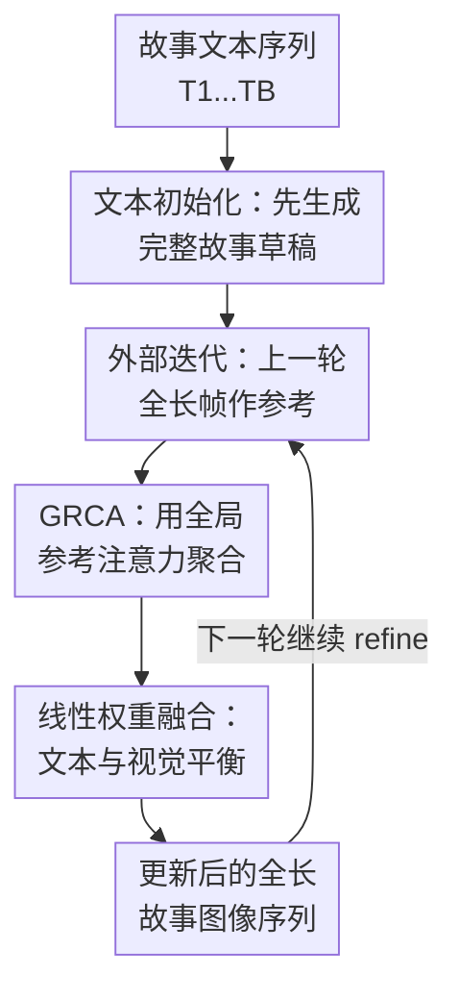

# Story-Iter: A Training-free Iterative Paradigm for Long Story Visualization

**会议**: ICLR2026  
**OpenReview**: [https://openreview.net/forum?id=puBVb9vTah](https://openreview.net/forum?id=puBVb9vTah)  
**代码**: https://github.com/UCSC-VLAA/story-iter  
**领域**: 图像生成 / 长故事可视化  
**关键词**: 长故事可视化, 训练免迭代生成, 全局参考交叉注意力, 角色一致性, 文生图扩散模型  

## 一句话总结
Story-Iter 把长故事可视化从“一次性依赖固定参考图”改成训练免的外部迭代过程：先用文本生成整条故事，再反复把上一轮的全长帧作为全局参考，通过 GRCA 注意力模块同时保持角色一致性和细粒度文本交互，在 100 帧长故事上显著优于已有故事生成范式。

## 研究背景与动机
**领域现状**：故事可视化希望把一串文本 prompt 转成连续图像，让同一个角色、场景和叙事状态在多帧之间保持一致。扩散模型已经能生成高质量单图，因此近年的故事可视化方法通常把 Stable Diffusion 这类文生图模型作为底座，再额外加入跨帧参考、角色记忆或自注意力共享机制。

**现有痛点**：长故事一拉长，问题就不只是“每张图好不好看”，而是“整条故事像不像同一个世界”。自回归范式按顺序生成，每一步只能看有限历史帧，早期错误会一路传下去，也看不到未来会出现的角色或物体。参考图范式用开头几帧作为固定锚点，计算上更稳，但它把整个故事锁死在少数初始参考里：初始图有瑕疵会被传播，新角色在后半段出现时又缺少全局参照。

**核心矛盾**：长故事需要全局视觉上下文，但直接在扩散 UNet 里共享大量中间 denoising feature 会带来很高显存和计算开销；如果只保留少数固定参考，又无法覆盖 50 帧、100 帧叙事里的角色变化、场景转移和细粒度交互。换句话说，方法既要“看完整条故事”，又不能把每一帧的高维特征都塞进注意力里。

**本文目标**：作者要解决三个子问题：第一，如何让每一帧在生成时都能参考整条故事，而不是只参考邻近帧或开头帧；第二，如何让参考图随着故事整体逐轮变好，而不是固定不变地传播早期错误；第三，如何在保持视觉一致性的同时，不牺牲当前文本 prompt 对动作、物体和角色交互的控制。

**切入角度**：论文的观察是，扩散模型内部本来就有多步去噪，但这只是单次生成内部的迭代；故事级别还可以增加一个外部迭代：上一轮生成出的完整故事帧，反过来作为下一轮生成所有帧的参考。这样，每一轮都用“整条故事的当前版本”修正下一轮，而不是把某几张参考图当作永远不变的真相。

**核心 idea**：用“全长故事帧的全局 CLIP embedding + 训练免交叉注意力”替代固定参考图或高维中间特征，让长故事可视化在外部迭代中逐步收敛到更一致、更贴合文本的视觉叙事。

## 方法详解

### 整体框架
Story-Iter 的输入是一组按顺序排列的故事文本 prompt，输出是同样长度的图像序列。流程分两层：第 0 轮只用文本 prompt 调用 Stable Diffusion 生成初始全长故事；之后每一轮都把上一轮的全部 $B$ 张图编码成全局参考，再用 GRCA 插入到扩散模型的交叉注意力中，逐帧重新生成当前轮故事。

这里的“迭代”不是扩散模型内部的 denoising step，而是外部 story-level round。第 $i$ 轮生成第 $k$ 帧时，模型同时看到当前文本 $T_k$ 和上一轮完整图像序列 $x^{i-1}_{1...B}$，因此第 80 帧也可以参考第 2 帧、第 30 帧或第 99 帧里的角色外观与叙事线索。

### 关键设计
**1. 文本初始化：先生成完整故事草稿**

Story-Iter 不从手工角色图、固定开头帧或外部 reference image 开始，而是第 0 轮只用每个文本 prompt $T_k$ 生成初始帧：$x^0_k=SDM(z,T_k)$。这一步看似朴素，但它很关键：如果一开始就用同一张角色参考图强行约束所有帧，模型容易忽略当前句子里新增的物体、动作和场景；而文本初始化能先把每一帧该出现什么大致画出来，给后续迭代提供覆盖全故事的草稿。

这个初始化也避免了参考图范式的一个老问题：开头几帧不一定包含后面才出现的角色。Story-Iter 的第 0 轮虽然不够一致，但每一帧都至少有自己的文本语义落点，后续 GRCA 再从整条草稿中抽取相似角色和场景线索来修正一致性。

**2. 外部迭代：上一轮全长帧作参考**

传统故事生成通常是在一次扩散采样里做文章，而 Story-Iter 把“整条故事”本身当成可迭代优化对象。第 $i$ 轮生成第 $k$ 帧时，使用上一轮的完整图像序列作为参考：$x^i_k=SDM_{GRCA}(z,T_k,x^{i-1}_{1...B})$。生成完所有 $B$ 帧后，得到新的 $x^i_{1...B}$，再进入下一轮。

这样做的具体好处是，参考不是固定的，而是会随迭代更新。某一轮里某个角色外观更清楚、某个交互更贴合文本，下一轮就能把这些更好的视觉线索传播给全故事；反过来，上一轮中不相关或有噪声的参考也会被后续注意力重新加权，而不是像固定参考图那样被永久继承。论文用全局 embedding 分布随迭代逐渐靠近的现象解释这种收敛趋势。

**3. GRCA：用全局参考注意力聚合整条故事**

如果直接参考所有帧的 UNet 中间特征，100 帧故事会带来很重的显存和计算压力。GRCA 的做法更轻：先用预训练 CLIP image encoder 把上一轮的每张参考图 $x^{i-1}_b$ 编成全局 embedding $c_b$，再通过投影矩阵 $W_c$ 把每个全局 embedding 投成少量 reference tokens，论文默认每帧 $n=4$ 个 token。所有帧的 token flatten 后作为 key/value，与当前帧 denoising feature 的 query 做交叉注意力。

更形式化地说，GRCA 先得到 $\tilde{c}^{i}_{1...B}\in R^{1\times(B\times n)\times e}$，再构造 $Q^i_k=I^i_kW_q$、$K^i_k=\tilde{c}^{i}_{1...B}W_k$、$V^i_k=\tilde{c}^{i}_{1...B}W_v$，最后计算 $Attention(Q^i_k,K^i_k,V^i_k)$。由于每帧只贡献少量全局 token，模型可以把很多参考帧纳入注意力；由于 attention 会按当前帧特征选择相关 token，它又不会机械平均所有历史图像。

**4. 线性权重融合：文本与视觉平衡**

长故事可视化不能只追求一致性。如果视觉参考权重太强，角色可能很稳定，但当前 prompt 里“看到狐狸”“举起伞”“走进雪地”这类细粒度动作会被压掉；如果参考权重太弱，文本对齐变好，跨帧角色又会漂移。因此 Story-Iter 把文本 cross-attention 和 GRCA 输出相加，并用随轮次线性增长的 $\lambda_i$ 控制视觉参考强度：$I^i_k=Attention(I^i_k,T_k,T_k)+\lambda_iGRCA(I^i_k,x^{i-1}_{1...B})$。

论文默认 10 轮迭代，$\lambda_i$ 从 0.3 线性增加到 0.5。这个设计的直觉很清楚：早期先让文本约束把故事内容立住，避免一开始就过度追随粗糙参考；后期再逐渐加强全局视觉一致性，让角色外观、色调和场景关系更稳定。消融也显示，固定小权重一致性不足，固定大权重又会损害灵活性。

### 一个完整示例
假设故事有 100 句，前 10 句介绍雪人，30 句附近出现狐狸，70 句以后雪人和狐狸一起行动。第 0 轮里，Stable Diffusion 只看每句文本，可能会把雪人的围巾颜色画得时红时蓝，也可能让狐狸在不同帧里体型和毛色不一致。

进入第 1 轮时，生成第 70 帧不再只看第 70 句文本，而是把第 0 轮 100 张图都编码成 CLIP 全局 token。GRCA 会从全故事里找到与当前帧相关的雪人、狐狸、雪地背景等视觉线索，再结合第 70 句里的交互动作生成新图。到第 5 轮、第 10 轮时，前半段里更稳定的雪人外观和后半段里更清楚的狐狸形象会不断回流到全故事，于是同一角色跨很长距离仍能保持相似，同时当前帧动作仍由文本控制。

这个例子也说明 Story-Iter 和自回归方法的差别：自回归只能从过去有限帧向后传，而 Story-Iter 每一轮都重新看完整故事。因此后面新出现的狐狸，不会永远缺席于前面建立的视觉上下文；它会在下一轮成为全局参考的一部分，参与修正后续所有相关帧。

### 损失函数 / 训练策略
Story-Iter 是 training-free 方法，没有为 ICLR 这篇工作重新训练扩散模型或额外优化损失。它复用 Stable Diffusion / SDXL、CLIP image encoder，以及 IP-Adapter 里已有的 cross-attention 权重，通过插入 GRCA 和调整推理时的 attention 融合来工作。

实验默认使用 10 次外部迭代、DDIM 50-step 采样、Classifier-Free Guidance 为 7.5，线性权重从 $\lambda_1=0.3$ 到 $\lambda_L=0.5$。为了提升效率，作者还给出 Story-Iter-Fast：基于 SDXL-LCM，把扩散采样步数从 50 降到 4，在 100 帧故事上把总时间从 250 分钟降到约 20 分钟，但质量指标会有一定折损。

## 实验关键数据

### 主实验
论文分别评测常规长度故事和长故事。常规长度使用 StorySalon 开源测试子集，共 6026 个 prompt，平均每个故事 14 帧，最长 44 帧；长故事基准由 GPT-4o 构造，包括 10 个 50 句故事和 10 个 100 句故事。指标包括 CLIP-T、aCCS 和 aFID，其中 CLIP-T 衡量文本图像对齐，aCCS / aFID 衡量重复角色或物体在跨帧上的一致性。

| 场景 | 方法 | CLIP-T ↑ | aCCS ↑ | aFID ↓ | 说明 |
|------|------|----------|--------|--------|------|
| 常规长度 StorySalon | StoryGen | 0.255 | 0.724 | 36.34 | 自回归故事生成基线 |
| 常规长度 StorySalon | StoryDiffusion | 0.311 | 0.765 | 14.84 | 固定参考图范式较强 |
| 常规长度 StorySalon | Story-Iter | 0.305 | 0.760 | 16.52 | SD 版本，优于多数基线 |
| 常规长度 StorySalon | Story-IterXL | 0.310 | 0.818 | 14.63 | SDXL 版本，一致性最强 |
| 长故事 50/100 帧 | StoryGen | 0.223 | 0.740 | 126.13 | 长序列误差累积明显 |
| 长故事 50/100 帧 | StoryDiffusion | 0.315 | 0.768 | 102.44 | 固定参考难覆盖全局语义 |
| 长故事 50/100 帧 | Story-IterXL | 0.318 | 0.802 | 94.30 | 在文本对齐和一致性上整体最好 |

效率方面，Story-IterXL 在 100 帧、1024 分辨率下需要 10 次外部迭代，因此计算量和时间高于一次生成的 StoryDiffusion；但它的显存占用反而更低，因为 GRCA 用全局 embedding 而不是共享大量 denoising feature。

| 方法 | 扩散步数 | 外部迭代 | FLOPs | VRAM | 时间 | CLIP-T | aCCS | aFID |
|------|----------|----------|-------|------|------|--------|------|------|
| StoryDiffusion | 50 | 1 | 22 PFLOPs | 40GB | 31 min | 0.315 | 0.768 | 102.44 |
| Story-IterXL | 50 | 10 | 43 PFLOPs | 19GB | 250 min | 0.318 | 0.802 | 94.30 |
| Story-IterXL-Fast | 4 | 10 | 3 PFLOPs | 19GB | 20 min | 0.309 | 0.788 | 109.13 |

### 消融实验
| 配置 | CLIP-T ↑ | aCCS ↑ | aFID ↓ | 说明 |
|------|----------|--------|--------|------|
| w/o Initialization | 0.302 | 0.788 | 90.30 | 用角色参考替代文本初始化，一致性高但文本对齐下降 |
| w/o GRCA | 0.319 | 0.740 | 97.86 | 只用对应索引参考图，全局一致性明显变差 |
| w/o Iteration Paradigm | 0.322 | 0.757 | 105.17 | 不做外部迭代，aFID 最差 |
| Ours | 0.318 | 0.802 | 94.30 | 完整方法在 aCCS 上最好，综合更稳 |

| 权重策略 | CLIP-T ↑ | aCCS ↑ | aFID ↓ | 解释 |
|----------|----------|--------|--------|------|
| 固定 $\lambda=0.3$ | 0.320 | 0.760 | 101.55 | 文本对齐较好，但后期一致性不足 |
| 固定 $\lambda=0.5$ | 0.261 | 0.753 | 81.72 | 视觉约束过强，CLIP-T 明显下降 |
| 线性 $[0.3,0.4]$ | 0.318 | 0.790 | 98.16 | 一致性提升但不如默认设置 |
| 线性 $[0.3,0.5]$ | 0.318 | 0.802 | 94.30 | 默认设置，文本与一致性更平衡 |
| 线性 $[0.3,0.6]$ | 0.309 | 0.811 | 90.92 | 一致性更高，但文本对齐开始下降 |

### 关键发现
- GRCA 的贡献主要体现在长距离、多角色一致性上。只参考对应索引帧时，CLIP-T 甚至略高，但 aCCS 从 0.802 降到 0.740，说明模型更会听当前文本，却失去了跨故事的视觉连接。
- 外部迭代对 aFID 影响很大；去掉迭代后 aFID 为 105.17，而完整方法为 94.30。这说明固定一次参考或单轮生成难以修正长故事里的早期瑕疵。
- 线性权重不是装饰性超参。固定大权重可以压低 aFID，但 CLIP-T 掉到 0.261，意味着生成结果更像参考却不再忠实当前句子；默认 $[0.3,0.5]$ 是更实用的折中。
- Story-Iter 的主要成本来自多轮外部迭代。Fast 版本证明如果使用少步扩散采样，长故事生成可以接近 StoryDiffusion 的时间量级，但会牺牲一部分 aFID。

## 亮点与洞察
- 这篇论文最巧妙的点是把故事级一致性从“模型训练问题”改成“推理时外部迭代问题”。它不需要为每个故事微调，也不需要训练新 adapter，却能让上一轮完整故事成为下一轮的全局记忆。
- GRCA 用 CLIP 全局 embedding 而不是 UNet 中间特征，是一个很务实的工程选择。它牺牲了一部分局部细节表达，但换来了能扩展到 100 甚至 200 帧参考的可行性。
- 论文对“参考图”的理解很有启发：参考不一定是固定资产，也可以是模型自己生成、再逐轮更新的中间状态。这种思路可以迁移到长视频分镜、漫画生成、交互式角色编辑等需要全局一致性的任务。
- 线性增强视觉参考权重的策略简单但有效。早期保文本、后期保一致性，比一开始强行锁角色更符合长故事生成的动态过程。
- Story-Iter 的训练免性质让它更像一个通用推理范式，而不是特定数据集上的专门模型。只要底座扩散模型和参考注意力模块可用，它理论上可以接到 SD、SDXL、LCM 或 ControlNet 变体上。

## 局限与展望
- 计算成本仍然偏高。标准 Story-IterXL 生成 100 帧 1024 图像需要约 250 分钟，虽然显存较低，但多轮外部迭代对交互式创作来说还是重。
- GRCA 使用全局 embedding，对角色身份、服装颜色和整体语义有效，但对局部几何、手部动作、物体接触关系等细节未必足够精确。论文展示了交互改善，但复杂空间关系仍可能失败。
- 长故事基准由 GPT-4o 构造，覆盖 20 个长故事案例。它有利于测试 50/100 帧长度，但数据规模和题材多样性仍有限，未来需要更公开、更可复现的长故事 benchmark。
- 外部迭代会把上一轮生成结果作为参考，因此如果底座模型持续误解某个关键角色或场景，后续轮次可能只是让错误更一致，而不一定自动纠正语义。
- 一个值得继续探索的方向是把 GRCA 的全局参考和显式结构控制结合起来，例如角色状态表、场景图、pose control 或 memory editing，让模型不只“看见相似图”，还能理解故事实体的状态变化。

## 相关工作与启发
- **vs AR-LDM / StoryGen**: 它们按时间顺序自回归生成，适合局部连贯，但长故事里会累积错误；Story-Iter 每一轮都参考全长故事，因此能让远距离帧之间共享角色和场景线索。
- **vs StoryDiffusion**: StoryDiffusion 使用固定参考图和 Consistent Self-Attention，短故事效果强，但对长故事的全局上下文和新角色覆盖不足；Story-Iter 的参考随外部迭代更新，并通过 GRCA 低成本接入全长参考。
- **vs IP-Adapter**: IP-Adapter 面向单图主体一致性，通常把参考图作为个体身份条件；Story-Iter 借用其注意力权重，但把参考对象扩展成整条故事的全局 embedding 集合，用于跨帧叙事一致性。
- **vs ConsiStory / one-prompt-one-story**: 这些训练免一致性方法也关注无需微调的多图一致生成，但 Story-Iter 更强调长故事里的全局迭代优化，尤其是 50/100 帧级别的长期依赖。
- **启发**：如果把“上一轮完整输出”看成一种自生成记忆，很多长序列生成任务都可以尝试类似机制：先生成草稿，再用全局轻量表示反复修正局部输出，而不是一次性把所有约束塞进模型。

## 评分
- 新颖性: ⭐⭐⭐⭐⭐ 外部迭代范式和全长参考 GRCA 的组合很清晰，尤其适合长故事可视化这个痛点明确的场景。
- 实验充分度: ⭐⭐⭐⭐ 同时覆盖 StorySalon、50/100 帧长故事、效率、人评和多组消融，但长故事 benchmark 规模仍偏小。
- 写作质量: ⭐⭐⭐⭐ 方法动机、范式对比和消融逻辑比较完整，部分附录指标和人评表述有轻微不一致，需要读者自行核对。
- 价值: ⭐⭐⭐⭐⭐ 训练免、可插拔、能扩展到底座模型和 ControlNet 变体，对需要角色一致性的长序列图像生成很有参考价值。

<!-- RELATED:START -->

## 相关论文

- [\[CVPR 2026\] ViStoryBench: Comprehensive Benchmark Suite for Story Visualization](../../CVPR2026/image_generation/vistorybench_comprehensive_benchmark_suite_for_story_visualization.md)
- [\[ICLR 2026\] LogiStory: A Logic-Aware Framework for Multi-Image Story Visualization](logistory_a_logic-aware_framework_for_multi-image_story_visualization.md)
- [\[AAAI 2026\] Infinite-Story: A Training-Free Consistent Text-to-Image Generation](../../AAAI2026/image_generation/infinite-story_a_training-free_consistent_text-to-image_gene.md)
- [\[CVPR 2026\] DreamingComics: A Story Visualization Pipeline via Subject and Layout Customized Generation using Video Models](../../CVPR2026/image_generation/dreamingcomics_a_story_visualization_pipeline_via_subject_and_layout_customized_.md)
- [\[ICLR 2026\] Stochastic Self-Guidance for Training-Free Enhancement of Diffusion Models](stochastic_self-guidance_for_training-free_enhancement_of_diffusion_models.md)

<!-- RELATED:END -->
