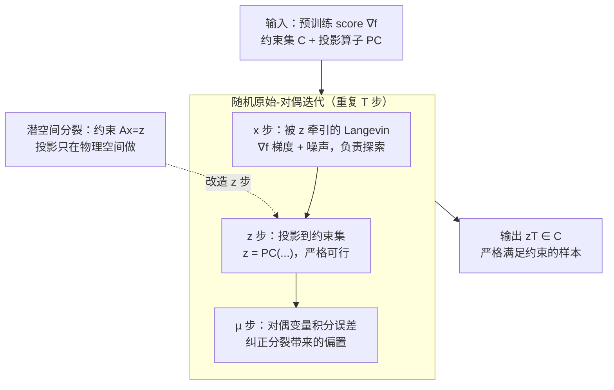

# Strictly Constrained Generative Modeling via Split Augmented Langevin Sampling

**会议**: ICLR 2026  
**OpenReview**: [https://openreview.net/forum?id=aDJcWNmfce](https://openreview.net/forum?id=aDJcWNmfce)  
**代码**: 待确认  
**领域**: 扩散模型 / 约束采样 / 科学生成建模  
**关键词**: 约束 Langevin、变量分裂、原始-对偶、扩散后验采样、物理守恒

## 一句话总结
针对"生成模型给科学问题采样时无法严格满足物理约束"的痛点，本文借鉴 Langevin 动力学的变分视角与拉格朗日对偶，提出 **CASAL（Constrained Alternated Split Augmented Langevin）**——用变量分裂把"探索"和"满足约束"拆给两个变量、再用对偶变量纠偏，从而在**严格满足非凸约束**的同时保留 Langevin 的探索能力，可零样本套到预训练扩散模型上，在受约束的场生成、数据同化、最优控制可行性问题上都显著优于投影法和惩罚法。

## 研究背景与动机

**领域现状**：深度生成模型（能量模型、score-based、扩散模型）已经能从复杂分布里采样，越来越多被用到物理科学——气候预测、分子动力学、数据同化。这些模型骨子里大多依赖 **Langevin 动力学**：用带噪的梯度步 $x_{t+1}=x_t-\tau\nabla f(x_t)+\sqrt{2\tau}w_t$ 把样本推向高似然区域。

**现有痛点**：感知类任务只要"看起来像"就行，但科学与工程要求样本**严格服从已知约束**——能量守恒、质量守恒、系统动力学。约束往往是非凸集合（如 $C=\{x\mid\|x\|_2^2=E\}$）。现有两条路都不令人满意：① **投影 Langevin**（每步把迭代投影回 $C$）在凸情形有保证，但在非凸约束上会把动力学**困在约束集的局部区域**，破坏探索、引入严重采样偏差；② **软惩罚 / 扩散引导**（给势函数加一个可微代价 $\lambda\nabla c$）只是"鼓励"满足约束、并不真正强制，而且要求约束有可微模型，很多物理约束根本写不出可微形式。

**核心矛盾**：**严格满足约束**与**无偏探索**之间存在根本张力——越是硬性把样本钉在低维流形上，越是采不到流形上的正确条件分布。作者进一步从理论上揭示了更深的原因：直接对"投影到 $C$"这个问题做拉格朗日对偶时，**强对偶不成立**（约束集是 $\mathbb{R}^d$ 的真子集导致约束规范条件失效），所以惩罚类方法无论 $\lambda$ 多大都无法逼出 $P_q(C)=1$。

**本文目标**：设计一个采样算法，对**任意约束集** $C$ 都能产出严格落在 $C$ 上、又服从正确条件分布 $p_C$ 的样本；只用无约束分数 $\nabla f$ 和与 $C$ 相关的投影算子；零样本、不重训。

**切入角度 / 核心 idea**：把约束采样写成 Wasserstein 空间里的**信息投影**优化问题，再借鉴优化里的**变量分裂（ADMM 思想）**——引入辅助变量 $z\in C$，让一个变量负责探索、另一个负责满足约束，二者用对偶变量耦合纠偏。一句话：**"用变量分裂 + 原始-对偶迭代，把硬约束从 Langevin 主链路里拆出来单独由投影变量承担"**。

## 方法详解

### 整体框架
CASAL 要解决的是：给定无约束分布 $p(x)=e^{-f(x)}/Z$ 和约束集 $C$，从条件分布 $p_C(x)\propto e^{-f(x)}\mathbf 1_C(x)$ 里采样。整体思路分三层：**先把采样看成优化，再松弛成可解的对偶问题，最后落成一套三变量交替迭代**。

第一层（理论奠基）：Langevin 采样等价于在 Wasserstein 空间 $\mathcal P_2(\mathbb R^d)$ 里最小化 KL 散度 $D(q\|p)$ 的梯度流；于是约束采样就是把 $p$ 投影到"支撑在 $C$ 上的分布集合"，即 $p_C=\arg\min_q D(q\|p)\ \text{s.t.}\ P_q(x\in C)=1$。但作者证明这个原始投影问题**强对偶失效**，对偶类数值方法注定收敛不到 $p_C$——这正是惩罚法失效的根。

第二层（松弛）：把单变量 $x$ **分裂**成一对 $(x,z)\in\mathbb R^d\times C$，强制 $z\in C$、再要求 $x$ 与 $z$ 靠近。把硬等式 $x=z$ 松弛为"期望相等 $\mathbb E[x-z]=0$ + 方差惩罚 $\frac{\rho}{2}\mathbb E\|x-z\|^2$"。这个松弛问题 $(\mathrm P)$ 的约束变得"合格"，**强对偶恢复**，存在鞍点可解。

第三层（算法）：用随机原始-对偶迭代逼近 $(\mathrm P)$ 的鞍点——$x$ 走"被 $z$ 牵引的 Langevin"（探索），$z$ 投影到 $C$（严格可行），对偶变量 $\mu$ 积分二者误差来纠偏。该迭代可作为标准 Langevin 步的**即插即用替换**，直接套到预训练扩散模型上。

### 关键设计

**1. 变分视角与强对偶诊断：先证明"为什么惩罚法注定采不到 $p_C$"**

本文最有理论分量的一步，是把"约束采样为什么难"讲清楚。利用 Langevin = Wasserstein 空间 KL 梯度流这一经典联系，条件分布 $p_C$ 被刻画为信息投影 $p_C=\arg\min_q D(q\|p)$ s.t. $P_q(x\in C)=1$（Prop 3.1）。直觉上想直接对它做拉格朗日对偶求解，但作者证明了 **强对偶不成立**（Prop 3.2）：因为目标分布的支撑 $C$ 是 $\mathbb R^d$ 的真子集，约束规范（constraint qualification）被破坏，对偶间隙无法消除。由此推出 **惩罚法（式 2.5）无论系数多大都无法强制 $P_q(C)=1$**（Corollary 1）——这不是调参不够，而是结构性失败。这条诊断既解释了已有软约束方法的根本缺陷，也直接指明了出路：必须改造问题本身让约束"合格"，而不是在原问题上加大惩罚。

**2. 变量分裂松弛：把"探索"和"满足约束"拆给两个变量，换回强对偶**

针对上面的诊断，CASAL 引入辅助变量做**变量分裂**：把 $x$ 复制成 $(x,z)$，让 $z\in C$ 专职满足约束、$x$ 专职最大化似然，二者本应满足 $x=z$。关键招数是**不要求处处相等，而是松弛为期望相等加方差惩罚**：

$$\min_{q}\ D(q^x\|p)+\mathbb E[\chi_C(z)]+\frac{\rho}{2}\mathbb E\|x-z\|^2\quad \text{s.t.}\quad \mathbb E[x-z]=0.$$

这个松弛问题 $(\mathrm P)$ 的约束是"期望为零"这种合格约束，于是 **强对偶重新成立、鞍点存在**（Prop 3.4）。理论上还能给出它逼近 $p_C$ 的质量：最优解 $q^x_\star\propto\exp(-f(x)-\frac{\rho}{2}d_C^2(x+\mu_\star))$，其中 $d_C$ 是到约束集的距离、$\mu_\star$ 是对偶变量；当 $\rho\to\infty$ 时 $q^x_\rho,q^z_\rho\to p_C$（Prop 4.2），有限 $\rho$ 下松弛误差被界住 $W_2^2(q^x_\star,q^z_\star)\le \frac1\rho D(p_C\|p)$（Prop 4.3）。$\rho$ 因此成了"约束紧/松"的旋钮：大 $\rho$ 把 $x$ 拉近 $C$，小 $\rho$ 鼓励探索。与软惩罚的区别在于：这里的 $z$ 是被**投影**硬钉在 $C$ 上的，不是被可微代价软拉，所以输出严格可行。

**3. 随机原始-对偶迭代（CASAL 三步交替）：Langevin 探索 + 投影 + 对偶纠偏**

松弛问题的鞍点用一套随机交替迭代逼近，这是算法主体（式 3.6，记 $\mu=\lambda/\rho$ 为缩放对偶变量）：

$$x_{t+1}=x_t-\tau\nabla f(x_t)-\tau\rho(x_t-z_t+\mu_t)+\sqrt{2\tau}\,w_t$$
$$z_{t+1}=P_C\big(z_t-\tau\rho(z_t-x_{t+1}-\mu_t)\big)$$
$$\mu_{t+1}=\mu_t+(\tau/\rho)(x_{t+1}-z_{t+1})$$

三者分工明确：$x$ 走**被 $z$ 牵引的 Langevin**（梯度步 + 噪声，对应 $(\mathrm P)$ 的 Wasserstein 梯度，负责探索）；$z$ 做**近端/投影步** $P_C$（把约束变量硬钉回 $C$，对应 proximal 步，负责严格可行）；$\mu$ 做**对偶上升**，积分 $x-z$ 的误差去纠正分裂带来的偏置、把分布中心对齐到正确的模态。这恰是 ADMM 在样本空间 $\mathbb R^d$ 上的随机版（正如 Langevin 之于梯度下降）。算法在收敛性上也有保证：在 $C$ 凸有界、$f$ 为 $\alpha$-凸 $\beta$-光滑、步长满足 $4\tau(\beta+4\rho)\le1$ 时，李雅普诺夫函数单调下降，时间平均迭代的混合率 $D(\bar q_t\|q^x_\star)\le O(\ln t/\sqrt t)$（Corollary 2），与标准 Langevin 同阶。因为它只是替换了 Langevin 步，所以能**零样本即插即用**到预训练扩散模型，不动采样器其他部件。

**4. 潜空间分裂：约束在物理空间、采样在潜空间时只在物理空间投影**

很多扩散模型在潜空间 $\mathbb R^d$ 采样，但约束 $C$ 定义在物理空间 $\mathbb R^k$，二者由解码器 $A\in\mathbb R^{k\times d}$ 相连，目标变成 $p_C(x)\propto e^{-f(x)}\mathbf 1_C(Ax)$。对投影法/惩罚法这是噩梦：要把 $C\subset\mathbb R^k$ 的投影或梯度搬回 $\mathbb R^d$，隐式需要**反解 $A$**，往往代价大或因病态而不稳。CASAL 天然适配——只需把分裂约束从 $x=z$ 改成 $Ax=z$，于是 **投影步只在物理空间做**（$z=P_C(\cdot)$，$z\in\mathbb R^k$），完全不用反解解码器、也不用在潜空间定义投影。这一改动让受约束的潜扩散在算力上比"把约束传过解码器"的投影扩散/引导扩散显著更快，是本文在数据同化等真实任务上能跑得动的关键工程点。

### 损失函数 / 训练策略
CASAL 是**纯采样期**算法，不引入任何训练损失：score $\nabla f$ 来自现成的预训练（扩散）模型，约束通过投影算子 $P_C$ 在采样时强制。唯一需要调的是耦合系数 $\rho$（可固定，也可沿扩散过程逐步增大以先探索后收紧）和步长 $\tau$。对非凸约束的投影 $P_C$ 可用增广拉格朗日等数值法近似求解，并可并行化。

## 实验关键数据

作者在三个非凸物理约束起关键作用的科学生成任务上评测 CASAL，统一对比无约束 Langevin / 投影 Langevin / 惩罚引导及其扩散版本，所有方法**共享同一 score**，只在"如何施加约束"上不同。评测三看：约束违反、采样偏差、计算代价。

### 主实验

| 任务 | 约束 | 关键现象 | CASAL 表现 |
|------|------|----------|------------|
| 能量约束稳态场生成（100×100 网格、双峰分布） | 非凸 $\frac12\|x\|^2=E$ | 投影法严格满足约束但探索失败、大量样本落在**错误模态**；惩罚法只在均值上守能量 | **唯一**贴合 $p_C$ 的方法（首 Fourier 系数直方图最接近 target） |
| Burgers 方程数据同化（潜扩散、Fourier 空间、200 点网格） | 非凸质量+能量守恒 $\|z\|^2=E,\sum_i z_i=M$ | 无约束扩散漂离真值、质能显著偏差；投影扩散严格守约束但产生**高频伪影**、物理上不合理 | 最佳折中：守恒 + 物理合理，状态空间 $\ell_2$ 误差与约束违反均最低 |
| 最优控制可行性（平面四旋翼、非凸避障） | 动力学集 $C_d$ ∩ 障碍集 $C_o$ | 惩罚引导部分轨迹**穿进障碍**；投影扩散避障但路径扭曲失真 | 既避障又动力学可行，用作 ADMM 初始化后**可行解占比显著最高**（10000 样本统计） |

三个任务一致呈现同一对比图景：**投影法 = 严格但不探索、惩罚法 = 探索但不严格，CASAL 同时拿下两端**。

### 消融实验

| 配置 | 关键发现 | 说明 |
|------|---------|------|
| 耦合系数 $\rho$ | $\rho$ 越大样本越贴近 $C$、越小越鼓励探索；松弛误差 $\le \frac1\rho D(p_C\|p)$ | 理论与实验一致，$\rho$ 即"约束紧度"旋钮 |
| 对偶变量 $\mu$ 有/无 | 去掉对偶项，有限 $\rho$ 下分布会有偏（Prop 4.1）；$\mu$ 积分误差把中心拉回正确模态 | 高斯势 + 仿射约束下加对偶可证无偏（Prop 4.4） |
| 潜空间 $Ax=z$ vs 反解解码器 | 仅在物理空间投影，挂钟时间显著低于把约束传过解码器 | 潜扩散数据同化能跑动的关键 |

### 关键发现
- **对偶变量是"无偏"的来源**：有限惩罚 $\rho$ 下纯分裂会偏，正是 $\mu$ 的对偶上升把有效势 $-f(x)-\frac\rho2 d_C^2(x+\mu_\star)$ 的中心校正到正确模态——这解释了为何 CASAL 能采到正确条件分布而惩罚法不能。
- **非凸约束下投影法的失败是"探索"而非"可行性"**：投影 Langevin 约束违反为零，但被困在约束集局部、采到错误模态，说明硬投影破坏的是分布形状而非约束满足。
- **潜空间分裂把算力瓶颈从"反解解码器"挪走**，是方法能落到真实潜扩散数据同化的工程关键。

## 亮点与洞察
- **把"惩罚法为什么不行"上升为强对偶失效的定理**：不是经验观察"调不好"，而是证明了支撑为真子集导致约束规范失效（Prop 3.2 + Corollary 1）。这种"先证明旧路走不通、再给出绕过去的松弛"的论证结构很漂亮，可迁移到其他硬约束采样问题。
- **变量分裂把不可微的硬约束从主链路里剥离**：$x$ 享受可微 score 的 Langevin 流、$z$ 承接不可微的投影，二者只靠 $\frac\rho2\|x-z\|^2$ 软耦合——这让方法**不需要可微约束模型**，而这正是绝大多数物理约束的现实状况。
- **即插即用 + 零样本**：CASAL 只替换 Langevin 步，不碰采样器其他部分、不重训，能直接挂到任意预训练扩散模型上，迁移成本极低。
- **$Ax=z$ 这一字之差解锁潜扩散**：把投影锁在物理空间、回避解码器反演，是"理论优雅"真正变成"工程可跑"的临门一脚，值得借鉴到一切"潜空间采样 + 物理空间约束"的设定。

## 局限与展望
- **收敛性证明依赖凸有界约束**：Corollary 2 的混合率假设 $C$ 凸、$f$ 为 $\alpha$-凸 $\beta$-光滑，而方法主打的恰是非凸约束——非凸情形只有经验有效性，缺理论保证。
- **有限 $\rho$ 必有松弛偏差**：严格 $p_C$ 要 $\rho\to\infty$，实际取有限 $\rho$ 靠 $\mu$ 纠偏，但 $\rho/\tau$ 需满足 $4\tau(\beta+4\rho)\le1$，两者耦合调参，过大的 $\rho$ 会逼小步长、拖慢采样。
- **每步多一次投影开销**：相比无约束扩散，每步增加投影 $P_C$ 的代价；非凸投影本身要迭代求解，虽可并行但仍是额外成本。
- **投影算子需可得**：方法要求 $C$ 上存在（精确或近似）投影算子，对某些只能隐式描述的约束未必现成。

## 相关工作与启发
- **vs 投影 Langevin / 投影扩散**（Bubeck 2015、Christopher 2024）：他们每步把迭代硬投影回 $C$，凸情形有保证，但非凸下困住探索、产生偏置和高频伪影；CASAL 用"分裂 + 对偶"渐进施加约束，严格可行的同时保留探索。
- **vs 软惩罚 / 扩散引导**（Ho & Salimans 2022、Carvalho 2023、Meunier 2025）：他们加可微代价软拉样本，只能均值满足约束且需可微约束模型；CASAL 用投影 + 近端算子处理非光滑约束，**严格满足**且不要求可微约束。
- **vs 平均约束的变分采样**（Chamon et al. 2024）：本文把其方法推广到**非光滑、分裂**的设定，从"期望满足约束"升级到"严格满足约束"。
- **vs 变量分裂用于后验采样 / plug-and-play**（Vono 2019、Zhang 2025）：以往把分裂用在光滑 MAP 优化、辅助变量靠梯度更新；本文在密度空间把采样形式化为优化，靠非光滑约束势 + 投影拿到严格约束满足与概率收敛保证，并扩展到潜扩散。

## 评分
- 新颖性: ⭐⭐⭐⭐⭐ 把约束采样的失败归因到强对偶失效、再用变量分裂换回强对偶，理论切口新且解释力强。
- 实验充分度: ⭐⭐⭐⭐ 三个差异化科学任务 + 消融 + 收敛分析较完整，但多为定性图示，缺大规模定量基准表。
- 写作质量: ⭐⭐⭐⭐⭐ 从变分视角到算法到收敛率层层递进，理论与直觉穿插，可读性高。
- 价值: ⭐⭐⭐⭐⭐ 零样本、即插即用、不需可微约束、适配潜扩散，对科学计算中"必须守物理律"的生成建模很实用。

<!-- RELATED:START -->

## 相关论文

- [\[ICLR 2026\] Continuously Augmented Discrete Diffusion model for Categorical Generative Modeling](continuously_augmented_discrete_diffusion_model_for_categorical_generative_model.md)
- [\[ICLR 2026\] Gauge Flow Matching: Efficient Constrained Generative Modeling over General Convex Set and Beyond](gauge_flow_matching_efficient_constrained_generative_modeling_over_general_conve.md)
- [\[ICLR 2026\] Efficient Approximate Posterior Sampling with Annealed Langevin Monte Carlo](efficient_approximate_posterior_sampling_with_annealed_langevin_monte_carlo.md)
- [\[ICLR 2026\] Partition Generative Modeling: Masked Modeling Without Masks](partition_generative_modeling_masked_modeling_without_masks.md)
- [\[NeurIPS 2025\] PID-controlled Langevin Dynamics for Faster Sampling of Generative Models](../../NeurIPS2025/image_generation/pid-controlled_langevin_dynamics_for_faster_sampling_of_generative_models.md)

<!-- RELATED:END -->
