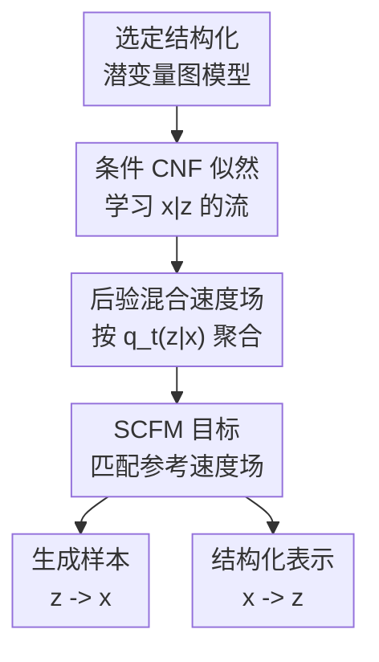

# Structured Flow Autoencoders: Learning Structured Probabilistic Representations with Flow Matching

**会议**: ICLR 2026  
**OpenReview**: [https://openreview.net/forum?id=KYdfvF2SZN](https://openreview.net/forum?id=KYdfvF2SZN)  
**代码**: https://github.com/edenx/StructuredFlowAutoencoder  
**领域**: 生成模型 / 结构化表示学习  
**关键词**: 结构化流自编码器、Flow Matching、连续归一化流、概率图模型、潜变量表示

## 一句话总结
这篇论文提出 Structured Flow Autoencoders，把概率图模型中的结构化潜变量接入条件连续归一化流，并用 Structured Conditional Flow Matching 同时学习高保真生成分布和可解释的后验表示，在图像、RNA-seq 和序列视频数据上比 VAE / SVAE 更好地兼顾生成质量、样本多样性与潜空间结构。

## 研究背景与动机
**领域现状**：近年的生成模型里，扩散模型、flow matching 和连续归一化流已经很擅长做高维密度估计和高质量采样。它们可以把简单基分布沿着一条概率路径输送到数据分布，在图像、序列和科学数据上都表现很强。与此同时，另一条经典路线是 VAE、SVAE 这类概率潜变量模型：它们不只生成样本，还显式学习 $z$ 这样的低维潜变量，让后验 $p(z|x)$ 能服务于聚类、解释、条件生成和科学分析。

**现有痛点**：两条路线各有短板。Flow matching 这类神经密度估计器通常直接拟合边缘分布 $p(x)$，样本质量好，但训练目标里没有显式的结构化潜变量，因此生成之后很难得到一个可解释、可操作的表示。VAE / SVAE 则相反：它们有清晰的概率图结构和后验推断，但常被简单的高斯解码器、ELBO 中的重建与 KL trade-off、posterior collapse 等问题限制，生成质量通常落后于现代 flow / diffusion 方法。

**核心矛盾**：真正难的地方在于，不能只把 flow 当成 VAE 的解码器粗暴塞进去。若用 CNF 直接参数化 VAE 的 likelihood，每步训练都要做似然计算和 ODE 反传，代价高且不稳定；若先用 autoencoder 压到潜空间，再在潜空间里训练 flow，又容易把概率后验简化成一个确定性编码，丢掉结构化不确定性。也就是说，高保真边缘建模 $p(x)$ 和结构化后验 $p(z|x)$ 之间缺一套统一、稳定的训练原则。

**本文目标**：作者希望构造一个模型族，既保留概率图模型里可设计的潜变量结构，例如连续潜变量、有限混合类别和时间动态系统，又把观测似然 $p(x|z)$ 换成表达力更强的条件 CNF。训练上，目标不是最大化传统 ELBO，而是让带潜变量分解后的条件速度场在边缘上与 flow matching 的参考速度场一致。

**切入角度**：论文的关键观察来自贝叶斯公式和连续性方程：如果每个潜变量 $z$ 对应一个条件速度场 $v_t(x|z)$，那么把它按时间 $t$ 上的后验 $p_t(z|x)$ 做期望，就得到边缘速度场 $v_t(x)=E_{p_t(z|x)}[v_t(x|z)]$。这说明边缘 flow matching 并不一定只能学一个无结构的 $v_t(x)$，它可以被解释成许多结构化条件 flow 的后验混合。

**核心 idea**：用“后验加权的条件速度场”替代普通 flow matching 的单一边缘速度场，从而把 CNF 的高保真生成能力和概率图模型的结构化潜变量学习合在一个 Structured Conditional Flow Matching 目标里。

## 方法详解

### 整体框架
SFA 的整体思路是：先指定一个潜变量图模型，决定 $z$ 的结构以及后验应该长什么样；再用条件 CNF 表示 $p_1(x|z)$，让不同潜变量对应不同的观测空间概率流；最后通过 SCFM 训练目标，让这些条件速度场经近似后验 $q_t(z_t|x_t)$ 混合后，匹配从噪声到真实数据的参考 flow matching 速度场。训练完成后，同一个模型既能从先验或经验潜分布采样生成 $x$，也能对给定样本输出结构化后验表示 $q_1(z|x)$。

这张图里真正的贡献节点是“条件 CNF 似然”“后验混合速度场”和“SCFM 目标”。潜变量图模型是输入建模假设，生成样本和结构化表示是训练后的两种用法；关键设计会围绕这三个贡献节点展开。

### 关键设计
**1. 条件 CNF 似然：让概率图模型拥有现代 flow 的表达力**

传统 VAE 的一个瓶颈是 $p(x|z)$ 往往被设成简单分布，例如对角高斯或独立像素似然；这在高维图像、RNA-seq 表达矩阵和视频帧上太弱，导致潜变量即使有结构，也很难支撑高质量生成。SFA 把这个 likelihood 换成条件连续归一化流：给定潜变量 $z$，观测 $x$ 沿 ODE 演化，条件速度场写作 $v_t(x|z;\theta)$，生成过程可理解为

$$
\frac{d}{dt}\phi_t(x)=v_t(\phi_t(x)|z;\theta),\quad \phi_0(x)=x_0,\quad x_0\sim p_0(x).
$$

这样做的好处是，潜变量不再只是喂给一个弱解码器的低维 code，而是直接调制整条从基分布到观测分布的概率路径。对于 MNIST，不同 $z$ 可以对应不同数字形状和笔画风格；对于 RNA-seq，低维 $z$ 可以捕捉细胞类型相关的表达结构；对于 pendulum 视频，$z_s$ 可以对应角度、角速度这类动态状态。相比把 flow 放在 autoencoder 的确定性潜空间里，SFA 仍然保留 $q(z|x)$ 的随机性和概率解释。

**2. 后验混合速度场：把边缘 flow 拆成有结构的条件 flow**

论文最核心的理论点是 Theorem 3.1。若每个 $z$ 下的条件速度场 $v_t(x|z)$ 生成条件路径 $p_t(x|z)$，那么边缘路径 $p_t(x)=\int p_t(x|z)p(z)dz$ 的速度场可以写成

$$
v_t(x)=\int v_t(x|z)p_t(z|x)dz=E_{p_t(z|x)}[v_t(x|z)].
$$

这件事把“结构化表示学习”嵌进了 flow matching 的数学核心：模型不必先学一个无结构的 $p(x)$ 再事后解释，而是在训练速度场时就要求边缘运动来自潜变量条件运动的后验平均。直观地说，普通 flow matching 是一股整体水流把噪声推到数据；SFA 则把这股水流拆成若干由潜变量控制的支流，再用后验权重把它们合回来。只要后验混合后的速度场与目标边缘速度场一致，模型就能同时保持好的边缘密度和有意义的潜变量分解。

这里的后验不是必须精确可解。SFA 使用近似族 $Q=\{q_t(z|x)\}$，可以是时间和观测相关的高斯族，也可以是条件 CNF。经验上，作者发现低维潜变量场景里高斯近似通常已经足够，而且更稳定；把后验也做成 CNF 虽然表达力强，但训练时要反复求解 ODE，运行时间会明显增加。

**3. SCFM 目标：不算似然也能联合学习 likelihood 与 posterior**

有了后验混合速度场后，SFA 的训练目标就是 Structured Conditional Flow Matching。给定真实样本 $x_1$、参考概率路径上的中间点 $x_t$、参考速度场 $u_t(x_t|x_1)$，SCFM 最小化

$$
R(\theta,q)=E_{x_1,x_t,t}\left\|E_{q_t(z_t|x_t)}[v_t(x_t|z_t;\theta)]-u_t(x_t|x_1)\right\|^2.
$$

这个目标的含义很直接：不要求每个条件流单独等于参考速度，而要求“经后验混合之后”的条件流整体等于参考速度。于是训练会同时推动两件事发生：$v_t(x|z)$ 学会如何在给定潜变量时生成观测，$q_t(z|x)$ 学会如何把观测分配到合适的潜结构上。和 VAE 的 ELBO 不同，SCFM 没有一个显式 KL 项把后验往先验拉回去，因此从目标形式上少了 posterior collapse 的直接压力。

计算上，这也绕开了 CNF likelihood 训练中最麻烦的部分。传统最大似然 CNF 需要在训练中计算瞬时 change-of-variable 里的散度和 log likelihood；SFA 的 flow matching 目标只匹配速度场，不需要每步评估精确似然。因此它能把 CNF 接到图模型上，同时保持和 VAE 近似的训练开销。论文报告在 MNIST 上，参数化高斯后验的 SFA 每个 epoch 约 $13.220\pm1.848$ 秒，接近 VAE 的 $12.789\pm2.011$ 秒；但 CNF posterior 版本会升到 $167.460\pm176.817$ 秒，说明后验族选择是实际使用中的关键。

**4. 图模型实例化：同一个目标覆盖连续、混合和动态潜变量**

SFA 不是只为一个 toy latent 设计的模型，而是一个把概率图模型接到 flow matching 的配方。连续潜变量模型最简单：$z\sim p(z)$，$x|z\sim p(x|z)$，训练时用 $q_t(z|x)$ 近似后验，并用一个样本 $\tilde z\sim q_t(z|x)$ 估计内层期望。这个版本适合 MNIST 的低维表示、RNA-seq 的细胞类型结构等场景。

有限混合模型进一步引入离散类别 $\xi\in[K]$ 和连续 $z$。此时 SCFM 的内层期望要同时对 $q_t(\xi|x)$ 和 $q_t(z|x,\xi)$ 积分，目标变成 $E_{q_t(\xi|x)q_t(z|x,\xi)}[v_t(x|z)]$ 与参考速度匹配。作者用 Gumbel-Softmax 近似类别后验，让模型在无监督情况下学出类似聚类分配的概率表示。动态系统版本则把潜变量扩成轨迹 $z^{[S]}$，每个时间步 $x^s$ 条件依赖于对应 $z^s$，后验按历史和完整观测序列自回归分解；训练目标里对时间步 $s$ 求和，适合 pendulum 这类低维物理状态驱动的视频。

### 一个完整示例
以 MNIST 的混合潜变量版本为例，一张手写数字图片 $x_1$ 不会被编码成一个确定向量后就结束。训练时先在参考 flow path 上取一个中间状态 $x_t=(1-t)x_0+tx_1$，类别网络给出 $q_t(\xi|x_t)$，例如对 10 个数字类的概率分布；再在选定类别条件下采样连续潜变量 $z_t\sim q_t(z|x_t,\xi)$，表示该数字的笔画粗细、倾斜程度或形状变化。条件 CNF 根据这个 $z_t$ 输出速度 $v_t(x_t|z_t)$，多个类别和连续潜变量的贡献经后验平均后，与参考速度 $u_t(x_t|x_1)$ 做平方误差。

训练结束后，若要做表示学习，给定测试图片 $x$，模型输出 $q_1(\xi|x)$ 和 $q_1(z|x,\xi)$，前者可用于无监督聚类，后者可用于低维可视化。若要生成，则先从类别比例和潜变量分布采样 $\xi,z$，再通过条件 CNF 从基噪声生成图片。论文 Figure 4 显示，Mixture-SFA 的类别概率和连续潜空间比 Mixture-SVAE 更清晰地分开数字簇，同时后验预测样本也更像真实手写数字。

### 损失函数 / 训练策略
SFA 训练的核心损失就是 SCFM 的速度场匹配损失。实践中，作者通常采用线性插值路径作为参考路径，即从基噪声 $x_0$ 到真实样本 $x_1$ 构造 $x_t$，并用 flow matching 的参考速度 $u_t(x_t|x_1)$ 作为监督信号。内层后验期望可用 Monte Carlo 估计；连续潜变量场景中，一个重参数化样本往往就能工作，和 VAE 训练里的 reparameterization trick 类似。

不同结构对应不同后验族。连续潜变量通常用随 $t,x$ 变化的高斯近似；混合模型用 Gumbel-Softmax 表示离散类别，再接类别条件高斯；动态系统用序列编码器处理完整观测序列，用 GRU 累积过去潜变量历史，并通过 cross-attention 选择对当前 $z^s$ 最有用的帧信息。似然端的条件 CNF 则用 MLP 或带 FiLM 调制的 MLP 参数化速度场。论文的实验都在 MacBook Pro M2 Pro 上完成，强调该方法在中等硬件上也能训练，而不是依赖大规模集群。

## 实验关键数据

### 主实验
论文覆盖四类任务：Pinwheel 条件密度估计、MNIST 图像建模与聚类、单细胞 RNA-seq 表达建模、Pendulum 视频动态系统。下面的表格摘取最能说明 SFA 与 VAE / SVAE / LatentFM 差异的结果。

| 数据集 / 任务 | 指标 | 本文方法 | 主要对比 | 提升或结论 |
|--------|------|------|----------|------|
| Pinwheel 密度估计 | $\hat W_1\downarrow$ | SFA 0.024 | FM 0.025 / VAE 0.119 / Mixture-SVAE 0.457 | SFA 达到与普通 FM 接近的边缘密度质量，同时保留潜变量结构 |
| Pinwheel 混合建模 | $\hat W_1\downarrow$ | Mixture-SFA 0.046 | Mixture-SVAE 0.457 | 混合结构下，SFA 明显优于 SVAE 版本 |
| MNIST 连续潜变量 | NMI(OOD)$\uparrow$ | SFA 0.490 | LatentFM 0.488 / VAE 0.039 | 聚类质量接近 LatentFM，远高于 VAE |
| MNIST 连续潜变量 | Vendi$\uparrow$ / SSIM$\uparrow$ | SFA 25.589 / 0.716 | LatentFM 8.380 / 0.980 | SFA 牺牲部分重建锐度，换来更高样本多样性 |
| RNA-seq HVG | Vendi(x)$\uparrow$ / NMI$\uparrow$ | SFA 737.7 / 0.633 | LatentFM 5.801 / 0.617 / VAE 26.58 / 0.412 | SFA 在高维基因表达上同时保持多样性和细胞类型聚类 |
| Pendulum 视频 | RMSEz$\downarrow$ | LDS-SFA 1.526 | GLD-SVAE 8.090 | 对潜在物理状态的恢复误差降低超过 5 倍 |

### 消融实验
| 配置 | 关键指标 | 说明 |
|------|---------|------|
| SFA, 高斯后验 | MNIST $\log p(z|x)=793.262$，Vendi 25.589，SSIM 0.716 | 默认选择，后验表达力够用且训练稳定 |
| SFA, deterministic latent | MNIST Vendi 10.189，SSIM 0.732，NMI(OOD) 0.501 | 重建略好、聚类不差，但样本多样性明显低于随机后验 SFA |
| SFA, CNF posterior | MNIST $\log p(z|x)=356.141$，Vendi 23.166，SSIM 0.654 | 表达力更强但训练代价高，实验中未带来稳定收益 |
| Mixture-SFA vs Mixture-SVAE | MNIST SSIM 0.779 vs 0.634，NMI 0.489 vs 0.161，ARI 0.332 vs 0.072 | 同样的混合潜结构下，换成 SCFM + 条件 CNF 后表示和生成都更强 |
| LDS-SFA vs GLD-SVAE | Pendulum RMSEx 3.233 vs 4.574，RMSEz 1.526 vs 8.090 | 动态潜变量上，SFA 更好恢复观测轨迹和潜在状态 |

### 关键发现
- SFA 并不是简单“生成质量更好”。在 Pinwheel 上，它的边缘密度估计几乎追平普通 FM，但颜色编码的后验表示能恢复角向结构；这说明结构化潜变量没有破坏 flow 的密度建模能力。
- 在 MNIST 上，LatentFM 的 SSIM 最高但 Vendi 很低，说明它更偏向重建和低多样性；SFA 的 Vendi 明显更高，同时 OOD 聚类 NMI 与 LatentFM 接近，体现了随机潜变量后验的价值。
- RNA-seq 结果是论文很重要的应用信号：5000 维高变基因数据上，SFA 不需要直接求 CNF log likelihood，仍能学到与细胞类型相关的低维结构，并在 Vendi 上大幅超过 LatentFM 和 VAE。
- 后验族越复杂不一定越好。CNF posterior 在理论上更灵活，但实际会引入每个梯度步的 ODE 采样，训练时间和方差都变大；低维潜变量场景下，高斯后验反而是更稳健的工程选择。

## 亮点与洞察
- **把 flow matching 的边缘速度场重新解释成后验混合**：这不是一个表面组合，而是用连续性方程证明 $E_{p_t(z|x)}[v_t(x|z)]$ 正是边缘路径的速度场。这个视角让“结构化潜变量”和“高保真生成”不再是两个独立模块，而是同一个训练目标的两面。
- **避开 VAE-CNF 的昂贵似然训练**：论文没有把 CNF 强行放进 ELBO 里算 likelihood，而是用速度场匹配训练条件 CNF。这个选择很关键，因为它让复杂 likelihood 可以进入概率图模型，同时不把训练成本推到不可用。
- **结构适配范围宽**：连续、混合、动态三种实例覆盖了不同依赖类型。尤其是动态系统版本说明，SFA 不只是图像生成技巧，也能作为“给任意图模型换上 flow likelihood”的方法论。
- **科学数据场景很有说服力**：单细胞 RNA-seq 是高维、结构强、解释需求高的场景。SFA 在这里比纯图像结果更能体现方法价值，因为生物数据分析真正需要的是可用的低维后验表示，而不仅是漂亮样本。
- **对生成模型表示学习有启发**：许多 diffusion / flow 表示学习方法依赖事后 probing 或 latent autoencoder。SFA 提醒我们，可以把表示结构直接写进概率路径和速度场，而不是等大模型训练完再解释它。

## 局限与展望
- SFA 的扩展性仍受架构影响。论文方法层面解决了训练目标和图模型组合问题，但在更复杂的自然图像数据上，如何设计不会绕过随机潜变量的强 decoder 仍是开放问题。作者也指出，skip connection 或过强网络可能让模型忽略同时学习的 stochastic latent。
- 后验族选择缺少系统原则。实验显示高斯后验通常够用，CNF posterior 太贵，但什么时候需要更复杂的后验、如何在表达力和稳定性之间选择，目前还主要依赖经验。
- 实验规模偏方法验证。MNIST、Pinwheel、Pendulum 和 RNA-seq 足以说明框架灵活性，但还没有在 ImageNet 级图像、长视频或大规模多组学数据上展示边界。若要成为通用生成模型框架，还需要更强 backbone 和更大规模评估。
- 潜变量可解释性仍是经验性的。论文展示了聚类、t-SNE、RMSE 等证据，但结构化潜变量是否可识别、是否能稳定支持干预式生成，还需要更强的理论或受控实验。
- 未来可以把 SFA 接到更丰富的图结构上，例如层级潜变量、因果图、可组合对象表示或物理状态空间模型。若 SCFM 能在这些结构里稳定训练，它会成为科学机器学习里很自然的生成建模工具。

## 相关工作与启发
- **vs VAE / $\beta$-VAE**: VAE 通过 ELBO 同时学习 encoder 和 decoder，但 likelihood 往往较弱，KL 项还会制造重建与后验结构之间的 trade-off。SFA 不用 ELBO，而是让后验混合条件速度场匹配边缘参考速度场，因此更适合接入高表达力 CNF。
- **vs SVAE / Mixture-SVAE / GLD-SVAE**: SVAE 的优势是能把图模型结构放进推断网络，但解码分布通常仍受参数族限制。SFA 保留这些结构，例如混合类别和线性动态状态，同时把观测似然换成条件 flow，所以在 MNIST 混合聚类和 pendulum 动态恢复上都明显优于对应 SVAE。
- **vs Latent Flow Matching**: LatentFM 先用 autoencoder 得到潜空间，再在潜空间学 flow，重建质量可以很高，但它的潜表示更偏确定性，样本多样性和概率后验解释较弱。SFA 直接学习 $q(z|x)$ 和 $p(x|z)$，因此在 Vendi 和结构化聚类上更平衡。
- **vs diffusion autoencoder / representation learning diffusion**: 这类方法也试图让生成模型产生有意义表示，但常依赖特定 encoder-decoder 架构或信息最大化目标。SFA 的启发是把“表示”看成概率路径中的潜变量条件结构，可以更自然地迁移到不同图模型。
- **对后续研究的启发**: 如果一个领域已经有明确的结构假设，例如细胞状态转移、物体属性层级、机器人动力学或患者疾病进程，可以考虑先写出对应概率图，再用 SCFM 为每个条件 likelihood 配上 flow。这样比从零设计黑盒生成模型更容易把领域知识和高表达密度估计结合起来。

## 评分
- 新颖性: ⭐⭐⭐⭐⭐ 论文把 flow matching 的速度场匹配与概率图模型后验混合用一个清晰定理连起来，不是常规的 VAE 加 flow 拼装。
- 实验充分度: ⭐⭐⭐⭐☆ 覆盖 synthetic、图像、单细胞和视频动态系统，能证明框架广度；但缺少更大规模自然图像或真实长序列实验。
- 写作质量: ⭐⭐⭐⭐☆ 主线清楚，理论、目标和实例化结构衔接自然；部分实验细节分散在 appendix，读者需要来回对照。
- 价值: ⭐⭐⭐⭐⭐ 对需要“生成 + 表示 + 结构解释”的科学建模和可控生成方向很有价值，尤其适合作为把领域图模型升级到现代 flow likelihood 的通用配方。

<!-- RELATED:START -->

## 相关论文

- [\[ICLR 2026\] Delay Flow Matching](delay_flow_matching.md)
- [\[ICLR 2026\] Flow Matching with Injected Noise for Offline-to-Online Reinforcement Learning](flow_matching_with_injected_noise_for_offline-to-online_reinforcement_learning.md)
- [\[ICLR 2026\] Source-Guided Flow Matching](source-guided_flow_matching.md)
- [\[ICLR 2026\] Flow Matching with Semidiscrete Couplings](flow_matching_with_semidiscrete_couplings.md)
- [\[ICLR 2026\] Carré du champ Flow Matching: 用几何感知噪声改善生成模型的质量-泛化权衡](carré_du_champ_flow_matching_better_quality-generalisation_tradeoff_in_generativ.md)

<!-- RELATED:END -->
