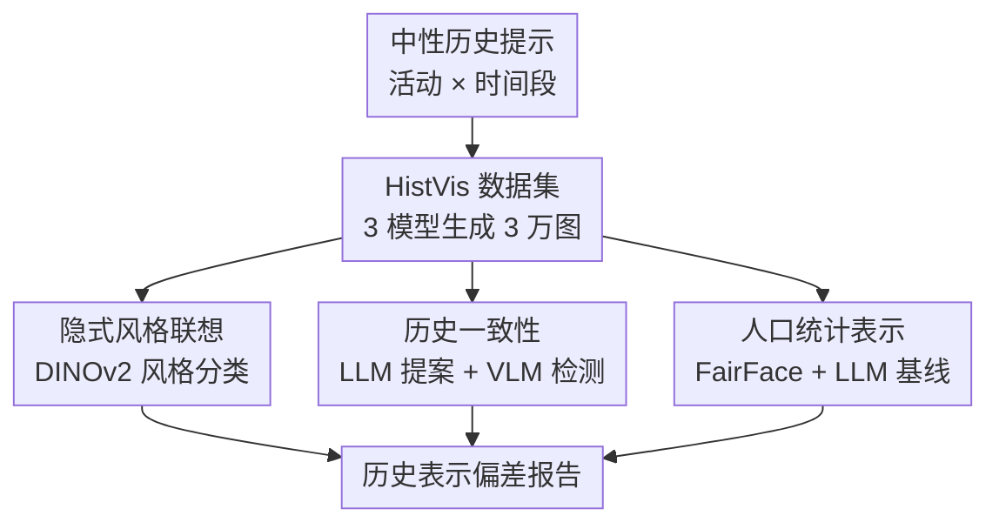

# Synthetic History: Evaluating Visual Representations of the Past in Diffusion Models

**会议**: ICLR 2026  
**OpenReview**: [https://openreview.net/forum?id=Ix0vw6Mdzs](https://openreview.net/forum?id=Ix0vw6Mdzs)  
**代码**: 有（论文称公开评测脚本，缓存未保留具体 GitHub URL）  
**领域**: 扩散模型评测 / 数据集与基准  
**关键词**: 历史表示, 文生图评测, 风格偏差, 时代错置, 人口统计偏差  

## 一句话总结
这篇论文提出 HistVis 历史视觉基准，用 3 个开源文生图扩散模型生成 3 万张跨时代活动图像，并从隐式风格联想、历史一致性和人口统计表示三个维度系统揭示模型如何把“过去”画成刻板、错位且人口分布失真的合成历史。

## 研究背景与动机
**领域现状**：文生图扩散模型已经从研究原型变成内容生产工具，教育、媒体、艺术和文化传播中都可能直接使用这些生成图像。围绕 TTI 模型的评测也越来越多，已有工作重点关注职业、性别、种族、地理与文化对象上的偏差，说明模型并不是中性的视觉生成器，而会把训练数据中的社会分布和视觉惯例一并带出来。

**现有痛点**：相比“现在的人和物是否被公平描绘”，模型如何描绘历史语境还缺少系统评测。历史图像的错误不只是画错物体这么简单：一张“18 世纪听音乐的人”如果出现耳机，显然是时代错置；但即使没有具体物体错误，如果模型默认把 17 世纪画成版画、把 1910 年代画成黑白照片，也会把某种媒介记录方式误当成历史本身。这类错误会影响公众对过去的视觉想象，尤其在教育和文化遗产场景中风险更高。

**核心矛盾**：历史表示同时牵涉三个不容易同时处理的层面：第一，视觉风格不应被时代标签过度锁死；第二，物体、环境和行为要符合时间条件；第三，人物的性别和族裔表示既不能无视历史语境，也不能把历史中的排斥结构简单当作“正确答案”。现有 benchmark 多数关注地标、历史人物识别或历史照片描述，无法回答“生成模型在没有显式提示时，会如何想象某个时代”。

**本文目标**：作者希望建立一个可复现、可扩展的评测框架，让研究者能在同一批历史活动提示上比较不同 TTI 模型。具体要回答三类问题：模型是否给不同年代绑定固定视觉风格；模型是否在前现代场景中引入现代物件；模型生成的人口统计分布是否与粗粒度历史合理性基线存在系统偏离。

**切入角度**：论文不选择“拿破仑”“古罗马战役”这类强历史知识提示，而是选择“做饭、听音乐、学习、旅行”等跨时代通用活动。这样设计的好处是，prompt 只改变时间条件，活动本身保持一致，模型输出的变化更能反映其内部历史表示，而不是提示词里直接写入的事件、名人或物件。

**核心 idea**：用中性的“人 + 活动 + 时间段”提示构造大规模合成历史图像，再用风格分类器、LLM/VLM 时代错置检测和人口统计偏差度量，把文生图模型对“过去”的隐式想象拆成可测量的三条轴线。

## 方法详解
### 整体框架
这篇论文的方法不是训练一个新生成模型，而是搭建一个历史表示评测基准。整体流程先设计 HistVis 提示集合，用 SDXL、SD3 和 FLUX.1 Schnell 为每个活动-时期组合生成多张图像；随后分别运行三套评测管线，测量风格是否被时代标签支配、图像中是否出现时代错置物、以及人物性别/族裔分布是否偏离 LLM 估计的历史合理基线。

HistVis 的提示模板固定为 “A person [activity] in the [time period]”。活动集合包含 100 个活动，分成音乐、艺术、交流、家庭、交通、城市生活、烹饪、日常家务、宗教、农业、教育、商业等 20 个类别；时间集合包含 17-21 世纪五个世纪，以及 1910s、1930s、1950s、1970s、1990s 五个 20 世纪年代。每个 TTI 模型对每个活动-时间组合生成 10 张图，因此 100 个活动 × 10 个时间段 × 10 张 × 3 个模型，得到 30,000 张图像。

三个被测生成模型都是开源扩散系文生图模型：Stable Diffusion XL、Stable Diffusion 3 和 FLUX.1 Schnell。这个选择让论文既能比较不同架构，也能观察同一模型家族迭代后的历史表示变化。评测框架本身并不绑定这三个模型，后续可以把任意新 TTI 模型接入相同 prompt 和检测流程。

### 关键设计
**1. HistVis 中性活动提示：把历史表示从显式历史事实中剥离出来**

如果直接提示“二战士兵”“维多利亚女王”“古埃及金字塔”，模型输出会混合事件知识、对象知识和历史常识，评测结果很难说明到底是哪一层出错。HistVis 反过来选择“一个人在学习”“一个人在做饭”“一个人在赶路”这样的通用活动，只在末尾改变时间段。这样一来，同一活动在 17 世纪、19 世纪和 1990 年代的输出差异主要来自模型对时代条件的解释。

这个设计也让数据集天然支持横向比较：同一个活动可以跨 10 个时期看变化，同一个时期可以跨 100 个活动看模型是否有稳定风格偏好。论文承认这会牺牲具体历史事件的细节，但作为第一步 benchmark，它更适合捕捉模型默认想象中的“历史视觉先验”。

**2. 隐式风格联想评测：用 VSD 衡量模型把时代绑定到哪种媒介风格**

作者先从 WikiArt 构建一个风格分类数据集，包含 drawing、engraving、illustration、painting、photography 五类；由于摄影类没有区分黑白与彩色，论文再用 Hasler-Suesstrunk colorfulness 指标把低色彩度照片标成 monochrome。然后比较 VGG-16、ResNet-50、Swin、BEiT、MAE、DINOv2 和零样本 CLIP 等视觉编码器，最终选择验证集表现最好的 DINOv2 ViT-B/14 作为风格预测器。

核心指标是 Visual Style Dominance（VSD）：对模型 $m$ 和时期 $t$，统计所有生成图像中各风格比例，取最大值作为该时期的风格支配度：$VSD(m,t)=\max_s P_m(s\mid t)$。如果 VSD 很高，说明模型几乎把这个时期固定画成某一种视觉媒介；如果 VSD 较低，则说明风格更多样。论文还用 bootstrap 估计 95% 置信区间，并比较第一、第二高风格的区间是否重叠，以避免把分类器不确定性误读成稳定偏差。

**3. 两阶段时代错置检测：先让 LLM 想“可能错什么”，再让 VLM 看“图里有没有”**

时代错置的难点在于它是开放集合问题，不能预先列一个固定物体表，因为不同活动和时期会对应不同的错误。例如“听音乐”在 18 世纪容易出现耳机或智能手机，“熨衣服”可能出现现代电熨斗，“导航”可能出现 GPS 或手机地图。论文因此让 LLM 根据活动-时期 prompt 先生成候选错置元素 $Z_{a,t}$，并为每个元素生成一个 yes/no 视觉问答问题。

第二步把这些问题交给三个 VLM：GPT-4o、LLaMA-3.2-11B 和 Qwen2.5-VL-7B，让它们分别判断图像中是否存在该元素，最终用多数投票得到检测结果。作者还用 fuzzy matching 合并 “audio device”“digital audio device” 这类表面命名差异，避免重复计数。最后计算两个指标：Frequency 表示某元素在某模型某时期所有图像中出现的比例，Severity 表示当 LLM 提出该元素时，它实际被检测到的稳定程度，即 $Severity(z_i)=n^{detected}_{z_i}/n^{proposed}_{z_i}$。

**4. 人口统计表示评测：用生成图像分布和 LLM 历史合理基线比较偏离**

对于人物表示，论文先用 FairFace 从生成图像中提取性别和族裔属性，只保留性别和族裔置信度都超过 0.7 的预测，并对多脸图像做归一化后再聚合。为了检查分类器可靠性，作者在 5,000 张样本上用 DeepFace 交叉验证，性别一致率 95.9%、族裔一致率 90.8%，说明自动提取虽有社会分类简化问题，但在聚合分析上相对稳定。

历史合理基线来自 LLM 估计：对每个活动-时期组合，提示 GPT-4o 给出性别和族裔分布百分比。作者没有把它当作“历史真值”，而是把它定位成粗粒度参考点，用来发现极端过度或不足表示。偏离度分成 underrepresentation 和 overrepresentation 两个方向：当生成比例 $P^{model}_d$ 小于 LLM 估计 $\hat P^{llm}_d$ 时，$Under_d=\hat P^{llm}_d-P^{model}_d$；反之则 $Over_d=P^{model}_d-\hat P^{llm}_d$。这种拆分比单个距离指标更容易看出模型到底少画了谁、多画了谁。

### 一个完整示例
以提示 “A person listening to music in the 18th century” 为例，HistVis 会让 SDXL、SD3 和 FLUX.1 各生成 10 张图。风格评测会把这些图送入 DINOv2 风格分类器，观察模型是否默认输出 engraving、painting 或 monochrome，而不是中性地依据 prompt 生成多样视觉风格。

时代错置评测中，LLM 可能为这个 prompt 提出 “audio devices” 作为候选错置，并生成问题：“Is the person using audio devices, such as headphones or smartphones? Answer with yes or no.” 三个 VLM 再查看生成图像，如果多数模型回答 yes，那么这张图就被标记为包含该错置。若某模型在很多“听音乐”的历史时期提示中都生成耳机，Frequency 可能不高但 Severity 会很高，说明模型强烈依赖“听音乐 = 现代音频设备”的概念关联，而没有充分遵守时间条件。

人口统计评测则会检测图中人物的性别和族裔分布，并和 GPT-4o 对“18 世纪听音乐”这一活动-时期组合的估计比较。如果模型总是生成白人男性或总是生成某种现代化音乐场景，偏离会在对应类别的 over/under 指标中体现出来。这个例子也说明论文的三条评测轴并不是孤立的：同一张图可能同时暴露风格刻板、物体时代错置和人物表示偏差。

## 实验关键数据

### 主实验
论文的主结果可以分成三类：风格支配度、时代错置率和人口统计偏差。风格结果显示，不同模型对历史时期存在非常稳定的媒介联想；时代错置结果显示 SD3 最容易生成现代物件，SDXL 在这一维度上相对更稳；人口统计分析则显示模型常常按活动或训练数据相关性生成性别/族裔，而不是跟随历史时期条件。

| 评测维度 | 主要对象 | 代表结果 | 说明 |
|--------|---------|---------|------|
| 隐式风格联想 | SDXL / SD3 / FLUX.1 | SDXL 在 17 世纪 VSD=0.93，主导风格为 engraving；SD3 与 FLUX.1 在 17 世纪分别以 painting 为主，VSD=0.86/0.88 | 历史时期被强绑定到某类视觉媒介 |
| 20 世纪风格 | 三个模型 | 1910s-1950s 多数模型出现 monochrome dominance；FLUX.1 和 SD3 在现代时期转向 photography | 模型把历史影像资料的媒介特征当成时代特征 |
| 时代错置 | SD3 / FLUX.1 / SDXL | SD3 在 19 世纪约 20% 图像、1930s 约 25% 图像被标记含至少一个错置；SDXL 多数时期低于 5% | SD3 更常把现代物件带入历史场景 |
| 人口统计表示 | 三模型生成图像 vs GPT-4o 基线 | FLUX.1 在 cooking & dining 等类别中持续过度生成男性；白人总体过度表示但到 21 世纪有所减弱 | 模型输出常反映活动相关刻板印象和训练分布 |

风格分类器本身也做了系统比较。DINOv2 的验证集准确率和宏平均 F1 都高于零样本 CLIP，并在多个风格类别上更均衡，因此被选作下游分析的默认编码器。

| 风格分类骨干 | Accuracy | Macro F1 | 关键观察 |
|-------------|----------|----------|----------|
| CLIP ViT-B/32 zero-shot | 0.734 | 0.658 | painting 和 photography 尚可，但 drawing / illustration 区分弱 |
| ResNet-50 | 0.879 | 0.852 | 传统 CNN 已有较强风格识别能力 |
| Swin-B | 0.896 | 0.868 | 总体准确率与 DINOv2 相当 |
| DINOv2 ViT-B/14 | 0.896 | 0.876 | 宏平均 F1 最高，被用于 HistVis 风格评测 |

### 消融实验
这篇论文没有传统模型训练消融，而是对评测流程的若干关键选择做了鲁棒性和替代方案分析，包括 prompt mitigation、LLM/VLM backbone 对比、人类标注验证和人口统计估计器替代。

| 配置 / 分析 | 关键指标 | 说明 |
|------------|---------|------|
| SDXL 原始提示 vs photorealistic + negative prompt | 17/18/19 世纪仍以 engraving 为主；部分年代从 monochrome 转向 painting/illustration | prompt engineering 只能局部改变风格，难以覆盖深层历史风格先验 |
| VLM 单模型 vs 三模型多数投票 | 人类一致率：GPT-4o 72%，LLaMA-3.2 68%，Qwen2.5 63%，多数投票 75% | 多 VLM ensemble 能减少单模型误判 |
| 人类时代错置标注 | Fleiss' κ = 0.63；保留 2,040 个高质量标注 | 人类对复杂历史错置有 substantial agreement，验证自动流程有意义 |
| GPT-4o vs LLaMA-3.2 人口统计估计 | OWID 三类任务上 MAE：GPT-4o 4.64，LLaMA-3.2 4.83 | 开源 LLM 可作为接近的替代基线 |

### 关键发现
- 风格偏差并非随机噪声，而是模型对历史时期的稳定视觉联想：SDXL 强烈把早期世纪画成版画，SD3/FLUX.1 更常画成绘画，20 世纪前半段又被黑白摄影统治。
- prompt engineering 对风格偏差的缓解有限。即使显式要求 photorealistic 并用 negative prompt 排除黑白图，SDXL 也常只是从 monochrome 转向 painting/illustration，而不是变成真正的彩色摄影风格。
- 时代错置往往来自活动概念压过时间条件。例如“听音乐”触发耳机，“沟通设备”触发手机，“熨衣服”触发现代电熨斗，说明模型对动词和现代共现物的依赖强于历史约束。
- SDXL 在时代错置频率上相对较低，但这不代表整体历史表示最好；它仍有很强的风格刻板化问题，尤其是早期世纪的 engraving dominance。
- 人口统计偏差的解释最复杂。论文没有把 LLM 基线当作标准答案，而是用它发现极端偏离，并强调历史真实性、多样性和伦理呈现之间本身存在张力。

## 亮点与洞察
- 论文最重要的贡献是把“历史表示”从一个抽象文化批评问题变成了可重复运行的 benchmark。它没有停留在个别失败案例，而是给出 prompt 集、生成数据、风格指标、错置检测和人口统计偏差度量。
- HistVis 的中性活动设计很巧妙。它避免直接让 prompt 写入具体历史知识，使模型输出更像是在暴露自身内部的历史视觉先验；这比只测名人、地标或事件识别更适合研究生成模型如何“想象过去”。
- VSD 是一个简单但有解释力的指标。它不需要判断某个风格是否“历史正确”，只量化模型是否把某个时代过度收缩到一种媒介风格，从而揭示训练数据中视觉记录方式和历史概念之间的混淆。
- 两阶段时代错置检测适合迁移到其他开放集合偏差评测。先由 LLM 根据语境生成可能错误，再由 VLM 对图像做 yes/no 验证，比人工列固定类别更灵活，也比纯人工审查更可扩展。
- 论文对人口统计基线的态度比较克制。它明确说 LLM 估计只是一个评测轴，而不是“应当如何画历史”的规范答案，这一点避免了把历史中的不平等结构简单编码成生成目标。

## 局限与展望
- HistVis 只覆盖 100 个通用活动和 10 个时间段，不能代表所有历史文化语境。对区域、阶层、殖民历史、非西方视觉传统等更细粒度问题，当前 prompt 还远远不够。
- 风格分类类别较粗。drawing、engraving、illustration、painting、photography/monochrome 能抓住大趋势，但无法区分更细的艺术流派、摄影工艺、地域性图像传统或时代内部风格差异。
- 时代错置检测依赖 LLM 生成候选清单，因此只能发现 LLM 想到的显著错置。更隐蔽的建筑结构、服饰细节、工具材料或礼仪行为错误，可能不会进入候选集合。
- 人口统计评测使用 FairFace 的离散种族/性别分类，会简化甚至重塑复杂身份类别；LLM 历史基线也继承语言模型本身的偏差，不能代替历史学专家或真实档案数据。
- 论文主要评估开源 TTI 模型，并未覆盖闭源商业模型或视频生成模型。未来可以把同一框架扩展到更强模型、多语言 prompt、历史事件 prompt 和教育场景真实用户任务。
- 更进一步的方向不是简单把模型调成“历史上更真实”，而是让模型能显式处理历史真实性、文化敏感性和表示多样性之间的权衡，例如在生成时解释为何选择某种视觉呈现。

## 相关工作与启发
- **vs CUBE / CulturalFrames 等文化评测**: 这些工作关注当代文化对象、习俗和跨地域真实性；本文把类似问题移动到历史维度，强调模型如何通过风格、物件和人口表示构造过去。
- **vs HEIM / Google Landmarks / CENTURY**: 这些 benchmark 更偏向历史人物、地标识别或历史照片描述的事实对齐；本文关注的是文生图模型在开放生成中如何视觉化历史语境，而不是识别已有历史图像。
- **vs OpenBias / TIBET 等开放集合偏差检测**: 本文借鉴“先提出潜在偏差，再检测图像中是否存在”的思路，但把目标从当代社会偏差转向时代错置，展示了开放集合 VQA 管线在历史一致性评测中的可行性。
- **对生成模型评测的启发**: 未来评测不应只问图像是否美观、是否匹配 prompt，还要问模型是否把媒介惯例当成现实、是否把现代共现物带入历史、是否在敏感表示上给出可解释的选择。
- **对数据集构建的启发**: 中性模板、跨时间复用活动、模型无关评测协议这三点可以复用于其他纵向概念评测，例如“未来想象”“不同社会阶层”“不同地理区域的日常活动”等。

## 评分
- 新颖性: ⭐⭐⭐⭐⭐ 第一次把 TTI 模型的历史视觉表示系统拆成风格、时代一致性和人口统计三条可测轴线，选题非常有辨识度。
- 实验充分度: ⭐⭐⭐⭐☆ 数据规模、模型覆盖、自动指标和人类验证都比较完整，但历史基线和细粒度文化覆盖仍有明显限制。
- 写作质量: ⭐⭐⭐⭐☆ 结构清楚，指标定义和伦理 caveat 充分；不足是附录表格较密，人口统计部分需要读者接受较多近似假设。
- 价值: ⭐⭐⭐⭐⭐ 对 AIGC、文化遗产、教育图像生成和负责任 AI 评测都有直接价值，也给后续历史感知生成模型提供了可复现起点。

<!-- RELATED:START -->

## 相关论文

- [\[ICLR 2026\] HiGS: History-Guided Sampling for Plug-and-Play Enhancement of Diffusion Models](higs_history-guided_sampling_for_plug-and-play_enhancement_of_diffusion_models.md)
- [\[ICCV 2025\] DiffSim: Taming Diffusion Models for Evaluating Visual Similarity](../../ICCV2025/image_generation/diffsim_taming_diffusion_models_for_evaluating_visual_similarity.md)
- [\[ICLR 2026\] Reconciling Visual Perception and Generation in Diffusion Models](reconciling_visual_perception_and_generation_in_diffusion_models.md)
- [\[ICLR 2026\] Structured Flow Autoencoders: Learning Structured Probabilistic Representations with Flow Matching](structured_flow_autoencoders_learning_structured_probabilistic_representations_w.md)
- [\[ICLR 2026\] Generalization of Diffusion Models Arises with a Balanced Representation Space](generalization_of_diffusion_models_arises_with_a_balanced_representation_space.md)

<!-- RELATED:END -->
