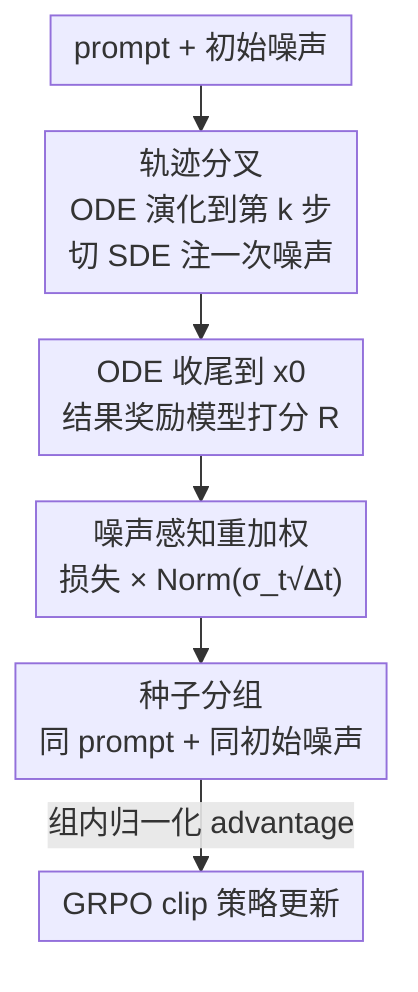

# TempFlow-GRPO: When Timing Matters for GRPO in Flow Models

**会议**: ICLR 2026  
**OpenReview**: [https://openreview.net/forum?id=7mCo3R3Wyn](https://openreview.net/forum?id=7mCo3R3Wyn)  
**代码**: 待确认  
**领域**: 扩散模型 / 图像生成 / 强化学习对齐  
**关键词**: Flow Matching, GRPO, 文生图对齐, 过程奖励, 时间感知优化

## 一句话总结
TempFlow-GRPO 指出现有 flow 模型的 GRPO 训练把所有去噪步「一视同仁」是核心瓶颈，通过「轨迹分叉做过程奖励 + 按噪声水平重加权 + 种子分组」三件套，让优化强度匹配每一步真实的探索潜力，在 GenEval 和 PickScore 上以更少步数取得 SOTA（GenEval 0.63→0.97，约 10× 训练效率）。

## 研究背景与动机
**领域现状**：文生图的 flow matching 模型（如 SD3.5、FLUX.1-dev）画质已经很高，但要让输出对齐人类偏好仍要靠强化学习。Flow-GRPO、DanceGRPO 等把 GRPO 搬到 flow 模型上，是当前主流的「Diffusion RL」做法：给一个 prompt 采样一组图、用奖励模型打分、按组内归一化算 advantage，然后对整条反向轨迹做策略优化。

**现有痛点**：这些方法把多步生成当成一个「黑箱」，在所有时间步上施加**完全均匀**的优化压力，而且奖励只在轨迹终点（生成完成）给一次。作者实测发现这忽略了一个关键事实——不同去噪步的「重要性」差异巨大：在只对单一时间步施加 SDE 扰动的可控实验里，最终奖励的标准差在早期结构决策阶段（step 0-2）达到峰值，到后期精修阶段（step 6-8）几乎归零。也就是说早期一步走错满盘皆输，后期怎么扰动都影响不大，但 Flow-GRPO 对两者一样对待，白白浪费了高价值的早期探索机会。

**核心矛盾**：要做精细的信用分配（credit assignment），就得知道中间状态好不好，但中间是「半去噪」的语义模糊图像，训练专门的过程奖励模型（PRM，如 SPO）极其困难且昂贵；而不做过程奖励、只用终点稀疏奖励，又无法区分早期关键决策和后期微调。如何在**不训练中间奖励模型**的前提下，把终点奖励精确归因到具体的中间动作，同时让优化强度随每一步的探索能力自适应？

**切入角度**：作者抓住 flow matching「确定性 ODE / 随机 SDE 可互转」这个独特性质。如果一条轨迹绝大部分确定性演化、只在某一个指定步注入随机性，那么最终奖励的全部方差都能被「归因」到那一个分叉点的探索结果上——这就免费造出了过程奖励信号。再加上观察到「奖励标准差曲线」和「噪声水平曲线」高度吻合，于是噪声水平本身就能当作每步探索潜力的天然代理。

**核心 idea**：用「轨迹分叉」把终点奖励精确归因到单步，用「噪声感知重加权」让梯度贡献匹配每步探索潜力，用「种子分组」隔离初始噪声的干扰——三者共同把 GRPO 从「时间无关」升级为「时间感知」。

## 方法详解

### 整体框架
TempFlow-GRPO 建立在 Flow-GRPO 之上：给定 prompt，flow 模型采样一组图、用现成的**结果奖励模型**（PickScore / GenEval / HPSv3）打分、按组内归一化算 advantage、再做 PPO 式 clip 优化。它的改造集中在三处：(1) 采样阶段不再整条轨迹都用 SDE，而是「ODE 确定性演化 → 在选定分叉步切到 SDE 注入一次噪声 → 再 ODE 确定性收尾」，让该步的探索结果能被单独归因；(2) 损失阶段给每个时间步乘一个正比于噪声水平 $\sigma_t\sqrt{\Delta t}$ 的权重，放大早期高噪声步的学习信号；(3) 分组阶段在「同 prompt」之上再加「同初始噪声」约束，把奖励波动彻底归因到分叉探索本身。

### 关键设计

**1. 轨迹分叉做过程奖励：让终点奖励能精确归因到单步**

传统过程奖励要给语义模糊的中间状态 $x_t$ 打分，需要专门的 PRM，难训又贵。作者的替代方案优雅地利用 flow 模型「确定性 + 随机」可切换的采样特性：一条轨迹从初始噪声 $x_T$ 开始用确定性 ODE（式 $dx_t = v_t dt$）演化，到指定分叉步 $k$ 时切换到 SDE 注入一次随机性 $x_{k-1} = \text{SDE}(x_k, \epsilon)$，之后再用 $k-1$ 次 ODE 确定性地收到 $x_0$。由于整条轨迹只有第 $k$ 步带随机性，**最终奖励的全部方差和所有与参数相关的改进都只能归因到第 $k$ 步的噪声注入结果**（作者称为「信用定位定理」）。实操上就是把第 $k$ 步的奖励从 $R(x_0, c)$ 替换为 $R(\text{ODE}_{k-1}(\text{SDE}(x_k, \epsilon)), c)$，即用「ODE-SDE-ODE」采样的结果给该步打分。这样无需任何新奖励模型，就把终点的稀疏奖励变成了对每个时间步可定位的过程奖励信号。

**2. 噪声感知策略重加权：让梯度贡献匹配每步探索潜力**

光有过程奖励还不够，整条轨迹有 $T$ 个潜在分叉点，特性天差地别：SDE 注入的噪声量级 $\sigma_t\sqrt{\Delta t}$ 在生成早期很大、到后期精修阶段趋近于零。作者可视化发现「奖励标准差」和「噪声水平」两条曲线高度吻合，说明噪声水平就是每步探索能力（和风险）的内在代理。更关键的是理论推导：把策略梯度展开（式 8-10）后，标准 GRPO 的梯度尺度项正比于 $\sqrt{\Delta k(1-k)/k}$，这导致**低噪声后期步反而主导优化**——它们对图像内容影响最小却拿到最大梯度权重，这是个本末倒置的失配。于是作者直接用噪声水平给损失加权：

$$J_{\text{policy}}(\theta) = \frac{1}{G}\sum_{i=1}^{G}\frac{1}{T}\sum_{t=0}^{T-1}\text{Norm}(\sigma_t\sqrt{\Delta t})\big(\min(r_t^i(\theta)\hat{A}_t^i,\ \text{clip}(r_t^i(\theta), 1-\epsilon, 1+\epsilon)\hat{A}_t^i)\big)$$

加权后尺度项被简化为正比于步长 $\Delta k$；当 flow shift 取 1 时各时间步梯度贡献完全均衡。直觉上就是早期高噪声、高影响阶段放大学习信号鼓励宏观结构探索，后期低噪声阶段温和更新、防止激进探索把已经高保真的图破坏掉。

**3. 种子分组：隔离初始噪声，让奖励波动只反映探索**

GRPO 原本按「同 prompt」分组，Reinforce++ 又引入了 batch 级归一化。但 TempFlow-GRPO 的轨迹分叉在每步要做 $K$ 次探索，如果同组样本初始噪声不同，奖励差异就混入了「初始噪声运气」而非「探索本身」。作者提出在「同 prompt」之上再加约束：同组轨迹必须共享**同一个初始噪声**。这样初始噪声的影响被控制住，奖励的变化就能纯粹归因到分叉过程中的探索，让前两个设计的信用分配更干净。实验（Figure 6）显示无论用哪种分组策略，TempFlow-GRPO 都稳定优于 Flow-GRPO，而 seed group 进一步带来约 2% 增益。

### 损失函数 / 训练策略
核心损失即上面的噪声加权 GRPO 目标（式 7），保留了 PPO 的 clip 机制和与参考策略的 KL 正则。为公平对比 Flow-GRPO，作者把各时间步权重归一化到均值为 1，并设 4 个初始噪声种子 × 分叉因子 $K=6$，总组大小 24（= Flow-GRPO 配置）、48 个组。base 模型涵盖 SD3.5-Medium 和 FLUX.1-dev（1024 分辨率），奖励模型分别用 GenEval reward、PickScore、HPSv3。

## 实验关键数据

### 主实验

GenEval 合成图像生成（base = SD3.5-Medium）：

| 方法 | Step | Overall ↑ | Two Obj. ↑ | Counting ↑ | Position ↑ | Attr. Binding ↑ |
|------|------|-----------|------------|------------|------------|-----------------|
| SD3.5-M（base） | - | 0.63 | 0.78 | 0.50 | 0.24 | 0.52 |
| GPT-4o | - | 0.84 | 0.92 | 0.85 | 0.75 | 0.61 |
| Flow-GRPO | 3800 | 0.88 | 0.96 | 0.90 | 0.83 | 0.78 |
| Flow-GRPO | 5600 | 0.95 | 0.99 | 0.95 | 0.99 | 0.86 |
| **TempFlow-GRPO** | **3800** | **0.97** | **1.00** | **0.96** | **0.99** | **0.91** |

关键对比：TempFlow-GRPO 在 3800 步即达 0.97，而 Flow-GRPO 同条件下只有 0.88；要达到 0.95，TempFlow 只需约 2000 步，Flow-GRPO 需约 5600 步。

人类偏好对齐（PickScore / HPSv3）：

| 设置 | 结论 |
|------|------|
| PickScore（SD3.5-M） | 比原始 Flow-GRPO 高约 1.7%，比改进基线 Flow-GRPO(Prompt) 高约 1.0%；100-200 步即追平 Flow-GRPO |
| GPU 小时 | 约 10× 训练效率（达到同 PickScore 所需算力） |
| HPSv3（FLUX.1-dev, 1024） | 仅需 80 步即匹配 Flow-GRPO 用 300 步的效果，且 KL loss 更低更稳 |

### 消融实验

| 配置（逐步叠加） | GenEval（1200 步附近） | 说明 |
|------------------|------------------------|------|
| Flow-GRPO (Prompt) | ~0.82 | 改进基线（组内 std 稳定化） |
| + 轨迹分叉 | +约 5% | 引入过程奖励 |
| + 噪声感知重加权 | 提升至 ~0.92 | 相对 Flow-GRPO 约 +10%，单项收益最大 |
| + 种子分组 | +约 2% | 隔离初始噪声 |

分叉配置（固定总组大小 24）：2×12 / 4×6 / 6×4 中，初始噪声多则早期收敛快、分叉多则后期上限高，折中选 **4×6** 为默认。

### 关键发现
- **噪声感知重加权贡献最大**：在 GenEval 上单独这一项就把性能从 0.82 拉到 0.92（约 +10%），印证了「后期低噪声步本不该主导优化」的理论分析才是真正的瓶颈。
- **早期步是探索的高价值区**：奖励标准差在 step 0-2 达峰、step 6-8 趋零，与噪声水平曲线高度吻合，为「按噪声加权」提供了实证依据。
- **效率提升显著**：多组实验中 TempFlow-GRPO 普遍用 Flow-GRPO 约 1/4~1/10 的步数/算力达到同等性能，且 KL loss 更稳定。

## 亮点与洞察
- **用采样器特性「白嫖」过程奖励**：不训练任何 PRM，仅靠 ODE/SDE 可切换 + 单步注噪，就把终点稀疏奖励变成可定位的过程信号——这是规避「中间状态难打分」难题的巧思，可迁移到任何确定性/随机可切换的生成式 RL。
- **理论说清了「均匀优化为什么错」**：通过策略梯度展开揭示标准 GRPO 的尺度项 $\sqrt{\Delta k(1-k)/k}$ 让低噪声步反主导，再用噪声加权把它简化为 $\Delta k$，flow shift=1 时完全均衡——动机不是拍脑袋而是有推导支撑。
- **三个设计正交且互补**：分叉给「信号」、重加权给「强度」、种子分组给「干净对照」，消融显示叠加增益可累加，工程上易于直接嵌入现有 flow-RL 框架。

## 局限与展望
- 作者承认当前工作聚焦**算法创新而非奖励模型增强**，未来计划引入更强基础模型的多模态奖励、构建综合奖励框架。
- 自己发现：分叉步的「信用定位」假设依赖「除分叉点外完全确定性」，实际 flow 模型 ODE 求解仍有离散化误差，归因是否真的「全部方差只来自分叉点」存疑（理论是理想化的，⚠️ 以原文证明为准）。
- 4×6 等分组配置在固定总组大小 24 下调出，是否随 base 模型/分辨率/奖励模型变化而需重调，论文未充分探讨。

## 相关工作与启发
- **vs Flow-GRPO**：Flow-GRPO 首次把在线 RL 引入 flow 模型，但全程均匀优化 + 终点稀疏奖励；本文针对性补上「时间感知」的过程奖励和噪声加权，是直接的改进与超越。
- **vs SPO（过程奖励路线）**：SPO 训练步级偏好模型给含噪/干净图打分，但中间状态语义模糊、训练昂贵；本文绕开 PRM，直接把结果奖励归因到单步，省掉了训练步级评估器的开销。
- **vs DanceGRPO**：同属 flow/diffusion 的 GRPO 方法，本文额外在附录中做了对比，核心差异仍是「时间均匀 vs 时间感知」。

## 评分
- 新颖性: ⭐⭐⭐⭐⭐ 用采样器可切换特性免训练造过程奖励 + 噪声加权的理论推导，角度新颖
- 实验充分度: ⭐⭐⭐⭐ 覆盖 GenEval/PickScore/HPSv3 多奖励、SD3.5/FLUX 多 base，消融清晰；但多以曲线图给结论、表格量偏少
- 写作质量: ⭐⭐⭐⭐ 动机-观察-方法-理论链条完整，「宇航员探索星球」的比喻直观
- 价值: ⭐⭐⭐⭐⭐ 约 10× 训练效率 + SOTA，对 flow-RL 对齐有直接实用价值

<!-- RELATED:START -->

## 相关论文

- [\[CVPR 2026\] Neighbor GRPO: Contrastive ODE Policy Optimization Aligns Flow Models](../../CVPR2026/image_generation/neighbor_grpo_contrastive_ode_policy_optimization_aligns_flow_models.md)
- [\[ICLR 2026\] TreeGRPO: Tree-Advantage GRPO for Online RL Post-Training of Diffusion Models](treegrpo_tree-advantage_grpo_for_online_rl_post-training_of_diffusion_models.md)
- [\[CVPR 2026\] Stepwise-Flow-GRPO：给流匹配模型的去噪步逐步分配信用](../../CVPR2026/image_generation/stepwise_credit_assignment_for_grpo_on_flow-matching_models.md)
- [\[CVPR 2026\] Fine-Grained GRPO for Precise Preference Alignment in Flow Models](../../CVPR2026/image_generation/fine-grained_grpo_for_precise_preference_alignment_in_flow_models.md)
- [\[ICML 2026\] LithoGRPO: Fast Inverse Lithography via GRPO Reinforced Flow Matching](../../ICML2026/image_generation/lithogrpo_fast_inverse_lithography_via_grpo_reinforced_flow_matching.md)

<!-- RELATED:END -->
