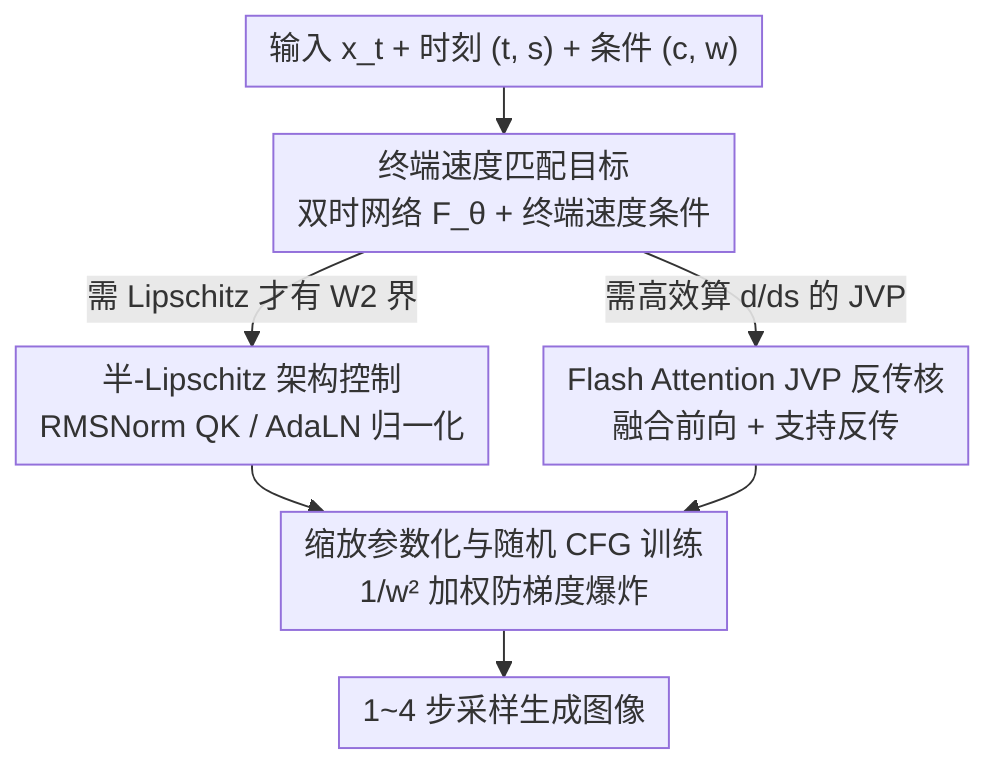

# Terminal Velocity Matching

**会议**: ICLR 2026  
**OpenReview**: [https://openreview.net/forum?id=plISxvVf6j](https://openreview.net/forum?id=plISxvVf6j)  
**代码**: 无（文本到图像大规模结果见 lumalabs.ai/blog/engineering/tvm）  
**领域**: 扩散模型 / 图像生成  
**关键词**: 流匹配, 一步生成, 终端速度, 2-Wasserstein 界, JVP

## 一句话总结
本文提出 Terminal Velocity Matching（TVM），把流匹配从「在轨迹起点匹配速度」改成「在轨迹终点匹配速度」，从而用单阶段训练直接学到任意两时刻之间的位移映射，可证明地上界 2-Wasserstein 距离；配合半-Lipschitz 架构修正和支持反传的 Flash Attention JVP 核，在 ImageNet-256 上做到 1 步 3.29 FID、4 步 1.99 FID，刷新 from-scratch 少步生成的 SOTA。

## 研究背景与动机

**领域现状**：扩散模型和流匹配（Flow Matching, FM）是当前图像/视频生成的主流范式，但它们本质是学一个瞬时速度场 $u(x_t,t)$，推理时要用 ODE 解算器迭代几十步（如 50 步）才能出高质量样本，对高维数据（视频）尤其昂贵。

**现有痛点**：为了少步推理，近期工作尝试单阶段直接学「积分后的轨迹」而非依赖 ODE 解算器。一类是 consistency 系（CT、sCT）和轨迹匹配系（MeanFlow），它们去预测或匹配轨迹的导数，但**和「分布匹配」没有显式联系**——而分布层面的逼近才是生成模型质量的根本度量。另一类如 IMM 用最大均值差异（MMD）提供了分布级保证，但**每个训练步需要多个粒子**，难以 scale 到大模型/高维数据（单卡 batch 受限时尤其致命）。

**核心矛盾**：少步生成方法要么有分布级理论保证但要多粒子（难 scale），要么单样本可 scale 但缺分布保证。两者难以兼得；同时这些方法把约束放在轨迹**起点**（在 $s=t$ 处对瞬时速度求导匹配），导致需要把会剧烈波动的 $u(x_t,t)$ 送进雅可比-向量积（JVP），训练不稳。

**本文目标**：在单阶段、单样本、不需课程学习的前提下，学到任意 $t\to s$ 的位移映射，同时给出分布层面的可证明保证。

**切入角度**：作者观察到净位移 $f(x_t,t,s)=\psi(x_t,t,s)-x_t$ 必须同时满足两个条件——它等于真速度场从 $t$ 到 $s$ 的积分，且它对 $s$ 求导在 $s=t$ 处等于瞬时速度 $u(x_t,t)$。把对 $s$ 的求导推广到任意 $s$（而非只在 $s=t$），就得到一个「**终端**速度条件」：$\frac{d}{ds}f(x_t,t,s)=u(\psi(x_t,t,s),s)$，它对任意真位移都成立，且能绕开训练时的显式 ODE 积分。

**核心 idea**：用一句话说就是——**把匹配从轨迹起点搬到轨迹终点**（terminal velocity 而非 initial velocity），用一个双时刻网络同时表示瞬时速度场和位移映射，使训练目标可证明地上界数据分布与模型分布之间的 2-Wasserstein 距离。

## 方法详解

### 整体框架

TVM 用**一个**双时刻条件网络 $F_\theta(x_t,t,s)$ 同时承担两件事：当 $s=t$ 时它退化成瞬时速度 $u_\theta(x_t,t)=F_\theta(x_t,t,t)$；当 $s\neq t$ 时它给出从 $t$ 跳到 $s$ 的位移 $f_\theta(x_t,t,s)=(s-t)F_\theta(x_t,t,s)$（前缀 $(s-t)$ 保证 $t=s$ 时位移为 0 的边界条件）。训练时同时优化两项：一项让瞬时速度逼近真速度（就是标准 FM loss，相当于终端速度条件在位移为 0 时的边界特例），另一项让位移映射的「终端速度」$\frac{d}{ds}f_\theta$ 对齐由网络自身充当代理的真速度。整套目标可证明上界 2-Wasserstein 距离，但前提是网络 Lipschitz 连续——而 DiT 不满足，于是需要架构修正；同时终端速度涉及对网络求 $\frac{d}{ds}$（即 JVP），需要专门的高效核才能 scale。

下图给出训练流向：输入与采样为脚手架，中间四个节点对应下文四个关键设计，最后是采样生成。

### 关键设计

**1. 终端速度匹配目标：把约束从起点搬到终点，换来分布级保证**

现有轨迹匹配方法（MeanFlow 等）在轨迹**起点** $t$ 处对 $f_\theta$ 求 $\frac{d}{dt}$ 并匹配 $-u(x_t,t)$，这要把波动剧烈的真速度 $u(x_t,t)$ 送进 JVP，而且和分布散度的关系含糊不清。TVM 反过来对**终点** $s$ 求导，利用恒等式 $\frac{d}{ds}f(x_t,t,s)=u(\psi(x_t,t,s),s)$。由于真位移和真速度都未知，作者用网络自身当代理：$u(\psi(x_t,t,s),s)\approx u_\theta(x_t+f_\theta(x_t,t,s),s)$，于是终端速度误差可以和 FM loss 联合优化（FM 正是位移为 0 时的边界特例）。逐时刻目标为

$$\mathcal{L}^{t,s}_{\text{TVM}}(\theta)=\mathbb{E}\Big[\big\|\tfrac{d}{ds}f_\theta(x_t,t,s)-u_\theta(x_t+f_\theta(x_t,t,s),s)\big\|_2^2+\big\|u_\theta(x_s,s)-v_s\big\|_2^2\Big],$$

前项满足「位移=速度积分」，后项满足「瞬时速度=真速度」。关键收益在 Theorem 1：当 $u_\theta(\cdot,s)$ 对所有 $s$ Lipschitz 连续（常数 $L(s)$）时，该目标的加权积分上界了模型推送分布 $f^\theta_{t\to0\#}p_t$ 与数据分布 $p_0$ 之间的 2-Wasserstein 距离，$W_2^2\le\int_0^t\lambda[L](s)\,\mathcal{L}^{t,s}_{\text{TVM}}(\theta)\,ds+C$。这意味着 TVM **不靠多粒子**就拿到了分布层面的逼近保证——这正是它相对 MeanFlow（无分布保证）和 IMM（要多粒子）的核心区别。实际训练时为避开权重函数 $\lambda[L]$ 的计算，直接随机采样 $(t,s)$ 取期望，并用 EMA 权重 + stop-gradient 构造有偏代理目标 $\hat{\mathcal{L}}^{t,s}_{\text{TVM}}$，用指示函数 $\mathbb{1}_{t\neq s}$ 保证 $t=s$ 时严格退化为 FM loss。

**2. 半-Lipschitz 架构控制：给 DiT 补上理论需要的 Lipschitz 性**

Theorem 1 的 $W_2$ 界依赖 $u_\theta$ Lipschitz 连续，但现代 Transformer 的缩放点积注意力（SDPA）和 LayerNorm 都**不**满足这一性质，DiT 亦然——表现为训练中网络激活值（如时间嵌入层）出现陡增、训练发散（图 4）。作者的思路是只做**最小、非限制性**的改动而非全局约束 Lipschitz 常数：把 QK-Norm 换成可证明 Lipschitz 的 RMSNorm（等价于带可学习缩放的 L2 QK-Norm）；把所有 LayerNorm 换成无可学习参数的 $\text{RMSNorm}^-(\cdot)$；针对 DiT 的 AdaLN——其 Lipschitz 常数依赖时间调制幅度 $a(t)$，可无界增长——再对调制参数也施加 $\text{RMSNorm}^-$：

$$\text{AdaLN}(x,t)=\text{RMSNorm}^-(x)\odot\text{RMSNorm}^-(a(t))+\text{RMSNorm}^-(b(t)).$$

再加上对除时间嵌入外所有线性层用 Lipschitz 初始化。值得注意的是这些改动**只控制了易失稳的关键层**而非全部层（故称「半-Lipschitz」），作者发现这种**部分**控制在实践中已足够让激活平滑、训练稳定。

**3. Flash Attention JVP 反传核：让终端速度在 Transformer 上算得动**

终端速度 $\frac{d}{ds}f_\theta(x_t,t,s)=F_\theta(x_t,t,s)+(s-t)\partial_s F_\theta(x_t,t,s)$ 里的 $\partial_s F_\theta$ 需要对网络做雅可比-向量积（JVP），而 PyTorch/开源 Flash Attention 对 SDPA 的 JVP 支持很差。更棘手的是：与 sCT、MeanFlow 等只做前向 JVP 不同，TVM 还要把梯度**反传穿过** JVP 项 $\partial_s F_\theta$。为此作者实现了一个高效 Flash Attention 核，做到三点：(i) 把 JVP 与前向融合，(ii) 显存远低于朴素 PyTorch 注意力，(iii) 支持对 JVP 结果的反向传播。实测相对标准 PyTorch 算子最高提速 65%、显存显著下降，使 TVM 可随 Transformer 规模扩展。配套的优化器细节：因 JVP 引入高阶梯度，默认 AdamW $\beta_2=0.999$ 会让 loss 抖动，借鉴语言模型经验改用 $\beta_2=0.95$ 加快二阶矩更新，终端速度误差曲线明显更平滑（图 5）。

**4. 缩放参数化与随机 CFG 训练：稳住不同引导强度下的梯度**

引入 classifier-free guidance（CFG）后真速度幅度随权重 $w$ 线性增长，直接用网络预测速度可能次优。作者把映射写成 $f_\theta(x_t,t,s,c,w)=(s-t)\,w\,F_\theta(\cdot)$ 的**缩放参数化**，让 $u_\theta=wF_\theta$ 天然随 $w$ 缩放。训练时随机采样 CFG 权重并把 $w$ 直接喂进目标，且对损失加 $1/w^2$ 权重——因为真速度幅度 $\propto w$，不加权会梯度爆炸：

$$\frac{1}{w^2}\mathbb{E}\Big[\big\|\tfrac{d}{ds}f_\theta(\cdot,w)-u_{\theta^*_{sg}}(\cdot,w)\big\|_2^2\,\mathbb{1}_{t\neq s}+\hat{\mathcal{L}}^{s,c,w}_{\text{FM}}\Big].$$

之所以 TVM 能在**随机 CFG** 下稳定收敛而 CT/MeanFlow 容易崩，关键在于它的 JVP 只对 $s$ 求导、与起点 $x_t$ 和时间 $t$ 无关，从而避开了把随 $w$ 剧烈变化的 $u(x_t,t)$ 送进 JVP（图 7 显示 TVM 梯度范数和 $\|u\|$ 都远比 MeanFlow 平滑）。如此一来无需课程学习、无需对特定 $t$ 区间才开 CFG、也无需自适应 loss 加权，实现简单且可 scale。

### 损失函数 / 训练策略
最终目标按某分布 $p(t,s)p(w)$ 采样 $t,s,w$，对上式取期望；以 $\sim10\%$ 概率置空类别 $c=\varnothing$（此时令 $w=1$）。代理目标使用 EMA 权重 $\theta^*_{sg}$ 与 stop-gradient。采样时直接 $x\leftarrow x+(s-t)F_\theta(x,t,s,c,w)$ 沿 $t=1\to0$ 的等间隔时刻迭代，可在 1 步与 $n$ 步之间自然插值，无需重训。

## 实验关键数据

主干为 DiT-XL/2，注入 $t-s$ 作为第二时刻，配半-Lipschitz 控制，从零单阶段训练。

### 主实验

ImageNet-256×256（FID↓）：

| 方法 | NFE | FID | 参数量 |
|------|-----|-----|--------|
| DiT-XL/2 (w=1.5) | 250×2 | 2.27 | 675M |
| iCT-XL/2 | 1 | 34.24 | 675M |
| Shortcut-XL/2 | 1 | 10.60 | 675M |
| IMM-XL/2 | 2×4 | 2.51 | 675M |
| MeanFlow-XL/2 | 1 | 3.43 | 676M |
| **TVM-XL/2 (w=2)** | **1** | **3.29** | 678M |
| **TVM-XL/2 (w=1.75)** | **4** | **1.99** | 678M |

ImageNet-512×512（FID↓）：

| 方法 | NFE | FID | 参数量 |
|------|-----|-----|--------|
| DiT-XL/2 (w=1.5) | 250×2 | 3.04 | 675M |
| sCT-XL | 1 | 4.33 | 1.1B |
| MeanFlow-XL/2 | 1 | 5.24 | 676M |
| **TVM-XL/2 (w=2.50)** | **1** | **4.32** | 678M |
| **TVM-XL/2 (w=2.25)** | **4** | **2.94** | 678M |

1-NFE 上 TVM 在两个分辨率均超越 from-scratch 的 MeanFlow/IMM/sCT；512 上仅 678M 参数即胜过 1.1B 的 sCT-XL，说明模型容量利用更高效。4-NFE 即可匹配甚至超过 500-NFE 的 DiT 扩散基线。

### 消融实验

| 配置 | 关键指标 | 说明 |
|------|---------|------|
| 时间采样 gap 方案 | 1-NFE FID 3.72 | $t$ 偏 1、$s$ 偏 0 让模型学长步长；gap 在长训练下胜过 trunc/clamp |
| 常数 CFG vs 随机 CFG (w=2) | 4.81 vs 5.14 | 常数 CFG 始终更优，w=2 比默认 1.5 收敛更快 |
| EMA 目标 $\gamma=0.99$ | 1-NFE 4.90 | $\gamma=0$ 退化到 10.24，$\gamma$ 过大（0.999）又失稳 |
| 缩放参数化 (w=1.5) | 6.04 vs 9.32 | 低 CFG 下缩放参数化收益显著 |
| $t=s$ 概率 0% vs 20% | 1-NFE 3.72 vs 3.88 | 设 $t=s$ 反而损 1-NFE、仅微增 2-NFE，故默认不用 |
| TVM vs MeanFlow（朴素 SDPA） | 显存 71GB vs OOM | 自研核让 MeanFlow 也免于 OOM；detach JVP 可进一步降时延 |

### 关键发现
- **EMA 目标贡献最大**：去掉 EMA（$\gamma=0$）FID 从 ~4.9 崩到 10.24，作者归因于 EMA 慢更新带来的方差/优化噪声下降，且 EMA 权重本身就是更好的学习信号。
- **存在 NFE 之间的容量权衡**：更高 CFG 训练的模型 1-NFE 更好、2-NFE 反而更差，作者认为是网络容量不足以同时拟合所有 NFE，留作未来工作。
- **随机 CFG 可收敛但非最优**：受 $1/w^2$ 下权重和容量限制，部分 CFG 尺度在训练中 FID 退化；常数 CFG 表现更好。
- **半-Lipschitz 控制是稳定训练的前提**：不加时激活值陡增、训练发散（图 4）。

## 亮点与洞察
- **「终点 vs 起点」一个视角切换换来 $W_2$ 上界**：仅把对时间的求导从 $s=t$ 推广到任意终端 $s$，就把轨迹匹配和 2-Wasserstein 距离显式挂钩——这是 MeanFlow 类方法缺失的，且不需要多粒子（IMM 的代价）。
- **单网络双身份**：用同一个 $F_\theta$ 既当瞬时速度场又当位移映射，前者从数据学、后者借前者当代理来学，省去额外蒸馏教师。
- **JVP 只对 $s$ 求导是稳定性的根因**：因为对 $s$ 的导数与起点 $x_t$、时间 $t$ 无关，从而避开把随 CFG 暴涨的 $u(x_t,t)$ 送进 JVP，这是 TVM 能随机采 CFG 而不崩的本质——这个「对哪个变量求导」的设计取舍很值得迁移到其他 flow map 方法。
- **理论需求倒逼架构改动**：从「$W_2$ 界要 Lipschitz」直接推出该改 DiT 的哪些归一化层，是理论与工程少见的紧耦合范例。

## 局限与展望
- 作者承认 **NFE 之间存在权衡**、随机 CFG 非最优，均归因于网络容量并留作未来工作。
- 半-Lipschitz 只控制了关键层而非全部层，理论保证的前提（全局 Lipschitz）在严格意义上并未完全满足，属「够用即可」的工程妥协。
- 主要在 ImageNet 类条件生成上验证；10B+ 文本到图像结果只在博客提及、未进正文，缺少同行评审的大规模定量证据。
- 改进后的 DiT 因架构改动带来更高时延/显存（71GB vs 朴素 DiT 59GB），需靠 detach JVP 或 `torch.compile` 缓解。

## 相关工作与启发
- **vs MeanFlow**：MeanFlow 在起点对 $t$ 求导、需把 $u(x_t,t)$（实际用 $v_t$ 近似）送进 JVP，带来方差与梯度抖动，且与分布散度关系不明；TVM 在终点对 $s$ 求导、提供 $W_2$ 上界，随机 CFG 下更稳。两者在「对 $s$ 还是对 $t$ 求微分」上构成对偶。
- **vs IMM**：IMM 用 MMD 给分布一致性保证，但每步要 >4 个粒子；TVM 用**单样本**就保有分布匹配解释，可 scale 到单卡 batch=1 的大模型。
- **vs PID（物理信息蒸馏）**：PID 把单步位移写成 $(s-1)u_\theta(x_1,s)$ 蒸馏预训练扩散模型，相当于 TVM 固定 $t=1$ 的特例、只能单步；TVM 引入连续的起始时刻 $t$ 分布，作者证明朴素 PID+FM 组合会优化失稳，连续 $t$ 是经验成功的必要条件。

## 评分
- 新颖性: ⭐⭐⭐⭐⭐ 「终端速度」视角切换简洁却带来分布级 $W_2$ 保证，理论与架构紧耦合
- 实验充分度: ⭐⭐⭐⭐ ImageNet 双分辨率 + 系统消融扎实，但缺大规模文生图的同行评审证据
- 写作质量: ⭐⭐⭐⭐⭐ 理论推导清晰、与 MeanFlow/IMM/PID 的对比定位明确
- 价值: ⭐⭐⭐⭐⭐ from-scratch 少步生成新 SOTA，单样本可 scale + 可证明界，对生成模型设计有方法论启发

<!-- RELATED:START -->

## 相关论文

- [\[ICLR 2026\] MeanCache: From Instantaneous to Average Velocity for Accelerating Flow Matching Inference](meancache_from_instantaneous_to_average_velocity_for_accelerating_flow_matching_.md)
- [\[ICML 2026\] Stable Velocity: A Variance Perspective on Flow Matching](../../ICML2026/image_generation/stable_velocity_a_variance_perspective_on_flow_matching.md)
- [\[ICLR 2026\] Any-step Generation via N-th Order Recursive Consistent Velocity Field Estimation](any-step_generation_via_n-th_order_recursive_consistent_velocity_field_estimatio.md)
- [\[ICLR 2026\] Exploring the Design Space of Transition Matching](exploring_the_design_space_of_transition_matching.md)
- [\[ICLR 2026\] Branched Schrödinger Bridge Matching](branched_schrödinger_bridge_matching.md)

<!-- RELATED:END -->
