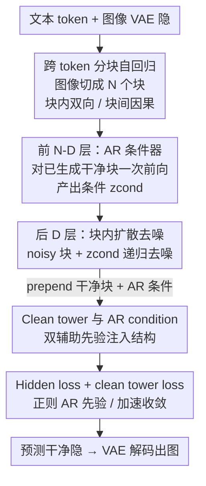

# MADFormer: Mixed Autoregressive and Diffusion Transformers for Continuous Image Generation

**会议**: ICLR 2026  
**OpenReview**: [https://openreview.net/forum?id=9zUJbyR62q](https://openreview.net/forum?id=9zUJbyR62q)  
**代码**: 公开发布（论文称 Code and models will be released upon publication）  
**领域**: 扩散模型 / 图像生成  
**关键词**: 自回归-扩散混合, 连续图像生成, 分块自回归, 算力-质量权衡, 统一 Transformer

## 一句话总结
MADFormer 把图像生成同时在「token 轴」和「层轴」上混合自回归与扩散——块间用 AR 做一次性全局条件、块内用扩散做迭代细化，并把 Transformer 前几层当 AR 条件器、后几层当扩散去噪器，作为一个统一可控的测试台系统性回答「AR 和扩散该怎么分配算力」，在受限推理算力下把 FID 最多改善 60–75%。

## 研究背景与动机
**领域现状**：多模态生成里，自回归（AR）和扩散是两条互补的主线。AR 擅长建模长程依赖、产出上下文连贯的序列；扩散在连续隐空间里逐步去噪，能精修高保真视觉细节。近来越来越多工作试图把两者糅在一起（如 Transfusion、Show-o、ACDiT、MAR 等），希望同时拿到 AR 的结构性与扩散的细节质量。

**现有痛点**：图像生成主流有三条路线——① 在离散视觉 token 上做 AR，能复用 LLM 架构但有量化伪影、上限受限；② 全扩散在连续隐空间里生成，质量高但采样慢、算力开销大；③ 混合架构在图像生成通路内部同时用 AR 和扩散。第三条最有前途，但「该把多少模型容量分给 AR、多少分给扩散，分在哪个轴上」几乎没有系统答案，现有混合方法大多凭经验拍脑袋。

**核心矛盾**：AR 与扩散在「全局结构建模」和「局部细节精修」上是互补的，但二者抢的是同一份固定算力预算。一次性的 AR 条件能高效地把跨块、跨模态的全局依赖编码好，而迭代的扩散去噪贵但能补细节；到底偏 AR 还是偏扩散，取决于推理预算和分辨率，没有放之四海皆准的配方。

**本文目标**：不只是再造一个混合模型，而是造一个**可控的测试台**，把混合设计空间拆成几个可独立扫描的轴（扩散深度、AR 分块粒度、辅助模块、损失设计），定量回答「怎么分配 AR/扩散容量」。

**切入角度**：作者从一个 vanilla 架构（语言用 AR、图像用扩散）出发，往里加入**图像内部的 AR 条件**与**AR/扩散层的灵活分配**，让结构与容量分布可调，从而观察二者交互。

**核心 idea**：在同一个统一 Transformer 里、沿 token 轴和层轴两个方向混合 AR 与扩散——块间 AR 一次性给全局条件、块内扩散迭代精修；前层 AR、后层扩散——并由此提炼出「算力紧时偏 AR、算力足时偏扩散」的实用准则。

## 方法详解

### 整体框架
MADFormer 是一个统一的 Transformer：文本和图像被拼成同一条序列，文本走 next-token 预测，图像隐 patch 被分成若干**块（block）**、块作为 AR 序列里的「token」被自回归生成，而每个块内部用扩散目标去噪。图像在连续 VAE 隐空间里处理（不量化），用 Llama 3 tokenizer 处理文本、Stable Diffusion VAE 处理图像，块内做双向注意力、块间做因果注意力。

关键在于把**单个 Transformer 的层栈在概念上切成两段**：前 N−D 层是「AR 条件器」，对之前已生成的干净块做一次前向，算出对下一块的条件 $z_{cond}$；后 D 层是「扩散去噪器」，把加噪的当前块隐 $\sqrt{\bar\alpha_t}\,z_{image}+\sqrt{1-\bar\alpha_t}\,\epsilon$ 与条件 $z_{cond}$ 相加后递归去噪，预测干净隐 $\hat z_{image}$。注意整个网络共享 Llama backbone，只是训练目标不同；时间步信息不像 DiT 那样注入每层，而是通过 U-Net 下采样器编码进图像隐里。这套「AR 提供强初始化 + 扩散少步收敛」的布局在算力受限时尤其有效。

### 关键设计

**1. 跨 token 的分块自回归 + 块内扩散：用粗粒度块兼顾结构与灵活**

针对「全扩散全局连贯但慢、纯 AR 离散有伪影」的两难，MADFormer 沿 token 轴把图像隐线性化（左到右、上到下）后切成**粗粒度块**（如 1024×1024 隐切成 16 个 256×256 的块）。块**之间**做自回归：第 $i$ 块的生成自回归地条件在前面所有块上，$p(x)=\prod_i p(x_i\mid x_{1:i-1})$；块**之内**做扩散：把连续隐当作实值，用 DDPM 前向 $x_t=\sqrt{\bar\alpha_t}x_0+\sqrt{1-\bar\alpha_t}\epsilon$ 加噪再迭代去噪。这样 AR 负责跨块的全局结构与上下文，扩散负责块内的高保真细节，二者各取所长。块数（AR length）是个关键旋钮：实验发现最优粒度依分辨率而定——FFHQ-1024 偏好 16 块、ImageNet-256 偏好单块，说明高分辨率图像更吃细粒度 AR 分解。

**2. 跨 layer 的 AR/扩散分层混合：把前层让给 AR、后层让给扩散**

针对「现有工作常把整个模型都用于扩散、造成不必要算力浪费」的问题，MADFormer 沿深度轴把 28 层 Transformer 切成前 N−D 层 AR、后 D 层扩散。AR 阶段对之前的图像块算条件表示：$h_0=\mathrm{Embed}(z_{prev})+\mathrm{PosEnc}$，逐层 $h_i=\mathrm{DecoderBlock}_i(h_{i-1})$，得 $z_{cond}=h_{N-D}$（位置编码用 ACDiT 的多维 RoPE-ND）。进入扩散阶段时把噪声隐与条件相加 $h_{N-D}=\sqrt{\bar\alpha_t}z_{image}+\sqrt{1-\bar\alpha_t}\epsilon+z_{cond}$，再经 D 层去噪得 $\hat z_{image}=\mathrm{Proj}(h_N)$。核心洞察是：一次性的 AR 条件就足以捕捉跨模态、跨块依赖，只需少数后层做块内细化即可。这让「扩散深度 $D$」成为可扫描的容量旋钮（论文比较了 $d=7/14/21/28$），从而能定量回答 AR 与扩散的算力分配——算力紧时多给 AR（AR 提供强初始化、扩散少步即可收敛），算力足时多给扩散（细节精修上限更高）。

**3. Clean tower 与 AR condition：两路辅助先验把结构注入去噪轨迹**

为了让去噪过程有更强的上下文，MADFormer 借鉴 ACDiT 把**干净图像块（clean blocks）**prepend 到加噪块前面，并辅以**AR 条件**这一从前序块自回归生成的上下文。两者都给去噪轨迹注入结构性先验、互为补充。实现上，所有模态共享 backbone 但用**分离的参数集**处理文本、干净图像块、加噪图像块（分别叫 text tower / clean tower / noise tower），跨模态用交错因果注意力、块内用双向注意力，混合干净/加噪输入的注意力掩码由 Flex Attention 动态构造。消融显示去掉任一路（只留 clean blocks 或只留 condition）FID 都会一致变差，证明二者各自有效且组合更好；不过参数是否真的分离影响很小（见消融），共享参数的稠密模型同样够用。

**4. Hidden loss 与 clean tower loss：用辅助监督正则 AR 先验、加速收敛**

在标准的文本 NLL + 图像 MSE 之外，作者加了两个辅助损失。**Hidden loss** 让 AR 产出的条件去对齐下一块的干净隐 $\|z_{condition}-z_{image}\|_2^2$，理念是「条件应当尽量编码它所引导的那块干净隐」；**Clean tower loss** 让每个干净块的输出去预测下一干净块 $\|z_{clean}-z_{image}\|_2^2$，类似 AR 的 next-token 预测。总损失为加权和：

$$\mathcal{L}_{total}=\lambda_{text}\,(-\log p(y_{text}\mid x))+\lambda_{image}\,\|\hat z_{image}-z_{image}\|_2^2+\lambda_{hidden}\,\|z_{condition}-z_{image}\|_2^2+\lambda_{tower}\,\|z_{clean}-z_{image}\|_2^2$$

其中 $\lambda_{text}=1$、$\lambda_{image}=5$（沿用 Transfusion），$\lambda_{hidden}$ 和 $\lambda_{tower}$ 可调。实验里 hidden loss 在 $\lambda=0.1$ 时把 FFHQ FID 从 19.4 降到 17.8——小权重起正则作用，大权重会过度约束 AR 先验、干扰去噪；clean tower loss 对最终质量影响较小，但两者都能在训练早期加速收敛。

### 损失函数 / 训练策略
图像去噪训练用 1000 步 DDPM 调度；优化器 AdamW + WSD 学习率调度，峰值 lr $3\times10^{-4}$、weight decay $5\times10^{-2}$，EMA 衰减 0.9999。FFHQ-1024 用 1.3B 参数、28 层，训练 210k 步、batch 64；ImageNet 用 2.1B 参数（多了文本 tower、token 嵌入、LM head），训练 250k 步（约 50 epoch）、batch 256。U-Net 上/下采样器约 0.2B 参数，VAE 冻结。采样用 DDIM（FFHQ 250 步、ImageNet 100 步），FID 取最后 5 个 checkpoint 平均以降方差。作者强调 ImageNet 上 FID 偏高是因为训练 epoch 远少于 MAR（400）和 ACDiT（800）、且不用 CFG，因为重点是受控的设计空间分析而非刷 SOTA。

## 实验关键数据

### 主实验
核心结论是「算力紧偏 AR、算力足偏扩散」。在固定 28 层预算下扫不同 AR:Diffusion 比例与不同 NFE：

| 数据集 | 算力档（NFE） | AR-heavy（如 3:1, d=7） | Diffusion-heavy（如 d=28） | 趋势 |
|--------|--------------|------------------------|---------------------------|------|
| FFHQ-1024 | 低 NFE | FID 更优（最多降 60–75%） | 较差 | 低算力 AR 占优 |
| FFHQ-1024 | 高 NFE | 较差 | FID 更优 | 高算力扩散占优 |
| ImageNet-256 | 低 NFE | FID 更优（最多降 60–75%） | 较差 | 同上 |

扩散深度消融（固定 28 层、同扩散步数）则显示扩散容量越大保真越高：

| 配置 | FFHQ FID ↓ | ImageNet FID ↓ |
|------|-----------|----------------|
| d = 7 | 20.2 | 34.0 |
| d = 14 | 17.8 | 30.0 |
| d = 21 | 16.6 | 28.1 |
| d = 28 | 15.9 | 27.4 |

两个结论并不矛盾：固定 NFE 下偏 AR 更省算力（Figure 4），而把扩散步数也放开、单纯加扩散层则保真更高（Table 1）。

### 消融实验

| 配置 | FFHQ FID ↓ | ImageNet FID ↓ | 说明 |
|------|-----------|----------------|------|
| Full（clean blocks + condition） | 17.8 | 30.0 | 完整双辅助先验 |
| Clean blocks only | 20.1 | 31.9 | 去掉 AR 条件，FFHQ +2.3 |
| Condition only | 19.7 | 31.2 | 去掉干净块，FFHQ +1.9 |
| AR length l=16（FFHQ）/ l=1（ImageNet） | 17.8 / 28.4 | — | 最优分块依分辨率而定 |
| 共享参数（Single Set） | 17.8 | 30.4 | 参数分离几乎无增益 |
| MLP-style 去噪（截断跨块注意力） | 21.2 | 96.5 | 跨块因果注意力至关重要 |
| Hidden loss λ=0 → 0.1 | 19.4 → 17.8 | 30.2 → 30.0 | 小权重正则 AR 先验最优 |

### 关键发现
- **算力是分水岭**：决定该偏 AR 还是偏扩散的不是模型大小，而是推理预算与分辨率——低 NFE 下 AR-heavy 把 FID 改善 60–75%，高 NFE 下扩散反超。
- **跨块注意力不可砍**：把扩散阶段的注意力限制在块内（模拟独立 MLP 去噪）会让 ImageNet FID 从 30.0 爆到 96.5，说明序列级因果注意力对跨块一致性和细节是关键。
- **分块粒度依分辨率**：高分辨率 FFHQ 吃细粒度 AR 分解（16 块最好），低分辨率 ImageNet 反而单块最好（更长 AR 序列会掉质量，与 ACDiT 一致）。
- **参数分离收益微乎其微**：text/clean/noise 三套参数对 FID 几乎无影响，稠密共享模型同样有效，省下稀疏化的复杂度。
- **辅助损失要小权重**：hidden loss 小权重正则有益、大权重反而过约束 AR 先验干扰去噪；clean tower loss 对终质量影响小但加速早期收敛。

## 亮点与洞察
- **「测试台」定位**：本文把贡献从「又一个混合模型」抬高到「一个能系统扫设计空间的可控平台」，沿层轴、token 轴、损失轴各设可独立调的旋钮，输出的是可迁移的设计准则而非单点 SOTA——这种「方法即实验框架」的写法很值得借鉴。
- **AR 当扩散的廉价初始化**：用前几层一次性 AR 条件给扩散一个强起点，使扩散能少步收敛，这把「AR 高效建结构 + 扩散精修细节」落到了同一网络的不同层上，是算力受限场景下很实用的 trick。
- **统一架构只换目标**：整网共享 Llama backbone，AR 与扩散只是训练目标不同、时间步靠 U-Net 下采样器编码进隐里而非注入每层，工程上比 DiT 式逐层注入更简洁。

## 局限与展望
- **绝对 FID 不高**：作者主动声明 ImageNet FID 偏高是因为训练 epoch 远少于 MAR/ACDiT 且不用 CFG，所以本文不能直接和那些刷榜模型比绝对质量，只能比设计趋势——对想要 SOTA 数值的读者参考价值有限。
- **最优配置无闭式解**：最优 AR length 依分辨率、架构、数据集而变，论文只给经验值（FFHQ 16 块、ImageNet 单块），没有可预测的选择公式，换数据集仍要重扫。
- **预测参数化偏保守**：扩散仍预测干净隐（而非 $\epsilon$ 或 velocity），作者把这些替代参数化、以及自适应损失权重都留作 future work。
- **clean blocks 有额外开销**：prepend 干净块虽提升保真，但增加计算成本，论文未深入量化这部分代价与收益的边界。

## 相关工作与启发
- **vs Transfusion / Show-o**：它们是跨模态地混合（共享 token 序列、中途切换 AR/扩散目标）；MADFormer 聚焦在**图像生成过程内部**混合 AR 与扩散，是正交的一条轴。
- **vs ACDiT**：MADFormer 复用了 ACDiT 的 prepend 干净块与 RoPE-ND，但把研究问题从「单个混合模型」推广为「沿层轴/token 轴系统分配 AR 与扩散容量」，并在高分辨率 FFHQ 上发现 ACDiT 没覆盖的细粒度分块收益。
- **vs MAR（Li et al., 2024）**：MAR 用辅助 MLP 独立去噪每块；本文消融表明截断跨块注意力会显著掉质量，反证了序列级因果注意力的重要性。
- **vs LMFusion / MoT**：它们靠插入并行扩散层或稀疏模态路由来扩展；MADFormer 实验却显示参数分离收益甚微，提示稠密共享在这一设定下已足够。

## 评分
- 新颖性: ⭐⭐⭐⭐ 双轴混合 + 测试台定位的组合视角新颖，单个组件多沿用已有工作。
- 实验充分度: ⭐⭐⭐⭐ 沿多轴系统消融、结论清晰，但绝对质量受限于短训练与无 CFG。
- 写作质量: ⭐⭐⭐⭐ 框架与设计空间讲得清楚，公式与图配合到位。
- 价值: ⭐⭐⭐⭐ 给未来混合生成模型的算力分配提供了可操作准则。

<!-- RELATED:START -->

## 相关论文

- [\[ICLR 2026\] NextStep-1: Toward Autoregressive Image Generation with Continuous Tokens at Scale](nextstep-1_toward_autoregressive_image_generation_with_continuous_tokens_at_scal.md)
- [\[ICLR 2026\] Hyperspherical Latents Improve Continuous-Token Autoregressive Generation](hyperspherical_latents_improve_continuous-token_autoregressive_generation.md)
- [\[CVPR 2026\] Training-free Mixed-Resolution Latent Upsampling for Spatially Accelerated Diffusion Transformers](../../CVPR2026/image_generation/training-free_mixed-resolution_latent_upsampling_for_spatially_accelerated_diffu.md)
- [\[ICLR 2026\] Scaling Laws for Diffusion Transformers](scaling_laws_for_diffusion_transformers.md)
- [\[ICLR 2026\] Geometric Image Editing via Effects-Sensitive In-Context Inpainting with Diffusion Transformers](geometric_image_editing_via_effects-sensitive_in-context_inpainting_with_diffusi.md)

<!-- RELATED:END -->
