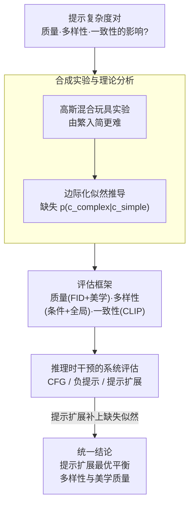

# The Intricate Dance of Prompt Complexity, Quality, Diversity, and Consistency in T2I Models

**会议**: ICLR 2026  
**arXiv**: [2510.19557](https://arxiv.org/abs/2510.19557)  
**代码**: 无  
**领域**: 图像生成 / 文本到图像  
**关键词**: T2I模型, 提示复杂度, 合成数据, 多样性, 一致性, 扩散模型

## 一句话总结

本文系统研究了文本提示（prompt）复杂度对T2I模型合成数据的质量、多样性和一致性三个关键维度的影响，提出了新的评估框架，并发现提示扩展（prompt expansion）作为一种推理时干预手段能最优地平衡多样性与美学质量。

## 研究背景与动机

文本到图像（T2I）模型能够生成几乎无限的合成数据，相比有限的真实数据集具有巨大潜力。先前工作从三个关键维度评估合成数据的效用：**质量**（生成图像的视觉逼真度）、**多样性**（覆盖不同视觉模式的程度）和**一致性**（图像与文本提示的匹配度）。然而，提示工程（prompt engineering）作为与T2I模型交互的主要手段，人们对提示复杂度如何系统性地影响这三个维度缺乏深入理解。

具体而言，存在以下关键问题：

**提示复杂度的影响未被深入研究**：简单提示（如"一只猫"）和复杂提示（如"一只橘色的缅因猫坐在古董沙发上，阳光透过窗户照射进来"）生成的图像在质量、多样性和一致性上有何不同？

**合成数据与真实数据的分布差距**：如何系统性地量化这种差距？

**推理时干预方法的比较**：如引导（guidance）、负提示（negative prompts）、提示扩展（prompt expansion）等方法各自的优劣如何？

本文的核心洞察是：提示复杂度与生成质量之间存在复杂的权衡关系，理解这层"精妙舞蹈"对于有效利用合成数据至关重要。

## 方法详解

### 整体框架

本文不训练新模型，而是想把"提示写得多复杂"这件事拆开，看清它如何同时拨动合成数据的质量、多样性、一致性三个旋钮。研究分三步推进：先在一个可控的高斯混合玩具实验里，剥离掉真实数据的噪声，单看提示复杂度与"泛化难度"的本质关系，并用一段概率推导解释玩具实验里看到的反直觉现象；再搭一套统一评估框架，沿质量、多样性、一致性三个维度给每个维度落到具体指标，让真实数据和各种提示策略下的合成数据放进同一把尺子；最后在 CC12M、ImageNet-1k、DCI 三个数据集和 LDMv1.5/XL、LDMv3.5、Flux-schnell、Infinity 等多个现成 T2I 模型上，系统比较 CFG、负提示、提示扩展等推理时干预方法，确认玩具实验里的结论在真实场景同样成立。整条线索都在推理阶段完成，不涉及任何新模型训练。

### 关键设计

**1. 合成实验与理论分析：为什么"由繁入简"反而更难**

直觉上，详细提示（"一只橘色缅因猫坐在古董沙发上"）比简单提示（"一只猫"）信息更多、应该更难，但本文的合成实验给出相反结论：让模型从更具体的条件去覆盖更一般的条件（即用复杂提示训练、再泛化到简单提示的分布）反而更困难。原因藏在概率结构里——扩散模型学的是条件分布 $p(x|c)$，$c$ 是文本条件；提示越详细，$c$ 的约束越强，生成分布越窄越精确。可一旦提示变简单，模型真正要拟合的是一个边际化的分布：

$$p(x|c_{simple}) = \int p(x|c_{complex})\, p(c_{complex}|c_{simple})\, dc_{complex}$$

这个积分里的 $p(c_{complex}|c_{simple})$ 是一个扩散模型从没被直接训练去估计的似然项。少了它，"由繁入简"就缺了一块拼图，这正是简化提示泛化更难的根因。反过来看，它也解释了一个实用现象：复杂提示虽然压低了多样性，却因为更精确地锚定了目标分布，反而缩小了合成数据与真实数据之间的分布偏移。

**2. 评估框架：把真实与合成数据放进同一把尺子**

要谈"提示复杂度的影响"，前提是有一套不偏向任何一方的度量。本文搭的评估框架沿三个维度展开，每个维度都落到具体指标上，避免只停在概念。质量用 FID（Fréchet Inception Distance）配合人类美学评分，既看分布层面的逼真度又看主观观感；多样性刻意拆成两层——条件多样性（同一提示重复采样得到的图像变化程度）和全局多样性（跨不同提示的整体覆盖范围），因为提示复杂度会反向拉动这两层；一致性则用 CLIP score 一类语义对齐度量，看生成图像到底有没有忠实于输入提示。三者合起来，才能把"提示一变、三个旋钮如何联动"完整呈现出来。

**3. 推理时干预方法的系统评估：在不重训模型的前提下调权衡**

既然质量、多样性、一致性之间是一种此消彼长的"舞蹈"，自然的问题是能否在推理时把它们调到更优的平衡点。本文把三类常见干预放进同一框架横向比较：分类器自由引导（CFG）通过给条件得分与无条件得分加权来收紧或放松生成，往往提质量但压多样性；负提示显式指定不希望出现的内容，做轻度修正；提示扩展（Prompt Expansion）则用一个预训练语言模型把简单提示自动补成详细描述。关键的再诠释在于提示扩展：结合设计 1 的推导，这个语言模型恰好扮演了扩散模型缺失的那个似然估计器——它替模型补上了 $p(c_{complex}|c_{simple})$ 这一项，于是能在不偏离真实分布太多的情况下，把多样性和美学质量同时拉到最高。

## 实验关键数据

### 主实验

在三个数据集上评估提示复杂度的影响：

| 数据集 | 提示类型 | 条件多样性 | 提示一致性 | 分布偏移 |
|--------|---------|-----------|-----------|---------|
| CC12M | 简单提示 | 高 | 高 | 大 |
| CC12M | 复杂提示 | 低 | 低 | 小 |
| ImageNet-1k | 类别名称 | 高 | 高 | 大 |
| ImageNet-1k | 详细描述 | 低 | 低 | 小 |
| DCI | 短标题 | 高 | 高 | 大 |
| DCI | 长标题 | 低 | 低 | 小 |

### 消融实验

推理时干预方法比较：

| 干预方法 | 图像多样性 | 美学质量 | 是否偏离真实数据分布 |
|---------|-----------|---------|-------------------|
| 无干预 | 基准 | 基准 | 基准 |
| CFG增强 | 降低 | 提高 | 偏离 |
| 负提示 | 轻微提高 | 轻微提高 | 轻微偏离 |
| 提示扩展 | **最高** | **最高** | 适度 |

### 关键发现

1. **提示复杂度增加** → 条件多样性降低、提示一致性降低、但合成-真实分布偏移减小。这一现象与合成实验的理论预测一致。
2. **推理时干预方法**能够增强生成多样性，但代价是可能偏离真实数据的支撑集。
3. **提示扩展通过使用预训练语言模型作为似然估计器**，在图像多样性和美学质量上一致性地取得最佳表现，甚至超过真实数据的水平。
4. **不同T2I模型之间**呈现一致的趋势，说明这些发现具有普遍性。

## 亮点与洞察

1. **首次系统刻画**：填补了提示复杂度对T2I模型合成数据效用影响的研究空白。
2. **理论解释优雅**：通过似然估计缺失这一简单机制解释了实证现象，从条件分布边际化的角度提供了深刻理解。
3. **提示扩展的新理解**：将提示扩展重新解释为"利用语言模型估计缺失的条件似然"，赋予了这一经验性技巧理论基础。
4. **实用价值高**：结论直接指导AI生成内容（AIGC）的实际应用——何时用简单提示、何时用复杂提示、如何选择干预方法。

## 局限与展望

1. **仅评估推理时干预**：未探索通过微调T2I模型本身来改善多样性-一致性-质量权衡的可能性。
2. **数据集规模有限**：虽然使用了CC12M等大数据集，但某些细粒度数据集（如DCI）的规模相对较小。
3. **未考虑下游任务性能**：评估指标主要是图像层面的度量，未在下游视觉任务（如分类、检测）上验证合成数据的实际效用差异。
4. **提示复杂度的定义较粗糙**：主要通过提示长度/详细程度来量化复杂度，未区分语义复杂性（如空间关系、属性绑定）等更细粒度的因素。
5. **缺乏对最新模型的评估**：如DALL-E 3、Midjourney V6等前沿模型的表现可能有所不同。

## 相关工作与启发

- **合成数据效用**：与Azizi et al., He et al.等在合成数据用于训练方面的工作互补，本文提供了更深入的机制理解。
- **扩散模型条件生成理论**：连接了扩散模型似然估计的理论工作，揭示了条件生成中隐含的概率结构。
- **实际启发**：对于需要大规模合成数据的应用（如数据增强、隐私保护），应根据目标任务的需求选择合适的提示复杂度和干预策略。

## 评分

- 新颖性: ⭐⭐⭐⭐ （系统性研究角度新颖，理论解释有深度）
- 实验充分度: ⭐⭐⭐⭐ （多数据集、多模型、多方法的全面评估）
- 写作质量: ⭐⭐⭐⭐ （结构清晰，理论与实验结合紧密）
- 价值: ⭐⭐⭐⭐ （对T2I合成数据应用具有重要指导意义）

<!-- RELATED:START -->

## 相关论文

- [\[ICLR 2026\] FACM: Flow-Anchored Consistency Models](facm_flow-anchored_consistency_models.md)
- [\[ICLR 2026\] GeoDiv: Framework for Measuring Geographical Diversity in Text-to-Image Models](geodiv_framework_for_measuring_geographical_diversity_in_text-to-image_models.md)
- [\[ICLR 2026\] CMT: Mid-Training for Efficient Learning of Consistency, Mean Flow, and Flow Map Models](cmt_mid-training_for_efficient_learning_of_consistency_mean_flow_and_flow_map_mo.md)
- [\[ICML 2026\] MIRO: 多奖励条件预训练同时提升 T2I 质量与效率](../../ICML2026/image_generation/miro_multi-reward_conditioned_pretraining_improves_t2i_quality_and_efficiency.md)
- [\[ICLR 2026\] Temporal Concept Dynamics in Diffusion Models via Prompt-Conditioned Interventions](temporal_concept_dynamics_in_diffusion_models_via_prompt-conditioned_interventio.md)

<!-- RELATED:END -->
