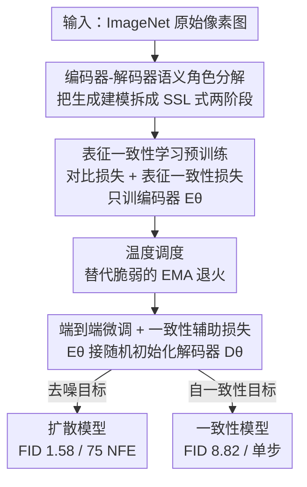

# There is No VAE: End-to-End Pixel-Space Generative Modeling via Self-Supervised Pre-Training

**会议**: ICLR 2026  
**OpenReview**: [https://openreview.net/forum?id=HbUoKPIZmp](https://openreview.net/forum?id=HbUoKPIZmp)  
**代码**: https://github.com/AMAP-ML/EPG  
**领域**: 扩散模型 / 图像生成  
**关键词**: 像素空间生成、扩散模型、一致性模型、自监督预训练、表征一致性

## 一句话总结
本文提出 EPG（End-to-end Pixel-space Generative model），用「自监督预训练编码器 + 端到端微调解码器」的两阶段框架，**彻底丢掉 VAE**、直接在像素空间训练扩散和一致性模型，在 ImageNet-256 上做到 1.58 FID（75 NFE），用约 30% 的 DiT 训练算力反超 DiT/SiT，并首次在不依赖 VAE/预训练扩散模型的前提下把一致性模型直接训到 8.82 FID（单步）。

## 研究背景与动机
**领域现状**：现代高分辨率图像生成几乎都跑在「潜空间」里——先用预训练 VAE 把图像压成 latent，再在 latent 上训扩散模型（LDM/DiT/SiT）或一致性模型。VAE 负责压缩，生成模型负责建模，二者解耦让训练高效、效果好。

**现有痛点**：但 VAE 本身是个麻烦。训 VAE 要在「压缩率」和「重建保真度」之间艰难权衡；即便训好了，对训练集之外的 latent 它的重建也会失真；更要命的是，VAE 容量一旦固定，就成了**永久的性能天花板**——生成模型再强，也被 VAE 的固定表达能力卡死。直接在像素空间训扩散模型可以绕开 VAE，但历来「训不动」：要么 backbone 算力开销巨大，要么收敛极慢，性能和效率始终追不上潜空间方法。

**核心矛盾**：像素空间的两大拦路虎是**高计算成本**和**慢收敛**。前人要么改架构、要么改扩散公式，都没能同时把质量和效率追平潜空间，本质是没找到让像素空间编码器「快速学到好语义」的办法。

**切入角度**：作者从自监督学习（SSL）的经典分工得到启发——编码器是通用视觉语义学习器，解码器是任务特定的预测头。他们大胆假设：扩散生成模型里的编码器-解码器其实可以**同样地解耦**——编码器主要从带噪输入里学高层语义，解码器则是以语义为条件的低层像素生成器。

**核心 idea**：把扩散模型训练**重构成一个像训分类器一样的自监督学习问题**：第一阶段预训练编码器、让它在不同噪声级别下都能抽出「沿同一条 ODE 采样轨迹时间一致」的语义；第二阶段把编码器接上随机初始化的解码器，端到端微调成扩散或一致性模型。一句话——「用 SSL 的两阶段范式，替代 VAE 的两阶段压缩」。

## 方法详解

### 整体框架
EPG 把像素空间生成拆成两个阶段。**阶段一（预训练）**只训编码器 $E_\theta$：用「表征一致性学习」让它从干净图像学语义，同时把不同噪声级别、但位于同一条确定性 ODE 采样轨迹上的点对齐到一起——本质是把「在强噪声图上做表征学习」改写成「生成式对齐」任务，让强噪声样本的特征连到它逐渐变干净的版本上。**阶段二（微调）**丢掉投影头，把预训练好的 $E_\theta$ 接上一个**随机初始化的解码器** $D_\theta$，端到端微调整个模型 $f_\theta$；编码器把带噪图映射成特征，解码器再把特征重建成干净像素。下游可以是扩散训练（去噪目标）也可以是一致性训练（自一致性目标）。

整个 backbone 用 Vision Transformer，输入是 `[CLS]` token + 时间条件 token + 图像 token。为了控制不同分辨率下的算力，作者**固定输入 token 长度**——分辨率涨了就按比例放大 patch（ImageNet-256 用 16×16、ImageNet-512 用 32×32），所以高分辨率几乎不增加 token 数和计算量。

### 关键设计

**1. 编码器-解码器语义角色分解：把生成建模拆成 SSL 式两阶段**

针对「像素空间训不动、收敛慢」的根本痛点，作者没有去硬改架构，而是先回答一个更本质的问题：扩散模型的编码器和解码器到底各自在学什么？他们论证编码器主要从带噪输入里学**高层视觉语义**，解码器是**以表征为条件的低层像素生成器**——这和 SSL 里「编码器学通用语义、解码器当任务头」的分工同构。于是训练范式就能像 SSL 一样拆成两段：先把编码器单独预训练好、让模型一上来就具备扎实的判别能力，再灵活地把这些表征适配到「含细节视觉语义」的生成任务上。这个洞察是全篇的地基——它把「训扩散模型」重新定义成「训一个分类器式的自监督问题」，也正是论文标题「There is No VAE」的底气：既然编码器能自己学好语义，就不再需要 VAE 来做压缩中介。

**2. 表征一致性学习：让编码器在强噪声下学到时间一致的语义**

直接拿 SSL 来预训练是行不通的——SSL 在强噪声图像上会**表征坍缩**，学不到有意义的语义。这里的难点在于扩散用的噪声级别远高于 SSL 数据增广里的那点噪声。作者扩展 rRCM 的思路，把预训练目标设计成两项之和：一个**对比损失**负责语义学习（正样本来自数据增广），一个**表征一致性损失**负责跨噪声级别的语义对齐（正样本是同一条 ODE 轨迹上时间相邻的点 $(x_{t_n}, x_{t_{n-1}})$，不同轨迹上的相邻点作负样本）。两项都用 NT-Xent 作为距离度量：

$$d_{\text{NT-Xent}}(q, q^+) = -\log \frac{\exp(q \cdot q^+/\tau)}{\exp(q \cdot q^+/\tau) + \sum_{q^-}\exp(q \cdot q^-/\tau)}$$

时间相邻的点对按 $x_{t_{n-1}} = x_{t_0} + t_{n-1}\epsilon$ 构造（$\epsilon$ 是生成 $x_{t_n}$ 时用的同一份扰动），完全不依赖任何预训练扩散模型。这样做的效果是：把「噪声图上的表征学习」重写成「沿采样轨迹的生成式对齐」，强噪声样本的特征被拽向它逐步变干净的版本，从而在所有噪声级别上都拿到时间一致的高质量语义——这正是作者实验验证出的「像素空间生成成功的钥匙」。

**3. 温度调度：去掉脆弱的 EMA 退火**

rRCM 原版框架靠**手工设计的 EMA 系数退火**来调节干净图像表征的学习速率，以缓解「把它们和大噪声样本对齐」的困难。问题是这套机制引入了一堆**强耦合的超参**和**脆弱的训练过程**——稍微偏离规定配置就可能训练坍缩，这对需要更大超参灵活度的生成任务是致命的。作者改用一个直观得多的杠杆：表征一致性损失里的温度 $\tau$。小 $\tau$ 会强制不同 ODE 轨迹上的样本强分离、同时把同轨迹内的点紧紧对齐到干净端点。固定 $\tau=0.1$ 已能逼近最终效果，但早期会有短暂不稳定（因为模型还没有有意义的特征来调和对齐、梯度有偏）。于是用一个线性插值的温度调度 $\tau(t) = \tau_1(1-t) + \tau_2 t$（$\tau_1 \le \tau_2$），让大时间步处的对齐先「松」一点，随训练推进 $\tau_2$ 按余弦调度收敛到 $\tau_1$。关键是这个调度**独立于其他超参**，不再像 EMA 退火那样牵一发动全身。

**4. 端到端微调与一致性辅助损失：让随机解码器和编码器一起长出来**

预训练后丢掉投影头，把 $E_\theta$ 和随机初始化的 $D_\theta$ 拼成完整模型端到端微调。扩散版直接用去噪目标 $\mathbb{E}[\lambda(t)\|s_\theta(x(t),t)-x(0)\|^2]$，并配时间相关加权和 LogNormal 噪声采样；选扩散而非 flow matching 是因为它和基于一致性模型理论的预训练天然兼容。一致性版则有个麻烦：标准一致性训练只从干净数据拿监督信号，收敛慢、质量差。作者补了一个**辅助损失**，把模型输出 $f_\theta(x_{t_n},t_n)$ 和生成噪声输入用的干净图 $x_0$ 对齐：

$$\arg\min_\theta \mathbb{E}\left[d_{\text{NT-Xent}}(W_\phi(f_\theta(x_{t_n},t_n),t_n), W_\phi(x_{t_0},t_0))\right]$$

其中 $W_\phi$ 是**预训练编码器的冻结副本**（不含投影头、微调中不更新）。这等于复用自家预训练权重当现成的监督源，几乎零额外成本就给一致性训练补上了互补监督信号——也正是这一步让一致性模型第一次能直接在 ImageNet-256 像素空间上训出强结果。

### 损失函数 / 训练策略
预训练 600K 步（480 epoch），batch size 1024；微调时扩散模型训 1M 步（800 epoch）、一致性模型训 700K 步（560 epoch）。FP16 混合精度。微调阶段编码器、解码器层数相同，并在两者间加残差连接、用 adaLN-Zero 把时间条件注入解码器。

## 实验关键数据

### 主实验
ImageNet-256（带 CFG）系统级对比，EPG 直接在像素空间反超潜空间 VAE 方法：

| 模型 | 空间 | FID↓ | NFE↓ | Epochs | GFLOPs↓ |
|------|------|------|------|--------|---------|
| DiT-XL/2 | Latent | 2.27 | 250×2 | 1400 | 312+119 |
| SiT-XL/2 | Latent | 2.06 | 250×2 | 1400 | 312+119 |
| JiT-G/16 | Pixel | 1.82 | 191 | 600 | 383 |
| **EPG-XXL/16** | Pixel | 1.87 | **75** | 800 | 176 |
| **EPG-G/16** | Pixel | **1.58** | **75** | 1600 | 321 |

一致性模型（单步生成，ImageNet-256），首次在纯像素空间不靠 VAE/扩散模型训成：

| 模型 | 空间 | FID↓ | NFE | #Params |
|------|------|------|-----|---------|
| iCT-XL/2 | Latent | 34.24 | 1 | 84M+675M |
| Shortcut-XL/2 | Latent | 10.60 | 1 | 84M+675M |
| IMM | Latent | 8.05 | 1 | 84M+675M（11× 算力） |
| **EPG-L/16** | Pixel | **8.82** | 1 | 540M |

训练效率（8×H200）：自家预训练只花 57 小时，比 sd-vae-mse 的 160 小时还少；EPG-XL/16 总成本 139 小时 vs DiT-XL/2 的 506 小时，FID 还更低（2.04 vs 2.27）。

### 消融实验
ImageNet-224 上对比不同像素空间预训练方案（FID）：

| 预训练方案 | 扩散 DM↓ | 一致性 CM↓ | 说明 |
|------------|---------|-----------|------|
| REPA (SiT-B) | 72.71 | - | 最差，外部特征对齐 |
| MoCo v3 ViT-B | 56.26 | 36.77 | 比从头训稳 |
| Scratch | 59.69 | NaN | 从头训，一致性直接崩 |
| rRCM | 46.51 | 37.55 | 原版框架 |
| **EPG-B/16** | **41.36** | **33.12** | 本文，两任务都最好 |

### 关键发现
- **表征质量和时间一致性是像素空间生成成功的钥匙**：EPG 全面优于 rRCM，且框架更简洁、不引入耦合超参；从头训的一致性模型直接 NaN，说明好的预训练表征是一致性训练能否跑起来的前提。
- **训练算力可换性能**：EPG-XXL/16 用约 50% 于 SiT-XL/2 的算力就反超它；整体对 DiT 只用约 30% 训练算力。
- **可扩展性**：下游性能随预训练 batch size（256→1024）和模型参数（编码器 64M→107M→225M）单调提升。
- **REPA 在像素空间反而最差**：对齐外部 SSL 特征那套在纯像素空间不灵，反证了「自家时间一致表征」的价值。

## 亮点与洞察
- **把扩散训练重定义成自监督问题**：最「啊哈」的是那个角色分解洞察——编码器学语义、解码器生成像素，于是「训扩散模型 ≈ 训分类器」。这个视角直接给了「丢掉 VAE」的合法性。
- **用预训练权重的冻结副本当一致性监督源**：不引入任何外部模型，就地复用自家编码器给一致性训练补监督，几乎零成本——这是一个非常可复用的 trick。
- **温度调度替代 EMA 退火**：把脆弱的多超参耦合换成一个独立的、直观的温度调度，是稳定性工程上很值得借鉴的「降耦合」做法。
- **固定 token 长度抗分辨率**：靠按比例放大 patch 让高分辨率几乎不涨算力，是像素空间方法控成本的实用手段。

## 局限与展望
- **只在 ImageNet 上验证**：未在更大规模、开放域或文生图任务上验证；作者把扩展到高分辨率/多模态生成列为未来工作。
- **预训练仍是额外阶段**：虽然比训 VAE 便宜，但仍需一个独立的 SSL 预训练阶段，并非真正一步到位。
- **未结合外部监督**：作者承认 EPG 与 REPA/RAE 正交、可叠加外部监督进一步提升，但本文留作未来工作。
- **一致性辅助损失偏经验性**：第 4 个设计是「empirically introduce」的，缺乏理论分析，温度调度的最优形态也以经验为主。

## 相关工作与启发
- **vs VAE 潜空间方法（LDM/DiT/SiT）**：它们靠预训练 VAE 压缩换效率，但被 VAE 固定容量卡死性能上限；EPG 直接在像素空间训、用 SSL 预训练替代 VAE，反而在同/更低算力下反超，且无重建瓶颈。
- **vs 像素空间扩散（RIN/SiD/VDM++/JiT）**：前人改架构或改扩散公式但仍追不上潜空间；EPG 把重点放在「让编码器先学好时间一致的语义」，靠预训练而非堆架构解决慢收敛，FID 和 NFE 双优。
- **vs USP / REPA**：USP 也用强表征学习阶段加速扩散训练，但在潜空间；REPA 对齐外部 SSL 特征。EPG 聚焦像素空间、且不依赖任何外部模型，实验里 REPA 在像素空间表现最差。
- **vs rRCM**：本文扩展自 rRCM，但用温度调度替掉脆弱的 EMA 退火、去掉耦合超参，DM/CM 两任务上都更好。

## 评分
- 新颖性: ⭐⭐⭐⭐⭐ 「丢掉 VAE、把扩散训练重构成 SSL 两阶段」的视角清晰且有冲击力，首次在像素空间不靠 VAE/扩散模型训成一致性模型。
- 实验充分度: ⭐⭐⭐⭐ ImageNet-256/512、扩散+一致性、效率对比、消融、可扩展性都覆盖到位，但局限于 ImageNet 单一数据集。
- 写作质量: ⭐⭐⭐⭐ 动机推导和方法叙述清楚，公式规范；部分设计偏经验、理论分析较少。
- 价值: ⭐⭐⭐⭐⭐ 给像素空间生成立了新 SOTA，并提供了一条「无 VAE、可扩展、训练高效」的实用路线，对后续高分辨率/多模态生成有直接借鉴意义。

<!-- RELATED:START -->

## 相关论文

- [\[CVPR 2026\] SpeeDiff: Scalable Pixel-Anchored End-to-End Latent Diffusion Model](../../CVPR2026/image_generation/speediff_scalable_pixel-anchored_end-to-end_latent_diffusion_model.md)
- [\[CVPR 2026\] DeCo: Frequency-Decoupled Pixel Diffusion for End-to-End Image Generation](../../CVPR2026/image_generation/deco_frequency-decoupled_pixel_diffusion_for_end-to-end_image_generation.md)
- [\[ICCV 2025\] REPA-E: Unlocking VAE for End-to-End Tuning with Latent Diffusion Transformers](../../ICCV2025/image_generation/repa-e_unlocking_vae_for_end-to-end_tuning_of_latent_diffusion_transformers.md)
- [\[ICCV 2025\] End-to-End Multi-Modal Diffusion Mamba](../../ICCV2025/image_generation/end-to-end_multi-modal_diffusion_mamba.md)
- [\[ICLR 2026\] Adapting Self-Supervised Representations as a Latent Space for Efficient Generation](adapting_self-supervised_representations_as_a_latent_space_for_efficient_generat.md)

<!-- RELATED:END -->
