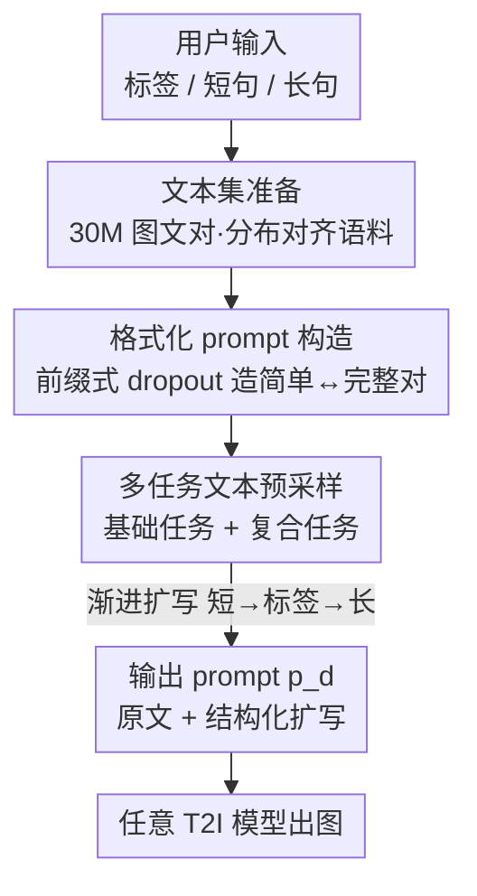

# TIPO: Text to Image with Text Pre-sampling for Prompt Optimization

**会议**: ICLR 2026  
**OpenReview**: [https://openreview.net/forum?id=dDnw3Pp70x](https://openreview.net/forum?id=dDnw3Pp70x)  
**代码**: https://github.com/KohakuBlueleaf/KGen  
**领域**: 扩散模型 / 文本到图像 / Prompt 优化  
**关键词**: prompt 优化, 文本预采样, 分布对齐, 轻量语言模型, 多任务训练

## 一句话总结
TIPO 用一个 200M 的轻量自回归语言模型，把用户随手写的简单 prompt **扩写（而非重写）**成与 T2I 模型训练文本分布对齐的详细 prompt，靠 30M 图文对语料和多任务"文本预采样"实现，在保住原意的前提下显著提升出图质量、文本对齐与人类偏好，且比 RL/大模型方案更快更省。

## 研究背景与动机

**领域现状**：现代文本到图像（T2I）模型为了精确可控，普遍在又长又细的描述上训练——可能是 Danbooru 那种逗号分隔的标签串，也可能是 VLM 生成的多句自然语言段落，而且大多还做过审美微调（如 LAION-aesthetics），偏爱细腻的艺术风格线索。结果是：高质量出图变成"有艺术功底的人才玩得转"的事，普通用户的简单 prompt 很难触发模型的最佳状态。

**现有痛点**：已有的 prompt 优化路线各有硬伤。（a）直接让通用 LLM 零样本改写——LLM 是在对话/文章这类自然语言上训练的，和 T2I 的结构化 prompt 分布差很远，改完反而更不对齐；（b）拿用户社区收集的 prompt 库去训练 LLM——受限于用户水平参差，输出不稳定；（c）用生成图的审美分数做奖励、RL 训练 prompt（如 Promptist）——计算成本高、且只对某一个特定 T2I 模型有效，换个模型就失灵。

**核心矛盾**：好 prompt 的衡量标准，本质上不是"语言通顺"也不是"审美分高"，而是**是否落在目标 T2I 模型训练文本的分布里**。现有方法要么对齐了通用语言分布（LLM）、要么对齐了某个模型的奖励（RL），都没有直接对齐"T2I 训练时见过的那一大片文本分布"。

**本文目标**：构造一个能跨多种 T2I 模型通用、且计算高效的 prompt 优化器，把任意粗糙的用户输入（标签、短句、长句都行）渐进式精炼成分布一致、细节丰富、还方便编辑的 prompt。

**切入角度**：作者把问题形式化为——在 prompt 空间 $\mathcal{P}$ 里找一个优化后的 prompt $p_o$，使 T2I 输出分布 $I_p$ 与用户意图分布 $I_u$ 之间的距离 $d$ 最小：$p_o = \arg\min_{p\in\mathcal{P}} d(I_p, I_u)$。既然 $d$ 是图像分布距离（如 FID/FDD），而 prompt 决定输出分布，那么"让 prompt 贴近训练文本分布"就是逼近这个最优解最直接的代理目标。

**核心 idea**：把 prompt 优化转化为一次大规模多任务预训练——用一个轻量语言模型，在图像采样**之前**先做一轮"文本采样"（pre-sampling），从更广的语义空间里采样出落在目标子分布内的扩写片段，**保留用户原文 + 追加结构化扩写**，而不是整段重写。

## 方法详解

### 整体框架

TIPO 要解决的是"把用户的粗 prompt 变成 T2I 模型爱看的细 prompt"，整体分三步串起来：先**准备对齐 T2I 训练分布的文本语料**（30M 图文对、40B token，从 Danbooru2023 / GBC10M / CoyoHD11M 过滤平衡而来），再把每张图的描述拆成"简单版 ↔ 完整版"的配对、构造统一格式的训练样本，最后训练一个 200M 的 LLaMA 架构自回归模型，通过多个"文本预采样"任务学会把简单输入渐进扩写成完整 prompt。推理时，用户输入（标签 / 短句 / 长句）经过若干次预采样变换，输出一个"原文 + 结构化扩写"的上下文丰富 prompt $p_d$，再喂给任意 T2I 模型出图。

整条流水线的关键在于：扩写片段是追加在用户原文后面的、呈段落或标签形态，因此既信息充足又**容易编辑或删除**——用户对哪段不满意可以直接删掉，不破坏原意。

### 关键设计

**1. 文本预采样：在采样图像之前先采样文本，把扩写约束在目标子分布内**

这是 TIPO 的核心技术，直击"通用 LLM 改写后分布漂移"这个痛点。所谓 pre-sampling 就是"text sampling before image sampling"：在 T2I 模型真正去采样图像之前，先用语言模型采样出一段文本扩写。两种朴素做法都不行——纯文本续写（plain completion）会照抄输入里那些低质量的措辞、偏离高质量 prompt 分布；整段重写（full rewrite）又有偏离用户原意的风险。TIPO 取中间路线：**保留用户原始输入，只在后面追加一段结构化、分布一致的扩写**。从分布视角看（论文 Figure 2），不做预采样只能得到基础图；加随机词会引入用户意图之外的无关内容；而 TIPO 的预采样让推断输出分布既贴合用户期望、又保留细节和多样性。这一步的本质，是把"在 prompt 空间里逼近最优 $p_o$"落地成"从高质量训练文本子分布里采样扩写段"。

**2. 前缀式 dropout：把每张图的描述拆成"简单是完整的前缀"的配对，让自回归扩写天然成立**

要训练模型"从简单扩到完整"，需要大量"简单 prompt → 完整 prompt"的配对，而真实数据里只有完整描述。TIPO 的巧思是构造时保证 **简单版 $p_s$ 永远是完整版 $p_o$ 的前缀**，这样自回归模型只需在 $p_s$ 后面续写就能补全。对标签型描述：因为标签基本顺序无关，先把完整标签集 $T=\{t_1,\dots,t_n\}$ 随机打乱，再随机选 $m<n$ 个标签得到简单子集 $T_s$，于是 $p_s=\mathrm{concat}(T_s),\ p_o=\mathrm{concat}(T)$。对自然语言描述则不能这么干——首句通常携带关键信息、句序也强烈影响语义，所以**保留首句、按原序随机丢弃部分后续句子**得到子序列 $S_s=[\text{sentence}_1, \text{sentence}_{i_2},\dots]$（$1<i_2<\dots<i_m\le n$），再令 $p_s=\mathrm{concat}(S_s),\ p_o=\mathrm{concat}(S_s, S)$ 来维持"前缀"性质。此外还把图像描述里常见的元数据统一成 `<Category>: <Content>` 形式（style / aspect ratio / quality / year 等，如 `quality: masterpiece`），既方便用户读写，又给下游 T2I 模型强引导。

**3. 多任务 + 复合任务的渐进式精炼：一个模型吃下所有输入形态，链式生成既详细又对齐**

为了让单个轻量模型适配标签、短句、长句各种输入，TIPO 把 prompt 优化拆成一组预采样子任务并在训练时随机采样。**基础任务**做单步变换：`tag to long`（给标签生成 NL）、`long to tag`（给 NL 扩标签）、`short to tag`（给简单 prompt 扩标签）、`short to long`（给短 NL 生成精炼长 NL）；**复合任务**在一次前向里链接两个变换，如 `short to tag to long`、`short to long to tag`、`tag to short to long`——复合任务让模型见到更整体的训练信号、同时减少推理开销。推理时这些任务被串成渐进流程：例如同时有标签 $T_s$ 和短 NL $S_s$ 时，先 `short to tag` 用 $T_s$ 生成详细标签 $T_d$，再 `tag to long` 由 $T_d$ 产出精炼短 NL，接着 `short to tag to long` 综合 $T_d$ 与 NL 生成完整长 NL $S_d$，最后把 $T_d$、$S_d$ 和元数据聚合成上下文丰富的 $p_d$。这种"逐层加料"的方式让 prompt 既细致、又始终锚定在用户输入和训练分布上。

### 损失函数 / 训练策略

模型采用 LLaMA 架构，主实验用 200M 参数（另训了 100M / 500M 变体做规模分析）。训练目标是标准自回归语言建模——在前缀 $p_s$ 条件下预测完整 $p_o$ 的后续 token；训练时从上述基础/复合任务里随机采样以增强泛化。训练语料约 40B token，来自 Danbooru2023、GBC10M、CoyoHD11M。

## 实验关键数据

### 主实验

主对比覆盖 in-domain（标签型、短 NL、截断长 NL）与 out-of-domain 三类设置，指标为 FDD↓（Fréchet DINO Distance，比传统 FID 更贴近人感知）、Aesthetic↑、AI Corrupt↓（检测伪影）、Vendi↑（多样性）。基线含 GPT-4o-mini 零样本改写、MagicPrompt（GPT-2 微调）、Promptist（RL）。

| 任务 / 指标 | Original | GPT | MagicPrompt | Promptist | TIPO |
|------|------|------|------|------|------|
| In-domain 标签 · FDD↓ | 0.3558 | 0.5414 | 0.3247 | 0.2350 | **0.2282** |
| In-domain 标签 · Corrupt↓ | 0.5743 | 0.2510 | 0.4976 | 0.4331 | **0.0805** |
| In-domain 短NL · Corrupt↓ | 0.2887 | 0.3015 | 0.2936 | 0.3686 | **0.2870** |
| 截断长NL · Aesthetic↑ | 5.7497 | **6.0168** | 5.8191 | 5.7759 | 5.8364 |
| OOD · Vendi↑ | N/A | 8.97 | 15.87 | 16.49 | **21.57** |
| **总体平均排名↓** | 2.58 | 3.00 | 3.00 | 3.87 | **2.07** |

要点：TIPO 在标签型任务上把 AI Corrupt 从 0.43（Promptist）/0.25（GPT）压到 **0.0805**，FDD 也最低，说明它和 T2I 分布对齐得最好；GPT 虽然审美分常最高，但 FDD 差、伪影多，是"语言好看但分布不对"的典型。综合平均排名 TIPO **2.07** 居首。

### 兼容性与效率

| 维度 | 结果 |
|------|------|
| 未公开训练数据的 T2I 模型（FLUX.1-dev / Omnigen2 / Lumina-2 / HiDream-I1 / Gemini-2.0-Flash） | TIPO 普遍提升审美分、降低伪影；即便 Gemini 自带优化，TIPO 仍有可测增益 |
| Prompt 生成延迟 | TIPO 1.03s，比 Promptist 快 **29.4%**、比 PromptExtend 快 25.6%、比 MagicPrompt 快 9.6% |
| 人类偏好（221 人、1400+ 对比） | TIPO 总体胜率 **51.3%**，OOD 升至 52.5%，均显著领先；摘要另报 62.8% 的成对胜率 ⚠️ 以原文为准 |
| 分布对齐（T5-XXL / Jina 文本编码器，FD & MMD↓） | TIPO 在所有 prompt 类型/编码器/指标下都取得最优对齐（如 NL-short Jina FD 0.0322 vs Promptist 0.1003） |

### 关键发现
- **分布对齐是增益的根因**：Table 5 直接验证了假设——TIPO 优化后的 prompt 在嵌入空间里离 T2I 训练文本最近，且对编码器不敏感，这解释了它为何 FDD/Corrupt 全面领先。
- **审美分 ≠ 好结果**：GPT 常拿最高 Aesthetic，但 FDD 高、伪影多，提醒不能只看单一审美指标；Vendi 也被作者明确指出会被低层噪声拉高，需配合质量指标一起看。
- **OOD 下多样性反超**：当 T2I 模型（SD-3.5-Large）训练文本与 TIPO 不重叠时，GPT 生成的 prompt 准确但缺多样性，TIPO 扩写后 Vendi 从 ~9 提到 **21.57**，在保持主题一致的同时显著增多样性。

## 亮点与洞察
- **"扩写而非重写"是关键工程取舍**：保留用户原文、只追加可删可改的结构化片段，既避免续写照抄低质措辞，又避免重写跑偏原意——这个"前缀追加"设计同时解决了对齐和可控两个问题。
- **前缀式 dropout 把无配对数据变成有配对训练信号**：标签随机选子集、NL 保首句丢后句，巧妙地用一份完整描述同时造出"简单"和"完整"两端，且天然满足自回归续写，这个构造可迁移到任何"简→繁"的序列扩写任务。
- **轻量模型 + 大规模分布对齐打赢重量级 RL/LLM**：200M 模型靠 30M 语料的分布对齐，在质量、对齐、人类偏好上压过 GPT-4o-mini 和 RL 方案，还更快——证明"对齐目标分布"比"堆模型规模"更划算。

## 局限与展望
- 作者把更强 backbone（GPT/Qwen 等）留作 future work，当前只验证了 LLaMA-200M，更大模型能否进一步提升效率/效果未知。
- 在 in-domain 短/长 NL 设置下，TIPO 与 Original 在 FDD/Vendi 上互有胜负（所有方法都会牺牲保真度和多样性），收益不如标签型任务那么显著——分布对齐的红利在标签型、OOD 场景更明显。
- 摘要报的 62.8% 胜率与正文 Figure 5a 的 51.3% 口径不同（可能是特定子集或不同统计方式），引用时需注意 caveat。
- 方法高度依赖"能拿到贴近 T2I 训练分布的大规模语料"，对训练数据完全私有且分布迥异的闭源模型，增益会被压薄（如 Omnigen2 上部分指标反降）。

## 相关工作与启发
- **vs Promptist（RL）**: Promptist 用 CLIP 相关性分数做奖励、对单个 T2I 模型在线 RL 优化，成本高、换模型即失效（只用 90K 样本）；TIPO 用 30M+ 样本做分布对齐的离线预训练，跨模型通用且快 29.4%。
- **vs 直接 LLM 改写（GPT-4o-mini）**: GPT 在通用语言分布上训练，改写后审美分高但分布漂移、FDD 差；TIPO 直接对齐 T2I 训练文本分布，FDD/Corrupt 全面更优。
- **vs MagicPrompt（用户 prompt 库微调 GPT-2）**: 受用户水平参差限制、输出不稳定；TIPO 用过滤平衡的大规模语料，质量与一致性更高。
- **vs VLM 迭代精炼（He et al. 2025 等）**: 那类方法靠 VLM 多轮"出图→评估→改 prompt"，但 VLM 与 T2I 训练数据的分布失配始终存在、且要多轮推理；TIPO 一次前向（含复合任务）就完成，无需出图反馈回环。

## 评分
- 新颖性: ⭐⭐⭐⭐ "图像采样前先做文本预采样"+"分布对齐而非奖励对齐"的视角清晰且落地，前缀式 dropout 构造巧妙。
- 实验充分度: ⭐⭐⭐⭐⭐ 覆盖 in/out-domain、8+ 种 T2I backbone、效率、221 人用户研究、嵌入空间分布对齐多角度验证，证据链完整。
- 写作质量: ⭐⭐⭐⭐ 问题形式化清晰、图示直观；个别指标口径（62.8% vs 51.3%）需读者自行对齐。
- 价值: ⭐⭐⭐⭐⭐ 轻量、跨模型通用、即插即用且更快，对 T2I 实用 prompt 工程价值很高，已开源。

<!-- RELATED:START -->

## 相关论文

- [\[ICLR 2026\] Long-Text-to-Image Generation via Compositional Prompt Decomposition](long-text-to-image_generation_via_compositional_prompt_decomposition.md)
- [\[CVPR 2025\] Minority-Focused Text-to-Image Generation via Prompt Optimization](../../CVPR2025/image_generation/minority-focused_text-to-image_generation_via_prompt_optimization.md)
- [\[ICLR 2026\] Diverse Text-to-Image Generation via Contrastive Noise Optimization](diverse_text-to-image_generation_via_contrastive_noise_optimization.md)
- [\[ICLR 2026\] Consistent Text-to-Image Generation via Scene De-Contextualization](consistent_text-to-image_generation_via_scene_de-contextualization.md)
- [\[CVPR 2026\] Curriculum Group Policy Optimization: Adaptive Sampling for Unleashing the Potential of Text-to-Image Generation](../../CVPR2026/image_generation/curriculum_group_policy_optimization_adaptive_sampling_for_unleashing_the_potent.md)

<!-- RELATED:END -->
