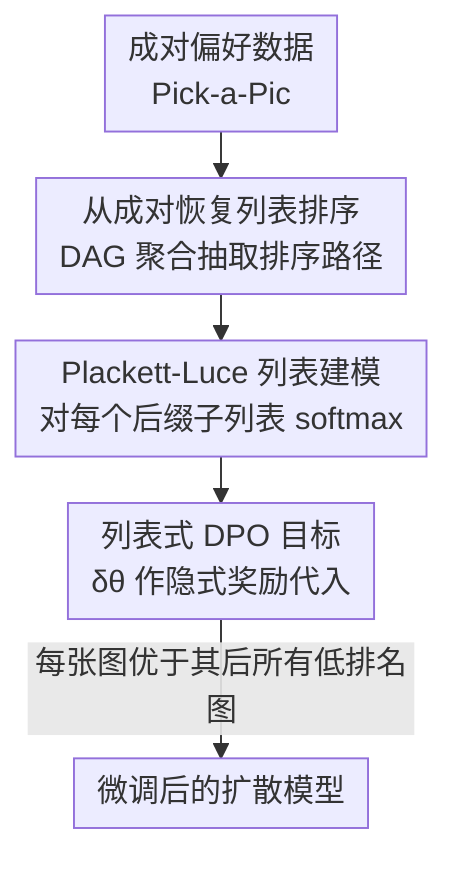

# Towards Better Optimization for Listwise Preference in Diffusion Models

**会议**: ICLR 2026  
**OpenReview**: [https://openreview.net/forum?id=ippWaS9PG9](https://openreview.net/forum?id=ippWaS9PG9)  
**领域**: 扩散模型 / 对齐RLHF  
**关键词**: 扩散模型对齐, 列表偏好优化, Plackett-Luce, Direct Preference Optimization, 文生图

## 一句话总结
本文提出 Diffusion-LPO，把扩散模型的 DPO 偏好对齐从"成对比较"推广到"整条排序列表"——用 Plackett-Luce 模型导出一个让每张图都优于所有比它低排名图的列表式目标，在文生图、图像编辑、个性化对齐三类任务上一致超过成对 Diffusion-DPO（SD1.5 上 PickScore 胜率提升超 12%）。

## 研究背景与动机
**领域现状**：文生图扩散模型（Stable Diffusion、SDXL 等）预训练后需要进一步与人类偏好对齐。借鉴 LLM 的 RLHF，主流做法是 Direct Preference Optimization（DPO）——绕开显式奖励模型，直接让模型偏向人类更喜欢的输出。Diffusion-DPO 把这套思路搬到扩散模型上，用去噪损失的相对改善当作隐式奖励，已成为对齐扩散模型的主力方法。

**现有痛点**：几乎所有扩散模型的 DPO 工作都只用**成对偏好**数据，背后是 Bradley-Terry 模型——它只能把"赢家 vs 单个输家"的二元胜负塞进目标。但人类的偏好天然是**排序列表**而非孤立的两两对比：用户面对一组候选图时给出的是相对次序。把列表硬拆成两两对比会丢掉排序里蕴含的传递性结构信息。作者在 Pick-a-Pic 数据集上观察到，**56% 的成对标注其实可以聚合成长度 >2 的一致排序**，这些更丰富的排名信息在成对建模里被白白浪费了。

**核心矛盾**：人类反馈本质是列表排序，而现有目标函数只建模成对关系；想用列表信息又面临两难——已有的列表扩展（如把长度 m 的排序拆成 $m(m-1)/2$ 个对）要么需要额外的奖励/评估器给每张图打分（带来额外算力和资源负担），要么把排序退化成等权重的两两比较、丢失列表的整体归一化结构。

**本文目标**：在不引入额外奖励模型的前提下，让扩散模型直接从列表式人类反馈里学习完整的相对排序。

**切入角度**：作者注意到成对标注里隐含着可恢复的排序（$x^{(a)}\succ x^{(b)}$ 且 $x^{(b)}\succ x^{(c)}$ 蕴含 $x^{(a)}\succ x^{(b)}\succ x^{(c)}$），而 Plackett-Luce（PL）模型正是为列表排序设计的概率模型——它能在每一步把"当前最优项"与"所有剩余更低排名项"做 softmax 归一化，自然地刻画整条排序。

**核心 idea**：用 Plackett-Luce 模型代替 Bradley-Terry，导出一个列表式 DPO 目标，强制每个样本优于其后所有低排名样本，从而保留列表内的完整相对次序；当列表长度为 2 时它精确退化为 Diffusion-DPO。

## 方法详解

### 整体框架
Diffusion-LPO 的整体管线是：先把 Pick-a-Pic 中零散的成对偏好（同一 prompt 下的 $x_a\succ x_b$、$x_b\succ x_c$）聚合成有向无环图（DAG），从中抽取出列表式排序路径 $x^{(1)}\succ x^{(2)}\succ\cdots\succ x^{(m)}$；然后用 Plackett-Luce 模型给整条排序定义似然，并把扩散模型的去噪改善量 $\delta_\theta$ 当作隐式奖励代入，导出列表式偏好优化目标 $L_{\text{Diffusion-LPO}}$；最后用这个目标微调扩散模型，使其在每一步都把高排名图的奖励归一化地压过所有低排名图。整个方法不需要任何外部奖励模型或评估器。

### 关键设计

**1. 从成对偏好恢复列表排序：把零散两两标注聚合成 DAG 排序路径**

这一步针对的痛点是"现成数据集只有成对标注、没有现成的列表"。作者不去额外采集列表数据，而是利用成对偏好的传递性：同一 prompt $c$ 下若有 $x_a\succ x_b$ 和 $x_b\succ x_c$，就能拼出 $x_a\succ x_b\succ x_c$。具体做法是把所有成对偏好组织成一张**有向无环图（DAG）**，节点是图像、边是偏好方向，再从图里抽取出有向路径当作排序子列表。这样无需任何人工额外标注或奖励模型打分，就把 Pick-a-Pic 里 56% 可聚合的成对标注变成了信息更丰富的列表监督信号。实现时列表长度可变，作者把最大列表长度截到 8（约 95% 的列表长度 $\le 8$），训练时列表大小在 2 到 8 之间；长度为 2 时目标自动退化成标准成对 Diffusion-DPO。

**2. Plackett-Luce 列表偏好目标：让每张图归一化地优于其后所有低排名图**

这是全文的核心。给定 prompt $c$ 下一组排好序的候选 $G=\{x^{(1)},\dots,x^{(m)}\}$，Plackett-Luce 模型把这条排序的概率写成对每个后缀子列表的 softmax 连乘：

$$p_{\text{PL}}(x^{(1)}\succ\cdots\succ x^{(m)}\mid c)=\prod_{j=1}^{m}\frac{\exp\big(r(c,x^{(j)})\big)}{\sum_{k=j}^{m}\exp\big(r(c,x^{(k)})\big)}$$

它的含义是：在第 $j$ 步，被选中的 $x^{(j)}$ 要在"它自己加上所有剩余更低排名候选"里拿到最高偏好。把它套进 RLHF 目标（带对参考策略的 KL 正则），并沿用 Diffusion-DPO 的做法——用去噪改善量 $\delta_\theta(c,x_t,t):=-\big(\|\epsilon-\epsilon_\theta(x_t,c,t)\|_2^2-\|\epsilon-\epsilon_{\text{ref}}(x_t,c,t)\|_2^2\big)$ 当隐式奖励的代理——就得到列表式目标：

$$L_{\text{Diffusion-LPO}}(\theta)=-\mathbb{E}\sum_{j=1}^{m}\Big[\beta T\omega(\lambda_t)\,\delta_\theta(c,x_t^{(j)},t)-\log\sum_{k=j}^{m}\exp\big(\beta T\omega(\lambda_t)\,\delta_\theta(c,x_t^{(k)},t)\big)\Big]$$

它对排序里的每个位置 $j$ 都施加一次约束：当前正样本 $x^{(j)}$ 的隐式奖励要压过"从 $j$ 到 $m$ 这一整段负样本集合"的 log-sum-exp 归一化项。和成对 DPO 只比较一个赢家对一个输家不同，这个目标在整条排序上强制一致性，保留了列表的完整相对次序，且当 $m=2$ 时精确还原 Diffusion-DPO。这种列表式形式是通用的，可以套到 DSPO 等其它成对 DPO 方法上进一步涨点。

**3. 列表归一化优于成对分解：理论上修正 GP-DPO 对负样本奖励的低估**

作者把"把列表拆成 $m(m-1)/2$ 个等权重对再做成对 DPO"的朴素做法命名为 **Group Pairwise DPO（GP-DPO）**，并从理论上说明它为什么不如 Diffusion-LPO。记 $s_\theta^{(j)}:=\frac{p_\theta(x_{0:T}^{(j)}\mid c)}{p_{\text{ref}}(x_{0:T}^{(j)}\mid c)}$ 为与策略相关的分数。把 $x^{(j)}$ 当正样本、对其负样本集合优化时，两者给负样本组算出的"聚合奖励"形式不同：Diffusion-LPO 直接对整个负样本组做 $\log\sum_{k=j}^{m}(s^{(k)})^\beta$ 的归一化，而 GP-DPO 是对每个负样本单独配对再平均 $\frac{1}{m-j+1}\sum_k\log((s^{(j)})^\beta+(s^{(k)})^\beta)$。作者证明前者是后者的上界（式 8），意味着 GP-DPO 会**低估负样本组的聚合奖励**，从而虚高了正样本 $x^{(j)}$ 与负样本之间的 margin。这个"虚高 margin"正是把排序退化成等权重两两对比的副作用；Diffusion-LPO 在整个负样本组上统一归一化，才真正保证高排名样本被恰当地favor over低排名样本。这条分析为消融里 LPO 稳定胜过 GP-DPO 提供了理论解释。

### 损失函数 / 训练策略
训练目标即上面的 $L_{\text{Diffusion-LPO}}$，骨干为 SD1.5 与 SDXL，数据为 Pick-a-Pic v1 经 DAG 聚合得到的列表（最大长度 8）。$\beta$ 为 KL 正则强度，$\omega(\lambda_t)$ 按时间步信噪比重加权，$T$ 为扩散步数。只与不需要额外奖励模型/评估器的基线（SFT、Diffusion-DPO、DSPO）做公平比较。

## 实验关键数据

### 主实验
文生图对齐：在 Pick-a-Pic / Parti-Prompts / HPSV2 三个评测集上，用 PickScore(PS)、HPSV2、CLIP、Image Reward(IM)、Aesthetic(AES) 五个自动评估器算相对原始模型的胜率。

| 骨干 | 评测集 | 指标 | Diffusion-LPO | Diffusion-DPO | 说明 |
|------|--------|------|---------------|---------------|------|
| SD1.5 | Pick-a-Pic | PS↑ | **80.4%** | 68.2% | PickScore 胜率 +12% |
| SD1.5 | HPSV2 | PS↑ | **82.9%** | 69.5% | 一致大幅领先 |
| SDXL | Parti-Prompts | PS↑ | **72.8%** | 66.8% | +6% |
| SDXL | HPSV2 | HPS↑ | **85.0%** | 80.0% | +5% |
| SDXL | Pick-a-Pic | IM↑ | **73.7%** | 66.4% | 多数指标超过 v2 数据训练的 DPO* |

Diffusion-LPO 在 SD1.5 上 PickScore 全评测集提升超 12%，并在多数指标上**超过用近两倍数据量（Pick-a-Pic v2）训练的 Diffusion-DPO\***。SFT 在 SD1.5 上尚有竞争力，但到 SDXL 上胜率跌破 50%（训练数据质量与 SDXL 高生成质量不匹配），而 LPO 靠相对排序信息稳定领先。

图像编辑（InstructPix2Pix，SD1.5）：相对 Diffusion-DPO，DINO 胜率 +4.3%、CLIP +3.6%、L1 +3.8%；在 ImgEdit 基准上用 GPT-4o 评判，对 Diffusion-DPO 胜率 56.3%。

个性化偏好（PPD 管线，SD1.5）：把 PPD 的成对损失换成 LPO 后，held-in 用户胜率 71.1%→72.3%，held-out 用户 70.3%→**80.2%**，对未见用户的泛化提升尤为明显。

### 消融实验

| 配置 | 关键指标 | 说明 |
|------|---------|------|
| LPO vs GP-DPO (PS, Pick-a-Pic) | 52.3% | LPO 对成对分解的胜率，除 CLIP 外均统计显著 |
| LPO vs GP-DPO (AES, Pick-a-Pic) | 53.7% | 列表归一化的实证优势 |
| Max list size = 4 | Avg 68.2% | 列表偏短 |
| Max list size = 8 | Avg 69.1% | 4→8 整体 +1% |
| Max list size = 12 | Avg 69.3% | 8→12 仅边际提升 |

### 关键发现
- **列表归一化 > 成对分解**：在同等训练设置下 Diffusion-LPO 稳定胜过 GP-DPO，且除 CLIP 外的指标提升统计显著，实证印证了 4.2 节"GP-DPO 低估负样本聚合奖励、虚高 margin"的理论。
- **列表长度 8 已够**：最大列表从 4 增到 8 带来约 1% 整体提升，再增到 12 几乎无差别——与数据里约 95% 列表长度 $\le 8$ 的分布吻合。
- **泛化收益最大在未见用户**：个性化任务里 held-out 用户胜率从 70.3% 跳到 80.2%，说明列表监督带来的相对排序信息对泛化特别有帮助。
- **通用即插即用**：LPO 作为成对 DPO 的推广，套到 DSPO、PPD 上都能进一步涨点，对 U-Net（SD1.5/SDXL）和 DiT（SD3.5-Medium）骨干都有效。

## 亮点与洞察
- **"成对标注里藏着列表"是个干净的观察**：不需要采集新数据，靠 DAG 聚合传递性就把已有成对偏好升级成列表监督——56% 标注可被复用，几乎零额外成本拿到更丰富的信号。
- **Plackett-Luce 的后缀 softmax 正好契合 DPO 的隐式奖励**：列表似然写成对每个后缀子列表的归一化，天然对应"每张图压过其后所有低排名图"，且 $m=2$ 退化为 DPO，让方法成为 DPO 家族的严格推广而非另起炉灶。
- **理论上点明成对分解的系统性偏差**：用一个上界不等式说清 GP-DPO 为何低估负样本奖励、虚高 margin，这个分析可迁移去审视其它"把排序拆成等权重对"的对齐方法。
- **可迁移性强**：列表式目标是即插即用的损失替换，原则上任何建立在 Diffusion-DPO 之上的方法（DSPO、个性化 PPD）都能直接受益。

## 局限与展望
- **依赖数据里能聚合出足够长的一致排序**：若成对偏好稀疏或存在大量冲突（DAG 出环/路径短），可恢复的列表信息有限，收益会缩水；本文 56% 可聚合率是 Pick-a-Pic 的特性，不一定推广到其它数据集。
- **评测多用自动评估器与 GPT-4o 判分**：PickScore/HPS 等评估器本身有偏，胜率高不完全等同真实人类偏好提升；不同任务/评测器的胜率不可直接横向比大小。
- **列表内仅用全序假设**：方法假设可抽出全序路径，对"部分序/并列偏好"的处理（DAG 里不可比的节点）讨论较少。
- **改进方向**：探索带不确定性/并列的列表建模、把列表长度与 $\beta$ 联合自适应、以及在更强 DiT 骨干和更大规模偏好数据上的扩展。

## 相关工作与启发
- **vs Diffusion-DPO**：DPO 用 Bradley-Terry 只建模成对、赢家 vs 单个输家；本文用 Plackett-Luce 建模整条排序、每张图压过其后全部低排名图，$m=2$ 时退化为 Diffusion-DPO，是其严格推广，对齐质量更高。
- **vs GP-DPO（把列表拆成等权重成对）**：GP-DPO（也见于 Chen et al. 2025）把排序退化成 $m(m-1)/2$ 个等权对，理论上低估负样本聚合奖励、虚高 margin；本文在整个负样本组上统一归一化，消融里稳定胜过 GP-DPO。
- **vs 需要外部评估器的列表方法**：已有列表扩展（Chen et al. 2025；Karthik et al. 2024）依赖辅助评估器给每张图打奖励分，带来额外算力开销；本文只用去噪改善量当隐式奖励，无需任何外部奖励模型。
- **vs DSPO / Diffusion-KTO / MaPO**：这些都是成对 DPO 家族的不同变体；本文的列表式目标可作为正交的损失替换叠加上去（论文以 DSPO 为例验证了进一步涨点）。

## 评分
- 新颖性: ⭐⭐⭐⭐ 把 Plackett-Luce 列表偏好系统地引入扩散模型 DPO，并给出对成对分解的理论优越性分析
- 实验充分度: ⭐⭐⭐⭐ 覆盖文生图/编辑/个性化三类任务、两种骨干，含 GP-DPO 对比与列表长度消融及显著性检验
- 写作质量: ⭐⭐⭐⭐ 动机与推导清晰，从观察到目标到理论一气呵成
- 价值: ⭐⭐⭐⭐ 即插即用、零额外数据成本，可叠加到整个 Diffusion-DPO 家族

<!-- RELATED:START -->

## 相关论文

- [\[ICLR 2026\] Reinforcing Diffusion Models by Direct Group Preference Optimization](reinforcing_diffusion_models_by_direct_group_preference_optimization.md)
- [\[ICLR 2026\] Diffusion Negative Preference Optimization Made Simple](diffusion_negative_preference_optimization_made_simple.md)
- [\[ICLR 2026\] ViPO: Visual Preference Optimization at Scale](vipo_visual_preference_optimization_at_scale.md)
- [\[AAAI 2026\] Rethinking Direct Preference Optimization in Diffusion Models](../../AAAI2026/image_generation/rethinking_direct_preference_optimization_in_diffusion_models.md)
- [\[ICLR 2026\] PCPO: Proportionate Credit Policy Optimization for Preference Alignment of Image Generation Models](pcpo_proportionate_credit_policy_optimization_for_preference_alignment_of_image_.md)

<!-- RELATED:END -->
