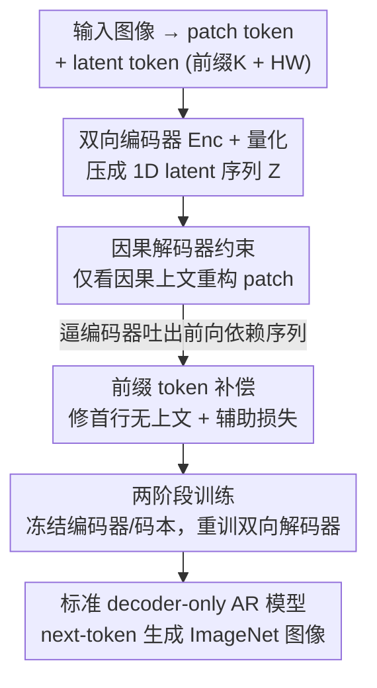

# Towards Sequence Modeling Alignment Between Tokenizer and Autoregressive Model

**会议**: ICLR 2026  
**OpenReview**: [https://openreview.net/forum?id=GT3obnZ5Fk](https://openreview.net/forum?id=GT3obnZ5Fk)  
**代码**: https://github.com/ (有，论文中标注 AliTok 仓库)  
**领域**: 图像生成 / 自回归 / 视觉 Tokenizer  
**关键词**: 视觉 Tokenizer、自回归图像生成、因果解码器、前向依赖、ImageNet

## 一句话总结
本文指出常规图像 tokenizer 编码出的 token 之间存在**双向依赖**，与自回归（AR）模型严格单向的预测范式根本冲突；提出 AliTok，用一个**因果解码器去约束双向编码器**，逼出既语义丰富又高度可预测的 token 序列，让一个仅 662M 参数的标准 decoder-only AR 模型在 ImageNet-256 上达到 gFID 1.28，首次超过 SOTA 扩散模型且采样快 10×。

## 研究背景与动机

**领域现状**：GPT 风格的 decoder-only Transformer 凭借「下一个 token 预测」这一简单可扩展的范式横扫 NLP，社区自然想把它照搬到图像生成——把图像压成 1D token 序列，按光栅扫描顺序逐个预测。这条路最大的吸引力是「简单 + 易于多模态统一」。

**现有痛点**：但实践中，标准光栅序 AR 模型（如 LlamaGen）在图像上效果一直不理想。为了救场，近期工作纷纷改造模型/生成范式——掩码自回归（MaskGIT、MAR）、next-scale 预测（VAR）、随机顺序（RandAR）等，这些方法都在 AR 内部塞进了**双向注意力**。它们确实更强，但代价是把生成流程搞复杂、偏离了经典 AR 范式，也增加了多模态统一的难度。

**核心矛盾**：作者把问题刨到根上——不是 AR 模型不行，而是**数据本身的依赖结构错了**。语言天然紧凑，词和索引可以一一映射；图像高维冗余，必须用可学习 tokenizer 压缩。而为了把重构保真度做到最高，常规 tokenizer 会**鼓励所有 token 全局协同编码**：一个 token 的表示隐式依赖它的非因果上下文，尤其依赖光栅序里它**后面**的 token。于是目标 token $x_i$ 依赖未来内容 $x_{>i}$，AR 要学的条件分布 $p(x_i \mid x_{<i})$ 变成对所有未知未来的边缘化，天然高熵，收敛和生成质量都被压死。

**本文目标**：不去改模型来迁就数据，而是反过来——能不能把**前向依赖**直接注入 token 序列，让数据去对齐 decoder-only AR 的简洁威力？子问题有二：(1) 如何让序列高度可预测；(2) 又不牺牲重构保真度。

**切入角度**：作者先做了个验证实验——强行把编码器改成因果结构（禁止前面的 patch 看到未来）。结果很有教育意义：AR 训练准确率从 5.4% 飙到 11.2%（序列可预测性大幅提升），但全局感受野的丢失让重构 rFID 从 0.98 崩到 1.56。这说明「可预测」和「高保真」之间存在真实的张力，关键是要**两者兼得**。

**核心 idea**：把「全局语义构建」与「序列的因果约束」**解耦**——让双向编码器照常用全局感受野建语义，但耦合一个**因果解码器**当隐式正则器，逼编码器把重构所需信息全部组织进每个 token 的因果历史里，从而吐出既语义丰富又高度可预测的序列。

## 方法详解

### 整体框架
AliTok 是一个建立在 vanilla ViT 上的 tokenizer。输入图像 $I \in \mathbb{R}^{h\times w\times 3}$ 先切成 patch token $P$（patch size $f=16$）；同时引入 $K + H\times W$ 个 latent token（$K=16$ 个前缀 token + $H\times W=256$ 个对应 patch 的 latent token）作为信息载体。把 latent token 和 patch token 拼接喂进双向编码器 Enc，压缩后**丢掉 patch token、只保留 latent token** $Z \in \mathbb{R}^{(K+H\times W)\times D}$，经向量量化 Quant 后由解码器 Dec 重构。

整套训练分**两阶段**：第一阶段用**因果解码器**约束编码器，产出「生成友好」的编码器和码本；第二阶段冻结编码器和码本，**单独重训一个双向解码器**专攻重构细节，同时训练 AR 生成模型。这样既保住了 token 序列的可预测性（生成靠第一阶段的编码器），又把重构保真度补回来（解码靠第二阶段的双向解码器）。前缀 token 则是为了修补因果约束带来的「首行无上文」副作用。

### 关键设计

**1. 因果解码器约束：用受限感受野逼编码器写出「前向依赖」序列**

这是全文的核心。痛点在于：双向编码器为了压缩会让 token 互相依赖未来，导致 AR 学不动。AliTok 不去动编码器结构，而是在**解码端**加一道枷锁——解码器只能按光栅因果顺序看 token，第 $i$ 个 patch 的重构只允许条件于它的因果上文：

$$\{\hat{p}_k\}_{k=1}^{i} = \text{Dec}_{\text{causal}}(\{\text{Quant}(z_k)\}_{k=1}^{i}).$$

这个架构约束充当了**强隐式正则器**：编码器若想在「只能看因果上文」的解码器下把重构损失压低，就被迫改变编码行为——把重构 patch $p_i$ 所需的上下文信息**主动组织进因果序列 $z_{1\ldots i}$ 里**。于是 token 依赖结构和 AR 生成过程被强行对齐，next-token 预测对 AR 来说变得「定义良好」，训练更稳、生成质量更高。第一阶段的重构损失沿用标准配方 $L_{\text{recon}} = L_{\text{mse}} + L_{\text{perc}} + L_{\text{quant}} + \lambda L_{\text{adv}}$（$\lambda=0.1$，GAN 用 Open-MagViT2）。和「直接把编码器改成因果结构」相比，本设计的妙处是：编码器仍是双向、仍有全局感受野去建语义，只是被解码端的因果约束牵引去**组织**信息顺序——这正是「可预测」与「高保真」能兼得的关键。

**2. 前缀 token：补偿因果约束下首行「无上文可看」的重构塌陷**

因果光栅解码有个硬伤：图像第一行（16×256 像素）前面没有任何上文，重构质量会很差。一个朴素办法是多训一行、最后裁掉，但裁掉会丢失最顶行信息、生成出残缺物体。AliTok 改为引入 $K=16$ 个**前缀 token**，每个专门服务第一行的一个 patch，提供上下文先验。它们由专门的辅助损失 $L_{\text{aux}}$（含 MSE + 感知损失）优化。由于感知损失需要完整图像评估，作者把「前缀 token 重构出的第一行」与「后 240 个 latent token 重构出的其余 15 行」拼成整图，但**在拼接前 detach 掉后者的梯度**——这样感知网络评估的是空间连贯的整图，而优化信号只回传到前缀 token 的重构结果上，互不污染。

**3. 两阶段训练 + 双向解码器重训：把第一阶段牺牲掉的重构细节补回来**

第一阶段为了可预测性用了因果解码器，重构保真度难免有损。第二阶段**冻结编码器和码本**，单独重训一个**双向解码器**专攻细节一致性：把解码器注意力换回双向，并加入 64 个 buffer token（借鉴 MAR）通过增加计算量增强建模能力，同时撤掉前缀 token 上的损失让解码器专注重构质量。这一拆分很关键——生成时 AR 模型吃的是第一阶段那个「生成友好」的编码器/码本，所以可预测性不受影响；而最终把 token 解码成像素时走的是第二阶段这个高保真双向解码器，所以视觉连续性和细节都拉回来了。

### 损失函数 / 训练策略
- 第一阶段 600K 步、第二阶段 300K 步，均在 32×A800-80G 上从零训 tokenizer（ImageNet-1K）；词表大小 4096，配在线特征聚类使码本利用率 100%。
- 编码器用 ViT-B、解码器用 ViT-L（基于 TA-TiTok 设计）。
- AR 模型沿用 LlamaGen 架构（RMSNorm 预归一 + 逐层 2D RoPE），仅两处小改：因有 16 个前缀 token 需建模 272 个 token，前缀用 1D RoPE、其余 256 个用 2D RoPE；并加入 QK-Norm 稳定大模型训练。B/L 模型训 800 epochs、XL 训 400 epochs，batch size 2048，学习率 4e-4，CFG 训练时以 0.1 概率丢弃类别条件。

## 实验关键数据

### 主实验
ImageNet-1K 256×256 条件生成（gFID 越低越好）：

| 类型 | 模型 | #Para. | gFID (w/o cfg) ↓ | gFID (w/ cfg) ↓ | IS (w/ cfg) ↑ |
|------|------|--------|------|------|------|
| Diffusion | LightningDiT | 675M | 2.17 | 1.35 | 295.3 |
| VAR | VAR-d30 | 2.0B | − | 1.92 | 323.1 |
| MAR | MAR-H | 943M | 2.35 | 1.55 | 303.7 |
| AR | RAR-XXL | 1.5B | 3.26 | 1.48 | 326.0 |
| AR | LlamaGen-3B | 3B | 9.38 | 2.18 | 263.3 |
| **AR (本文)** | **AliTok-B** | **177M** | **2.40** | **1.44** | **319.5** |
| **AR (本文)** | **AliTok-L** | **318M** | **1.98** | **1.38** | **326.2** |
| **AR (本文)** | **AliTok-XL** | **662M** | **1.88** | **1.28** | **306.3** |

关键对比：AliTok-B 仅用 LlamaGen-3B 不到 6% 的参数，gFID 就从 2.18 干到 1.44；AliTok-L (318M) 在 IS 和 gFID 上同时超过 RAR-XXL (1.5B)；AliTok-XL gFID 1.28 首次让标准 AR 模型超过 SOTA 扩散模型 LightningDiT (1.35)。

采样速度（A800, FP32, batch=64, images/sec）：

| 方法 | 类型 | #Para. | gFID ↓ | images/sec ↑ |
|------|------|--------|--------|--------------|
| MAR-H | MAR | 943M | 1.55 | 0.3 |
| LightningDiT | Diff. | 675M | 1.35 | 0.6 |
| RAR-XXL | AR | 1.5B | 1.48 | 5.0 |
| AliTok-L | AR | 318M | 1.38 | 10.1 |
| AliTok-XL | AR | 662M | 1.28 | 6.3 |

得益于 KV-cache，AliTok-L 吞吐比 MAR-H 快 33.7×、比 RAR-XXL 快 2.0×；AliTok-XL 生成一张图所需时间不到 LightningDiT 的 10%。

### 消融实验
AliTok-Base 上逐组件叠加（A 为双向 Transformer 基线）：

| 配置 | Causal Dec | Prefix | $L_{\text{aux}}$ | Two-stage | AR Acc.↑ | gFID↓ | rFID↓ |
|------|:---:|:---:|:---:|:---:|------|------|------|
| (A) baseline | | | | | 5.4% | 2.96 | 0.98 |
| (B) +因果解码器 | ✓ | | | | 10.7% | 1.88 | 1.07 |
| (C) +前缀 token | ✓ | ✓ | | | 9.7% | 1.86 | 1.01 |
| (D) +辅助损失 | ✓ | ✓ | ✓ | | 10.2% | 1.82 | 1.02 |
| (E) 训 800 epochs | ✓ | ✓ | ✓ | | 10.5% | 1.47 | 0.91 |
| (F) +两阶段 | ✓ | ✓ | ✓ | ✓ | 10.5% | 1.44 | 0.86 |

### 关键发现
- **因果解码器是质变来源**：从 (A)→(B)，AR 训练准确率几乎翻倍（5.4%→10.7%），gFID 从 2.96 砍到 1.88——验证了「序列可预测性」才是限制 AR 的关键瓶颈。代价是 rFID 略升（0.98→1.07），符合「可预测 vs 保真」的张力分析。
- **前缀 token + 辅助损失主要补 rFID**：(B)→(C)→(D) 把 rFID 从 1.07 拉回 1.01/1.02，同时 gFID 微降，说明首行补偿确实修复了因果约束的副作用。
- **两阶段训练把保真度彻底补回**：(F) 的 rFID 降到 0.86（甚至优于双向基线的 0.98），gFID 也到 1.44——双向解码器重训是「生成友好」与「高保真」兼得的最后一块拼图。
- **继承 AR 的 scaling 能力**：训练曲线显示更大模型用更少步数就拿到更低 loss 和 gFID；B/L 模型 400 epochs 仍未收敛，故延长到 800 epochs 进一步提升。

## 亮点与洞察
- **「改数据而非改模型」的视角转换**：当所有人都在给 AR 模型加双向注意力时，本文反其道而行——把前向依赖注入 token 序列本身，让经典 decoder-only AR 不动一根毫毛就能打过扩散模型。这种「让数据对齐范式」的思路可迁移到任何「强范式遇上不匹配数据」的场景。
- **用解码器结构当编码器的隐式正则器**：不直接约束编码器（会丢全局感受野），而是通过因果解码器的受限可见性「反向施压」编码器去组织信息顺序——这是非常巧妙的间接约束设计。
- **detach 梯度做局部监督**：前缀 token 的辅助损失里，拼整图算感知损失但 detach 掉非前缀部分梯度，既享受了「整图评估」又保证「只优化目标部分」，是个干净可复用的 trick。
- **首次让标准 AR 超过 SOTA 扩散**：在效率上还快 10×（KV-cache 加持），对「多模态统一走 AR 路线」是一个强有力的背书。

## 局限与展望
- **作者承认**：B/L 模型在 400 epochs 时仍未收敛，需训到 800 epochs，训练成本不低（tokenizer 还要 32×A800 训 900K 步）。
- **两阶段 + 前缀 token 增加了系统复杂度**：虽然 AR 端保持简单，但 tokenizer 端引入了因果解码器、前缀 token、辅助损失、双向解码器重训等多个组件，调参和工程实现并不轻量。
- **AR 架构未深挖**：作者明确只用常规 LlamaGen 架构验证 tokenizer 有效性，没探索 AR 模型本身的改进空间——更强的 AR 架构可能进一步放大收益。
- **自己发现**：实验集中在 ImageNet 类条件生成，文本到图像、更高分辨率（除 512）和真实开放域数据上的表现仍待验证；前缀 token 数固定为 16（=首行 patch 数），是否在不同分辨率/patch size 下需要重新设计也未讨论。

## 相关工作与启发
- **vs 掩码自回归（MAR / MaskGIT）**：它们靠双向注意力做多轮并行生成来获得双向上下文，本文则保持单向 AR、把双向性挪进了 tokenizer 的编码阶段——AliTok 路线更简单、采样更快（KV-cache，吞吐高 1-2 个数量级）。
- **vs next-scale 预测（VAR）**：VAR 跨尺度自回归、尺度内双向，复杂度高；本文不改生成范式，标准 next-token 即可，更利于多模态统一。
- **vs LlamaGen（同为标准光栅序 AR）**：架构几乎一致，差别全在 tokenizer——同样的 AR 范式，AliTok-B (177M) gFID 1.44 直接碾压 LlamaGen-3B (3B) 的 2.18，证明瓶颈确实在 tokenizer 产出的依赖结构而非 AR 模型本身。
- **vs TiTok / FlexTok 等 1D tokenizer**：它们关注把 2D patch 编成 1D 序列或多粒度语义，但没专门解决「让序列利于后续 AR 生成」；本文正是填补这一空白。

## 评分
- 新颖性: ⭐⭐⭐⭐⭐ 「改数据依赖结构而非改模型」的视角 + 用因果解码器隐式正则编码器，思路干净且非显然。
- 实验充分度: ⭐⭐⭐⭐ ImageNet-256/512 主结果、采样速度、逐组件消融、训练曲线齐备，但缺文生图与开放域验证。
- 写作质量: ⭐⭐⭐⭐⭐ 动机推导层层递进，验证实验（5.4%→11.2%）把「可预测性」这一抽象概念落到了实证。
- 价值: ⭐⭐⭐⭐⭐ 首次让标准 AR 超 SOTA 扩散且快 10×，对多模态统一的 AR 路线意义重大。

<!-- RELATED:START -->

## 相关论文

- [\[CVPR 2026\] Residual Decoder Adapter: ID-Preserving Tokenizer Adaption for Autoregressive Text Rendering](../../CVPR2026/image_generation/residual_decoder_adapter_id-preserving_tokenizer_adaption_for_autoregressive_tex.md)
- [\[ICLR 2026\] Visual Autoregressive Modeling for Instruction-Guided Image Editing](visual_autoregressive_modeling_for_instruction-guided_image_editing.md)
- [\[ICML 2026\] End-to-End Autoregressive Image Generation with 1D Semantic Tokenizer](../../ICML2026/image_generation/end-to-end_autoregressive_image_generation_with_1d_semantic_tokenizer.md)
- [\[ICLR 2026\] MVAR: Visual Autoregressive Modeling with Scale and Spatial Markovian Conditioning](mvar_visual_autoregressive_modeling_with_scale_and_spatial_markovian_conditionin.md)
- [\[NeurIPS 2025\] GSPN-2: Efficient Parallel Sequence Modeling](../../NeurIPS2025/image_generation/gspn-2_efficient_parallel_sequence_modeling.md)

<!-- RELATED:END -->
