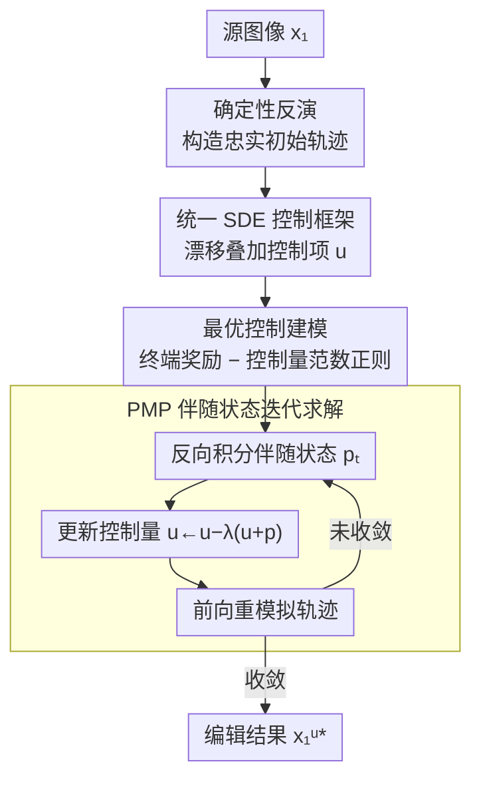

# Training-Free Reward-Guided Image Editing via Trajectory Optimal Control

**会议**: ICLR 2026  
**arXiv**: [2509.25845](https://arxiv.org/abs/2509.25845)  
**代码**: 无  
**领域**: 扩散模型 / 图像编辑  
**关键词**: Optimal Control, Reward-Guided, training-free, Adjoint State, Pontryagin's Maximum Principle

## 一句话总结
将 reward-guided 图像编辑重新建模为轨迹最优控制问题，将扩散/Flow模型的反向过程视为可控轨迹，通过基于 Pontryagin 最大值原理（PMP）的伴随状态迭代优化整条轨迹，在无需训练的情况下实现有效的奖励引导编辑且不发生 reward hacking。

## 研究背景与动机
**领域现状**：Reward-guided 采样在 T2I 生成中已取得成功（DPS、FreeDoM、TFG），通过利用可微分奖励函数在推理时引导生成过程。但这些方法都设计用于采样，未专门针对编辑。

**现有痛点**：Reward-guided 编辑比生成更难——既要最大化奖励又要保持源图像核心身份。朴素方法（反演+引导采样）效果差：对复杂非线性奖励函数，基于中间噪声图像或单步近似的引导会降低结构忠实度。直接梯度上升虽方向正确但不考虑图像先验，产生对抗性样本。

**核心矛盾**：现有 guidance 方法在编辑场景中面临两难——引导过强则破坏结构，引导过弱则奖励提升不足。且它们缺乏对 guidance scale 选择的理论支撑，需要大量超参调整。

**本文目标** 如何在不训练模型的情况下，利用任意可微分奖励函数引导编辑，同时保持与源图的结构一致性？

**切入角度**：最优控制理论——将问题从"单步引导"提升为"全轨迹优化"。

**核心 idea**：优化整条生成轨迹（而非单步引导中间状态）来同时最大化终端奖励和保持与源图的一致性。

## 方法详解

### 整体框架
这篇论文要解决的是 **training-free 的奖励引导图像编辑**：用任意可微分奖励（人类偏好、风格、分类 logit、CLIPScore）去改一张图，同时不破坏源图身份、且不发生 reward hacking。它的核心动作是把"如何编辑"从单步 guidance 抬升成**对整条生成轨迹的最优控制**。

整体怎么转：给定源图像 $\bm{x}_1$，先用**确定性反演**把它映射回噪声端、得到一条忠实对应源图的初始轨迹 $\{\bm{x}_t\}_{t=T}^{1}$；接着把扩散与 Flow Matching 统一写成同一条**可控 SDE**——在漂移上叠加一个待优化的控制项 $u_t$；再把编辑目标写成一个**最优控制问题**（最大化终端奖励、同时惩罚控制量大小）；最后用基于 PMP 的**伴随状态迭代**反复"反向算伴随状态 → 更新控制量 → 前向重模拟轨迹"，直到终点 $\bm{x}_1^{u^*}$ 在奖励与源图身份之间取得平衡。与单步 guidance 不同，这里优化的是整条轨迹而非某个中间状态，从而避免了把噪声中间图当干净图去引导所带来的结构破坏。

### 关键设计

**1. 确定性反演构造初始轨迹：给整条轨迹优化一个忠实复现源图的起点**

优化整条轨迹的前提是先有一条忠实对应源图的初始轨迹，否则终点会从一开始就偏离原图。本文对扩散模型用 DDIM 反演、对 Flow Matching 用时间反转 ODE，二者都取 $\sigma_t = 0$ 的确定性形式，使从 $\bm{x}_1$ 反推到 $\bm{x}_T$ 再正向重建能近似还原源图像。这等于给后续控制优化提供了一个"零编辑即恒等"的可靠起点——控制量 $u_t \equiv 0$ 时轨迹原样还原源图，任何编辑都是从这条基准轨迹出发的可控偏移。

**2. 统一 SDE 控制框架：把扩散和 Flow Matching 装进同一套控制理论**

编辑场景里基础模型既可能是扩散也可能是 Flow Matching，两者的采样过程形式不同，若分别推导控制律会很繁琐。本文把二者统一写成同一条反向 SDE $d\bm{x}_t = b(\bm{x}_t, t)\, dt + \sigma_t\, d\mathbf{B}_t$，只让漂移项 $b(\bm{x}_t,t)$ 随模型类型取不同表达式（扩散与 Flow 对应 Eq. 4-5），噪声系数 $\sigma_t$ 在确定性采样时取 0。这样后续整套最优控制推导只需针对这一条 SDE 做一次，扩散和 Flow Matching 都能直接套用，无需为每类模型单独设计引导方案。

**3. 最优控制问题建模：用控制项加范数正则把"编辑两难"写成一个可解目标**

Reward-guided 编辑的核心矛盾是奖励要高、又要不偏离源图，单步 guidance 缺乏统一的强度调控。本文在漂移上注入控制项 $u_t$，把编辑写成一个终端代价加运行代价的最优控制问题：

$$\min_{u \in \mathcal{U}} \int_T^1 \frac{1}{2} \|u(\bm{x}_t^u, t)\|^2 dt - r(\bm{x}_1^u)$$

$$\text{s.t.} \quad d\bm{x}_t^u = (b(\bm{x}_t^u, t) + u(\bm{x}_t^u, t)) dt + \sigma_t d\mathbf{B}_t, \quad \bm{x}_T^u = \bm{x}_T$$

其中 $-r(\bm{x}_1^u)$ 拉高终端奖励，积分项 $\frac{1}{2}\|u\|^2$ 惩罚控制量的整体大小。这个范数正则不是凑出来的——它限制轨迹偏离原始生成流形的幅度，等价于一条隐式的"源图保持"约束，于是奖励和身份保持被同一个目标自然协调，guidance 强度也收敛为对奖励项加权 $w$ 的单一旋钮，省去逐步搜 guidance scale。

**4. 基于 PMP 的伴随状态迭代求解：用伴随状态把整条轨迹的梯度高效回传**

最优控制目标无闭式解，本文用 Pontryagin 最大值原理给出最优性条件（Eq. 8-10），它解耦成三个互相耦合的方程——前向状态方程、反向伴随方程、以及最优控制条件 $u_t^* = -p_t^*$。三者联立无法直接求解，于是采用类似坐标下降的迭代：先固定当前轨迹 $\bm{x}_t$，以终端条件 $p_1^* = -\nabla_{\bm{x}_1} r(\bm{x}_1^*)$ 反向积分伴随方程求出伴随状态 $p_t$；再按 $u_t \leftarrow u_t - \lambda(u_t + p_t)$ 沿 $u_t^*=-p_t^*$ 的方向更新控制量；最后用新的 $u_t$ 前向重模拟得到下一条轨迹，如此循环到收敛。伴随方程里出现的 Jacobian-vector product $[\nabla_{\bm{x}_t} b(\bm{x}_t^*, t)]^\top p_t^*$ 不必显式构造 Jacobian，借自动微分即可高效算出，使得"对整条轨迹求梯度"在实现上和普通反传同量级。

### 损失函数 / 训练策略
整个方法不训练任何参数，只在推理时优化控制量，优化目标即上面最优控制的代价泛函——终端奖励 $r(\bm{x}_1^u)$ 加控制量范数正则。奖励函数本身随任务替换：人类偏好用 ImageReward、风格迁移用 Gram 矩阵差异、反事实生成用分类器 logit、文本引导编辑用 CLIPScore，并以权重 $w$ 缩放 $r(\cdot)$ 统一调节引导强度。实验以 StableDiffusion 1.5 代表扩散模型、StableDiffusion 3 代表 Flow Matching 模型，同一套控制流程在两者上无需改动即可运行。

## 实验关键数据

### 主实验（Human Preference 任务，SD 1.5）

| 方法 | ImageReward↑ | HPSv2↑ | CLIPScore↑ | Aesthetic↑ | LPIPS↓ | CLIP-I_src↑ |
|------|-------------|--------|-----------|-----------|--------|------------|
| None | 0.154 | 0.239 | 0.289 | 6.052 | 0.000 | 1.000 |
| Gradient Ascent | **1.909** | 0.225 | 0.288 | 5.578 | 0.147 | 0.920 |
| Inv+DPS | 1.599 | 0.232 | 0.265 | 5.828 | 0.288 | 0.851 |
| Inv+TFG | 1.705 | 0.236 | 0.273 | 5.633 | 0.293 | 0.840 |
| **Ours** | 1.891 | **0.253** | **0.290** | **6.109** | 0.172 | **0.924** |

*本方法奖励接近 GA 但泛化指标全面最优，且保持源图一致性。GA 虽奖励最高但 reward hacking 严重（验证指标差）。*

### 风格迁移任务

| 方法 | ‖ΔG‖_F↓ | CLIP-I_sty↑ | DINO_sty↑ | CLIP-I_src↑ |
|------|---------|------------|----------|------------|
| Gradient Ascent | **4.874** | 0.527 | 0.195 | 0.837 |
| Inv+DPS | 6.844 | 0.540 | 0.169 | 0.686 |
| Inv+FreeDoM | 5.462 | 0.563 | 0.225 | 0.621 |
| **Ours** | 5.019 | **0.578** | **0.247** | 0.717 |

*验证指标（CLIP-I_sty、DINO_sty）全面最优，同时结构保持远优于 guided sampling baselines。*

### 关键发现
- 梯度上升（GA）在目标奖励上最强但普遍 reward hack——验证指标下降，说明只过拟合了奖励函数而未实质提升
- Guided sampling（DPS/FreeDoM/TFG）在编辑场景下普遍破坏源图结构，LPIPS 和 CLIP-I_src 大幅恶化
- 本方法通过全轨迹优化避免了 reward hacking：目标奖励接近最优，泛化指标全面领先
- 控制量范数正则化是关键：限制了轨迹偏离程度，等价于隐式的源图保持约束
- 反事实生成任务中，因为使用鲁棒分类器，GA 表现反而不错——说明奖励函数性质影响各方法的相对表现
- 方法同时适用于扩散模型和 Flow Matching 模型，无需修改

## 亮点与洞察
- **理论严谨**：从最优控制理论推导出完整的编辑框架，PMP 提供了必要最优性条件
- **统一框架**：同时处理扩散和 Flow Matching 模型，统一为 SDE 控制问题
- **无需 guidance scale 搜索**：所有步的引导强度由单一权重 $w$ 控制，有理论依据
- **避免 reward hacking**：控制量范数正则化天然防止过度编辑
- **适用于抽象奖励**：不限于文本条件，可用于人类偏好、风格等难以用语言表达的概念
- **与 Adjoint Matching 的比较**：后者需微调模型（改变整个分布），本方法仅优化单条轨迹（推理时编辑）

## 局限与展望
- 使用的基础模型（SD 1.5 / SD 3）相对老旧，未在 FLUX 等最新模型上验证
- 迭代优化过程需要多次前向+反向传播，计算开销较大（$N$ 次迭代 × 轨迹长度）
- 伴随方程中 Jacobian-vector product 的计算假设 $b$ 可微且 Jacobian 可控，对某些模型可能不成立
- 确定性反演的质量直接影响编辑质量——对 CFG 蒸馏模型可能需要额外处理
- 未与更复杂的条件编辑方法（如 instructpix2pix、FLUX Kontext）对比
- 仅使用300张图评估，规模偏小

## 相关工作与启发
- **DPS / FreeDoM / TFG**：同为 training-free guidance 方法，但都基于单步引导或一步近似，无法有效处理复杂非线性奖励
- **Adjoint Matching**：同使用 PMP 和伴随状态，但用于模型微调（SOC 问题），本文用于推理时单张图编辑
- **FlowEdit**：无优化的 Flow 编辑方法，直接操纵文本条件流
- **RFIN / Rout et al.**：OC 视角用于风格个性化和 Doob h-变换，但未用于 reward-guided editing
- 启发：最优控制理论为生成模型的推理时干预提供了优雅且有理论保证的框架，可推广到 video editing 或 3D generation 的 reward-guided 控制

## 评分
- 新颖性: ⭐⭐⭐⭐⭐ — 将 reward-guided editing 重新建模为 OC 问题非常优雅，PMP 推导严谨
- 实验充分度: ⭐⭐⭐ — 四个任务覆盖面广，但基础模型较老、评估规模小、无用户研究
- 写作质量: ⭐⭐⭐⭐⭐ — 理论推导清晰，motivation 层层递进
- 价值: ⭐⭐⭐⭐ — 为 reward-guided editing 提供了全新理论框架，但实际影响力取决于在现代大模型上的验证

<!-- RELATED:START -->

## 相关论文

- [\[ICLR 2026\] Follow-Your-Shape: Shape-Aware Image Editing via Trajectory-Guided Region Control](follow-your-shape_shape-aware_image_editing_via_trajectory-guided_region_control.md)
- [\[ICLR 2026\] FlowAlign: Trajectory-Regularized, Inversion-Free Flow-based Image Editing](flowalign_trajectory-regularized_inversion-free_flow-based_image_editing.md)
- [\[ICLR 2026\] EditReward: A Human-Aligned Reward Model for Instruction-Guided Image Editing](editreward_a_human-aligned_reward_model_for_instruction-guided_image_editing.md)
- [\[ICLR 2026\] Value Matching: Scalable and Gradient-Free Reward-Guided Flow Adaptation](value_matching_scalable_and_gradient-free_reward-guided_flow_adaptation.md)
- [\[ICML 2026\] Pareto-Guided Optimal Transport for Multi-Reward Alignment](../../ICML2026/image_generation/pareto-guided_optimal_transport_for_multi-reward_alignment.md)

<!-- RELATED:END -->
