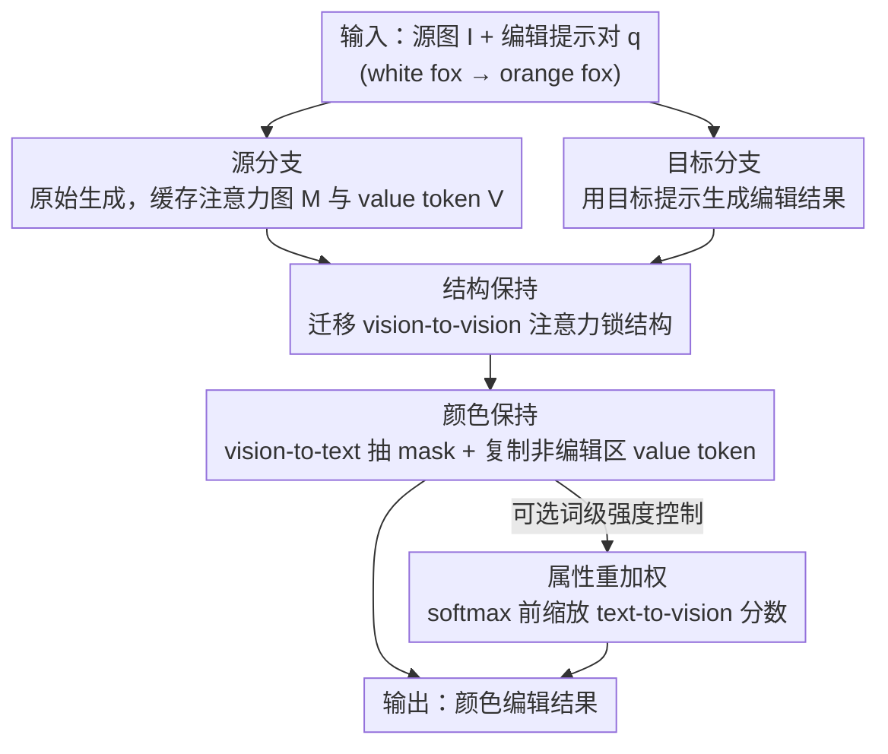

# ColorCtrl: 基于多模态扩散 Transformer 的免训练文本引导颜色编辑

**会议**: ICLR 2026  
**OpenReview**: [https://openreview.net/forum?id=N1DfzTVuUY](https://openreview.net/forum?id=N1DfzTVuUY)  
**代码**: 项目主页见论文（有）  
**领域**: 扩散模型 / 图像编辑  
**关键词**: 免训练编辑, 颜色编辑, MM-DiT, 注意力控制, 一致性保持

## 一句话总结
ColorCtrl 是一种免训练（training-free）的文本引导颜色编辑方法，通过直接操纵 MM-DiT 注意力图与 value token，把"结构"和"颜色"解耦开，在 SD3、FLUX.1-dev、CogVideoX 等多种模型上实现精确、且对几何/材质/光照一致性几乎零破坏的颜色编辑，并支持词级别的颜色强度调节。

## 研究背景与动机

**领域现状**：文本引导的颜色编辑（把"红球"改成"黄球"、"明亮早晨"改成"黑夜"）是图像/视频编辑里一个基础但远未解决的问题。它本质上要求模型隐式地重建整个场景的 3D 结构与光照，因为"颜色"不只是物体本身的反照率（albedo），还包括光源颜色和环境光，而且改色时必须保证反射、折射、高光等光与物质的交互依然物理正确。当前主流分两类：一类是微调扩散模型做可控编辑，但需要大规模数据和复杂训练管线，且常局限于窄域；另一类是免训练方法，靠通用、易用取胜。

**现有痛点**：免训练方法虽然通用，但在精细颜色控制上很吃力，且常常在编辑区域和非编辑区域同时引入视觉不一致——要么改色不彻底，要么把不该动的背景、结构、材质也一起改坏了。已有的注意力控制方法（如 Prompt-to-Prompt 及其变体）大多基于 U-Net 的 cross-attention 设计，而唯一在 MM-DiT 上做注意力控制的 DiTCtrl 又存在两个问题：它的注意力重加权破坏了注意力一致性导致几何错乱，并且需要小心挑选生效的层。

**核心矛盾**：颜色编辑里"编辑强度"和"源图保真度"之间存在天然 trade-off——想把颜色改得彻底，往往就会连带破坏结构、材质和非编辑区域；想保住一致性，改色又改不到位。已有方法只能选择性地在特定推理步或特定注意力层上操作，鲁棒性差。

**切入角度**：扩散模型从 U-Net 转向 MM-DiT（Multi-Modal Diffusion Transformer）带来了新机会——MM-DiT 把文本和视觉 token 拼在一起做单一 self-attention，注意力图天然可以划分成 vision-to-vision、vision-to-text、text-to-vision、text-to-text 四块，不同象限承载不同语义角色。作者观察到：vision-to-vision 部分编码了"哪些场景内容必须保持不变"的丰富知识，而 vision-to-text 部分则提供了"编辑目标在哪"的优质空间定位。

**核心 idea**：用免训练的方式，在 MM-DiT 的注意力图和 value token 上做有针对性的操纵，把结构和颜色解耦——迁移 vision-to-vision 保结构、用 mask 替换 value token 保非编辑区颜色、缩放 text-to-vision 注意力分数做强度调节，从而无需选层选步、无需调参，直接全层全时间步生效。

## 方法详解

### 整体框架

ColorCtrl 沿用"双分支"编辑范式：给定源图 $I$ 和一对编辑前后的文本提示 $q$（例如"white fox" → "orange fox"），**源分支**按原始生成过程跑一遍，产出源图并缓存沿途的注意力图 $M$ 与 value token $V$；**目标分支**用目标提示生成编辑结果，并复用源分支缓存的中间变量，把编辑约束注入进去。所有修改都只发生在目标分支上。

整个注入分三步、对应注意力图的不同区域：第一步**结构保持**，把源注意力图的 vision-to-vision 部分搬到目标注意力图里，锁住几何、材质、光源位置和光强；第二步**颜色保持**，从 vision-to-text 部分抽出一张二值 mask 标定编辑区域，把非编辑区域的 vision value token 从源 $V$ 复制回目标 $V^*$，防止背景被连带改色；第三步（可选）**属性重加权**，在 softmax 之前缩放选定词 token 在 text-to-vision 区域的注意力分数，实现"暗一点/亮一点"这种词级强度控制。前两步是方法核心，第三步是细粒度控制的可选附加项。

### 关键设计

**1. 双分支 + 结构保持：用 vision-to-vision 注意力锁住"不该动的一切"**

最直接的免训练做法是：固定随机种子、直接用目标提示生成。但作者发现这样生成的图会和源图严重偏离，根本谈不上"编辑"。于是采用源/目标双分支：源分支正常生成并存下中间注意力输出，目标分支复用它们。关键洞察是 MM-DiT 注意力图里的 **vision-to-vision 象限**（视觉 query 对视觉 key 的注意力，对应注意力图左上块）天然编码了场景里哪些部分该保持不变的结构信息。因此结构保持就是：把源注意力图 $M$ 的 vision-to-vision 部分，迁移到目标注意力图 $M^*$ 的对应位置，得到编辑后的注意力图 $\hat{M}$，使其满足三条约束——(C1) 几何/视角一致（物体布局和透视与源图一致）、(C2) 光照一致（光源位置和标量强度不变，只允许 RGB 光谱分量变化）、(C3) 材质一致（粗糙度、镜面反射等材质参数不变，只改物体的反照率 $A$）。与 DiTCtrl 不同，ColorCtrl 操作的是注意力图而非 key/value token，因此不需要小心挑层，可以在所有层、所有时间步上直接生效。

**2. 颜色保持：用 vision-to-text mask 把非编辑区的 value token 原样搬回来**

仅靠结构保持还不够——非编辑区域仍会出现不想要的色偏。为把编辑严格限制在目标区域，ColorCtrl 先从注意力图的 **vision-to-text 部分**用阈值 $\epsilon$ 抽取一张二值 mask $m$，标定要编辑的目标区域。这里有个细节上的取舍：先前工作（Cai et al.）把 vision-to-text 和 text-to-vision 两部分平均来得 mask，而作者只用 vision-to-text 部分，因为它对目标的空间定位明显更准（论文图 3(b) 给出对比）。拿到 mask 后，把源 value token $V$ 中**非编辑区域**的 vision 部分复制到目标 $V^*$ 的对应位置，得到最终 value token $\hat{V}$。一个被实验证实的关键点是：value 替换时**只能换 vision 部分**——如果把 value 的文本部分 $V^{\text{text}}$ 也一起换，会在 FLUX.1-dev 上严重削弱文本引导、在 SD3 上产生明显伪影。

**3. 属性重加权：softmax 之前缩放 text-to-vision 分数，做词级强度调节**

文本提示对颜色的控制粒度有限——用户说"dark yellow"却无法显式控制"暗"到什么程度。U-Net 时代的两种重加权技巧（缩放特定 token 的文本 embedding、缩放 cross-attention 图中的注意力分数）都不适用于 MM-DiT：前者是为 CLIP 文本编码器设计的，而 MM-DiT 通常用 T5；后者依赖 cross-attention，而 MM-DiT 只有 self-attention。为此 ColorCtrl 在 **softmax 之前**缩放选定词 token 在 **text-to-vision 区域**的注意力分数。在 softmax 前缩放很关键：DiTCtrl 在 softmax 之后缩放，违反了"注意力分数应归一为 1"的假设，导致注意力行为错乱、几何不一致。这一步既能作用于原始源注意力图，也能作用于已经过结构保持的目标注意力图，灵活地嵌进上面的编辑管线，从而支持单属性调强弱、跨提示调强弱、乃至同时调多个属性。

## 实验关键数据

### 主实验

在 PIE-Bench 的 Change Color 任务（40 对编辑）上评测，结构一致性用 Canny 边缘图上的 SSIM 衡量，非编辑区保持用 PSNR/SSIM（区域由 Grounded SAM 2 标注）衡量，语义对齐用 CLIP 相似度衡量。与免训练方法对比（部分指标）：

| 模型 | 方法 | Canny SSIM ↑ | BG PSNR ↑ | BG SSIM ↑ | CLIP(Edited) ↑ |
|------|------|------|------|------|------|
| SD3 | DiTCtrl | 0.8119 | 35.40 | 0.9812 | 24.67 |
| SD3 | UniEdit-Flow | 0.8016 | 36.31 | 0.9774 | 24.67 |
| SD3 | **Ours** | **0.8473** | **42.93** | **0.9960** | **26.96** |
| FLUX.1-dev | UniEdit-Flow | 0.8498 | 37.57 | 0.9777 | 23.44 |
| FLUX.1-dev | **Ours** | **0.9196** | **39.49** | **0.9936** | **24.90** |

ColorCtrl 在结构保持和非编辑区保持上全面领先，同时 CLIP 相似度也最高，说明编辑既准又不破坏一致性。

与商业模型对比（PIE-Bench）：

| 模型 | 方法 | Canny SSIM ↑ | BG PSNR ↑ | CLIP(Edited) ↑ |
|------|------|------|------|------|
| — | FLUX.1 Kontext Max | 0.76 | 26.77 | 26.10 |
| — | GPT-4o Image Gen | 0.74 | 23.71 | 26.46 |
| FLUX.1-dev | **Ours** | **0.9196** | **39.49** | 24.90 |

ColorCtrl 在一致性（Canny SSIM、PSNR）上大幅超过商业模型。CLIP 相似度略低，作者指出这是因为商业模型常靠过饱和、不真实的纯色来强行迎合提示（如把整只老鼠连魔杖都涂成纯紫、把半透明衬衫渲染成不透明黄色），所以更高的 CLIP 并不代表编辑质量更好。

### 消融实验

| 配置 | Canny SSIM ↑ | BG PSNR ↑ | BG SSIM ↑ | CLIP(Edited) ↑ |
|------|------|------|------|------|
| Fix seed（直接生成） | 0.5787 | 20.44 | 0.8411 | 27.54 |
| + 结构保持 | 0.7312 | 24.77 | 0.9201 | 27.29 |
| + 颜色保持（完整方法） | **0.8473** | **42.93** | **0.9960** | 26.96 |

（SD3 上的逐组件消融。）

### 关键发现
- **结构保持贡献最大的"地基"**：从 fix seed 加上结构保持后，Canny SSIM 从 0.5787 跳到 0.7312、BG SSIM 从 0.8411 到 0.9201，几何与材质一致性显著改善。
- **颜色保持专补非编辑区**：再加颜色保持后，BG PSNR 从 24.77 暴涨到 42.93、BG SSIM 到 0.9960，非编辑区保持质量大幅提升，而 CLIP 相似度几乎没掉（27.29 → 26.96），说明保一致性的代价极小。
- **视频上优势更明显**：扩展到 CogVideoX-2B 后，因为多了时间维度，ColorCtrl 相对基线的差距进一步拉大（Canny SSIM 0.8651 vs 次优 0.7880），在时序连贯性和编辑稳定性上尤其突出。
- **可泛化到真实图像与指令编辑模型**：接上 UniEdit-Flow 的 inversion 即可编辑真实图像；接入 Step1X-Edit、FLUX.1 Kontext dev 这类指令编辑模型后，能在二次编辑时进一步精修颜色、同时保住结构。

## 亮点与洞察
- **把 MM-DiT 注意力图四象限当"功能分区"来用**：vision-to-vision 管结构、vision-to-text 管定位、text-to-vision 管强度——这个分区视角是整套方法的根基，非常清晰且可迁移到其他 MM-DiT 编辑任务。
- **"无需选层选步"是真正的工程优势**：以往注意力控制方法都得手工挑哪些层/哪些时间步生效，ColorCtrl 因为操作的是更鲁棒的注意力图（而非 key/value token），可以全层全时间步无脑生效、零调参。
- **softmax 前 vs 后缩放的细节**：一句"在 softmax 之前缩放"就避免了 DiTCtrl"分数和不为 1"的崩坏，提醒做注意力重加权时务必尊重归一化假设。
- **CLIP 高不等于编辑好**：论文用实例论证了高 CLIP 往往源于"提示过拟合"（过饱和强行对齐），是评测颜色编辑时值得警惕的陷阱。

## 局限与展望
- 方法依赖 MM-DiT 的注意力结构，对仍在用 U-Net 的扩散模型不适用（作者也明确只和 MM-DiT 基线比）。
- 编辑真实图像时需要先做 inversion（用 UniEdit-Flow），整体质量会受 inversion/重建质量牵制。
- mask 由 vision-to-text 加阈值 $\epsilon$ 抽取，对于目标定位本身困难、语义模糊的场景，mask 质量可能影响非编辑区保持效果（论文未深入讨论 $\epsilon$ 的敏感性）。
- CLIP 相似度在与商业模型比时略低，虽有"更真实"的合理解释，但在某些确实需要高饱和纯色的创作场景下，这种"克制"可能不是用户想要的。

## 相关工作与启发
- **vs DiTCtrl**: 同样在 MM-DiT 上做注意力控制，但 DiTCtrl 只在长视频生成时做 mask 提取（不在编辑里）、操作的是 key/value token、需要小心选层，且 softmax 后缩放破坏注意力一致性导致几何错乱；ColorCtrl 操作注意力图、全层全时间步生效、softmax 前缩放，更鲁棒。
- **vs Prompt-to-Prompt 系**: 这类经典注意力编辑方法基于 U-Net 的 cross-attention，无法直接搬到只有 self-attention 的 MM-DiT；ColorCtrl 专为 MM-DiT 的四象限注意力设计。
- **vs 微调式编辑（如 FLUX.1 Kontext、GPT-4o）**: 商业模型靠合成指令-响应对微调，编辑便捷但常以过饱和不真实的方式迎合提示、且破坏材质/一致性；ColorCtrl 免训练、保一致性更强、改色更自然。

## 评分
- 新颖性: ⭐⭐⭐⭐ 把 MM-DiT 注意力四象限解耦成结构/定位/强度三套控制，视角清晰且实用
- 实验充分度: ⭐⭐⭐⭐⭐ 覆盖 SD3/FLUX/CogVideoX/指令编辑模型，含与免训练及商业模型的全面对比与消融
- 写作质量: ⭐⭐⭐⭐ 任务形式化、注意力分区与方法步骤对应清楚
- 价值: ⭐⭐⭐⭐ 免训练、零调参、可插拔到多种 MM-DiT 模型，实用性强

<!-- RELATED:START -->

## 相关论文

- [\[CVPR 2026\] DDT: Decoupled Diffusion Transformer](../../CVPR2026/image_generation/ddt_decoupled_diffusion_transformer.md)
- [\[ICLR 2026\] LaTo: Landmark-tokenized Diffusion Transformer for Fine-grained Human Face Editing](lato_landmark-tokenized_diffusion_transformer_for_fine-grained_human_face_editin.md)
- [\[ICLR 2026\] DiffInk: Glyph- and Style-Aware Latent Diffusion Transformer for Text to Online Handwriting Generation](diffink_glyph-_and_style-aware_latent_diffusion_transformer_for_text_to_online_h.md)
- [\[CVPR 2026\] FARMER: Flow AutoRegressive Transformer over Pixels](../../CVPR2026/image_generation/farmer_flow_autoregressive_transformer_over_pixels.md)
- [\[ICLR 2026\] CreatiDesign: A Unified Multi-Conditional Diffusion Transformer for Creative Graphic Design](creatidesign_a_unified_multi-conditional_diffusion_transformer_for_creative_grap.md)

<!-- RELATED:END -->
