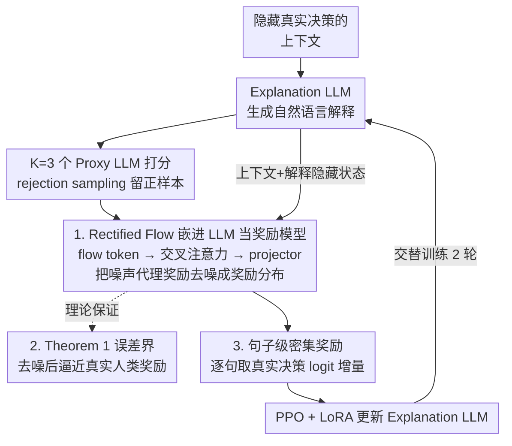

# Translate Policy to Language: Flow Matching Generated Rewards for LLM Explanations

**会议**: ICLR 2026  
**arXiv**: [2502.12530](https://arxiv.org/abs/2502.12530)  
**代码**: 无  
**领域**: 扩散模型/LLM对齐  
**关键词**: 策略解释, Rectified Flow, 分布式奖励, RLAIF, LLM可解释性

## 一句话总结
提出一个通用框架，利用Rectified Flow生成分布式奖励来训练解释生成LLM，通过连续归一化流（CNF）捕捉人类对解释评判的多元概率特性，并在理论上证明CNF能有效恢复真实人类奖励分布，在SMAC、MMLU、MathQA等任务上显著超越RLHF/RLAIF基线。

## 研究背景与动机

**领域现状**：随着RL、LLM等智能体与日常生活深度融合，用自然语言解释智能体策略变得至关重要。RLHF/RLAIF已成为对齐LLM行为的主流方法，但在解释任务中面临独特挑战。

**现有痛点**：(1) 人类对解释的评判本质上是多元且概率性的（pluralistic & probabilistic），收集多样化人类反馈成本高昂；(2) 现有RLAIF方法使用代理LLM生成的奖励存在噪声偏差，且未严格研究如何生成管理代理误差的分布式奖励；(3) 现有分布式奖励建模方法（QRM、DPRM、URM）需要离散化或假设特定分布形式。

**核心矛盾**：代理LLM奖励与真实人类奖励分布之间存在不可避免的偏差 $W_2(\hat{p}, p) = \sqrt{|\mathcal{A}|}|\sigma_r|$，直接使用代理奖励训练会导致次优解释。

**本文目标**：如何在不需要大量人类反馈的情况下，生成能准确反映人类多元评判的分布式奖励来训练解释生成LLM？

**切入角度**：将Rectified Flow嵌入LLM架构作为奖励模型，利用CNF的去噪特性将代理LLM的噪声奖励恢复为接近真实人类奖励的分布。

**核心 idea**：用Rectified Flow将代理LLM奖励中的噪声视为前向过程注入的高斯噪声，通过学习逆过程来恢复真实人类奖励分布，并提供理论误差界。

## 方法详解

### 整体框架
这篇论文要解决的是：怎样在不大量收集人类反馈的前提下，给"解释生成LLM"提供一个能反映人类多元评判的奖励信号。整套系统由三个角色组成并交替训练。Explanation LLM $\pi_e(\theta_e)$ 拿到一个隐藏了真实决策的上下文，要生成一段自然语言解释；$K=3$ 个独立的 Proxy LLM 各自给这段解释打分，提供带噪声的奖励样本；Rectified Flow 奖励模型 $\varphi(\theta_\varphi)$ 则把这些代理奖励样本当作"被高斯噪声污染过的真实人类奖励"，学一个逆向去噪流把它们还原成接近真实人类的奖励分布。每一轮先用代理样本更新 Flow 模型，再用 Flow 给出的奖励通过 PPO 更新 Explanation LLM，交替迭代两轮收敛。

### 关键设计

**1. 把 Rectified Flow 嵌进 LLM 当奖励模型：让奖励"读得懂语言"**

代理 LLM 给出的奖励是有噪声的，而且解释的好坏高度依赖语言内容——同一个决策上下文，措辞不同的解释该拿不同奖励。如果用普通的全连接网络或 U-Net 来建模奖励分布，它根本读不懂决策上下文和解释文本里的语言线索。本文的做法是把 Flow 直接长在 LLM 上：先把流变量 $\mathbf{z}_t$ 和时间步的位置编码 $PE(t)$ 经一个 MLP 投影成 flow token，再让这个 token 通过交叉注意力去"查询"决策上下文与解释在 LLM 里的隐藏状态，交叉注意力复用 Explanation LLM 最后一层的权重矩阵 $(W_Q, W_K, W_V)$，从而免费继承它的语言理解能力。Flow 模型按标准 rectified flow 目标训练，回归从 $\mathbf{z}_0$ 到 $\mathbf{z}_1$ 的直线速度场：

$$\mathcal{L}_{\text{Flow}}(\theta_\varphi) = \mathbb{E}\big[\|(\mathbf{z}_1 - \mathbf{z}_0) - \varphi(t, \mathbf{z}_t \mid c_j, y_j^e; \theta_\varphi)\|^2\big]$$

**2. Theorem 1：用误差界证明 CNF 真能把代理噪声压下去**

光说"去噪"还不够，作者给了理论保证来回答"还原出来的奖励到底离真实人类奖励有多远"。直接用代理 LLM 奖励时，它与真实人类分布之间存在一个无法消除的偏差项 $W_2(\hat{p}, p) = \sqrt{|\mathcal{A}|}|\sigma_r|$（$|\mathcal{A}|$ 是动作/选项数，$\sigma_r$ 是代理噪声尺度）。Theorem 1 证明，当 Flow 的初始分布和代理 LLM 噪声具有相同的函数形式（例如都取高斯）时，经过 CNF 还原后的奖励分布满足

$$W_2(p_{\text{flow}}, p) \leq \varepsilon + L\sqrt{|\mathcal{A}|}\,|\sigma - \sigma_r|$$

也就是说，原本"硬性存在、消不掉"的 $\sqrt{|\mathcal{A}|}|\sigma_r|$ 被换成了一个可控的 $L\sqrt{|\mathcal{A}|}|\sigma - \sigma_r|$：只要让 Flow 的噪声尺度 $\sigma$ 逼近代理噪声 $\sigma_r$，这一项就能压到很小，剩下的 $\varepsilon$ 是 Flow 自身的拟合误差。这把"分布式奖励能不能恢复真实分布"从经验问题变成了有界保证。

**3. 句子级密集奖励：把稀疏的末端信号拆细到每一句**

如果只在整段解释结束后给一个总奖励，PPO 的信号太稀疏、收敛慢，也说不清是哪句解释起了作用。这里改成逐句给奖励：每往解释里加一句话，就观察被隐藏的真实决策对应 logit 的变化量，用这个增量作为这一句的奖励——某句让模型更确信真实决策，它就拿正反馈。这样既加快了 PPO 收敛，又把"这段解释好在哪一句"落到了更细的粒度上。

### 损失函数 / 训练策略
- Flow模型使用rejection sampling：仅保留代理LLM将最高概率赋予真实决策的样本
- 对logits应用softmax激活以缓解大值影响
- Explanation LLM使用PPO + LoRA微调
- Flow模型由frozen LLM backbone + 两个可训练MLP（$\varphi_{\text{Emb}}$ 和 $\varphi_{\text{Proj}}$）组成
- 使用 $K=3$ 个独立Proxy LLM：Llama-3.1-8B-Instruct、Qwen2.5-7B-Instruct、Gemma-2-2B-It

## 实验关键数据

### 主实验

| 方法 | SMAC ACC | MMLU ACC | MathQA ACC | AI2-THOR SR |
|------|----------|----------|------------|-------------|
| **Ours** | **0.764** | **0.772** | **0.804** | **0.702** |
| Proxy LLM | 0.640 | 0.703 | 0.694 | — |
| KTO | 0.721 | 0.753 | 0.758 | 0.628 |
| ReFT | 0.722 | 0.743 | 0.763 | 0.642 |
| Skywork | 0.692 | 0.737 | 0.729 | 0.483 |
| o3-mini | 0.455 | 0.707 | 0.739 | 0.677 |

### 消融实验

| 配置 | SMAC | MMLU | MathQA |
|------|------|------|--------|
| Full Model | 0.764 | 0.772 | 0.804 |
| w/o Attn（去掉交叉注意力） | 0.731 | 0.749 | 0.775 |
| Sparse Reward（稀疏奖励） | 0.738 | 0.755 | 0.781 |
| w/o Flow（直接用代理LLM奖励） | 0.640 | 0.703 | 0.694 |

### 人类评估（MathQA）

| 方法 | ACC | Logic | Actionable | Cognitive |
|------|-----|-------|------------|-----------|
| **Ours** | **0.892** | **0.60** | **0.46** | **0.60** |
| DPO | 0.591 | 0.17 | 0.28 | 0.18 |
| ReFT | 0.635 | 0.23 | 0.26 | 0.22 |

### 关键发现
- 去掉Rectified Flow直接用代理LLM奖励，性能下降6.9%-12.4%，验证了Flow去噪的有效性
- 交叉注意力机制贡献3-5%的性能提升，说明语言条件化对奖励生成的重要性
- 句子级密集奖励比稀疏奖励提升2-3%
- 人类评估中，89.2%的解释使人类能正确推断决策，超过DPO 25.7%

## 亮点与洞察
- **理论与实践的完美统一**：Theorem 1提供了CNF管理代理噪声的严格误差界，在实验中得到充分验证。这为RLAIF的理论基础做出了重要贡献
- **通用性强**：横跨RL（SMAC、AI2-THOR）和LLM（MMLU、MathQA）任务，无需任务特定工程
- **架构创新**：将Rectified Flow嵌入LLM的方式值得借鉴，flow token + 交叉注意力是连接生成模型和语言模型的优雅方案
- **解释而非回答**：聚焦"解释策略"而非"做出决策"，填补了可解释AI的重要空白

## 局限与展望
- 依赖3个代理LLM提供奖励样本，计算成本非低
- 高斯噪声假设可能在某些场景不成立，虽然论文在附录讨论了不同函数形式的情况
- 仅在选择题/离散动作场景验证，开放式生成任务的表现未知
- 可以探索将此框架应用于RLHF中的偏好建模

## 相关工作与启发
- **vs QRM/DPRM/URM**：这些方法需要离散化或限制分布形式，本文使用CNF直接建模连续分布
- **vs Skywork RLAIF**：Skywork在RewardBench排名靠前但在解释任务上表现不佳（0.692 vs 0.764 on SMAC），说明解释任务的独特挑战
- **vs o3-mini**：即使是强推理模型在解释任务上也不及本文方法，强调了任务特定训练的价值

## 评分
- 新颖性: ⭐⭐⭐⭐⭐ 将Rectified Flow用于分布式奖励建模是全新视角，理论分析扎实
- 实验充分度: ⭐⭐⭐⭐⭐ 覆盖RL和LLM双领域、四个基准、多消融、人类评估
- 写作质量: ⭐⭐⭐⭐ 理论推导清晰，但整体结构略显复杂
- 价值: ⭐⭐⭐⭐ 对RLAIF理论和可解释AI实践都有重要推动

<!-- RELATED:START -->

## 相关论文

- [\[ICLR 2026\] Delay Flow Matching](delay_flow_matching.md)
- [\[ICLR 2026\] Flow Matching with Semidiscrete Couplings](flow_matching_with_semidiscrete_couplings.md)
- [\[ICLR 2026\] Discrete Guidance Matching: Exact Guidance for Discrete Flow Matching](discrete_guidance_matching_exact_guidance_for_discrete_flow_matching.md)
- [\[ICML 2026\] Principled RL for Flow Matching Emerges from the Chunk-level Policy Optimization](../../ICML2026/image_generation/principled_rl_for_flow_matching_emerges_from_the_chunk-level_policy_optimization.md)
- [\[ICLR 2026\] Carré du champ Flow Matching: 用几何感知噪声改善生成模型的质量-泛化权衡](carré_du_champ_flow_matching_better_quality-generalisation_tradeoff_in_generativ.md)

<!-- RELATED:END -->
