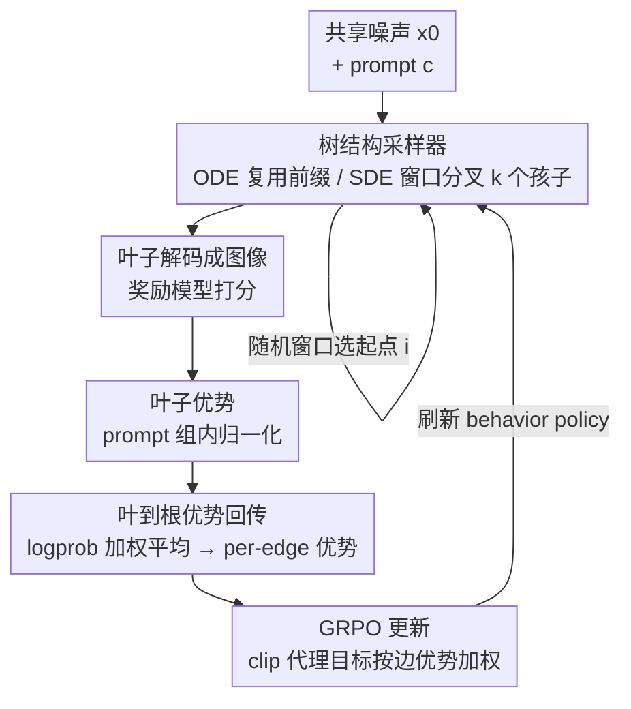

# TreeGRPO: Tree-Advantage GRPO for Online RL Post-Training of Diffusion Models

**会议**: ICLR 2026  
**OpenReview**: [https://openreview.net/forum?id=3rZdp4TmUb](https://openreview.net/forum?id=3rZdp4TmUb)  
**代码**: https://treegrpo.github.io （项目主页）  
**领域**: 扩散模型 / 强化学习对齐  
**关键词**: GRPO, 扩散模型 RL 后训练, 树搜索, 信用分配, 采样效率

## 一句话总结
把扩散/流模型的去噪过程重新看作一棵搜索树——从共享噪声出发、只在调度好的 SDE 窗口里分叉、ODE 步骤复用公共前缀，再把叶子奖励沿树回传得到逐步（per-edge）优势来做 GRPO 更新，从而在同样采样预算下训练快 2.4×、并在效率-奖励的 Pareto 前沿上全面超过 DanceGRPO / MixGRPO。

## 研究背景与动机
**领域现状**：扩散模型和 rectified flow 已经能生成高保真图像，但要让输出贴合人类偏好/审美，需要在预训练之后用人类反馈做对齐。借鉴 LLM 上 RL 后训练的成功，研究者把 GRPO 这套基于「组内相对优势」的 PPO 式更新搬到视觉生成上，代表方法有 DanceGRPO、FlowGRPO 等。

**现有痛点**：这类 GRPO 方法有两个硬伤。一是**采样效率低**——每做一次策略更新，都要把若干条完整的去噪轨迹从头采到尾，而每条轨迹的去噪都很贵；二是**信用分配太粗**——一条轨迹只有终点一个奖励 $R(x_T,c)$，这个标量被均匀地摊到去噪过程的每一步上，根本分不清到底是哪一步动作贡献了好/坏结果。MixGRPO 想用 ODE-SDE 混合采样和滑动窗口降成本，但往往是拿最终性能去换效率。

**核心矛盾**：轨迹式（trajectory-based）方法把每条候选当成相互独立的完整序列采样，既浪费了「不同候选其实共享很长一段去噪前缀」这个结构，又因为只有终点奖励而无法做细粒度的逐步信用分配。效率和信用分配这两个问题，其实同根——都来自「把去噪当成一条条独立的直线轨迹」。

**切入角度**：作者注意到去噪是**定步长、逐步推进**的固定 horizon 过程，这种结构和棋类等序贯决策里树搜索（AlphaGo 系列）极擅长的场景高度契合。于是把去噪过程重铸成一棵搜索树：从共享初始噪声出发，在中间步骤策略性地分叉，复用公共前缀去探索多条不同的完成路径。

**核心 idea**：用「共享前缀 + 策略性分叉」的稀疏树替代独立采样的多条轨迹——前缀复用换来采样效率，叶子奖励沿树回传换来逐步优势（细粒度信用分配），而每个内部节点的多孩子分叉天然提供了组内相对比较，一次前向能产出多个优势、做多次策略更新。

## 方法详解

### 整体框架
TreeGRPO 是面向扩散/流模型的树结构 RL 后训练框架，整条流程分三阶段：**先建树、再回传优势、最后做 GRPO 更新**。给定一个 prompt $c$ 和固定的 $T$ 步去噪 schedule，方法从共享噪声 $x_0\sim\mathcal{N}(0,I)$ 出发跑去噪，但把这 $T$ 步分成两类——落在预定 SDE 窗口 $\mathcal{W}$ 内的步骤做随机扰动、每个节点分叉出 $k$ 个孩子（branching），窗口外的步骤做确定性 ODE 推进、不分叉、所有后代复用同一段前缀。这样得到一棵叶子共享确定性前缀、只在 SDE 窗口处分化的稀疏树。每个叶子解码成图像后由奖励模型打分，奖励按 prompt 组内归一化得到叶子优势，再自底向上回传到内部边，得到逐步（per-edge）的稠密优势，最后用这些优势加权一个带 clip 的 GRPO 目标更新策略。

### 关键设计

**1. 树结构采样器：ODE 复用前缀、SDE 窗口分叉**

针对「每次更新都要独立重采完整轨迹」的效率痛点，TreeGRPO 不再把候选当成各自独立的直线，而是让它们共享一棵树。具体地，沿 $T$ 步 schedule 推进时区分两种步：当 $t\notin\mathcal{W}$ 时做 **ODE 确定性更新**，对所有 frontier 节点同步推进、不产生新分支，于是所有后代天然复用同一段公共前缀；当 $t\in\mathcal{W}$ 时做 **SDE 分叉**，在 ODE 均值更新上加一个小随机扰动，让每个 frontier 节点生成 $k$ 个孩子，并记录每条孩子边在冻结采样器下的采样对数概率 $\log\pi_{\theta_\text{old}}(e)$。这样一棵树的叶子只在 SDE 窗口处分化、其余部分共享前缀，计算量只随 SDE 窗口数线性增长，却能在同一 NFE 预算（实验固定 NFE=10）内拿到远多于独立采样的候选多样性——这正是 2.4× 加速的来源。

**2. 随机窗口：按截断几何分布选 SDE 窗口起点，偏向早期去噪步**

要分叉就得决定「在哪几步分叉」。作者只取一个长度固定为 $w$ 的连续 SDE 窗口 $\mathcal{W}_i=\{i,i+1,\dots,i+w-1\}$，并在每个训练 epoch 开始时从 $\{0,\dots,T-w-1\}$ 上的**截断几何分布**采样起点 $i$：

$$\Pr[i]=\frac{(1-r)\,r^{i}}{1-r^{\,T-w}},\quad i=0,1,\dots,T-w-1.$$

参数 $r\in(0,1)$ 越小，分布越偏向靠前的去噪步；$r\to1$ 时趋于均匀。作者刻意让窗口偏向早期，因为后训练主要是在去噪的初始阶段做修正，早期分叉的探索更有价值。这一项是个轻量但有效的设计——消融里 $r=0.5$ 给出最均衡的结果，$r=0.3$ 偏审美、$r=0.7$ 偏文图对齐。

**3. 叶到根优势回传：按 logprob 加权平均得到逐步信用分配**

针对「终点单一奖励被均匀摊到每一步」的粗粒度信用分配痛点，这是 TreeGRPO 最核心的贡献。先在 prompt 组内算叶子优势：把一个或多个奖励模型的分数按非负权重 $w_k$ 聚合成 $S(\ell)=\sum_k w_k R_k(y^{(\ell)},c)$，再用组内均值方差归一化 $A_\text{leaf}(\ell)=\frac{S(\ell)-\mu_c}{\sigma_c}$。然后自底向上做一遍后序回传：对内部节点 $u$，它的入边优势取所有孩子边优势的 **logprob 加权平均**

$$A_\text{edge}(e')=\sum_{e\in S(u)} w_u(e)\,A_\text{edge}(e),\qquad w_u(e)=\frac{\pi_{\theta_\text{old}}(e)}{\sum_{e'\in S(u)}\pi_{\theta_\text{old}}(e')}.$$

权重 $w_u(e)$ 就是对冻结采样器存下的边对数概率做 softmax。当某节点只有一个孩子时（ODE 段）回传退化为恒等，父边优势等于唯一孩子的优势；按逆拓扑序一路回传到根，就得到了每一时间步互不相同的逐步优势。这把「整条轨迹一个奖励」变成「每条边一个优势」，真正区分了不同去噪步的贡献。论文还从理论上指出这种概率加权聚合等价于对优势估计做 Rao-Blackwell 化：加权估计的方差是 $(\sum_k w_k^2)\sigma_\text{env}^2$，由于 $\sum_k w_k=1$ 且 $\sum_k w_k^2<1$，方差被有效样本数 ESS$=1/\sum_k w_k^2$ 缩小，从而梯度更稳、可用更大的信赖域更新；同时加权平均近似了 $\mathbb{E}_{a\sim\pi}[Q(s_t,a)]$，相当于一个隐式平滑正则，避免策略塌到「靠某个幸运噪声种子撞出高奖励」的尖峰解。

**4. 按边优势的 GRPO 更新：PPO clip 代理 + 多次更新摊销前向**

拿到逐步优势后，更新就是标准 PPO 的 clip 代理，只不过作用在「组内相对、逐边」的优势上。对每条 SDE 窗口边 $e\in\mathcal{E}_t$，定义重要性比 $r_t(e;\theta)=\exp(\log\pi_\theta(a_t(e)\mid x_t(e),c,t)-\log\pi_{\theta_\text{old}}(a_t(e)\mid\cdots))$，目标为

$$L_\text{GRPO}(\theta)=-\sum_{t\in\mathcal{W}}\sum_{e\in\mathcal{E}_t}\min\!\Big(r_t(e;\theta)\,A_\text{edge}(e),\ \text{clip}\big(r_t(e;\theta),1-\epsilon,1+\epsilon\big)A_\text{edge}(e)\Big).$$

只有 clip 参数 $\epsilon$、没有显式 KL 项，优化后周期性把 behavior policy 刷新为 $\theta_\text{old}\leftarrow\theta$。关键在于：一个节点的多孩子分叉一次前向就产出多条边、多个优势，因此**一次前向能摊销出多次策略更新**，这是树结构在更新效率上的第三重红利（前两重是前缀复用省采样、回传给细粒度信用）。

### 损失函数 / 训练策略
基座模型用 SD3.5-medium，数据集为 HPDv2（103,700 条偏好对齐 prompt，3,200 条留出评测）。所有方法统一 NFE=10、batch 32、训练 250 epoch、AdamW（lr 1e-5、weight decay 0.01）、8×A100 混合精度、同一随机种子。背景上还有一个关键前置：ODE→SDE 转换。确定性 ODE 求解器没有 policy-gradient RL 所需的转移概率，作者按 Song et al. 的做法把概率流 ODE 转成保持边缘分布、但带可处理似然的等价 SDE，其中 $\sigma(t)$ 控制噪声尺度、$\sigma(t)\equiv0$ 退回确定性 ODE——只有在 SDE 步上才有定义良好的 $\log\pi_\theta$ 可供 GRPO 用。多奖励训练时用「优势加权求和」而非直接加奖励：分别算各奖励的叶子优势 $A_i$，再按 $w_0{=}0.8,w_1{=}0.2$（HPS:ClipScore）加权成最终优势再回传。

## 实验关键数据

### 主实验
单奖励训练（用 HPS-v2.1 训、四个奖励模型评），TreeGRPO 在最快的同时拿下最高 HPS 与审美分：

| 方法 | 单步耗时(s)↓ | HPS-v2.1↑ | ImageReward↑ | Aesthetic↑ | ClipScore↑ |
|------|------|------|------|------|------|
| SD3.5-M（基座） | - | 0.2725 | 0.8870 | 5.9519 | 0.3996 |
| DDPO | 166.1 | 0.2758 | 1.0067 | 5.9458 | 0.3900 |
| DanceGRPO | 173.5 | 0.3556 | **1.3668** | 6.3080 | 0.3769 |
| MixGRPO | 145.4 | 0.3649 | 1.2263 | 6.4295 | 0.3612 |
| **TreeGRPO** | **72.0** | **0.3735** | 1.3294 | **6.5094** | 0.3703 |

DanceGRPO 的 ImageReward 最高但比 TreeGRPO 慢 2.4×。多奖励训练（HPS:ClipScore = 4:1）下 TreeGRPO 同样在 79.2s（vs DanceGRPO 184.0s）的耗时下保持各项强势（ImageReward 1.3426、Aesthetic 6.4237）。整体在 GPU Hours-Normalized Score 的 Pareto 图上，TreeGRPO（48.0h, 15.6%）显著优于 DanceGRPO（122.7h, 14.9%）和 MixGRPO（97.0h, 12.1%）。

### 消融实验
树结构消融（NFE=10，$k$ 分支因子、$d$ 深度）：

| 配置 | 有效组 EffGrp | 有效步 EffSteps | 耗时(s)↓ | HPS-v2↑ | 说明 |
|------|------|------|------|------|------|
| $k{=}3,d{=}3$（默认） | 27 | 13 | 70.0 | 0.3735 | 性能/效率最佳权衡 |
| $k{=}2,d{=}3$ | 8 | 7 | 39.4 | 0.3271 | 分叉太少、性能掉 |
| $k{=}2,d{=}4$ | 16 | 15 | 59.6 | 0.3537 | 加深但回报递减 |
| $k{=}4,d{=}3$ | 64 | 21 | 126.3 | **0.3822** | 分数更高但耗时 +75% |
| $k{=}3,d{=}3$，2 棵树 | 54 | 26 | 120.2 | 0.3771 | 双树仅微涨、耗时翻倍 |

采样策略消融（随机窗口 $r$）：$r{=}0.5$ 最均衡（HPS 0.3735）；$r{=}0.3$ 偏审美（Aesthetic 6.6067、ClipScore 掉到 0.3556）；$r{=}0.7$ 反向 trade-off；Shifting 策略 ClipScore 最高（0.3738）但其余指标妥协。

### 关键发现
- **分支因子 $k$ 是性能与成本的主旋钮**：$k$ 从 2→3→4 单调涨分（0.3271→0.3735→0.3822），但 $k{=}4$ 耗时暴涨 75%，作者选 $k{=}3,d{=}3$ 作为甜点；加深 $d$ 回报递减、多开一棵树几乎不划算。这与理论一致——更多分支 → 更大 ESS → 方差更小 → 性能更好。
- **随机窗口的 $r$ 控制「审美 vs 文图对齐」的偏向**：小 $r$ 偏早期去噪步、利审美，大 $r$ 利文图对齐，$r{=}0.5$ 折中；作者还提到按奖励进度自适应调 $r$ 能再涨 2-3%，但主结果用固定 $r{=}0.5$ 求简。
- **效率优势的根因**是树式并行采样在同一 NFE 预算内最大化候选多样性，同时回传开销很小——耗时 72-79s vs baseline 145-184s。

## 亮点与洞察
- **「去噪 = 搜索树」的视角迁移**很巧：把 AlphaGo 那套树搜索的样本效率优势，借助「去噪是定步长固定 horizon」这个结构契合点搬到扩散对齐上，一个视角同时治好了效率和信用分配两个病。
- **logprob 加权回传**既是工程上的信用分配机制、又有 Rao-Blackwell / 隐式平滑正则的理论支撑，把「为什么不是简单算术平均」讲清楚了——按策略概率加权才对应 $\mathbb{E}_{a\sim\pi}[Q]$，能抑制「靠幸运噪声种子撞高奖励」的尖峰解。
- **多孩子分叉一次前向多次更新**这个「计算摊销」红利，是把树结构吃干榨净的点睛之笔，可迁移到任何带固定 horizon、可在中间状态分叉的序贯生成 RL（如视频扩散、自回归采样）。

## 局限与展望
- 树的 SDE 窗口、$k$/$d$、$r$ 都是需要调的超参，甜点配置（$k{=}3,d{=}3,r{=}0.5$）靠网格消融找出，换基座/换奖励是否仍最优未充分验证。
- 实验只在 SD3.5-medium + HPDv2 单一基座/数据集上做，没扩到视频或更大模型；理论分析（Prop 5.1/5.2）建立在「分支条件独立」「Taylor 二阶近似」等假设上，偏概念性论证。
- 自适应调 $r$ 被提到能再涨 2-3% 却未纳入主方法，留作未来工作；多奖励的权重 $0.8{:}0.2$ 也是手调，缺乏自动化。

## 相关工作与启发
- **vs DanceGRPO / FlowGRPO**：它们用组内相对优势但要独立重采完整轨迹、且终点奖励均匀摊到每步；TreeGRPO 用共享前缀的树替代独立采样（省 2.4× 时间），并把单一终点奖励沿树回传成逐边优势（细粒度信用分配），在几乎所有指标上同时更快更好。
- **vs MixGRPO**：MixGRPO 也用 ODE-SDE 混合采样降本，但缺细粒度信用分配、常以最终性能换效率；TreeGRPO 的树回传补上了逐步信用这一环，在 Pareto 前沿上同时压过它的效率与奖励。
- **vs DDPO/DPOK**：早期 PPO 式扩散 RL，batch 级优势归一化、稳定性与扩展性都弱；TreeGRPO 的组内归一化 + 树优势在同预算下分数高出一大截。
- **vs 语言域的树式 RL**（如 Yang et al. 2025 在 token 序列上搜索）：本文把树搜索从离散 token 序列迁移到连续去噪过程，靠的是「共享噪声前缀」这个扩散特有结构来同时拿效率和逐步信用。

## 评分
- 新颖性: ⭐⭐⭐⭐⭐ 「去噪=搜索树 + 叶到根 logprob 加权回传」是对扩散 RL 信用分配的实质性新视角
- 实验充分度: ⭐⭐⭐⭐ 四奖励模型 + 多组树结构/采样策略消融扎实，但限于单基座单数据集、未上视频/大模型
- 写作质量: ⭐⭐⭐⭐ 三阶段框架清晰、理论与实验呼应；个别公式排版（如 $A_\text{edge}$ 的双重求和）需对照原文
- 价值: ⭐⭐⭐⭐⭐ 2.4× 提速 + Pareto 全面占优，给视觉生成 RL 对齐提供了可扩展的实用路径

<!-- RELATED:START -->

## 相关论文

- [\[ICLR 2026\] TempFlow-GRPO: When Timing Matters for GRPO in Flow Models](tempflow-grpo_when_timing_matters_for_grpo_in_flow_models.md)
- [\[ICLR 2026\] EditScore: Unlocking Online RL for Image Editing via High-Fidelity Reward Modeling](editscore_unlocking_online_rl_for_image_editing_via_high-fidelity_reward_modelin.md)
- [\[CVPR 2025\] Finite Difference Flow Optimization for RL Post-Training of Text-to-Image Models](../../CVPR2025/image_generation/finite_difference_flow_optimization_for_rl_post-training_of_text-to-image_models.md)
- [\[CVPR 2026\] Fine-Grained GRPO for Precise Preference Alignment in Flow Models](../../CVPR2026/image_generation/fine-grained_grpo_for_precise_preference_alignment_in_flow_models.md)
- [\[CVPR 2026\] GDRO: Group-level Reward Post-training Suitable for Diffusion Models](../../CVPR2026/image_generation/gdro_group-level_reward_post-training_suitable_for_diffusion_models.md)

<!-- RELATED:END -->
