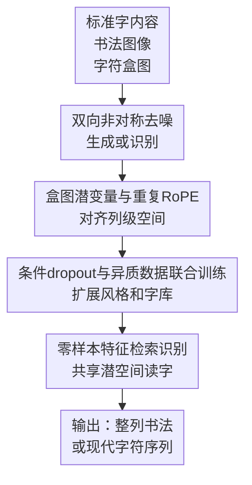

# UniCalli: A Unified Diffusion Framework for Column-Level Generation and Recognition of Chinese Calligraphy

**会议**: ICLR 2026  
**OpenReview**: [https://openreview.net/forum?id=OSIPdrw56X](https://openreview.net/forum?id=OSIPdrw56X)  
**代码**: 作者承诺在论文发表后公开代码、数据集与预训练权重  
**领域**: 扩散模型 / 图像生成 / 书法生成与识别  
**关键词**: 中文书法生成、列级布局、扩散Transformer、书法识别、文化遗产数字化  

## 一句话总结
UniCalli 把中文书法的列级生成与识别统一到一个多模态扩散 Transformer 中，通过非对称加噪、盒图空间先验和联合训练，让模型既能生成具有连笔与章法的整列书法，也能在长尾书家和字体上保持较好的识别能力。

## 研究背景与动机
**领域现状**：中文书法的计算建模大致有两条路线。一条路线把问题当作单字字体生成或少样本风格迁移，重点是把某个汉字写得像目标书家；另一条路线尝试让通用图像生成模型或视觉语言模型直接画出一整列书法。前者在单字结构上更可靠，后者更接近完整作品的视觉形态。

**现有痛点**：单字生成方法忽略了书法作品最关键的列级审美：字与字之间的牵丝、大小变化、垂直排列节奏和整列章法。通用图像模型虽然能画出“像书法”的页面，却经常写错字、漏字，或者把某个书家的风格画成模糊纹理。书法不是普通纹理生成，模型既要知道“这个字是什么”，又要知道“这个字在这一列、这个书家、这种字体里该怎么落笔”。

**核心矛盾**：生成任务需要强风格先验和全局布局规划，识别任务需要稳定的字形结构与字符身份约束。过去两类任务通常分开训练：生成模型容易为了风格牺牲字形正确性，识别模型又缺少对书法风格、连笔和空间节奏的生成式理解。本文认为这两个任务不是互相独立，而是同一组“字义、字形、风格、位置”表示的两个方向。

**本文目标**：作者希望构建一个面向列级书法的统一框架：给定标准字内容、书家身份和字体风格时生成整列书法；给定书法图像时反推出对应现代汉字；同时在标注稀缺、书家长尾和古文字迁移场景下保持泛化能力。

**切入角度**：UniCalli 从扩散模型的多模态去噪机制切入，把标准字体渲染图、书法图像和字符框图都编码成潜变量，再用不同模态的加噪时间控制任务方向。标准字干净、书法分支加噪时就是生成；书法干净、标准字分支加噪时就是识别。这个设定让同一个网络在两个方向上反复学习“标准字内容”和“书法视觉形态”的对应关系。

**核心 idea**：用一个带空间先验的多模态扩散 Transformer 同时学习书法生成与识别，让识别约束生成的字形正确性，让生成补足识别所需的风格与布局理解。

## 方法详解

### 整体框架
UniCalli 的输入由三类图像化信号组成：目标文本的标准字体渲染图、真实或待生成的书法图像、以及每个字符位置和尺度对应的盒图。三者先经过预训练 VAE 编码成潜变量，随后由改造后的 MMDiT 在共享注意力中联合建模；任务方向由内容分支时间步 $t_c$ 和书法/盒图分支时间步 $t_i$ 决定。

生成时，标准字内容保持干净，即 $t_c=0$，书法图像和盒图被加噪，即 $t_i\sim U(0,1)$，模型学习从“写什么”恢复“怎么写、写在哪里”。识别时反过来，书法图像和盒图保持干净，标准字内容被加噪，模型学习从书法视觉形态恢复现代字符内容。这个框架不是先生成再 OCR，也不是先识别再渲染，而是让两种能力共享同一套潜空间和同一组空间坐标。

### 关键设计
**1. 双向非对称去噪：把生成与识别放进同一个扩散模型**

传统做法会把书法生成和书法识别拆成两个系统，UniCalli 的关键变化是用两个独立时间步来决定哪个模态是条件、哪个模态是预测目标。设标准字体内容图、书法图像和盒图的潜变量分别为 $z_c$、$z_i$、$z_m$，对任意潜变量 $z_k$ 的 flow matching 加噪写作 $z_k^\epsilon=t_k\epsilon_k+(1-t_k)z_k$。当模型做生成时，$t_c=0$，内容图不加噪；$t_i$ 随机采样，书法图像和盒图需要被恢复。当模型做识别时，$t_i=0$，书法视觉分支成为条件；$t_c$ 随机采样，内容分支需要被恢复。

这样设计的意义很具体：生成路径不能只学“像某个书家的一团笔墨”，因为识别路径不断要求共享网络把这些笔墨还原为标准字符；识别路径也不能只学模板匹配，因为生成路径迫使它理解同一个字在不同书家、不同字体和不同列级位置上的视觉变化。两个方向在同一个 MMDiT 中交替出现，模型被迫学习更抽象的字形部件、笔画结构和空间布局表示。

**2. 盒图潜变量与重复RoPE：让列级布局成为可学习的空间先验**

列级书法最难的地方不是把五个字分别画出来，而是让它们在同一竖列中形成自然的大小变化、字距和连笔。UniCalli 为每个字符构造 rasterized box map，并把它和书法图像一起作为需要建模的潜变量 $z_m$。在生成模式下，模型不仅恢复书法图像，也恢复盒图；这等于把“每个字占多大、落在什么位置、相邻字符如何连接”显式纳入训练目标，而不是希望扩散模型从像素中自己猜出来。

为了让内容图、书法图像和盒图在同一个空间坐标系里对齐，作者提出 Duplicate RoPE with Modulated Embedding。模型先根据书法图像潜变量计算 RoPE，再把这套二维位置信息复制给内容分支和盒图分支，并给不同模态加上可学习的调制嵌入：$RoPE_i=CalculateRoPE(z_i)$，$RoPE_k=RoPE_i+E_{mod,k}, k\in\{c,m\}$。直观地说，RoPE 告诉模型“在哪里”，调制嵌入告诉模型“这是哪一种信号”。这比简单拼接三张图更适合书法，因为一个字的身份、外观和边界框必须在同一列坐标上发生对应。

**3. 条件dropout与异质数据联合训练：用弱标注缓解书法长尾**

书法数据天然长尾：王羲之、颜真卿这类名家资料多，一些书家或罕见风格资料很少；真实古籍图像还常有破损、拓片噪声和二值化伪影。若模型总是强依赖完整内容条件，它可能在稀有风格上过拟合成抽象纹理，写出来有风格但不像字。UniCalli 在训练中以概率 $p_{drop}$ 把内容条件直接替换为纯噪声，也就是令 $t_c=1$。作者发现 $p_{drop}=0.05$ 最合适：太低会让模型过度追随长尾风格而牺牲字形，太高又会生成过于规范、缺少书家特征的字。

这个 dropout 还自然接住了无标注数据。没有字符框或转写的书法图像无法做标准的生成/识别配对训练，但可以把内容分支视作纯噪声，让模型以近似无条件生成的方式学习真实书法的风格分布。再加上用楷、行、草等 TTF 字体渲染的大规模合成数据，模型一边从合成数据扩充可见汉字集合，一边从真实无标注作品学习笔墨风格和版面变化，缓解了“标注少、风格多、字库大”的三重压力。

**4. 零样本特征检索识别：用共享潜空间读回标准字**

UniCalli 的识别不是再接一个自回归解码器或分类头，而是利用生成和识别共享的标准字潜空间做检索。离线阶段，系统把词表中所有标准字符用训练时的标准字体渲染成图像，经 VAE 编码得到参考库 $L=\{(c,z_c)\mid c\in V\}$。推理阶段，识别模式输出预测的内容潜特征 $\hat z_{pred}$，再用余弦相似度在参考库里找最近字符：$\hat c=\arg\max_{c\in V}\frac{\hat z_{pred}\cdot z_c}{\|\hat z_{pred}\|\|z_c\|}$。

这件事和统一扩散训练是配套的。因为生成训练已经让标准字潜变量与书法图像潜变量反复对齐，识别时直接在标准字特征库中做最近邻匹配，比额外训练一个闭集分类器更容易扩展到新字符或其他文字系统。论文把这一点用于甲骨文和埃及象形文字实验，说明框架并不只依赖现代汉字 OCR 头，而更像是在学习不同书写系统之间的视觉-语义映射。

### 一个完整示例
假设输入文本是“将进酒”中的连续五个字，并希望生成王羲之草书风格的一列书法。系统首先把这五个字用标准字体渲染成一张 $128\times640$ 的内容图，同时准备一个与书法列同尺寸的盒图，表示每个字大致应落在竖列中的哪个位置。生成模式下，内容图保持清晰，书法图像和盒图从噪声开始被逐步恢复。

在去噪过程中，MMDiT 不是按字从上到下逐个生成，而是在每一步都用双向注意力看完整列。这样它可以在生成第一个字的收笔时预留与第二个字的连接，也可以根据后续字符的复杂度调整前面字符的大小。若某个草书字本身笔画连绵，盒图会给出位置与尺度约束，Duplicate RoPE 则保证“这个标准字 token”“这个书法图像区域”和“这个盒图区域”在同一空间坐标上相互对应。最终输出不是五个孤立字的拼接，而是一列带有连笔、字距节奏和书家风格的完整片段。

识别时流程反过来。给定同一列书法图像，模型保持书法分支干净，让内容分支从噪声中恢复标准字潜特征；恢复出的每个字符特征再与离线标准字库做余弦相似度检索，得到现代汉字序列。生成和识别看起来方向相反，但它们使用的是同一个潜空间和同一套列级空间对齐机制。

### 损失函数 / 训练策略
UniCalli 使用 flow matching 目标分别约束内容潜变量、书法图像潜变量和盒图潜变量，记为 $L_{cond}$、$L_{img}$ 和 $L_{box}$。生成模式下主要恢复书法图像与盒图，同时给内容分支一个较小辅助项：$L_{total}=L_{img}+L_{box}+\lambda L_{cond}$。识别模式下主要恢复内容分支，同时用较小权重维持图像和盒图分支的重建：$L_{total}=L_{cond}+\lambda(L_{img}+L_{box})$。论文中 $\lambda=0.02$。

训练数据由三部分组成。第一部分是 8000 多幅数字化中文书法作品，其中 4000 多幅带有字体、逐字框和现代字符转写，覆盖 93 位书家和楷、行、草、隶、篆等字体。第二部分是未标注真实书法图像，用条件 dropout 的无条件生成视角纳入训练。第三部分是由 TTF 字体和古今中文语料渲染出的合成样本，用于扩充模型见过的字符和基础字体结构。实现上，作者微调 FLUX 骨干，使用五个连续字符片段，统一裁剪/缩放到 $128\times640$，在 8 块 H100 上训练 500k iterations。

## 实验关键数据

### 主实验
生成实验分为有参考和无参考两类。有参考合成中，模型需要在存在真实书法目标图的情况下复现风格与字形，评价 L1、SSIM、LPIPS 和 FID；无参考合成中，作者让 20 位书法爱好者从风格一致性、字形准确性、自然度和总体偏好四个维度打分。识别实验则在作者标注数据的验证/测试划分上比较字符级准确率。

| 任务 | 指标 | UniCalli | 最强对比方法 | 提升或结论 |
|------|------|----------|--------------|------------|
| 无参考书法生成 | Style Fidelity ↑ | 4.267 | GPT-5: 2.987 | 风格保真明显更高 |
| 无参考书法生成 | Glyph Accuracy ↑ | 4.827 | FontDiffuser: 4.950 | 接近单字生成强项，同时保留列级自然度 |
| 无参考书法生成 | Naturalness ↑ | 4.520 | Doubao: 3.520 | 连笔、大小和整体观感更自然 |
| 无参考书法生成 | Overall Preference ↑ | 4.560 | Doubao: 3.933 | 用户总体偏好最高 |
| 有参考书法生成 | FID ↓ | 37.69 | Doubao: 47.26 | 图像分布更接近真实书法 |
| 有参考书法生成 | LPIPS ↓ | 0.313 | ChatGPT-5: 0.412 | 感知差异更小 |

| 识别类别 | UniCalli 准确率 | 最强对比方法 | 备注 |
|----------|----------------|--------------|------|
| Regular/Kai 楷书 | 0.688 | Ernie-4.5 / Qwen-2.5 / CalliReader: 0.600 | 楷书结构较规整，统一模型优势明显 |
| Clerical/Li 隶书 | 0.518 | CalliReader / Doubao-1.5: 0.507 | 小幅领先 |
| Running/Xing 行书 | 0.528 | CalliReader: 0.658 | 行书上仍弱于专门识别模型 |
| Cursive/Cao 草书 | 0.109 | Ernie-4.5: 0.255 | 草书仍是最难类别 |
| Total | 0.540 | Ernie-4.5: 0.534 / CalliReader: 0.533 | 总体字符级准确率最高，但优势不大 |

### 消融实验
论文的消融以标准 FLUX 生成基线为起点，逐步加入联合训练、Duplicate RoPE 和 Conditional Dropout。作者特别强调 LPIPS 与 FID 的改善，因为这说明模型不是简单做像素平均，而是更能生成真实、多样的书法形态。

| 配置 | L1 ↓ | SSIM ↑ | LPIPS ↓ | FID ↓ | 说明 |
|------|------|--------|---------|-------|------|
| Baseline | 0.200 | 0.551 | 0.430 | 52.90 | 只做生成任务的标准 FLUX 式基线 |
| + Joint Training | 0.160 | 0.604 | 0.387 | 46.42 | 生成与识别联合后，字形和整体质量同步改善 |
| + RoPE Duplication | 0.148 | 0.613 | 0.352 | 41.78 | 空间对齐更强，列级布局更稳 |
| + Cond. Dropout | 0.152 | 0.602 | 0.313 | 37.69 | L1/SSIM略回退，但真实感与多样性最好 |

| 泛化场景 | UniCalli 结果 | 对比 / 说明 | 结论 |
|----------|--------------|-------------|------|
| 甲骨文生成 | Completely Correct 67%，Largely Correct 20% | 由甲骨文专家按结构正确性评估 | 可迁移到古文字生成 |
| 甲骨文识别 | 62.5% | OracleNet 73.9% | 识别弱于专门模型，但统一框架可用 |
| 埃及象形文字识别 | 0.96 | 数据集实验 | 说明框架对其他象形/表意文字有潜力 |
| CalliBench Easy 零样本识别 | F1 0.498 | 高于 GPT-4o 0.400、PP-OCRv5 0.205，低于 GOT-OCR2.0 0.593 | 古代书法训练对现代艺术字仍有一定迁移 |

### 关键发现
- 联合训练贡献很大。Baseline 到 + Joint Training 的 FID 从 52.90 降到 46.42，L1 从 0.200 降到 0.160，说明识别任务确实能反向约束生成的字形结构。
- Duplicate RoPE 主要改善空间对齐。加入后 SSIM 提到 0.613、FID 降到 41.78，符合作者关于列级布局、字距和盒图对齐的设计动机。
- Conditional Dropout 的效果不是让所有像素指标最好，而是让 LPIPS 和 FID 最好。它牺牲少量 L1/SSIM，换来更自然、更少模式坍缩的书法质感。
- 识别结果需要谨慎解读。UniCalli 总体准确率 0.540 略高于 Ernie-4.5 和 CalliReader，但训练和测试分布相近，作者也承认这可能带来优势；在草书、篆书等极难类别上，模型仍然不稳定。
- 跨文字系统实验是本文很有意思的补充。甲骨文和象形文字结果表明，统一的“标准符号图像 ↔ 风格化古文字图像”框架可能适合文化遗产数字化，不只是中文书法生成玩具。

## 亮点与洞察
- 最大亮点是把生成和识别的关系处理得很自然。书法生成怕写错字，书法识别怕风格变化；UniCalli 让两个任务共享潜空间，相当于让“会写”与“会读”互相校验。
- 盒图不是普通的检测辅助，而是列级书法生成里的结构语言。它把字距、大小、位置这些书法章法显式交给扩散模型学习，避免整列作品退化成单字拼贴。
- Duplicate RoPE 的思路可以迁移到其他多模态图像编辑任务。只要多个模态共享一个空间画布，例如草图-图像-布局图、分割图-图像-文本条件，都可以用共享位置编码加模态调制来减少错位。
- 条件 dropout 在这里不只是 classifier-free guidance 式技巧，更像是一个数据接口。它让无标注书法图像也能进入训练，特别适合历史文献、碑帖拓片这类标注昂贵但图像可收集的领域。
- 零样本检索式识别提供了一个轻量扩展路径。对于字表会变化的古文字研究，固定分类头很难覆盖新字形，而用标准符号渲染库做特征检索更灵活。

## 局限与展望
- 作者承认，历史书法图像中存在破损、拓片噪声和二值化带来的白斑/断裂，模型会忠实学习这些伪影。对于文化创意应用，这种“历史真实”未必总是美观，后续需要更强的数据清洗或可控去噪。
- 数据长尾仍然没有被完全解决。条件 dropout 能缓解稀有书家过拟合，但如果某位书家的作品极少，模型生成的风格仍可能偏离原作，尤其是高度个人化的草书和行书。
- 识别能力还不能替代专门 OCR。草书准确率只有 0.109，篆书也只有 0.050，说明统一框架虽然总体指标好看，但在最具挑战的字体上还有明显短板。
- 实验中的生成评价依赖 20 位书法爱好者，规模不算大。若要支撑更强的文化遗产或艺术史结论，需要更多专家评审，并区分书家风格、字体、碑帖来源和临摹传统。
- 当前模型以五个连续字符片段训练，虽然论文展示了整首诗的应用效果，但长篇多列作品的全局章法、落款、留白和纸面构图仍需要更明确的层级规划。
- 一个值得继续做的方向是把布局规划拆成可编辑层。用户可以先指定列数、留白、款识、印章位置，再由 UniCalli 生成笔墨细节，这会比端到端输出更适合设计工作流。

## 相关工作与启发
- **vs FontDiffuser / Diff-Font / DP-Font**: 这些方法更偏单字或少样本字体生成，字形准确性强，但不解决整列书法的空间节奏与连笔。UniCalli 的优势是列级生成和识别统一，代价是单字级 glyph accuracy 未必超过最强单字字体模型。
- **vs CalliPaint / Moyun / CalliffusionV2**: 这些书法生成方法更接近专门领域模型，但常采用顺序或局部生成思路，容易缺少全局规划。UniCalli 用 MMDiT 的双向注意力一次性看完整列，更适合处理上下文字之间的牵丝和大小呼应。
- **vs GPT-4o / ChatGPT-5 / Doubao / Ernie-4.5 等通用视觉模型**: 通用模型能生成视觉上像书法的图，但对汉字结构和书家风格不够稳定。UniCalli 的专门数据、盒图监督和识别约束让它在风格保真与自然度上明显更强。
- **vs CalliReader / OracleNet 等识别模型**: 专门识别模型通常在某些字体或古文字上更强，但它们不具备生成能力，也较少学习字形到风格化书写之间的双向映射。UniCalli 的启发在于，识别可以不只是分类任务，也可以成为生成模型共享潜空间里的反向过程。
- **对其他任务的启发**: 古籍修复、碑帖补全、少数民族文字数字化、图形符号复原等任务都存在“标准符号少、风格图像多、标注昂贵”的问题。UniCalli 的异质数据联合训练和检索式识别给这些任务提供了可复用框架。

## 评分
- 新颖性: ⭐⭐⭐⭐⭐ 统一列级书法生成与识别，并用非对称去噪和盒图潜变量落到可训练系统上，问题定义和技术组合都很有辨识度。
- 实验充分度: ⭐⭐⭐⭐☆ 生成、识别、消融和跨文字系统实验都覆盖到了，但用户研究规模和草书/篆书识别分析还可以更深入。
- 写作质量: ⭐⭐⭐⭐☆ 论文主线清楚，方法图和公式能支撑实现理解；部分识别优势需要更多分布外评估来避免过度解读。
- 价值: ⭐⭐⭐⭐⭐ 对中文书法生成、古文字识别和文化遗产数字化都有实际价值，也提供了一个值得迁移的“生成-识别统一扩散”范式。

<!-- RELATED:START -->

## 相关论文

- [\[ICLR 2026\] PosterCraft: Rethinking High-Quality Aesthetic Poster Generation in a Unified Framework](postercraft_rethinking_high-quality_aesthetic_poster_generation_in_a_unified_fra.md)
- [\[ICLR 2026\] Safety-Guided Flow (SGF): A Unified Framework for Negative Guidance in Safe Generation](safety-guided_flow_sgf_a_unified_framework_for_negative_guidance_in_safe_generat.md)
- [\[ICML 2026\] A Unified Framework for Diffusion Model Unlearning with f-Divergence](../../ICML2026/image_generation/a_unified_framework_for_diffusion_model_unlearning_with_f-divergence.md)
- [\[ACL 2025\] A Unified Agentic Framework for Evaluating Conditional Image Generation](../../ACL2025/image_generation/a_unified_agentic_framework_for_evaluating_conditional_image_generation.md)
- [\[ICCV 2025\] A Unified Framework for Motion Reasoning and Generation in Human Interaction](../../ICCV2025/image_generation/a_unified_framework_for_motion_reasoning_and_generation_in_human_interaction.md)

<!-- RELATED:END -->
