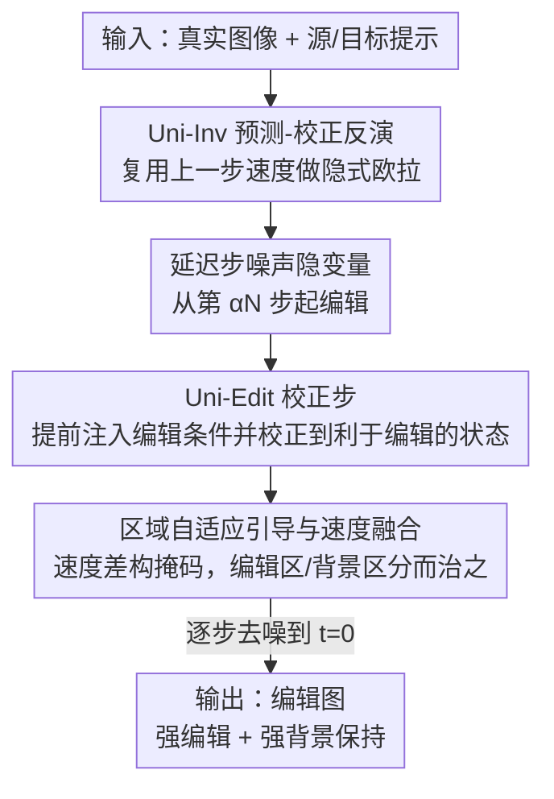

# UniEdit-Flow: Unleashing Inversion and Editing in the Era of Flow Models

**会议**: ICLR 2026  
**OpenReview**: [https://openreview.net/forum?id=ArU2CeB7Tm](https://openreview.net/forum?id=ArU2CeB7Tm)  
**代码**: 有（项目页，见论文 Project page）  
**领域**: 扩散模型 / 图像编辑 / 流匹配  
**关键词**: 流匹配, 图像反演, 图像编辑, 预测-校正, 区域自适应引导

## 一句话总结
针对流匹配模型（SD3、FLUX）"直线、不相交轨迹"带来的反演崩塌与延迟注入失效问题，本文提出一套无需训练、模型无关的预测-校正框架：用 Uni-Inv 通过复用上一步速度构造隐式欧拉闭式解实现高保真反演，再用 Uni-Edit 在编辑阶段加入校正步 + 区域自适应引导 + 速度融合，从而在 15 步以内同时做到强编辑和强背景保持，在重建和 PIE-Bench 编辑两项任务上全面 SOTA。

## 研究背景与动机

**领域现状**：扩散模型把"给真实图像加噪 → 换条件去噪"自然地变成了图像编辑器，由此催生了大量免训练的反演（DDIM Inversion 等）与基于反演的编辑方法。最近 SD3、FLUX 等**流匹配模型**（flow matching）取代扩散模型主导了文生图，它们与扩散模型有两点本质差异：一是公式从随机 SDE 变成确定性的概率流 ODE（rectified flow，建模两个分布之间的**直线**轨迹），二是架构从带交叉/自注意力的 U-Net 换成了 DiT / MM-DiT。

**现有痛点**：为扩散模型设计的反演与编辑技术搬到流模型上要么失效要么不适用。具体表现为两点：① **延迟注入（delayed injection）退化**——在扩散里"前半段用源条件、中途切到编辑条件"能平滑地让轨迹转向，但流模型轨迹是直线且互不相交，一条采样轨迹上的点很难在中途跳到另一条轨迹上，导致编辑效果"夹生"（inchoate），改不动；② **反演误差累积乃至崩塌**——直线轨迹对速度估计误差极其敏感，速度一旦估不准，反演会持续偏离原轨迹，在杂乱场景下重建直接失败。

**核心矛盾**：流模型"直线、不相交"这一让它生成更高效的几何性质，恰恰是反演和编辑的拦路虎——它既让速度误差无处可逃地累积，又让"中途换条件"这种依赖轨迹交叉的编辑范式不再成立。

**本文目标**：显式针对这两个设计变化（ODE 公式 + DiT 架构）重新设计反演与编辑，分解为两个子问题——(1) 如何在直线轨迹上做到精确、稳定的反演重建；(2) 如何在不相交轨迹下让延迟注入重新变得可控有效。

**切入角度**：作者不去"把随机性塞回流模型、让它退化成扩散"（很多同期工作的做法），而是**顺着**流模型直线轨迹的特性去用它——直线意味着相邻时间步的速度高度一致，因此可以"复用上一步速度"来低成本逼近隐式欧拉，这正是精确反演的钥匙。

**核心 idea**：用"预测-校正（predictor-corrector）"统一反演与编辑——反演端用复用速度做隐式欧拉校正得到 Uni-Inv，编辑端把延迟注入升级成"提前注入编辑条件 + 基于当前隐变量的校正步 + 区域掩码引导的速度融合"得到 Uni-Edit。

## 方法详解

### 整体框架

整篇方法围绕"校正（correction）"这一思想在反演和编辑两处分别落地。输入是一张真实图像 $Z_0$、描述源图的源条件 $c_S$ 和指定编辑目标的目标条件 $c_T$；输出是一张只改目标概念、其余区域几乎不变的编辑图。流程分三步：先用 **Uni-Inv** 把图像精确反演到延迟步对应的噪声隐变量 $\hat Z_{t_{\alpha N}}$（解决"反演要准"）；再从这个延迟步开始进入 **Uni-Edit** 的去噪循环，每一步先做一个**校正步**把当前隐变量推到"利于编辑"的状态（解决"延迟注入夹生"），再用从源/目标速度之差算出的**区域掩码**做自适应引导与速度融合（解决"别误伤背景"）；逐步去噪到 $t=0$ 即得编辑结果。其中延迟率 $\alpha$ 控制从第 $\alpha N$ 步才开始编辑，既平衡背景保持与编辑强度，又压低推理成本（$\mathrm{NFE}=3\alpha N+1$）。

### 关键设计

**1. Uni-Inv：用"复用速度"把隐式欧拉做成闭式解，换来精确反演**

反演的目标是把 ODE 解逆回初始噪声，理想公式是隐式欧拉 $\hat Z_{t_i}=\hat Z_{t_{i-1}}-(t_{i-1}-t_i)\,v_\theta(\hat Z_{t_i},t_i)$，但右边的 $v_\theta(\hat Z_{t_i},t_i)$ 依赖尚未求出的 $\hat Z_{t_i}$，是隐式的、求不出来。DDIM Inversion 的做法是直接用 $v_\theta(\hat Z_{t_{i-1}},t_{i-1})$ 近似，相当于假设模型预测在相邻时间步上不变，必然带误差。作者有两个观察：其一，把速度的时间参数从 $t_{i-1}$ 换成 $t_i$（即 $v_\theta(\hat Z_{t_{i-1}},t_i)$）更接近隐式欧拉、单步误差更小，因为消掉了 $v_\theta$ 里 $t$ 的误差能压低反演与采样之间的误差界；其二，rectified flow 的直线轨迹让"上一步速度"在当前步仍然高度可用。

由此 Uni-Inv 设计了一个**预测-校正**过程：先用上一步速度 $\hat v_{i-1}$ 把样本从 $t_{i-1}$ "回拨"到 $t_i$ 得到一个修正样本 $\bar Z_{t_i}=\hat Z_{t_{i-1}}-(t_{i-1}-t_i)\hat v_{i-1}$（预测/校正），再在 $\bar Z_{t_i}$ 上算出与当前时间步对齐的速度 $\hat v_i=v_\theta(\bar Z_{t_i},t_i)$，最后用这个"类去噪"速度执行真正的反演步 $\hat Z_{t_i}=\hat Z_{t_{i-1}}-(t_{i-1}-t_i)\hat v_i$。它本质是隐式欧拉的一个闭式近似，且**不需要额外的模型前向**（不像 ReNoise 那样递归采样、计算量翻倍）。论文给出命题 4.1：在速度场 Lipschitz 且轨迹满足 $\lVert Z_{t_p}-Z_{t_q}\rVert\le C\lVert t_p-t_q\rVert$ 的条件下，Uni-Inv 单步反演/重建误差为 $O(\Delta t_i^3)$，理论上保证了重建质量。

**2. Uni-Edit 校正步：提前注入编辑条件，再用当前隐变量校正出"利于编辑"的状态**

延迟注入在流模型上失效，是因为直线不相交轨迹下中途换条件很难产生足够不同的方向，结果改不动；而一上来就无约束地用编辑条件直接采样，又会从一开始就偏离原轨迹、过度编辑。Uni-Edit 的破法是：**既提前注入编辑条件、又在每步用当前隐变量 $\tilde Z_{t_i}$ 自身做校正**来抑制过度修改。

具体地，编辑从延迟步初始化 $\tilde Z_{t_{\alpha N}}=\hat Z_{t_{\alpha N}}$（直接接 Uni-Inv 的反演隐变量）。每步用速度场算出源条件速度 $v_i^S=v_\theta(\tilde Z_{t_i},t_i\mid c_S)$ 和目标条件速度 $v_i^T=v_\theta(\tilde Z_{t_i},t_i\mid c_T)$，构造校正量

$$s_i \propto (t_{i-1}-t_i)\,(v_i^T-v_i^S),$$

把样本校正到一个"利于编辑"的中间态 $\check Z_{t_i}=\tilde Z_{t_i}+s_i$。直觉上，$v_i^T-v_i^S$ 指向"该往编辑目标改的方向"，这一步主动消除早期采样里那些妨碍编辑的成分，让后续去噪能真正改动目标概念，而不是像朴素延迟注入那样夹生。

**3. 区域自适应引导与速度融合：用速度差当掩码，编辑区与背景区分而治之**

要"只改该改的、不动背景"，关键是知道哪些像素是编辑相关区域。作者沿用"不同提示下隐变量之差能高亮编辑关键区"的观察，直接用源/目标速度之差 $v_i^-=v_i^T-v_i^S$ 构造掩码 $m_i=\mathrm{MASK}(v_i^-)$，其中 $\mathrm{MASK}(\cdot)$ 是对通道均值图做 min-max 归一化。这个掩码在两处发挥作用：

其一，**区域引导的校正**——给校正步加权 $(1+m_i)$：$s_i=\omega(t_{i-1}-t_i)(1+m_i)\odot v_i^-$，让编辑相关区域以更大步幅"回拨"，更彻底地擦除待替换的原始概念，$\omega$ 是引导强度（实验固定为 5）。其二，**速度融合**——后续样本更新时按掩码把目标速度和源速度加权融合 $v_i^F=m_i\odot v_i^T+(1-m_i)\odot v_i^S$，再 $\tilde Z_{t_{i-1}}=\check Z_{t_i}+(t_{i-1}-t_i)v_i^F$；即编辑区跟目标速度走、背景区跟源速度走。相比已有的"隐变量融合（latent fusion）"，速度融合不需要额外显存开销，也避免了把反演隐变量和编辑隐变量直接拼接导致的"狮身人面像（Sphinx）"式不自然产物。

### 损失函数 / 训练策略

本方法**无需任何训练或调参**（tuning-free、training-free、model-agnostic）。底层流模型沿用标准 flow matching 目标 $\min_\theta \mathbb{E}\lVert (Z_1-Z_0)-v_\theta(Z_t,t)\rVert^2$（$Z_t=tZ_1+(1-t)Z_0$）训练，Uni-Inv 与 Uni-Edit 都只在推理时改采样策略。关键超参：编辑用 15 步、延迟率 $\alpha=0.6$ 或 $0.8$、引导强度 $\omega=5$；推理预算 $\mathrm{NFE}=3\alpha N+1$；反演时 SD3 用 50 步、FLUX 用 30 步。

## 实验关键数据

### 主实验

**反演与重建**（Conceptual Captions 验证集，约 1.34 万张图，NFE 对齐到 SD3≈100 / FLUX≈60）：

| 模型 | 方法 | MSE↓($10^3$，无条件) | PSNR↑(无条件) | SSIM↑($10^2$，无条件) | MSE↓($10^3$，有条件) | PSNR↑(有条件) |
|------|------|------|------|------|------|------|
| SD3 | FireFlow | 20.27 | 19.60 | 66.96 | 16.95 | 20.85 |
| SD3 | **Uni-Inv** | **11.52** | **21.81** | **78.89** | **7.86** | **23.41** |
| FLUX | FireFlow | 23.31 | 18.15 | 63.85 | 30.78 | 17.59 |
| FLUX | **Uni-Inv** | **8.85** | **22.15** | **79.45** | **14.36** | **20.91** |

无论有无文本条件、SD3 还是 FLUX，Uni-Inv 在 MSE / PSNR / SSIM / LPIPS 上全面超过 Euler、Heun、RF-Solver、FireFlow，尤其无条件（只给空文本）场景下其它方法重建普遍崩，Uni-Inv 仍近乎完美。

**文本驱动图像编辑**（PIE-Bench，700 张图、10 类编辑）：

| 方法 | 模型 | Struc.Dist↓($10^3$) | PSNR↑(背景) | CLIP-Whole↑ | CLIP-Edited↑ | Steps | NFE |
|------|------|------|------|------|------|------|------|
| InfEdit | Diff. | 13.78 | 28.51 | 25.03 | 22.22 | 12 | 72 |
| RF-Solver | FLUX | 31.10 | 22.90 | 26.00 | 22.88 | 15 | 60 |
| FireFlow | FLUX | 28.30 | 23.28 | 25.98 | 22.94 | 15 | 32 |
| **Ours (15, 0.6)** | SD3 | 21.40 | 24.96 | 26.39 | 22.72 | 15 | 28 |
| **Ours (15, 0.8)** | FLUX | 26.85 | 24.10 | 26.97 | **23.51** | 15 | 37 |
| **Ours (15, 0.6)** | FLUX | **10.14** | **29.54** | 25.80 | 22.33 | 15 | 28 |

Uni-Edit 在结构距离、背景保持（PSNR/LPIPS/MSE/SSIM）和 CLIP 相似度上整体领先，且只用 15 步、NFE 低至 28，比扩散基线（NFE 100）便宜得多。

### 消融实验

论文主表已用不同配置体现各组件作用，核心对比可归纳为：

| 配置 | 现象 | 说明 |
|------|------|------|
| 朴素流反演（vanilla） | 杂乱场景重建直接失败 | 直线轨迹下速度误差累积、崩塌 |
| 朴素延迟注入 | 编辑"夹生"、改不动 | 不相交轨迹无法中途转向 |
| 直接条件采样 | 过度编辑、背景被破坏 | 从一开始就偏离原轨迹 |
| + Uni-Inv | 重建精确、无条件也稳 | 复用速度的隐式欧拉校正 |
| + 校正步 | 编辑变得充分有效 | 提前注入 + 当前隐变量校正 |
| + 区域引导/速度融合 | 编辑区改、背景留 | 速度差掩码分而治之 |
| vs 隐变量融合 | 避免"Sphinx"式不自然产物 | 速度融合无额外显存且更自然 |

### 关键发现
- **速度的时间参数对齐很关键**：把近似速度的时间从 $t_{i-1}$ 改到 $t_i$（更接近隐式欧拉）就能显著降低每步局部误差，这是 Uni-Inv 精度的直接来源（图 4 的逐步误差曲线印证）。
- **无条件反演是真正的试金石**：去掉文本条件后，RF-Solver / FireFlow 等基线重建明显变差，而 Uni-Inv 几乎不掉点，说明它的提升来自反演机制本身而非借助文本先验。
- **掩码随时间演化符合直觉**：早期步聚焦更大区域、用更强编辑强度去抹掉原始概念，后期步细化细节、逐渐减弱 $m_i$ 影响，编辑过程可解释。
- **速度融合优于隐变量融合**：后者直接拼接反演/编辑隐变量会产出"狮身人面像"式拼接畸形，速度融合则更自然且零额外显存。

## 亮点与洞察
- **把"缺点"用成"优点"**：直线、不相交轨迹本是反演/编辑的难点，作者反过来利用"直线 ⇒ 相邻步速度高度一致"这一点，用复用速度低成本实现隐式欧拉，思路非常对症。
- **预测-校正统一两端**：反演端校正样本、编辑端校正方向，同一个"correction"思想分别落地，框架优雅且都免训练、模型无关。
- **速度差一物两用**：$v_i^T-v_i^S$ 既是编辑方向（校正量），又是定位编辑区的掩码来源，一个量同时解决"往哪改"和"改哪里"。
- **可迁移 trick**：用条件速度（或预测）之差做区域掩码、用速度融合替代隐变量融合，这两点可直接搬到其它基于采样的流模型编辑/可控生成任务上。

## 局限与展望
- 作者计划把更多条件（如用一张图像作为个性化提示）注入编辑流程，当前只覆盖文本驱动编辑。
- 掩码来自速度差的通道均值归一化，是较朴素的启发式；对编辑区与背景纠缠很深、或多目标同时编辑的场景，掩码质量可能成为瓶颈（论文未深入讨论）。
- 延迟率 $\alpha$、引导强度 $\omega$ 等超参在背景保持与编辑强度间权衡，虽固定值已能 SOTA，但不同编辑类型的最优取值是否一致、是否需自适应，论文未系统消融。
- 理论误差界依赖速度场 Lipschitz 与轨迹的常数 $C$ 假设，真实大模型上这些假设的成立程度未量化。

## 相关工作与启发
- **vs DDIM Inversion**：DDIM 用 $v_\theta(\hat Z_{t_{i-1}},t_{i-1})$ 近似未知速度、假设相邻步预测不变；Uni-Inv 改用对齐当前时间步 $t_i$ 的复用速度做隐式欧拉闭式解，单步误差降到 $O(\Delta t^3)$，重建更准且无需文本条件。
- **vs RF-Solver / FireFlow**：同为面向流模型的确定性反演，但它们偏向减少离散化误差、非重建导向，限制了在编辑中的可用性；Uni-Inv 专门面向"反演=重建逆"的对齐，重建可靠性与局部精确性更高，并直接支撑下游编辑。
- **vs 延迟注入（扩散范式）/ 注意力操控编辑（P2P、MasaCtrl、InfEdit）**：扩散式延迟注入依赖轨迹交叉、搬到流模型即失效，注意力法常把属性扩散到无关区域且依赖特定架构；Uni-Edit 通过提前注入 + 校正步 + 区域速度融合，在流模型上重新激活延迟注入，且模型无关、背景保持更好。
- **vs 隐变量融合（latent fusion）**：用掩码融合反演/编辑隐变量会产生"Sphinx"式不自然产物且占显存；本文的速度融合无额外显存、产物更自然。

## 评分
- 新颖性: ⭐⭐⭐⭐⭐ 直击流模型直线轨迹特性，用复用速度做隐式欧拉、用速度差一物两用，思路新且自洽。
- 实验充分度: ⭐⭐⭐⭐ 反演（1.34 万图）+ 编辑（PIE-Bench 700 图）双任务、SD3/FLUX 双模型、多基线全面对比，主表充分；显式消融表略少，多放在附录。
- 写作质量: ⭐⭐⭐⭐⭐ 把"为什么扩散方法在流模型失效"分析得透彻，方法图文与算法清晰。
- 价值: ⭐⭐⭐⭐⭐ 免训练、模型无关、15 步低成本即 SOTA，对流模型时代的反演与编辑实用价值高。

<!-- RELATED:START -->

## 相关论文

- [\[ICLR 2026\] FlowAlign: Trajectory-Regularized, Inversion-Free Flow-based Image Editing](flowalign_trajectory-regularized_inversion-free_flow-based_image_editing.md)
- [\[ICLR 2026\] Free Lunch for Stabilizing Rectified Flow Inversion](free_lunch_for_stabilizing_rectified_flow_inversion.md)
- [\[ICML 2025\] Taming Rectified Flow for Inversion and Editing](../../ICML2025/image_generation/taming_rectified_flow_for_inversion_and_editing.md)
- [\[ICCV 2025\] FlowEdit: Inversion-Free Text-Based Editing Using Pre-Trained Flow Models](../../ICCV2025/image_generation/flowedit_inversion-free_text-based_editing_using_pre-trained_flow_models.md)
- [\[ICLR 2026\] Joint Distillation for Fast Likelihood Evaluation and Sampling in Flow-based Models](joint_distillation_for_fast_likelihood_evaluation_and_sampling_in_flow-based_mod.md)

<!-- RELATED:END -->
