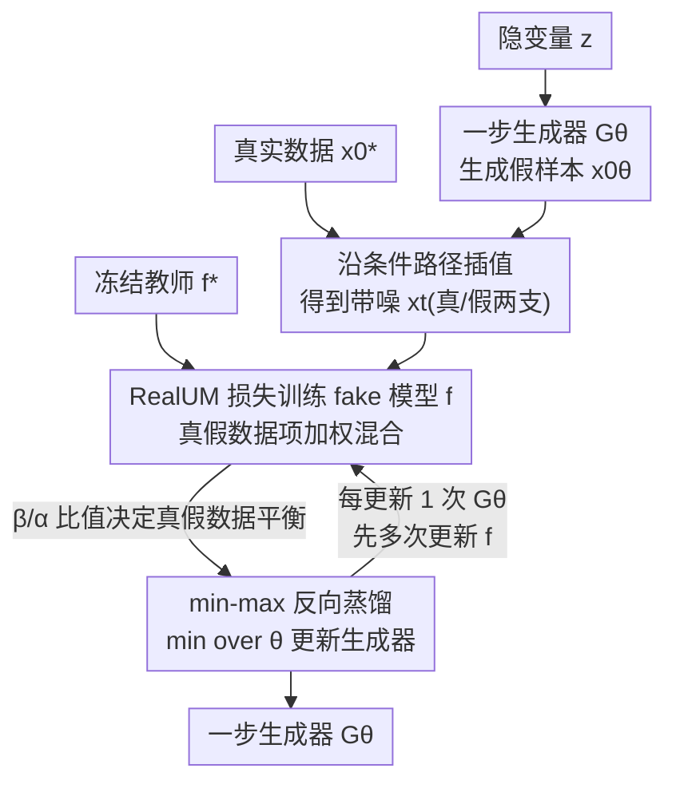

# RealUID：用真实数据监督蒸馏所有 Matching 模型（无需 GAN）

**会议**: ICLR 2026  
**OpenReview**: [https://openreview.net/forum?id=8NuN5UzXLC](https://openreview.net/forum?id=8NuN5UzXLC)  
**代码**: https://github.com/David-cripto/RealUID  
**领域**: 扩散模型 / 一步生成 / 模型蒸馏  
**关键词**: matching 模型, 一步蒸馏, 真实数据监督, 逆向优化, flow matching

## 一句话总结
RealUID 用一个"线性化 + 逆向优化"的统一视角把 SiD / FGM / IBMD 这些只针对单一框架的一步蒸馏方法收编成同一个 min-max 损失，并由此设计出一种**不依赖 GAN、不加判别器**就能把真实数据直接注入蒸馏目标的损失，在 CIFAR-10 上把 flow 蒸馏的 FID 从 2.58 压到 1.98（无条件）、2.21 压到 1.87（有条件），收敛速度也快约 3 倍。

## 研究背景与动机

**领域现状**：扩散模型（DM）、Flow Matching（FM）、Bridge Matching、Stochastic Interpolants 这些生成模型本质上都在做同一件事——学一个 ODE/SDE 的漂移/score 把噪声变回数据，论文把它们统称为 **matching 模型**。它们生成质量极高，但通病是采样要积分很多步、推理慢。于是出现了一批**一步蒸馏**方法（SiD 之于扩散、FGM 之于 flow、IBMD 之于 bridge），用预训练的多步教师指导一个一步生成器 $G_\theta$。

**现有痛点**：这条线有两个老问题。其一，**各做各的**——SiD、FGM、IBMD 数学骨架几乎一样，却分别为各自框架重新推一套损失、各写一套复杂证明，缺一个统一解释。其二，**用不上真实数据**——这些方法天生是 data-free 的，生成器只能听教师一个人的，连教师本身的错误都没法纠正；想把真实数据喂进去，现有做法只能额外挂一个 GAN：给 fake model 加一个判别器头、再加一项对抗损失。

**核心矛盾**：加 GAN 带来的代价不小——要改网络架构（多一个判别头）、要调一堆和主蒸馏损失毫无关系、尺度不可解释的对抗权重 $\lambda_{adv}$，还继承了对抗训练的老毛病：目标非平稳、模式崩塌、对训练动态敏感。问题的根子在于：**真实数据是被"外挂"进来的，而不是从蒸馏损失本身自然长出来的**。

**本文目标**：(1) 给所有 matching 模型的一步蒸馏一个统一、简洁、严格的理论框架；(2) 找到一种自然、无需任何额外模型或损失的方式把真实数据并进蒸馏。

**切入角度**：作者注意到，真正卡住统一的是蒸馏损失里那个"期望套在平方范数里"的不可解项。如果能用一个**线性化恒等式**把它拆成线性可采样的形式，整个蒸馏就能写成一个统一的 min-max；而这个 min-max 的结构恰好是**逆向优化（inverse optimization）**的标准形式——逆向优化天然兼容"换一个损失"，这就为塞入真实数据留出了口子。

**核心 idea**：用线性化把蒸馏统一成 min-max 逆向优化（UID），再把其中的 Unified Matching 损失改写成"生成数据项 + 真实数据项"的加权和（RealUM），只要保证在真实数据上最小化仍还原同一个教师，真实数据就被无缝、无 GAN 地注入了蒸馏。

## 方法详解

### 整体框架

RealUID 要解决的是：把一个昂贵的、冻结的多步教师 $f^*$ 蒸馏成一个一步生成器 $G_\theta$，同时让真实数据 $p^*_0$ 直接参与监督。整体是一个 min-max 交替优化：内层最大化训练一个 **fake model** $f$ 去拟合当前生成分布（同时也记住真实数据），外层最小化更新生成器 $G_\theta$，逼着生成分布去对齐教师所代表的真实分布。

具体一轮怎么转：隐变量 $z$ 经一步生成器得到假样本 $x_0^\theta$；真实样本 $x_0^*$ 直接取自数据集；两边各自沿 matching 模型的条件路径插值出带噪样本 $x_t$。fake model $f$ 用一个**同时含生成数据项和真实数据项的 RealUM 损失**去训练（这是真实数据进入的唯一入口）；冻结教师 $f^*$ 提供参照。把"教师项 − fake 项"组成 RealUID 损失，对 $f$ 取 max、对 $\theta$ 取 min。训练时为稳定，每更新一次生成器，先把 fake model 更新若干次。整套推导能让 min-max 各项都线性可采样的关键，是下面第 1 个设计里的线性化技巧。

### 关键设计

**1. 线性化技巧：把不可解的距离改写成统一的 min-max，收编所有蒸馏方法**

蒸馏的目标本是最小化教师函数 $f^*$ 与学生函数 $f^\theta$ 在生成路径上的平方距离 $\mathbb{E}\|f^*_t(x_t^\theta) - f^\theta_t(x_t^\theta)\|^2$。麻烦在于 $f^\theta_t(x_t^\theta) = \mathbb{E}_{x_0^\theta}[f^\theta_t(x_t^\theta|x_0^\theta)]$ 是一个期望，套进平方范数后整项不可解：直接采样会有偏，而且要对范数内的期望求导还得显式知道 $p_0^\theta$ 对 $\theta$ 的依赖，实际只知道样本依赖。作者用一个简单恒等式 $\|a\|^2 = \max_b\{-\|b\|^2 + 2\langle b, a\rangle\}$，引入辅助函数 $\delta$（再令 $\delta = f^* - f$，$f$ 即 fake model）把平方范数线性化，于是

$$\mathbb{E}\|f^*_t - f^\theta_t\|^2 = \max_{f}\Big\{ L_{UM}(f^*, p_0^\theta) - L_{UM}(f, p_0^\theta) \Big\}$$

每一项都变成对期望线性、可直接采样的形式。由此整个蒸馏写成统一的 **UID 损失** $\min_\theta\max_f\{L_{UM}(f^*, p_0^\theta) - L_{UM}(f, p_0^\theta)\}$（Theorem 1：真实数据生成器 $p_0^\theta = p_0^*$ 是其解）。它的价值在于：SiD（取 $\alpha_{SiD}=0.5$）、FGM、IBMD 都恰好是它的特例——以前每个框架要靠各自冗长的证明，现在一个线性化就讲清，而且这套技巧比具体模型的证明更通用，能直接推广到 Bridge Matching、Stochastic Interpolants，甚至换成非平方 $\ell_2$ 距离的变体。

**2. RealUM 损失：把真实数据拆进 fake model 目标，无需判别器**

UID 的 min-max 结构正是逆向优化 $\min_\theta\max_f\{L(f^*,\theta) - L(f,\theta)\}$ 的形式，而逆向优化对"换一个损失 $L$"是开放的——只要新损失在真实数据上最小化仍还原同一个教师 $f^*$，整套 min-max 的解就不变。作者据此把 Unified Matching 损失改造成 **RealUM 损失**（Def 2）：一个由 $\alpha,\beta\in(0,1]$ 加权的两项之和，

$$L^{\alpha,\beta}_{R\text{-}UM}(f, p_0^\theta) = \underbrace{\alpha\,\mathbb{E}\big\|f_t(x_t^\theta) - \tfrac{\beta}{\alpha} f^\theta_t(x_t^\theta|x_0^\theta)\big\|^2}_{\text{生成数据项}} + \underbrace{(1-\alpha)\,\mathbb{E}\big\|f_t(x_t^*) - \tfrac{1-\beta}{1-\alpha} f^*_t(x_t^*|x_0^*)\big\|^2}_{\text{真实数据项}}$$

精妙处在系数配比：因为 $\alpha + (1-\alpha) = 1$ 且 $\alpha\cdot\frac{\beta}{\alpha} + (1-\alpha)\cdot\frac{1-\beta}{1-\alpha} = 1$，当输入是真实数据时两项合并后仍 $\propto \mathbb{E}\|f_t(x_t^*) - f^*_t(x_t^*|x_0^*)\|^2$，最小化照样得到原教师 $f^*$。于是逆向 min-max 的解依旧是真实数据生成器（Theorem 2），但真实数据已经通过真实数据项进入了 fake model 的训练。和 GAN 路线相比，这里不改 fake model 架构、不加判别器、不引入和主损失无关的对抗项——真实数据是从蒸馏损失内部自然长出来的，$\alpha,\beta$ 都来自 data-free UID（取 $\alpha=\beta=1$ 即退回原 UID）。

**3. β/α 比值：决定真实数据到底有没有真正起作用**

真实数据只在"对 $f$ 取 max"这一步进入，生成器只是间接被这个记住了真实数据的 fake model 影响。Lemma 2 揭示了关键：真正起作用的不是 $\alpha$、$\beta$ 本身，而是 $\alpha$ 与 $\beta/\alpha$——$\alpha$ 只整体缩放被最小化的距离，$\beta/\alpha$ 才决定距离里 $f^\theta_t$ 与 $f^*_t$ 的相对关系。当 $\beta/\alpha = 1$ 时，该距离与 data-free 的距离仅差一个缩放，**即便形式上加了真实数据也等于没加**；只有 $\beta/\alpha \neq 1$，距离里才会出现 $p_0^\theta(x_t)\approx 0$ 但 $p_0^*(x_t)\gg 0$ 处不消失的反馈项——也就是生成器**第一次能收到"真实数据覆盖到、但我没覆盖到"区域的监督**，并且可证明地纠正教师本身的误差。但也不能过头：$\alpha,\beta$ 太小会让生成数据项在 fake model 里的贡献消失、梯度趋零，$\beta/\alpha\ll 1$ 同样梯度消失，$\beta/\alpha\gg 1$ 又会淹没真实数据项。所以实用配方是先找一个偏离 1 不多的好 $\beta/\alpha$（实验里 $0.98$ 或 $1.02$ 最佳），再把 $\alpha<1$ 微调，两者都贴近 1。

### 损失函数 / 训练策略

总目标是 RealUID 的 min-max：$\min_\theta\max_f\{L^{\alpha,\beta}_{R\text{-}UM}(f^*, p_0^\theta) - L^{\alpha,\beta}_{R\text{-}UM}(f, p_0^\theta)\}$。实现上交替进行——固定生成器、用 RealUM 损失把 fake model $f$ 在生成数据+真实数据上更新若干次（保证内层 max 大致到位、稳定训练），再固定 $f$、用对应梯度更新一次生成器 $G_\theta$。实验用 flow matching 落地，搜参范围 $\alpha,\beta\in[0.85,1.0]$ 步长 $0.02$（按 $\alpha$ 与 $\beta/\alpha$ 网格搜），太低会生成噪点图。另设 **fine-tuning 阶段**：生成器从从头训练得到的最佳 checkpoint 初始化、fake model 从教师初始化，再用一组新的 $\alpha_{FT},\beta_{FT}$ 继续训，进一步刷低 FID。

## 实验关键数据

实验在 CIFAR-10（32×32）和 CelebA（64×64）上做，统一用轻量的 flow matching 架构（而非 SiD/FGM 那种重型 EDM），自己训 flow 教师，报 50k 样本的 test FID。

### 主实验

CIFAR-10 与各家一步生成方法对比（FID↓，NFE=1）：

| 设置 | 教师 Flow(100步) | FGM(UID 基线) | UID+GAN | **RealUID+FT** | 最强扩散对手 SiD2A |
|------|------|------|------|------|------|
| 无条件 | 3.57 | 3.08 / 2.58 | 2.10 | **1.98** | 1.50 |
| 有条件 | 5.56 | 2.58 / 2.21 | 1.88 | **1.87** | 1.39 |

RealUID 在 flow 一族里全面超过最强 flow 蒸馏基线 FGM，且推理近 2× 更快；逼近领先的扩散蒸馏 SiD（$\alpha_{SiD}=1.0/1.2$），但仍逊于对抗增强的 SiD2A——作者归因于架构与教师容量差距，而非缺对抗损失。

### 消融实验

CIFAR-10 上 $(\alpha,\beta/\alpha)$ 网格与 GAN 权重对照（FID↓，基线 = UID 无真实数据，$\alpha=\beta=1$）：

| 配置 | 无条件 FID | 有条件 FID | 说明 |
|------|-----------|-----------|------|
| UID 基线（$\beta/\alpha=1$） | 2.58 | 2.21 | 形式上加真实数据也无效 |
| RealUID（$\beta/\alpha=0.98$ 或 $1.02$） | 2.33–2.44 | 2.02–2.19 | 多数 $\alpha$ 下超过基线 |
| $\beta/\alpha=0.96$ / $1.04$（偏离过大） | 2.66–2.97 | — | 退化，劣于基线 |
| 最佳 GAN（$\lambda^{G}_{adv}{=}0.3,\lambda^{D}_{adv}{=}1$） | 2.29 | 2.12 | 无条件持平、有条件明显输给 RealUID |

### 关键发现
- **$\beta/\alpha$ 才是开关**：只有它落在 $[0.98,1.02]$ 这个"偏离 1 一点点"的窄带里真实数据才起正作用，$\beta/\alpha=1$ 等于没加、偏太远反而掉点——和理论分析完全吻合。
- **比 GAN 更省更稳**：不用判别器、不用对抗损失，最佳配置在有条件生成上明显优于 GAN 方案，无条件持平。
- **收敛快约 3 倍**：最佳 RealUID 配置约 100k 迭代就达到基线饱和水平，基线要约 300k 才追平。
- **跨数据集稳健**：CelebA 64×64 上最优 $\beta/\alpha$ 与性能规律和 CIFAR-10 一致，说明这个比值不是 per-dataset 调出来的玄学。

## 亮点与洞察
- **一个恒等式收编三套方法**：$\|a\|^2=\max_b\{-\|b\|^2+2\langle b,a\rangle\}$ 这个本科级别的恒等式，被用来消掉"期望套范数"的不可解项，直接把 SiD/FGM/IBMD 统一成一个 min-max——理论简洁度远胜各框架原本的专用证明。
- **把蒸馏看成逆向优化**：识别出 UID 的 min-max 就是 inverse optimization 的标准形，这层视角才是"能随便换损失塞真实数据"的真正许可证，也是 RealUID 区别于 GAN 外挂的根。
- **可迁移的 trick**：只要一个损失满足"在真实数据上最小化还原同一教师"这个不变量，就能往蒸馏里加任意监督项——这个"保持教师不动点"的设计套路可复用到其他 data-free 蒸馏场景。
- **β/α 的反直觉**：形式上加了真实数据 ($\alpha=\beta<1$) 却可能毫无效果，必须刻意让 $\beta/\alpha\neq 1$ 才打开真实数据反馈——这个"加了≠有用"的洞察很容易被忽略。

## 局限与展望
- **仍逊于对抗增强的 SOTA**：RealUID+FT 距 SiD2A（1.50 / 1.39）还有差距，作者归因于架构和教师容量，但"无对抗就达不到"的可能性没有被实验完全排除。
- **实验规模偏小**：只验到 CIFAR-10 与 CelebA 64×64，未在 ImageNet 或更高分辨率/文生图等大规模设置上检验，"universal + 无 GAN"在大模型上能否守住优势存疑。
- **窄带调参敏感**：$\beta/\alpha$ 的有效区间极窄（$[0.98,1.02]$），跨数据集虽稳，但换新模型族时仍需网格搜索，且没有自动选系数的方法。
- **理论以平方 $\ell_2$ 为主**：核心结论围绕平方距离与高斯条件路径展开，非平方变体与更一般耦合放在附录，主文未充分实验验证。

## 相关工作与启发
- **vs FGM / SiD / IBMD**：它们分别为 flow / 扩散 / bridge 单独推损失、且 data-free；本文证明三者都是 UID 的特例（FGM、SiD 取 $\alpha_{SiD}=0.5$ 等价于 $\alpha=\beta=1$ 的 UID），并补上了真实数据这一维。
- **vs SiD+GAN / FGM+GAN（如 SiDA/SiD2A）**：它们靠额外判别器 + 对抗损失引入真实数据，要改架构、调不可解释的 $\lambda_{adv}$、且有模式崩塌等老问题；RealUID 只改 UM 损失本身、不加任何网络，配比 $\alpha,\beta$ 物理含义清晰。
- **vs DMD**：DMD 最小化的是真实/生成分布的 KL，本文指出它是 UID 框架在"换成特殊 KL 损失"时的特例，进一步印证了线性化+逆向优化视角的统摄力。

## 评分
- 新颖性: ⭐⭐⭐⭐⭐ 用线性化+逆向优化统一全部 matching 蒸馏，并由此导出无 GAN 注入真实数据的新损失，视角和方法都新。
- 实验充分度: ⭐⭐⭐⭐ 消融与理论咬合紧密、有 GAN 对照，但只到 CIFAR/CelebA 小数据集，未上大规模。
- 写作质量: ⭐⭐⭐⭐⭐ 理论层层递进、定义/定理清晰，把复杂统一框架讲得简洁。
- 价值: ⭐⭐⭐⭐ 给一步蒸馏提供了干净的统一框架和省去 GAN 的实用方案，理论贡献大于当前 SOTA 数字。

<!-- RELATED:START -->

## 相关论文

- [\[ICLR 2026\] Delay Flow Matching](delay_flow_matching.md)
- [\[ICLR 2026\] Flow Matching with Semidiscrete Couplings](flow_matching_with_semidiscrete_couplings.md)
- [\[ICLR 2026\] Carré du champ Flow Matching: 用几何感知噪声改善生成模型的质量-泛化权衡](carré_du_champ_flow_matching_better_quality-generalisation_tradeoff_in_generativ.md)
- [\[ICLR 2026\] Edit-Based Flow Matching for Temporal Point Processes](edit-based_flow_matching_for_temporal_point_processes.md)
- [\[ICLR 2026\] Discrete Guidance Matching: Exact Guidance for Discrete Flow Matching](discrete_guidance_matching_exact_guidance_for_discrete_flow_matching.md)

<!-- RELATED:END -->
