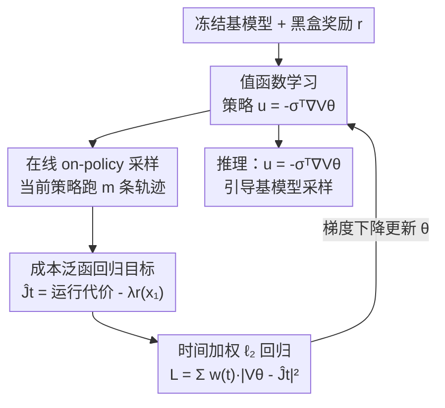

# Value Matching: Scalable and Gradient-Free Reward-Guided Flow Adaptation

**会议**: ICLR 2026  
**OpenReview**: [https://openreview.net/forum?id=7iXt44Actj](https://openreview.net/forum?id=7iXt44Actj)  
**领域**: 扩散模型 / 流匹配 / 奖励对齐  
**关键词**: 流模型适配, 值函数学习, 随机最优控制, 不可微奖励, 内存高效

## 一句话总结
把"用奖励适配大规模流/扩散模型"重新表述成随机最优控制问题，**只在线学习一个小的值网络**而冻结基模型，从而支持不可微（黑盒）奖励、按需调节显存，在图像与分子生成上用不到微调方法 5% 的显存达到可比性能。

## 研究背景与动机

**领域现状**：流匹配（flow matching）和扩散模型已经成为图像、化学、生物、机器人等领域的主力生成模型。把这些预训练大模型适配到下游奖励（如可控编辑、药物发现）是落地的关键，目前主流是两类做法：一是基于强化学习（DDPO/DPOK）和随机最优控制（SOC，如 Adjoint Matching）的**微调**，二是不动基模型参数的 **Classifier Guidance（CG）**。

**现有痛点**：微调类方法要对整个基模型反向传播，必须缓存所有中间激活，**显存随模型规模线性膨胀**——SD2 这种量级动辄要 250GB 显存、800 GPU-小时。更糟的是很多 SOTA（如 Adjoint Matching）依赖 reward 的梯度，而药物发现里的 reward 常来自外部模拟器或实验测量，只能给标量、不可微。CG 虽然冻结基模型、省显存、支持黑盒 reward，但它是**离线**算法：只在预训练分布 $p^{\text{pre}}_t$ 的样本上训练，无法探索到数据分布之外的高奖励区域；而且它的损失里带 $\exp(\lambda r)$ 项，在 32 位浮点下当 $\lambda r > 90$ 就溢出，把奖励缩放 $\lambda$ 限制得很小。

**核心矛盾**：微调把"奖励适配"和"基模型优化"绑死了，所以显存被基模型规模绑架；CG 解耦了二者却因为离线训练在分布偏移上吃亏。我们想要的是：既像 CG 一样解耦、省显存、支持黑盒 reward，又像微调一样能在线探索高奖励区。

**核心 idea**：把 KL 正则的奖励适配写成一个二次成本的控制-仿射 SOC 问题，转而**在线学习它的值函数 $V$**。学到 $V$ 后由 Pontryagin 最小值原理直接给出最优控制 $u^\star(x,t) = -\sigma^\top(t)\nabla_x V(x,t)$；而值函数即使在 reward 不可微时仍然可微（噪声起了平滑核的作用），于是既能处理黑盒 reward，又能把"训练分布"对齐到"当前策略分布"实现在线探索。

## 方法详解

### 整体框架
VM（Value Matching）把适配问题看成：在 $[0,1]$ 时间区间上控制一条由基模型 SDE 决定的轨迹 $dx_t = (b^{\text{pre}} + \sigma u)\,dt + \sigma\,dB_t$，目标是最大化终端奖励 $\lambda r(x_1)$ 同时不偏离基分布太远。其对应的值函数 $V(x,t)=\inf_u J(u;x,t)$ 是从 $(x,t)$ 出发的最优剩余成本，最优控制由 $u^\star=-\sigma^\top\nabla_x V$ 给出。**整个方法就是一个迭代回归循环**：用当前值网络诱导出控制策略去在线采样轨迹，沿轨迹用单样本蒙特卡洛估计成本泛函 $\hat J_t$ 当回归目标，再把 $V_\theta(x_t,t)$ 回归到 $\hat J_t$ 上更新参数，如此往复直到 $V_\theta$ 收敛到真值函数（论文证明 $V$ 是 $\mathbb{E}[L_{\text{VM}}]$ 的唯一临界点）。基模型全程冻结，只训练这个可大可小的值网络。

### 关键设计

**1. 值函数学习：把奖励适配从基模型优化里解耦出来**

这一设计直击微调"显存被基模型绑架 + 要求 reward 可微"两个痛点。VM 不更新基模型，而是另学一个值函数 $V$，再由一阶最优性条件 $u^\star(x,t)=-\sigma^\top(t)\nabla_x V(x,t)$ 拿到控制。这么做有两个好处直接来自数学结构。其一，**reward 不可微也无妨**：值函数 $V(x,t)=-\log\mathbb{E}_{p^{\text{pre}}}[\exp(\lambda r(x_1))\mid x_t=x]$ 是对从 $x_t$ 到 $x_1$ 所有噪声实现的平均，噪声相当于一个平滑核，能把 reward 的不连续抹平——论文用 Proposition 1 形式化证明：只要 $r$ 有界可测，$V$ 在 $t<1$ 处就对 $x$ 可微。于是即便 reward 是 JPEG 压缩比特数、xTB 偶极矩这类只返回标量的黑盒，最优控制依然良定义。其二，**资源开销可控**：主导计算从"训练基模型"转成"基模型推理 + 值网络训练"，而值网络的架构可以自由选小，所以显存和算力是可调的，这正是它能省下 95% 显存的根本原因。

**2. 在线 on-policy 训练：让训练分布追着最优分布走**

CG 的根本缺陷在于离线——它只在固定的预训练分布 $p^{\text{pre}}_t$ 上采样训练，而生成式优化恰恰想跑到数据稀疏的高奖励区。当策略把概率质量推向高奖励区时，来自 $p^{\text{pre}}_t$ 的训练样本越来越不 informative，样本效率和最终能达到的最优性都受限。VM 的修法是把训练轨迹改成**用当前策略 $u=-\sigma^\top\nabla_x V_{\bar\theta}$ 在线采样**：$dx_t=(b^{\text{pre}}-\sigma^2\nabla V_{\bar\theta})\,dt+\sigma\,dB_t$。这样训练分布始终对齐到策略推理时真正会遇到的分布 $p^u_t$，消除了 CG 那种 train-test 失配。在 2D 可视化里可以清楚看到 VM 的训练分布逐步贴合最优 tilted 分布而 CG 不会；实践上 VM 在中等奖励缩放下仍稳定训练，而 CG 在 $\lambda$ 稍大时就发散。

**3. 成本泛函回归目标 + 时间加权：把值函数学习变成稳定的回归**

有了在线轨迹，VM 用一个简洁的 $\ell_2$ 回归来学 $V$。沿每条轨迹用单样本蒙特卡洛估计成本泛函作为回归目标：

$$\hat J_t = \tfrac{1}{2}\int_t^1 \sigma^2(s)\,\|\nabla_x V_{\bar\theta}(x_s,s)\|^2\,ds - \lambda r(x_1),$$

其中 $\bar\theta=\text{stopgrad}(\theta)$ 保证目标在反传时被当作固定值（类似 TD 学习里的 target）。然后把网络预测回归到这个目标：$L(\theta)=\tfrac12\int_0^1 w(t)\,|V_\theta(x_t,t)-\hat J_t|^2\,dt$。关键的工程点是**时间加权 $w(t)$**：memoryless 噪声调度下 $\sigma(t)\to\infty$（当 $t\to0$），不加权会让早期时间步的方差炸掉，作者用 $w(t)=\frac{1}{\lambda^2}\big(1+\frac12\int_t^1\sigma^2(s)\,ds\big)^{-1}$ 把 reward 按 $\lambda$ 归一化、并对未来方差大的时间步降权，从而稳定训练。这套回归避免了 CG 损失里的 $\exp(\lambda r)$ 溢出问题，因此能用大的奖励缩放 $\lambda$、表达更强的 reward。

### 损失函数 / 训练策略
核心损失就是上面的加权 $\ell_2$ 值匹配 $L_{\text{VM}}$。每轮迭代：① 用当前策略采 $m$ 条轨迹；② 对每条轨迹每个时间步算 $\hat J_t$（stopgrad）；③ 算加权回归损失并对 $\nabla L(\theta)$ 做一步梯度下降。SDE 用 Euler-Maruyama 离散成 $T$ 步、积分用黎曼和近似。整个算法只有一个超参数（奖励缩放 $\lambda$），相比 CT-PPO 需要大规模网格搜索要省心得多。论文还从两个视角刻画 VM 的位置：它是 **Adjoint Matching 的零阶（gradient-free）类比**（AM 回归 $\nabla_x J$ 学 $\nabla_x V$，VM 回归 $J$ 学 $V$ 再反传求梯度）；也是 **CT-PPO 的简化**（把 CT-PPO 的 actor 设为 $s^{\text{pre}}-\nabla_x V_\theta$ 后，actor 优化步变冗余、无需微调基模型，VM 自然浮现）。

## 实验关键数据

### 主实验
在 CIFAR、DiT(ImageNet 256)、SD2 文生图、FlowMol 分子四类基模型上评测，奖励均为**不可微**（压缩/反压缩的 JPEG 比特数、LAION 美学分、偶极矩、QED）。

| 任务 / 基模型 | 指标 | 基模型 | VM | 说明 |
|--------------|------|--------|-----|------|
| FlowMol (QED, λ=500) | Stable% ↑ | 49.5 | 67.6 | 稳定性、有效性、QED 同时提升，无 reward hacking |
| FlowMol (QED, λ=500) | QED ↑ | 0.42 | 0.49 | 同上 |
| FlowMol (偶极矩) | 平均偶极矩 (Debye) ↑ | 6.4 | 7.5 | 同时把碎片率从 31% 降到 28% |
| SD2 微调显存 | Memory (GB) ↓ | — | <12 | 微调方法需 ~250GB，**省 95%+** |
| SD2 训练时间 | GPU-小时 ↓ | — | <35 | 微调方法需 ~800 GPU-小时 |

在 CIFAR 上对比微调方法（DDPO/DPOK/CT-PPO）和推理时方法（SVDD）：压缩任务上所有微调方法都模式崩塌而 VM 保持稳定；DDPO/DPOK 随 $\lambda$ 增大多样性崩塌且 reward 低于 VM；CT-PPO 性能可比但要大量调参，VM 只有一个超参。

### 消融实验
值网络规模缩放（CIFAR + 美学奖励，λ=100，6 个配置 A–F，0.5M–92M 参数）：

| 配置 | 参数(M) | 显存(GB) ↓ | Reward ↑ | 说明 |
|------|---------|-----------|----------|------|
| None | — | — | 2.31 | 基模型 |
| A | 0.5 | 3.2 | 3.77 | 最小值网络已大幅提升 reward |
| D | 15.1 | 5.7 | 4.02 | 最高 reward |
| F | 92.3 | 11.2 | 3.26 | 更大反而没更好 |

推理开销（采 128 张 batch，RTX 4090）：VM 相比基模型只增加 1–30% 时间（如 SD2 从 122s→127s），而 SVDD 每步要评 20 个候选，压缩任务慢 40×、美学慢 600×。

### 关键发现
- **小值网络就够**：0.5M 参数的值网络已能显著提升 reward，增大网络并不稳定地变好，说明把值函数学小就能拿到大部分收益——这是 VM 省资源的实证支撑。
- **VM 不 reward hacking**：分子任务上优化目标属性的同时稳定性/有效性也提升（偶极矩奖励让高电负性氟原子频率增 5 倍是合理的化学行为，不是钻空子）。
- **时间加权 $w(t)$ 是稳定训练的关键**：memoryless 调度下不加权会因 $\sigma(t)\to\infty$ 而方差爆炸。

## 亮点与洞察
- **"学值函数而非微调模型"是省显存的根本**：把主导计算从基模型反传转成基模型推理 + 小值网络训练，显存与基模型规模脱钩，模型越大优势越明显（CIFAR→SD2 微调成本暴涨，VM 几乎不变）。
- **噪声即平滑核**：值函数对从 $x_t$ 到 $x_1$ 的噪声平均，天然把不连续 reward 抹平，这是支持黑盒/不可微 reward 的数学根源，比"硬给 reward 求梯度"优雅。
- **统一视角很漂亮**：VM = Adjoint Matching 的零阶类比 = CT-PPO 砍掉 actor 后的简化，一个算法把 SOC/RL 两条线串起来，还把超参从一堆压到一个。
- **可迁移性**：值匹配的 stopgrad 目标 + 时间加权回归这套思路，可迁移到任何"想用 SOC 视角做条件/可控生成又怕微调太贵"的扩散适配场景。

## 局限与展望
- **推理多一次 $\nabla_x V$ 计算**：虽然只多 1–30%，但需要对值网络反传求梯度，部署时得带上值网络。
- **单样本蒙特卡洛目标方差**：$\hat J_t$ 用单条轨迹估计，靠 stopgrad 和时间加权压方差，更高维/更复杂 reward 下方差控制可能更吃力（论文未给大 batch 估计的系统消融）。
- **依赖 memoryless 噪声调度的理论**：可微性与无偏适配的结论建立在该调度上，换调度时的适配性待验证。
- **奖励仍需可评估**：黑盒 reward 必须能多次调用（分子任务要先 GFN-FF 弛豫再评 xTB/rdkit），评估本身昂贵时在线采样轨迹的总评估次数仍是成本。

## 相关工作与启发
- **vs Classifier Guidance (CG)**：CG 是离线值函数学习，只在 $p^{\text{pre}}_t$ 上训练且损失带 $\exp(\lambda r)$ 易溢出；VM 改成 on-policy 在线训练 + $\ell_2$ 回归，对齐了训练/推理分布、能用大 $\lambda$、能探索数据外高奖励区，稳定性和样本效率都更好。
- **vs Adjoint Matching (AM)**：AM 直接回归 $\nabla_x J$ 学梯度场、需要 reward 可微；VM 是其零阶类比，回归标量 $J$ 学 $V$、再反传求梯度，因此支持黑盒不可微 reward 且不微调基模型。
- **vs CT-PPO / DDPO / DPOK（微调 RL）**：这些方法更新基模型参数、显存随规模膨胀、易模式崩塌、超参多；VM 冻结基模型、单超参、不崩塌，用 <5% 显存达到可比甚至更优的 reward-多样性权衡。
- **vs SVDD（推理时方法）**：SVDD 每步评 $M$ 个候选，复杂度 $O(TM(B+R))$、慢几十到几百倍；VM 把代价摊到训练阶段，推理只多 $O(T\cdot G)$，更实用。

## 评分
- 新颖性: ⭐⭐⭐⭐⭐ 把奖励适配重构为在线值函数学习，统一并简化了 AM/CT-PPO，视角清晰。
- 实验充分度: ⭐⭐⭐⭐ 覆盖图像+分子、多奖励多缩放、资源/网络规模/推理开销消融齐全，缺更大文生图（如 SDXL）实测。
- 写作质量: ⭐⭐⭐⭐⭐ 控制论叙事流畅，理论命题与工程细节衔接自然。
- 价值: ⭐⭐⭐⭐⭐ 用不到 5% 显存适配大模型 + 支持黑盒 reward，对科学发现/可控生成落地价值大。

<!-- RELATED:START -->

## 相关论文

- [\[NeurIPS 2025\] Value Gradient Guidance for Flow Matching Alignment](../../NeurIPS2025/image_generation/value_gradient_guidance_for_flow_matching_alignment.md)
- [\[ICLR 2026\] FlowCast: Trajectory Forecasting for Scalable Zero-Cost Speculative Flow Matching](flowcast_trajectory_forecasting_for_scalable_zero-cost_speculative_flow_matching.md)
- [\[ICLR 2026\] DenseGRPO: From Sparse to Dense Reward for Flow Matching Model Alignment](densegrpo_from_sparse_to_dense_reward_for_flow_matching_model_alignment.md)
- [\[ICLR 2026\] Training-Free Reward-Guided Image Editing via Trajectory Optimal Control](training-free_reward-guided_image_editing_via_trajectory_optimal_control.md)
- [\[ICLR 2026\] Flow Map Learning via Non-Gradient Vector Flow](flow_map_learning_via_non-gradient_vector_flow.md)

<!-- RELATED:END -->
