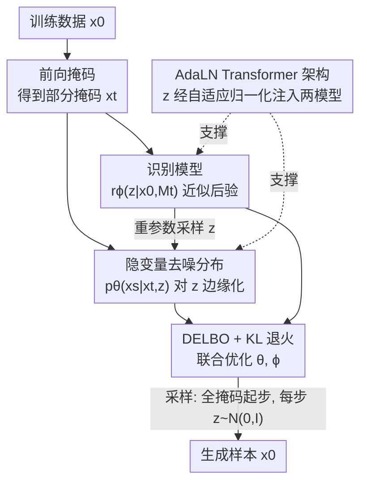

# Variational Autoencoding Discrete Diffusion with Enhanced Dimensional Correlations Modeling

**会议**: ICLR 2026  
**OpenReview**: [https://openreview.net/forum?id=yh7MV2V0ba](https://openreview.net/forum?id=yh7MV2V0ba)  
**代码**: https://github.com/tyuxie/VADD  
**领域**: 扩散模型 / 离散生成  
**关键词**: 离散扩散, 掩码扩散模型, 变分自编码, 隐变量, 维度相关性

## 一句话总结
针对掩码扩散模型（MDM）在少步采样时"各维度独立预测"导致样本崩坏的问题，本文提出 VADD：给去噪分布加一个高斯隐变量 $z$，用变分自编码（VAE）的方式联合训练去噪模型与识别模型，从而隐式建模维度间相关性——在保持 MDM 采样开销不变的前提下，把"几步出图/出文"的样本质量大幅拉高。

## 研究背景与动机

**领域现状**：扩散模型从连续空间（图像/音频/视频）扩展到离散空间后，掩码扩散模型（masked diffusion model, MDM）成为最有竞争力的一支。它的前向过程把每个维度逐步"掩码"成全 `[M]` 状态，反向过程则从全掩码出发，**并行地**同时解掩码（预测）多个维度。相比自回归模型一次只生成一个 token，MDM 的并行预测带来了天然的采样加速潜力。

**现有痛点**：MDM 在每一步反向转移里，把去噪分布建模为各维度**独立的类别分布之积**（product of independent categoricals）。这在步数多、每步只解少量维度时问题不大；但 MDM 真正的实用价值恰恰在"少步快采"——而步数一少，每步就要**同时解掩码很多维度**，独立性假设的破坏被急剧放大：真实数据里这些维度本该高度相关，独立预测会生成自相矛盾、互不协调的样本（论文 2D toy 图里 MDLM 一步采样直接坍缩）。

**核心矛盾**：单步内同时解掩码的维度数正比于 $(\alpha_s-\alpha_t)$，步长越大、解掩码越多，"维度条件独立"造成的累积近似误差越严重。已有缓解手段（如借预训练自回归模型/相关性模型做引导）都要引入额外的内循环采样步，反而拖慢推理，与 MDM 追求的高效背道而驰。

**本文目标**：在**不增加采样开销、不依赖预训练教师**的前提下，让 MDM 的单步去噪分布能够刻画维度间的联合相关性，尤其要在少步采样时显著提升样本质量。

**切入角度**：作者借用 VAE 的经典洞见——均场（mean-field）解码器 $p_\theta(y|z)$ 虽对各维度独立，但**把隐变量 $z$ 积分掉之后**，边缘分布 $p_\theta(y)=\int p_\theta(y|z)p(z)\,dz$ 仍能表达复杂的维度相关性。同理，只要给 MDM 的去噪分布塞进一个隐变量当"控制器"，再边缘化，就能在保持每个条件分布仍然可分解（便于并行）的同时，让边缘转移分布捕捉相关性。

**核心 idea**：用"隐变量 + 边缘化"替代"显式独立分布"来建模 MDM 的反向转移——隐变量 $z$ 充当高层语义控制器，引导去噪走向干净数据的某一个具体模态；由于边缘化 $z$ 不可解，转而用变分自编码框架，引入识别模型并最大化一个新的下界（DELBO）来联合训练。

## 方法详解

### 整体框架

VADD（Variational Autoencoding Discrete Diffusion）把 MDM 反向转移 $p_\theta(x_s|x_t)$ 从"显式可写出的独立分布"改成一个**隐变量模型**：

$$p_\theta(x_s|x_t)=\int_{\mathbb{R}^d} p_\theta(x_s|x_t,z)\,p(z)\,dz,\qquad p(z)=\mathcal{N}(0_d,I_d).$$

其中条件分布 $p_\theta(x_s|x_t,z)$ 仍然沿用 MDM 的 $x_0$-预测参数化、对各维度可分解（保住并行与高效）；但因为对 $z$ 做了积分，**边缘**转移分布 $p_\theta(x_s|x_t)$ 就能跨维度建模相关性。直觉上，从部分掩码的 $x_t$ 恢复 $x_0$ 有多种合理方式（即 $q(x_0|x_t)$ 是多模态的），$z$ 就是那个"挑模态"的控制器。

代价是边缘似然 $p_\theta(x_0|x_t)$ 含对 $z$ 的积分、不可解，无法直接最大化原始 ELBO。于是引入识别模型 $r_\phi(z|x_0,x_t)$ 近似后验，整体落到 VAE 式的联合训练：去噪模型 $\mu_\theta$ 与识别模型 $r_\phi$ 一起，靠最大化一个新下界 DELBO（带 KL 退火）来学。**采样阶段不需要识别模型**——从全掩码出发，每步先从先验 $p(z)$ 采一个 $z$，再用 $p_\theta(x_s|x_t,z)$ 解掩码，开销与普通 MDM 相同。

### 关键设计

**1. 隐变量去噪分布：用边缘化捕捉维度相关性，又不丢并行**

这一设计直接针对"独立类别分布之积无法建模维度相关、少步采样坍缩"的痛点。VADD 沿用 MDM 的 $x_0$-预测形式，但让去噪概率 $\mu_\theta$ 额外吃进隐变量 $z$：

$$p_\theta(x_s^i|x_t^i,z)=\begin{cases}\mathrm{Cat}(x_s^i;\,\delta_{x_t^i}), & x_t^i\neq[M];\\[4pt]\mathrm{Cat}\!\left(x_s^i;\,\tfrac{1-\alpha_s}{1-\alpha_t}\delta_{[M]}+\tfrac{\alpha_s-\alpha_t}{1-\alpha_t}\,\mu_\theta^i(x_t,z,t)\right), & x_t^i=[M].\end{cases}$$

关键在于：**给定 $z$ 时**各维度依旧条件独立（所以一步能并行解掩码、推理快）；但把 $z$ 积分掉后的边缘 $p_\theta(x_0|x_t)=\int \prod_i[\cdots]\,p(z)\,dz$ 是各维度耦合的混合分布，能表达"要么全亮要么全暗"这类一步内的联合约束。和那些靠预训练自回归模型做内循环引导来补相关性的方法相比，VADD 把相关性"内化"进模型本身，采样时只多采一个 $z$，不增加额外的内循环步。

**2. 变分自编码机制：用 DELBO + KL 退火联合训练，绕开不可解的边缘似然**

既然边缘 $p_\theta(x_0|x_t)$ 因对 $z$ 积分而不可解，原始 MDM 的连续时间 ELBO（式 (3) 里的 $L(x_0;\theta)$）就没法直接最大化。作者把 $p_\theta(x_0|x_t)$ 本身当成一个"以 $x_t$ 为条件的边缘似然"，再套一层 VAE：引入识别模型 $r_\phi(z|x_0,x_t)\approx p_\theta(z|x_0,x_t)$，得到 ELBO 的**再下界**——双重证据下界 DELBO：

$$\widehat{L}(x_0;\theta,\phi)=\int_0^1\!\mathbb{E}_{q(x_t|x_0)}\mathbb{E}_{r_\phi(z|x_0,x_t)}\left[-\tfrac{\alpha_t'}{1-\alpha_t}\log\tfrac{p_\theta(x_0|x_t,z)\,p(z)}{r_\phi(z|x_0,x_t)}\right]dt\;\le\;L(x_0;\theta).$$

当 $r_\phi$ 完美拟合后验时取等号。识别模型取对角高斯 $r_\phi(z|x_0,x_t)=\mathcal{N}(m_\phi,\,\mathrm{diag}\{\sigma_\phi^2\})$，可用重参数化技巧求梯度。但高维下后验复杂，朴素最大化 DELBO 会**后验坍缩**（识别模型退化到先验、忽略数据）。作者借用 KL 退火，给 KL 项乘上一个从 0 线性升到 1 的权重 $\lambda$：

$$\widehat{L}_\lambda(x_0;\theta,\phi)=\int_0^1\!\mathbb{E}_{q(x_t|x_0)}\mathbb{E}_{r_\phi}\left[-\tfrac{\alpha_t'}{1-\alpha_t}\Big(\log p_\theta(x_0|x_t,z)-\lambda\log\tfrac{r_\phi(z|x_0,x_t)}{p(z)}\Big)\right]dt.$$

训练早期 $\lambda$ 小、几乎不被先验正则，让隐变量先学到有用信息，再逐步收紧到标准 DELBO，从而稳住训练。

**3. AdaLN Transformer 架构：高效注入 $z$，并让识别模型只看"掩码位"**

要把上面的机制落到文本生成上，标准 Transformer 不能直接用——怎么把一维的 $z$ 注入序列模型、又不让识别模型的算力翻倍，是工程关键。去噪模型这边，作者用**自适应层归一化（AdaLN）**注入 $z$：每个 Transformer block 的自注意力层和前馈层前各加一个 AdaLN，由一个吃 $z$ 嵌入的 MLP 输出 shift/scale，作用到全部 token 嵌入上。

识别模型 $r_\phi(z|x_0,x_t)$ 本来要同时吃 $x_0$ 和 $x_t$ 两条序列，朴素做法算力翻倍。作者注意到 $x_t$ 只是 $x_0$ 的部分掩码版本，于是用一个二值掩码向量 $M_t\in\{0,1\}^N$（被掩码记 1）把 $(x_0,x_t)$ 一一映射成 $(x_0,M_t)$ 作为输入。它的 AdaLN 只对**被掩码的位置**生效：用一个跨 block 共享的可学习掩码表示向量 $R_\phi$ 经两个 MLP 产生 shift/scale，再乘 $M_t$ 屏蔽未掩码 token。作者特别指出，**识别模型必须依赖 $x_t$（即 $M_t$）**——若只吃 $x_0$、忽略 $x_t$，即便仔细调 KL 退火也会严重后验坍缩。复杂度分析表明，逐 token 复杂度与普通 MDM 同阶；额外参数仅约 6%，采样开销完全不变，仅训练开销约为 MDM 的 1.5×（因为同时训两个等大模型）。

### 损失函数 / 训练策略
训练目标是对训练集所有 $x_0$ 最大化 KL 退火版 DELBO $\widehat{L}_\lambda(x_0;\theta,\phi)$（Monte Carlo 估计、按 batch 平均），用重参数化对 $\phi$ 求梯度，$\theta,\phi$ 一起更新。先验固定为标准高斯 $\mathcal{N}(0_d,I_d)$；$\lambda$ 在训练前若干 epoch/iteration 内从 0 线性升到 1。评估 ELBO 时用 DELBO 的 1000-样本下界变体作估计（VAE 文献常规做法）。采样按 Algorithm 2：从全掩码 $[M]^N$ 起，每步先 $z\sim p(z)$、再 $x_{t_{i-1}}\sim p_\theta(\cdot|x_{t_i},z)$。

## 实验关键数据

### 主实验

2D toy（checkerboard/swissroll/circles）上，VADD 的一步采样 JS 散度比 MDLM 低一两个数量级：

| 数据集 | 指标 | MDLM | VADD |
|--------|------|------|------|
| checkerboard | JS-1 ↓ | 1.395 | **0.062** |
| checkerboard | JS-5 ↓ | 0.211 | **0.048** |
| swissroll | JS-1 ↓ | 2.619 | **0.086** |
| circles | JS-1 ↓ | 2.273 | **0.161** |

CIFAR-10 上少步采样的 FID（↓，50K 图）差距悬殊，步数越少优势越大：

| 采样步数 $T$ | MDLM | VADD | 相对改善 |
|------|------|------|------|
| 10 | 334.3 | **170.3** | ~2× |
| 20 | 261.3 | **108.7** | ~2.4× |
| 30 | 203.4 | **84.8** | ~2.4× |
| 50 | 140.3 | **64.6** | ~2.2× |
| 100 | 76.5 | **50.5** | ~1.5× |

似然/困惑度上 VADD 同样不吃亏：binarized MNIST BPD 0.075→**0.063**，CIFAR-10 BPD 2.80→**2.74**（与 MD4 同 2M 步）；LM1B 测试困惑度 **20.53**，优于 MDLM（1M 步 27.70、10M 步 23.00），甚至超过 5M 步的自回归 Transformer（20.86）。OpenWebText 零样本困惑度（六数据集）多数优于同架构 MDLM†，且达到相同生成困惑度只需 MDLM **不到 50%** 的采样算力。

### 消融实验

| 配置 | 现象 | 说明 |
|------|------|------|
| Full VADD | 少步质量大幅领先 | 隐变量建模维度相关性 |
| 识别模型只吃 $x_0$（忽略 $x_t$） | 严重后验坍缩 | 必须依赖 $M_t$，否则即便调 $\lambda$ 也救不回 |
| 无 KL 退火（直接最大化 DELBO） | 高维下后验坍缩 | $\lambda:0\to1$ 退火是稳定训练前提 |
| 训练/采样开销 | 训练 ~1.5×MDM、采样持平 | OpenWebText 训练速度 2.77→1.84 it/s（≈0.66×） |

### 关键发现
- **少步采样是 VADD 的主战场**：步数越少、每步同时解掩码越多，独立性假设破坏越严重，VADD 的相关性建模收益越大；步数拉满时与 MDLM 差距收窄（CIFAR-10 $T{=}100$ 时仅 76.5→50.5）。
- **VAE 在低维更香**：binarized MNIST（$V{=}2$）的 BPD 改善远大于 CIFAR-10；LM1B 因约 75% 是 padding token、有效维度低，VADD 1M 步就超过 5M 步的强自回归基线。
- **样本质量 > 似然**：作者明确预期 VADD 在 FID、生成困惑度这类**样本质量**指标上获益大，在 BPD/困惑度这类似然指标上提升有限——实验与预期吻合。
- **两处坍缩陷阱缺一不可**：识别模型必须看 $x_t$、训练必须 KL 退火，二者任一缺失都会后验坍缩。

## 亮点与洞察
- **把 VAE 的"边缘化造相关性"嫁接到离散扩散**：条件分布仍可分解（保住并行高效），相关性全靠对 $z$ 边缘化得来——既不改采样开销，又不依赖预训练教师，是个干净利落的"加一层隐变量"思路。
- **DELBO（双重下界）的构造很巧**：把不可解的 $p_\theta(x_0|x_t)$ 当成第二层边缘似然再套一次 VAE 下界，把"扩散 ELBO 不可解"这个障碍化解成熟悉的 VAE 优化问题。
- **识别模型用 $(x_0,M_t)$ 替代 $(x_0,x_t)$**：利用"$x_t$ 是 $x_0$ 的掩码版"这一结构，把双序列输入压成单序列 + 二值掩码，AdaLN 只作用掩码位，算力不翻倍——可迁移到任何需要"原始+其退化版"双输入的编码器设计。
- **"不要忽略 $x_t$"这条经验**很反直觉但很实用：直观上识别模型只看干净数据 $x_0$ 似乎更简单，实测却必然坍缩，提示后验设计要保留与噪声状态的耦合。

## 局限与展望
- **先验过简、有 prior hole 风险**：$p(z)$ 固定为标准高斯（uninformed prior），可能出现"先验高概率、模型后验低概率"的空洞区。作者建议改用依赖 $x_t,t$ 的条件先验 $p_\theta(z|x_t,t)$、层次先验，或对比学习等高级训练技巧缓解。
- **训练开销约 1.5×MDM**：需同时训练等大的去噪 + 识别两个模型。未来可考虑丢掉识别模型、改用 score divergence 等替代损失只训生成模型来降本（采样开销本就与 MDM 持平，不受影响）。
- **似然指标提升有限**：方法本质改善的是样本质量与维度协调性，对 BPD/perplexity 这类似然指标增益不大；高维、大词表（大 $V$）场景下 VAE 的优势也会减弱（CIFAR-10 改善明显小于 MNIST）。
- 目前只验证了吸收态（掩码）噪声调度；迁移到均匀分布等其他离散噪声调度作者列为未来方向，尚未实证。

## 相关工作与启发
- **vs MDLM / MD4 / SEDD（标准 MDM）**：它们把反向转移建模为各维度独立类别分布之积，少步采样易坍缩；VADD 加隐变量边缘化建相关性，少步质量大幅领先，采样开销相同。
- **vs 引导式相关性建模（Xu et al., 2024; Liu et al., 2024）**：它们靠预训练自回归/相关性模型在内循环做引导来补相关性，增加推理算力；VADD 把相关性内化进模型，采样只多采一个 $z$。
- **vs 蒸馏式少步生成（DiMO / Soft-DiMO / Learnable Sampler Distillation）**：这些方法把多步 MDM 蒸馏成少步/一步生成器，**依赖强预训练教师**作初始化与学习目标；VADD 从零基于训练数据直接训隐变量去噪模型，不需要教师。
- **vs 经典 VAE 与后验坍缩研究（Bowman 2015 等）**：VADD 复用 KL 退火对抗坍缩，并贡献了"识别模型须依赖 $x_t$"这一离散扩散场景下的新经验。

## 评分
- 新颖性: ⭐⭐⭐⭐⭐ 首次把隐变量模型 / 变分自编码机制引入掩码扩散，DELBO 构造与 $(x_0,M_t)$ 输入设计都很巧。
- 实验充分度: ⭐⭐⭐⭐ 覆盖 2D toy、图像（MNIST/CIFAR-10）、文本（LM1B/OpenWebText）三类任务，少步 FID/困惑度对比清晰；但主要对自家复现的 MDLM 比，与更多强少步基线的横评略少。
- 写作质量: ⭐⭐⭐⭐⭐ 动机—矛盾—方法推导层层递进，DELBO 与架构部分讲得清楚，坍缩陷阱与开销诚实交代。
- 价值: ⭐⭐⭐⭐⭐ 在不加采样开销、不依赖教师的前提下显著改善离散扩散少步采样质量，对扩散语言模型/像素生成的实际部署很有意义。

<!-- RELATED:START -->

## 相关论文

- [\[ICLR 2026\] Discrete Variational Autoencoding via Policy Search](discrete_variational_autoencoding_via_policy_search.md)
- [\[ICML 2025\] Distillation of Discrete Diffusion through Dimensional Correlations (Di4C)](../../ICML2025/image_generation/distillation_of_discrete_diffusion_through_dimensional_correlations.md)
- [\[ICLR 2026\] Purrception: Variational Flow Matching for Vector-Quantized Image Generation](purrception_variational_flow_matching_for_vector-quantized_image_generation.md)
- [\[ICLR 2026\] Loopholing Discrete Diffusion: Deterministic Bypass of the Sampling Wall](loopholing_discrete_diffusion_deterministic_bypass_of_the_sampling_wall.md)
- [\[ICLR 2026\] Continuously Augmented Discrete Diffusion model for Categorical Generative Modeling](continuously_augmented_discrete_diffusion_model_for_categorical_generative_model.md)

<!-- RELATED:END -->
