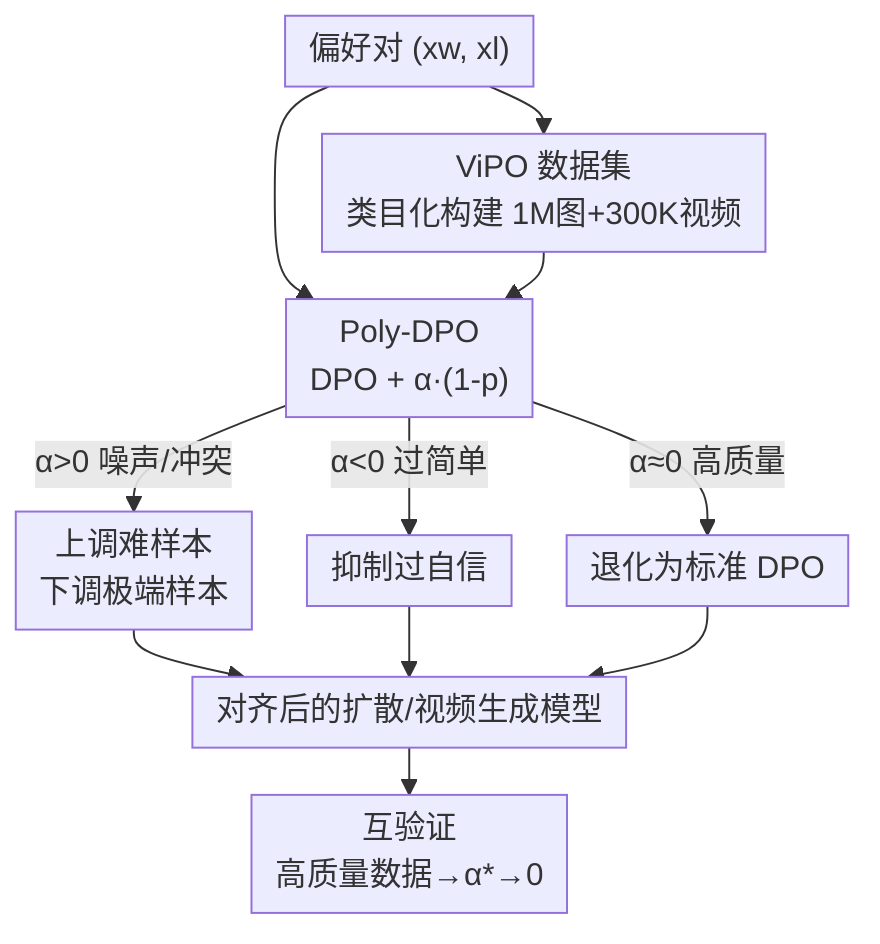

# ViPO: Visual Preference Optimization at Scale

**会议**: ICLR 2026  
**OpenReview**: [https://openreview.net/forum?id=x5zP3k64Nl](https://openreview.net/forum?id=x5zP3k64Nl)  
**代码**: https://github.com/liming-ai/ViPO (有)  
**领域**: 扩散模型 / 对齐RLHF / 偏好优化  
**关键词**: Diffusion-DPO, 偏好优化, 多项式损失, 大规模数据集, 视觉生成

## 一句话总结
针对视觉生成的偏好优化"放大不动"的问题，本文一手做算法、一手做数据：提出只加两行代码、调一个超参 $\alpha$ 的 Poly-DPO 让训练变成"置信度感知"以扛住噪声偏好，并构建百万级、类目均衡、1024px 的 ViPO 偏好数据集；二者互相印证——数据质量足够高时 Poly-DPO 自动退化为标准 DPO（$\alpha\to0$），而数据有噪声时 Poly-DPO 在 GenEval 上比 Diffusion-DPO 最高提升 6.87 分。

## 研究背景与动机
**领域现状**：把 RLHF / DPO 这套偏好对齐从语言模型搬到视觉生成已经成为主流。其中 off-policy 的 Diffusion-DPO 因为直接在预先收集好的偏好对上训练、不需要在线采样，被认为最适合"放大规模"。

**现有痛点**：放大规模这件事实际上没人真正做通。作者指出根因是现有开源偏好数据集（HPDv2、Pick-a-Pic v1/v2 等）里充斥**冲突偏好模式**——同一对里 winner 在某些维度（如美学）更好、却在另一些维度（如图文对齐）更差。在这种数据上"老实地"跑 DPO，模型根本学不到一致的偏好信号，于是性能很快饱和、数据加再多也不涨。除了冲突，老数据还有分辨率低（512–768）、prompt 多样性差、随机收集导致分布失衡、底层生成模型过时等一堆毛病。

**核心矛盾**：标准 Diffusion-DPO 的梯度对所有样本一视同仁，面对冲突信号时会被"互相矛盾的对"带偏；而面对过于简单、一眼能分胜负的对时又会迅速过自信、只学到表面差异。算法的"置信度"完全由数据分布牵着走，缺一个能根据数据特性自适应调节的旋钮。

**本文目标**：拆成两个互补子问题——(1) 设计一个对噪声鲁棒、能在"噪声/过简单/高质量"三种分布上都稳定学习的偏好优化算法；(2) 从根上构造一份高分辨率、prompt 多样、类目均衡、信号可靠的大规模偏好数据集。

**切入角度**：作者从 poly loss 的视角重新审视 DPO——既然 Diffusion-DPO 本质上是一个二分类交叉熵，那它就能做泰勒展开，给主导梯度的那一项加一个可调扰动，从而显式地控制"置信度"。

**核心 idea**：用一个多项式扰动项 $\alpha(1-p_{w>l})$ 把 DPO 改造成置信度感知的 Poly-DPO，再配一份类目化构建的百万级 ViPO 数据集；算法负责扛住不完美数据，数据负责给放大规模托底。

## 方法详解

### 整体框架
方法由两根支柱组成：**ViPO 数据集**（解决"喂什么"）和 **Poly-DPO 算法**（解决"怎么学"），二者在偏好优化的训练回路里汇合，并通过 $\alpha\to0$ 的收敛现象互相印证。流程是：偏好对 $(x_w, x_l)$（来自现有噪声数据集，或来自本文类目化构建的 ViPO 数据集）送入 Poly-DPO 训练；Poly-DPO 在标准 Diffusion-DPO 损失上加一个由超参 $\alpha$ 控制的多项式项，根据数据分布动态给样本重加权——噪声/冲突数据用 $\alpha>0$、过简单数据用 $\alpha<0$、高质量均衡数据 $\alpha\approx0$；最终输出对齐后的扩散/视频生成模型。关键观察是：当数据质量足够高（ViPO），最优 $\alpha$ 自己收敛到 0，Poly-DPO 退化成标准 DPO，这反过来印证了数据质量是放大规模的主因。

### 关键设计

**1. ViPO 数据集：用类目化构建从根上消除偏好噪声**

针对"现有数据冲突 + 低分辨率 + 分布失衡"这一痛点，作者不打补丁而是重造数据。ViPO 含 **1M 图像偏好对（1024px，5 类）+ 300K 视频对（720p+，3 类）**。图像按五个维度各 200K 对组织：美学、图文对齐、文字渲染、人像质量、构图；视频按三个维度各 100K 对：运动质量、视频-文本对齐、视觉质量。与以往"随机收集"不同，ViPO 是**类目化（categoried）**的——每个维度独立采集，从而保证分布均衡、某一维度不会被简单模式淹没。生成端全部用 SOTA 模型（FLUX、Qwen-Image、HiDream-I1 等出图，WanVideo、Seedance、Veo3 等出视频），并用多个 VLM 做筛选与标注，确保偏好信号可靠。作者用一个量化证据点明老数据有多脏：在 Pick-a-Pic V2 上用五个奖励模型（PickScore、ImageReward、HPSv2、Aesthetic、CLIP）同时评判，**只有 20.79% 的对在所有五个维度上排序一致**——其余八成都是冲突对。为绕开专有模型的授权限制，作者还提供了用公开模型（FLUX.2-dev、Wan2.2-A14B-I2V）替换 Seedream-3.0/Seedance-1.0 输出的开源版本，验证其质量相当。

**2. Poly-DPO：把 DPO 看作二分类并加一个置信度旋钮**

针对"梯度对所有样本一视同仁、置信度被数据牵着走"的痛点，Poly-DPO 先把 Diffusion-DPO 重写成二分类交叉熵。定义模型相对参考模型偏好 winner 的概率 $p_{w>l}=\sigma\big(\beta\log\frac{p_\theta(x_w)}{p_{\text{ref}}(x_w)}-\beta\log\frac{p_\theta(x_l)}{p_{\text{ref}}(x_l)}\big)$，则 $\mathcal{L}_{\text{Diffusion-DPO}}=-\log(p_{w>l})$，正是一个交叉熵。借鉴 poly loss，对 $-\log(p_{w>l})=\sum_j \frac{1}{j}(1-p_{w>l})^j$ 这条泰勒展开，只给贡献梯度最大的首项加一个扰动 $\alpha$，得到极简的 Poly-DPO 损失：

$$\mathcal{L}_{\text{Poly-DPO}}=-\log(p_{w>l})+\alpha(1-p_{w>l}).$$

落到代码上只是两行（`poly_loss = 1 - sigmoid(logits)`；`loss = dpo_loss + alpha * poly_loss`）。它的实质是给 DPO 梯度乘了一个 **Poly 因子**：$\frac{\partial \mathcal{L}_{\text{Poly-DPO}}}{\partial \text{logit}}=-(1-p_{w>l})(1+\alpha\, p_{w>l})$。这个因子让训练显式地变成"置信度感知"——通过一个 $\alpha$ 就能根据当前样本被分得有多开来重加权，而不必像在线 RL 那样反复采样和评奖励。

**3. $\alpha$ 的三段制与互验证：一个超参覆盖三种数据分布**

Poly 因子里的 $\alpha$ 对应三种典型数据分布，把"为什么有效"讲清楚。**$\alpha>0$（增强置信度）**：数据冲突时，$1+\alpha p_{w>l}$ 会上调 $p_{w>l}\approx0.5$（拿不准）的难样本、下调 $p_{w>l}$ 接近 0 或 1 的极端样本，逼模型把学习集中到"还有救"的边界对上，不被矛盾信号搞晕——实验里 Pick-a-Pic V2 这种噪声集 $\alpha=8$ 最佳。**$\alpha<0$（降低置信度）**：数据过于简单（作者用 batch 内随机打乱 loser 造的合成集）时，标准 DPO 会迅速过自信、退化成"复刻 winner"而非学到 winner-loser 的细微差异；负的 $\alpha$ 削弱高置信样本的梯度，强迫模型继续探索真实差异。**$\alpha\approx0$（标准 DPO）**：数据高质量均衡时，最优 $\alpha$ 自己收敛到 0、Poly-DPO 退化为标准 DPO，且在 0 附近一段邻域内都稳健。这个收敛是本文最妙的一笔**互验证**：一方面证明 ViPO 数据质量够高（高质量数据不需要花哨优化），另一方面证明 Poly-DPO 的自适应性（数据好就自动简化、数据差才发力）——即"足够好的数据让复杂优化变得多余，而面对不完美数据它依然必要"。

### 损失函数 / 训练策略
核心训练目标即上文 Poly-DPO 损失 $\mathcal{L}=-\log\sigma(\text{logit})+\alpha\big(1-\sigma(\text{logit})\big)$，其中 logit 由 winner/loser 在当前模型与参考模型下的去噪误差差值给出（沿用 Diffusion-DPO 对扩散对数似然比的近似）。整套方法只引入一个超参 $\alpha$、两行代码，可直接套在任意 Diffusion-DPO 实现上。图像实验在 SD1.5、SDXL、SD3、FLUX 上训练（SD1.5 因文字能力弱，训练时剔除文字渲染子集），视频在 Wan2.1-T2V-1.3B 上训练。

## 实验关键数据

### 主实验
**Pick-a-Pic V2 训练（噪声集，验证 Poly-DPO 算法）**：SD1.5 在四个测试集上 Poly-DPO 全面超越 Diffusion-DPO 与 Diffusion-KTO。

| 测试集 | 指标 | SD1.5 基线 | Diffusion-DPO | Poly-DPO (本文) |
|--------|------|-----------|---------------|-----------------|
| Pick-a-Pic V2 | PickScore | 20.57 | 20.95 (+1.8%) | **21.48 (+4.4%)** |
| Pick-a-Pic V2 | HPSv2.1 | 25.02 | 26.12 (+4.4%) | **28.30 (+13.1%)** |
| Pick-a-Pic V2 | ImageReward | 0.085 | 0.297 (+0.212) | **0.679 (+0.594)** |
| HPD V2 | HPSv2.1 | 0.246 | 0.259 (+5.3%) | **0.285 (+15.9%)** |
| Parti | ImageReward | 0.194 | 0.352 (+0.158) | **0.736 (+0.542)** |

GenEval 构图基准上，Poly-DPO 在 off-policy 方法里总分最高，甚至超过需要迭代采样的 on-policy SPO：

| 模型 | 方法 | Counting | Attribute Binding | Overall ↑ |
|------|------|----------|-------------------|-----------|
| SD1.5 | Diffusion-DPO | 38.75 | 3.75 | 43.00 |
| SD1.5 | Poly-DPO (本文) | **51.25** | **14.00** | **49.87** (+6.87) |
| SDXL | Diffusion-DPO | 49.06 | 18.50 | 58.02 |
| SDXL | Poly-DPO (本文) | — | **31.00** | **60.34** (+2.32) |

**ViPO-Image-1M 训练（验证数据集质量）**：在 GenEval 上全线提升。

| 模型 | 训练前 Overall | 训练后 Overall | 提升 |
|------|---------------|---------------|------|
| SD1.5 | 0.42 | 0.52 | +23.8% |
| SDXL | — | 0.63 | 显著 |
| SD3.5-Medium | 0.69 | 0.83 | 逼近专为构图设计的 HiDream-I1-Full (0.83) |
| FLUX.1-dev | — | 0.79 | 全维度一致提升 |

### 消融实验
围绕 $\alpha$ 在三种分布上的作用（基于 SD1.5，从 Parti/Pick-a-Pic/HPD 各采样共 1200 prompt 构造三种场景）：

| 数据分布 | 最优 $\alpha$ | 现象与说明 |
|----------|--------------|------------|
| 噪声/冲突（Pick-a-Pic V2） | $\alpha=8$ | 上调难样本，分数随 $\alpha>0$ 提升 |
| 过简单（打乱 loser 合成） | $\alpha<0$ | 标准 DPO 过自信只复刻 winner；负 $\alpha$ 抑制过拟合 |
| 高质量均衡（ViPO-Image-1M） | $\alpha\approx0$ | 最优值收敛到 0，退化为标准 DPO 且邻域稳健 |

### 关键发现
- **冲突偏好是放大规模的真正瓶颈**：Pick-a-Pic V2 仅 20.79% 的对在五个奖励模型上排序一致，标准 DPO 在这种数据上学不到一致信号、加数据也不涨。
- **难样本/属性绑定提升最大**：Poly-DPO 在 counting（51.25 vs 38.75）、attribute binding（14.00 vs 3.75）这类难任务上涨得最猛，说明置信度重加权学到的是更细的偏好而非表面属性。
- **$\alpha\to0$ 的收敛是双向印证**：高质量数据让最优 $\alpha$ 退到 0，既说明 ViPO 质量过硬，也说明 Poly-DPO 会自适应简化——数据好时不画蛇添足，数据差时才出手。

## 亮点与洞察
- **两行代码、一个超参的极简改造**：Poly-DPO 在任意 Diffusion-DPO 实现上只加一项 $\alpha(1-p_{w>l})$，却把训练从"被数据牵着走"变成"主动调置信度"，落地成本极低、可迁移性极强。
- **把 DPO 重新看成二分类交叉熵再做泰勒展开**——这个视角让 poly loss 的工具箱直接可用，是个漂亮的"换帧"，可迁移到任何基于 BT 模型的偏好优化（包括 LLM 的 DPO）。
- **"算法 + 数据"双管齐下并用收敛现象互证**：用 $\alpha\to0$ 同时证明数据够好、算法够自适应，比单独刷一个 SOTA 更有说服力，是一种值得借鉴的论证方式。

## 局限与展望
- 论文承认因专有模型授权，原始数据集（含 Seedream-3.0/Seedance-1.0 输出）可能无法完整公开，只能放公开模型替换版；虽验证质量相当，但与原版仍可能存在细微分布差异。
- Poly-DPO 只扰动了泰勒展开的首项（Poly-1），更高阶扰动 $\alpha_j$ 是否还有收益没有充分探索；噪声集上 $\alpha=8$ 这类取值仍需按数据集调，跨数据集的自动设定尚未给出。
- 评测高度依赖一系列奖励模型/VLM（HPSv2.1、ImageReward、DeQA、GPT-4o 等），偏好信号的"可靠"本身是用模型定义的，存在奖励模型偏置被一并学进去的风险。
- 视频侧（ViPO-Video-300K，Wan2.1）实验披露相对图像侧偏少，规模化效应在视频上的表现还有待更系统的验证。

## 相关工作与启发
- **vs Diffusion-DPO**：同为 off-policy、同样近似扩散对数似然比，但 Diffusion-DPO 梯度对所有样本一视同仁、在冲突数据上饱和；Poly-DPO 加 Poly 因子做置信度重加权，在噪声集上 GenEval 高出 6.87（SD1.5），且高质量数据上退化回它本身。
- **vs Diffusion-KTO**：KTO 也是 off-policy 的改进，但 Poly-DPO 在 PickScore/HPSv2.1/ImageReward 上普遍更优，且改动更小（两行代码、一个超参）。
- **vs 在线 RL（DDPO/D3PO/SPO 等 on-policy）**：这些方法需要迭代采样和奖励评估、成本高且易 reward hacking；Poly-DPO 不采样就在 GenEval 上超过 SPO，计算可扩展性更好。
- **vs 现有偏好数据集（HPDv1/2/3、Pick-a-Pic v1/v2、VideoDPO）**：它们随机收集、分辨率低（512–768）、用过时模型；ViPO 类目化、1024px、SOTA 生成器、分布均衡，是放大规模的数据底座。

## 评分
- 新颖性: ⭐⭐⭐⭐ 把 DPO 当二分类做 poly 展开 + 用 $\alpha\to0$ 互证数据与算法，视角清新但单项技术不算颠覆
- 实验充分度: ⭐⭐⭐⭐⭐ 覆盖 SD1.5/SDXL/SD3.5/FLUX + 视频，多基准多奖励模型，三种数据分布消融完整
- 写作质量: ⭐⭐⭐⭐ 动机—算法—数据—互证的逻辑闭环清晰，图表充分
- 价值: ⭐⭐⭐⭐⭐ 两行代码可落地的算法 + 百万级开源数据集，对视觉偏好优化社区是实打实的基础设施

<!-- RELATED:START -->

## 相关论文

- [\[ICLR 2026\] Reinforcing Diffusion Models by Direct Group Preference Optimization](reinforcing_diffusion_models_by_direct_group_preference_optimization.md)
- [\[ICLR 2026\] Towards Better Optimization for Listwise Preference in Diffusion Models](towards_better_optimization_for_listwise_preference_in_diffusion_models.md)
- [\[CVPR 2026\] Seeing What Matters: Visual Preference Policy Optimization for Visual Generation](../../CVPR2026/image_generation/seeing_what_matters_visual_preference_policy_optimization_for_visual_generation.md)
- [\[ICML 2026\] Offline Preference Optimization for Rectified Flow with Noise-Tracked Pairs](../../ICML2026/image_generation/offline_preference_optimization_for_rectified_flow_with_noise-tracked_pairs.md)
- [\[ICLR 2026\] MVAR: Visual Autoregressive Modeling with Scale and Spatial Markovian Conditioning](mvar_visual_autoregressive_modeling_with_scale_and_spatial_markovian_conditionin.md)

<!-- RELATED:END -->
