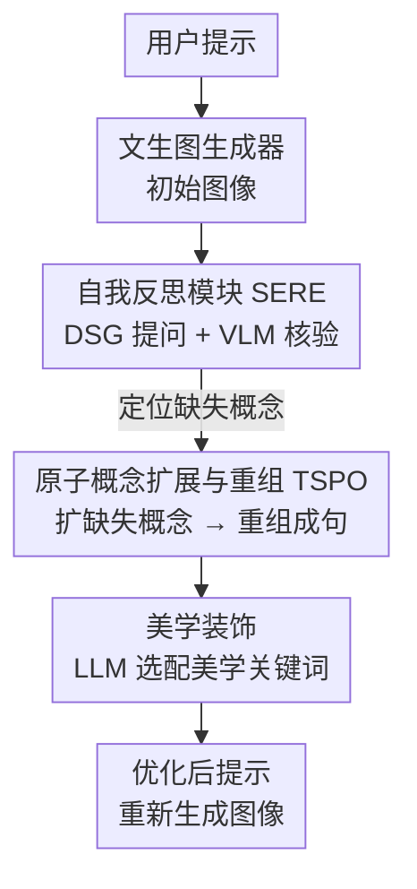

# VisualPrompter: Semantic-Aware Prompt Optimization with Visual Feedback for Text-to-Image Synthesis

**会议**: ICLR 2026  
**OpenReview**: [https://openreview.net/forum?id=hIwVFRLaFy](https://openreview.net/forum?id=hIwVFRLaFy)  
**代码**: https://github.com/teheperinko541/VisualPrompter  
**领域**: 扩散模型 / 图像生成 / 提示工程  
**关键词**: 文生图, 提示优化, 视觉反馈, 自我反思, 原子语义

## 一句话总结
VisualPrompter 是一个免训练的文生图提示工程框架，它先用 LLM 把用户提示拆成原子概念、再让 VLM 对照生成图逐一核验找出"漏画"的概念，然后只针对这些缺失概念做原子级扩展与重组，在不破坏用户原意的前提下把提示改写成模型偏好的句子，在 DSG / TIFA 两个文图对齐基准上取得新 SOTA。

## 研究背景与动机
**领域现状**：扩散模型（SD、Flux 等）已经能从文本生成逼真图像，但用户写的提示和模型"喜欢"的提示之间存在明显鸿沟——新手往往给出简短、粗粒度的描述，而模型在训练时见的多是细致、细粒度的提示，于是直接喂用户输入常常画不对。为弥合这个鸿沟，提示工程（prompt engineering）应运而生，自动把用户输入改写成更好的提示。

**现有痛点**：现有提示工程方法主要在"风格和美学"上做文章（堆砌 high quality、4k、artstation 这类关键词），有三个具体问题。其一，它们**忽略甚至损害文图语义对齐**——图变好看了，但内容跟用户描述对不上；论文实验里 NeuroPrompts、Promptist、BeautifulPrompt 在语义一致性上普遍不升反降。其二，**一刀切**——对所有提示套用相似的修改，缺乏针对单个输入的细粒度、案例特定的调整。其三，**泛化差**——大多为某个特定扩散模型微调而成，而不同模型对同一提示的"误读"方式各不相同（图 1b：同一句话 SDXL、Flux、Janus 各画错各的），换个模型就失效。

**核心矛盾**：风格美化与语义保真之间存在张力，而现有靠 SFT/RL 微调出的"提示工程师"把目标压在了美学一侧；同时它们都是开环的——改完提示就完事，从不回看生成图到底缺了什么，因此无法做模型特定、案例特定的修正。

**本文目标**：做一个既能对齐模型偏好、又忠实于用户原意的提示优化器，并且要能即插即用地适配各种生成模型。

**切入角度**：把生成模型自己的输出当作"模型特定的反馈"。既然不同模型会以不同方式画错，那就让框架去看它实际画出来的图、找出漏掉的概念，再对症下药——这样优化天然是模型特定、案例特定的。

**核心 idea**：在**原子语义层**做提示优化——把提示拆成原子概念、用 VLM 核验生成图找出缺失概念、只对缺失概念做扩展再重组成句，用"拆解 → 补全 → 重组"替代 LLM 的整句直接改写，从而在补全细节的同时严格守住原始语义。

## 方法详解

### 整体框架
VisualPrompter 要解决的是"用户提示 → 模型偏好提示"的自动改写，整条流水线像人类调提示时的思维链：先拿初始提示生成一张图，再回看图里哪些东西没画对，然后只补这些缺的、保留已经画对的，最后润色成句重新生成。它由两大模块串联：**自我反思模块（SERE）** 负责"诊断"——靠 LLM 生成问题 + VLM 回答，定位生成图中缺失的概念；**目标特定提示优化模块（TSPO）** 负责"开方"——只针对缺失概念做原子级扩展与句子重组，并附加美学装饰。整套流程所有用到的模型（LLM、VLM）都无需任何额外训练，且对生成器即插即用。

### 关键设计

**1. 自我反思模块 SERE：用 DSG + VLM 把"哪里画错了"定位到原子概念**

这一步直击"开环、不回看生成图"的痛点：要做案例特定的优化，先得知道当前这张图到底漏了什么。SERE 采用多步推理获取显式视觉反馈。第一步**问题生成**，借助 Davidsonian Scene Graph（DSG）把输入提示解析成一组原子概念，每个概念对应一个一般疑问句（如"画面里有没有一个人？"），概念间用有向边表达蕴含依赖（如"独轮车是单轮的"依赖"存在独轮车"）；DSG 由 LLM 生成。第二步**问题回答**，用 VLM（Qwen2-VL）作为视觉问答模型，对照生成图给每个问题一个二值答案，判断该概念是否真的出现在图里。这里有个巧妙的**依赖剪枝**：如果某个概念被判为缺失，所有依赖它的后续概念自动一并视为缺失，省去冗余核验。所有被判"缺失"的概念，就是后续优化的明确靶点——缺失概念定义为"包含在用户输入、但没在生成图中体现"的那些描述。

**2. 原子概念扩展与重组 TSPO：只补缺失概念、保留已对内容，守住用户原意**

针对"一刀切、整句直改易丢信息"的痛点，TSPO 不直接重写整句，而是走两步原子级操作（Prompt Regeneration）。先**语义扩展**：用 LLM 只对 SERE 标出的缺失概念做扩充，给它们补上属性、动作、空间关系等细节（如把"独轮车"扩成"单轮、直立的独轮车"），这些新增元素同样以原子概念的形式表达，保证表征一致；作者观察到，放大缺失概念能把用户输入往"模型偏好提示"的分布上推，是适配各种生成器的即插即用杠杆。若没检测到缺失概念，则不做任何修改。再**重组成句**：用 LLM 把扩展后的原子概念组装成语法完整、语义流畅的新提示，同时把原始提示和原始概念也一并喂给 LLM 做引导，确保改写后仍贴合初始意图；那些已经被准确画出的描述会被原样保留，避免不必要的改动。这种"拆解—补全—重组"相比 LLM 整句直接扩展更可解释、也更可控——实验显示直接用 Qwen 改写常引入语义无关的冗长细节，反而比原提示更差。

**3. 美学装饰：免训练地补美学关键词，但不与句子内容冲突**

语义补全之后，TSPO 再做一步**Prompt Decoration** 来提升多样性与视觉美感。具体是给 LLM 提供若干示例关键词（如 high-quality、detailed、fantasy），让它自动生成丰富多样、且不与句子内容冲突的风格关键词，再无缝嵌入句中或以逗号分隔附在句尾。这一步纯靠 LLM、无需训练。作者也坦承这个装饰器偏简单：因为方法倾向把原提示判为"写实照片"，导致优化结果缺乏想象/奇幻元素，美学提升不如那些专门为美学做 RL 的方法显著（见局限）。

### 一个完整示例
以提示"An old man riding a unicycle"为例走一遍：SERE 先用 DSG 把它解析成 7 个原子概念并生成对应问题（① 有人？② 人是老的？③ 有独轮车？④ 人骑车？⑤ 人在车上平衡？⑥ 独轮车单轮？⑦ 独轮车直立？），概念间带依赖边；VLM 对照初始生成图回答，发现⑤⑥⑦（平衡、单轮、直立）缺失，并借依赖剪枝快速锁定。TSPO 随后只对这些缺失概念做扩展、重组，得到优化提示"An old man is balancing on a unicycle with a single upright wheel, high quality, 4k, outdoors, elegant"，再喂回生成器，画面里的平衡姿态与单轮细节就被补齐了。

## 实验关键数据

### 主实验
两个文图对齐基准：DSG-1k（1060 条提示 / 8182 个问题）与 TIFA v1.0（4081 条提示，重构成 DSG 结构后 19233 个问题）。语义准确率以 VLM 对问题回答"yes"的百分比衡量；跨 4 个生成器（SD 1.5 / SD 2.1 / Flux-dev / Janus-Pro）评测。

| 方法 | DSG 平均 | TIFA 平均 | 总平均 |
|------|---------|----------|--------|
| Baseline（原始提示） | 74.6 | 82.3 | 78.4 |
| NeuroPrompts | — | — | 74.6 |
| Promptist | — | — | 76.2 |
| BeautifulPrompt | — | — | 53.5 |
| **VisualPrompter** | — | — | **83.0** |

关键观察：现有三种方法语义一致性**不升反降**（NeuroPrompts/Promptist 改不动原描述、还塞无关关键词；BeautifulPrompt 能改但常丢关键信息），只有 VisualPrompter 全面超过 baseline；在 Flux-dev、Janus-Pro 这类强生成器上增益更大（更擅长处理长句细节）。CLIP Score（表 3）VisualPrompter 平均 32.69，高于 baseline 31.71 与所有对手；NeuroPrompts 仅 25.41（关键词选项太少、提示多样性受限）。

### 消融实验（DSG 基准，报告 语义准确率 / 美学分）
| 视觉反馈 | 提示修改方式 None | Qwen 直改 | DSG（本文） |
|---------|------|------|------|
| w/o 反馈 | 72.1 / 5.48 | 67.8 / 5.32 | 71.9 / 5.69 |
| w/ 反馈 | 73.8 / 5.54 | 73.0 / 5.45 | **77.0 / 5.73** |

### 关键发现
- **细粒度拆解+重组 > LLM 整句直改**：同样有视觉反馈，DSG 方式 77.0 明显高于 Qwen 直改 73.0；Qwen 直改在无反馈时（67.8）甚至低于不改（72.1），印证整句扩展易引入语义无关的冗长细节、反害对齐。
- **视觉反馈非可有可无**：每一列加上反馈都涨点（本文 71.9 → 77.0），证明"回看生成图找缺失"这一闭环是核心。
- **美学是短板但可补救**：VisualPrompter 美学分（DSG 平均 5.81）低于专做美学的 NeuroPrompts（6.21）；把装饰器换成 NeuroPrompts 后美学升到 6.24 但语义一致性回落，揭示"以美学分作训练目标会牺牲语义完整"。
- **推理开销可接受**：用 Qwen2-1.5B 做 DSG 生成与概念整合，SD v1.5 上 10.7s（Qwen3-32B 直改要 21.3s），仅略慢于 NeuroPrompts/Promptist，在实用范围内。
- **跨模型 / 线上可用**：在 SD、Flux、Janus-Pro 及 Midjourney、Kolors、DouBao 等线上生成器上均带来一致提升，体现模型无关的强适配性。

## 亮点与洞察
- **把生成器的输出当反馈、闭环优化提示**：不同模型会以不同方式画错，让 VLM 去看实际生成图找缺失，使优化天然是案例特定 + 模型特定的，这比"为单一模型 SFT"的旧范式泛化得多。
- **原子语义层操作是可解释性与可控性的来源**：拆成原子概念后，能精确知道"漏了哪个属性/关系"，只补这一处、保留其余，避免整句改写的信息漂移——这个"拆解—补全—重组"思路可迁移到任何需要"改写但不能丢语义"的任务（如指令编辑、检索 query 改写）。
- **DSG 依赖剪枝**：用概念间蕴含依赖做剪枝，缺失概念的下游自动判缺，省核验又保持逻辑自洽，是个轻巧实用的工程 trick。
- **全程免训练、即插即用**：LLM+VLM 都是现成模型，无需为任何生成器训练，落地成本极低。

## 局限与展望
- **美学提升有限（作者承认）**：装饰器过于简单，且方法倾向把提示判为"写实照片"而缺乏奇幻/想象元素；用 NeuroPrompts 替换装饰器能提美学，却牺牲语义一致性，说明语义与美学的平衡还没解好。
- **依赖 LLM/VLM 的解析与判定质量**：DSG 解析是否完整、VLM 二值判答是否准确，直接决定缺失概念定位的可靠性；VLM 误判会传导成错误的优化靶点。
- **多轮迭代代价**：流程含"生成图 → 反思 → 改写 → 再生成"，相比一次性改写有额外的图像生成开销；论文主要展示单轮优化，未充分探讨多轮迭代收益与成本权衡。
- **改进思路**：让装饰器也走原子语义层、按内容类型自适应选风格；或把视觉反馈做成多轮闭环并设停机准则，在语义达标后再补美学。

## 相关工作与启发
- **vs NeuroPrompts / Promptist**：它们靠 SFT/RL 把 LLM 调成提示工程师，但实际"改不动"原描述、还塞无关关键词，语义一致性下降；本文在原子语义层显式定位缺失并针对性补全，语义全面超过 baseline。
- **vs BeautifulPrompt**：BeautifulPrompt 能改写并加相关细节，但修改时常丢关键信息、偏离用户原意；本文通过"保留已画对内容 + 只扩缺失概念"严格守住原意。
- **vs 直接用 LLM（Qwen）零样本改写**：LLM 整句扩展易产生语义无关的冗长句、增加扩散模型理解难度；本文的拆解—重组在可解释性和对齐上都更优。
- **vs 交互式方法（PromptCharm / Prompt Expansion）**：那类靠人机交互调注意力或给多候选，仍以视觉质量为主、忽视语义一致性；本文是全自动且以语义保真为核心目标。

## 评分
- 新颖性: ⭐⭐⭐⭐ 把"生成图视觉反馈 + 原子语义层闭环优化"用于免训练提示工程，视角新颖且切中现有方法忽视语义对齐的要害。
- 实验充分度: ⭐⭐⭐⭐ 两基准、四生成器、CLIP/美学/人评/线上模型多维验证，消融清晰；但多轮迭代与失败案例分析略少。
- 写作质量: ⭐⭐⭐⭐ 动机—方法—实验逻辑顺畅，图 2 流水线与示例直观。
- 价值: ⭐⭐⭐⭐ 免训练、即插即用、模型无关，对实际文生图调提示有直接实用价值。

<!-- RELATED:START -->

## 相关论文

- [\[ICLR 2026\] TIPO: Text to Image with Text Pre-sampling for Prompt Optimization](tipo_text_to_image_with_text_pre-sampling_for_prompt_optimization.md)
- [\[ICLR 2026\] ToProVAR: Efficient Visual Autoregressive Modeling via Tri-Dimensional Entropy-Aware Semantic Analysis and Sparsity Optimization](toprovar_efficient_visual_autoregressive_modeling_via_tri-dimensional_entropy-aw.md)
- [\[ICLR 2026\] DeLeaker: Dynamic Inference-Time Reweighting For Semantic Leakage Mitigation in Text-to-Image Models](deleaker_dynamic_inference-time_reweighting_for_semantic_leakage_mitigation_in_t.md)
- [\[ICLR 2026\] Long-Text-to-Image Generation via Compositional Prompt Decomposition](long-text-to-image_generation_via_compositional_prompt_decomposition.md)
- [\[ICLR 2026\] ViPO: Visual Preference Optimization at Scale](vipo_visual_preference_optimization_at_scale.md)

<!-- RELATED:END -->
