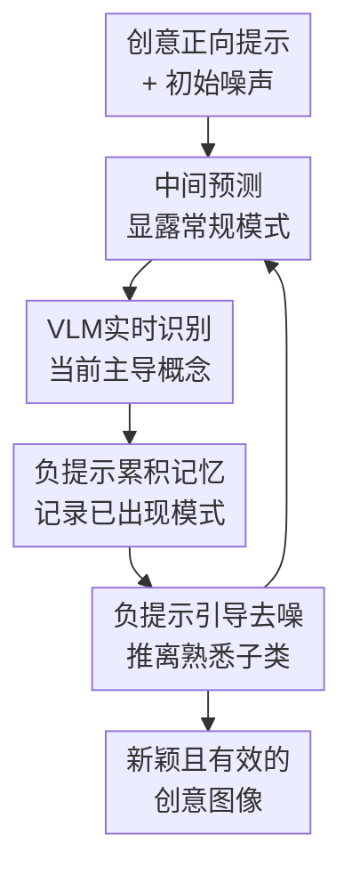

# VLM-Guided Adaptive Negative Prompting for Creative Generation

**会议**: ICLR2026  
**OpenReview**: [https://openreview.net/forum?id=JzA6d2II4Q](https://openreview.net/forum?id=JzA6d2II4Q)  
**代码**: 待发布  
**领域**: 图像生成 / 多模态反馈控制  
**关键词**: 创意生成, 文生图扩散模型, VLM反馈, 负提示词, 推理时控制

## 一句话总结
这篇论文提出一种无需训练的 VLM 引导自适应负提示方法，在扩散模型去噪过程中不断识别当前图像里显露出的常规概念，并把它们累积成负提示来推开生成轨迹，从而生成更有新意但仍属于目标类别的图像。

## 研究背景与动机
**领域现状**：文生图扩散模型已经很擅长按照文本提示生成高保真图像。用户写“a photo of a pet”或“a creative jacket”，模型通常能给出清晰、符合语义的宠物或夹克图片；如果把提示词写得更花哨，模型也能组合一些已有属性，比如蓝色猫、长耳朵动物、带翅膀的小猫。

**现有痛点**：问题在于，这类“创意”大多仍是训练分布中常见模式的重组。普通提示工程会让模型更贴近文本，但不会自动逃离“猫、狗、普通夹克、普通建筑”这些高概率视觉模式；已有创意生成方法要么要求预先指定要混合的概念对，要么像 ConceptLab 那样为每个概念优化文本嵌入，推理成本高、迁移到新模型也不够轻量。

**核心矛盾**：创意生成不是简单地追求“越不像越好”。如果只远离常规类别，结果可能变成看不出用途的怪物：杯子没有凹槽、沙发没有可坐表面、车没有驾驶空间。真正难的是在“保留大类有效性”和“远离大类中的典型子类”之间做动态控制。

**本文目标**：作者希望在不训练新模型、不优化新 token、不准备专门数据集的前提下，让现成扩散模型在推理时产生更具探索性的样本；同时，输出仍要让人和模型都能认出它属于目标类别，比如仍然是宠物、建筑、包、车辆或植物。

**切入角度**：论文观察到，扩散模型在去噪中间阶段其实会逐步显露出它正往哪个常规模式收敛。与其事先列一大串静态负提示，不如让 VLM 看这些中间预测：如果它发现当前宠物像猫，就立刻把“cat”加入负提示；如果下一步又像狗或鸟，就继续加入这些概念。

**核心 idea**：用 VLM 作为去噪过程中的实时观察者，把中间图像里出现的常规视觉概念转换为逐步累积的负提示，持续把扩散轨迹从熟悉子类推向更少探索的语义区域。

## 方法详解

### 整体框架
方法的输入是一个要求创意生成的正向提示词，例如“A photo of a new type of pet”或“A photo of a creative building”。扩散模型按常规流程从高斯噪声开始去噪，但每一步都会先估计当前的干净图像，再让 VLM 回答一个与类别相关的问题，最后把 VLM 识别出的常规对象或属性加入负提示列表，用于下一步去噪。

这形成了一个闭环：扩散模型试图生成符合正向提示的图像，VLM 负责指出它正在滑向哪些常规模式，负提示机制再把这些模式从后续采样中压下去。最终输出不是预先指定的“猫+鸟”或“夹克+云朵”，而是在同一类别内被逐步推离典型模式后产生的新样本。

### 关键设计

**1. VLM实时识别：把去噪中间态变成可操作的语义反馈**

普通负提示的问题是“盲”：用户在采样前不知道模型这次会先长得像猫、狗还是仓鼠，所以静态负提示只能列一些常见类别，既不贴合当前 seed，也容易过度压制目标类别。本文用中间干净图像估计 $\hat{x}^{(t)}_0$ 来解决这个问题。在 flow matching 采样中，模型给出速度场 $v_\theta(x_t,t,c)$，作者用近似式 $\hat{x}^{(t)}_0=x_t-t\cdot v_\theta(x_t,t,c)$ 得到当前时刻的可视化预测，再把它交给 VLM。

VLM 的查询形式可以写成 $r^{(t)}=\mathcal{V}(\hat{x}^{(t)}_0,q^{(t)})$，其中 $q^{(t)}$ 是类别相关问题，例如“你在图中识别出什么宠物？”或“这个建筑是什么形状、由什么材料构成？”。这样得到的不是抽象梯度，而是可以直接转成负提示词的文本反馈。它的关键价值在于反馈跟当前生成轨迹绑定：同一个提示词、不同随机种子会产生不同中间趋势，因此也会得到不同的负提示序列。

**2. 负提示累积记忆：避免生成轨迹回到刚逃离的常规模式**

如果每一步只使用当前 VLM 回答作为负提示，模型可能在后续去噪中又绕回之前已经出现过的模式。比如前几步像猫，于是当前步避开猫；再过几步如果负提示换成“dog”，猫的约束消失，图像仍可能重新长回猫科宠物。本文因此维护一个随时间增长的负提示集合：$p^{(t)}_{neg}=p^{(t+1)}_{neg}\cup r^{(t)}$，初始为空，之后不断加入 VLM 识别到的常规概念。

这个累积机制更像“创意探索的禁忌表”：不是一次性告诉模型不要生成所有常见东西，而是把它自己已经暴露出的捷径逐一记下来。论文的消融显示，不累积负提示的版本在建筑、包、夹克等类别上更容易回到普通形态；跨 seed 重放别人的负提示列表也不稳定，因为它没有对应当前噪声轨迹的语义演化。

**3. 负提示引导去噪：复用现成 CFG 接口而不改模型权重**

本文没有训练新的扩散模型，也没有优化专属文本嵌入，而是直接利用现有负提示公式。普通 classifier-free guidance 用无条件预测和正向条件预测的差来增强文本对齐；负提示版本把“无条件预测”替换成负向条件预测：$\hat{v}^w_\theta=v_\theta(x_t,t,c_{neg})+w\cdot(v_\theta(x_t,t,c_{pos})-v_\theta(x_t,t,c_{neg}))$。其中 $c_{pos}$ 来自用户正向提示，$c_{neg}$ 来自累积的负提示集合。

这种设计让方法能无缝接入 SD3.5、SDXL、Kandinsky 等已有扩散管线。它不是把创造力编码成一个新 token，也不是靠多轮优化寻找概念嵌入，而是在每个去噪步通过“当前正向目标 - 当前应避免模式”的方向差来改变轨迹。论文报告，在最不经济的设置下，对 28 个去噪步都查询 ViLT 并解码中间预测，单张图从标准 SD3.5 的约 22 秒增加到约 35 秒；相比 ConceptLab 单 seed 每概念约 8 分钟、C3 搜索放大因子约 30 分钟，这个代价很小。

**4. 类别相关问题设计：让反馈既避开典型子类又不破坏有效性**

VLM 问题不是随便问一句“这是什么图”，而是围绕目标类别设计。对宠物，问题是“你识别出什么宠物？”；对建筑，则会问设计、形状、材料；对包，会问设计、材料、颜色。这样做的原因很直接：负提示要压制的是目标类别内部的熟悉子模式，而不是把整个类别都推掉。

如果负提示过宽，模型可能牺牲有效性；如果问题太窄，又只能避开少数名称。类别相关问题把反馈限制在有用的语义层级上，使模型仍然保留“宠物”“建筑”“包”的基本结构，同时不再顺着最常见的猫狗、方盒建筑或普通手提包走。论文也指出，问题设计会影响最终输出，如何自动为不同类别选择最合适的问题仍是开放问题。

### 一个完整示例
以“A photo of a new type of pet”为例，采样刚开始时图像还很模糊，但中间预测可能已经有猫科动物的轮廓。VLM 被问“你在照片里识别出什么宠物？”，如果回答“cat”，负提示集合就从空集变成 `{cat}`，下一步去噪会在保持“pet”语义的同时压低猫的方向。

继续去噪后，图像可能又开始像狗、鸟或仓鼠。VLM 分别识别出这些概念后，负提示集合逐渐变成 `{cat, dog, bird, hamster, ...}`。这并不是让模型离开“宠物”这个大类，而是迫使它不要落入已经出现过的常规宠物子类。最后得到的图像可能仍有身体、眼睛、可被认为是宠物的外观，但不再能被 GPT-4o 或人轻易归到猫狗等常见类别。

### 损失函数 / 训练策略
本文方法本身没有训练阶段，也不引入额外损失函数。核心超参主要来自推理过程：VLM 查询的时间窗口、查询频率、负提示累积方式、负提示词如何拼接，以及正负提示的 guidance scale。

论文在附录里分析了查询步数，发现不一定每个去噪步都需要 VLM；只在前 10 到 15 步进行反馈通常能保留大部分创意收益并降低开销。这个结论也符合扩散采样直觉：早期步骤决定大结构和语义模式，后期更多是在补细节。如果早期已经把轨迹推离猫狗、普通建筑或常规包型，后期不必每一步都继续询问 VLM。

## 实验关键数据

### 主实验
论文从定性对比、用户研究和自动指标三条线评估创意生成。主表在 4 个类别上统计 400 张图像，每类 100 张，覆盖 pet、plant、garment、vehicle。指标分为三组：新颖性用 relative typicality 和 GPT novelty score，多样性用 total variance 和 Vendi score，有效性用 CLIP score 和 GPT score。

| 基础模型 / 方法 | Relative Typicality↑ | GPT Novelty↑ | Total Variance↑ | Vendi↑ | GPT Validity↑ |
|--------|------:|------:|------:|------:|------:|
| SD3.5 Reference | 1.640 | 0.065 | 0.188 | 3.174 | 1.000 |
| SD3.5 Creative Prompting | 1.645 | 0.230 | 0.191 | 3.139 | 0.933 |
| ConceptLab-Kandinsky2 | 1.922 | 0.238 | 0.289 | 5.119 | 0.862 |
| Ours SD3.5 + ViLT | 1.835 | 0.157 | 0.298 | 5.347 | 0.893 |
| Ours SD3.5 + BLIP-2 | 2.190 | 0.370 | 0.318 | 5.794 | 0.898 |
| Ours SD3.5 + Qwen2.5 | 2.100 | 0.401 | 0.308 | 5.476 | 0.917 |

在 SD3.5 设置下，Qwen2.5 和 BLIP-2 版本同时拿到很强的新颖性、多样性和有效性。Creative Prompting 虽然有效性高，但多样性和 relative typicality 接近普通 SD3.5；ConceptLab 的 CLIP 有效性高，但 GPT 验证较低，作者认为它会产生满足 CLIP 距离约束却不真正可用的对象。

| 基础模型 / 方法 | Relative Typicality↑ | GPT Novelty↑ | Total Variance↑ | Vendi↑ | GPT Validity↑ |
|--------|------:|------:|------:|------:|------:|
| SDXL Reference | 1.775 | 0.015 | 0.174 | 2.906 | 1.000 |
| SDXL Creative Prompting | 1.540 | 0.155 | 0.206 | 3.640 | 0.9125 |
| C3-SDXL | 1.075 | 0.232 | 0.271 | 4.726 | 0.895 |
| Ours SDXL + Qwen2.5 | 1.795 | 0.405 | 0.296 | 5.427 | 0.895 |

在 SDXL 上，本文方法也超过 C3-SDXL 的新颖性和多样性，同时保持相当的 GPT 有效性。这说明方法不是依赖某个特定强模型的偶然效果，而是可以作为推理时控制策略迁移到不同扩散后端。

### 消融实验
| 配置 | 关键指标 / 现象 | 说明 |
|------|---------|------|
| GPT-4o 静态负提示列表 | GPT Novelty 约 0.093-0.108，低于动态 VLM | 只从类别名生成固定负提示，无法贴合当前 seed 的实际生成趋势 |
| Cross-Seed Replay | Relative Typicality 1.703，GPT Novelty 0.065 | 重放别的 seed 的负提示列表不够有效，说明反馈必须轨迹相关 |
| No Accumulation | Vendi 4.355，GPT Novelty 0.060 | 不记忆过去识别出的常规模式，生成会回到之前避开的模式 |
| Captions Regeneration | GPT Validity 0.663 | 即使用 VLM 给创意图写详细 caption，再按 caption 重生成，也复制不了动态探索效果 |
| Ours SD3.5 + Qwen2.5 | GPT Novelty 0.401，GPT Validity 0.917 | 动态、逐步、按 seed 累积的 VLM 负提示取得最佳综合表现 |

### 关键发现
- 用户研究收集了 3,200 个回答，覆盖 25 名参与者、32 组图像对、4 类比较和 8 个类别；结果显示本文方法同时处在高新颖性和高类别有效性的区域，而普通“creative prompting”主要是高有效性低新颖性。
- 在 100 张宠物图像的子类分布分析中，本文方法约 87% 被 GPT-4o 归为 unknown 或难以分类的宠物，而 Creative Prompting 和 C3 仍大量落在猫、狗等常见子类上。
- 复杂提示实验中，本文方法在 200 个复杂场景提示上取得更高 VIE-SC：Creative Prompting 为 8.992，Ours(SD3.5+ViLT) 为 9.163；VIE-PQ 则分别为 8.659 和 8.609，说明它提高创意目标遵循度但没有明显牺牲感知质量。
- 运行时开销相对温和：最重设置约 35 秒一张图，而标准 SD3.5 约 22 秒；如果只在早期去噪步查询 VLM，还可以进一步压低成本。

## 亮点与洞察
- 最大亮点是把 VLM 从“评测器”或“优化约束生成器”变成了扩散采样中的实时反馈控制器。它不需要知道最终创意长什么样，只需要不断指出“你现在又像什么常规东西”，这是一种很自然但有效的反向引导。
- 论文把创意生成拆成 novelty 和 validity 两个维度来评估，比单纯展示奇怪图片更有说服力。特别是 ConceptLab 的例子提醒我们，CLIP 空间的远离不等价于真实类别有效，创意生成指标必须防止“数学上新颖、语义上失效”。
- 动态性是这篇工作的核心洞察。静态 GPT-4o 列表、同 seed replay、跨 seed replay 都比完整方法弱，说明创意不是只靠“负面词越多越好”，而是要在正确时间对正确轨迹施加反馈。
- 这个方法很容易迁移到更复杂的创作工作流。论文展示了创意物体可以被 Flux-Kontext 放入不同场景，也可以在复杂描述中保留创意主物体，还可以生成茶具、棋具、餐具等风格一致的创意套装。
- 对后续研究的启发是，生成模型的“中间态”可能是控制创造力的关键接口。相比只改输入 prompt 或只改最终评价，用外部模型读取中间预测并实时调参，可能也适用于视频、3D、声音和多模态内容生成。

## 局限与展望
- 方法仍然增加了 VLM 推理开销。虽然相对优化式方法已经轻很多，但实时产品或批量生成场景仍需控制查询频率、选择轻量 VLM，或者只在早期关键去噪步反馈。
- 输出质量依赖 VLM 对模糊中间图像的识别能力。论文展示了 ViLT、BLIP、BLIP-2、Qwen2.5 等模型的鲁棒性，但更强 VLM 通常效果更好，这意味着方法的上限部分受外部 VLM 决定。
- 问题模板需要人工设计。不同类别适合问不同问题，宠物问“是什么宠物”，建筑问“形状和材料”，服装问“设计和材质”；如果问题问偏，负提示可能压不到真正的常规模式，甚至误伤有效性。
- 负提示累积可能带来过度排斥风险。对于某些类别，常规子类本身构成了大类语义的核心支架，累积过多负提示后可能让图像虽然新奇但难以使用或难以命名。
- 当前实验主要集中在静态图像生成。论文展望了视频、3D 和多模态内容，但这些任务中的时间一致性、几何一致性和跨模态约束会让“实时负提示”更复杂。

## 相关工作与启发
- **vs ConceptLab**: ConceptLab 通过优化文本嵌入，在 CLIP 空间内保持大类相似、远离已知子类；本文则不优化嵌入，而是在扩散去噪过程中用 VLM 反馈生成负提示。ConceptLab 的优势是目标明确，劣势是每个概念都要优化且可能牺牲功能有效性；本文更轻量，也更容易接入现成扩散模型。
- **vs C3**: C3 通过放大去噪特征提升创意，更多影响颜色、纹理和局部视觉风格；本文直接在语义层面避开 VLM 识别出的常规对象或属性，因此更适合生成新的宠物、车辆、建筑这类类别内探索。
- **vs 普通 creative prompting**: 在提示词中加入“creative”“new type of”只能改变文本意图，不能知道模型实际往哪个模式收敛。本文的反馈来自每一次中间预测，因此能对“这张图正在变成猫”这样的具体趋势做反应。
- **vs 组合式概念混合方法**: MagicMix、FreeBlend、TP2O 等方法通常需要给定要混合的概念，属于组合创造力；本文更接近探索式创造力，用户只给一个大类，系统自己在类别空间内部寻找不常见但仍有效的样本。
- **启发**: 这类 VLM-in-the-loop 机制可以迁移到“避免陈词滥调”的文本生成、“避免常见动作模板”的视频生成，或“避免常规结构”的 3D 设计中。关键不是让监督模型给最终答案，而是让它持续指出生成器正在落入的熟悉模式。

## 评分
- 新颖性: ⭐⭐⭐⭐☆ 把 VLM 反馈、负提示和扩散中间态连接成闭环很巧妙，虽然负提示和 VLM 指导都不是新概念，但组合方式清楚且有效。
- 实验充分度: ⭐⭐⭐⭐☆ 有自动指标、用户研究、跨模型实验、复杂提示和多类消融，证据比较扎实；不足是创意评价仍依赖 GPT 和人评，主观性难完全消除。
- 写作质量: ⭐⭐⭐⭐☆ 论文结构清楚，定性图和消融解释到位，方法也容易复现；部分指标定义放在附录，主文读者需要来回查。
- 价值: ⭐⭐⭐⭐⭐ 这是一个实用性很强的推理时控制方法，不训练、不优化、可插入现成扩散管线，对创意图像生成工具很有落地价值。

<!-- RELATED:START -->

## 相关论文

- [\[CVPR 2026\] Breaking Semantic Boundaries: Distribution-Guided Semantic Exploration for Creative Generation](../../CVPR2026/image_generation/breaking_semantic_boundaries_distribution-guided_semantic_exploration_for_creati.md)
- [\[ICLR 2026\] Safety-Guided Flow (SGF): A Unified Framework for Negative Guidance in Safe Generation](safety-guided_flow_sgf_a_unified_framework_for_negative_guidance_in_safe_generat.md)
- [\[CVPR 2025\] Redefining <Creative> in Dictionary: Towards an Enhanced Semantic Understanding of Creative Generation](../../CVPR2025/image_generation/redefining_creative_in_dictionary_towards_an_enhanced_semantic_understanding_of_.md)
- [\[ICLR 2026\] Diffusion Negative Preference Optimization Made Simple](diffusion_negative_preference_optimization_made_simple.md)
- [\[ICLR 2026\] Neon: Negative Extrapolation From Self-Training Improves Image Generation](neon_negative_extrapolation_image_generation.md)

<!-- RELATED:END -->
