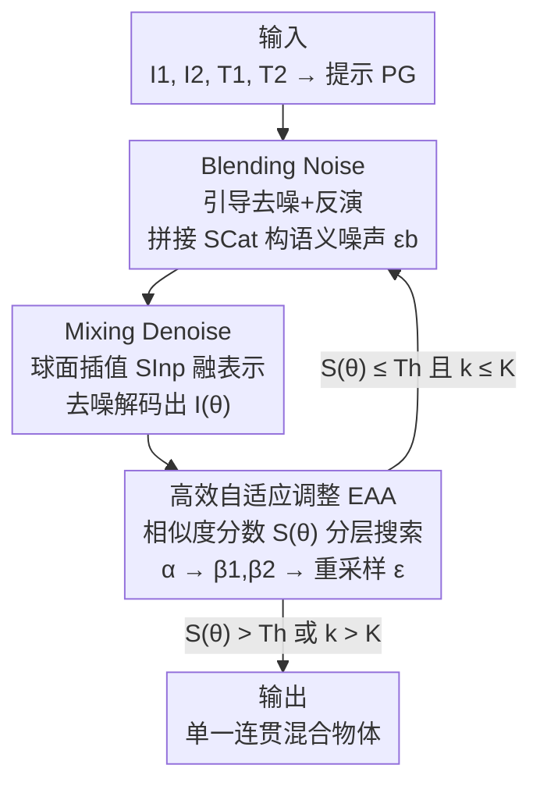

# VMDiff: Visual Mixing Diffusion for Limitless Cross-Object Synthesis

**会议**: ICLR 2026  
**OpenReview**: [https://openreview.net/forum?id=rrXxoH2jgF](https://openreview.net/forum?id=rrXxoH2jgF)  
**领域**: 扩散模型 / 图像生成  
**关键词**: 视觉混合, 跨物体融合, 扩散模型, 噪声反演, 球面插值

## 一句话总结
针对"把两张物体图融成一个全新混合物体"这件事，本文提出 VMDiff：在噪声层用引导去噪+反演构造携带双物体信息的语义噪声（拼接而非插值），在隐空间层用球面插值把两个嵌入融成单一连贯表示，并用一个相似度分数驱动的零阶搜索自动调参，从而同时解决"两物体只是并排没真融合"和"一个物体压倒另一个"两大顽疾。

## 研究背景与动机

**领域现状**：把多个来源的视觉元素合成一张新图，是图像到图像生成里的基础问题，在艺术创作、VR、产品设计、影视游戏里都有需求。主流路线一类是**多概念生成**（OmniGen、DreamO、MIP-Adapter、FreeCustom），把多个参考概念摆进同一张图；另一类是**语义混合**（Conceptlab、TP2O、ATIH、FreeBlend），通过融合概念的文本/图像表示去合成"想象中"的新物体。

**现有痛点**：当用这些强方法去做"两张真实物体图直接融成一个物体"时，作者观测到两类典型失败。其一是**共存生成（coexistent generation）**：两个物体只是并排或部分重叠地出现在同一画面里，空间上连贯、概念上却各自为政——比如 GPT-4o 把玻璃罐和猫头鹰叠在一起，但二者并没有真正融合。其二是**偏置生成（bias generation）**：模型只画出其中一个物体、把另一个丢掉——比如 DreamO 只生成口红、彻底忽略钢铁侠手办。

**核心矛盾**：这两类失败的根源在于融合过程缺乏对"结构合理性"和"语义平衡"的同时约束。随机高斯噪声里不含任何输入物体的信息，去噪时容易丢失肢体等关键结构（→ 共存/残缺）；而把两个语义不对等的概念混在一起时，表示失衡会让某一方主导输出（→ 偏置）。

**本文目标**：合成一个**单一、连贯**的新物体，既保留两个输入各自的核心特征，又在二者之间保持平衡。

**切入角度**：作者主张在**噪声层**和**隐空间层**两个层面同时介入。噪声层负责把"双物体信息"灌进初始噪声以保结构；隐空间层负责把两个嵌入"真正融成一个"而非拼起来；再用一个可自动优化的标量参数空间去平衡两者。

**核心 idea**：用"引导去噪+反演构造语义噪声（拼接保细节）+ 球面插值融表示（插值促融合）+ 相似度分数零阶搜索自动平衡"这一套，替代直接用随机噪声、硬拼接或纯文本混合，来同时治住共存与偏置。

## 方法详解

### 整体框架
VMDiff 输入两张物体图 $I_1, I_2$ 及其类别标签 $T_1, T_2$（如 charizard figurine 和 panda figurine），先拼出引导提示 $P_G$："A photo of \<$T_1$\> creatively fused with \<$T_2$\>."，输出一张把两者融成单一物体的图像。整个流程建立在 FLUX.1 Krea 之上，由两大组件串成：**混合采样过程（HSP）** 负责"怎么融"，**高效自适应调整（EAA）** 负责"用什么参数融最好"。

HSP 内部又分两步：**Blending Noise（BNoise）** 通过引导去噪+反演，把一个随机噪声 $\epsilon$ 提炼成携带双物体语义的噪声 $\epsilon_b$；**Mixing Denoise（MDeNoise）** 从 $\epsilon_b$ 出发、用球面插值把两个图像嵌入融成单一表示，去噪解码出融合图 $I(\theta)$。EAA 则在外层把可学习参数 $\theta=\{\alpha,\beta_1,\beta_2,\epsilon\}$ 当作搜索对象，用相似度分数 $S(\theta)$ 做分层零阶搜索，不停重跑 HSP 直到分数过阈值。

### 关键设计

**1. Blending Noise：用引导去噪+反演把双物体信息"灌进"噪声，且拼接而非插值以保细节**

这一步针对"随机噪声不含输入信息、去噪易丢肢体"导致的残缺/共存问题。做法受 Rectified Flow 启发：从随机噪声 $\epsilon$（即 $x_T$）出发，先**引导去噪**到一个中间时间步 $t_{den}=652$，再**反演**回 $T$，得到精炼噪声 $\epsilon_b=\hat{x}_T$，让噪声本身就携带两个物体的语义结构：

$$\hat{x}_t = x_{t_{den}} \Leftarrow x_{t-1}=x_t-(\sigma_t-\sigma_{t-1})v_\phi(x_t,t,z_{SCat}(z_1,z_2;\beta_1,\beta_2),\gamma_{den},z_p)$$
$$\epsilon_b=\hat{x}_T \Leftarrow \hat{x}_{t+1}=\hat{x}_t+(\sigma_{t+1}-\sigma_t)v_\phi(\hat{x}_t,t,z_{SCat}(z_1,z_2;\beta_1,\beta_2),\gamma_{inv},z_p)$$

其中去噪强度取高值 $\gamma_{den}=5$ 保证强引导，反演强度 $\gamma_{inv}=0$ 以减少噪声空间的失真，$T=999$。关键之处在于条件里的视觉信息用的是**尺度拼接（Scale Concatenation, SCat）**而非插值：$z_{SCat}(z_1,z_2;\beta_1,\beta_2)=\mathrm{concat}(\beta_1 z_1,\beta_2 z_2)$，两个可学习因子 $\beta_1,\beta_2\in\mathbb{R}^+$ 控制各自权重。作者的假设是：插值会把不匹配的嵌入"抹平"、淹没掉细微特征（如腿、手臂），而拼接能完整保留两个概念的全部信息，让反演过程能在含完整概念的噪声上做精炼。消融图（Fig. 4）显示插值（无论先插再精炼还是先精炼再插）都丢细节，唯有拼接给出忠实且连贯的结果。

**2. Mixing Denoise：用球面插值把两个嵌入真正融成"一个"而非拼成"两个"**

BNoise 负责"保留"双物体信息，MDeNoise 则要"融合"它们——这里的目标恰恰相反，所以反过来用插值。从 $\epsilon_b$ 出发再做一次去噪，但视觉条件换成**尺度插值（Scale Interpolation, SInp）**：

$$z_{SInp}(\alpha)=\frac{\sin(\alpha\cdot\delta)}{\sin\delta}z_1+\frac{\sin((1-\alpha)\cdot\delta)}{\sin\delta}z_2,\quad \delta=\cos^{-1}(z_1\cdot z_2)$$

这是球面线性插值（slerp），$0\le\alpha\le1$ 是可学习的混合比例，去噪用固定引导 $\gamma_{gen}=4.0$，最后由 FLUX.1 Krea 解码器解出融合图。为什么这里用插值而非拼接？作者解释拼接虽保留更多输入信息，但其"刚性分离"会造成割裂的表示与生成（输出像两个孤立物体）；插值则沿表示流形平滑过渡，能把两者捏成一个连贯实体。消融图（Fig. 5）里把 MDeNoise 换成拼接变体，结果就退化成"两个分开的物体"。**一句话：BNoise 用拼接保细节、MDeNoise 用插值促融合，两步分工正是本文的精巧之处。**

**3. 高效自适应调整（EAA）：用相似度分数驱动的零阶分层搜索，自动平衡两个概念**

HSP 给定参数就能融，但参数选不好就会偏置，所以需要自动搜参。EAA 先定义一个**相似度分数（Similarity Score, SS）**作为优化目标（公式见下节），它同时奖励"对两个输入的视觉+语义相似度"、惩罚"两者相似度之差"（即强制平衡）。在这个目标上，EAA 做一个**分层零阶搜索**：外层循环 $k=1\to K=3$，每轮先固定 $\beta_1=\beta_2=1$ 用黄金分割搜索找最优混合比 $\alpha^*$；若分数仍未过接受阈值 $T_h=2.4$，再固定 $\alpha^*$ 调整噪声因子——哪个物体的子分数低就增大对应的 $\beta$（$S_1>S_2$ 就调 $\beta_2$，反之调 $\beta_1$）以把弱势物体"拉回来"；若最终分数超过 $T_h$ 就接受并返回 $\theta^*$，否则重采样 $\epsilon$ 进入下一轮，$K=3$ 轮即足够。之所以用零阶（重采样+标量黄金分割）而非一阶梯度优化，是因为作者指出对扩散生成而言一阶优化相比简单的零阶重采样并无明显优势、成本却高得多；零阶搜索复用中间预测、只在标量层面搜索，因此高效。公平对比时关闭重采样（$K=1$、固定种子 42）。

### 损失函数 / 训练策略
本方法无需训练，整套在推理时完成；"优化"指的是 EAA 对参数 $\theta=\{\alpha,\beta_1,\beta_2,\epsilon\}$ 的搜索，目标是最大化相似度分数：

$$S(\theta)=\underbrace{S_{I_1}(\theta)+S_{I_2}(\theta)}_{\text{视觉相似}}+\underbrace{S_{T_1}(\theta)+S_{T_2}(\theta)}_{\text{语义相似}}-\underbrace{|S_{I_1}(\theta)-S_{I_2}(\theta)|}_{\text{视觉平衡}}-\underbrace{|S_{T_1}(\theta)-S_{T_2}(\theta)|}_{\text{语义平衡}}$$

其中 $S_{I_i}(\theta)$ 用 DINO 编码器算融合图 $I(\theta)$ 与源图 $I_i$ 的视觉相似度，$S_{T_i}(\theta)$ 用 CLIP 算与类别标签 $T_i$ 的语义相似度。前四项保真度（让输出同时贴近两个输入及其类别），后两项绝对差惩罚强制对称、防止过拟合到单个输入——这正是同时治"保特征"与"防偏置"的关键。实现上用 FLUX.1 Krea（$E_I$ 用 Redux 做隐空间对齐），512×512 分辨率、20 步去噪，用 Grounded-SAM 配 "most prominent object" 查询定位主体区域来算相似度，每次 $\alpha$/$\beta$ 搜索最多生成 10 张图，两块 RTX 4090 即可跑。

## 实验关键数据

作者构建了 **IIOF（Image-Image Object Fusion）** 基准：40 个物体跨动物/水果/人造物/角色手办四类，组成 780 对图像（对顺序敏感的方法另生成 1560 个有序对）。评测用两族指标——语义对齐 **SA**（VQAScore 的 T5/LLaVA 版与 LLaVA-Critic）与单实体连贯性 **SCE**，外加相似度分数 SS 与平衡度 $B_{sim}$（越小越平衡）。

### 主实验

| 方法 | VQA$^{SA}_{T5}$↑ | VQA$^{SCE}_{T5}$↑ | LC$^{SA}$↑ | LC$^{SCE}$↑ | SS↑ | B$_{sim}$↓ |
|------|------|------|------|------|------|------|
| **VMDiff（本文）** | **0.639** | **0.540** | **8.372** | **8.392** | **2.068** | **0.324** |
| MIP-Adapter (AAAI) | 0.621 | 0.512 | 8.301 | 8.076 | 1.866 | 0.483 |
| FreeBlend (arXiv) | 0.588 | 0.507 | 7.836 | 7.788 | 1.870 | 0.479 |
| DreamO (SIGGRAPH Asia) | 0.591 | 0.467 | 7.592 | 7.013 | 1.793 | 0.644 |
| OmniGen (CVPR) | 0.570 | 0.469 | 7.550 | 7.233 | 1.705 | 0.617 |
| Conceptlab (TOG) | 0.573 | 0.483 | 7.589 | 7.728 | – | – |
| FreeCustom (CVPR) | 0.579 | 0.452 | 6.958 | 6.946 | 1.580 | 0.776 |
| ATIH (NeurIPS) | 0.523 | 0.465 | 7.275 | 6.816 | – | – |
| Stable Flow (CVPR) | 0.460 | 0.372 | 6.020 | 5.024 | – | – |

VMDiff 在绝大多数指标上领先；MIP-Adapter 虽在 VQA$^{SCE}_{LLaVA}$ 单项最高，但在其余 VQA/LC/SS/$B_{sim}$ 上只排第二或更低，说明其改进不是全方位的。$B_{sim}=0.324$ 为全场最低，量化印证了"平衡性"优势。

**用户研究**：76 名参与者各评 12 个结果（6 个多概念生成 + 6 个混合/编辑），共 912 票。VMDiff 在两组分别拿到 **67.3%** 和 **87.1%** 的最高偏好，第二名 GPT-4o 与 ATIH 仅 12.9% 和 7.5%。

### 消融实验

| 配置 | VQA$^{SA}_{T5}$↑ | LC$^{SA}$↑ | SS↑ | B$_{sim}$↓ | 说明 |
|------|------|------|------|------|------|
| Baseline 1 | 0.497 | 7.261 | 1.570 | 0.682 | 随机噪声 + MDeNoise（α=0.5） |
| Baseline 2 | 0.508 | 7.426 | 1.586 | 0.693 | + BNoise（β1=β2=1） |
| + α-search | 0.625 | 8.278 | 2.025 | 0.358 | 加 α 黄金分割搜索 |
| + α + β1,β2-search | **0.639** | **8.372** | **2.068** | **0.324** | 完整模型 |

### 关键发现
- **噪声精炼（BNoise）打底、自适应搜索拔高**：从 Baseline 1→2 加入 BNoise 提升结构保真，但真正的大跳变发生在加入 $\alpha$ 搜索之后——SS 从 1.586 跃到 2.025、$B_{sim}$ 从 0.693 骤降到 0.358，说明"平衡性"主要靠 EAA 的自适应混合比来纠正。
- **$\beta$ 搜索做精修**：在 $\alpha$ 搜索基础上再加 $\beta_1,\beta_2$ 搜索，各指标继续小幅提升、$B_{sim}$ 进一步降到 0.324，起到平滑视觉-文本对齐的作用。
- **拼接 vs 插值的分工不可互换**：BNoise 换成插值会丢细节，MDeNoise 换成拼接会变成两个孤立物体，二者颠倒都退化。
- **多图融合可外推但有损**：把流程顺序套用（先融 $I_1,I_2$ 再融第三张）能产出融合三类属性的单一物体，但比成对融合有更强的信息丢失与失衡，作者把"排列不变的多图聚合"留作未来工作。

## 亮点与洞察
- **"保留用拼接、融合用插值"的对称设计**：同一套去噪框架里，两步刻意用相反的嵌入组合方式——BNoise 拼接保细节、MDeNoise 球面插值促融合，把"既要保特征又要真融合"这对矛盾拆到两个阶段分别解决，思路很干净。
- **用相似度分数把"平衡"显式写进目标**：把"对两个输入相似度之差"作为惩罚项加进 SS，等于把"防偏置"从玄学变成可优化的标量，这个 balance 项思路可迁移到任何"多源融合需防一方主导"的任务。
- **零阶搜索而非梯度回传**：扩散生成里直接对隐空间做一阶反传又贵又无优势，本文用黄金分割+少量重采样的零阶搜索在低维标量空间里调参，兼顾质量与效率，是个实用的工程选择。

## 局限与展望
- **多图融合退化**：超过两张图时信息丢失与失衡明显加重，目前只能顺序拼接、缺乏排列不变的学习式聚合。
- **每次融合需多次生成**：EAA 每轮 $\alpha$/$\beta$ 搜索最多各生成 10 张图、外层最多 $K=3$ 轮，单对融合的总生成开销不小，离实时还有距离。
- **依赖外部组件**：相似度计算依赖 DINO/CLIP 和 Grounded-SAM 的主体定位，"most prominent object" 查询在多主体或主体不明确时可能失准；评测也重度依赖 VQAScore/LLaVA-Critic 这类模型打分。
- **可控性边界**：球面插值的 $\alpha$ 只能控制全局混合比，难以做"取 A 的头 + B 的身"这种部件级精细控制。

## 相关工作与启发
- **vs 多概念生成（OmniGen / DreamO / MIP-Adapter / FreeCustom）**：它们显式地把各概念分开摆放，强在"共存"、弱在"真融合"，容易共存或偏置；本文用统一融合框架把两个概念捏成单一新物体，结构连贯且语义平衡。
- **vs 语义混合（Conceptlab / TP2O / ATIH / FreeBlend）**：Conceptlab、TP2O 纯在文本域插值 token，缺乏真实视觉内容支撑；FreeBlend 在隐空间分阶段插值但易丢原信息、产出碎片化结果；本文直接融合真实图像的结构与语义线索，输出更连贯平衡。
- **vs 风格迁移 / 图像编辑（Stable Flow 等）**：后者只做纹理迁移或局部修改、保持布局不变（ATIH、Stable Flow 往往只是改色/改纹理的"微编辑"）；本文是概念级的整体融合，生成的是一个全新实体而非被编辑的原图。

## 评分
- 新颖性: ⭐⭐⭐⭐ "拼接保细节+插值促融合"的双阶段对称设计与显式平衡分数组合得很巧，但各零件（slerp、反演、零阶搜索）均为已有技术的重组
- 实验充分度: ⭐⭐⭐⭐ 自建 780 对基准、覆盖三类强基线、含定量+用户研究+逐组件消融，较完整；多图融合仅停在初步探索
- 写作质量: ⭐⭐⭐⭐ 两类失败（共存/偏置）的问题刻画清晰，BNoise/MDeNoise 为何用相反组合方式讲得到位
- 价值: ⭐⭐⭐⭐ 给"视觉混合"这一被低估的任务提供了一个可控、免训练、能落地的强基线（且拿过 NY Digital Awards 银奖）

<!-- RELATED:START -->

## 相关论文

- [\[CVPR 2026\] ViHOI: Human-Object Interaction Synthesis with Visual Priors](../../CVPR2026/image_generation/vihoi_human-object_interaction_synthesis_with_visual_priors.md)
- [\[ICLR 2026\] Reconciling Visual Perception and Generation in Diffusion Models](reconciling_visual_perception_and_generation_in_diffusion_models.md)
- [\[ICLR 2026\] Generate Any Scene: Scene Graph Driven Data Synthesis for Visual Generation Training](generate_any_scene_scene_graph_driven_data_synthesis_for_visual_generation_train.md)
- [\[ICLR 2026\] ViPO: Visual Preference Optimization at Scale](vipo_visual_preference_optimization_at_scale.md)
- [\[ICLR 2026\] PQGAN: Product-Quantised Image Representation for High-Quality Image Synthesis](pqgan_product-quantised_image_representation_for_high-quality_image_synthesis.md)

<!-- RELATED:END -->
