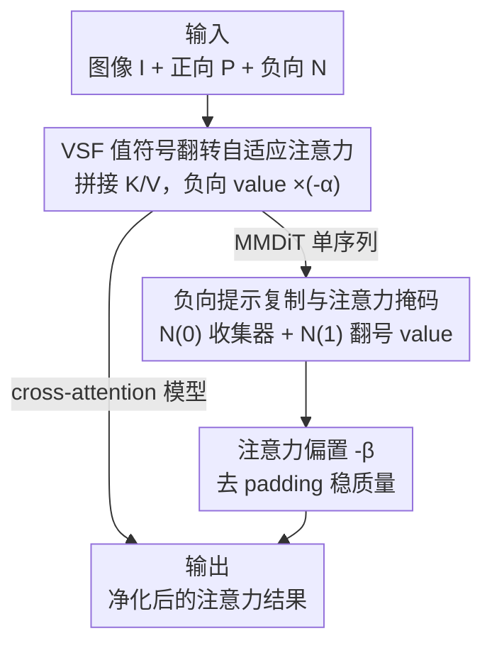

# VSF: Simple, Efficient, and Effective Negative Guidance in Few-Step Image Generation Models By Value Sign Flip

**会议**: ICLR 2026  
**OpenReview**: [https://openreview.net/forum?id=W2NINfoVtN](https://openreview.net/forum?id=W2NINfoVtN)  
**代码**: https://github.com/weathon/VSF  
**领域**: 扩散模型 / 图像生成  
**关键词**: 负向引导, few-step 扩散, 注意力调制, 值符号翻转, MMDiT

## 一句话总结
针对蒸馏后的 few-step（1-8 步）扩散/流匹配模型无法用 CFG 做负向提示的问题，本文提出 Value Sign Flip（VSF）：在注意力计算内部把负向提示的 value 符号翻转，用 token 级、随层/步/区域自适应的方式抵消不想要的内容，几乎零额外开销就把负向遵循度从 0.32–0.38 提到 0.42–0.55，还超过了非 few-step 模型的 CFG。

## 研究背景与动机
**领域现状**：扩散与流匹配模型生成质量很高，但「负向提示」（告诉模型不要画什么）一直依赖 classifier-free guidance（CFG）——把无条件分支换成负向提示分支，靠外插的负号把不想要的概念推开。这是社区里负向提示的标准实现。

**现有痛点**：为了提速，大量模型被蒸馏成 1-8 步推理（Flux Schnell、SD3.5 Large Turbo、SDXL Lightning 等），而这些模型在 CFG-disabled 模式下训练，强行套 CFG 会严重翻车：要么过饱和出伪影（提高 guidance scale 抑制概念时尤其明显），要么步数太少时正负提示特征混在一起，生成「正图和负图的平均」而不是真正排除负向概念。根因是正向、负向引导信号在 few-step 下会发散。即便 CFG 能用，它也需要两次前向，运行时间翻倍。

**核心矛盾**：已有的两个 few-step 负向方法 NASA 和 NAG 把引导搬到注意力输出空间，但都用一个**固定的**引导强度（预设 scale）——整张图、所有层、所有时间步都用同一个值。负向概念在不同区域、不同去噪阶段的「在场强度」并不一样，固定强度既不能在该强的地方强、也不能在该弱的地方收手，于是负向遵循度和图像质量之间被迫做硬性 trade-off。

**本文目标**：在 few-step 模型里实现一个**自适应**的负向引导——能随 token、层、步、图像区域动态调整强度，且几乎不增加计算量、不需要第二次前向。

**切入角度**：作者沿用 Koulischer 等人「按负向内容出现的概率动态调强度」的思路，但把它细化到 token 级。关键观察是：当某块图像 patch 更关注负向提示（而不是正向提示）时，正说明那里更可能出现不想要的内容，就该在那里更强地把它推开——这个「关注度」天然就藏在注意力图里。

**核心 idea**：不在注意力**输出**上做减法，而是把负向提示的 **value 翻号**后和正向 value 拼在一起送进 softmax——当图像 token 注意到负向提示时，翻号的 value 会像降噪耳机的反相波一样原地抵消掉不想要的内容，抵消强度自动随注意力权重浮动。

## 方法详解

### 整体框架
VSF 的输入是图像 token $I$、正向提示 token $P$、负向提示 token $N$，输出是被「净化」过的注意力结果（最终汇成预测速度/噪声）。整套方法只动注意力层内部，不碰外面的去噪外插，因此天然兼容 CFG-disabled 的 few-step 模型。

核心一步：把正、负向提示的 key/value 在序列维拼接，并把负向的 value 乘上 $-\alpha$（翻号缩放），key 保持不变。这样 softmax 仍按「图像和负向提示有多像」分配权重，但权重落到的是一个**反相**的 value，注意得越多、抵消得越狠——抵消强度因此随 token/层/步/区域自动变化。对 cross-attention 模型这一步就够了；但 SD3.5 这类 MMDiT 把图像和文本 token 拼成单序列做全注意力，直接翻号会污染 $P\to N$、$N\to N$ 等不该受影响的注意力路径，于是作者把负向提示**复制成两份**（一份不翻当「收集器」、一份翻号只当 value），并用注意力掩码把翻号信号隔离到只走 $I\to N$ 路径，再加一个注意力偏置 $-\beta$ 进一步稳住质量。

### 关键设计

**1. 值符号翻转的自适应注意力：把固定强度的减法换成 token 级动态抵消**

这一设计直击 NASA/NAG「固定引导强度」的痛点。作者先给出理想形式：给每个 token 一个权重 $W=g(p^+,p^-,I)$ 表示它更偏正向还是负向概念，把 NASA 的 $Z_{NASA}=Z^+-\alpha Z^-$ 改写成 $Z_W = W Z^+ - \alpha(1-W)Z^-$，让正、负向贡献按 $W$ 此消彼长。$W$ 的一个直观算法是看图像对正/负向提示的注意力之比：用 softmax 前的注意力分数 $A^+=\exp(Q (K^+)^T/\sqrt{d})$、$A^-=\exp(Q (K^-)^T/\sqrt{d})$，取 $W=\sum A^+ / \sum(A^+ + A^-)$——图像越关注负向提示，$W$ 越小、推得越狠。

但显式算 $W$ 要做两次注意力、很啰嗦。作者发现存在一个等价的简化实现：把正负向的 key/value 在序列维拼接，**只翻负向 value 的符号**（key 不翻，以保留负向概念的语义、继续匹配对应图像 patch），一次 softmax 就完成：

$$Z_{VSF} = \sigma\!\left(\frac{Q(K^+ \oplus K^-)^T}{\sqrt{d}}\right)(V^+ \oplus -\alpha V^-)$$

其中 $\oplus$ 是序列维拼接、$\sigma$ 是 softmax。原文证明它数学上等价于上面的 $Z_W$。之所以有效，是因为抵消强度不再是预设常数，而由 softmax 权重在每个 token/层/步/区域上自动给出——这正是「噪声越大、反相越强」的降噪耳机式自适应，也是 VSF 相比固定 scale 方法的根本区别。

**2. 负向提示复制与注意力掩码：让翻号信号只走「图像→负向」这一条路**

VSF 在 cross-attention 模型里干净利落，但搬到 MMDiT（图像 + 文本拼成单序列做全注意力）就会出问题：若直接把负向 value 乘 $-\alpha$，翻号会沿所有涉及 $V_N$ 的注意力路径扩散，不仅作用于想要的 $I\to N$，还污染 $P\to N$（正向去看负向）和 $N\to N$（负向自己抵消自己），扭曲模型行为。

解法是把负向提示复制成两份。一份 $N^{(0)}$ 保持原样、不翻不缩；另一份 $N^{(1)}$ 只把 value 翻号缩放 $V_{N^{(1)}}=-\alpha\cdot V_{N^{(1)}}$，且 $N^{(1)}$ **不作为 query**参与注意力。再用注意力掩码把作用面隔离：$N^{(0)}$ 只能注意到 $I$ 和它自己，$N^{(1)}$ 只被 $I$ 注意到。这样翻号信号只影响 $I\to N^{(1)}$ 这一条预期路径；而 $N^{(0)}$ 像一个「信息收集器」，从图像里收集不想要的元素、同时通过自注意力不断更新自己，并以未翻号的形态进入 MLP 和下一层（在下一层再被翻号一次），恰好对应正向提示在层间逐步更新的机制。这一隔离既防止了正负提示互相干扰，又保证翻号内容专门作用在该抵消的地方。

**3. 注意力偏置与 padding 去除：在保质量的同时让负向真正生效**

为进一步守住生成质量，作者在 $I\to N^{(1)}$ 路径上额外加一个注意力偏置 $-\beta$（受 Wang 等人「屏蔽部分注意力方向可提质」的启发），并移除负向提示的 padding token。$-\beta$ 相当于给翻号路径一个可调的「闸门」，避免负向信号在不该强的地方过度介入而拉低画质。值得注意的是消融发现：去掉负向 padding 会让负向提示完全失效，所以这里去 padding 是配合 VSF 的实现细节、和后面失败的 WEF 变体（不去 padding 才有效）形成对照。$\beta$ 是唯一的次要超参，主超参只有 $\alpha$，使得 VSF 在下游任务里很好调。

### 损失函数 / 训练策略
VSF 是**训练无关（training-free）的推理期方法**，不引入任何新参数或微调，直接插进现成的注意力层即可（提供了 ComfyUI 节点）。唯一涉及训练的是评测侧：作者用 VSF/NAG/NASA 生成的数据微调了一个 Qwen-2.5-VL 作为更懂否定的打分器，供后续工作使用，与生成方法本身无关。

## 实验关键数据

作者构造了 NegGenBench：用 ChatGPT o3 生成 200 对「正向-负向」提示，刻意把负向设成正向里不可或缺的成分（如正向「自行车」配负向「轮子」），并配套两个问题用 MLLM（LLaMA-4-Maverick）判分。指标为正向遵循 / 负向遵循 / 质量三个分数（均越高越好）。

### 主实验

few-step 模型（SD3.5 Large Turbo，4 步）上的对比：

| 方法 | 正向↑ | 负向↑ | 质量↑ |
|------|------|------|------|
| **VSF Strong** | 0.870 | **0.545** | 0.952 |
| **VSF Quality** | 0.980 | 0.420 | **0.986** |
| NAG | 0.993 | 0.220 | 0.968 |
| NAG Strong | 0.975 | 0.320 | 0.901 |
| NASA | 0.970 | 0.380 | 0.867 |
| None（无负向引导） | 0.990 | 0.195 | 0.968 |
| CFG（28 步，非 few-step） | 1.000 | 0.300 | 0.956 |

VSF Strong 的负向分 0.545 远超所有 few-step 方法（0.32–0.38），甚至超过非 few-step 的 CFG（0.300）；VSF Quality 拿到第二高负向分的同时质量最高（0.986）。外部基线对比里，VSF 在开源方法中负向遵循最强，仅次于闭源 GPT-4o（0.705），与 Nano Banana（0.498）相当，而运行时只要 ~3s（生成-再编辑的 Flux Kontext 管线要 55s）。10 条提示 × 2 seed 的人工标注同样验证：VSF Quality 负向分 0.550，碾压 NAG（0.100）/NASA（0.150）。

### 消融实验

在 200 条提示上扫 scale 画 trade-off 曲线，对比各组件去除后的表现：

| 配置 | 现象 | 结论 |
|------|------|------|
| Full（VSF） | 负向分可升到 ~70 仍保住正向/质量 | 完整模型 |
| WEF（改翻文本 embedding） | 几乎无任何效果 | 翻 value 而非 embedding 是关键 |
| w/o mask（仍复制） | 负向分一升正向分骤降 | 掩码隔离至关重要 |
| w/o duplication & mask | 翻号污染其他路径，质量崩 | 复制+掩码不可少 |
| w/o bias（-β） | 与完整模型接近 | β 影响较小（或 MLLM 不够敏感） |

### 关键发现
- **自适应性是 VSF 的护城河**：trade-off 曲线显示，负向分升到约 60 之前 VSF 的正向分和质量都还在 90 以上；而 NAG/NASA 在负向分还没到 50 时质量就跌到约 60（已经完全失真）。固定强度方法没法在「推得够狠」和「不毁图」之间两全。
- **WEF 失败的根因很有启发**：把文本 embedding 整体翻号（类似对 embedding 做 CFG）几乎无效，作者推测是因为这相当于同时翻了 key 和 value，结果把「最不像负向提示」的区域推开，方向反了——印证了 VSF「只翻 value、保留 key」的设计必要性。
- **注意力图证据**：把 scale 设 0 会出现伞，设 3 能避开；可视化显示人头上方等「可能出现伞」的图像 token 对负向提示注意力更高，第 4-5 步这些区域呈现强负向注意力，最终伞被精准抹掉——证明 VSF 确实在特定位置自适应抑制。

## 亮点与洞察
- **降噪耳机式的类比很妙**：把「翻号 value 在 softmax 里被注意到时原地抵消」类比成反相声波消噪，直观解释了为什么自适应抵消能成立，且只需一次前向、几乎零开销。
- **「显式 W → 等价简化实现」的推导**：先写出理想的 token 级权重 $Z_W$，再证明「拼接 K/V + 只翻 value 符号」与之等价，把一个需要两次注意力的复杂算法压成一行 softmax，工程上极其干净。
- **MMDiT 的复制+掩码方案可迁移**：在全注意力单序列里「复制一份当只读收集器、另一份只当被读的 value」这套隔离技巧，凡是想在 MMDiT 里定向注入/屏蔽某类 token 影响的任务都能借鉴。
- **副产物会玩**：把主体词同时放进正负向提示，可生成「半抵消」的抽象艺术/反美学图像，这类风格通常被奖励模型偏好真实感而压制——VSF 给了一个免训练的口子。

## 局限与展望
- **依赖 MLLM 评测**：负向/质量分都由 LLaMA-4 判，作者自己也指出 LLaMA 打质量分偏宽松（<90 才算降质），且 w/o bias 与完整模型差异小「可能是 MLLM 不够敏感」——评测精度本身是一层不确定性。
- **超参仍需按场景调**：虽只有 $\alpha$（主）和 $\beta$（次）两个超参，但 VSF Quality 与 VSF Strong 要分别调出来，说明「负向遵循 ↔ 质量」的取舍仍要人工选点，没有自动决定强度的机制。
- **强行推到极端仍掉质量**：负向分超过约 60 后 VSF 质量也开始下降，只是比 NAG/NASA 晚得多；并非无损。
- **改进思路**：把 $\alpha$ 也做成随步/区域自动调度（而非全局常数），或用第 6.2 节那种负向注意力图反过来驱动一个闭环控制器，可能进一步推高可用的负向分上限。

## 相关工作与启发
- **vs CFG**：CFG 在输出空间做外插、需两次前向且与 few-step 不兼容（强行用会过饱和/正负混合）；VSF 在注意力内部翻 value、单次前向、专为 CFG-disabled 的 few-step 模型设计，负向分还更高。
- **vs NASA**：NASA 在注意力输出空间做 $Z^+-\alpha Z^-$，全局固定强度且原限于 cross-attention；VSF 把强度变成 token/层/步/区域自适应，并通过复制+掩码扩展到 MMDiT。
- **vs NAG**：NAG 同样在注意力输出空间外插并做归一化+混合，主攻质量而非负向遵循，约束太紧会限制负向能力；VSF 直接在 value 上自适应抵消，专攻负向遵循且 trade-off 曲线更平。
- **vs Koulischer 等（动态引导）**：他们按概率动态调整体引导强度，但只随步变、不随图像区域变；VSF 把这一思路细化到 token 级，区域/层/步全自适应。

## 评分
- 新颖性: ⭐⭐⭐⭐⭐ 「翻 value 符号」这一极简且可证等价的自适应负向引导，思路干净且 few-step 场景下解决真问题。
- 实验充分度: ⭐⭐⭐⭐ 主表+人工+外部基线+trade-off+消融较完整，但评测高度依赖 MLLM 判分、定量指标偏主观。
- 写作质量: ⭐⭐⭐⭐ 降噪耳机类比和注意力图证据清晰，但部分实现细节（复制次数、padding）下放到附录，正文略跳。
- 价值: ⭐⭐⭐⭐⭐ 训练无关、~3s、带 ComfyUI 节点，几乎可即插即用地给 few-step 模型补上负向提示能力。

<!-- RELATED:START -->

## 相关论文

- [\[ICLR 2026\] Safety-Guided Flow (SGF): A Unified Framework for Negative Guidance in Safe Generation](safety-guided_flow_sgf_a_unified_framework_for_negative_guidance_in_safe_generat.md)
- [\[ICLR 2026\] Diffusion Negative Preference Optimization Made Simple](diffusion_negative_preference_optimization_made_simple.md)
- [\[ICLR 2026\] SERUM: Simple, Efficient, Robust, and Unifying Marking for Diffusion-based Image Generation](serum_simple_efficient_robust_and_unifying_marking_for_diffusion-based_image_gen.md)
- [\[ICLR 2026\] DistillKac: Few-Step Image Generation via Damped Wave Equations](distillkac_few-step_image_generation_via_damped_wave_equations.md)
- [\[ICLR 2026\] PairFlow: Closed-Form Source-Target Coupling for Few-Step Generation in Discrete Flow Models](pairflow_closed-form_source-target_coupling_for_few-step_generation_in_discrete_.md)

<!-- RELATED:END -->
