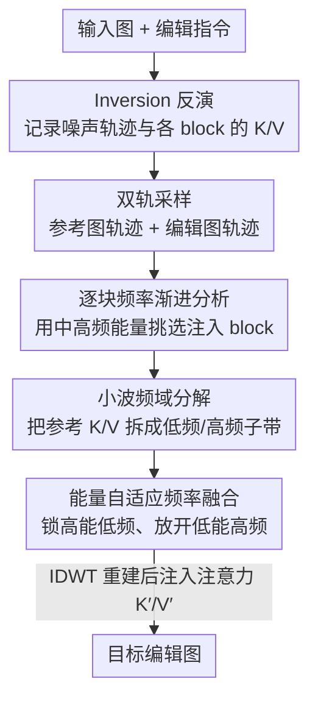

# W-Edit: A Wavelet-based Frequency-aware Framework for Text-driven Image Editing

**会议**: ICLR 2026  
**OpenReview**: [https://openreview.net/forum?id=jIcfQb66us](https://openreview.net/forum?id=jIcfQb66us)  
**代码**: 无  
**领域**: 扩散模型 / 图像编辑  
**关键词**: 文本驱动图像编辑, 小波变换, 频域调制, Diffusion Transformer, 免训练

## 一句话总结
W-Edit 把扩散特征用小波变换分解成多尺度频带，把"低频管结构、高频管细节"这一频域先验注入预训练 DiT 的注意力 K/V，从而免训练地在保结构和改局部之间取得平衡，在 PIE-Bench 上把 FID 降到 65.44、CLIP 提到 31.84，全面超过此前的免训练编辑方法。

## 研究背景与动机

**领域现状**：文本驱动图像编辑通常建立在预训练 T2I 扩散模型之上，近年从 U-Net（Stable Diffusion）转向 Diffusion Transformer（FLUX、SD3）并引入 flow matching。编辑方法大体分两类：训练式（InstructPix2Pix、MagicBrush、IMagic）和免训练式（inversion、注意力注入）。

**现有痛点**：训练式方法要构建大规模指令-图像三元组或微调大模型，代价高且容易灾难性遗忘，在视频、细粒度等未见域上泛化差。免训练方法则各有硬伤：inversion 类把图像映回噪声再重采样，会出现轨迹漂移、可控性弱；Prompt-to-Prompt 这类注意力注入能改善结构保持，但对层选择极其敏感、复杂编辑下失效；最近的 Stable-Flow 提出"vital layer"只在关键层注入，稳了不少，却施加了过于刚性的约束，常常连场景级修改这种该改的地方都改不动。一句话——这些方法要么"保住结构但漏掉编辑"，要么"实现编辑但牺牲一致性"。

**核心矛盾**：作者把根因归结为——全局语义（布局、物体身份）和局部信号（纹理、颜色、细属性）在**空间域里是纠缠的**，所以很难同时"保住不该动的"和"改掉该动的"。

**切入角度**：频域天然提供了一种与编辑目标对齐的分解。低频分量编码布局与语义，可当作一致性的可靠锚点；高频分量承载纹理与变化，适合做灵活修改。作者进一步对 DiT 中间特征做频域分析，发现一个**逐块的频率渐进规律**：早期 block 主要刻画低频结构、后期 block 细化高频细节——于是把文本编辑重新表述为"多层级的频率控制"。

**核心 idea**：用小波变换把扩散特征拆成多尺度频带，把参考图的低频（结构）锁住、放开高频（细节）让文本去改，并以"能量自适应"的方式选择性注入预训练模型的注意力，从而免训练地实现可控编辑。

## 方法详解

### 整体框架

W-Edit 围绕一条**双轨采样**展开：给定输入图和编辑指令，先对输入图做 inversion 得到初始噪声和 inversion 轨迹，并沿途记录每个 block 的注意力 key/value（K, V）；随后**同时**从反演噪声（生成参考图）和新随机噪声（生成编辑图）两条轨迹采样。在选中的若干 Transformer block 上，把参考图的 K/V 用 DWT 分解成多尺度频带，用一个能量自适应的融合机制把参考图的频域特征注入编辑图的采样过程，再经 IDWT 重建后写回注意力。这样编辑图的全局结构被参考图锚定，而高频细节随文本指令自由变化，最终输出"既忠实于文本、又保住无关内容一致性"的结果。整个过程不训练、不微调，适配 FLUX、SD1.5、CogVideoX 等多种主流架构。

### 关键设计

**1. 小波频域分解：在空间和频率上同时定域，拆开结构与细节**

编辑的核心难点是结构与细节在空间域纠缠。作者要把扩散特征投到频域去显式解耦，但传统的傅里叶变换给的是全局频率分解、丢掉了空间定位，无法做局部/多尺度控制。W-Edit 改用小波变换：母小波 $\psi(t)$ 通过尺度参数 $a$（控制频率，$a$ 越大频率越低）和平移参数 $b$（控制位置）生成 $\psi_{a,b}(t)=\frac{1}{\sqrt{a}}\psi\!\left(\frac{t-b}{a}\right)$，其基函数在空间和频率上都定域。对 2D 特征做一级离散小波变换（DWT）得到四个子带 $F\xrightarrow{\text{DWT}}F_A,F_H,F_V,F_D$，其中 $F_A$ 是低频近似、$F_H/F_V/F_D$ 分别是水平/垂直/对角高频细节；对 $F_A$ 递归再分解就得到多级表示。这恰好把"低频=布局语义=一致性锚点"和"高频=纹理变化=可编辑细节"分离开，构成后续频率感知的基础。相比 DCT 或可学习的频率控制，小波的空间-频率联合定域让它能针对不同区域、不同尺度做精准控制。

**2. DiT 逐块频率渐进：用中高频能量定位该注入哪些 block**

在 U-Net 里"早层管结构、晚层管细节"是靠编码-解码的分辨率升降启发式得来的，但 DiT 的 block 架构同质、没有清晰的语义阶段，无法照搬。作者对第 $k$ 个 block 的输出 $z_k$ 做 2D 傅里叶变换 $\hat{z}_k(u,v)=\mathcal{F}[z_k]$，并定义一个**中高频能量**指标：先取中频半径 $r_{mid}=r_{max}//2$ 作为低/高频分界，再把从 $r_{mid}$ 到最大频率的径向功率谱累加得到 $E^k_{MTH}=\sum_{r=r_{mid}}^{\text{max}}P_r(\hat{z}_k)$，它是一个标量、直接量化该 block 的中高频成分。对 FLUX 的 SingleStreamBlocks 和 DoubleStreamBlocks 分别计算并可视化后发现：早期 block 主要编码低频结构基底，后期 block 注意力更稀疏、细化高频细节。于是作者挑选那些**中高频能量极高或极低**的 block 作为频域融合目标。一个有意思的交叉验证是：这些被选中的 block 与 Stable-Flow 用 DINOv2 测出的"vital layer"高度重合，说明 block 重要性和频率响应之间存在强对应——这让"按频率选层"既有依据又省算力。

**3. 能量自适应频率融合：按能量阈值锁结构、放细节**

挑好 block 后，需要决定每个频带"用参考图的还是让模型自由生成"。自然图像的视觉能量绝大部分集中在表征全局结构的低频，作者据此设计能量感知融合：令第 $i$ 个子带能量 $E_i=\sum|F_{ref,i}|^2$，选出累积能量达到阈值 $\eta$ 的最小子带集合，公式为

$$F'_i=\begin{cases}F_{ref,i}, & \text{若}\ \sum_{j=1}^{i}E_j\le\eta\sum_k E_k,\\ F_i, & \text{否则。}\end{cases}$$

也就是把高能量（低频、结构）子带替换成参考图的、显式锁住布局，把低能量（高频、细节）子带交给模型按文本生成。$\eta$ 因此成了一个调节"引导强度 vs 特征保留"的关键滑钮：$\eta$ 越小越偏文本对齐但牺牲结构，越大越过度保参考、压住编辑。论文实测 $\eta=0.6$ 在结构保真与可编辑性之间取得最佳折中。

**4. 反演双轨 + 注意力注入：把频域特征真正作用进采样轨迹**

前面三步产出的频带要落到生成过程才有意义。W-Edit 以 FLUX 这类 flow 模型为载体：flow 模型用 ODE $\frac{d\phi_t(x)}{dt}=u_t(\phi_t(x))$ 把先验噪声 $p_0$ 输运到数据分布 $p_1$；要编辑真实图就用 FLUX 的反向欧拉求解器把图反演回噪声，更新式为 $z_{t-1}=z_t+(\sigma_{t+1}-\sigma_t)u_t(z_t)$、$z_t=z_{t-1}+(\sigma_t-\sigma_{t+1})u_t(z_{t-1})$，反演同时把各步的 K/V 存下来。融合后的系数经逆小波变换 IDWT 重建为 $F'$，再写进注意力：$K'=F'W_K$、$V'=F'W_V$、$Q=FW_Q$，得到 $\text{Attn}'(Q,K',V')=\text{Softmax}\!\left(\frac{QK'^\top}{\sqrt{d}}\right)V'$。低频带控制构图、高频带细化细节，能量自适应融合还允许动态混合多个参考或编辑。整条双轨设计——参考轨迹存 K/V、编辑轨迹从纯噪声出发并吸收这些 K/V——保证了编辑图被引导向原始结构，把结构漂移压到最小。

## 实验关键数据

### 主实验

在 PIE-Bench 上，基于 FLUX.1-dev 与 P2P、MagicBrush、Flow-Edit、Stable-Flow 对比，并用 Phi-3.5-vision 做 VLM 评测、15 名受试者做用户研究。

| 方法 | CLIP↑ | FID↓ | PSNR↑ | LPIPS↓ | Text Fol.↑ | Modify↑ |
|------|-------|------|-------|--------|-----------|---------|
| P2P | 28.13 | 320.65 | 15.12 | 0.4736 | 31.5% | 24.0% |
| MagicBrush | 29.06 | 206.19 | 15.68 | 0.4615 | 84.5% | 33.5% |
| Flow-Edit | 30.48 | 80.35 | 18.33 | 0.2642 | 76.0% | 54.5% |
| Stable-Flow | 29.16 | 89.78 | 21.02 | 0.1522 | 77.5% | 58.0% |
| **W-Edit** | **31.84** | **65.44** | **24.06** | **0.1028** | 81.0% | **63.0%** |

相对 Flow-Edit，W-Edit 把 FID 降低 18.6%、CLIP 提升 4.5%；PSNR 比次优高 14.5%，LPIPS 改善 32.5%。VLM 评测里 MagicBrush 的 Text Following 虽最高（84.5%）但以牺牲一致性为代价，W-Edit 在文本遵从与最小化修改（Minimal Modification 63.0%）之间取得最佳平衡。用户研究的四个维度（对齐 3.8 / 一致性 3.9 / 真实感 4.2 / 物理合理性 3.8）也几乎全面领先，真实感与合理性提升尤其明显。效率上相比裸 FLUX 仅增加 10.8% 推理时间、1.6% 显存。

### 消融实验

| 配置 | CLIPimg | CLIPtxt | CLIPdir | Average |
|------|---------|---------|---------|---------|
| Selected-block injection（完整） | 0.9749 | 0.3068 | 0.0826 | **0.4548** |
| All-block injection | 0.9988 | 0.2839 | 0.0013 | 0.4280 |
| w/o SingleStreamBlocks | 0.9184 | 0.3162 | 0.0880 | 0.4409 |
| w/o DualStreamBlocks | 0.9458 | 0.3089 | 0.0871 | 0.4473 |
| w/o high-frequency | 0.9391 | 0.3092 | 0.0821 | 0.4301 |
| w/o low-frequency | 0.9249 | 0.3125 | 0.0954 | 0.4443 |

### 关键发现
- **选层注入是关键**：全部 block 注入虽把图像相似度 CLIPimg 拉到 0.9988，但方向一致性 CLIPdir 几乎崩到 0.0013——注入过猛会把参考强加进去、压死文本引导；选中 block 注入才在三项 CLIP 指标上拿到最高平均 0.4548。
- **两种频带互补**：去掉高频丢失细粒度一致性，去掉低频则破坏结构保持（CLIPimg 下降）；去掉 SingleStreamBlocks 主要伤相似度，去掉 DualStreamBlocks 则削弱文本对齐与一致性。
- **$\eta$ 是结构↔可编辑的滑钮**：$\eta<0.4$ 偏文本对齐但损结构、$\eta>0.8$ 过度保参考压住编辑，$\eta=0.6$ 取得最高 CLIPdir，最终固定为 0.6。

## 亮点与洞察
- **把"频域分解"做成免训练编辑的统一机制**：不靠手工注意力注入也不靠重训练，只在频带层面做能量加权替换，object 替换/添加/删除/场景编辑/非刚性编辑全用同一套机制完成，泛化面广。
- **用中高频能量谱给 DiT 同质 block 找"功能分工"**：这一频域分析填上了 DiT 不像 U-Net 那样有天然层级语义的空白，且与 DINOv2 测出的 vital layer 高度重合，是一个可迁移的"如何选层注入"的判据。
- **能量自适应阈值很优雅**：基于自然图像能量集中在低频的先验，用累积能量阈值 $\eta$ 一刀切地决定锁哪些子带，比固定挑某几个频带更自适应，迁移到风格迁移、多参考融合等任务也直接可用。

## 局限与展望
- 注入 block 的选择虽有频率能量依据，但仍依赖对目标架构（FLUX 的 Single/Double Stream）逐一分析，换一个全新架构需要重新做频率渐进分析。
- $\eta=0.6$ 是在 PIE-Bench 上全局选定的折中值，对不同编辑类型（如大幅场景改写 vs 细微属性微调）未必都最优，缺少自适应或按指令调节 $\eta$ 的机制。
- 论文未充分报告极端编辑（大面积重绘、多物体同时编辑）下的失败模式与边界，频域锁定在这些场景是否仍稳健有待验证。

## 相关工作与启发
- **vs Stable-Flow**：两者都做选层注入，但 Stable-Flow 用 DINOv2 找 vital layer 并施加刚性约束，常常连场景级该改的也改不动；W-Edit 用频率能量选层 + 能量自适应频带融合，给了"哪些频带锁、哪些放"的细粒度旋钮，编辑灵活度更高，且二者选出的层高度重合反过来印证了频率判据的合理性。
- **vs Prompt-to-Prompt（P2P）**：P2P 靠注入交叉/自注意力提升结构控制，但对 block 选择极敏感、复杂编辑失效（FID 高达 320.65）；W-Edit 把注入从空间注意力搬到频带，结构与细节解耦后更鲁棒。
- **vs FlexiEdit / FDS 等频域编辑**：它们也用频率线索，但往往需要额外目标函数或改架构，限制即插即用；W-Edit 完全免训练、不改架构，只在中间特征上做小波分解与注意力注入，更通用。

## 评分
- 新颖性: ⭐⭐⭐⭐ 把小波多尺度频带分解 + 能量自适应融合系统性地引入 DiT 免训练编辑，并给出 DiT 逐块频率渐进的分析，角度新颖。
- 实验充分度: ⭐⭐⭐⭐ PIE-Bench 定量 + VLM + 用户研究 + 跨 FLUX/SD1.5/CogVideoX 的泛化，消融覆盖选层与频带，较完整。
- 写作质量: ⭐⭐⭐⭐ 动机—频域洞察—方法的逻辑链清晰，公式与图示配合到位。
- 价值: ⭐⭐⭐⭐ 免训练、低开销（+10.8% 时间）、跨架构可迁移，对可控编辑实用价值高。

<!-- RELATED:START -->

## 相关论文

- [\[CVPR 2026\] CARE-Edit: Condition-Aware Routing of Experts for Contextual Image Editing](../../CVPR2026/image_generation/care-edit_condition-aware_routing_of_experts_for_contextual_image_editing.md)
- [\[CVPR 2026\] HP-Edit: A Human-Preference Post-Training Framework for Image Editing](../../CVPR2026/image_generation/hp-edit_a_human-preference_post-training_framework_for_image_editing.md)
- [\[ICLR 2026\] LogiStory: A Logic-Aware Framework for Multi-Image Story Visualization](logistory_a_logic-aware_framework_for_multi-image_story_visualization.md)
- [\[ICLR 2026\] Latent Wavelet Diffusion for Ultra-High-Resolution Image Synthesis](latent_wavelet_diffusion_for_ultra_high-resolution_image_synthesis.md)
- [\[ICLR 2026\] GeoDiv: Framework for Measuring Geographical Diversity in Text-to-Image Models](geodiv_framework_for_measuring_geographical_diversity_in_text-to-image_models.md)

<!-- RELATED:END -->
