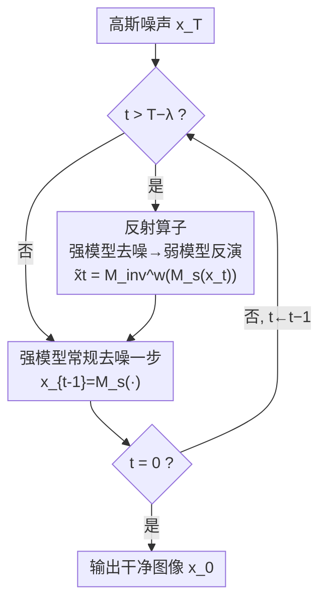

# Weak-to-Strong Diffusion with Reflection

**会议**: ICLR 2026  
**OpenReview**: [https://openreview.net/forum?id=tg19FVh3p1](https://openreview.net/forum?id=tg19FVh3p1)  
**领域**: 扩散模型  
**关键词**: 扩散采样, 训练无关增强, 弱到强差距, 反射算子, 推理时缩放

## 一句话总结
W2SD 提出在扩散采样过程中交替执行「强模型去噪 + 弱模型反演」的反射操作，用一对现成强/弱模型之间可估计的「弱到强差距」去逼近不可观测的「强到理想差距」，从而免训练地把采样轨迹拉向真实数据分布；在图像/视频、UNet/DiT/MoE 等多种设定上显著提升人类偏好与美学质量，Juggernaut-XL 上 HPSv2 胜率最高可达 90%。

## 研究背景与动机
**领域现状**：扩散模型通过 score matching 学习真实数据分布的对数概率梯度，是当前生成任务的主流范式。近年来推理时增强（inference-time scaling）成为热点，大量工作通过改输入条件、改网络结构、加额外约束来提升采样质量，例如 Z-Sampling 靠隐式语义注入、Auto-Guidance 靠从头训练一个退化版模型来引导采样。

**现有痛点**：受架构设计和数据质量限制，现有扩散模型在推理阶段不可避免地存在梯度估计误差，导致学到的分布与真实分布之间始终存在一道「建模差距」（modeling gap），表现为细节缺失、文字/计数错误、属性绑定混乱等顽疾。而已有的增强方法大多只针对单一组件（更好的调度器、更好的去噪网络）从单一视角弥合这道差距，灵活性和泛化性都很有限——换个架构、换个任务往往就不适用了。

**核心矛盾**：要弥合「现有模型↔理想模型」的差距，本质上需要知道真实数据分布的梯度方向，但真实分布根本不可观测，这道「强到理想差距」无法直接量化，更无法直接优化。

**本文目标**：在不训练、不改模型结构的前提下，找到一个可估计的量来替代不可观测的理想方向，并且这套机制要能灵活复用各种现成的增强技术。

**切入角度**：作者观察到，虽然「强模型到理想」的差距不可测，但「弱模型到强模型」的差距完全可测——只要手头有一对能力有高低之分的模型（强模型 $M_s$、弱模型 $M_w$），它们各自估计的 score 之差就是一个现成的、有方向的信号。如果这个弱到强方向恰好近似指向理想分布，就能拿它当代理。

**核心 idea**：用可估计的「弱到强差距」$\Delta_1 = \nabla\log p_s - \nabla\log p_w$ 作为不可估计的「强到理想差距」$\Delta_2 = \nabla\log p_{gt} - \nabla\log p_s$ 的代理，并通过去噪/反演交替的反射算子在采样轨迹上隐式地施加这个方向。

## 方法详解

### 整体框架
W2SD（Weak-to-Strong Diffusion）是一个免训练的「元增强」框架：它不发明新的去噪网络，而是把任意一对强模型 $M_s$ 与弱模型 $M_w$ 插进标准采样循环里，在采样的后段若干步对潜变量做反射修正，把轨迹推向真实数据分布，最后照常解码出干净图像。

整体流程基于一个关键事实：在同一 score 网络下，去噪算子 $M$ 和反演算子 $M_{inv}$ 互为逆映射，即 $M_{inv}(M(x_t,t),t)=x_t$。但当去噪用强模型、反演用弱模型时，这个往返不再闭合，残差恰好就是弱到强差距 $\Delta_1(t)$。W2SD 正是利用这个「不闭合的往返」在每一步注入修正信号。具体地（Algorithm 1）：采样总步数 $T$，只在最后 $\lambda$ 步（$t > T-\lambda$）触发反射——先用强模型去噪、再用弱模型反演得到修正后的 $\tilde{x}_t = M_{inv}^w(M_s(x_t,t),t)$，然后再用强模型从 $\tilde{x}_t$ 正常去噪一步 $x_{t-1}=M_s(\tilde{x}_t,t)$；其余步骤就是普通采样。

### 关键设计

**1. 弱到强差距作为理想方向的代理：把不可测的 $\Delta_2$ 换成可测的 $\Delta_1$**

这是 W2SD 的理论内核，针对的痛点是「强到理想差距 $\Delta_2$ 不可观测」。作者定义弱到强差距 $\Delta_1=\nabla\log p_s-\nabla\log p_w$（强、弱模型 score 之差，完全可算），强到理想差距 $\Delta_2=\nabla\log p_{gt}-\nabla\log p_s$（含真实分布梯度，不可算），主张用前者近似后者。Theorem 2 给出了这个代理成立的条件：把理想/强/弱三个模型都建模为无穷高斯混合分布，并用多项式偏置函数 $B_s^k,B_w^k$ 刻画强、弱相对理想的归一化权重偏差；当相对偏置比满足 $\left|B_w^k/B_s^k - 2\right|\le \epsilon$ 时，差距误差有界 $|\Delta_1(x)-\Delta_2(x)|\le C(x)\cdot\epsilon\cdot|\Delta_2(x)|$。直观含义是：弱模型相对理想的「偏」大约要是强模型的两倍，弱到强方向才正好指向理想。Theorem 3 进一步把局部差距上升到全局分布对齐，证明在 $\epsilon<1$ 时 W2SD 严格降低 Fisher 散度 $\mathcal{J}(p_{gt}\|p_{w2sd})\le\epsilon^2\mathcal{J}(p_{gt}\|p_s)<\mathcal{J}(p_{gt}\|p_s)$，即反射操作系统性地减小了总的 score matching 误差。作者也诚实地点出两种失效模式：模型冲突（强弱偏置相反、比值 $<0$，$\Delta_1$ 与真实优化方向相悖）和模型过度相似（弱模型太像强模型、比值 $\approx 1$ 而非 $2$，$\Delta_1$ 太小不足以弥合差距）。

**2. 去噪-反演交替的反射算子：让差距方向真正作用到潜变量上**

光有「用 $\Delta_1$ 代理 $\Delta_2$」的想法还不够，需要一个机制把这个方向施加到采样轨迹上，而且要比 Auto-Guidance 那种 CFG 式外推更平滑、少伪影。W2SD 的做法是反射算子 $M_{inv}^w(M_s(\cdot))$：先用强模型去噪一步，再用弱模型把结果反演回噪声尺度。由于去噪和反演在不同模型下不再互逆，这一往返恰好沉淀出弱到强差距。Theorem 1 给出闭式结果——反射把 $x_t$ 修正为

$$\tilde{x}_t = x_t + \sigma^2 t\,\Delta t\,(\nabla_{x_t}\log p_t^s(x_t)-\nabla_{x_t}\log p_t^w(x_t))$$

即沿 $\Delta_1(t)$ 方向移动了一步。当 $\Delta_2(t)-\Delta_1(t)$ 很小时，修正后的 $\tilde{x}_t$ 就收敛到理想潜变量 $x_t^{gt}$。作者在 1D/2D 高斯混合和 CIFAR-10（car/horse 两类）上做了可视化：当强、弱模型都偏向某个峰（如右峰、马类）时，反射轨迹能把样本逐步拉向欠表达的左峰、提升「car」的生成概率，t-SNE 上也能看到 car/horse 表征被有效解耦——直观验证了反射确实在低密度区域补回了概率质量。相比 Auto-Guidance 依赖从头训练退化模型 + 外推、易引入伪影，反射机制只需现成模型对、更平滑也更通用。

**3. 灵活的弱-强模型对：一套机制吃下权重/条件/采样三类差距**

W2SD 的杀手锏在于「强/弱」可以由用户按需定义，从而把社区里各种现成增强技术统一进同一框架，定向获得不同维度的提升。作者梳理出三大类配对（Table 1）：**权重差距**——全参微调模型 vs 标准模型（DreamShaper / Juggernaut-XL vs SD1.5 / SDXL）、个性化 LoRA vs 基座、MoE 中高分专家 vs 低分专家；**条件差距**——同一模型高 CFG vs 低/负 CFG、LLM 精修 prompt vs 原始 prompt；**采样管线差距**——ControlNet / IP-Adapter vs 标准 DDIM。换不同的配对就得到不同方向的改进（人类偏好、prompt 一致性、个性化、边缘/参考图对齐等），且这些增益是可累加互补的——同时叠加权重差距和条件差距能进一步抬高质量。这把「弱到强」从 Auto-Guidance 只能用「略微退化的模型」大大拓宽到了输入条件、采样策略层面，是其广泛适用性的来源。

### 损失函数 / 训练策略
W2SD 完全免训练，无任何额外损失或参数更新，只在推理阶段插入反射步骤。核心超参是反射步数 $\lambda$（只在最后 $\lambda$ 步反射）。为公平比较耗时，作者令 W2SD 的去噪步数 $T_{w2s}=\lfloor\frac{1}{2}T_{std}\rfloor$、$\lambda=\lfloor\frac{1}{2}T_{w2s}\rfloor$，使总 score 预测次数 $T_{w2s}+2\lambda$ 与标准采样的 $T_{std}$ 大致相当（如 $T_{std}=50$ 对应 $24+2\times12=48$）。

## 实验关键数据

### 主实验
覆盖三大类模型差距、多种模态与架构。评测指标随场景选取：人类偏好用 HPS v2 / PickScore / MPS，美学用 AES，个性化用 CLIP-T/CLIP-I/DINO，MoE 用 FID/IS。

| 设定 | 模型 | 指标 | 基线 | W2SD |
|------|------|------|------|------|
| 权重差距（全参微调） | Juggernaut-XL vs SDXL | HPS v2 ↑ | 31.64 | **32.10** |
| 权重差距（全参微调） | Juggernaut-XL vs SDXL | MPS ↑ | 45.74 | **54.26** |
| 权重差距（MoE） | DiT-MoE-S | FiD ↓ | 15.10 | **9.10** |
| 权重差距（MoE） | DiT-MoE-S | IS ↑ | 45.44 | **55.53** |
| 条件差距（CFG） | SDXL | HPS v2 ↑ | 29.87 | **31.20** |
| 权重+条件累加 | Juggernaut-XL+高CFG | HPS v2 ↑ | 31.64 | **32.96** |

LoRA 机制（SD1.5+LoRA 为强、SD1.5 为弱，20 个 checkpoint）：DINO 48.03→**51.58**、CLIP-I 64.37→**68.04**、CLIP-T 25.99→**27.66**，个性化各项全面提升。

### 消融实验

| 配置 | HPS v2 ↑ | 胜率 ↑ | 说明 |
|------|---------|--------|------|
| 无任何差距（Juggernaut-XL 原始） | 31.64 | - | 基线 |
| 仅条件差距 | 32.82 | 84% | 高 vs 低 CFG |
| 仅权重差距 | 32.10 | 76% | 微调 vs 标准 |
| 权重 + 条件差距 | **32.96** | **90%** | 两类差距叠加 |

### 关键发现
- **差距叠加可累加**：权重差距和条件差距单独都涨点，同时叠加把 HPSv2 胜率推到 90%，说明不同来源的弱到强差距互补而非冲突。
- **差距方向与幅度是关键**：固定强模型 LoRA/CFG 尺度、扫描弱模型尺度（Figure 12），当弱到强差距 $>0$ 时为正增益，$=0$ 时退化为标准采样，$<0$（强反弱于弱）时出现负增益、画质变差——与 Theorem 2 的失效模式一致。
- **增益跑赢额外开销**：在相同推理时间预算下（Figure 14），W2SD 仍大幅超过标准采样，证明反射带来的质量提升远大于其多出的 $2\lambda$ 次 score 预测成本。
- **MoE 上提升最戏剧化**：仅 71M 激活参数的 DiT-MoE-S 常产生扭曲图像，W2SD 把 FiD 几乎砍半（15.10→9.10）并基本消除畸变。

## 亮点与洞察
- **用「可测的差」代理「不可测的差」**：最核心的「啊哈」点在于绕开了不可观测的真实分布——既然理想方向算不出，就找一对强弱模型，用它们之间算得出的差当代理，还给出了代理成立的偏置比 $\approx 2$ 条件。这个「以差代差」的思路非常可迁移。
- **反射 = 不闭合的去噪/反演往返**：把「强去噪 + 弱反演」这一往返的残差直接当作修正信号，机制极简却有闭式解（Theorem 1），且天然比 CFG 外推平滑、少伪影。
- **元增强框架**：不和社区的采样改进竞争，而是把 ControlNet、LoRA、高 CFG、prompt 精修等现成技术统统「装进」强模型一侧，做到与它们正交、可叠加——这种「寄生式增强」的设计哲学值得借鉴到其它推理增强任务。

## 局限与展望
- **依赖合适的强弱配对**：方法效果强烈依赖弱到强差距的方向与幅度是否合理；一旦落入模型冲突（偏置比 $<0$）或模型过度相似（比值 $\approx1$）就会失效甚至负增益，如何自动挑选/校准配对仍需人工经验。
- **理论假设较强**：Theorem 2/3 建立在无穷高斯混合分布 + 多项式偏置的理想化假设上，真实大模型是否满足「弱偏约为强偏两倍」缺乏可验证的先验，更多是事后用 FiD 反推。
- **额外推理开销**：反射步要多做 $2\lambda$ 次 score 预测，虽在等时间预算下仍占优，但绝对延迟增加，对实时场景不友好；$\lambda$ 的选取也偏经验。
- **改进思路**：可探索按时间步自适应调整 $\lambda$ 与差距幅度，或用一个轻量判别器在线评估弱到强方向是否指向理想分布，从而自动筛除坏配对。

## 相关工作与启发
- **vs Auto-Guidance**：两者都想用一个「更差的模型」来引导采样，但 Auto-Guidance 需从头训练退化模型、靠 CFG 式外推、易出伪影且只能用「略退化模型」；W2SD 免训练、用平滑反射、且强弱配对可来自权重/条件/管线各层面，灵活性和适用面大得多。
- **vs Z-Sampling**：Z-Sampling 通过 guidance scale 之间的差距隐式注入语义，可被看作 W2SD 在「条件差距」下的一个特例，W2SD 把这一思路推广到更一般的弱到强差距。
- **vs 各类采样管线增强（ControlNet / IP-Adapter / 高级调度器）**：这些工作改进单一组件来弥合建模差距，而 W2SD 与它们正交——直接把它们当作强模型纳入框架，从而站在它们的肩膀上再提升。

## 评分
- 新颖性: ⭐⭐⭐⭐⭐ 「以可测弱到强差距代理不可测理想差距」+ 反射算子是干净且有理论支撑的新视角。
- 实验充分度: ⭐⭐⭐⭐⭐ 覆盖图像/视频、UNet/DiT/MoE、权重/条件/管线三类差距，主表+消融+效率+失效分析齐全。
- 写作质量: ⭐⭐⭐⭐ 理论与直觉可视化结合得好，但大量关键证明与配对细节塞进附录，正文略密。
- 价值: ⭐⭐⭐⭐⭐ 免训练、即插即用、与现有增强正交，部署友好，实用性强。

<!-- RELATED:START -->

## 相关论文

- [\[CVPR 2026\] Improving Diffusion Generalization with Weak-to-Strong Segmented Guidance](../../CVPR2026/image_generation/improving_diffusion_generalization_with_weak-to-strong_segmented_guidance.md)
- [\[ICML 2026\] Weak Diffusion Priors Can Still Achieve Strong Inverse-Problem Performance](../../ICML2026/image_generation/weak_diffusion_priors_can_still_achieve_strong_inverse-problem_performance.md)
- [\[ICLR 2026\] Generalization of Diffusion Models Arises with a Balanced Representation Space](generalization_of_diffusion_models_arises_with_a_balanced_representation_space.md)
- [\[CVPR 2026\] ShowTable: Unlocking Creative Table Visualization with Collaborative Reflection and Refinement](../../CVPR2026/image_generation/showtable_unlocking_creative_table_visualization_with_collaborative_reflection_a.md)
- [\[ICLR 2026\] Scaling Group Inference for Diverse and High-Quality Generation](scaling_group_inference_for_diverse_and_high-quality_generation.md)

<!-- RELATED:END -->
