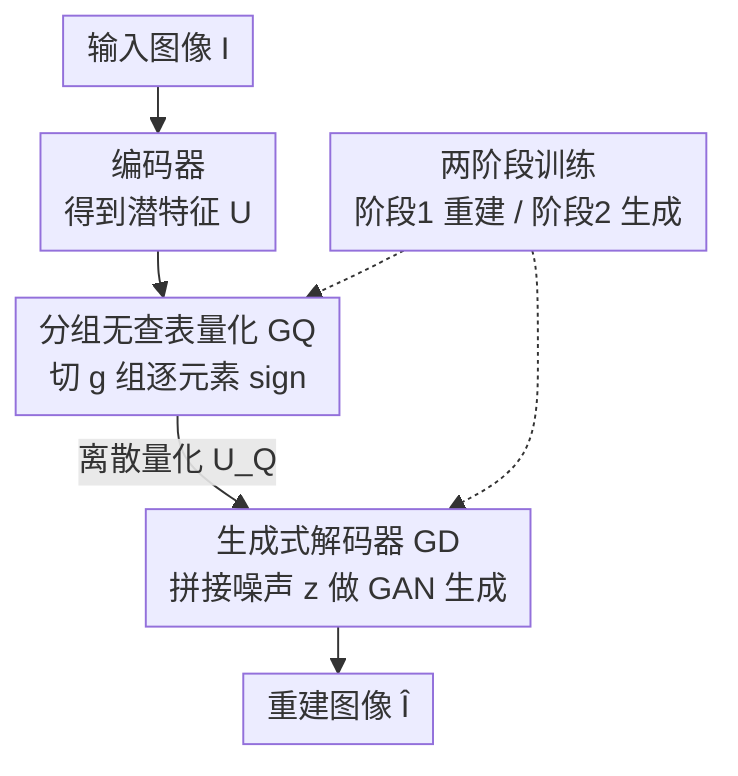

# WeTok: Powerful Discrete Tokenization for High-Fidelity Visual Reconstruction

**会议**: ICLR 2026  
**论文**: [OpenReview](https://openreview.net/forum?id=wetok)（⚠️ 链接以原文为准）  
**代码**: https://github.com/zhuangshaobin/WeTok  
**领域**: 扩散模型 / 图像生成 / 视觉 tokenizer  
**关键词**: 离散视觉 tokenizer, 无查表量化, 分组量化, 生成式解码器, 高保真重建

## 一句话总结
WeTok 是一个离散视觉 tokenizer，用「分组无查表量化（GQ）」把超大码本切成多个小组分别量化、绕开熵损失的显存爆炸，再用「生成式解码器（GD）」把解码器从确定性回归改成以噪声为条件的 GAN 生成，从而在高压缩比下也能重建细节——在 ImageNet 50k 上以 400% 压缩比拿到 zero-shot rFID 0.12，反超连续 tokenizer FLUX-VAE（0.18）和 SD-VAE 3.5（0.19）。

## 研究背景与动机
**领域现状**：视觉生成里，直接在像素空间建模代价极高，主流做法是先用 tokenizer 把图像压成紧凑潜在表示、再在潜空间里跑生成模型。tokenizer 分两类：连续型（VAE，映射到连续潜空间）和离散型（VQ/LFQ，用量化器产生有限的离散码）。离散 tokenizer 压缩比更高、天然适配自回归/MaskGIT 这类离散生成范式。

**现有痛点**：离散 tokenizer 有两个老大难。其一是**码本扩展受限**——要降低量化误差就得把码本做大，MAGVIT-v2 的无查表量化（LFQ）直接对潜特征逐通道取符号、隐式得到 $2^d$ 大小的码本，但它依赖熵损失（entropy loss）保证码本利用率，而熵计算的显存随码本维度 $d$ 指数增长，$d$ 一大就 OOM，没法继续 scale。BSQ 试图把各 bit 拆开独立处理来省显存，但这个独立性假设引入了近似误差，性能反而下降。其二是**确定性建模**——离散解码器本质是确定性的，训练时只学着把潜码映射到图像的「期望值」（所有可能图像的平均），在高压缩比下一个离散 token 可能对应多张合理图像（不同毛发纹理、不同叶片花纹），解码器只能输出模糊的「平均脸」，细节丢失。

**核心矛盾**：压缩比和重建保真度之间的 trade-off——离散方法压得狠但重建糊，连续方法重建好但压不动；而扩大码本提保真又会撞上显存墙。

**本文目标**：造一个既能保持高压缩、又能高保真重建的离散 tokenizer，具体拆成两个子问题：(1) 如何在不爆显存的前提下把码本无限扩展；(2) 如何让确定性解码器具备建模数据分布、采样细节的能力。

**切入角度**：作者发现 LFQ 与 BSQ 其实是「分组」的两个极端——LFQ 是「1 个大组」（$g{=}1$）、BSQ 是「$d$ 个 1 维小组」（$g{=}d$），那么在两者之间取一个合适的分组数 $g$，就能既切碎熵计算的显存、又不引入 BSQ 那么大的近似误差。

**核心 idea**：用「分组无查表量化」统一并超越 LFQ/BSQ 解决码本扩展，用「以高斯噪声为条件的生成式解码器」把重建从回归期望改成采样分布，两招合起来在高压缩下做高保真离散重建。

## 方法详解

### 整体框架
WeTok 沿用 Open-MAGVIT2 的 CNN 编码器/解码器/判别器骨架。输入图像 $I\in\mathbb{R}^{H\times W\times3}$ 先经编码器压成潜特征 $U$；GQ 把 $U$ 沿通道切成 $g$ 组、每组用固定码本 $\{-1,1\}^{d'}$ 做无查表量化（逐元素取符号），得到离散量化结果 $U_Q$；解码阶段，GD 把一个高斯噪声 $z\sim\mathcal{N}(0,I)$ 沿通道与 $U_Q$ 拼接后送进解码器，以 GAN 方式从「噪声 + 条件」生成图像 $\hat I$。训练分两阶段：先用重建损失（含分组化的 token/codebook 熵损失）把 GQ + 重建解码器练好，再切到第二阶段把解码器扩通道、接入噪声 $z$ 做生成式微调。

### 关键设计

**1. 分组无查表量化（GQ）：在 LFQ 和 BSQ 之间找显存与误差的甜点**

针对「LFQ 熵损失显存随码本指数爆炸、BSQ 拆 bit 又引入近似误差」这个痛点，GQ 把潜特征 $U$ 沿通道维 reshape 成 $U_G\in\mathbb{R}^{h\times w\times g\times d'}$（$d=g\,d'$，$g$ 是组数、$d'$ 是每组通道数），第 $k$ 组配一个不可学习的固定码本 $C_{GQ,k}=\{-1,1\}^{d'}$，逐组做 LFQ。关键在于条件概率可分解为各组乘积 $q(c\mid U[i,j])=\prod_{k=1}^{g} q_G(c_k\mid U_G[i,j,k])$。利用熵的可加性，token 熵损失就从 $\{-1,1\}^d$ 整空间改写成 $g$ 个 $\{-1,1\}^{d'}$ 子空间之和：

$$L_{\text{Token Entropy}}=\frac{1}{hw}\sum_{i,j}\sum_{k=1}^{g} H\big(q_G(c_k\mid U_G[i,j,k])\big),$$

这一步直接消掉了熵计算的显存瓶颈。码本熵损失里因为有 $H(\sum\cdot)$ 没法直接拆，作者引入一个近似假设 $\sum_{i,j}\prod_k q_G \approx \prod_k \sum_{i,j} q_G$，从而也把它转成分组求和形式。$g$ 成了一个可调旋钮：$g$ 越大近似越接近 BSQ（误差大但更省）、$g$ 越小越接近 LFQ（精确但显存高）。论文给出 Proposition 3.1：**对任意分组 $G$，GQ 的码本熵近似误差严格小于 BSQ**（证明用了抽象代数里的序理论，⚠️ 细节以原文 Sup. A 为准）。所以 GQ 既享受 BSQ 的显存友好、又把误差压得比 BSQ 小，且 $g$ 可调让码本能近乎无限扩展。

**2. 生成式解码器（GD）：把解码从「回归期望」改成「采样分布」**

针对「确定性解码器在高压缩下只能输出模糊平均」的痛点，GD 的做法是给解码器额外喂一个高斯噪声变量。原本 GAN 损失只是 $L_{GAN}(U_Q)=\log(1-D(G(U_Q)))$、仅用于提感知质量；GD 改成

$$L_{GAN}(U_Q)=\mathbb{E}_{z\sim\mathcal{N}(0,I)}\big[\log(1-D(G(z,U_Q)))\big],$$

其中 $U_Q$ 当条件、$z$ 当随机源。关键不是简单地把 $z$ 拼进输入，而是**解码器的语义变了**：它不再学一个 $U_Q\to$ 图像的一对一映射，而是建模「以 $U_Q$ 为条件、从高斯噪声到真实图像分布」的条件生成。当一个高度压缩的离散 token 对应多张合理图像时，$z$ 让解码器从这个分布里采样出一个具体、连贯、带高频细节的实例（比如某种具体的毛发纹理），而不是把它们全平均成糊图。相比扩散式解码器（DiTo、ε-VAE 那一类给连续 tokenizer 加扩散），WeTok 是**首个给离散 tokenizer 引入生成式解码器**的工作，且基于 GAN 只需单步采样，比扩散更高效。

**3. 两阶段训练：让生成式微调稳定起步**

GAN 式生成训练在离散 tokenizer 上容易因为停止梯度估计（stop-gradient）而不稳。作者用两阶段策略化解：第一阶段只用重建损失（含 GQ 的分组 token/codebook 熵损失）把模型练到重建饱和；第二阶段切到生成任务时，把解码器输入卷积层 `conv_in` 的通道维扩展、对**新增通道做零初始化**来接收 $z$。零初始化保证第二阶段一开始解码器行为与预训练状态完全一致，从而平滑过渡、不破坏已学好的重建能力，再逐步把生成能力训出来。

### 损失函数 / 训练策略
总损失继承 VQVAE 五项框架：重建损失 $\|I-\hat I\|^2$、码本损失、commitment 损失（LFQ 下被熵损失替代）、感知损失 LPIPS、GAN 损失，其中熵损失换成 GQ 的分组化 token 熵损失（Eq. 6）+ 分组化码本熵损失（Eq. 8）。训练用 Adam，消融统一训 250K 步、图像随机裁到 256×256；大规模训练对每个模型单独调参。一个反直觉的发现是：离散 tokenizer 训练用**恒定学习率**明显优于业界惯用的 warm-up + cosine decay。

## 实验关键数据

### 主实验
ImageNet 50k 验证集 zero-shot 重建（核心卖点，⚠️ 不同设定下数字略有出入，以原文为准）：

| 设定 | 指标 | WeTok | 对比方法 | 说明 |
|------|------|-------|----------|------|
| 高保真 / 400% 压缩比 | rFID ↓ | **0.12** | FLUX-VAE 0.18 / SD-VAE 3.5 0.19 | 离散反超连续 tokenizer |
| 高压缩 / 768× 压缩比 | rFID ↓ | **3.49**（intro 处作 3.59）| Cosmos 4.57（仅 384×，压缩比为 WeTok 一半） | 压缩比翻倍仍更优 |

ImageNet 256×256（下采样率 16，码本约 $2^{18}$）SOTA 对比：

| Method | Codebook | rFID ↓ | PSNR ↑ | Usage |
|--------|----------|--------|--------|-------|
| Open-MAGVIT2 | $2^{18}$ | 1.17 | 22.64 | 100% |
| MGVQ | $2^{18}$ | 0.64 | 23.71 | 100% |
| **WeTok (Ours)** | $2^{18}$ | **0.61** | **24.50** | 100% |

### 消融实验

| 配置 | 关键指标 | 说明 |
|------|---------|------|
| 量化方式 GQ ($g{=}2,d'{=}8$) | rFID 最优 | 同压缩比下优于 LFQ ($g{=}1$)、远超 BSQ ($g{=}16$) |
| 显存：LFQ @ $d{=}24$ | OOM | LFQ 在 $d\ge24$ 直接爆显存 |
| 显存：GQ @ $d{=}40$ | 10.6 GB | GQ/BSQ 显存随 $d$ 几乎不涨 |
| 仅阶段1（无 GD） | rFID 5.37 | 确定性解码 |
| 阶段1 + 阶段2（有 GD） | rFID 3.90 | 加 GD 后 rFID 大幅下降 |
| 架构 C=256, B=4 | 重建最佳 | 9 组配置里最优（编/解码器 198M / 261M 参数） |

### 关键发现
- **GQ 同时解决显存和误差**：表 1 显示 LFQ 在 $d{=}24$ 起就 OOM，而 GQ 把显存稳在 ~10.6 GB；图 3 显示同压缩比下 GQ > LFQ ≫ BSQ，证明「分组」既省显存又比 BSQ 误差小，理论上有 Prop. 3.1 兜底。
- **组数 $g$ 越大重建越好**：按 2 的幂增大 $g$，重建性能持续显著提升且不撞 LFQ 那样的显存墙——这是 GQ 能无限 scale 码本的实证。
- **GD 主要提 rFID**：表 2 中加 GD 后 rFID 从 5.37→3.90，LPIPS/SSIM/PSNR 改善较小，说明 GD 的增益主要在「分布真实感」而非逐像素重建，定性图（Fig. 7）也显示纹理更自然不糊。
- **训练数据 trade-off**：400M 通用域数据训出的模型在 PSNR/SSIM/泛化更好，但在 rFID/LPIPS 这类分布拟合指标上不如 in-distribution 的 ImageNet——通用化与分布内指标存在权衡。
- **恒定学习率优于 warm-up+cosine**：离散 tokenizer 训练上这个反惯例的发现被采纳为后续大规模训练默认配置。

## 亮点与洞察
- **把 LFQ/BSQ 统一进一个参数 $g$**：作者敏锐地看出 LFQ（$g{=}1$）和 BSQ（$g{=}d$）只是分组数的两端，中间地带就是性能-显存的甜点区，还配了序理论证明误差严格优于 BSQ——这种「把两个已有方法看成同一谱系的特例」的视角非常可复用。
- **零初始化扩通道接噪声**：第二阶段给 `conv_in` 新通道做零初始化、保证起步行为不变，是把生成能力「无痛接到」已训好重建模型上的关键工程 trick，可迁移到任何「给已训模型增加输入分支」的场景。
- **离散 tokenizer 也能上生成式解码器**：以往生成式/扩散解码器都用在连续 tokenizer 上，WeTok 把它搬到离散侧并用 GAN 实现单步采样，绕开扩散的多步成本，思路上打通了「离散压缩 + 生成式重建」。

## 局限与展望
- **码本熵损失的近似假设**：Eq. 7 的分解依赖 $\sum\prod\approx\prod\sum$ 这一近似，虽然论文证明误差小于 BSQ，但仍是近似、$g$ 增大时近似误差会变大，存在精度-显存权衡的上界。
- **GAN 训练的固有不稳**：尽管两阶段 + 零初始化缓解了不稳，GAN 式生成解码器相比纯回归仍更难调、对超参更敏感（大规模训练需逐模型单独调参，复现成本高）。
- **核心数字轻微不一致**：abstract 与 intro 中高压缩 rFID 分别记作 3.49 / 3.59，建议以官方代码/表格为准（⚠️ 以原文为准）。
- **下游生成验证有限**：正文主打重建指标 + AR class-to-image 参数消融，端到端生成质量（如 gFID）展开较少，tokenizer 换成 WeTok 对生成模型最终效果的提升幅度还需更多下游实验。

## 相关工作与启发
- **vs LFQ（MAGVIT-v2）**：LFQ 用隐式固定码本做无查表量化、靠熵损失保利用率，但熵计算显存随码本指数增长无法 scale；WeTok 把它当作 $g{=}1$ 的特例，通过分组切碎熵计算，既保留无查表的高效又解锁码本扩展。
- **vs BSQ**：BSQ 拆 bit 独立处理省显存但近似误差大、性能掉；WeTok 把它当作 $g{=}d$ 的特例，用更粗的分组在显存与误差间取更优点，并证明误差严格更小。
- **vs 扩散解码器（DiTo / ε-VAE / consistency decoder）**：它们把扩散塞进连续 tokenizer 的解码器；WeTok 首个给**离散** tokenizer 引入生成式解码器，且用 GAN 实现单步采样，比扩散多步更高效。
- **vs 连续 tokenizer（FLUX-VAE / SD-VAE 3.5）**：连续方法重建强但压缩比受限；WeTok 证明离散方法在 400% 压缩比下 rFID 反超它们，挑战了「离散一定比连续糊」的固有印象。

## 评分
- 新颖性: ⭐⭐⭐⭐⭐ 把 LFQ/BSQ 统一进分组谱系 + 首个离散生成式解码器，两个角度都很巧
- 实验充分度: ⭐⭐⭐⭐ 重建对比和消融很扎实，下游生成质量验证略薄
- 写作质量: ⭐⭐⭐⭐ 动机清晰、公式完整；个别核心数字前后不一致
- 价值: ⭐⭐⭐⭐⭐ 离散 tokenizer 重建反超连续，对视觉生成 pipeline 有实际意义

<!-- RELATED:START -->

## 相关论文

- [\[ICLR 2026\] GarmentGPT: Compositional Garment Pattern Generation via Discrete Latent Tokenization](garmentgpt_compositional_garment_pattern_generation_via_discrete_latent_tokeniza.md)
- [\[ICLR 2026\] ReDDiT: Rehashing Noise for Discrete Visual Generation](reddit_rehashing_noise_for_discrete_visual_generation.md)
- [\[CVPR 2026\] Spk2VidNet: A Hierarchical Recurrent Architecture for High-Fidelity Video Reconstruction from Long Spike-Camera Streams](../../CVPR2026/image_generation/spk2vidnet_a_hierarchical_recurrent_architecture_for_high-fidelity_video_reconstr.md)
- [\[ICLR 2026\] EditScore: Unlocking Online RL for Image Editing via High-Fidelity Reward Modeling](editscore_unlocking_online_rl_for_image_editing_via_high-fidelity_reward_modelin.md)
- [\[CVPR 2026\] Spherical Leech Quantization for Visual Tokenization and Generation](../../CVPR2026/image_generation/spherical_leech_quantization_for_visual_tokenization_and_generation.md)

<!-- RELATED:END -->
