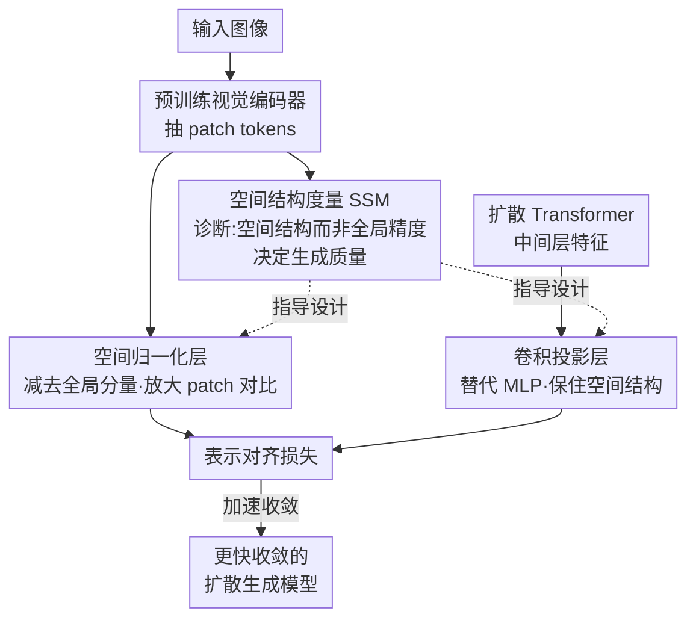

# What Matters for Representation Alignment: Global Information or Spatial Structure?

**会议**: ICLR 2026  
**OpenReview**: [https://openreview.net/forum?id=y0UxFtXqXf](https://openreview.net/forum?id=y0UxFtXqXf)  
**论文**: [Project Page](https://end2end-diffusion.github.io/irepa)  
**代码**: 见项目页 (有)  
**领域**: 扩散模型 / 表示对齐 / 生成模型训练加速  
**关键词**: 表示对齐(REPA), 扩散 Transformer, 空间结构, 收敛加速, 视觉编码器

## 一句话总结
本文系统证明：表示对齐(REPA)能加速扩散模型训练，靠的**不是**目标表示的全局语义信息(ImageNet 线性探针精度)，而是其 **patch token 之间的空间自相似结构**；据此提出仅 4 行代码的 iREPA（卷积投影 + 空间归一化），在 27 个编码器、多种模型尺寸和训练配方上一致加速 REPA 收敛。

## 研究背景与动机
**领域现状**：表示对齐(Representation Alignment, REPA)已成为加速扩散 Transformer 训练的主流手段——把扩散模型中间层特征与一个预训练视觉编码器（DINOv2 等）的 patch token 特征对齐，就能显著加快收敛、提升最终生成质量。

**现有痛点**：尽管经验上有效，社区对"为什么有效"几乎没有机制层面的理解。流行的共识（源自 REPA 原文）是：**编码器的全局语义越强（线性探针 ImageNet 精度越高），作为目标表示就越好**——于是人们习惯用线性探针精度来挑选编码器、并把扩散特征探针精度的上升当作对齐有效的证据。

**核心矛盾**：这个共识到底对不对？全局语义信息和空间结构，哪一个才是真正驱动生成性能的因素？这直接决定了我们该如何挑选最优目标表示。

**切入角度**：作者注意到一批反例——空间微调的小模型 PE-Spatial-B（精度仅 53.1%）作为 REPA 目标，生成 FID 反而优于精度 82.8% 的 PE-Core-G；连几乎没有全局信息的 SAM2-S（精度 24.1%）都能打败精度高 60 个点的编码器。这些"无法解释"的现象暗示：真正起作用的可能是另一个维度——**空间结构**。

**核心 idea**：用"patch token 之间的空间自相似结构"取代"全局语义精度"作为衡量目标表示好坏的标尺；并据此设计两处极简改动，刻意**放大**空间信息从教师编码器到扩散模型的传递，从而加速 REPA。

## 方法详解

### 整体框架
本文是一篇"先证伪共识、再据此改方法"的工作，方法部分由两块构成。**第一块是诊断**：定义一个能快速计算的空间结构度量(Spatial Structure Metric, SSM)，在 27 个视觉编码器、3 种 SiT 尺寸上做大规模相关性分析，证明 SSM 与生成 FID 的相关性（Pearson |r|>0.85）远高于线性探针精度（|r|=0.26），并用它反过来解释第 2 节那些"无法解释"的反例。**第二块是改进**：既然空间结构才是关键，就在原始 REPA 训练配方上做两处针对性改动——把会损失空间信息的 MLP 投影层换成卷积投影层，再给目标表示加一层空间归一化以放大 patch 之间的对比度——合称 iREPA。

整条 pipeline 是：视觉编码器抽取 patch token → 经空间归一化层放大空间对比 → 作为对齐目标；扩散 Transformer 的中间特征经卷积投影层映射到目标维度 → 与归一化后的目标特征做对齐损失。SSM 既是挑选/解释编码器的诊断指标，也是 iREPA 两处改动的设计依据。

### 关键设计

**1. 空间结构度量 SSM：用 patch 间空间自相似取代全局精度当标尺**

痛点是社区一直用线性探针精度衡量目标表示，但它和生成 FID 几乎不相关。作者改用图像内部的**空间自相似结构**：给定编码器输出的 patch 表示 $X = E(I) \in \mathbb{R}^{T\times D}$（共 $T=H\times W$ 个 patch），用余弦核度量两两 patch 的外观相似度 $K_X(t,t') = \frac{\langle x_t, x_{t'}\rangle}{\|x_t\|\,\|x_{t'}\|}$，再看相似度如何随 patch 的空间(曼哈顿)距离 $d$ 变化。默认指标是局部-远距对比(LDS)：

$$\mathrm{LDS}(X,P) = \mathbb{E}_{d(t,t')\in(0,r_{near})} K_X(t,t') - \mathbb{E}_{d(t,t')\ge r_{far}} K_X(t,t').$$

直觉是：好的空间结构应满足"近处 patch 比远处 patch 更相似"，LDS 越大说明空间组织越强（取 $r_{near}=r_{far}=H/2$，对具体取值不敏感；附录另给 CDS/SRSS/RMSC 等等价指标）。在 27 个编码器上做相关分析，所有 SSM 指标与 gFID 的相关性 |r|>0.85（LDS 0.852、SRSS 0.885、RMSC 0.888），而线性探针精度仅 0.26。SSM 还能解释此前的反例：SAM2/PE-Spatial-B 虽全局精度低，但空间结构强；同族大模型(PE-G、C-RADIO 大号)精度更高却空间结构更差；把 CLS token 按 $p^{new}_i = p_i + \alpha\cdot c$ 混进 patch（$\alpha\!:\!0\to0.5$）虽让探针精度从 70.7% 升到 78.5%，却破坏空间对比、FID 从 19.2 恶化到 25.4。**结论：空间结构才是预测生成性能的真信号**。

**2. 卷积投影层：替掉会抹平空间结构的 MLP**

原始 REPA 用一个 3 层 MLP 把扩散特征维度映射到目标表示维度。但作者观察到这个逐 token 的 MLP 投影是有损的——它在通道上做变换、不感知空间网格，会削弱 patch 之间的空间对比(图 6a)。既然空间结构才是关键，就把 MLP 换成一个轻量卷积层（kernel size 3, padding 1, `nn.Conv2d`），让投影直接作用在空间网格上。卷积自带的局部归纳偏置天然保留邻近 patch 的空间关系，使空间信息在"扩散特征→目标维度"的映射中不被抹平，从而把更干净的空间信号喂给对齐损失。

**3. 空间归一化层：牺牲全局分量、放大 patch 间对比度**

预训练编码器的 patch token 往往含有一个很强的**全局分量**（patch 均值本身线性探针精度就很高），它让本不相关的 token（如前景物体 vs 背景）也呈现较高余弦相似度，压低了空间对比。基于第一块的诊断结论——全局信息对生成帮助不大、空间对比才重要——作者主动**牺牲这个全局分量来换空间对比**，在目标表示的 patch token 上加一层空间归一化(类似 instance norm，沿空间维统计)：

$$y = \frac{x - \gamma\,\mathbb{E}[x]}{\sqrt{\mathrm{Var}[x] + \epsilon}},$$

其中 $x\in\mathbb{R}^{B\times T\times D}$，均值/方差沿空间维 $T$ 计算，$\epsilon=10^{-6}$。减去 $\gamma$ 倍的空间均值就是在剥离全局分量，除以空间标准差则放大 patch 之间的相对差异。这样归一化后的目标特征空间对比更强，对齐时给扩散模型更清晰的"哪些 patch 该像、哪些不该像"的空间监督。两处改动加起来不到 4 行代码，合称 iREPA。

### 损失函数 / 训练策略
对齐损失沿用 REPA 的逐 patch 余弦相似度对齐（扩散中间特征经卷积投影后，与空间归一化后的编码器 patch token 对齐），不引入新损失项；改动只在投影层结构和目标特征预处理。实验在 ImageNet 256×256 上、以 SiT-XL/2 为主、100K/400K 步评测，编码器默认 DINOv2；iREPA 可直接插到 REPA、REPA-E、MeanFlow w/ REPA、JiT w/ REPA 等多种配方上。

## 实验关键数据

### 主实验
不同编码器下 iREPA 一致加速收敛（SiT-XL/2，100K 步，无 CFG）：

| 编码器 | 方法 | FID↓ | IS↑ | sFID↓ |
|--------|------|------|-----|-------|
| DINOv2-B | REPA | 19.06 | 70.3 | 5.83 |
| DINOv2-B | iREPA | **16.96** | 77.9 | 6.26 |
| DINOv3-B | REPA | 21.47 | 63.4 | 6.19 |
| DINOv3-B | iREPA | **16.26** | 78.8 | 6.14 |
| WebSSL-1B | REPA | 26.10 | 53.0 | 6.90 |
| WebSSL-1B | iREPA | **16.66** | 77.5 | 6.18 |
| PE-Core-G | REPA | 32.35 | 42.7 | 6.70 |
| PE-Core-G | iREPA | **18.19** | 75.0 | 6.03 |

跨编码器尺寸 / 模型尺寸的可扩展性（DINOv2，SiT-XL/2，100K）：

| 维度 | 配置 | REPA FID | +iREPA FID | 相对提升 |
|------|------|----------|-----------|---------|
| 编码器尺寸 | PE-B (90M) | 22.5 | 17.5 | 22.2% |
| 编码器尺寸 | PE-L (320M) | 28.7 | 17.6 | 38.8% |
| 编码器尺寸 | PE-G (1.88B) | 32.3 | 19.5 | 39.6% |
| 模型尺寸 | SiT-B | 49.50 | 43.37 | — |
| 模型尺寸 | SiT-L | 24.10 | 20.28 | — |
| 模型尺寸 | SiT-XL | 19.06 | 16.96 | — |

### 消融实验
两处改动的拆解（SiT-XL/2，100K，FID↓）：

| 配置 | DINOv2-B | DINOv3-B | WebSSL-1B | PE-Core-G |
|------|----------|----------|-----------|-----------|
| Baseline REPA | 19.06 | 21.47 | 26.10 | 32.35 |
| iREPA (w/o 空间归一化) | 18.52 | 17.76 | 21.17 | 24.97 |
| iREPA (w/o 卷积投影) | 17.66 | 18.28 | 18.44 | 21.72 |
| iREPA (full) | **16.96** | **16.26** | **16.66** | **18.19** |

跨训练配方（REPA-E，SiT-XL/2，FID↓）：

| 编码器 | REPA-E | +iREPA-E |
|--------|--------|----------|
| WebSSL-1B | 26.5 | **13.2** |
| PE-G | 25.9 | **16.4** |
| DINOv3-B | 14.4 | **11.7** |
| DINOv2-B | 12.9 | **12.1** |

### 关键发现
- **空间结构是真信号**：27 个编码器上 SSM 与 gFID 相关 |r|>0.85，线性探针仅 0.26；这个结论跨 SiT-B/L/XL 三种尺寸都成立（SSM |r|>0.826，探针 |r|<0.306）。
- **两处改动单独都有效、合起来最好**：去掉任一处都掉点，full iREPA 在所有编码器上 FID 最低；越是"全局强、空间弱"的编码器（如 PE-G、WebSSL-1B）受益越大（PE-G 从 32.3→18.2）。
- **编码器越大、模型越大，iREPA 相对增益越大**（PE-B 22.2% → PE-G 39.6%），说明放大空间结构的收益可随规模扩展。
- **反共识证据**：连 SIFT/HOG/VGG 中间层这类经典空间特征都能给 REPA 带来可观增益，说明对齐受益于空间特征本身、不依赖额外全局信息。

## 亮点与洞察
- **"换标尺"是全文最大价值**：把社区默认的"线性探针精度"标尺换成"空间自相似结构"，一举解释了 SAM2、空间微调小模型、同族大模型反而更差、CLS 混入伤生成等一连串孤立反例——一个度量统一了所有异常。
- **诊断直接导出疗法**：SSM 不只是分析工具，它精准指出"全局分量压低空间对比""MLP 抹平空间网格"两个病灶，于是空间归一化和卷积投影是顺理成章的对症下药，而非拍脑袋的 trick。
- **极简到 <4 行代码**：一个 `Conv2d` 加两行减均值除标准差，就能即插即用到 REPA / REPA-E / MeanFlow / JiT 等多种配方，迁移成本极低，适合作为表示对齐的默认配置。
- **可迁移思路**："挑教师表示时别只看分类精度，要看 patch 间空间结构"对视频生成、3D 生成等同样用 REPA 的任务都有借鉴意义。

## 局限与展望
- **聚焦收敛速度**：实验主要展示更快收敛（同步数下 FID 更低），对最终极限性能、超长训练后的天花板讨论相对较少。
- **度量与超参**：LDS 等 SSM 指标依赖 $r_{near}/r_{far}$ 等设定（作者称鲁棒），空间归一化里 $\gamma$ 的取值如何影响"牺牲多少全局信息"也值得更细的敏感性分析。
- **任务范围**：验证集中在 ImageNet 256×256 的类条件生成，对文本到图像、视频/3D 等更复杂条件生成是否同样成立仍待验证。
- **机制理解仍是相关性**：SSM 与 FID 强相关是经验证据，"空间结构为何在因果上决定生成"还缺更深的理论刻画。

## 相关工作与启发
- **vs REPA (Yu et al., 2024)**：REPA 提出对齐范式并主张"全局语义/线性探针越强越好"；本文直接证伪这一共识，指出空间结构才是驱动因素，并给出针对空间结构的改进 iREPA，可叠加在 REPA 上。
- **vs REPA-E / MeanFlow / JiT w/ REPA**：这些是不同训练配方/扩散范式；本文不与它们竞争，而是作为通用增益插件叠加，在每一种配方上都带来一致提升。
- **vs PE / DINOv3 等空间微调编码器工作**：它们发现持续训练会让 CLS 与 patch 趋同、损害密集任务性能，并专门训练空间微调模型；本文把"空间 vs 全局权衡"这一观察延伸到**生成**场景，论证空间结构对生成更重要，为如何挑选/训练生成用目标表示提供了新准则。

## 评分
- 新颖性: ⭐⭐⭐⭐⭐ 直接挑战并证伪领域内的主流共识，提出可量化的新标尺
- 实验充分度: ⭐⭐⭐⭐⭐ 27 编码器 × 3 尺寸 × 多配方的大规模相关分析 + 完整消融
- 写作质量: ⭐⭐⭐⭐ 论证链清晰、反例统一漂亮，部分图表细节需对照原文
- 价值: ⭐⭐⭐⭐⭐ 改变挑选目标表示的方法论，且 <4 行代码即插即用

<!-- RELATED:START -->

## 相关论文

- [\[ICLR 2026\] Rethinking Global Text Conditioning in Diffusion Transformers](rethinking_global_text_conditioning_in_diffusion_transformers.md)
- [\[CVPR 2026\] Rethinking Glyph Spatial Information in Font Generation](../../CVPR2026/image_generation/rethinking_glyph_spatial_information_in_font_generation.md)
- [\[ICLR 2026\] SIGMA-GEN: Structure and Identity Guided Multi-Subject Assembly for Image Generation](sigma-gen_structure_and_identity_guided_multi-subject_assembly_for_image_generat.md)
- [\[CVPR 2026\] Seeing What Matters: Visual Preference Policy Optimization for Visual Generation](../../CVPR2026/image_generation/seeing_what_matters_visual_preference_policy_optimization_for_visual_generation.md)
- [\[ICLR 2026\] Generalization of Diffusion Models Arises with a Balanced Representation Space](generalization_of_diffusion_models_arises_with_a_balanced_representation_space.md)

<!-- RELATED:END -->
