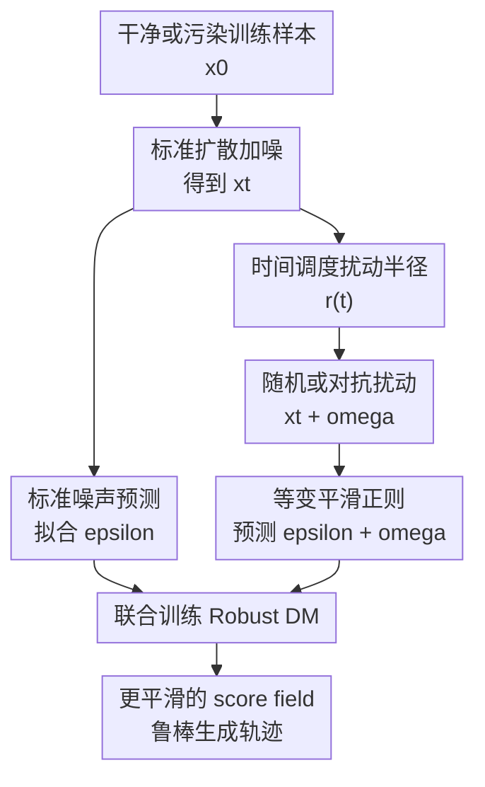

# Why Adversarially Train Diffusion Models?

**会议**: ICLR 2026  
**OpenReview**: [https://openreview.net/forum?id=lL6htAaolp](https://openreview.net/forum?id=lL6htAaolp)  
**论文**: [OpenReview](https://openreview.net/forum?id=lL6htAaolp)  
**代码**: https://github.com/OmnAI-Lab/Adversarial-Training-DM  
**领域**: 扩散模型  
**关键词**: 对抗训练, 扩散模型, 鲁棒生成, 数据污染, 等变正则  

## 一句话总结
这篇论文把分类器里的对抗训练重新改写成适合扩散模型的“等变平滑”正则，让去噪网络在训练数据高度污染或采样轨迹被攻击时仍能沿着更干净、更稳定的 score field 生成样本。

## 研究背景与动机
**领域现状**：扩散模型通常通过前向加噪、反向去噪来学习数据分布，训练目标是让网络从 $x_t$ 预测加入的噪声 $\epsilon$，再沿着反向马尔可夫链逐步回到数据流形。这个范式在干净数据上非常有效，但真实的大规模训练集往往来自网络抓取，里面可能混有轻微 inlier noise、严重 outlier、缺失/损坏样本，甚至专门构造的对抗扰动。

**现有痛点**：已有 noise-aware diffusion training 往往需要知道噪声分布、噪声方差，或者知道哪些样本是干净的、哪些样本被污染。这类假设在受控实验里合理，但在真实数据管线中很脆弱：数据集越大，越不可能逐样本标注污染类型；污染越复杂，越难提前给出精确方差。标准 DDPM 在这种情况下容易把训练集里的噪声也学进去，生成时把高斯污染、背景杂乱或离群结构一起带出来。

**核心矛盾**：分类任务里的对抗训练追求“输入变一点，输出类别不变”，也就是 invariance；扩散模型却不是分类器，而是在每个噪声时刻做回归式的去噪预测。如果直接要求 $\epsilon_\theta(x_t + \delta, t)$ 和 $\epsilon_\theta(x_t, t)$ 完全相同，模型就会忽略输入里额外多出来的扰动，反向一步落到错误位置，最终学习到偏离真实数据分布的轨迹。

**本文目标**：作者想回答一个非常直接的问题：为什么要对扩散模型做对抗训练，以及应该怎样做才不破坏生成建模本身。具体来说，论文希望扩散模型在不知道污染标签、污染强度和污染分布的情况下，仍能抵抗训练数据噪声；同时减少训练样本记忆、提高对采样过程攻击的鲁棒性，并尽量保留正常生成质量。

**切入角度**：论文从 score-based generative model 的去噪动力学出发，把 adversarial training 解释成在扩散轨迹附近增加一个“局部扰动状态”。关键观察是：扩散模型面对 $x_t + \omega$ 时不应该输出和 $x_t$ 完全一样的噪声，而应该把这份额外扰动也纳入去噪预测，使反向一步仍然回到同一条干净轨迹附近。

**核心 idea**：用“等变”替代分类对抗训练里的“不变”，在扩散训练中加入时间相关的随机/对抗扰动，并约束 $\epsilon_\theta(x_t+\omega,t)$ 接近 $\epsilon_\theta(x_t,t)+\omega$，从而平滑 score field、削弱污染样本对生成轨迹的牵引。

## 方法详解

### 整体框架
本文的方法不是换掉 DDPM 架构，也不是额外训练一个去噪器，而是在常规扩散训练的每个 timestep 上构造一个邻域扰动版的 noisy sample。标准分支仍然用 $x_t$ 拟合原始噪声 $\epsilon$；鲁棒分支则把 $x_t$ 推到 $x_t+\omega$，并要求模型预测结果随扰动等变地移动，这样反向去噪时不会因为局部噪声或攻击偏离目标数据流形。

框架可以理解为：先按 DDPM 正常采样 $x_0, \epsilon, t$ 得到 $x_t$，再根据 timestep 计算一个合适的扰动半径 $r_\theta(t)$，在这个半径里生成随机扰动或 adversarial perturbation，最后把普通去噪损失和等变平滑正则合在一起训练。

这张图里真正的贡献节点是“时间调度扰动半径”“随机或对抗扰动”和“等变平滑正则”。标准扩散加噪与普通噪声预测只是 DDPM 的脚手架，但它们解释了新正则挂在训练流程的哪个位置。

### 关键设计
**1. 等变正则：扩散模型不能照搬分类器的不变性**

分类器面对一张图像和它的微小对抗扰动时，理想输出仍是同一个类别；所以标准 AT 会压低 $f_\theta(x+\delta)-f_\theta(x)$。如果把这个思想直接搬到扩散模型，就得到类似 $\|\epsilon_\theta(x_t+\omega,t)-\epsilon_\theta(x_t,t)\|_2^2$ 的 invariance loss。论文用 3D 合成数据和 CIFAR-10 说明，这个目标会让扩散模型错误地忽略输入状态的真实移动，轨迹可能发散，生成分布也会偏离 $p_{data}$。

作者的修正是把“输出不变”改成“输出按扰动一起变”。对于 epsilon-prediction 的 DDPM，$x_t$ 本身由 $x_0$ 和噪声 $\epsilon$ 组成；如果额外给噪声分量加上 $\omega$，那么模型在 $x_t+\omega$ 上应该预测 $\epsilon+\omega$，而不是仍然预测 $\epsilon$。完整训练目标写成：

$$
L_{AT}=\|\epsilon_\theta(x_t,t)-\epsilon\|_2^2+\lambda_t\|\epsilon_\theta(x_t+\omega,t)-[\epsilon_\theta(x_t,t)+\omega]\|_2^2.
$$

第一项保证模型仍然学习数据分布，第二项让同一 timestep 附近的 score field 变得局部一致。这样做的直觉很清楚：如果轨迹被推开一点，模型不是装作没看见，而是学会把这一步额外偏移也“扣回来”。这正是生成式去噪任务和判别式分类任务的根本差别。

**2. 时间调度扰动半径：扰动必须服从扩散过程的噪声尺度**

扩散训练本身已经在不断加噪，如果再无脑叠加对抗扰动，很容易破坏马尔可夫链的高斯假设，尤其在内容逐渐显现的阶段造成过度平滑或 mode merging。论文因此没有使用固定扰动半径，而是把扰动范数绑定到 timestep：

$$
x_{t+\omega}=\sqrt{\bar{\alpha}_t}x_0+\sqrt{1-\bar{\alpha}_t}(\epsilon+\omega),
$$

其中 $\omega$ 被限制在 $[-r_\theta(t), r_\theta(t)]$ 内，半径大致随 $\sqrt{1-\bar{\alpha}_t}$ 变化，并通过指数参数控制曲线形状。直观上，早期高噪声阶段可以允许更大扰动，因为样本本来就接近噪声；靠近 $t=0$ 时，内容结构已经成形，扰动必须收小，否则模型会把真实细节也当作噪声抹掉。

作者还加入一个随机 bias 项，让正则在低噪声阶段不会完全退火为零。这一点很重要：如果 $t\to0$ 时正则太弱，模型可能仍然在近数据流形处对小扰动敏感；如果正则太强，又会牺牲细节。实验里的超参数选择体现了这个 trade-off：$\lambda=0.3$ 往往能带来明显去噪，升到 $0.5$ 可能过度平滑，太低则去噪不足。

**3. 随机扰动与对抗扰动：同一个正则可退化成 randomized smoothing 或 AT**

论文提供两种扰动来源。第一种是随机扰动 $\omega_{ran}$，直接从半径受限的均匀分布采样，作用类似 randomized smoothing；它训练开销较小，但扰动方向未必击中模型最敏感的局部方向。第二种是对抗扰动 $\omega_{adv}$，先随机初始化，再用一次 FGSM 步骤最大化模型在 $x_t$ 和 $x_t+\omega$ 上的预测差异，最后投影回半径球内：

$$
J_\theta(x_t,\omega,t)=\|\epsilon_\theta(x_t+\omega,t)-\epsilon_\theta(x_t,t)\|_2^2.
$$

对抗版本更贵，因为它需要额外反传来找扰动方向，并且训练中还要多算一条正则分支。论文报告 Robustadv 的训练复杂度约为标准 DDPM 的 $2.5\times$，而 Robustran 更便宜。不过从 CIFAR-10 噪声实验看，对抗扰动的去噪效果明显更强：随机版已经好于 baseline，但 adversarial 版能把 FID 从数十甚至上百的退化区间拉回更稳定的二十多。

**4. 轨迹平滑带来的副作用与收益：鲁棒性不是免费午餐**

等变正则的直接效果是让 diffusion flow 更集中、更锐利：低维可视化中，Robustadv 的轨迹更接近真实数据子空间，score field 的方向更一致；DDPM 则容易被 inlier noise 或 outlier 拉偏，甚至学出额外伪模式。这种“收紧轨迹”的收益包括训练污染数据时更少传播噪声、采样步数减少时退化更温和、面对中间 timestep 攻击时仍能维持较好 FID。

但它也会压缩数据变异性。干净数据上，Robustadv 可能生成更平滑的图像，背景杂乱和高频细节被削弱，因此 FID 反而比标准 DDPM 更差。论文把它类比为鲁棒分类中的 clean accuracy vs robust accuracy trade-off：正则强度越大，模型越善于忽略噪声，也越可能抹掉真实细节。这个副作用不是 bug，而是方法定位的一部分：它更适合存在未知污染、需要鲁棒生成或需要抗攻击的训练场景。

### 损失函数 / 训练策略
训练时重复采样 $x_0\sim D$、$\epsilon\sim\mathcal{N}(0,I)$ 和 timestep $t$，按标准 DDPM 公式得到 $x_t$。随后采样扰动半径调度中的随机变量，生成随机扰动或用 FGSM random start 生成 $\omega_{adv}$，构造 $x_{t+\omega}$。模型参数通过 $L_{AT}$ 更新，其中普通 DDPM 项拟合数据分布，正则项约束局部等变与平滑。

实验默认采用 Improved DDPM 代码库，真实数据上包括 CIFAR-10、CelebA、LSUN Bedroom 和 ImageNet。主要超参数设置为扰动曲线指数 $\rho=2$、最小 bias $8/255$、全局正则强度 $\lambda=0.3$。推理阶段不增加额外模块，也不改变采样复杂度；训练阶段 Robustadv 约有 $2.5\times$ 开销，Robustran 因不需要求 adversarial gradient 而更轻。

## 实验关键数据

### 主实验
论文的主实验围绕“未知污染训练”展开：训练集中 90% 样本被加高斯噪声，测试 FID 始终在干净数据上计算。关键点是，方法不使用 clean/noisy 标签，也不知道污染方差；这比 noise-aware 方法假设更弱。

| 数据集 | 噪声设置 | 方法 | FID↓ | IS↑ |
|--------|----------|------|------|-----|
| CIFAR-10 | clean | DDPM | 7.20 | 8.95 |
| CIFAR-10 | clean | Robustadv | 28.68 | 7.04 |
| CIFAR-10 | 90%, $\sigma=0.1$ | DDPM | 58.05 | 6.93 |
| CIFAR-10 | 90%, $\sigma=0.1$ | Robustadv | 24.70 | 7.21 |
| CIFAR-10 | 90%, $\sigma=0.2$ | DDPM | 102.68 | 4.19 |
| CIFAR-10 | 90%, $\sigma=0.2$ | Robustadv | 24.81 | 7.07 |
| CelebA | 90%, $\sigma=0.2$ | DDPM | 96.03 | 2.65 |
| CelebA | 90%, $\sigma=0.2$ | Robustadv | 16.53 | 2.11 |
| LSUN Bedroom | 90%, $\sigma=0.2$ | DDPM | 95.85 | 4.08 |
| LSUN Bedroom | 90%, $\sigma=0.2$ | Robustadv | 44.27 | 2.50 |

这张表最值得注意的是 clean setting：Robustadv 在干净 CIFAR-10、CelebA、LSUN Bedroom 上 FID 都会变差，说明它不是无条件提升生成质量的技巧；它的优势在训练集严重污染时才显现出来。以 CIFAR-10 为例，标准 DDPM 在 $90\%$、$\sigma=0.2$ 噪声下 FID 从 7.20 崩到 102.68，而 Robustadv 仍维持在 24.81。

| 数据集 / 设置 | Baseline FID | Robustadv FID | 变化 |
|---------------|--------------|---------------|------|
| ImageNet 64, 90%, $\sigma=0.1$ | 97.6 | 83.8 | 改善 13.8 |
| ImageNet 64, 90%, $\sigma=0.2$ | 129.4 | 80.3 | 改善 49.1 |
| CIFAR-10, DDPM 300 steps | 224.38 | 37.89 | 少步采样更稳 |
| CIFAR-10, DDPM 500 steps | 28.07 | 24.34 | Robustadv 仍略优 |

ImageNet 结果说明这个正则不只在小数据集上有效；少步采样结果则支持作者关于“平滑轨迹更能容忍离散化误差”的解释。Robustadv 用 500 steps 的 FID 甚至好于自己用 1000 steps 的 clean-setting FID，说明轨迹收紧后不一定需要完整的长采样链才能回到合理区域。

### 消融实验
| 配置 | 关键指标 | 说明 |
|------|----------|------|
| DDPM + invariance | CIFAR-10 clean FID 356.9 | 直接照搬分类 AT 会严重破坏生成分布 |
| Robustran, CIFAR-10 90%, $\sigma=0.1$ | FID 79.21 / IS 5.21 | 随机扰动有一定平滑效果，但不足以强力去噪 |
| Robustadv, CIFAR-10 90%, $\sigma=0.1$ | FID 24.70 / IS 7.21 | 对抗扰动显著更有效，但训练更慢 |
| Robustran, CIFAR-10 90%, $\sigma=0.2$ | FID 68.04 / IS 4.34 | 噪声更强时随机版仍明显退化 |
| Robustadv, CIFAR-10 90%, $\sigma=0.2$ | FID 24.81 / IS 7.07 | 对强污染保持稳定 |
| Fine-tune Robustadv, CelebA 90%, $\sigma=0.2$ | FID 25.8 / IS 2.1 | 只在后 100 epoch 加正则也能降低训练成本 |
| From-scratch Robustadv, CelebA 90%, $\sigma=0.2$ | FID 16.53 / IS 2.11 | 完整训练效果最好 |

消融里最有杀伤力的是 invariance failure：它证明“为什么要重新定义 AT”不是概念洁癖，而是生成任务的必要条件。随机/对抗扰动对比也很清楚：只做 randomized smoothing 已经能缓解污染，但 adversarial direction 才能稳定击中模型的敏感局部方向。

### 关键发现
- 等变比不变更关键。扩散模型输出的是去噪向量，不是类别标签；忽略输入扰动会让反向一步落错位置，甚至使模型学到污染分布。
- Robustadv 在污染数据上收益最大，特别是 CIFAR-10 和 CelebA 的高噪声设置；但干净数据上 FID 变差，说明它牺牲了部分高频细节和数据变异性。
- 轨迹平滑还带来两个附加收益：生成样本与训练样本的 DINOv2 相似度分布左移，近重复样本减少；少步采样和中间 timestep 攻击下 FID 退化更慢。
- 训练成本是主要代价。Robustadv 需要额外反传构造扰动，训练约为 DDPM 的 $2.5\times$；论文附录的 fine-tuning 初步实验说明，可以只在后期训练阶段引入正则来折中。

## 亮点与洞察
- 最核心的洞察是把 adversarial training 从“判别式不变性”改写成“生成式等变性”。这一步看似只是 loss 里多了一个 $+\omega$，但它把扩散模型的去噪几何讲清楚了：输入状态被推开时，预测的噪声也必须反映这份位移。
- 论文把鲁棒训练、去噪训练、抗记忆和抗采样攻击统一到了“平滑 diffusion trajectory”这一件事上。它不是分别为每个问题设计一个模块，而是通过局部 score field 正则让这些现象同时出现。
- 低维可控实验很有价值。作者没有只报 CIFAR-10 FID，而是在 3D plane、mixture of Gaussians 和 PCA butterfly 子空间里观察轨迹、score field、重建误差，这让“平滑轨迹”不是一句口号，而能被几何地检查。
- 负结果写得诚实。clean data 上 FID 下降、过强正则会 oversmooth、训练时间增加，这些都没有被藏起来；这反而让方法定位更清楚：它适合鲁棒生成和污染训练，不是通用 FID booster。
- 对后续大模型训练的启发是，扩散模型的鲁棒性可以通过训练时的局部几何约束获得，而不一定依赖推理时 purification 或后处理。如果能把这个正则迁移到 latent diffusion / EDM / fine-tuning，实际价值会更大。

## 局限与展望
- 训练开销明显增加。Robustadv 需要额外梯度计算和双分支预测，论文估计约 $2.5\times$ 训练复杂度；对大规模 text-to-image 或 video diffusion 来说，从头训练成本可能难以接受。
- 方法会牺牲部分细节。干净数据上 FID 变差、图像更平滑，说明正则会把真实高频结构和噪声一起压制。如何自适应地区分“有害污染”和“真实细节”，仍是开放问题。
- 实验主要在 DDPM / DDIM 和 U-Net 设定下展开。作者也承认未来需要迁移到 EDM、latent diffusion 和更大数据集；当前还不能直接说明 Stable Diffusion 级别模型会得到同样收益。
- 噪声设置虽然比 noise-aware 方法更弱假设，但主要仍以高斯污染和部分 outlier 为核心。真实 web-scale 数据里的水印、压缩伪影、文本图像错配、重复样本和版权近邻样本会更复杂。
- 论文展示了 $p=90\%$ 污染下的强鲁棒性，但完全污染 $p=100\%$ 仍列为未来工作。这个边界很关键，因为如果没有任何干净样本锚点，平滑正则能否恢复真实分布还不明确。

## 相关工作与启发
- **vs 标准 DDPM / Improved DDPM**: 标准方法只优化噪声预测误差，默认训练数据代表真实分布；本文在同一训练流程中加入局部等变正则，让模型不要被污染样本和轨迹扰动轻易带偏。
- **vs 分类器 Adversarial Training / TRADES**: TRADES 用分布级正则在准确率和鲁棒性之间折中，本文借鉴这个思想，但把分类不变性改成扩散去噪等变性，这是最关键的任务适配。
- **vs Ambient Diffusion / noise-aware training**: Daras 等方法需要知道污染形式、噪声方差或 clean/noisy 标识；本文不依赖这些信息，更贴近未知污染场景，但代价是可能带来过平滑和训练开销。
- **vs Consistency Models**: Consistency models 让同一轨迹上不同噪声版本映射到同一个数据点，主要服务于快速采样/蒸馏；本文关注同一 timestep 邻域内的 score 局部平滑，目标是鲁棒训练和抗污染。
- **vs Smooth Diffusion**: Smooth Diffusion 平滑 latent space，偏向插值和反演；本文平滑的是扩散轨迹和 epsilon 预测的等变响应，并系统评估了污染训练、攻击鲁棒性和更少记忆。

## 评分
- 新颖性: ⭐⭐⭐⭐⭐ 把 AT 的核心约束从 invariance 改成 diffusion-specific equivariance，问题定义和 loss 都有清晰新意。
- 实验充分度: ⭐⭐⭐⭐ 覆盖低维可控数据、CIFAR-10、CelebA、LSUN、ImageNet、少步采样、记忆和攻击，但大规模 latent diffusion 仍缺。
- 写作质量: ⭐⭐⭐⭐ 方法直觉和图示清楚，负结果也诚实；部分公式符号和表述略显拥挤，需要读者熟悉 DDPM 记号。
- 价值: ⭐⭐⭐⭐⭐ 对脏数据扩散训练、鲁棒生成、抗采样攻击和降低记忆都有启发，尤其适合作为后续 robust diffusion fine-tuning 的起点。

<!-- RELATED:START -->

## 相关论文

- [\[CVPR 2026\] The Drift Kernel: Why Diffusion Models Change Even When Told Not To](../../CVPR2026/image_generation/the_drift_kernel_why_diffusion_models_change_even_when_told_not_to.md)
- [\[NeurIPS 2025\] Why Diffusion Models Don't Memorize: The Role of Implicit Dynamical Regularization in Training](../../NeurIPS2025/image_generation/why_diffusion_models_dont_memorize_the_role_of_implicit_dynamical_regularization.md)
- [\[ICLR 2026\] D-AR: Diffusion via Autoregressive Models](d-ar_diffusion_via_autoregressive_models.md)
- [\[ICLR 2026\] Reconciling Visual Perception and Generation in Diffusion Models](reconciling_visual_perception_and_generation_in_diffusion_models.md)
- [\[ICLR 2026\] Secure Inference for Diffusion Models via Unconditional Scores](secure_inference_for_diffusion_models_via_unconditional_scores.md)

<!-- RELATED:END -->
