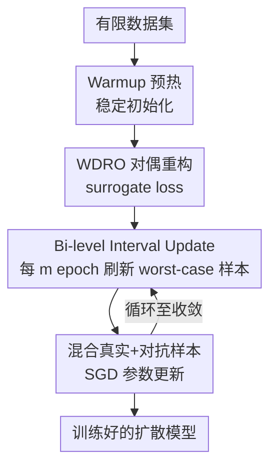

# WILD-Diffusion：一种受 WDRO 启发的有限数据扩散模型训练方法

**会议**: ICLR 2026  
**OpenReview**: [https://openreview.net/forum?id=OrCVuQAYzF](https://openreview.net/forum?id=OrCVuQAYzF)  
**代码**: 有（论文声明开源，github repo）  
**领域**: 扩散模型  
**关键词**: 有限数据生成, 扩散模型, 分布鲁棒优化, WDRO, 过拟合缓解

## 一句话总结
本文把 Wasserstein 分布鲁棒优化（WDRO）引入扩散模型训练，通过在以有限数据分布为中心的 Wasserstein 不确定集内迭代生成"最坏情况"样本来动态扩张训练支撑集，从而在仅用 20% 数据时把 FID 降低 10% 以上，并给出了带收敛保证的即插即用训练框架。

## 研究背景与动机
**领域现状**：扩散模型（DDPM、score-based SDE 等）已成为图像生成的主流，在编辑、修复、风格迁移、文生图等任务上全面超越 GAN，但这些亮眼结果都建立在"近乎无限的图像供给"之上——扩散模型需要海量数据才能稳定训练。

**现有痛点**：一旦数据稀缺，扩散模型会急剧退化。作者用实验佐证：在 FFHQ 上只用约 4%（2000 张）数据训练 vanilla DDPM，FID 会从全量的约 2.5 飙升到约 30。更关键的是，FID 曲线随训练呈"U 形"——先降后升，数据集越小，拐点越早、最终 FID 越高，这是典型的过拟合信号：模型记住了单个训练样本而非学到底层分布，导致输出近乎复制、多样性骤降。

**核心矛盾**：分类模型上成熟的两类抗过拟合手段都搬不过来。(R1) L1/L2 等正则化是为优化分类决策边界设计的，而扩散模型的目标是刻画整个数据分布，正则化帮不上忙；(R2) Cutout/Mixup/CutMix 等数据增强是静态、规则驱动的，无法自适应地约束分布偏移，甚至会把训练边缘分布推得离真实分布更远，让模型学到并复现"离群伪影"——即所谓的"增强泄漏（augmentation leakage）"。

**本文目标**：找到一种能直接作用于数据分布、自适应扩张训练支撑集、同时又不偏离真实分布的训练范式，让扩散模型在仅有数千甚至上百张图时也能学好。

**切入角度**：作者注意到 WDRO 恰好具备这种性质——它把经验风险最小化替换为在 Wasserstein 不确定集 $U_\rho(p_{\text{data}}) = \{p : W_c(p, p_{\text{data}}) \le \rho\}$ 上对最坏情况分布的优化，本质上是一种"自适应支撑集扩张"：让模型在以有限数据分布为中心、半径为传输预算 $\rho$ 的分布邻域上都表现良好，而非只拟合狭窄的 $p_{\text{data}}$ 支撑集。

**核心 idea**：用 WDRO 的"自适应支撑集扩张"思想替代静态增强，在训练过程中不断生成位于 $p_{\text{data}}$ 附近的最坏情况样本来动态扩充训练集，把有限数据分布的支撑集向真实分布推近、缩小二者差距，从而缓解过拟合。

## 方法详解

### 整体框架
WILD-Diffusion 是一个即插即用的训练框架：输入是一个有限数据集，输出是一个训练好的扩散模型。它不改动模型结构，只在数据分布层面动手——把标准扩散训练的目标从在有限分布上做经验风险最小化，换成在 Wasserstein 不确定集上对最坏情况分布求 min–max（式 (2)）。但这个内层 sup 是无限维且 Wasserstein 距离计算昂贵，没法直接优化，所以全流程围绕"如何把它变得可解"展开。

具体地，框架先用强对偶把内层 sup 重构成一个只需加一个 surrogate loss 的可计算形式（消掉了不确定集），再用一个 "Bi-level Interval Update" 策略把求解落地：先做 Warmup 预热得到稳定初始化，之后进入循环——每隔 $m$ 个 epoch 通过对抗式梯度上升刷新一批最坏情况样本，把它们与真实样本混合，并在混合集上做 SGD 更新参数；两次样本刷新之间最坏情况样本保持不动。整套流程还配有收敛保证。

### 关键设计

**1. WDRO 对偶重构：把无限维的最坏情况优化压成一项可算的 surrogate loss**

直接求解式 (2) 的内层 $\sup_{p \in U_\rho(p_{\text{data}})} \mathbb{E}_p[\ell(\theta; x, t)]$ 有两重困难：Wasserstein 球涵盖一整族概率分布，内层最大化本质是无限维的；且 Wasserstein 距离本身即便近似计算也很昂贵，这在扩散模型里尤为严重。本文借助 Gao & Kleywegt 的强对偶定理，把带不确定集约束的 worst-case 损失改写成一个固定惩罚参数 $\gamma$ 下的对偶形式：

$$L(\theta) = \sup_p \{\mathbb{E}_p[\ell(\theta; x, t)] - \gamma W_c(p, p_{\text{data}})\} = \mathbb{E}_{p_{\text{data}}}[\phi_\gamma(\theta; x, t)]$$

其中 surrogate loss 为 $\phi_\gamma(\theta; x, t) := \sup_{x' \in X} \{\ell(\theta; x', t) - \gamma c(x', x)\}$，传输代价取 $c(x, x') = \frac{1}{2}\|x - x'\|_2^2$。这一步的妙处在于：对偶后两个问题最优值相同，但复杂的不确定集 $U_\rho(p_{\text{data}})$ 被彻底消掉，只需给原扩散损失 $\ell$ 加一个 surrogate 项即可，把一个无限维约束优化变成欧氏空间里逐样本的有限维最大化。惩罚参数 $\gamma$ 在这里充当"支撑集扩张的旋钮"：它在"忠于训练数据"和"对分布偏移鲁棒"之间权衡——$\gamma$ 越小，允许生成的样本离原样本越远，扩张越激进。由于 $p_{\text{data}}$ 未知，实际用经验分布 $\hat{p}_n$ 替代。

**2. Bi-level Interval Update：用对抗式梯度上升周期性生成最坏情况样本并交替更新参数**

对偶后仍要逐样本求解内层最大化拿到 $x^*$ 才能算 surrogate 梯度 $\nabla_\theta \phi_\gamma(\theta; x, t) = \nabla_\theta \ell(\theta; x^*, t)$，其中 $x^* = \arg\max_{x'} \{\ell(\theta; x', t) - \gamma c(x', x)\}$。作者观察到 $x^*$ 形式上就是当前模型 $\theta$ 下对 $x$ 的一个对抗扰动，于是借鉴对抗训练设计了双层交替更新策略，但与对抗训练在固定范数球内生成样本不同，这里用惩罚项 $\gamma$ 施加的是"软约束"，在支撑集层面调控分布鲁棒性。两层更新为：(I) 参数更新层——每个训练迭代都在当前训练集上对 $\ell$ 做 SGD 更新 $\theta$；(II) 分布（样本）更新层——每隔 $m$ 个 epoch 才通过梯度上升刷新一批最坏情况样本并与真实数据混合，构成增广训练分布，两次刷新之间样本固定。样本的迭代更新规则为：

$$x_i^k \leftarrow x_i^{k-1} + \zeta \nabla_x \{\ell(\theta; x_i^{k-1}, t) - \gamma c(x_i^{k-1}, x_i^0)\}$$

从真实样本 $x_i^0$ 出发迭代 $K$ 步，注入对抗扰动得到 worst-case 变体 $x_i^K$。这种"间隔更新"的安排正是为了同时压住前面提到的两重开销——不必每步都解昂贵的内层最大化，把样本生成摊薄到每 $m$ 个 epoch 一次，从而在保证支撑集持续扩张的同时维持整体训练效率。此外，框架先用 $S_w$ 个 epoch（实践中取总训练轮数的 20%）只在有限数据上做 Warmup，得到一个良好初始化后再引入最坏情况样本，这样式 (11) 用到的梯度更具信息量。整个策略只在数据分布上操作、不碰模型结构，因此能即插即用地嫁接到 Patch Diffusion、DeepCache 等各类 baseline 上。

**3. 收敛保证：为 min–max 与扩散过程的混合体建立理论上界**

WDRO 本身是出了名难收敛的 min–max 问题，叠加扩散过程后理论分析更棘手，因此作者专门补了一个收敛证明，把 WILD-Diffusion 的有效性从"实验有效"提升到"有理论支撑"。关键技术步骤是为最坏情况目标证明一个上界（Lemma 3.5）：在 Assumption 3.3 下，对任意 $\tau > 0$，以至少 $1 - e^{-\tau}$ 的概率，$\sup_{p:W_c(p, p_{\text{data}}) \le \rho} \mathbb{E}_p[\ell] \le \gamma\rho + \mathbb{E}_{\hat{p}_n}[\phi_\gamma] + O(\sqrt{\tau/n})$。在此基础上，Theorem 3.6 用全变差距离 $D_{\text{TV}}$ 刻画收敛，证明在合适的时间 $T$ 与步长 $h$ 下，生成分布 $q_0$ 与有限数据分布 $p_{\text{data}}$ 的全变差距离被"估计误差项 $\varepsilon_\chi^2$ + 采样误差项 $D_{\text{ub}}$"之和所控制。尤其当鲁棒预算 $\rho \to 0$ 且样本量 $n \to \infty$ 时，该界退化回 Lee et al. (2022) 对标准扩散模型的结果，说明本文的保证是把已有结论推广到了更复杂的分布鲁棒设定下，而非另起炉灶。

### 损失函数 / 训练策略
训练目标是对偶后的 $\mathbb{E}_{\hat{p}_n}[\phi_\gamma(\theta; x, t)]$，落地为在"真实样本 + 对抗样本"混合集上做 SGD：参数更新步执行 $\theta \leftarrow \theta - \eta \nabla_\theta \{\ell(\theta; x_i, t) + \ell(\theta; x_i', t)\}$。关键超参经敏感性分析确定：内层迭代步数 $K = 5$（再增益处递减）、样本更新步长 $\eta/\zeta$ 取 0.01 最佳、惩罚参数 $\gamma = 1$ 相对稳定且最优、间隔参数 $m = 20$（在效率与质量间折中）、Warmup 占总轮数 20%。

## 实验关键数据

### 主实验
在 EDM 框架（集成 DDPM++、NCSN++、ADM）上，于 CIFAR-10、FFHQ、CelebA-HQ、LSUN-Church 上评测，FID 用 5 万生成样本对全量训练集计算（越低越好）。WILD-Diffusion 作为即插即用模块叠加在多种 baseline 上：

| 数据集 | Backbone | 20% 数据 | 50% 数据 | 100% 数据 |
|--------|----------|---------|---------|----------|
| CIFAR-10 | EDM-DDPM++ | 13.91 → **12.14** (-12.72%) | 6.62 → **6.02** (-9.08%) | 1.97 → **1.93** (-2.03%) |
| FFHQ | EDM-NCSN++ | 9.38 → **7.89** (-15.88%) | 5.04 → **4.60** (-8.73%) | 2.57 → **2.54** (-1.16%) |
| CelebA-HQ | EDM-DDPM++ | 11.86 → **10.22** (-13.83%) | 6.11 → **5.55** (-9.17%) | 3.73 → **3.63** (-2.68%) |
| CIFAR-10 | Patch Diffusion | 12.53 → **11.78** (-5.99%) | 6.42 → **6.07** (-5.45%) | 2.47 → **2.38** (-3.64%) |

核心规律：数据越少，增益越大。FFHQ 20% 数据上对 NCSN++ 提升 15.88%，到 100% 数据时增益缩到 1.16%——这与"有限数据更易过拟合"的动机完全自洽。叠加在 Patch Diffusion、DeepCache 等正交方法上同样普遍降 FID，验证了即插即用特性。

### 少样本生成（few-shot）
在 100-shot（Obama / Grumpy Cat / Panda）与 AnimalFace（Cat/Dog）上，无论是否预训练都拿到一致增益：

| 方法 | 预训练 | Obama | Grumpy | Panda | Cat | Dog |
|------|--------|-------|--------|-------|-----|-----|
| LD-Diffusion | 是 | 13.00 | 13.31 | 4.70 | 12.77 | 12.48 |
| **WILD-Diffusion** | 是 | **12.54** | **12.83** | **4.66** | 12.93 | **12.21** |
| Patch Diffusion | 否 | 41.47 | 30.89 | 13.25 | 43.71 | 72.17 |
| **WILD-Diffusion** | 否 | **34.52** | **26.33** | **9.96** | **34.21** | **53.18** |

从零训练时 Obama 上 FID 低至 34.52（较最好的从零 baseline 提升至少 7%），仅用 100 张图就能达到 SOTA。

### 消融实验

| 配置 | 对比对象 | 结论 |
|------|---------|------|
| 替换散度 | KL / $\chi^2$ / $\alpha$-散度 | Wasserstein 距离全面优于其他 DRO 散度（Fig. 11） |
| 替换增强 | Mixup / CutMix / CutOut | WILD-Diffusion 作为带理论保证的"增强"优于这些静态增强（Table 8） |
| 间隔 $m$ | {5,10,20,…,100} | $m$ 越大训练越快但 FID 越高，$m=20$ 折中最优 |

### 关键发现
- 增益与数据量呈反比，最稀缺场景收益最大，直接印证"缓解过拟合"是核心机制而非边际调参。
- 用 Wasserstein 距离明显优于 KL/$\chi^2$/$\alpha$-散度，说明"在传输代价上约束分布偏移"对扩散模型比"在密度比上约束"更合适，与 R2 中对静态增强会推远分布的分析呼应。
- 间隔参数 $m$ 是效率—质量的主旋钮，$K=5$ 后收益递减、$\gamma=1$ 稳定，整体超参不敏感、易复现。

## 亮点与洞察
- 把"抗过拟合"从模型/损失层面（正则化）和静态规则层面（Mixup 等）拉到分布层面，用 WDRO 的自适应支撑集扩张正面回应了"静态增强会推远分布、引发增强泄漏"的痛点，思路统一而干净。
- 强对偶重构是点睛之笔：一步把无限维不确定集消成一个 surrogate loss，并揭示 worst-case 样本 $x^*$ 本质就是对抗扰动，从而能直接复用对抗训练的成熟机制，工程落地代价极低。
- "间隔更新（每 $m$ epoch 刷新一次样本）"是把昂贵内层最大化摊薄的实用 trick，可迁移到其他需要周期性生成困难样本的训练范式（如难例挖掘、课程学习）。
- 即插即用、只动数据分布不动架构，使其能与 Patch Diffusion、DeepCache 等正交方法自由组合叠加收益。

## 局限与展望
- 每 $m$ 个 epoch 要对每个样本做 $K$ 步梯度上升生成 worst-case 样本，仍带来额外计算开销；$m$ 太小则训练显著变慢，效率—质量的权衡需手动调。
- 收敛保证依赖 log-Sobolev 不等式、Lipschitz、有界 score 误差等较强假设（沿用 Lee et al. 2022），真实数据未必满足，理论与实践之间存在缝隙。
- 实验集中在无条件/类条件的中低分辨率与少样本 256×256，未在大规模文生图等更复杂条件生成上验证；$\rho/\gamma$ 与真实分布距离的关系仍是黑箱式的超参调节。
- 方法本质是"自适应生成困难样本"，在极端少样本下生成的 worst-case 样本是否会引入新的偏差，值得进一步分析。

## 相关工作与启发
- **vs 静态数据增强（Mixup/CutMix/CutOut）**：它们规则固定、无法自适应约束分布偏移甚至推远分布；本文用 WDRO 在 Wasserstein 球内自适应生成样本，始终贴近真实分布，消融中全面胜出。
- **vs 微调/迁移学习（DreamBooth、FreezeD、TransferGAN 等）**：这些方法重度依赖源域与目标域的相似性、需大规模预训练，难用于医疗等数据敏感场景；本文可从零训练，无需外部预训练即达 SOTA。
- **vs 把 DRO 引入扩散的 Wang et al. (2025a)**：同样用 DRO 但解决的是训练—采样分布失配，本文聚焦的是有限数据生成，问题与机制不同。
- **vs Lee et al. (2022) 的扩散收敛分析**：本文证明在 $\rho \to 0, n \to \infty$ 时退化回其结果，是对分布鲁棒设定的推广而非替代。

## 评分
- 新颖性: ⭐⭐⭐⭐⭐ 首次把 WDRO 的自适应支撑集扩张思想系统地引入有限数据扩散训练，并配套收敛证明。
- 实验充分度: ⭐⭐⭐⭐ 覆盖多 backbone、多数据集、限量与少样本两类设定及充分消融，但缺大规模条件生成验证。
- 写作质量: ⭐⭐⭐⭐ 动机—对偶—算法—理论的逻辑链清晰，公式与图示到位。
- 价值: ⭐⭐⭐⭐⭐ 即插即用、只动数据分布、对数据敏感领域意义大，仅 100 张图达 SOTA 很有吸引力。

<!-- RELATED:START -->

## 相关论文

- [\[ICLR 2026\] Direct Reward Fine-Tuning on Poses for Single Image to 3D Human in the Wild](direct_reward_fine-tuning_on_poses_for_single_image_to_3d_human_in_the_wild.md)
- [\[ECCV 2024\] WildVidFit: Video Virtual Try-On in the Wild via Image-Based Controlled Diffusion Models](../../ECCV2024/image_generation/wildvidfit_video_virtual_try-on_in_the_wild_via_image-based_controlled_diffusion.md)
- [\[ECCV 2024\] RPBG: Towards Robust Neural Point-based Graphics in the Wild](../../ECCV2024/image_generation/rpbg_towards_robust_neural_point-based_graphics_in_the_wild.md)
- [\[ICCV 2025\] ImageGem: In-the-wild Generative Image Interaction Dataset for Generative Model Personalization](../../ICCV2025/image_generation/imagegem_in-the-wild_generative_image_interaction_dataset_for_generative_model_p.md)
- [\[ICML 2026\] OmniAID: Decoupling Semantic and Artifacts for Universal AI-Generated Image Detection in the Wild](../../ICML2026/image_generation/omniaid_decoupling_semantic_and_artifacts_for_universal_ai-generated_image_detec.md)

<!-- RELATED:END -->
